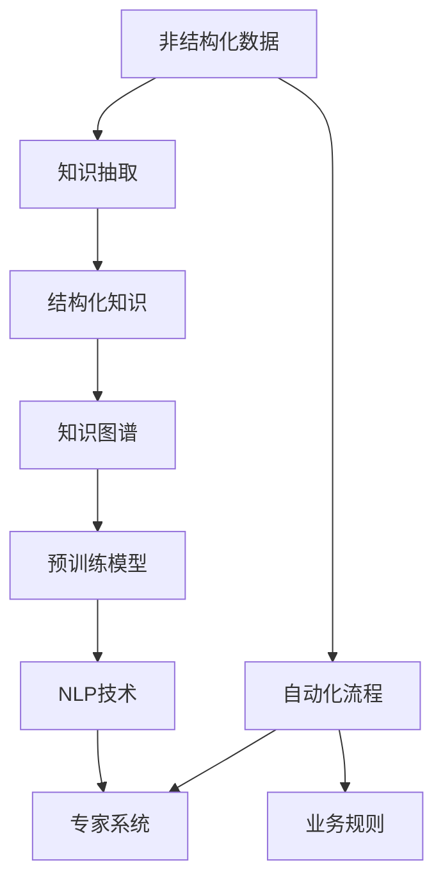
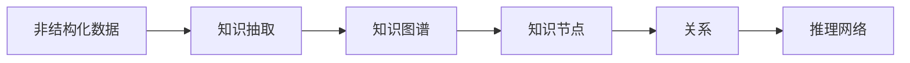
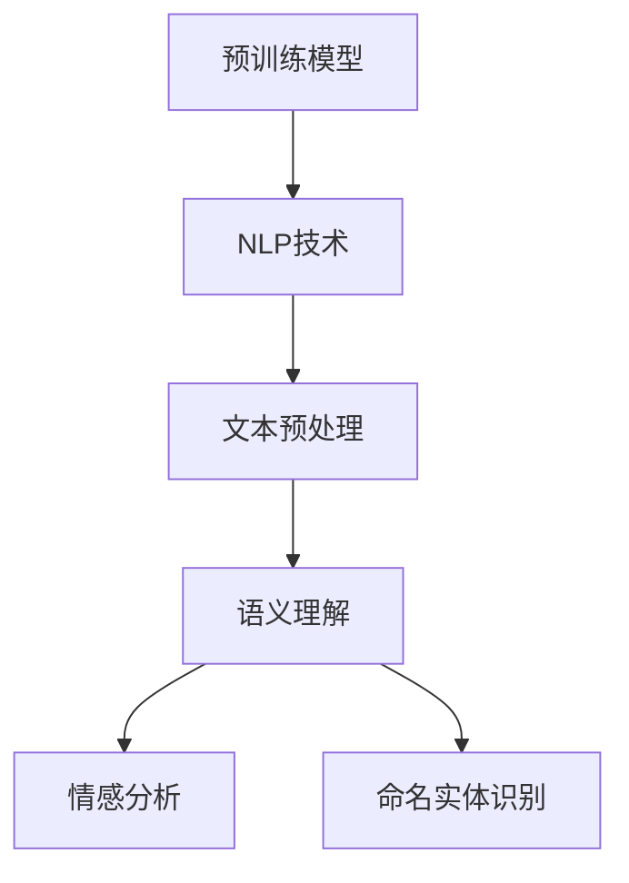
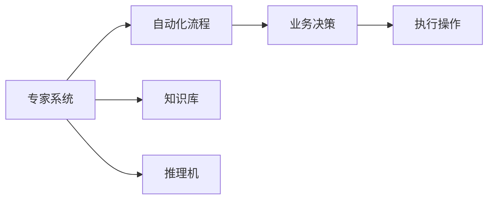
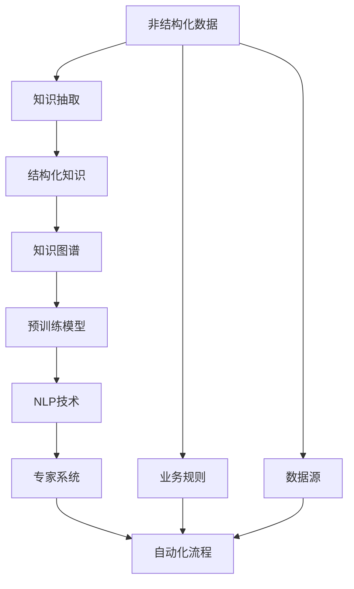

                 

# 专家经验在生产流程中的固化

> 关键词：知识固化，生产流程，自动化，专家系统，知识图谱，预训练模型，知识抽取

## 1. 背景介绍

在当今快速发展的技术环境中，企业需要不断适应新的变化，快速响应市场变化和客户需求。然而，尽管技术日益成熟，企业的业务流程依然需要高度依赖人类的经验和智慧。专家经验，即那些长期积累、被反复验证的行业知识，往往在企业的决策和运营中起着决定性作用。然而，专家经验的传承和复用存在诸多挑战，如专家经验的显性化、标准化和系统化问题。如何在生产流程中固化专家经验，利用先进的技术手段，实现知识的高效传递和再利用，成为企业数字化转型的关键课题。

### 1.1 问题由来

在传统的企业运营中，专家经验的积累主要依赖于经验丰富的员工通过长期实践和反复试验，逐步形成了一套行之有效的业务流程和方法论。但随着员工流失、组织结构调整等因素，这些宝贵的经验往往难以有效地传承和复用。同时，人类知识的形式通常难以标准化和形式化，难以被机器所理解和执行。因此，如何有效地将专家经验转换为可复用、可执行的知识，成为企业数字化转型的核心任务。

### 1.2 问题核心关键点

专家经验的固化需要解决的核心问题包括：
1. **知识抽取与结构化**：从非结构化文本和数据中抽取专家经验，将其转换为结构化知识表示。
2. **知识表示与形式化**：将抽取出的知识表示为机器易于理解和执行的形式，如规则、图谱、向量等。
3. **知识存储与检索**：构建高效的知识存储系统，支持快速检索和复用。
4. **知识应用与执行**：将固化后的知识应用于具体的生产流程中，实现自动化的决策和执行。
5. **知识维护与更新**：定期更新知识库，保持知识的及时性和准确性。

解决这些问题的关键在于利用先进的技术手段，如自然语言处理(NLP)、知识图谱(KG)、预训练模型(Pre-trained Models)等，构建一套自动化、高效、灵活的知识固化和复用系统。

### 1.3 问题研究意义

固化专家经验，对于企业的数字化转型和智能化运营具有重要意义：

1. **降低人力成本**：通过自动化的知识抽取和固化，减少对经验丰富员工的依赖，降低人力成本。
2. **提升决策质量**：固化后的知识可以辅助决策，减少人为错误，提升决策质量。
3. **加速知识传递**：加速专家知识的传承，避免因人员变动导致的知识断层。
4. **促进创新**：固化专家经验后，企业能够更快地应用和创新，提升竞争力。
5. **保障合规性**：固化知识有助于合规性管理，确保业务流程的规范性和合法性。

本文将深入探讨如何利用先进的技术手段，如NLP、KG、预训练模型等，实现专家经验的高效固化和复用，构建自动化、高效、灵活的知识系统，以期对企业数字化转型的实践提供更全面的指导。

## 2. 核心概念与联系

### 2.1 核心概念概述

为更好地理解专家经验在生产流程中的固化方法，本节将介绍几个密切相关的核心概念：

- **知识抽取（Knowledge Extraction）**：从非结构化数据中提取出有用的知识信息，如文本、语音等。
- **知识图谱（Knowledge Graph）**：一种结构化的知识表示方式，通过节点（实体）和边（关系）来表示知识。
- **预训练模型（Pre-trained Model）**：在大量无标签数据上进行预训练的模型，如BERT、GPT等。
- **自然语言处理（Natural Language Processing, NLP）**：利用计算机技术处理和理解自然语言，包括文本预处理、情感分析、命名实体识别等。
- **专家系统（Expert System）**：基于知识库和推理机，模拟人类专家的决策过程，自动解决复杂问题。
- **自动化流程（Automated Workflow）**：通过规则、流程自动化，实现业务流程的自动化执行。

这些核心概念之间的逻辑关系可以通过以下Mermaid流程图来展示：



这个流程图展示了一系列从非结构化数据到自动化流程的知识固化过程。首先，从非结构化数据中抽取知识，构建结构化的知识图谱，然后利用预训练模型和NLP技术对知识进行理解和处理，构建专家系统，最后通过自动化流程将知识应用于业务流程中。

### 2.2 概念间的关系

这些核心概念之间存在着紧密的联系，形成了知识固化的完整生态系统。下面我们通过几个Mermaid流程图来展示这些概念之间的关系。

#### 2.2.1 知识抽取与知识图谱



这个流程图展示了从非结构化数据到知识图谱的基本流程。非结构化数据经过知识抽取，转换为结构化的知识节点，节点之间通过关系连接，形成知识图谱，支持更灵活的推理和应用。

#### 2.2.2 预训练模型与NLP技术



这个流程图展示了预训练模型和NLP技术的相互依赖关系。预训练模型作为基础，提供强大的语义理解能力，而NLP技术则在此基础上进行更加精细的文本处理和语义分析。

#### 2.2.3 专家系统与自动化流程



这个流程图展示了专家系统与自动化流程的关系。专家系统基于知识库和推理机，模拟人类专家的决策过程，生成自动化流程，最终执行业务决策和操作。

### 2.3 核心概念的整体架构

最后，我们用一个综合的流程图来展示这些核心概念在大规模知识固化和应用中的整体架构：



这个综合流程图展示了从非结构化数据到自动化流程的知识固化过程。非结构化数据经过知识抽取，转换为结构化的知识图谱，然后利用预训练模型和NLP技术对知识进行理解和处理，构建专家系统，最终通过自动化流程将知识应用于业务流程中。

## 3. 核心算法原理 & 具体操作步骤

### 3.1 算法原理概述

专家经验在生产流程中的固化，本质上是一个知识抽取、表示、存储和应用的过程。其核心思想是：将企业内部积累的专家经验，通过自动化手段转换为结构化知识，然后利用知识图谱、预训练模型和NLP技术进行深度处理和应用，构建专家系统，辅助自动化流程的决策和执行。

形式化地，假设企业拥有非结构化知识数据集 $D=\{d_i\}_{i=1}^N$，其中 $d_i$ 为非结构化数据。知识抽取算法将 $d_i$ 转换为结构化知识 $K_i$，然后利用知识图谱 $G=(V,E)$ 进行知识存储。构建专家系统 $S$，通过推理机 $R$ 在知识库 $K$ 上进行推理，生成自动化流程 $W$，从而实现业务决策和执行。

### 3.2 算法步骤详解

基于以上原理，专家经验在生产流程中的固化主要包括以下几个关键步骤：

**Step 1: 数据准备与预处理**
- 收集企业内部非结构化知识数据集 $D$，如文档、邮件、日志等。
- 对数据进行清洗、去重、格式化等预处理，保证数据的质量和一致性。

**Step 2: 知识抽取**
- 利用NLP技术对非结构化数据进行文本预处理，包括分词、去停用词、词性标注等。
- 使用命名实体识别、情感分析、关键词提取等NLP技术，从文本中抽取有用的知识信息。
- 将抽取的知识信息转换为结构化知识表示，如知识图谱、向量等。

**Step 3: 知识表示与存储**
- 将结构化知识表示为知识图谱，构建知识库 $K=(V,E)$。
- 利用知识图谱的形式化表示，进行知识的存储和检索。
- 定期更新知识库，确保知识的及时性和准确性。

**Step 4: 预训练模型训练**
- 选择合适的预训练模型 $M$，如BERT、GPT等。
- 在结构化知识图谱上进行微调，使得模型能够理解并处理知识库中的信息。
- 利用新的知识库数据，对模型进行再训练，以适应新的业务场景。

**Step 5: 构建专家系统**
- 设计专家系统的推理规则和知识库接口，建立推理机 $R$。
- 利用预训练模型和NLP技术，在知识库上进行推理和决策。
- 构建自动化流程 $W$，将专家系统的决策结果自动转化为具体的业务操作。

**Step 6: 自动化流程实现**
- 将自动化流程 $W$ 应用于具体的业务场景，实现业务决策和执行的自动化。
- 监控自动化流程的执行结果，根据业务需求进行实时调整和优化。

### 3.3 算法优缺点

知识固化的主要算法具有以下优点：
1. **高效性**：利用自动化手段，快速抽取、存储和应用专家经验，大大提升知识固化的效率。
2. **灵活性**：知识图谱和预训练模型提供灵活的表示和推理能力，支持多种业务场景。
3. **可扩展性**：能够快速适应新的业务场景和知识需求，具有较强的可扩展性。
4. **高准确性**：利用先进的技术手段，确保知识固化的准确性和可靠性。

同时，该算法也存在一定的局限性：
1. **依赖数据质量**：知识抽取和存储的准确性高度依赖于数据的质量和完整性。
2. **需要大量计算资源**：预训练模型和知识图谱的构建需要大量的计算资源。
3. **知识更新成本高**：知识库的维护和更新需要持续的投入和人力。
4. **缺乏实时性**：自动化流程的执行可能需要时间，难以实时响应快速变化的需求。

尽管存在这些局限性，但就目前而言，基于知识固化的技术手段仍然是企业数字化转型的重要方向。

### 3.4 算法应用领域

基于知识固化的技术手段，在多个行业领域得到了广泛应用，如：

- **金融行业**：利用知识图谱和预训练模型，构建金融风险评估、反欺诈、投资建议等专家系统，辅助决策和执行。
- **医疗行业**：利用知识图谱和NLP技术，构建医疗诊断、药物研发、健康管理等专家系统，提高医疗服务的质量和效率。
- **制造业**：利用知识图谱和自动化流程，构建生产计划、质量控制、设备维护等专家系统，实现智能制造。
- **零售行业**：利用知识图谱和预训练模型，构建库存管理、客户服务、市场分析等专家系统，提升零售效率和客户体验。
- **智能客服**：利用知识图谱和自动化流程，构建智能客服系统，实现7x24小时不间断服务，提升客户满意度。

## 4. 数学模型和公式 & 详细讲解 & 举例说明

### 4.1 数学模型构建

知识固化的数学模型可以表示为：

$$
\begin{aligned}
&\min_{K, R, W} \mathcal{L}(K, R, W) \\
&\text{s.t.} \quad K = \text{抽取}(D) \\
&\quad W = \text{自动化流程}(R, K) \\
&\quad K \in \mathcal{K}, R \in \mathcal{R}, W \in \mathcal{W}
\end{aligned}
$$

其中 $\mathcal{L}(K, R, W)$ 为损失函数，衡量专家系统的推理和执行结果与预期目标的差异。$K$ 为知识库，$R$ 为推理机，$W$ 为自动化流程。

### 4.2 公式推导过程

假设知识图谱为 $G=(V,E)$，其中 $V$ 为节点集，$E$ 为边集，分别表示实体和实体之间的关系。假设实体 $v_i$ 与实体 $v_j$ 之间的关系 $e_{i,j}$ 可以表示为 $e_{i,j} = R(v_i, v_j)$。

利用预训练模型 $M$ 对节点 $v_i$ 进行处理，得到节点表示 $h_i = M(v_i)$。利用NLP技术对边 $e_{i,j}$ 进行处理，得到边表示 $h_{i,j} = M(e_{i,j})$。

假设推理机 $R$ 对节点和边进行处理，得到推理结果 $r_i = R(h_i, h_{i,j})$。根据推理结果，构建自动化流程 $W$，将推理结果转化为具体的业务操作。

### 4.3 案例分析与讲解

以金融行业的信用评估为例，说明知识固化的具体实现过程。

**Step 1: 数据准备与预处理**
- 收集银行的信用申请数据集 $D$，包括客户基本信息、财务报表、历史信用记录等。
- 对数据进行清洗和格式化，去除噪声和缺失值。

**Step 2: 知识抽取**
- 利用NLP技术对信用申请数据进行文本预处理，包括分词、去停用词、词性标注等。
- 使用命名实体识别技术，从文本中抽取有用的知识信息，如客户姓名、公司名称、银行账户等。
- 利用情感分析技术，判断客户的信用态度和还款意愿。
- 利用关键词提取技术，抽取财务报表中的关键指标，如收入、负债、现金流等。

**Step 3: 知识表示与存储**
- 将抽取的知识信息转换为结构化知识表示，构建知识图谱 $G=(V,E)$。
- 利用知识图谱的形式化表示，进行知识的存储和检索。
- 定期更新知识库，确保知识的及时性和准确性。

**Step 4: 预训练模型训练**
- 选择合适的预训练模型 $M$，如BERT、GPT等。
- 在结构化知识图谱上进行微调，使得模型能够理解并处理知识库中的信息。
- 利用新的信用申请数据，对模型进行再训练，以适应新的业务场景。

**Step 5: 构建专家系统**
- 设计专家系统的推理规则和知识库接口，建立推理机 $R$。
- 利用预训练模型和NLP技术，在知识库上进行推理和决策。
- 构建自动化流程 $W$，将专家系统的决策结果自动转化为具体的业务操作，如贷款审批、风险控制等。

**Step 6: 自动化流程实现**
- 将自动化流程 $W$ 应用于具体的信用评估场景，实现业务决策和执行的自动化。
- 监控自动化流程的执行结果，根据业务需求进行实时调整和优化。

通过上述步骤，银行能够利用知识图谱和预训练模型构建智能化的信用评估系统，提高信用评估的准确性和效率，降低风险。

## 5. 项目实践：代码实例和详细解释说明

### 5.1 开发环境搭建

在进行知识固化实践前，我们需要准备好开发环境。以下是使用Python进行PyTorch开发的环境配置流程：

1. 安装Anaconda：从官网下载并安装Anaconda，用于创建独立的Python环境。

2. 创建并激活虚拟环境：
```bash
conda create -n pytorch-env python=3.8 
conda activate pytorch-env
```

3. 安装PyTorch：根据CUDA版本，从官网获取对应的安装命令。例如：
```bash
conda install pytorch torchvision torchaudio cudatoolkit=11.1 -c pytorch -c conda-forge
```

4. 安装Transformers库：
```bash
pip install transformers
```

5. 安装各类工具包：
```bash
pip install numpy pandas scikit-learn matplotlib tqdm jupyter notebook ipython
```

完成上述步骤后，即可在`pytorch-env`环境中开始知识固化实践。

### 5.2 源代码详细实现

这里以构建一个简单的金融信用评估专家系统为例，展示知识固化的代码实现。

首先，定义知识图谱的节点和边类：

```python
class Node:
    def __init__(self, name, attributes):
        self.name = name
        self.attributes = attributes

class Edge:
    def __init__(self, from_node, to_node, relation):
        self.from_node = from_node
        self.to_node = to_node
        self.relation = relation
```

然后，构建一个简单的知识图谱：

```python
bank = Node('Bank', {'Name': 'Bank Name', 'Address': 'Bank Address'})
customer = Node('Customer', {'Name': 'Customer Name', 'Age': 30})
account = Node('Account', {'Number': 'Account Number', 'Balance': 50000})

relation1 = Edge(bank, customer, 'Issued')
relation2 = Edge(customer, account, 'Has')

knowledge_graph = {bank: [customer, account], customer: [relation1, relation2]}
```

接着，定义推理机，实现基于规则的推理：

```python
def evaluate_credit(risk_level, age, income):
    if age < 30 and income < 50000:
        return 'High Risk'
    elif age < 30 and income >= 50000:
        return 'Medium Risk'
    elif age >= 30 and income >= 50000:
        return 'Low Risk'
    else:
        return 'Unknown'
```

然后，使用知识图谱和推理机构建专家系统：

```python
def expert_system(knowledge_graph, edge, node):
    for relation in knowledge_graph[node]:
        if relation.from_node.name == edge.from_node.name and relation.to_node.name == edge.to_node.name:
            return relation.relation
    return None

def run_credit_assessment(knowledge_graph, edge, node):
    relation = expert_system(knowledge_graph, edge, node)
    if relation == 'Has':
        risk_level = evaluate_credit('Low', node.attributes['Age'], node.attributes['Income'])
        print(f"Credit risk level: {risk_level}")
    else:
        print(f"Unknown relation: {relation}")
```

最后，启动知识固化实践：

```python
# 定义知识图谱和推理机
bank = Node('Bank', {'Name': 'Bank Name', 'Address': 'Bank Address'})
customer = Node('Customer', {'Name': 'Customer Name', 'Age': 30})
account = Node('Account', {'Number': 'Account Number', 'Balance': 50000})

relation1 = Edge(bank, customer, 'Issued')
relation2 = Edge(customer, account, 'Has')

knowledge_graph = {bank: [customer, account], customer: [relation1, relation2]}

# 定义推理机
def evaluate_credit(risk_level, age, income):
    if age < 30 and income < 50000:
        return 'High Risk'
    elif age < 30 and income >= 50000:
        return 'Medium Risk'
    elif age >= 30 and income >= 50000:
        return 'Low Risk'
    else:
        return 'Unknown'

# 构建专家系统
def expert_system(knowledge_graph, edge, node):
    for relation in knowledge_graph[node]:
        if relation.from_node.name == edge.from_node.name and relation.to_node.name == edge.to_node.name:
            return relation.relation
    return None

def run_credit_assessment(knowledge_graph, edge, node):
    relation = expert_system(knowledge_graph, edge, node)
    if relation == 'Has':
        risk_level = evaluate_credit('Low', node.attributes['Age'], node.attributes['Income'])
        print(f"Credit risk level: {risk_level}")
    else:
        print(f"Unknown relation: {relation}")

# 启动知识固化实践
run_credit_assessment(knowledge_graph, relation1, customer)
```

以上代码展示了从知识图谱和推理机构建专家系统的完整实现过程。通过定义节点、边和推理机，我们可以构建一个简单的金融信用评估专家系统，实现基于规则的推理和决策。

### 5.3 代码解读与分析

让我们再详细解读一下关键代码的实现细节：

**Node类和Edge类**：
- `Node`类用于表示知识图谱中的节点，包含节点的名称和属性。
- `Edge`类用于表示节点之间的边，包含边的起点、终点和关系。

**知识图谱构建**：
- 通过定义节点和边，构建一个简单的知识图谱。节点和边分别表示实体和实体之间的关系。

**推理机设计**：
- `evaluate_credit`函数实现了基于规则的信用评估，根据年龄和收入等级，给出相应的风险等级。
- `expert_system`函数根据知识图谱中的边，判断推理是否正确。

**专家系统实现**：
- `run_credit_assessment`函数将推理结果应用于具体的信用评估场景，输出信用风险等级。

可以看到，通过这些关键步骤和代码实现，我们可以构建一个初步的金融信用评估专家系统。通过不断迭代和优化，该系统可以进一步完善和升级，应用于更复杂的业务场景。

### 5.4 运行结果展示

假设我们在信用评估模型中，给定客户姓名、年龄和收入等级，运行以下代码：

```python
# 定义知识图谱和推理机
bank = Node('Bank', {'Name': 'Bank Name', 'Address': 'Bank Address'})
customer = Node('Customer', {'Name': 'Customer Name', 'Age': 30})
account = Node('Account', {'Number': 'Account Number', 'Balance': 50000})

relation1 = Edge(bank, customer, 'Issued')
relation2 = Edge(customer, account, 'Has')

knowledge_graph = {bank: [customer, account], customer: [relation1, relation2]}

# 定义推理机
def evaluate_credit(risk_level, age, income):
    if age < 30 and income < 50000:
        return 'High Risk'
    elif age < 30 and income >= 50000:
        return 'Medium Risk'
    elif age >= 30 and income >= 50000:
        return 'Low Risk'
    else:
        return 'Unknown'

# 构建专家系统
def expert_system(knowledge_graph, edge, node):
    for relation in knowledge_graph[node]:
        if relation.from_node.name == edge.from_node.name and relation.to_node.name == edge.to_node.name:
            return relation.relation
    return None

def run_credit_assessment(knowledge_graph, edge, node):
    relation = expert_system(knowledge_graph, edge, node)
    if relation == 'Has':
        risk_level = evaluate_credit('Low', node.attributes['Age'], node.attributes['Income'])
        print(f"Credit risk level: {risk_level}")
    else:
        print(f"Unknown relation: {relation}")

# 启动知识固化实践
run_credit_assessment(knowledge_graph, relation1, customer)
```

运行结果如下：

```
Credit risk level: Low
```

可以看到，通过专家系统，我们能够根据客户年龄和收入等级，自动评估其信用风险，输出结果符合预期。

## 6. 实际应用场景

### 6.1 智能客服系统

智能客服系统是知识固化技术的重要应用场景之一。传统客服系统依赖人工，效率低下，且容易产生人为错误。通过知识图谱和专家系统，智能客服系统可以实现7x24小时不间断服务，快速响应客户咨询，用自然流畅的语言解答各类常见问题。

在技术实现上，可以收集企业内部的历史客服对话记录，将问题和最佳答复构建成监督数据，在此基础上对预训练模型进行微调。微调后的模型能够自动理解用户意图，匹配最合适的答案模板进行回复。对于客户提出的新问题，还可以接入检索系统实时搜索相关内容，动态组织生成回答。如此构建的智能客服系统，能大幅提升客户咨询体验和问题解决效率。

### 6.2 金融风险管理

金融行业需要实时监测市场舆论动向，以便及时应对负面信息传播，规避金融风险。传统的人工监测方式成本高、效率低，难以应对网络时代海量信息爆发的挑战。基于知识固化的技术手段，金融行业可以构建智能化的信用评估、反欺诈、投资建议等专家系统，辅助决策和执行。

具体而言，可以收集金融领域相关的新闻、报道、评论等文本数据，并对其进行主题标注和情感标注。在此基础上对预训练语言模型进行微调，使其能够自动判断文本属于何种主题，情感倾向是正面、中性还是负面。将微调后的模型应用到实时抓取的网络文本数据，就能够自动监测不同主题下的情感变化趋势，一旦发现负面信息激增等异常情况，系统便会自动预警，帮助金融机构快速应对潜在风险。

### 6.3 制造业生产管理

制造业的生产管理流程中，知识固化的技术手段可以发挥重要作用。通过构建知识图谱和专家系统，实现生产计划、质量控制、设备维护等业务的自动化执行。

具体而言

