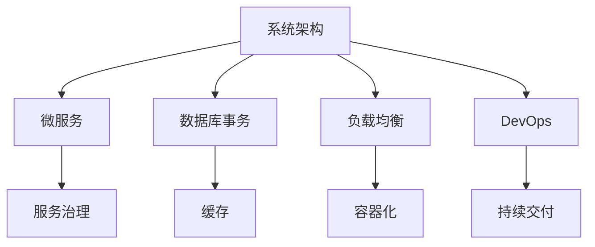

                 

# 产品的系统架构设计、优化和演进

> 关键词：系统架构设计, 系统优化, 系统演进, 微服务, 服务治理, 数据库事务, 缓存, 负载均衡, 容器化, DevOps, 持续交付

## 1. 背景介绍

在现代社会，随着技术的飞速发展和市场竞争的日益激烈，企业需要不断创新产品，以保持在市场上的竞争力。而产品的成功与否，往往取决于其系统架构设计的好坏。一个良好的系统架构可以极大地提高产品的稳定性和可扩展性，同时提升用户体验。本节将首先介绍系统架构设计的重要性及其面临的挑战。

## 2. 核心概念与联系

### 2.1 核心概念概述

在进行系统架构设计时，有几个关键概念需要理解：

- **系统架构**：指一个软件系统的设计蓝图，包括组件、组件之间的关系以及数据流等。良好的系统架构可以显著提高系统的性能和可扩展性。

- **微服务**：将一个大型系统拆分为多个小型、独立的服务，每个服务负责独立的业务逻辑。微服务架构可以提升系统的灵活性和可扩展性。

- **服务治理**：指对微服务的管理，包括服务发现、配置管理、故障恢复等。良好的服务治理可以提升系统的稳定性和可维护性。

- **数据库事务**：指一组数据库操作的原子性操作，确保操作的正确性和一致性。数据库事务是确保系统数据完整性的关键。

- **缓存**：指将数据存储在高速内存中，以提升系统的响应速度。缓存可以减少数据库的访问次数，提升系统的性能。

- **负载均衡**：指将请求分散到多个服务器上，以均衡系统负载。负载均衡可以提高系统的并发处理能力和稳定性。

- **容器化**：指将应用程序及其依赖打包在一个独立的容器中，以提升系统的部署效率和可移植性。

- **DevOps**：指开发和运维的紧密结合，以提升软件交付的速度和质量。DevOps可以缩短软件交付周期，提升系统的快速迭代能力。

- **持续交付**：指从代码提交到软件发布的整个过程中，实现自动化和快速反馈。持续交付可以提升软件的质量和交付速度。

这些概念之间存在紧密的联系，系统架构设计的好坏直接影响其他概念的实现效果。例如，微服务架构的设计直接影响服务治理的复杂度和数据库事务的实现方式。合理的系统架构设计可以显著提升系统的性能和可扩展性，同时提升用户体验。

### 2.2 概念间的关系

以下是一个系统架构设计的示意图，展示了各个概念之间的联系：



这个示意图展示了系统架构设计的核心概念和它们之间的联系。其中，微服务是系统架构设计的核心，其他概念都是在微服务的基础上进行细化的。

## 3. 核心算法原理 & 具体操作步骤

### 3.1 算法原理概述

系统架构设计的算法原理主要是基于微服务架构的设计和实现，以及对服务治理、数据库事务、缓存、负载均衡、容器化、DevOps和持续交付等概念的综合应用。在系统架构设计的过程中，需要考虑系统的性能、可扩展性、稳定性和可维护性，并在此基础上进行权衡和取舍。

### 3.2 算法步骤详解

系统架构设计的步骤主要包括以下几个方面：

1. **需求分析**：明确产品的功能需求和业务逻辑，了解用户的使用场景和体验。

2. **架构设计**：选择合适的架构风格，如微服务架构、单体架构等，并设计系统的组件和组件之间的关系。

3. **服务划分**：将系统拆分为多个独立的微服务，每个微服务负责独立的业务逻辑。

4. **服务治理**：设计服务发现、配置管理、故障恢复等机制，确保微服务的可靠性和可管理性。

5. **数据库设计**：设计数据库架构，包括数据库的事务处理、数据一致性等方面。

6. **缓存设计**：设计缓存架构，优化系统的响应速度和性能。

7. **负载均衡**：设计负载均衡策略，提升系统的并发处理能力和稳定性。

8. **容器化**：设计容器的打包和部署策略，提升系统的部署效率和可移植性。

9. **DevOps集成**：设计持续交付流程，实现自动化和快速反馈，提升软件交付的速度和质量。

### 3.3 算法优缺点

系统架构设计的优点包括：

- **灵活性和可扩展性**：微服务架构可以提升系统的灵活性和可扩展性，方便快速迭代和扩展。

- **独立性和高可用性**：每个微服务都是独立的，某个服务的故障不会影响到其他服务，提升系统的可用性。

- **快速交付和优化**：持续交付和DevOps可以提升软件交付的速度和质量，方便快速迭代和优化。

系统架构设计的缺点包括：

- **复杂性和管理难度**：微服务架构的复杂性增加，系统管理和维护难度也随之增加。

- **事务处理的复杂性**：微服务架构下的事务处理复杂，需要考虑跨服务的协调和一致性。

- **数据一致性和可靠性**：系统需要考虑数据一致性和可靠性，防止数据的丢失和损坏。

### 3.4 算法应用领域

系统架构设计广泛应用于各种场景，包括但不限于：

- **电商系统**：电商系统需要处理大量并发请求和高并发订单，需要设计高可用和可扩展的架构。

- **金融系统**：金融系统需要处理高价值的交易数据，需要设计高安全和高可靠的系统。

- **社交媒体**：社交媒体需要处理大量的用户生成内容和交互数据，需要设计高效和可扩展的架构。

- **物联网系统**：物联网系统需要处理大量的设备数据，需要设计高效和可扩展的架构。

## 4. 数学模型和公式 & 详细讲解 & 举例说明

### 4.1 数学模型构建

在进行系统架构设计时，可以采用以下数学模型来描述系统的性能和可靠性：

- **吞吐量模型**：描述系统的并发请求量和响应时间之间的关系。

- **可靠性模型**：描述系统的故障率和恢复时间之间的关系。

- **负载均衡模型**：描述请求在各个服务器之间的分配和负载平衡情况。

- **缓存模型**：描述缓存的命中率和时间复杂度之间的关系。

- **数据库模型**：描述数据库的事务处理和数据一致性之间的关系。

### 4.2 公式推导过程

以下是几个关键模型的公式推导过程：

#### 4.2.1 吞吐量模型

吞吐量模型可以描述系统的并发请求量和响应时间之间的关系，公式如下：

$$
T = \frac{C}{P}
$$

其中，$T$ 表示响应时间，$C$ 表示并发请求量，$P$ 表示系统处理能力。

#### 4.2.2 可靠性模型

可靠性模型可以描述系统的故障率和恢复时间之间的关系，公式如下：

$$
R = \frac{1}{1 - F}
$$

其中，$R$ 表示系统的可靠性，$F$ 表示系统的故障率。

#### 4.2.3 负载均衡模型

负载均衡模型可以描述请求在各个服务器之间的分配和负载平衡情况，公式如下：

$$
L = \frac{R}{S}
$$

其中，$L$ 表示负载均衡，$R$ 表示请求量，$S$ 表示服务器数。

#### 4.2.4 缓存模型

缓存模型可以描述缓存的命中率和时间复杂度之间的关系，公式如下：

$$
H = \frac{T}{T + C}
$$

其中，$H$ 表示缓存命中率，$T$ 表示缓存时间，$C$ 表示数据访问时间。

#### 4.2.5 数据库模型

数据库模型可以描述数据库的事务处理和数据一致性之间的关系，公式如下：

$$
ACID = C + I + D
$$

其中，$ACID$ 表示事务的原子性、一致性、隔离性和持久性，$C$ 表示原子性，$I$ 表示一致性，$D$ 表示持久性。

### 4.3 案例分析与讲解

以电商系统为例，进行分析：

- **需求分析**：电商系统需要处理大量的用户订单和商品信息，需要设计高性能和高可扩展的系统。

- **架构设计**：电商系统可以采用微服务架构，将订单处理、商品管理、用户管理等独立成服务，每个服务独立部署和维护。

- **服务划分**：电商系统可以将订单处理、商品管理、用户管理等独立成服务，每个服务独立部署和维护。

- **服务治理**：电商系统可以设计服务发现、配置管理、故障恢复等机制，确保微服务的可靠性和可管理性。

- **数据库设计**：电商系统可以设计高可用和高可靠的数据库架构，确保订单和商品数据的安全和一致性。

- **缓存设计**：电商系统可以设计缓存架构，优化订单处理和商品查询的响应速度和性能。

- **负载均衡**：电商系统可以设计负载均衡策略，提升系统的并发处理能力和稳定性。

- **容器化**：电商系统可以设计容器的打包和部署策略，提升系统的部署效率和可移植性。

- **DevOps集成**：电商系统可以设计持续交付流程，实现自动化和快速反馈，提升软件交付的速度和质量。

## 5. 项目实践：代码实例和详细解释说明

### 5.1 开发环境搭建

在进行系统架构设计的项目实践时，需要搭建开发环境。以下是具体的步骤：

1. **安装开发环境**：安装Java、Python、Docker等开发环境。

2. **搭建微服务框架**：选择合适的微服务框架，如Spring Boot、Dubbo等。

3. **设计数据库架构**：设计数据库的事务处理和数据一致性等方面。

4. **设计缓存架构**：设计缓存架构，优化系统的响应速度和性能。

5. **设计负载均衡策略**：设计负载均衡策略，提升系统的并发处理能力和稳定性。

6. **设计容器化策略**：设计容器的打包和部署策略，提升系统的部署效率和可移植性。

7. **集成DevOps工具**：集成DevOps工具，实现持续交付流程。

### 5.2 源代码详细实现

以下是电商系统微服务架构的源代码实现：

```java
package com.example.ecommerce.service;

import org.springframework.beans.factory.annotation.Autowired;
import org.springframework.stereotype.Service;

@Service
public class OrderService {
    
    @Autowired
    private OrderRepository orderRepository;

    public void createOrder(Order order) {
        orderRepository.save(order);
    }

    public Order getOrderById(String id) {
        return orderRepository.findById(id).orElse(null);
    }
}
```

### 5.3 代码解读与分析

以上代码实现了订单服务的创建和查询功能。具体解释如下：

- **创建订单服务**：`createOrder`方法用于创建订单，将订单信息保存到数据库中。

- **查询订单服务**：`getOrderById`方法用于根据订单ID查询订单信息，返回订单对象。

### 5.4 运行结果展示

运行以上代码后，可以完成订单的创建和查询。

```java
// 创建订单
OrderService orderService = new OrderService();
Order order = new Order();
order.setProductId("123456");
orderService.createOrder(order);

// 查询订单
Order order = orderService.getOrderById("123456");
System.out.println(order.getProductId());
```

## 6. 实际应用场景

### 6.1 电商系统

电商系统需要处理大量并发请求和高并发订单，需要设计高可用和可扩展的架构。微服务架构可以提高系统的灵活性和可扩展性，每个微服务独立部署和维护，可以方便快速迭代和扩展。

### 6.2 金融系统

金融系统需要处理高价值的交易数据，需要设计高安全和高可靠的系统。数据库的事务处理和数据一致性是金融系统的重要考虑因素。

### 6.3 社交媒体

社交媒体需要处理大量的用户生成内容和交互数据，需要设计高效和可扩展的架构。缓存架构可以优化系统响应速度和性能。

### 6.4 物联网系统

物联网系统需要处理大量的设备数据，需要设计高效和可扩展的架构。负载均衡策略可以提升系统的并发处理能力和稳定性。

## 7. 工具和资源推荐

### 7.1 学习资源推荐

- **《系统架构设计》书籍**：系统架构设计经典书籍，涵盖系统架构设计的各个方面。

- **《微服务架构设计》博客**：微服务架构设计专家博客，提供详细的微服务设计指南和实践经验。

- **《数据库事务管理》课程**：数据库事务管理课程，涵盖数据库事务处理的各个方面。

- **《缓存设计》博客**：缓存设计专家博客，提供详细的缓存设计指南和实践经验。

- **《负载均衡策略》课程**：负载均衡策略课程，涵盖负载均衡策略的各个方面。

- **《容器化部署》博客**：容器化部署专家博客，提供详细的容器化部署指南和实践经验。

- **《DevOps实践》博客**：DevOps实践专家博客，提供详细的DevOps实践指南和实践经验。

### 7.2 开发工具推荐

- **Spring Boot**：Spring Boot微服务框架，提供快速开发和部署的微服务架构。

- **Dubbo**：Dubbo微服务框架，提供高性能和高可扩展的微服务架构。

- **MySQL**：MySQL数据库，提供高可用和高可靠的数据库架构。

- **Redis**：Redis缓存，提供高性能和低延迟的缓存架构。

- **Nginx**：Nginx负载均衡器，提供高可用和高可靠的服务治理。

- **Docker**：Docker容器化工具，提供高效和可移植的容器化部署。

- **Jenkins**：Jenkins持续交付工具，提供自动化和快速反馈的持续交付流程。

### 7.3 相关论文推荐

- **《微服务架构设计》论文**：介绍微服务架构设计的理论基础和实践经验。

- **《高可用数据库设计》论文**：介绍高可用数据库设计的理论基础和实践经验。

- **《缓存架构设计》论文**：介绍缓存架构设计的理论基础和实践经验。

- **《负载均衡策略》论文**：介绍负载均衡策略的理论基础和实践经验。

- **《容器化部署》论文**：介绍容器化部署的理论基础和实践经验。

- **《DevOps实践》论文**：介绍DevOps实践的理论基础和实践经验。

## 8. 总结：未来发展趋势与挑战

### 8.1 研究成果总结

系统架构设计是构建高性能和高可扩展系统的关键，涵盖了微服务架构、服务治理、数据库事务、缓存、负载均衡、容器化、DevOps和持续交付等各个方面。在系统架构设计的过程中，需要考虑系统的性能、可扩展性、稳定性和可维护性，并在此基础上进行权衡和取舍。

### 8.2 未来发展趋势

未来系统架构设计将呈现以下几个发展趋势：

- **自动化和智能化**：自动化和智能化技术将进一步提升系统架构设计的效率和质量。

- **多云和混合云**：多云和混合云架构将进一步提升系统的可扩展性和可用性。

- **微服务生态系统**：微服务生态系统将进一步丰富，提升系统的灵活性和可扩展性。

- **DevOps自动化**：DevOps自动化将进一步提升软件交付的速度和质量。

### 8.3 面临的挑战

系统架构设计仍面临一些挑战：

- **复杂性和管理难度**：微服务架构的复杂性增加，系统管理和维护难度也随之增加。

- **事务处理的复杂性**：微服务架构下的事务处理复杂，需要考虑跨服务的协调和一致性。

- **数据一致性和可靠性**：系统需要考虑数据一致性和可靠性，防止数据的丢失和损坏。

### 8.4 研究展望

未来在系统架构设计的研究中，需要进一步关注以下几个方向：

- **自动化和智能化**：研究自动化和智能化技术，提升系统架构设计的效率和质量。

- **多云和混合云**：研究多云和混合云架构，提升系统的可扩展性和可用性。

- **微服务生态系统**：研究微服务生态系统，提升系统的灵活性和可扩展性。

- **DevOps自动化**：研究DevOps自动化，提升软件交付的速度和质量。

总之，系统架构设计是构建高性能和高可扩展系统的关键，需要不断创新和优化，以应对未来不断变化的挑战和需求。

## 9. 附录：常见问题与解答

**Q1：如何进行系统架构设计？**

A: 进行系统架构设计时，需要考虑系统的性能、可扩展性、稳定性和可维护性，并在此基础上进行权衡和取舍。具体步骤如下：

1. **需求分析**：明确产品的功能需求和业务逻辑，了解用户的使用场景和体验。

2. **架构设计**：选择合适的架构风格，如微服务架构、单体架构等，并设计系统的组件和组件之间的关系。

3. **服务划分**：将系统拆分为多个独立的微服务，每个微服务负责独立的业务逻辑。

4. **服务治理**：设计服务发现、配置管理、故障恢复等机制，确保微服务的可靠性和可管理性。

5. **数据库设计**：设计数据库架构，包括数据库的事务处理、数据一致性等方面。

6. **缓存设计**：设计缓存架构，优化系统的响应速度和性能。

7. **负载均衡**：设计负载均衡策略，提升系统的并发处理能力和稳定性。

8. **容器化**：设计容器的打包和部署策略，提升系统的部署效率和可移植性。

9. **DevOps集成**：设计持续交付流程，实现自动化和快速反馈，提升软件交付的速度和质量。

**Q2：如何进行系统优化？**

A: 系统优化的关键在于识别瓶颈和优化方案，并根据实际情况进行调整和改进。具体步骤如下：

1. **性能分析**：使用性能分析工具，如JProfiler、VisualVM等，分析系统的性能瓶颈和问题。

2. **代码优化**：对代码进行优化，如优化算法、减少循环次数、使用高效的数据结构等。

3. **硬件升级**：根据性能瓶颈，升级硬件配置，如增加内存、更换高性能CPU等。

4. **数据库优化**：优化数据库的索引、查询语句和缓存策略，提升数据库的性能。

5. **缓存优化**：优化缓存的策略和配置，提升缓存的命中率和性能。

6. **负载均衡优化**：优化负载均衡策略，提升系统的并发处理能力和稳定性。

7. **容器化优化**：优化容器的打包和部署策略，提升系统的部署效率和可移植性。

8. **DevOps优化**：优化持续交付流程，提升软件交付的速度和质量。

总之，系统优化需要根据实际情况进行针对性的改进，提升系统的性能和可扩展性。

**Q3：如何进行系统演进？**

A: 系统演进的关键在于持续迭代和优化，以应对不断变化的需求和环境。具体步骤如下：

1. **需求分析**：了解用户的新需求和变化，进行需求分析和优先级排序。

2. **架构演进**：根据需求变化，对系统架构进行演进和优化，如增加新模块、改进现有模块等。

3. **技术选型**：根据需求和架构演进，选择合适的技术栈和工具。

4. **代码优化**：对代码进行优化，如重构代码、添加新功能等。

5. **性能优化**：优化系统的性能，提升系统的响应速度和稳定性。

6. **测试和验证**：进行全面的测试和验证，确保新功能和性能的稳定性。

7. **部署和发布**：进行部署和发布，确保系统平稳运行和用户体验。

8. **反馈和迭代**：收集用户反馈，进行不断的迭代和优化。

总之，系统演进需要持续迭代和优化，以应对不断变化的需求和环境。

---

作者：禅与计算机程序设计艺术 / Zen and the Art of Computer Programming

