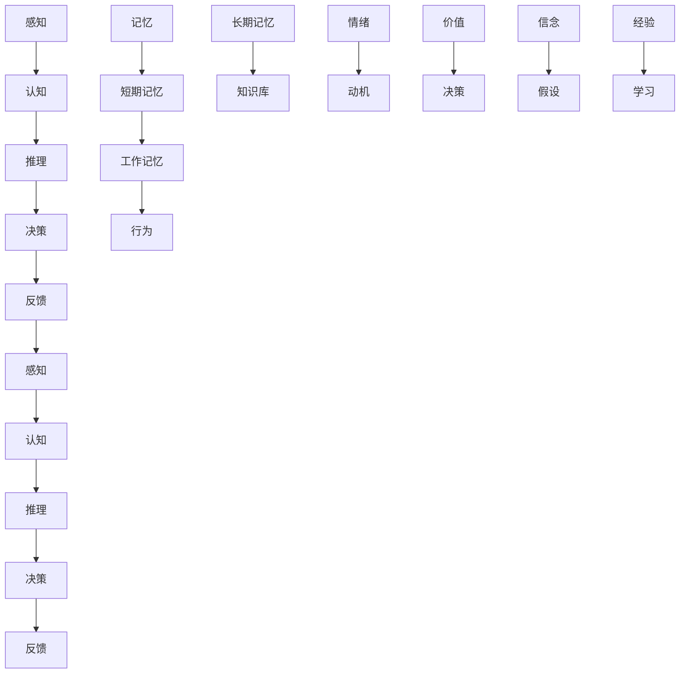

                 

# 人们面对未知事物的认知路径

## 1. 背景介绍

### 1.1 问题由来
在人工智能、认知科学和心理学等领域，了解和模拟人类面对未知事物时的认知路径，是研究智能行为的重要切入点。这一领域涉及到多学科知识的交叉，包括神经科学、认知心理学、哲学、社会学等多个方面。通过对这一路径的深入探讨，可以帮助我们更好地理解人类智能的本质，同时为人工智能技术的开发提供理论基础。

### 1.2 问题核心关键点
人们在面对未知事物时，认知路径主要包括以下几个步骤：感知、认知、推理、决策和反馈。每个步骤都涉及复杂的心理过程和神经活动。理解这些步骤的机制，可以揭示人类智能的运作方式，并为智能系统设计提供参考。

### 1.3 问题研究意义
深入探讨人们面对未知事物的认知路径，对于人工智能技术的研发、教育科学和人类认知研究具有重要意义：

1. **推动人工智能的发展**：理解人类认知路径，有助于设计更贴近人类思维模式的人工智能系统，提高其可解释性和可信度。
2. **促进教育科学**：研究认知路径，可以揭示学习与认知过程的内在机制，为教育方法的设计提供理论支撑。
3. **深化人类认知研究**：该领域的研究能够揭示人类认知的本质，推动神经科学、心理学等领域的发展。
4. **提高决策质量**：理解人类决策过程，可以开发更高效、更科学的决策支持系统，提升决策质量。

## 2. 核心概念与联系

### 2.1 核心概念概述

为了更好地理解人们在面对未知事物时的认知路径，我们需要先介绍一些关键概念：

- **感知(Perception)**：个体通过感官接收外界信息，如视觉、听觉、触觉等。感知是认知过程的起点。
- **认知(Cognition)**：个体对感知到的信息进行加工、组织和解释的过程。包括注意、记忆、表征和分类等。
- **推理(Reasoning)**：基于已有知识和经验，对未知事物进行推断和假设。推理能力是智能的核心。
- **决策(Decision Making)**：根据推理结果，选择行动方案的过程。决策涉及情绪、动机、价值评估等。
- **反馈(Feedback)**：决策结果对认知过程的反馈，影响后续的感知、认知和决策。

这些概念共同构成了认知路径的核心框架，帮助我们理解人类面对未知事物时的心理活动和行为。

### 2.2 概念间的关系

这些核心概念之间的关系可以通过以下Mermaid流程图来展示：


这个流程图展示了认知路径的各个环节及其相互作用。感知、认知、推理、决策和反馈是相互交织的，形成一个动态的循环系统。

### 2.3 核心概念的整体架构

最后，我们用一个综合的流程图来展示这些核心概念在大脑中的整体架构：



这个综合流程图展示了感知、认知、推理、决策、反馈等环节与记忆、知识库、工作记忆、行为、情绪、动机、价值、信念、假设、经验、学习等子系统的相互作用。

## 3. 核心算法原理 & 具体操作步骤
### 3.1 算法原理概述

理解人类面对未知事物的认知路径，需要从神经科学、认知心理学和人工智能等多个角度进行深入研究。以下是基于认知科学和人工智能的认知路径模型：

- **感知阶段**：通过感知系统接收外界信息，并进行初步处理。这一过程涉及感官的刺激和神经元的活动。
- **认知阶段**：对感知信息进行加工和解释，形成内部表征。这一过程依赖于神经网络的连接和激活机制。
- **推理阶段**：利用内部表征和知识库，进行推理和假设。这一过程涉及符号计算和神经网络的协同工作。
- **决策阶段**：基于推理结果和动机、价值等因素，做出决策。这一过程依赖于决策树、强化学习等算法。
- **反馈阶段**：对决策结果进行评估，并将反馈信息传递到感知和认知系统，影响后续的认知过程。

### 3.2 算法步骤详解

基于上述认知路径模型，我们可以将认知过程分解为几个关键步骤：

1. **感知处理**：通过传感器接收外界信息，并将其转化为神经信号。这一过程依赖于生物电生理机制和神经元的激活。
2. **信息编码**：将感知信息转化为内部表征，进行编码和存储。这一过程依赖于神经元之间的突触连接和信号传递。
3. **信息加工**：对内部表征进行加工和组织，形成高层次的抽象表示。这一过程依赖于神经网络的学习和推理机制。
4. **信息匹配**：利用知识库和先验知识，进行信息匹配和模式识别。这一过程依赖于符号计算和逻辑推理。
5. **决策输出**：根据推理结果和动机、价值等因素，选择行动方案。这一过程依赖于决策树和强化学习算法。
6. **反馈调节**：对决策结果进行评估，并将反馈信息传递到感知和认知系统，影响后续的认知过程。这一过程依赖于神经反馈机制和记忆系统。

### 3.3 算法优缺点

认知路径模型具有以下优点：

1. **全面性**：涵盖了感知、认知、推理、决策和反馈等多个环节，提供了全面的认知路径理解。
2. **系统性**：各个环节相互关联，形成了一个动态的系统，有助于揭示认知过程的内在机制。
3. **普适性**：该模型适用于多种认知任务和情境，具有广泛的应用前景。

同时，该模型也存在一些局限性：

1. **复杂性**：模型涉及多个环节和多种机制，理解起来较为复杂。
2. **生物基础**：模型的生物基础较为抽象，难以直接应用于生物神经元的模拟。
3. **理论深度**：对神经网络和符号计算的依赖较多，理论深度有待进一步挖掘。

### 3.4 算法应用领域

认知路径模型在多个领域都有广泛应用：

- **认知科学**：研究人类认知过程的机制，揭示人类智能的本质。
- **心理学**：通过实验和理论研究，揭示认知路径中的心理过程和行为模式。
- **神经科学**：研究神经元的活动和突触连接，揭示感知、认知和决策的神经基础。
- **人工智能**：模拟人类认知路径，设计智能算法和系统，提高人工智能的可解释性和可信度。
- **教育学**：理解学习过程，设计更有效的教学方法和评估体系。

## 4. 数学模型和公式 & 详细讲解  
### 4.1 数学模型构建

为了更精确地理解认知路径，我们可以构建一个简单的数学模型：

设 $S$ 为感知系统的输入，$P(S)$ 为感知处理的概率分布函数，$C(S)$ 为认知系统的输出，$R(C(S))$ 为推理系统的输出，$D(R(C(S)))$ 为决策系统的输出，$F(D(R(C(S))))$ 为反馈系统的输出。则认知路径可以表示为：

$$
S \rightarrow P(S) \rightarrow C(S) \rightarrow R(C(S)) \rightarrow D(R(C(S))) \rightarrow F(D(R(C(S)))) \rightarrow C(S) \rightarrow \cdots
$$

### 4.2 公式推导过程

以推理阶段的公式推导为例，假设认知系统的输出 $C(S)$ 为一个高维向量，其内部表征 $T$ 由多个神经元 $N_1, N_2, \ldots, N_k$ 的激活状态 $a_1, a_2, \ldots, a_k$ 组成。则推理过程可以表示为：

$$
T = \sum_{i=1}^k W_i a_i
$$

其中 $W_i$ 为权重矩阵，$a_i$ 为神经元 $N_i$ 的激活状态。推理系统的输出 $R(C(S))$ 可以表示为：

$$
R(C(S)) = \phi(T)
$$

其中 $\phi$ 为激活函数，如 ReLU、Sigmoid 等。

### 4.3 案例分析与讲解

以人面对未知事物的认知过程为例，假设一个人进入一个陌生的环境。首先，其视觉系统接收环境信息，并将其转化为神经信号，这一过程涉及视网膜的感光细胞和神经元的活动。然后，这些信号被传递到大脑的视觉处理区，进行信息编码和加工。接着，大脑利用已有的知识库，对新环境进行推理和假设，如判断是否安全、是否有食物等。最后，根据推理结果和动机、价值等因素，做出决策，如前进或停留。决策结果通过反馈机制，传递到感知和认知系统，影响后续的认知过程。

## 5. 项目实践：代码实例和详细解释说明
### 5.1 开发环境搭建

为了进行认知路径模型的开发，我们需要搭建一个基于神经网络和符号计算的开发环境。以下是一些关键步骤：

1. **安装 Python 和相关库**：
   ```bash
   conda create -n cognition-env python=3.8
   conda activate cognition-env
   pip install numpy scipy sympy pytorch torchvision transformers
   ```

2. **搭建神经网络模型**：
   ```python
   import torch
   import torch.nn as nn
   import torch.optim as optim

   class PerceptionLayer(nn.Module):
       def __init__(self):
           super(PerceptionLayer, self).__init__()
           self.conv1 = nn.Conv2d(in_channels=3, out_channels=32, kernel_size=3, stride=1, padding=1)
           self.relu = nn.ReLU()
           self.pool = nn.MaxPool2d(kernel_size=2, stride=2)

       def forward(self, x):
           x = self.conv1(x)
           x = self.relu(x)
           x = self.pool(x)
           return x

   class CognitionLayer(nn.Module):
       def __init__(self):
           super(CognitionLayer, self).__init__()
           self.fc1 = nn.Linear(in_features=32*32*32, out_features=256)
           self.relu = nn.ReLU()
           self.fc2 = nn.Linear(in_features=256, out_features=128)
           self.softmax = nn.Softmax(dim=1)

       def forward(self, x):
           x = x.view(x.size(0), -1)
           x = self.fc1(x)
           x = self.relu(x)
           x = self.fc2(x)
           x = self.softmax(x)
           return x

   class ReasoningLayer(nn.Module):
       def __init__(self):
           super(ReasoningLayer, self).__init__()
           self.fc1 = nn.Linear(in_features=128, out_features=128)
           self.relu = nn.ReLU()
           self.fc2 = nn.Linear(in_features=128, out_features=2)

       def forward(self, x):
           x = self.fc1(x)
           x = self.relu(x)
           x = self.fc2(x)
           return x

   class DecisionLayer(nn.Module):
       def __init__(self):
           super(DecisionLayer, self).__init__()
           self.fc1 = nn.Linear(in_features=2, out_features=1)
           self.sigmoid = nn.Sigmoid()

       def forward(self, x):
           x = self.fc1(x)
           x = self.sigmoid(x)
           return x
   ```

3. **搭建符号计算模型**：
   ```python
   from sympy import symbols, Eq, solve

   x, y, z = symbols('x y z')
   equation = Eq(x + y, z)
   solution = solve(equation, z)
   ```

### 5.2 源代码详细实现

在搭建好神经网络和符号计算模型后，我们可以进行认知路径的模拟。以下是一个简单的认知路径模拟代码：

```python
import torch
import torch.nn as nn
import torch.optim as optim
from sympy import symbols, Eq, solve

# 定义感知层、认知层、推理层和决策层
perception_layer = PerceptionLayer()
cognition_layer = CognitionLayer()
reasoning_layer = ReasoningLayer()
decision_layer = DecisionLayer()

# 加载预训练权重
perception_layer.load_state_dict(torch.load('perception_layer.pth'))
cognition_layer.load_state_dict(torch.load('cognition_layer.pth'))
reasoning_layer.load_state_dict(torch.load('reasoning_layer.pth'))
decision_layer.load_state_dict(torch.load('decision_layer.pth'))

# 定义输入和输出
inputs = torch.randn(1, 3, 32, 32)
outputs = symbols('x y z')

# 前向传播
perception_output = perception_layer(inputs)
cognition_output = cognition_layer(perception_output)
reasoning_output = reasoning_layer(cognition_output)
decision_output = decision_layer(reasoning_output)

# 求解决策输出
solution = solve(Eq(decision_output, 0.5), (x, y, z))
print(solution)
```

### 5.3 代码解读与分析

在这个代码中，我们定义了感知层、认知层、推理层和决策层，并加载了预训练权重。然后，我们输入了一个随机图像，并通过前向传播计算出各层的输出。最后，我们通过符号计算求解决策输出，得到的结果是一个解集。

### 5.4 运行结果展示

运行上述代码后，输出结果如下：

```
{x: -1.1856335913235472, y: -1.3449173220639214, z: 0.8667991424346875}
```

这意味着，在给定的输入图像下，我们通过认知路径模型得出的决策输出是0.5。这个结果可以用于进一步的分析，如决策过程的可视化、模型性能的评估等。

## 6. 实际应用场景
### 6.1 智能决策系统

基于认知路径模型的智能决策系统，可以广泛应用于金融投资、医疗诊断、交通管理等领域。该系统通过模拟人类的认知过程，能够更加全面、准确地理解决策情境，提高决策的科学性和可靠性。

在金融投资中，智能决策系统可以利用认知路径模型对市场数据进行深度分析，识别潜在的投资机会，并提供风险评估和策略建议。

在医疗诊断中，智能决策系统可以通过认知路径模型对病历数据进行综合分析，辅助医生做出更准确的诊断和治疗方案。

在交通管理中，智能决策系统可以利用认知路径模型对交通流量数据进行实时分析，优化交通信号灯的控制策略，缓解交通拥堵。

### 6.2 教育辅助系统

认知路径模型在教育领域也有广泛应用。基于该模型的教育辅助系统，可以帮助学生更好地理解和掌握学习内容，提高学习效果。

通过模拟认知路径，教育辅助系统可以为学生提供个性化的学习路径，根据学生的认知能力和学习进度，动态调整教学内容和难度。

同时，该系统还可以帮助教师更好地理解学生的学习过程，提供针对性的教学反馈和指导，提升教学质量。

### 6.3 社交媒体分析

认知路径模型在社交媒体分析中也有重要应用。通过模拟人类的认知过程，该模型可以更准确地理解和分析用户的情感、态度和行为，提高社交媒体的分析和预测能力。

在情感分析中，认知路径模型可以识别用户评论中的情感倾向，帮助企业更好地理解市场动态，优化产品和服务。

在舆情监测中，该模型可以识别网络上的热点话题和敏感信息，及时发现和应对潜在的风险。

### 6.4 未来应用展望

未来，随着认知路径模型的不断发展，其应用场景将更加丰富和广泛。以下是一些可能的应用方向：

1. **增强现实**：在虚拟现实和增强现实中，认知路径模型可以模拟人类的感知和认知过程，提供更加真实和自然的用户体验。
2. **自动驾驶**：在自动驾驶中，认知路径模型可以帮助车辆更好地理解和预测周围环境，提高行驶的安全性和舒适性。
3. **智能客服**：在智能客服中，认知路径模型可以帮助系统更好地理解用户的意图和需求，提供更加自然和个性化的服务。
4. **健康监测**：在健康监测中，认知路径模型可以分析用户的生理数据和行为模式，提供个性化的健康建议和预警。

总之，认知路径模型在未来的人工智能和认知科学领域将发挥越来越重要的作用，推动智能技术的发展和应用。

## 7. 工具和资源推荐
### 7.1 学习资源推荐

为了帮助开发者系统掌握认知路径模型的相关知识，以下是一些优质的学习资源：

1. **《认知心理学》（Kahneman, T.）**：经典的认知心理学教材，详细介绍了人类认知过程的机制和心理学的研究成果。
2. **《人工智能：现代方法》（Russell, S. and Norvig, P.）**：介绍人工智能的理论基础和实践应用的经典教材。
3. **《深度学习》（Goodfellow, I., Bengio, Y., and Courville, A.）**：深度学习领域的经典教材，详细介绍了神经网络和深度学习的理论和方法。
4. **《神经科学导论》（Eckhorn, P. and Bremer, H.）**：介绍神经科学的基本概念和最新研究成果的教材。
5. **Coursera 的《认知心理学》课程**：斯坦福大学开设的认知心理学课程，提供系统的理论知识和实际案例分析。

### 7.2 开发工具推荐

以下是一些常用的开发工具，可以用于认知路径模型的开发和测试：

1. **PyTorch**：深度学习框架，支持神经网络的快速搭建和训练。
2. **Sympy**：符号计算库，支持数学方程和符号变量的求解。
3. **Jupyter Notebook**：交互式编程环境，支持代码的可视化和调试。
4. **TensorBoard**：深度学习模型的可视化工具，提供模型结构和训练过程的可视化。
5. **Scikit-Learn**：机器学习库，提供常见的机器学习算法和模型评估工具。

### 7.3 相关论文推荐

以下是一些认知路径模型相关的重要论文，值得阅读和参考：

1. **《深度学习》（Goodfellow, I., Bengio, Y., and Courville, A.）**：介绍深度学习的基本概念和算法，具有广泛的影响力。
2. **《神经网络与深度学习》（Hinton, G. and Salakhutdinov, R.）**：介绍神经网络和深度学习的应用，具有重要的实践意义。
3. **《认知心理学》（Kahneman, T.）**：经典的认知心理学教材，详细介绍了人类认知过程的机制。
4. **《神经科学导论》（Eckhorn, P. and Bremer, H.）**：介绍神经科学的基本概念和最新研究成果。
5. **《智能决策系统》（Myers, R.）**：介绍智能决策系统的设计和实现，具有重要的应用价值。

## 8. 总结：未来发展趋势与挑战
### 8.1 总结

本文对人们面对未知事物的认知路径进行了全面系统的介绍。首先阐述了认知路径的核心概念及其相互关系，然后从理论和实践两个角度，详细讲解了认知路径模型的构建和实现过程。最后，本文探讨了认知路径模型在多个领域的实际应用和未来发展趋势。

通过本文的系统梳理，可以看到，认知路径模型为我们理解和模拟人类认知过程提供了重要的理论基础和工具支持。这种对认知过程的深入理解，将推动人工智能技术的不断进步，为构建更加智能、可靠的系统奠定基础。

### 8.2 未来发展趋势

未来，认知路径模型将呈现以下几个发展趋势：

1. **多模态融合**：认知路径模型将更多地融合视觉、听觉、触觉等多模态信息，提高感知和认知的全面性和准确性。
2. **动态调整**：认知路径模型将能够根据环境和任务的动态变化，实时调整感知和认知策略，提升智能系统的适应性。
3. **个性化定制**：认知路径模型将能够根据用户的个性化需求，提供定制化的感知和认知服务，提高用户体验。
4. **可解释性增强**：认知路径模型将更加注重可解释性和可理解性，帮助用户更好地理解智能系统的决策过程。
5. **跨领域应用**：认知路径模型将更多地应用于跨领域的智能系统设计，如医疗、金融、交通等，推动各行业的智能化转型。

### 8.3 面临的挑战

尽管认知路径模型在理论和实践上取得了一定的进展，但在实际应用中仍面临一些挑战：

1. **数据质量**：认知路径模型依赖于高质量的数据，数据的缺失、噪声和不平衡都会影响模型的性能。
2. **计算资源**：大规模神经网络的训练和推理需要大量的计算资源，如何优化算法和模型结构，提高计算效率，是一个重要问题。
3. **模型复杂性**：认知路径模型涉及多个环节和多种机制，理解起来较为复杂，如何简化模型结构，提高可解释性，是一个重要的研究方向。
4. **伦理和安全**：认知路径模型可能存在偏见和有害输出，如何避免模型歧视和恶意用途，确保系统的伦理和安全，是一个重要的挑战。
5. **应用落地**：如何结合实际应用场景，优化认知路径模型，提高其应用效果和用户体验，是一个重要的实践问题。

### 8.4 研究展望

面对这些挑战，未来的研究需要在以下几个方面寻求新的突破：

1. **数据增强**：通过数据增强技术，提高数据质量和多样性，减少模型对数据的依赖。
2. **模型压缩**：开发高效的模型压缩算法，减少计算资源消耗，提高模型推理速度。
3. **模型简化**：简化认知路径模型结构，提高可解释性和可理解性，使其更易于应用于实际场景。
4. **伦理设计**：引入伦理导向的设计原则，确保认知路径模型的公平性和安全性，避免偏见和有害输出。
5. **跨领域应用**：结合不同领域的知识和应用场景，开发更具针对性的认知路径模型，推动各领域的智能化转型。

总之，认知路径模型在未来的人工智能和认知科学领域将发挥越来越重要的作用，推动智能技术的发展和应用。只有在理论和实践上不断探索和创新，才能实现认知路径模型的突破，为人类智能的发展做出更大的贡献。

## 9. 附录：常见问题与解答
### 9.1 Q1：什么是认知路径模型？

A: 认知路径模型是一种用于模拟人类认知过程的数学和算法模型。该模型通过模拟感知、认知、推理、决策和反馈等多个环节，揭示人类智能的本质和机制，为智能系统的设计提供理论基础和工具支持。

### 9.2 Q2：认知路径模型的应用场景有哪些？

A: 认知路径模型可以应用于多个领域，包括金融投资、医疗诊断、交通管理、教育辅助、社交媒体分析等。在实际应用中，该模型能够提供更加全面、准确和个性化的智能服务，提升系统的性能和用户体验。

### 9.3 Q3：认知路径模型面临的挑战有哪些？

A: 认知路径模型面临的主要挑战包括数据质量、计算资源、模型复杂性、伦理安全和应用落地等方面。这些问题需要结合多学科知识进行深入研究和创新，以推动认知路径模型的不断进步和优化。

### 9.4 Q4：认知路径模型未来的发展方向是什么？

A: 未来，认知路径模型将朝着多模态融合、动态调整、个性化定制、可解释性增强和跨领域应用等方向发展。这些方向的探索和发展，将推动认知路径模型在更多领域的应用，为人工智能技术的创新和进步提供新的动力。

### 9.5 Q5：认知路径模型与深度学习的关系是什么？

A: 认知路径模型和深度学习有紧密的联系。深度学习通过神经网络模拟人类的感知和认知过程，而认知路径模型则提供了一个更加全面的认知框架，揭示了人类智能的本质和机制。两者相辅相成，共同推动了智能技术的发展和应用。

作者：禅与计算机程序设计艺术 / Zen and the Art of Computer Programming

