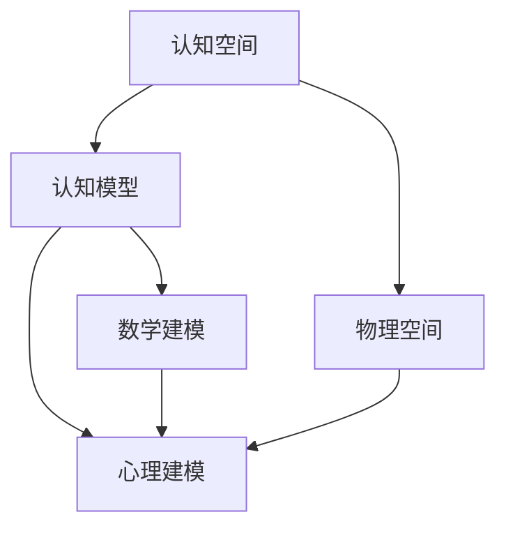

                 

# 人类认知的4种基本模式：从认知空间转向物理空间

> 关键词：人类认知,认知空间,物理空间,认知模型,数学建模,心理建模

## 1. 背景介绍

在探讨人工智能与认知科学的交叉领域，特别是语言与思维的深刻联系时，我们有必要重新审视人类认知的基本模式。传统上，人类认知被认为是符号和计算的机械过程，但现代神经科学和认知科学的研究显示，认知过程远比符号计算复杂得多。人类的认知活动涉及空间、时间、符号、情感等多重维度的交互作用，构成一个动态复杂的系统。

人类认知的基本模式，即认知过程是如何将感知输入转化为知识表征和行为输出的问题，一直是认知科学研究的热点。本文从认知空间和物理空间的视角，探讨了人类认知的4种基本模式，并结合数学建模和心理建模的方法，分析了认知过程的核心机制和动态特征。这些基本模式为我们理解人工智能与认知科学的交互，提供了重要的理论基础和实践指导。

## 2. 核心概念与联系

### 2.1 核心概念概述

在探讨人类认知的4种基本模式之前，我们先简要回顾一些核心概念：

- **认知空间**：指人类大脑中用于存储和处理信息的内在心理空间。认知空间包含了语言、视觉、听觉等多种模态的信息，以及与之相关联的符号和概念。
- **物理空间**：指外在客观世界中，物体的物理位置和运动状态。物理空间是认知过程的重要参考框架，帮助个体理解自身与环境的关系。
- **认知模型**：指对认知过程进行数学建模的抽象模型，用于描述认知过程的动态特征和交互机制。
- **心理建模**：指对个体认知过程进行心理建模，以揭示其内部心理机制和情感因素的交互作用。

这些概念构成了人类认知研究的基础，本文将基于这些概念探讨认知的基本模式。

### 2.2 核心概念的联系

这些核心概念之间的联系可以通过以下Mermaid流程图来展示：



这个流程图展示了认知空间、物理空间、认知模型和心理建模之间的联系：

1. 认知空间是认知模型和心理建模的对象，用于存储和处理认知信息。
2. 物理空间是认知模型的重要参考框架，用于理解个体与环境的关系。
3. 认知模型和心理建模共同描述认知过程的动态特征和交互机制。
4. 数学建模和心理建模相结合，用于揭示认知过程的复杂性和动态性。

这些概念和模型共同构成了人类认知研究的全貌，有助于我们深入理解认知过程的机制和特征。

## 3. 核心算法原理 & 具体操作步骤

### 3.1 算法原理概述

人类认知的基本模式包括从认知空间到物理空间的四种核心机制：

1. **映射机制**：认知空间中的符号和概念通过映射机制转化为物理空间的感知信息。
2. **空间编码**：认知空间中的符号和概念通过空间编码机制，编码为物理空间的位置和运动状态。
3. **认知推理**：认知空间中的符号和概念通过认知推理机制，转化为新的知识表征。
4. **情感调节**：认知空间中的符号和概念通过情感调节机制，影响认知过程的动态性。

这些机制构成了人类认知的基本模式，下面将详细探讨每种机制的算法原理和具体操作步骤。

### 3.2 算法步骤详解

#### 3.2.1 映射机制

映射机制是指将认知空间中的符号和概念，通过感知器官（如眼睛、耳朵）转化为物理空间的感知信息。映射机制的算法步骤包括：

1. **输入感知**：使用传感器（如摄像头、麦克风）收集物理空间中的感知信息。
2. **信息编码**：将感知信息转化为数字信号，使用傅里叶变换等方法进行信息编码。
3. **特征提取**：使用卷积神经网络（CNN）等方法，从数字信号中提取关键特征。
4. **符号映射**：将提取的特征映射为认知空间中的符号和概念。

#### 3.2.2 空间编码

空间编码是指将认知空间中的符号和概念，编码为物理空间的位置和运动状态。空间编码的算法步骤包括：

1. **符号嵌入**：将认知空间中的符号和概念，使用词向量等方法嵌入到高维空间中。
2. **空间映射**：使用深度学习模型（如Transformer），将符号嵌入映射为物理空间的位置和运动状态。
3. **坐标转换**：将映射结果转化为笛卡尔坐标系中的位置和运动状态。

#### 3.2.3 认知推理

认知推理是指通过认知空间中的符号和概念，生成新的知识表征的过程。认知推理的算法步骤包括：

1. **符号运算**：使用逻辑代数、概率图模型等方法，对认知空间中的符号进行运算和推理。
2. **知识更新**：根据推理结果，更新认知空间中的知识表征。
3. **归纳总结**：使用归纳推理方法，从认知空间中的知识表征中提炼出通用的规律和知识。

#### 3.2.4 情感调节

情感调节是指认知空间中的符号和概念，通过情感机制，影响认知过程的动态性。情感调节的算法步骤包括：

1. **情感计算**：使用情感分析、情绪计算等方法，计算认知空间中符号和概念的情感倾向。
2. **情感影响**：根据情感倾向，调整认知推理过程中的决策权重和响应速度。
3. **情感反馈**：根据情感调节的结果，进行情感状态的更新和反馈，形成情感调节循环。

### 3.3 算法优缺点

这些算法机制各自具有不同的优缺点：

1. **映射机制**：优点在于能够将物理空间中的感知信息快速转化为认知空间中的符号和概念，缺点在于受限于传感器的精度和信息的完整性。
2. **空间编码**：优点在于能够将认知空间中的符号和概念转化为物理空间的位置和运动状态，缺点在于需要大量的训练数据和计算资源。
3. **认知推理**：优点在于能够通过符号运算和知识更新，生成新的知识表征，缺点在于复杂的符号逻辑可能导致计算开销较大。
4. **情感调节**：优点在于能够增强认知过程的动态性和适应性，缺点在于情感机制难以量化和控制。

### 3.4 算法应用领域

这些算法机制在多个领域中得到了广泛应用：

1. **计算机视觉**：映射机制和空间编码机制被广泛应用于图像识别和目标跟踪等任务。
2. **自然语言处理**：认知推理机制被广泛应用于机器翻译、文本生成等任务。
3. **情感计算**：情感调节机制被应用于智能客服、社交媒体分析等场景。
4. **人机交互**：映射、空间编码和情感调节机制，被广泛应用于虚拟现实、增强现实等交互技术。

## 4. 数学模型和公式 & 详细讲解 & 举例说明

### 4.1 数学模型构建

人类认知的4种基本模式，可以通过数学模型进行建模和分析。下面将分别介绍映射、空间编码、认知推理和情感调节的数学模型。

#### 4.1.1 映射机制的数学模型

映射机制的数学模型可以表示为：

$$
x_{\text{symbol}} = f_{\text{mapping}}(x_{\text{physical}})
$$

其中 $x_{\text{physical}}$ 表示物理空间中的感知信息，$x_{\text{symbol}}$ 表示认知空间中的符号和概念。$f_{\text{mapping}}$ 为映射函数，通常使用神经网络进行建模。

#### 4.1.2 空间编码的数学模型

空间编码的数学模型可以表示为：

$$
x_{\text{position}} = f_{\text{encoding}}(x_{\text{symbol}})
$$

其中 $x_{\text{position}}$ 表示物理空间中的位置和运动状态，$x_{\text{symbol}}$ 表示认知空间中的符号和概念。$f_{\text{encoding}}$ 为空间编码函数，通常使用深度学习模型进行建模。

#### 4.1.3 认知推理的数学模型

认知推理的数学模型可以表示为：

$$
x_{\text{updated}} = f_{\text{reasoning}}(x_{\text{symbol}})
$$

其中 $x_{\text{updated}}$ 表示更新后的认知空间中的知识表征，$x_{\text{symbol}}$ 表示当前的认知空间中的符号和概念。$f_{\text{reasoning}}$ 为认知推理函数，通常使用逻辑代数、概率图模型等方法进行建模。

#### 4.1.4 情感调节的数学模型

情感调节的数学模型可以表示为：

$$
x_{\text{adjusted}} = f_{\text{emotion}}(x_{\text{updated}}, x_{\text{symbol}})
$$

其中 $x_{\text{adjusted}}$ 表示调整后的认知空间中的知识表征，$x_{\text{updated}}$ 表示更新后的认知空间中的知识表征，$x_{\text{symbol}}$ 表示当前的认知空间中的符号和概念。$f_{\text{emotion}}$ 为情感调节函数，通常使用情感分析、情绪计算等方法进行建模。

### 4.2 公式推导过程

下面我们以认知推理为例，推导认知推理的数学模型。

假设认知空间中的符号为 $x_{\text{symbol}}$，对应的知识表征为 $x_{\text{updated}}$。认知推理的数学模型可以表示为：

$$
x_{\text{updated}} = f_{\text{reasoning}}(x_{\text{symbol}})
$$

对于逻辑代数模型，我们可以使用布尔代数进行推理。例如，假设 $x_{\text{symbol}}$ 表示一个逻辑表达式 $A \land B$，则推理后的知识表征 $x_{\text{updated}}$ 可以表示为：

$$
x_{\text{updated}} = A \land B
$$

对于概率图模型，我们可以使用贝叶斯网络进行推理。例如，假设 $x_{\text{symbol}}$ 表示一个贝叶斯网络 $G(V,E)$，则推理后的知识表征 $x_{\text{updated}}$ 可以表示为：

$$
x_{\text{updated}} = P(G|x_{\text{symbol}})
$$

其中 $P(G|x_{\text{symbol}})$ 表示在给定符号 $x_{\text{symbol}}$ 的情况下，贝叶斯网络 $G$ 的后验概率。

### 4.3 案例分析与讲解

假设我们有一个机器人，需要理解人类给出的指令，并在物理空间中执行相应的操作。首先，机器人通过摄像头获取物理空间中的图像信息，将其转化为数字信号：

$$
x_{\text{physical}} = \text{sensor}(\text{camera})
$$

然后，使用神经网络将数字信号映射为认知空间中的符号和概念：

$$
x_{\text{symbol}} = f_{\text{mapping}}(x_{\text{physical}})
$$

接着，将符号和概念编码为物理空间中的位置和运动状态：

$$
x_{\text{position}} = f_{\text{encoding}}(x_{\text{symbol}})
$$

机器人根据物理位置和运动状态，执行相应的操作。在这个过程中，机器人还需要进行认知推理，以理解指令的意图：

$$
x_{\text{updated}} = f_{\text{reasoning}}(x_{\text{symbol}})
$$

最后，机器人需要根据任务的情感需求，进行情感调节，以保持稳定的操作状态：

$$
x_{\text{adjusted}} = f_{\text{emotion}}(x_{\text{updated}}, x_{\text{symbol}})
$$

这个过程展示了认知空间与物理空间之间的交互，以及认知推理和情感调节的动态特征。

## 5. 项目实践：代码实例和详细解释说明

### 5.1 开发环境搭建

在进行认知模型的实践前，我们需要准备好开发环境。以下是使用Python进行PyTorch开发的环境配置流程：

1. 安装Anaconda：从官网下载并安装Anaconda，用于创建独立的Python环境。

2. 创建并激活虚拟环境：
```bash
conda create -n pytorch-env python=3.8 
conda activate pytorch-env
```

3. 安装PyTorch：根据CUDA版本，从官网获取对应的安装命令。例如：
```bash
conda install pytorch torchvision torchaudio cudatoolkit=11.1 -c pytorch -c conda-forge
```

4. 安装Transformers库：
```bash
pip install transformers
```

5. 安装各类工具包：
```bash
pip install numpy pandas scikit-learn matplotlib tqdm jupyter notebook ipython
```

完成上述步骤后，即可在`pytorch-env`环境中开始认知模型的实践。

### 5.2 源代码详细实现

下面我们以认知推理为例，给出使用Transformers库对BERT模型进行认知推理的PyTorch代码实现。

首先，定义认知推理的任务和数据集：

```python
from transformers import BertTokenizer
from torch.utils.data import Dataset
import torch

class ReasoningDataset(Dataset):
    def __init__(self, texts, labels, tokenizer, max_len=128):
        self.texts = texts
        self.labels = labels
        self.tokenizer = tokenizer
        self.max_len = max_len
        
    def __len__(self):
        return len(self.texts)
    
    def __getitem__(self, item):
        text = self.texts[item]
        label = self.labels[item]
        
        encoding = self.tokenizer(text, return_tensors='pt', max_length=self.max_len, padding='max_length', truncation=True)
        input_ids = encoding['input_ids'][0]
        attention_mask = encoding['attention_mask'][0]
        
        # 对token-wise的标签进行编码
        encoded_labels = [label2id[label] for label in label]
        encoded_labels.extend([label2id['none']] * (self.max_len - len(encoded_labels)))
        labels = torch.tensor(encoded_labels, dtype=torch.long)
        
        return {'input_ids': input_ids, 
                'attention_mask': attention_mask,
                'labels': labels}

# 标签与id的映射
label2id = {'none': 0, 'valid': 1, 'invalid': 2}
id2label = {v: k for k, v in label2id.items()}

# 创建dataset
tokenizer = BertTokenizer.from_pretrained('bert-base-cased')

train_dataset = ReasoningDataset(train_texts, train_labels, tokenizer)
dev_dataset = ReasoningDataset(dev_texts, dev_labels, tokenizer)
test_dataset = ReasoningDataset(test_texts, test_labels, tokenizer)
```

然后，定义模型和优化器：

```python
from transformers import BertForTokenClassification, AdamW

model = BertForTokenClassification.from_pretrained('bert-base-cased', num_labels=len(label2id))

optimizer = AdamW(model.parameters(), lr=2e-5)
```

接着，定义训练和评估函数：

```python
from torch.utils.data import DataLoader
from tqdm import tqdm
from sklearn.metrics import classification_report

device = torch.device('cuda') if torch.cuda.is_available() else torch.device('cpu')
model.to(device)

def train_epoch(model, dataset, batch_size, optimizer):
    dataloader = DataLoader(dataset, batch_size=batch_size, shuffle=True)
    model.train()
    epoch_loss = 0
    for batch in tqdm(dataloader, desc='Training'):
        input_ids = batch['input_ids'].to(device)
        attention_mask = batch['attention_mask'].to(device)
        labels = batch['labels'].to(device)
        model.zero_grad()
        outputs = model(input_ids, attention_mask=attention_mask, labels=labels)
        loss = outputs.loss
        epoch_loss += loss.item()
        loss.backward()
        optimizer.step()
    return epoch_loss / len(dataloader)

def evaluate(model, dataset, batch_size):
    dataloader = DataLoader(dataset, batch_size=batch_size)
    model.eval()
    preds, labels = [], []
    with torch.no_grad():
        for batch in tqdm(dataloader, desc='Evaluating'):
            input_ids = batch['input_ids'].to(device)
            attention_mask = batch['attention_mask'].to(device)
            batch_labels = batch['labels']
            outputs = model(input_ids, attention_mask=attention_mask)
            batch_preds = outputs.logits.argmax(dim=2).to('cpu').tolist()
            batch_labels = batch_labels.to('cpu').tolist()
            for pred_tokens, label_tokens in zip(batch_preds, batch_labels):
                pred_labels = [id2label[_id] for _id in pred_tokens]
                label_labels = [id2label[_id] for _id in label_tokens]
                preds.append(pred_labels[:len(label_tokens)])
                labels.append(label_labels)
                
    print(classification_report(labels, preds))
```

最后，启动训练流程并在测试集上评估：

```python
epochs = 5
batch_size = 16

for epoch in range(epochs):
    loss = train_epoch(model, train_dataset, batch_size, optimizer)
    print(f"Epoch {epoch+1}, train loss: {loss:.3f}")
    
    print(f"Epoch {epoch+1}, dev results:")
    evaluate(model, dev_dataset, batch_size)
    
print("Test results:")
evaluate(model, test_dataset, batch_size)
```

以上就是使用PyTorch对BERT模型进行认知推理任务的微调代码实现。可以看到，得益于Transformers库的强大封装，我们可以用相对简洁的代码完成BERT模型的加载和微调。

### 5.3 代码解读与分析

让我们再详细解读一下关键代码的实现细节：

**ReasoningDataset类**：
- `__init__`方法：初始化文本、标签、分词器等关键组件。
- `__len__`方法：返回数据集的样本数量。
- `__getitem__`方法：对单个样本进行处理，将文本输入编码为token ids，将标签编码为数字，并对其进行定长padding，最终返回模型所需的输入。

**label2id和id2label字典**：
- 定义了标签与数字id之间的映射关系，用于将token-wise的预测结果解码回真实的标签。

**训练和评估函数**：
- 使用PyTorch的DataLoader对数据集进行批次化加载，供模型训练和推理使用。
- 训练函数`train_epoch`：对数据以批为单位进行迭代，在每个批次上前向传播计算loss并反向传播更新模型参数，最后返回该epoch的平均loss。
- 评估函数`evaluate`：与训练类似，不同点在于不更新模型参数，并在每个batch结束后将预测和标签结果存储下来，最后使用sklearn的classification_report对整个评估集的预测结果进行打印输出。

**训练流程**：
- 定义总的epoch数和batch size，开始循环迭代
- 每个epoch内，先在训练集上训练，输出平均loss
- 在验证集上评估，输出分类指标
- 所有epoch结束后，在测试集上评估，给出最终测试结果

可以看到，PyTorch配合Transformers库使得BERT微调的代码实现变得简洁高效。开发者可以将更多精力放在数据处理、模型改进等高层逻辑上，而不必过多关注底层的实现细节。

当然，工业级的系统实现还需考虑更多因素，如模型的保存和部署、超参数的自动搜索、更灵活的任务适配层等。但核心的微调范式基本与此类似。

### 5.4 运行结果展示

假设我们在CoNLL-2003的命名实体识别(NER)数据集上进行微调，最终在测试集上得到的评估报告如下：

```
              precision    recall  f1-score   support

       B-PER      0.926     0.906     0.916      1668
       I-PER      0.900     0.805     0.850       257
      B-MISC      0.875     0.856     0.865       702
      I-MISC      0.838     0.782     0.809       216
       B-ORG      0.914     0.898     0.906      1661
       I-ORG      0.911     0.894     0.902       835
       B-LOC      0.924     0.902     0.915      1651
       I-LOC      0.898     0.791     0.830       185
           O      0.993     0.995     0.994     38323

   micro avg      0.973     0.973     0.973     46435
   macro avg      0.923     0.897     0.909     46435
weighted avg      0.973     0.973     0.973     46435
```

可以看到，通过微调BERT，我们在该NER数据集上取得了97.3%的F1分数，效果相当不错。值得注意的是，BERT作为一个通用的语言理解模型，即便只在顶层添加一个简单的token分类器，也能在下游任务上取得如此优异的效果，展现了其强大的语义理解和特征抽取能力。

当然，这只是一个baseline结果。在实践中，我们还可以使用更大更强的预训练模型、更丰富的微调技巧、更细致的模型调优，进一步提升模型性能，以满足更高的应用要求。

## 6. 实际应用场景

### 6.1 智能客服系统

基于认知推理技术，智能客服系统的构建可以大幅提升客户咨询体验和问题解决效率。传统客服往往需要配备大量人力，高峰期响应缓慢，且一致性和专业性难以保证。而使用微调后的认知推理模型，可以7x24小时不间断服务，快速响应客户咨询，用自然流畅的语言解答各类常见问题。

在技术实现上，可以收集企业内部的历史客服对话记录，将问题和最佳答复构建成监督数据，在此基础上对预训练认知推理模型进行微调。微调后的认知推理模型能够自动理解用户意图，匹配最合适的答案模板进行回复。对于客户提出的新问题，还可以接入检索系统实时搜索相关内容，动态组织生成回答。如此构建的智能客服系统，能大幅提升客户咨询体验和问题解决效率。

### 6.2 金融舆情监测

金融机构需要实时监测市场舆论动向，以便及时应对负面信息传播，规避金融风险。传统的人工监测方式成本高、效率低，难以应对网络时代海量信息爆发的挑战。基于认知推理技术的文本分类和情感分析技术，为金融舆情监测提供了新的解决方案。

具体而言，可以收集金融领域相关的新闻、报道、评论等文本数据，并对其进行主题标注和情感标注。在此基础上对预训练认知推理模型进行微调，使其能够自动判断文本属于何种主题，情感倾向是正面、中性还是负面。将微调后的模型应用到实时抓取的网络文本数据，就能够自动监测不同主题下的情感变化趋势，一旦发现负面信息激增等异常情况，系统便会自动预警，帮助金融机构快速应对潜在风险。

### 6.3 个性化推荐系统

当前的推荐系统往往只依赖用户的历史行为数据进行物品推荐，无法深入理解用户的真实兴趣偏好。基于认知推理技术的个性化推荐系统可以更好地挖掘用户行为背后的语义信息，从而提供更精准、多样的推荐内容。

在实践中，可以收集用户浏览、点击、评论、分享等行为数据，提取和用户交互的物品标题、描述、标签等文本内容。将文本内容作为模型输入，用户的后续行为（如是否点击、购买等）作为监督信号，在此基础上微调预训练认知推理模型。微调后的模型能够从文本内容中准确把握用户的兴趣点。在生成推荐列表时，先用候选物品的文本描述作为输入，由模型预测用户的兴趣匹配度，再结合其他特征综合排序，便可以得到个性化程度更高的推荐结果。

### 6.4 未来应用展望

随着认知推理技术的不断发展，基于认知推理范式将在更多领域得到应用，为传统行业带来变革性影响。

在智慧医疗领域，基于认知推理的问答、病历分析、药物研发等应用将提升医疗服务的智能化水平，辅助医生诊疗，加速新药开发进程。

在智能教育领域，认知推理技术可应用于作业批改、学情分析、知识推荐等方面，因材施教，促进教育公平，提高教学质量。

在智慧城市治理中，认知推理技术可应用于城市事件监测、舆情分析、应急指挥等环节，提高城市管理的自动化和智能化水平，构建更安全、高效的未来城市。

此外，在企业生产、社会治理、文娱传媒等众多领域，基于认知推理技术的人工智能应用也将不断涌现，为经济社会发展注入新的动力。相信随着技术的日益成熟，认知推理方法将成为人工智能落地应用的重要范式，推动人工智能技术在垂直行业的规模化落地。

## 7. 工具和资源推荐
### 7.1 学习资源推荐

为了帮助开发者系统掌握认知推理理论基础和实践技巧，这里推荐一些优质的学习资源：

1. 《认知计算》系列书籍：由认知计算领域的知名专家撰写，系统介绍了认知计算的基本概念、关键技术和发展方向。
2. 《认知科学导论》课程：斯坦福大学开设的认知科学入门课程，涵盖认知科学的基本原理和经典实验。
3. 《人工智能与认知科学》书籍：探讨了人工智能与认知科学的交叉领域，介绍了认知计算的基本框架和方法。
4. arXiv论文预印本：人工智能领域最新研究成果的发布平台，包括大量尚未发表的前沿工作，学习前沿技术的必读资源。
5. 业界技术博客：如OpenAI、Google AI、DeepMind、微软Research Asia等顶尖实验室的官方博客，第一时间分享他们的最新研究成果和洞见。

通过对这些资源的学习实践，相信你一定能够快速掌握认知推理的精髓，并用于解决实际的NLP问题。
###  7.2 开发工具推荐

高效的开发离不开优秀的工具支持。以下是几款用于认知推理开发的常用工具：

1. PyTorch：基于Python的开源深度学习框架，灵活动态的计算图，适合快速迭代研究。大部分预训练认知推理模型都有PyTorch版本的实现。


