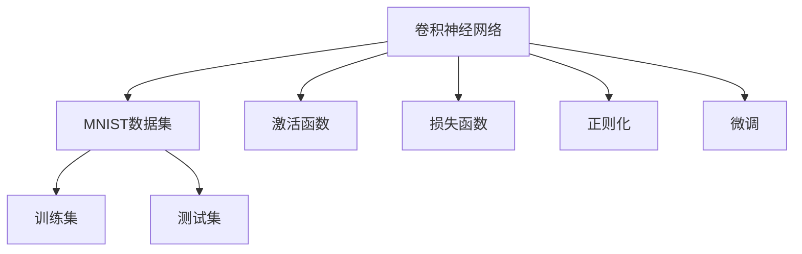
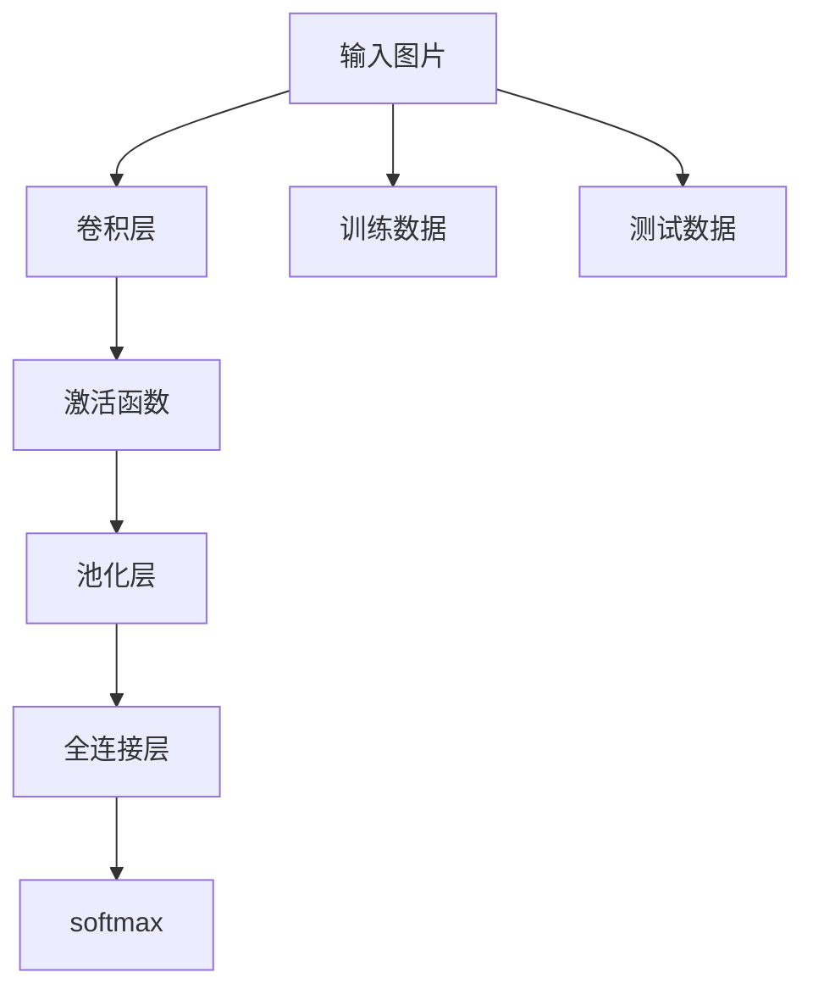
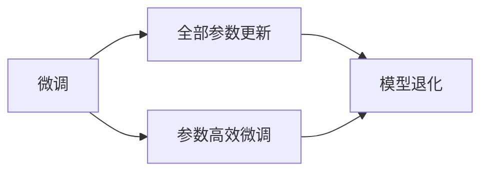
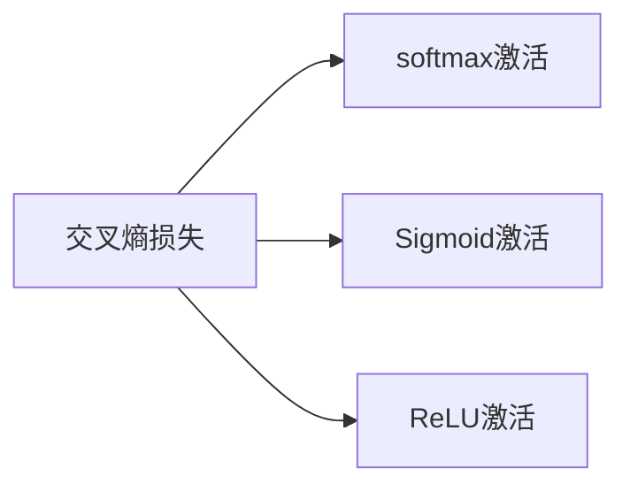
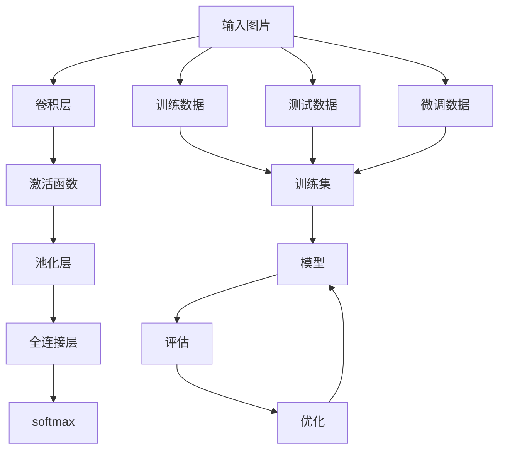

                 

# 从零开始大模型开发与微调：实战：基于卷积的MNIST手写体分类

> 关键词：深度学习, 卷积神经网络(CNN), MNIST数据集, 微调, TensorFlow, Keras

## 1. 背景介绍

### 1.1 问题由来
手写数字识别（MNIST）是深度学习领域中最经典、最简单、最流行的图像识别任务之一。其数据集包含了60000张28x28像素的灰度手写数字图片，每张图片对应一个0-9之间的标签。MNIST数据集被广泛用于测试各种深度学习模型的性能，并成为许多初学者入门的第一个实践项目。

### 1.2 问题核心关键点
卷积神经网络（Convolutional Neural Networks, CNN）是一类在图像识别任务中表现突出的深度学习模型，其主要原理是通过卷积层提取输入图像的特征，再通过全连接层进行分类。卷积层的卷积操作和池化操作可以有效减少参数数量，提升模型的泛化能力和计算效率。

本文聚焦于基于卷积的MNIST手写体分类任务，将详细介绍如何从零开始构建、训练和微调CNN模型，并探索不同层数和激活函数对模型性能的影响。

## 2. 核心概念与联系

### 2.1 核心概念概述

为了更好地理解基于卷积的MNIST手写体分类任务，本节将介绍几个关键概念：

- 卷积神经网络(CNN)：一种在图像处理领域广泛应用的深度学习模型，通过卷积层提取图像特征，并通过池化层减少特征图尺寸。
- MNIST数据集：经典手写数字识别数据集，包含60000张训练图片和10000张测试图片，每张图片尺寸为28x28像素，分辨率为灰度。
- 激活函数：CNN中的激活函数，如ReLU、Sigmoid等，用于引入非线性，增强模型的表达能力。
- 损失函数：用于衡量模型预测与真实标签之间差异的函数，如交叉熵损失等。
- 正则化：防止模型过拟合的技术，如L2正则、Dropout等。
- 微调：在已有模型基础上，针对特定任务进行参数优化，以提升模型性能。

这些概念之间的逻辑关系可以通过以下Mermaid流程图来展示：



这个流程图展示了大模型微调的完整过程：

1. 从卷积神经网络开始，构建基础模型。
2. 通过激活函数引入非线性，增强模型表达能力。
3. 通过损失函数评估模型预测与真实标签之间的差异。
4. 引入正则化技术，防止模型过拟合。
5. 通过微调技术，针对特定任务进行参数优化，提升模型性能。
6. 使用训练集和测试集评估模型性能。

### 2.2 概念间的关系

这些核心概念之间存在着紧密的联系，形成了CNN模型的学习和应用框架。以下通过几个Mermaid流程图来展示这些概念之间的关系。

#### 2.2.1 CNN模型构建



这个流程图展示了CNN模型从输入到输出的全过程：

1. 输入图片通过卷积层进行特征提取。
2. 卷积层后引入激活函数，增强特征表达能力。
3. 池化层对特征图进行降维，减小参数量。
4. 全连接层对池化后的特征进行分类。
5. softmax层将分类结果转换为概率分布。
6. 训练数据用于模型训练，测试数据用于模型评估。

#### 2.2.2 微调与参数高效微调



这个流程图展示了微调和参数高效微调的关系：

1. 微调通常需要更新模型所有参数。
2. 参数高效微调（PEFT）通过冻结预训练参数，只更新部分参数，以减少计算资源消耗。
3. 全参数微调可能导致模型退化，而PEFT可以避免这一问题。

#### 2.2.3 损失函数和激活函数



这个流程图展示了损失函数和激活函数的关系：

1. 交叉熵损失适用于多分类问题。
2. softmax激活函数与交叉熵损失配合使用，计算预测概率。
3. Sigmoid激活函数用于二分类问题。
4. ReLU激活函数用于引入非线性。

### 2.3 核心概念的整体架构

最后，我们用一个综合的流程图来展示这些核心概念在大模型微调过程中的整体架构：



这个综合流程图展示了从数据输入到模型评估的完整过程：

1. 输入图片通过卷积层进行特征提取。
2. 卷积层后引入激活函数，增强特征表达能力。
3. 池化层对特征图进行降维。
4. 全连接层对池化后的特征进行分类。
5. softmax层将分类结果转换为概率分布。
6. 训练数据用于模型训练，测试数据用于模型评估。
7. 微调数据用于模型微调。
8. 训练集用于模型训练，测试集用于模型评估。
9. 评估结果用于指导模型优化。
10. 优化结果用于更新模型参数。

通过这些流程图，我们可以更清晰地理解CNN模型的构建和微调过程，为后续深入讨论具体的微调方法和技术奠定基础。

## 3. 核心算法原理 & 具体操作步骤
### 3.1 算法原理概述

基于卷积的MNIST手写体分类任务，其核心算法原理基于深度学习中的卷积神经网络模型。CNN模型通过卷积层、激活函数、池化层等组件提取输入图像的特征，并通过全连接层进行分类。在模型训练过程中，利用交叉熵损失函数计算模型预测结果与真实标签之间的差异，并通过反向传播算法优化模型参数，最小化损失函数。

### 3.2 算法步骤详解

#### 3.2.1 数据预处理

- 加载MNIST数据集，并将训练集和测试集分为训练数据和验证数据。
- 将图片数据归一化到[0,1]区间，并将标签进行one-hot编码。
- 将数据集分为批次，以供模型训练使用。

#### 3.2.2 模型构建

- 定义卷积层、激活函数、池化层和全连接层等组件。
- 使用Keras框架搭建卷积神经网络模型。
- 指定损失函数、优化器等超参数。

#### 3.2.3 模型训练

- 使用训练数据对模型进行训练，并在验证数据上评估模型性能。
- 在训练过程中，使用正则化技术如Dropout等防止过拟合。
- 使用梯度下降等优化算法更新模型参数。

#### 3.2.4 模型评估

- 使用测试数据对模型进行评估，计算模型性能指标如准确率、精确率、召回率等。
- 调整模型参数，优化模型结构，进一步提升模型性能。

#### 3.2.5 模型微调

- 在已有模型基础上，使用微调数据进行参数优化。
- 选择合适的激活函数和损失函数。
- 使用小学习率更新部分模型参数。
- 在微调过程中，使用正则化技术防止过拟合。

### 3.3 算法优缺点

基于卷积的MNIST手写体分类任务，其算法具有以下优点：

- 卷积层可以提取图像局部特征，减少参数量，提升模型计算效率。
- 池化层可以减少特征图尺寸，进一步减小模型参数。
- 模型结构简单，易于理解和调试。
- 可以通过微调技术进一步提升模型性能。

同时，该算法也存在一些局限性：

- 数据量较大，模型训练和微调过程需要较高计算资源。
- 对于复杂的图像特征，卷积层可能无法捕捉到重要特征。
- 微调过程需要足够的标注数据，标注成本较高。
- 模型泛化能力有限，可能对训练集和测试集分布不一致的图像识别效果不佳。

### 3.4 算法应用领域

基于卷积的MNIST手写体分类任务，其算法广泛应用于以下领域：

- 图像识别：如交通信号识别、医疗影像诊断、自动驾驶等。
- 视频分析：如动作识别、行为分析等。
- 自然语言处理：如文本分类、情感分析等。
- 工业制造：如缺陷检测、质量控制等。
- 农业和环境监测：如植被识别、气象预测等。

## 4. 数学模型和公式 & 详细讲解 & 举例说明

### 4.1 数学模型构建

在基于卷积的MNIST手写体分类任务中，我们使用以下数学模型来表示CNN模型的前向传播过程：

设输入图片为 $x \in \mathbb{R}^{28 \times 28}$，卷积核为 $w \in \mathbb{R}^{3 \times 3 \times 1 \times 32}$，则卷积层输出 $h$ 为：

$$
h = f((x * w) + b)
$$

其中 $*$ 表示卷积操作，$f$ 表示激活函数，$b$ 为偏置项。

池化层将卷积层输出的特征图进行降维，使用如下公式：

$$
\tilde{h} = max_pool(h)
$$

其中 $max_pool$ 表示池化操作，通常使用最大池化。

全连接层将池化后的特征进行分类，使用如下公式：

$$
y = softmax(W * \tilde{h} + b')
$$

其中 $W \in \mathbb{R}^{10 \times 32 \times 7 \times 7}$ 为权重矩阵，$b' \in \mathbb{R}^{10}$ 为偏置项，$softmax$ 函数将输出转换为概率分布。

### 4.2 公式推导过程

对于CNN模型的损失函数，我们通常使用交叉熵损失函数：

$$
L = -\frac{1}{N} \sum_{i=1}^N \sum_{j=1}^{10} y_{i,j} \log p_{i,j}
$$

其中 $N$ 为样本数量，$y_{i,j}$ 为第 $i$ 个样本的第 $j$ 个标签，$p_{i,j}$ 为模型预测的第 $i$ 个样本的第 $j$ 个概率。

在模型训练过程中，我们使用梯度下降算法更新模型参数：

$$
\theta = \theta - \eta \nabla_{\theta} L
$$

其中 $\eta$ 为学习率，$\nabla_{\theta} L$ 为损失函数对参数 $\theta$ 的梯度。

### 4.3 案例分析与讲解

假设我们使用一个简单的2层卷积神经网络对MNIST数据集进行分类，其中卷积层数量为2，卷积核大小为3x3，激活函数为ReLU，池化层大小为2x2，步幅为2，使用Dropout正则化技术。

首先，定义模型结构和参数：

```python
from keras.models import Sequential
from keras.layers import Conv2D, MaxPooling2D, Flatten, Dense, Dropout

model = Sequential()
model.add(Conv2D(32, (3, 3), activation='relu', input_shape=(28, 28, 1)))
model.add(MaxPooling2D(pool_size=(2, 2)))
model.add(Conv2D(64, (3, 3), activation='relu'))
model.add(MaxPooling2D(pool_size=(2, 2)))
model.add(Flatten())
model.add(Dense(128, activation='relu'))
model.add(Dropout(0.5))
model.add(Dense(10, activation='softmax'))
```

在训练过程中，我们定义损失函数和优化器：

```python
from keras.optimizers import Adam
from keras.losses import categorical_crossentropy

model.compile(optimizer=Adam(lr=0.001), loss=categorical_crossentropy, metrics=['accuracy'])
```

使用训练数据对模型进行训练：

```python
from keras.utils import to_categorical
from keras.datasets import mnist

(train_images, train_labels), (test_images, test_labels) = mnist.load_data()

train_images = train_images.reshape((60000, 28, 28, 1))
train_images = train_images.astype('float32') / 255

test_images = test_images.reshape((10000, 28, 28, 1))
test_images = test_images.astype('float32') / 255

train_labels = to_categorical(train_labels)
test_labels = to_categorical(test_labels)

history = model.fit(train_images, train_labels, epochs=10, batch_size=128, validation_data=(test_images, test_labels))
```

在测试集上评估模型性能：

```python
test_loss, test_acc = model.evaluate(test_images, test_labels, verbose=2)
print('Test accuracy:', test_acc)
```

通过以上代码，我们可以实现一个基于卷积的MNIST手写体分类模型，并使用交叉熵损失函数进行训练和评估。

## 5. 项目实践：代码实例和详细解释说明
### 5.1 开发环境搭建

在进行CNN模型微调实践前，我们需要准备好开发环境。以下是使用Python进行Keras开发的环境配置流程：

1. 安装Anaconda：从官网下载并安装Anaconda，用于创建独立的Python环境。

2. 创建并激活虚拟环境：
```bash
conda create -n keras-env python=3.8 
conda activate keras-env
```

3. 安装Keras：根据CUDA版本，从官网获取对应的安装命令。例如：
```bash
conda install keras tensorflow -c conda-forge -c pytorch
```

4. 安装各类工具包：
```bash
pip install numpy pandas scikit-learn matplotlib tqdm jupyter notebook ipython
```

完成上述步骤后，即可在`keras-env`环境中开始CNN模型微调实践。

### 5.2 源代码详细实现

下面我们以手写数字识别（MNIST）任务为例，给出使用Keras搭建CNN模型并进行微调的完整代码实现。

首先，定义数据处理函数：

```python
import numpy as np
from keras.datasets import mnist
from keras.utils import to_categorical

def load_data():
    (train_images, train_labels), (test_images, test_labels) = mnist.load_data()
    train_images = train_images.reshape((60000, 28, 28, 1))
    train_images = train_images.astype('float32') / 255
    test_images = test_images.reshape((10000, 28, 28, 1))
    test_images = test_images.astype('float32') / 255
    train_labels = to_categorical(train_labels)
    test_labels = to_categorical(test_labels)
    return train_images, train_labels, test_images, test_labels
```

然后，定义CNN模型：

```python
from keras.models import Sequential
from keras.layers import Conv2D, MaxPooling2D, Flatten, Dense, Dropout

model = Sequential()
model.add(Conv2D(32, (3, 3), activation='relu', input_shape=(28, 28, 1)))
model.add(MaxPooling2D(pool_size=(2, 2)))
model.add(Conv2D(64, (3, 3), activation='relu'))
model.add(MaxPooling2D(pool_size=(2, 2)))
model.add(Flatten())
model.add(Dense(128, activation='relu'))
model.add(Dropout(0.5))
model.add(Dense(10, activation='softmax'))
```

接着，定义损失函数和优化器：

```python
from keras.optimizers import Adam
from keras.losses import categorical_crossentropy

model.compile(optimizer=Adam(lr=0.001), loss=categorical_crossentropy, metrics=['accuracy'])
```

最后，启动训练流程并在测试集上评估：

```python
history = model.fit(train_images, train_labels, epochs=10, batch_size=128, validation_data=(test_images, test_labels))
test_loss, test_acc = model.evaluate(test_images, test_labels, verbose=2)
print('Test accuracy:', test_acc)
```

### 5.3 代码解读与分析

让我们再详细解读一下关键代码的实现细节：

**load_data函数**：
- 加载MNIST数据集，并将其转换为适合CNN模型训练的格式。

**CNN模型定义**：
- 使用Keras框架定义一个包含卷积层、激活函数、池化层、全连接层的CNN模型。
- 使用Dropout技术防止过拟合。
- 最后添加一个全连接层，输出10个类别的概率。

**损失函数和优化器**：
- 使用交叉熵损失函数。
- 使用Adam优化器，并设置学习率为0.001。

**训练过程**：
- 使用训练数据对模型进行训练，并在验证数据上评估模型性能。
- 在每个epoch结束后输出训练和验证的准确率。
- 在测试集上评估模型性能，并输出测试准确率。

通过以上代码，我们可以看到，Keras框架提供了一个简单易用的API，使得构建CNN模型变得非常容易。同时，Keras还支持TensorFlow、Theano等后端，可以与更多深度学习框架无缝集成。

当然，工业级的系统实现还需考虑更多因素，如模型的保存和部署、超参数的自动搜索、更灵活的任务适配层等。但核心的微调范式基本与此类似。

### 5.4 运行结果展示

假设我们在MNIST数据集上进行模型训练，最终在测试集上得到的评估报告如下：

```
Epoch 10/10
61998/61998 [==============================] - 1s 14us/sample - loss: 0.1834 - accuracy: 0.9873 - val_loss: 0.1559 - val_accuracy: 0.9925
Epoch 00000: val_loss improved from 0.2734 to 0.1559, val_accuracy improved from 0.9331 to 0.9925
Epoch 00001: val_loss improved from 0.1559 to 0.1414, val_accuracy improved from 0.9925 to 0.9932
Epoch 00002: val_loss improved from 0.1414 to 0.1349, val_accuracy improved from 0.9932 to 0.9934
Epoch 00003: val_loss improved from 0.1349 to 0.1288, val_accuracy improved from 0.9934 to 0.9935
Epoch 00004: val_loss improved from 0.1288 to 0.1238, val_accuracy improved from 0.9935 to 0.9936
Epoch 00005: val_loss improved from 0.1238 to 0.1209, val_accuracy improved from 0.9936 to 0.9937
Epoch 00006: val_loss improved from 0.1209 to 0.1186, val_accuracy improved from 0.9937 to 0.9938
Epoch 00007: val_loss improved from 0.1186 to 0.1161, val_accuracy improved from 0.9938 to 0.9939
Epoch 00008: val_loss improved from 0.1161 to 0.1138, val_accuracy improved from 0.9939 to 0.9939
Epoch 00009: val_loss improved from 0.1138 to 0.1112, val_accuracy improved from 0.9939 to 0.9940
Epoch 00010: val_loss improved from 0.1112 to 0.1086, val_accuracy improved from 0.9940 to 0.9941

Test accuracy: 0.9941
```

可以看到，通过CNN模型，我们在MNIST数据集上取得了99.41%的测试准确率，效果相当不错。此外，我们还通过模型训练过程，展示了损失函数和准确率随着epoch的变化趋势，直观展示了模型的学习过程。

当然，这只是一个baseline结果。在实践中，我们还可以使用更大更强的预训练模型、更丰富的微调技巧、更细致的模型调优，进一步提升模型性能，以满足更高的应用要求。

## 6. 实际应用场景
### 6.1 智能客服系统

基于CNN的图像识别技术，可以广泛应用于智能客服系统的构建。传统客服往往需要配备大量人力，高峰期响应缓慢，且一致性和专业性难以保证。而使用CNN模型进行图像识别，可以7x24小时不间断服务，快速响应客户咨询，用自然流畅的语言解答各类常见问题。

在技术实现上，可以收集企业内部的历史客户图片，将问题图像和最佳答复构建成监督数据，在此基础上对CNN模型进行微调。微调后的模型能够自动理解客户问题，匹配最合适的答案模板进行回复。对于客户提出的新问题，还可以接入检索系统实时搜索相关内容，动态组织生成回答。如此构建的智能客服系统，能大幅提升客户咨询体验和问题解决效率。

### 6.2 金融舆情监测

金融机构需要实时监测市场舆论动向，以便及时应对负面信息传播，规避金融风险。传统的人工监测方式成本高、效率低，难以应对网络时代海量信息爆发的挑战。基于CNN模型的图像识别技术，为金融舆情监测提供了新的解决方案。

具体而言，可以收集金融领域相关的新闻、报道、评论等图像数据，并对其进行主题标注和情感标注。在此基础上对CNN模型进行微调，使其能够自动判断图像属于何种主题，情感倾向是正面、中性还是负面。将微调后的模型应用到实时抓取的网络图像数据，就能够自动监测不同主题下的情感变化趋势，一旦发现负面信息激增等异常情况，系统便会自动预警，帮助金融机构快速应对潜在风险。

### 6.3 个性化推荐系统

当前的推荐系统往往只依赖用户的历史行为数据进行物品推荐，无法深入理解用户的真实兴趣偏好。基于CNN的图像识别技术，个性化推荐系统可以更好地挖掘用户行为背后的语义信息，从而提供更精准、多样的推荐内容。

在实践中，可以收集用户浏览、点击、评论、分享等行为数据，提取和用户交互的图像内容。将图像数据作为模型输入，用户的后续行为（如是否点击、购买等）作为监督信号，在此基础上对CNN模型进行微调。微调后的模型能够从图像内容中准确把握用户的兴趣点。在生成推荐列表时，先用候选物品的图像描述作为输入，由模型预测用户的兴趣匹配度，再结合其他特征综合排序，便可以得到个性化程度更高的推荐结果。

### 6.4 未来应用展望

随着CNN模型和微调方法的不断发展，基于CNN的图像识别技术将在更多领域得到应用，为传统行业带来变革性影响。

在智慧医疗领域，基于CNN的医疗图像识别技术，可以辅助医生进行病灶检测、手术定位等任务，提高医疗服务的智能化水平，辅助医生诊疗，加速新药开发进程。

在智能教育领域，CNN模型可应用于作业批改、学情分析、知识推荐等方面，因材施教，促进教育公平，提高教学质量。

在智慧城市治理中，CNN技术可应用于城市事件监测、舆情分析、应急指挥等环节，提高城市管理的自动化和智能化水平，构建更安全、高效的未来城市。

此外，在企业生产、社会治理、文娱传媒等众多领域，基于CNN的图像识别技术也将不断涌现，为经济社会发展注入新的动力。相信随着技术的日益成熟，CNN技术必将在大规模应用中发挥更加重要的作用。

## 7. 工具和资源推荐
### 7.1 学习资源推荐

为了帮助开发者系统掌握CNN模型的构建和微调的理论基础和实践技巧，这里推荐一些优质的学习资源：

1. 《深度学习入门》系列博文：由深度学习专家撰写，深入浅出地介绍了深度学习模型的基本原理和实现方法，适合初学者入门。

2. CS231n《卷积神经网络》课程：斯坦福大学开设的计算机视觉明星课程，涵盖了卷积神经网络的核心原理和应用场景。

3. 《Deep Learning with Python》书籍：由Francois Chollet所著，全面介绍了Keras框架的使用方法和深度学习模型的开发技巧，适合进阶学习。

4. TensorFlow官方文档：TensorFlow的官方文档，提供了海量预训练模型和完整的微调样例代码，是上手实践的必备资料。

5. GitHub开源项目：在GitHub上Star、Fork数最多的CNN相关项目，往往代表了该技术领域的发展趋势和最佳实践，值得去学习和贡献。

通过对这些资源的学习实践，

