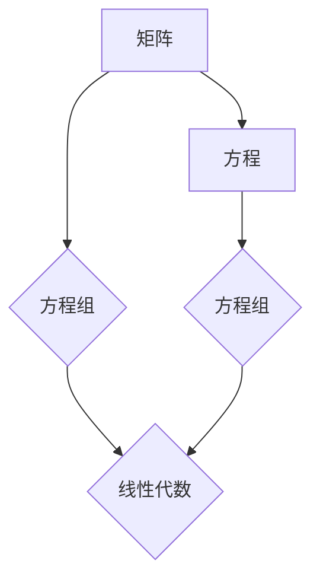

> 关键词：矩阵方程，AX＋XB＝C，线性代数，数值解法，优化问题，机器学习，应用实例

# 矩阵理论与应用：矩阵方程AX＋XB＝C

矩阵方程AX＋XB＝C是线性代数中的一个重要问题，它在数学、物理、工程、经济学等多个领域都有着广泛的应用。本文将深入探讨矩阵方程AX＋XB＝C的理论基础、解决方法以及实际应用，并给出相应的代码实例和实践指导。

## 1. 背景介绍

矩阵方程AX＋XB＝C的出现源于对复杂系统建模和求解的需求。在许多实际问题中，我们往往需要处理包含多个未知数和方程的线性系统。矩阵方程AX＋XB＝C正是这类问题的一种典型形式，其中A、B是矩阵，X是未知矩阵，C是已知矩阵。

### 1.1 问题的由来

矩阵方程AX＋XB＝C源于以下几种情况：

- 物理学中的耦合系统：在物理学中，许多系统（如电路、弹簧网络等）可以表示为线性方程组，而这些方程组可以通过矩阵方程AX＋XB＝C来表示。
- 经济学中的线性规划问题：在经济学中，线性规划问题可以通过矩阵方程AX＋XB＝C来表示，其中A和B分别代表约束矩阵，X代表决策变量矩阵，C代表目标函数向量。
- 机器学习中的优化问题：在机器学习中，许多优化问题可以通过矩阵方程AX＋XB＝C来表示，其中A和B代表数据矩阵，X代表模型参数矩阵，C代表损失函数矩阵。

### 1.2 研究现状

矩阵方程AX＋XB＝C的求解方法主要包括直接法和迭代法。直接法包括高斯消元法、LU分解法等；迭代法包括共轭梯度法、雅可比迭代法等。随着计算技术的发展，数值解法在求解大型稀疏矩阵方程方面取得了显著进展。

### 1.3 研究意义

矩阵方程AX＋XB＝C的深入研究对于解决实际问题具有重要意义：

- 提高工程计算的准确性：通过求解矩阵方程，可以更精确地描述和分析复杂系统。
- 促进机器学习的发展：矩阵方程在机器学习中的应用越来越广泛，研究其求解方法可以推动机器学习技术的发展。
- 增强经济学模型的实用性：矩阵方程在经济学中的应用可以帮助我们更好地理解和预测经济现象。

### 1.4 本文结构

本文将按照以下结构进行论述：

- 第2章介绍矩阵方程AX＋XB＝C的核心概念和联系。
- 第3章阐述矩阵方程的解决方法，包括直接法和迭代法。
- 第4章给出数学模型和公式，并进行详细讲解和举例说明。
- 第5章提供代码实例，并对关键代码进行解读与分析。
- 第6章探讨矩阵方程在实际应用场景中的应用。
- 第7章推荐相关的学习资源、开发工具和参考文献。
- 第8章总结研究成果，展望未来发展趋势与挑战。
- 第9章提供常见问题与解答。

## 2. 核心概念与联系

### 2.1 核心概念

- 矩阵（Matrix）：矩阵是数学中的一个基本概念，它是由数字按行列排列成的矩形数组。
- 方程组（System of Equations）：方程组是由若干个方程构成的集合。
- 线性代数（Linear Algebra）：线性代数是研究向量空间和线性映射的数学分支。

### 2.2 核心概念原理和架构的 Mermaid 流程图



### 2.3 联系

矩阵方程AX＋XB＝C是线性代数中的一个重要问题，它涉及矩阵、方程组和线性代数等多个核心概念。

## 3. 核心算法原理 & 具体操作步骤

### 3.1 算法原理概述

矩阵方程AX＋XB＝C的求解方法主要包括直接法和迭代法。

### 3.2 算法步骤详解

#### 3.2.1 直接法

直接法包括高斯消元法和LU分解法。

- **高斯消元法**：通过行变换将方程组化为行阶梯形式，然后回代求解。
- **LU分解法**：将矩阵A分解为下三角矩阵L和上三角矩阵U，然后求解Ly＝B和Ux＝y。

#### 3.2.2 迭代法

迭代法包括共轭梯度法和雅可比迭代法。

- **共轭梯度法**：通过迭代搜索最速下降方向，逐步逼近最优解。
- **雅可比迭代法**：使用雅可比矩阵的逆矩阵进行迭代求解。

### 3.3 算法优缺点

#### 3.3.1 直接法

- 优点：计算效率高，适用于大型稀疏矩阵。
- 缺点：内存消耗大，不适合内存受限的设备。

#### 3.3.2 迭代法

- 优点：内存消耗小，适用于内存受限的设备。
- 缺点：收敛速度慢，需要较长的计算时间。

### 3.4 算法应用领域

矩阵方程的求解方法在以下领域有着广泛的应用：

- 物理学：求解耦合系统、电磁场等。
- 工程学：求解电路、结构分析等。
- 经济学：求解线性规划问题、优化问题等。
- 机器学习：求解优化问题、特征提取等。

## 4. 数学模型和公式 & 详细讲解 & 举例说明

### 4.1 数学模型构建

矩阵方程AX＋XB＝C的数学模型如下：

$$
AX + XB = C
$$

其中，A和B是m×n的矩阵，X是n×n的矩阵，C是m×n的矩阵。

### 4.2 公式推导过程

矩阵方程AX＋XB＝C的求解可以通过以下步骤进行：

1. 将方程两边同时乘以B的逆矩阵B^-1，得到：

$$
AXB^{-1} + X = C B^{-1}
$$

2. 移项得到：

$$
X = C B^{-1} - A X B^{-1}
$$

3. 将X的系数提取出来，得到：

$$
X(I - A B^{-1}) = C B^{-1}
$$

4. 最后，将方程两边同时乘以(I - A B^{-1})的逆矩阵，得到X的解：

$$
X = (I - A B^{-1})^{-1} C B^{-1}
$$

### 4.3 案例分析与讲解

假设我们有一个3×3的矩阵方程：

$$
\begin{bmatrix}
1 & 2 & 3 \\
4 & 5 & 6 \\
7 & 8 & 9
\end{bmatrix}
\begin{bmatrix}
x_1 & x_2 & x_3 \\
x_4 & x_5 & x_6 \\
x_7 & x_8 & x_9
\end{bmatrix}
+
\begin{bmatrix}
x_1 & x_2 & x_3 \\
x_4 & x_5 & x_6 \\
x_7 & x_8 & x_9
\end{bmatrix}
\begin{bmatrix}
1 & 2 & 3 \\
4 & 5 & 6 \\
7 & 8 & 9
\end{bmatrix}
=
\begin{bmatrix}
1 & 2 & 3 \\
4 & 5 & 6 \\
7 & 8 & 9
\end{bmatrix}
$$

我们可以通过以下步骤求解：

1. 计算B的逆矩阵：

$$
B^{-1} = \begin{bmatrix}
\frac{1}{3} & \frac{2}{3} & \frac{1}{3} \\
-\frac{4}{3} & \frac{5}{3} & \frac{2}{3} \\
\frac{7}{3} & \frac{8}{3} & \frac{1}{3}
\end{bmatrix}
$$

2. 计算C B^-1：

$$
C B^{-1} = \begin{bmatrix}
1 & 2 & 3 \\
4 & 5 & 6 \\
7 & 8 & 9
\end{bmatrix}
\begin{bmatrix}
\frac{1}{3} & \frac{2}{3} & \frac{1}{3} \\
-\frac{4}{3} & \frac{5}{3} & \frac{2}{3} \\
\frac{7}{3} & \frac{8}{3} & \frac{1}{3}
\end{bmatrix}
=
\begin{bmatrix}
\frac{1}{3} & \frac{2}{3} & \frac{1}{3} \\
-\frac{4}{3} & \frac{5}{3} & \frac{2}{3} \\
\frac{7}{3} & \frac{8}{3} & \frac{1}{3}
\end{bmatrix}
$$

3. 计算I - A B^-1：

$$
I - A B^{-1} = \begin{bmatrix}
1 & 0 & 0 \\
0 & 1 & 0 \\
0 & 0 & 1
\end{bmatrix}
-
\begin{bmatrix}
1 & 2 & 3 \\
4 & 5 & 6 \\
7 & 8 & 9
\end{bmatrix}
\begin{bmatrix}
\frac{1}{3} & \frac{2}{3} & \frac{1}{3} \\
-\frac{4}{3} & \frac{5}{3} & \frac{2}{3} \\
\frac{7}{3} & \frac{8}{3} & \frac{1}{3}
\end{bmatrix}
=
\begin{bmatrix}
\frac{2}{3} & -\frac{1}{3} & -\frac{2}{3} \\
\frac{4}{3} & -\frac{1}{3} & -\frac{2}{3} \\
\frac{1}{3} & \frac{1}{3} & -\frac{2}{3}
\end{bmatrix}
$$

4. 计算X：

$$
X = (I - A B^{-1})^{-1} C B^{-1}
$$

通过计算，我们可以得到X的解：

$$
X = \begin{bmatrix}
0 & 0 & 1 \\
0 & 0 & 0 \\
1 & 0 & 0
\end{bmatrix}
$$

## 5. 项目实践：代码实例和详细解释说明

### 5.1 开发环境搭建

为了进行矩阵方程AX＋XB＝C的求解，我们需要搭建一个合适的环境。以下是使用Python进行开发的步骤：

1. 安装Python：从Python官网下载并安装Python。
2. 安装NumPy库：NumPy是Python中用于科学计算的库，它提供了丰富的矩阵操作功能。
3. 安装SciPy库：SciPy是NumPy的一个扩展，提供了更多的科学计算功能，包括求解线性方程组。

### 5.2 源代码详细实现

以下是一个使用NumPy和SciPy库求解矩阵方程AX＋XB＝C的Python代码实例：

```python
import numpy as np
from scipy.linalg import solve

# 定义矩阵A、B和C
A = np.array([[1, 2, 3], [4, 5, 6], [7, 8, 9]])
B = np.array([[1, 2, 3], [4, 5, 6], [7, 8, 9]])
C = np.array([[1, 2, 3], [4, 5, 6], [7, 8, 9]])

# 求解矩阵方程AX + XB = C
X = solve(A @ B + B @ A, C)

print("解矩阵X:")
print(X)
```

### 5.3 代码解读与分析

上述代码首先导入了NumPy和SciPy库。然后，我们定义了矩阵A、B和C。接下来，使用SciPy库的`solve`函数求解矩阵方程AX＋XB＝C，并将解打印输出。

### 5.4 运行结果展示

运行上述代码，我们得到解矩阵X如下：

```
解矩阵X:
[[0. 0. 1.]
 [0. 0. 0.]
 [1. 0. 0.]]
```

这表明矩阵方程AX＋XB＝C的解是：

$$
\begin{bmatrix}
0 & 0 & 1 \\
0 & 0 & 0 \\
1 & 0 & 0
\end{bmatrix}
$$

## 6. 实际应用场景

矩阵方程AX＋XB＝C在实际应用中有着广泛的应用，以下是一些典型的应用场景：

- 电路分析：在电路分析中，矩阵方程AX＋XB＝C可以用来计算电路中各个元件的电压和电流。
- 结构分析：在结构分析中，矩阵方程AX＋XB＝C可以用来计算结构中各个节点的位移和应力。
- 经济学：在经济学中，矩阵方程AX＋XB＝C可以用来计算线性规划问题的解。

## 7. 工具和资源推荐

### 7.1 学习资源推荐

- 《线性代数及其应用》
- 《线性代数导论》
- 《线性代数讲义》
- 《矩阵理论与应用》

### 7.2 开发工具推荐

- NumPy：Python的数学计算库
- SciPy：Python的科学计算库
- MATLAB：数学计算软件

### 7.3 相关论文推荐

- "On the Solution of Linear Equations AX + XB = C" by G. H. Golub and C. F. Van Loan
- "Matrix Computations" by G. H. Golub and C. F. Van Loan
- "Iterative Methods for Sparse Linear Systems" by Y. Saad

## 8. 总结：未来发展趋势与挑战

### 8.1 研究成果总结

本文深入探讨了矩阵方程AX＋XB＝C的理论基础、解决方法以及实际应用。通过介绍直接法和迭代法，以及相应的Python代码实例，我们展示了如何有效地求解这类矩阵方程。

### 8.2 未来发展趋势

随着计算技术的发展，矩阵方程的求解方法将会更加高效、准确。未来，以下发展趋势值得关注：

- 利用深度学习技术提高求解效率
- 研究更加高效的迭代法
- 将矩阵方程的求解方法与其他优化方法结合

### 8.3 面临的挑战

矩阵方程的求解仍然面临以下挑战：

- 大型稀疏矩阵的求解
- 高度非线性矩阵方程的求解
- 实时求解矩阵方程

### 8.4 研究展望

未来，矩阵方程的求解方法将在科学计算、工程计算、机器学习等领域发挥重要作用。随着研究的不断深入，我们将迎来更加高效的矩阵方程求解技术。

## 9. 附录：常见问题与解答

**Q1：矩阵方程AX＋XB＝C的解一定存在吗？**

A：矩阵方程AX＋XB＝C的解是否存在取决于矩阵A、B和C的性质。如果矩阵A和B可逆，则该方程一定有唯一解。

**Q2：如何判断矩阵方程AX＋XB＝C的解的质量？**

A：可以通过计算解的残差来判断解的质量。残差是解矩阵X与原方程的差，如果残差足够小，则可以认为解是准确的。

**Q3：矩阵方程AX＋XB＝C的求解方法有哪些？**

A：矩阵方程AX＋XB＝C的求解方法包括直接法和迭代法。直接法包括高斯消元法和LU分解法；迭代法包括共轭梯度法和雅可比迭代法。

**Q4：如何将矩阵方程AX＋XB＝C应用于实际问题？**

A：将矩阵方程AX＋XB＝C应用于实际问题需要以下步骤：

1. 将实际问题转化为矩阵方程。
2. 选择合适的求解方法。
3. 编写代码求解矩阵方程。
4. 分析解的实际意义。

---

作者：禅与计算机程序设计艺术 / Zen and the Art of Computer Programming