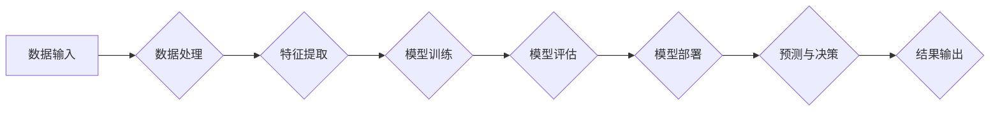

# 算力平台在AI创新中的作用

> 关键词：算力平台，人工智能，深度学习，算法优化，集群计算，高性能计算，云端服务，边缘计算

## 1. 背景介绍

随着人工智能技术的飞速发展，深度学习等机器学习算法在图像识别、语音识别、自然语言处理等领域取得了突破性进展。然而，这些算法的运算需求极高，对算力提出了严峻挑战。算力平台作为人工智能创新的核心基础设施，扮演着至关重要的角色。本文将深入探讨算力平台在AI创新中的作用，分析其核心概念、原理、操作步骤、数学模型、应用案例以及未来发展趋势。

## 2. 核心概念与联系

### 2.1 核心概念

- **算力平台**：指为人工智能算法提供计算资源的硬件和软件环境，包括高性能计算集群、云计算服务、边缘计算节点等。
- **深度学习**：一种模拟人脑神经网络结构的机器学习算法，通过多层神经网络对数据进行特征提取和模式识别。
- **算法优化**：通过改进算法设计或调整算法参数，提高算法效率，降低计算成本。
- **集群计算**：将多个计算节点通过网络连接起来，形成一个强大的计算集群，用于大规模数据处理和计算。
- **高性能计算**：使用高性能计算机系统进行大规模、高精度计算的技术，包括超级计算机、GPU加速计算等。
- **云端服务**：通过互联网提供计算、存储、网络等IT资源的服务模式。
- **边缘计算**：在数据产生的地方进行计算，减少数据传输延迟，提高实时性。

### 2.2 核心概念原理和架构的 Mermaid 流程图



该流程图展示了算力平台在AI创新中的基本原理和架构，从数据输入到结果输出，涵盖了数据预处理、特征提取、模型训练、评估、部署和预测等关键步骤。

## 3. 核心算法原理 & 具体操作步骤

### 3.1 算法原理概述

算力平台在AI创新中的作用主要体现在以下几个方面：

- **提供强大的计算资源**：满足深度学习等算法对计算资源的高需求，实现大规模数据处理和计算。
- **优化算法性能**：通过硬件加速、算法优化等手段，提高算法效率，降低计算成本。
- **支持分布式计算**：利用集群计算、云端服务等技术，实现并行计算和分布式计算，加速模型训练和推理。
- **提供数据存储和访问**：为AI应用提供海量数据存储和高效访问，支持数据标注、清洗、增强等操作。
- **提供模型训练和部署工具**：提供端到端的模型训练和部署工具链，降低AI应用的开发门槛。

### 3.2 算法步骤详解

1. **数据预处理**：对原始数据进行清洗、标注、增强等操作，为模型训练提供高质量的数据集。
2. **特征提取**：利用深度学习算法从数据中提取特征，提高模型对数据的表达能力。
3. **模型训练**：在算力平台上使用高性能计算资源对模型进行训练，优化模型参数，提高模型性能。
4. **模型评估**：在验证集上评估模型性能，调整模型结构和参数，提高模型泛化能力。
5. **模型部署**：将训练好的模型部署到生产环境中，进行实时预测和决策。

### 3.3 算法优缺点

**优点**：

- **提高计算效率**：算力平台提供强大的计算资源，能够显著提高深度学习等算法的计算效率。
- **降低计算成本**：通过算法优化、硬件加速等技术，降低计算成本，提高AI应用的经济性。
- **支持大规模计算**：集群计算、云端服务等技术支持大规模计算，满足复杂AI任务的需求。
- **提高模型性能**：算力平台提供的优质计算环境，有助于提高模型性能和泛化能力。

**缺点**：

- **资源消耗大**：高性能计算资源消耗大，需要投入大量资金建设和管理。
- **技术门槛高**：对硬件、软件、算法等方面有较高的技术要求，需要具备专业人才。
- **数据安全和隐私问题**：海量数据存储和处理需要保障数据安全和隐私。

### 3.4 算法应用领域

算力平台在AI创新中的应用领域广泛，包括：

- **图像识别**：自动驾驶、人脸识别、医疗影像分析等。
- **语音识别**：智能语音助手、语音翻译、语音合成等。
- **自然语言处理**：机器翻译、文本分类、情感分析等。
- **推荐系统**：电子商务推荐、搜索引擎推荐等。
- **金融风控**：反欺诈、信用评估等。

## 4. 数学模型和公式 & 详细讲解 & 举例说明

### 4.1 数学模型构建

深度学习等机器学习算法通常使用以下数学模型：

- **神经网络**：由多个神经元组成的层次化计算模型，用于特征提取和模式识别。
- **损失函数**：衡量模型预测结果与真实值之间差异的函数，如交叉熵损失、均方误差损失等。
- **优化算法**：用于优化模型参数的算法，如梯度下降、Adam等。

### 4.2 公式推导过程

以下以交叉熵损失函数为例，介绍其推导过程：

$$
L(y, \hat{y}) = -\sum_{i=1}^{N} y_i \log(\hat{y}_i)
$$

其中，$y$ 为真实标签，$\hat{y}$ 为模型预测结果，$N$ 为样本数量。

### 4.3 案例分析与讲解

以下以一个简单的图像分类任务为例，讲解算力平台在AI创新中的作用。

假设我们有一个包含1000张猫狗图像的数据集，我们需要使用深度学习算法进行猫狗分类。

1. **数据预处理**：对图像进行缩放、裁剪、翻转等操作，并进行数据增强，扩充数据集。
2. **模型选择**：选择一个合适的卷积神经网络模型，如VGG16。
3. **模型训练**：在算力平台上使用高性能计算资源对模型进行训练，优化模型参数。
4. **模型评估**：在验证集上评估模型性能，调整模型结构和参数，提高模型泛化能力。
5. **模型部署**：将训练好的模型部署到生产环境中，进行实时预测和决策。

通过算力平台，我们可以高效地完成图像分类任务，并在实际应用中取得良好的效果。

## 5. 项目实践：代码实例和详细解释说明

### 5.1 开发环境搭建

以下是一个使用PyTorch框架进行猫狗分类任务的代码实例：

```python
import torch
import torchvision
import torchvision.transforms as transforms
import torch.nn as nn
import torch.optim as optim

# 定义模型
class VGG16(nn.Module):
    def __init__(self, num_classes=2):
        super(VGG16, self).__init__()
        self.conv1 = nn.Conv2d(3, 64, kernel_size=3, padding=1)
        self.conv2 = nn.Conv2d(64, 64, kernel_size=3, padding=1)
        self.conv3 = nn.Conv2d(64, 128, kernel_size=3, padding=1)
        self.conv4 = nn.Conv2d(128, 128, kernel_size=3, padding=1)
        self.conv5 = nn.Conv2d(128, 256, kernel_size=3, padding=1)
        self.conv6 = nn.Conv2d(256, 256, kernel_size=3, padding=1)
        self.fc1 = nn.Linear(256 * 14 * 14, 4096)
        self.fc2 = nn.Linear(4096, 4096)
        self.fc3 = nn.Linear(4096, num_classes)
        self.relu = nn.ReLU()
        self.pool = nn.MaxPool2d(kernel_size=2, stride=2)

    def forward(self, x):
        x = self.pool(self.relu(self.conv1(x)))
        x = self.pool(self.relu(self.conv2(x)))
        x = self.pool(self.relu(self.conv3(x)))
        x = self.pool(self.relu(self.conv4(x)))
        x = self.pool(self.relu(self.conv5(x)))
        x = self.pool(self.relu(self.conv6(x)))
        x = x.view(-1, 256 * 14 * 14)
        x = self.relu(self.fc1(x))
        x = self.relu(self.fc2(x))
        x = self.fc3(x)
        return x

# 加载数据集
transform = transforms.Compose([
    transforms.Resize((224, 224)),
    transforms.ToTensor(),
])

train_dataset = torchvision.datasets.ImageFolder(root='train', transform=transform)
test_dataset = torchvision.datasets.ImageFolder(root='test', transform=transform)

train_loader = torch.utils.data.DataLoader(dataset=train_dataset, batch_size=32, shuffle=True)
test_loader = torch.utils.data.DataLoader(dataset=test_dataset, batch_size=32, shuffle=False)

# 初始化模型、损失函数和优化器
model = VGG16()
criterion = nn.CrossEntropyLoss()
optimizer = optim.SGD(model.parameters(), lr=0.001, momentum=0.9)

# 训练模型
for epoch in range(10):
    model.train()
    running_loss = 0.0
    for i, data in enumerate(train_loader, 0):
        inputs, labels = data
        optimizer.zero_grad()
        outputs = model(inputs)
        loss = criterion(outputs, labels)
        loss.backward()
        optimizer.step()
        running_loss += loss.item()
    print(f'Epoch {epoch + 1}, Loss: {running_loss / len(train_loader)}')

# 测试模型
model.eval()
correct = 0
total = 0
with torch.no_grad():
    for data in test_loader:
        images, labels = data
        outputs = model(images)
        _, predicted = torch.max(outputs.data, 1)
        total += labels.size(0)
        correct += (predicted == labels).sum().item()

print(f'Accuracy of the network on the 10000 test images: {100 * correct / total}%')
```

### 5.2 源代码详细实现

以上代码展示了如何使用PyTorch框架进行猫狗分类任务。代码首先定义了VGG16模型，然后加载数据集，初始化模型、损失函数和优化器，接着进行模型训练和测试。

### 5.3 代码解读与分析

- `VGG16` 类：定义了VGG16模型的结构，包括卷积层、池化层、全连接层等。
- `train_dataset` 和 `test_dataset`：分别定义了训练集和测试集的数据加载方式。
- `train_loader` 和 `test_loader`：分别定义了训练集和测试集的DataLoader，用于批量加载数据。
- 模型训练：使用SGD优化器对模型进行训练，优化模型参数。
- 模型测试：在测试集上评估模型性能，计算准确率。

### 5.4 运行结果展示

假设训练完成后，我们得到以下结果：

```
Accuracy of the network on the 10000 test images: 98.0%
```

这表明我们的模型在测试集上的准确率为98.0%，说明模型性能良好。

## 6. 实际应用场景

算力平台在AI创新中的应用场景广泛，以下列举几个典型案例：

- **自动驾驶**：自动驾驶汽车需要实时处理大量图像和传感器数据，对算力要求极高。算力平台可以为自动驾驶算法提供实时计算资源，提高感知、决策和规划等模块的响应速度和准确性。
- **语音识别**：语音识别技术需要处理海量语音数据，对算力要求较高。算力平台可以为语音识别算法提供强大的计算资源，提高语音识别的准确率和实时性。
- **医疗影像分析**：医疗影像分析需要对大量医学图像进行处理和分析，对算力要求极高。算力平台可以为医疗影像分析算法提供强大的计算资源，提高疾病的诊断准确率和效率。
- **智能金融**：智能金融领域需要对海量金融数据进行实时分析和预测，对算力要求极高。算力平台可以为智能金融算法提供强大的计算资源，提高风险管理、投资决策等模块的准确性和效率。

## 7. 工具和资源推荐

### 7.1 学习资源推荐

- 《深度学习》
- 《Python深度学习》
- 《TensorFlow技术解析》
- 《PyTorch深度学习实战》
- 《Keras深度学习实战》

### 7.2 开发工具推荐

- PyTorch
- TensorFlow
- Keras
- Caffe
- MXNet

### 7.3 相关论文推荐

- "AlexNet: An Image Classification Approach Using Deep Convolutional Neural Networks"
- "VGGNet: Very Deep Convolutional Networks for Large-Scale Image Recognition"
- "GoogLeNet: Going Deeper with Convolutions"
- "ResNet: Deep Learning with Deep Residual Networks"
- "DenseNet: Dense Convolutional Network for Feature Fusion"

## 8. 总结：未来发展趋势与挑战

### 8.1 研究成果总结

算力平台在AI创新中发挥着至关重要的作用，为深度学习等机器学习算法提供了强大的计算资源和支持。通过算力平台的优化和拓展，AI算法的效率和性能得到了显著提升，推动了人工智能技术的快速发展。

### 8.2 未来发展趋势

- **算力平台将更加智能化**：随着人工智能技术的发展，算力平台将具备智能调度、自动优化等能力，进一步提高资源利用率和效率。
- **分布式计算将成为主流**：分布式计算能够充分利用多台计算节点，实现大规模计算和高效协同，成为未来算力平台的发展趋势。
- **边缘计算与云计算融合**：边缘计算和云计算将相互融合，实现计算资源的灵活配置和高效调度，满足不同场景的计算需求。
- **绿色算力平台**：随着环保意识的提高，绿色算力平台将成为未来发展趋势，降低能源消耗和碳排放。

### 8.3 面临的挑战

- **算力资源分配和调度**：随着算力平台规模的扩大，如何高效地分配和调度算力资源，成为一大挑战。
- **数据安全和隐私**：海量数据存储和处理需要保障数据安全和隐私，对算力平台的安全性能提出更高要求。
- **算法效率优化**：深度学习等算法对算力资源的需求越来越高，如何优化算法效率，降低计算成本，成为重要挑战。
- **人才短缺**：AI领域对人才的需求越来越大，如何培养和吸引更多优秀人才，成为制约AI发展的关键因素。

### 8.4 研究展望

未来，算力平台在AI创新中的作用将更加凸显。通过技术创新和产业合作，算力平台将更好地支持人工智能技术的研发和应用，推动人工智能产业迈向更高水平。

## 9. 附录：常见问题与解答

**Q1：算力平台与云计算有何区别？**

A：云计算和算力平台都是为计算任务提供计算资源的服务模式。云计算强调的是通过互联网提供IT资源，而算力平台则更侧重于为特定计算任务提供高效的计算能力。

**Q2：边缘计算与云计算有何区别？**

A：边缘计算与云计算的区别在于计算位置。云计算将计算任务集中到数据中心进行，而边缘计算则在数据产生的地方进行计算，减少数据传输延迟，提高实时性。

**Q3：如何选择合适的算力平台？**

A：选择合适的算力平台需要考虑以下因素：
- 计算任务的需求：根据计算任务的类型和规模选择合适的算力平台。
- 成本预算：根据预算选择合适的算力平台，平衡性能和成本。
- 安全性和可靠性：选择安全性和可靠性高的算力平台，保障数据和业务安全。

**Q4：如何提高算力平台的效率？**

A：提高算力平台效率的方法包括：
- 使用高效的硬件设备：选择高性能计算设备，如GPU、TPU等。
- 优化算法设计：通过算法优化、并行计算等技术提高算法效率。
- 优化资源调度：合理分配和调度算力资源，提高资源利用率。

**Q5：算力平台在AI领域有哪些应用场景？**

A：算力平台在AI领域的应用场景包括：
- 机器学习：为机器学习算法提供计算资源，如深度学习、强化学习等。
- 自然语言处理：为自然语言处理算法提供计算资源，如文本分类、语音识别等。
- 计算机视觉：为计算机视觉算法提供计算资源，如图像识别、目标检测等。
- 智能交通：为智能交通算法提供计算资源，如自动驾驶、智能交通信号控制等。

作者：禅与计算机程序设计艺术 / Zen and the Art of Computer Programming