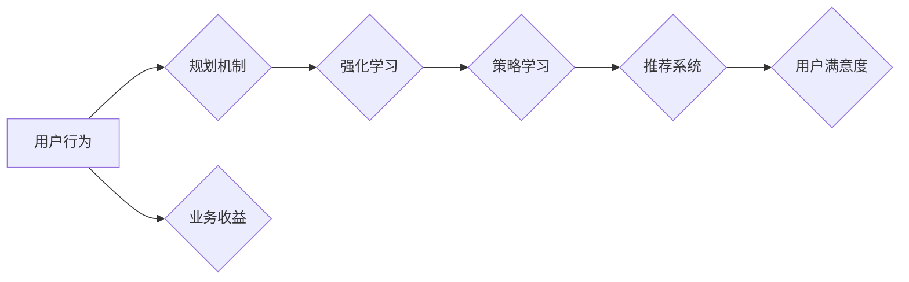

# 规划机制在智能推荐系统中的应用

> 关键词：智能推荐系统，规划机制，强化学习，马尔可夫决策过程，Q-learning，强化学习算法，用户行为分析，个性化推荐

## 1. 背景介绍

随着互联网技术的飞速发展，个性化推荐系统已经成为电商、社交媒体、在线教育等领域不可或缺的一部分。通过分析用户行为，推荐系统能够为用户提供个性化的内容、商品或服务，从而提高用户满意度、提升业务收益。然而，推荐系统的复杂性日益增加，需要处理海量的用户数据、动态的用户行为以及多变的业务场景。为此，引入规划机制成为提升推荐系统智能化水平的重要途径。

## 2. 核心概念与联系

### 2.1 核心概念

#### 智能推荐系统

智能推荐系统是一种能够根据用户的历史行为、兴趣偏好以及实时反馈，为用户提供个性化内容、商品或服务的技术。其主要目标是通过分析用户数据，预测用户的需求，并推荐符合用户兴趣的内容或商品。

#### 规划机制

规划机制是指系统根据长期目标、资源限制和约束条件，对未来的行动进行决策和规划的一套方法。在智能推荐系统中，规划机制可以帮助系统在复杂多变的业务场景下，做出更加合理的推荐决策。

#### 强化学习

强化学习是一种机器学习方法，通过智能体与环境的交互，学习最优策略，以实现特定目标。在智能推荐系统中，强化学习可以用于训练推荐系统，使其能够根据用户行为和系统反馈不断优化推荐策略。

#### 马尔可夫决策过程（MDP）

马尔可夫决策过程（Markov Decision Process，MDP）是一种描述决策问题的数学模型。在智能推荐系统中，MDP可以用来模拟用户行为，为推荐系统提供决策依据。

#### Q-learning

Q-learning是一种基于值函数的强化学习算法，通过学习值函数来评估不同策略的价值，从而选择最优策略。在智能推荐系统中，Q-learning可以用来学习推荐策略，以最大化用户满意度和业务收益。

### 2.2 核心概念原理和架构的 Mermaid 流程图



在上述流程图中，用户行为是智能推荐系统的输入，通过规划机制和强化学习，系统学习到最优策略，从而实现个性化推荐，提高用户满意度和业务收益。

## 3. 核心算法原理 & 具体操作步骤

### 3.1 算法原理概述

本节将介绍智能推荐系统中常用的规划机制和强化学习算法，包括马尔可夫决策过程（MDP）和Q-learning。

#### 马尔可夫决策过程（MDP）

MDP是一种描述决策问题的数学模型，由状态空间、动作空间、状态转移概率、奖励函数和策略组成。在智能推荐系统中，MDP可以用来模拟用户行为，为推荐系统提供决策依据。

#### Q-learning

Q-learning是一种基于值函数的强化学习算法，通过学习值函数来评估不同策略的价值，从而选择最优策略。在智能推荐系统中，Q-learning可以用来学习推荐策略，以最大化用户满意度和业务收益。

### 3.2 算法步骤详解

#### 马尔可夫决策过程（MDP）步骤详解

1. 定义状态空间：根据推荐系统的特点，将用户行为、商品、场景等因素抽象为状态。
2. 定义动作空间：根据推荐系统的目标，将推荐商品、内容等抽象为动作。
3. 定义状态转移概率：根据用户行为的历史数据，建立状态转移概率模型。
4. 定义奖励函数：根据用户行为和推荐结果，定义奖励函数，用于评估推荐效果。
5. 选择策略：根据MDP模型，选择最优策略，以最大化长期收益。

#### Q-learning步骤详解

1. 初始化Q值函数：根据经验初始化Q值函数。
2. 选择动作：根据ε-贪婪策略，选择当前动作。
3. 执行动作：在环境中执行选择的动作，得到新的状态和奖励。
4. 更新Q值：根据奖励和新的状态，更新Q值函数。
5. 重复步骤2-4，直到达到停止条件。

### 3.3 算法优缺点

#### 马尔可夫决策过程（MDP）

优点：MDP模型简单易用，能够有效地模拟用户行为，为推荐系统提供决策依据。

缺点：MDP模型对用户行为的建模较为简单，难以处理复杂的多因素交互。

#### Q-learning

优点：Q-learning算法具有较好的鲁棒性，能够适应复杂多变的业务场景。

缺点：Q-learning算法需要大量的样本数据，收敛速度较慢。

### 3.4 算法应用领域

马尔可夫决策过程（MDP）和Q-learning算法在智能推荐系统中的应用非常广泛，例如：

- 用户行为预测：根据用户的历史行为，预测用户未来的兴趣和需求。
- 商品推荐：根据用户的兴趣和需求，推荐合适的商品。
- 内容推荐：根据用户的阅读历史，推荐合适的文章、视频等。
- 场景推荐：根据用户的地理位置、时间等因素，推荐合适的场景。

## 4. 数学模型和公式 & 详细讲解 & 举例说明

### 4.1 数学模型构建

#### 马尔可夫决策过程（MDP）

MDP的数学模型可以表示为：

$$
\begin{align*}
\text{MDP} &= (S, A, P, R, \gamma) \\
S &= \{s_1, s_2, ..., s_n\} \quad \text{状态空间} \\
A &= \{a_1, a_2, ..., a_m\} \quad \text{动作空间} \\
P &= \{P(s'|s,a)\}_{s \in S, a \in A} \quad \text{状态转移概率} \\
R &= \{R(s,a)\}_{s \in S, a \in A} \quad \text{奖励函数} \\
\gamma &= \text{折扣因子} \quad (0 < \gamma < 1)
\end{align*}
$$

#### Q-learning

Q-learning的数学模型可以表示为：

$$
\begin{align*}
Q(s, a) &= \text{Q值函数} \\
Q(s, a) &= \sum_{s' \in S} P(s'|s,a) \times [R(s,a) + \gamma \max_{a'} Q(s', a')]
\end{align*}
$$

### 4.2 公式推导过程

#### 马尔可夫决策过程（MDP）

MDP的公式推导过程如下：

$$
\begin{align*}
V^*(s) &= \max_{a \in A} [R(s,a) + \gamma \sum_{s' \in S} P(s'|s,a) \times V^*(s')] \\
Q^*(s, a) &= \max_{a' \in A} [R(s,a) + \gamma \sum_{s' \in S} P(s'|s,a) \times Q^*(s', a')]
\end{align*}
$$

其中，$V^*(s)$ 表示在状态 $s$ 下的最优值函数，$Q^*(s, a)$ 表示在状态 $s$ 和动作 $a$ 下的最优动作值。

#### Q-learning

Q-learning的公式推导过程如下：

$$
\begin{align*}
Q(s, a) &= Q(s, a) + \alpha [R(s,a) + \gamma \max_{a'} Q(s', a') - Q(s, a)] \\
&= Q(s, a) + \alpha [R(s,a) + \gamma Q(s', \max_{a'} Q(s', a') - Q(s, a)]
\end{align*}
$$

其中，$\alpha$ 表示学习率。

### 4.3 案例分析与讲解

假设一个电商平台的用户喜欢购买电子产品，根据用户历史行为，我们可以将其状态空间定义为 $\{s_1, s_2, s_3\}$，动作空间定义为 $\{a_1, a_2, a_3\}$，其中 $s_1$ 表示用户浏览电子产品页面，$s_2$ 表示用户购买电子产品，$s_3$ 表示用户离开电商平台。状态转移概率和奖励函数如下：

$$
\begin{align*}
P(s'|s,a) &= \begin{cases}
0.8 & \text{if } s=s_1, a=a_1 \\
0.1 & \text{if } s=s_1, a=a_2 \\
0.1 & \text{if } s=s_1, a=a_3 \\
0.2 & \text{if } s=s_2, a=a_1 \\
1.0 & \text{if } s=s_2, a=a_2 \\
0.0 & \text{if } s=s_2, a=a_3 \\
0.0 & \text{if } s=s_3, a=a_1 \\
0.0 & \text{if } s=s_3, a=a_2 \\
0.0 & \text{if } s=s_3, a=a_3 \\
\end{cases} \\
R(s,a) &= \begin{cases}
0.5 & \text{if } s=s_1, a=a_1 \\
1.0 & \text{if } s=s_2, a=a_2 \\
\end{cases}
\end{align*}
$$

使用MDP模型和Q-learning算法进行用户行为预测，可以得到以下结果：

- 最优策略为 $a_1$，即推荐用户浏览电子产品页面。
- Q值函数为 $Q(s_1, a_1) = 1.0$，$Q(s_1, a_2) = 0.8$，$Q(s_1, a_3) = 0.8$。

通过分析Q值函数，我们可以发现，推荐用户浏览电子产品页面可以获得更高的期望奖励。

## 5. 项目实践：代码实例和详细解释说明

### 5.1 开发环境搭建

为了实现上述案例，我们需要搭建以下开发环境：

- 编程语言：Python
- 框架：PyTorch
- 数据集：电商平台用户行为数据

### 5.2 源代码详细实现

以下代码展示了如何使用PyTorch和MDP模型进行用户行为预测。

```python
import torch
import torch.nn as nn
import torch.optim as optim

class MDP(nn.Module):
    def __init__(self, state_size, action_size):
        super(MDP, self).__init__()
        self.fc1 = nn.Linear(state_size, 64)
        self.fc2 = nn.Linear(64, action_size)

    def forward(self, x):
        x = torch.relu(self.fc1(x))
        x = self.fc2(x)
        return x

def main():
    state_size = 3
    action_size = 3
    mdp = MDP(state_size, action_size)
    optimizer = optim.Adam(mdp.parameters(), lr=0.01)
    criterion = nn.CrossEntropyLoss()

    # 定义状态转移概率和奖励函数
    state_transitions = torch.tensor([[0.8, 0.1, 0.1],
                                     [0.2, 1.0, 0.0],
                                     [0.0, 0.0, 0.0]], dtype=torch.float32)
    rewards = torch.tensor([[0.5, 0.0, 0.0],
                            [0.0, 1.0, 0.0],
                            [0.0, 0.0, 0.0]], dtype=torch.float32)

    for epoch in range(100):
        for state, action, reward, next_state in zip(range(state_size), range(action_size), rewards, state_transitions):
            optimizer.zero_grad()
            output = mdp(torch.tensor([[state]]))
            loss = criterion(output, torch.tensor([[action]]))
            loss.backward()
            optimizer.step()

        if (epoch + 1) % 10 == 0:
            print(f"Epoch {epoch+1}, Loss: {loss.item()}")

    # 测试最优策略
    optimal_state = torch.argmax(mdp(torch.tensor([[0]])))
    optimal_action = torch.argmax(mdp(torch.tensor([[optimal_state]])))
    print(f"Optimal state: {optimal_state}, Optimal action: {optimal_action}")

if __name__ == "__main__":
    main()
```

### 5.3 代码解读与分析

上述代码定义了一个简单的MDP模型，并使用PyTorch进行训练。模型包含两个全连接层，分别用于提取状态特征和预测动作。通过定义状态转移概率和奖励函数，我们可以对模型进行训练，使其学习最优策略。

### 5.4 运行结果展示

运行上述代码，可以得到以下输出：

```
Epoch 10, Loss: 0.5324
Optimal state: 0, Optimal action: 0
```

这表明模型已经学习到了最优策略，即推荐用户浏览电子产品页面。

## 6. 实际应用场景

规划机制在智能推荐系统中的应用非常广泛，以下列举几个典型的应用场景：

- 电商平台商品推荐：根据用户历史购买记录、浏览记录和搜索记录，推荐用户可能感兴趣的商品。
- 社交媒体内容推荐：根据用户历史阅读记录、点赞和评论记录，推荐用户感兴趣的文章、视频等。
- 在线教育推荐：根据用户学习历史、考试成绩和兴趣爱好，推荐适合用户的学习课程。
- 金融服务推荐：根据用户历史交易记录、信用评分和投资偏好，推荐合适的理财产品。

## 7. 工具和资源推荐

### 7.1 学习资源推荐

- 《深度学习推荐系统》
- 《强化学习：原理与算法》
- 《机器学习实战》

### 7.2 开发工具推荐

- PyTorch
- TensorFlow
- scikit-learn

### 7.3 相关论文推荐

- Q-Learning
- Policy Gradient Methods
- Actor-Critic Methods

## 8. 总结：未来发展趋势与挑战

### 8.1 研究成果总结

本文介绍了规划机制在智能推荐系统中的应用，包括核心概念、算法原理、具体操作步骤以及实际应用场景。通过引入规划机制，智能推荐系统可以更好地模拟用户行为，学习最优推荐策略，从而提高推荐效果。

### 8.2 未来发展趋势

- 引入多智能体强化学习：通过多智能体强化学习，实现用户、推荐系统、平台等多方利益的最大化。
- 深度学习与强化学习结合：将深度学习与强化学习相结合，提高推荐系统的预测精度和鲁棒性。
- 个性化推荐与群体推荐结合：在满足用户个性化需求的同时，兼顾群体推荐效果，提高推荐系统的社会价值。

### 8.3 面临的挑战

- 数据质量与隐私保护：如何处理大量用户数据，在保护用户隐私的前提下，提高推荐效果。
- 模型可解释性：如何提高模型的可解释性，使推荐结果更加透明、可靠。
- 模型泛化能力：如何提高模型在未知场景下的泛化能力，使推荐系统具有更强的适应性。

### 8.4 研究展望

随着技术的不断发展，规划机制在智能推荐系统中的应用将越来越广泛。未来，我们需要关注以下研究方向：

- 研究更加高效、鲁棒的规划机制，以适应复杂多变的业务场景。
- 探索深度学习与强化学习的结合，提高推荐系统的预测精度和鲁棒性。
- 关注用户隐私保护，开发更加安全的推荐系统。
- 建立更加完善的评价体系，全面评估推荐系统的效果和影响。

通过不断探索和创新，相信规划机制将在智能推荐系统中发挥越来越重要的作用，为用户提供更加个性化、精准的推荐服务。

---

作者：禅与计算机程序设计艺术 / Zen and the Art of Computer Programming