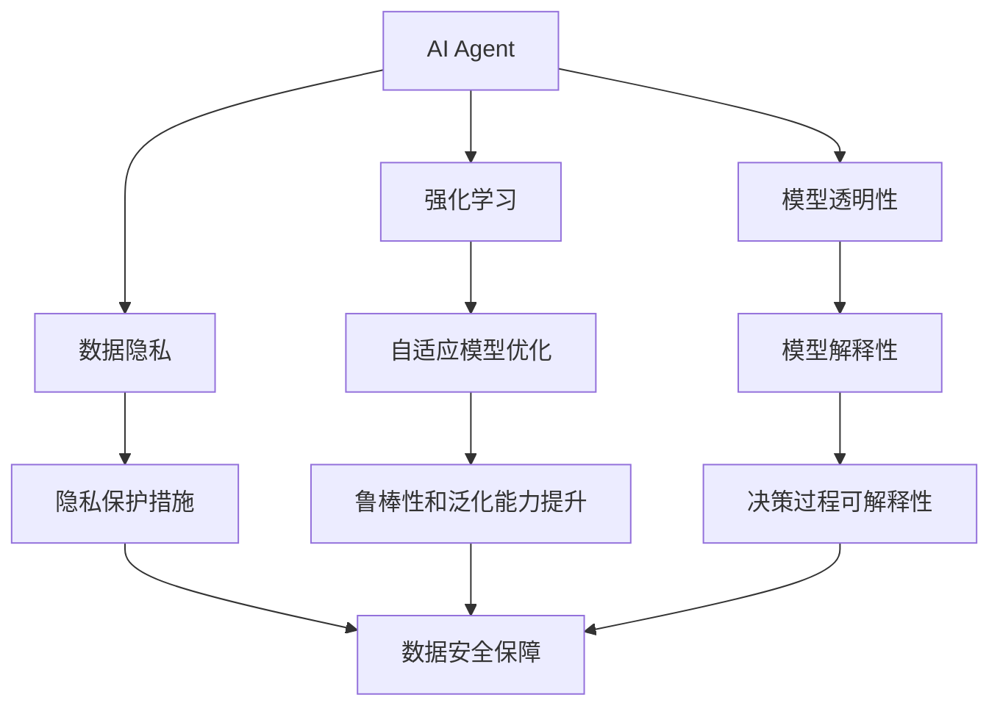

                 

## 1. 背景介绍

### 1.1 问题由来

近年来，随着人工智能技术的快速发展，AI Agent（智能体）在各个领域的应用越来越广泛。从自动驾驶、机器人控制到智能客服、金融量化交易，AI Agent正在逐步取代部分人工操作，为各行各业带来效率提升和创新突破。

然而，尽管AI Agent在许多领域取得了显著进展，但仍面临诸多挑战。这些挑战包括：
- 模型的鲁棒性和泛化能力不足。AI Agent在面对复杂多变的环境时，性能波动较大。
- 训练和推理的计算成本较高。大规模模型的训练和推理需要高性能的硬件支持，成本较高。
- 模型的可解释性和透明性不足。许多AI Agent的黑盒特性，使得其决策过程难以解释，用户难以理解其行为。
- 数据隐私和安全问题。AI Agent在处理敏感数据时，需要特别注意隐私保护和安全防护。

这些问题严重制约了AI Agent的广泛应用和普及。因此，如何改进AI Agent的性能和可靠性，降低其应用成本，提高其透明性和安全性，是当前AI研究的重要方向之一。

### 1.2 问题核心关键点

为了更好地解决上述问题，本文聚焦于AI Agent的未来发展方向，旨在探讨如何构建更加智能、可靠、高效的AI Agent。我们将从以下几个核心关键点入手：
- 强化学习的理论进展和实际应用
- 模型优化和训练策略
- 算法透明性和可解释性提升
- 数据隐私和安全保护措施

这些关键点将帮助我们更全面地理解AI Agent的未来发展趋势和面临的挑战，并为AI Agent的优化提供方向和建议。

## 2. 核心概念与联系

### 2.1 核心概念概述

为了更好地理解AI Agent的未来发展，我们需要首先了解一些核心概念：

- AI Agent（智能体）：能够在复杂环境中自主决策、执行任务的人工智能实体。AI Agent通过感知环境、规划行动、执行任务等步骤，实现其目标。
- 强化学习（Reinforcement Learning, RL）：一种通过与环境交互，不断试错和改进，以实现特定目标的学习方法。AI Agent通常使用强化学习框架进行训练。
- 模型透明性（Model Transparency）：指AI Agent的决策过程和内部机制可被理解和解释的程度。透明性是提高AI Agent可靠性和可接受性的重要因素。
- 数据隐私（Data Privacy）：在处理敏感数据时，需要特别注重用户隐私和数据安全。AI Agent在应用过程中，必须遵循相关法律法规，保护用户隐私。

这些核心概念相互联系，共同构成了AI Agent的技术框架和应用基础。通过理解这些概念，我们可以更好地把握AI Agent的未来发展方向。

### 2.2 概念间的关系

这些核心概念之间存在着紧密的联系，形成了AI Agent发展的整体生态系统。我们可以用以下Mermaid流程图来展示这些概念之间的关系：



这个流程图展示了AI Agent的核心概念及其之间的关系：

1. AI Agent通过强化学习框架进行训练，学习最优决策策略。
2. 模型透明性是指AI Agent的决策过程和内部机制可被理解和解释的程度。
3. 数据隐私是在处理敏感数据时，需要特别注重用户隐私和数据安全。
4. 模型优化和自适应模型优化是提升AI Agent鲁棒性和泛化能力的关键。
5. 模型解释性是指提高AI Agent决策过程的可解释性，增强其透明性。
6. 数据安全保障是在保证数据隐私的前提下，确保AI Agent的安全性。

这些概念共同构成了AI Agent发展的完整生态系统，使AI Agent能够更好地适应复杂环境，提高其可靠性和安全性。

## 3. 核心算法原理 & 具体操作步骤

### 3.1 算法原理概述

AI Agent的核心算法框架是强化学习。强化学习通过与环境交互，不断优化决策策略，以最大化期望回报。AI Agent在实际应用中，通常使用基于模型的（Model-based）和无模型的（Model-free）两种方法。

基于模型的强化学习方法，使用一个模型来模拟环境动态，通过优化模型参数来实现决策优化。例如，模型预测控制（Model Predictive Control, MPC）、模型预测进化（Model Predictive Evolution, MPE）等方法都属于基于模型的强化学习方法。

无模型的强化学习方法，直接从环境交互中学习决策策略，不依赖于显式的环境模型。例如，深度Q网络（Deep Q-Network, DQN）、深度确定性策略梯度（Deep Deterministic Policy Gradient, DDPG）等方法都属于无模型的强化学习方法。

强化学习的目标是在尽可能少的交互次数下，找到最优决策策略。常见的方法包括Q-learning、SARSA、Policy Gradient等。

### 3.2 算法步骤详解

强化学习的训练过程一般包括以下几个步骤：

**Step 1: 设计奖励函数**

奖励函数（Reward Function）是强化学习中的核心概念，用于评估AI Agent在环境中的行为。奖励函数设计的好坏，直接影响AI Agent的训练效果和最终性能。设计合理的奖励函数，可以使AI Agent快速收敛，并找到最优策略。

**Step 2: 选择优化算法**

选择合适的优化算法，可以显著提升训练效率和效果。常用的优化算法包括梯度下降、Adam、RMSprop等。此外，一些特别的优化算法如Proximal Policy Optimization（PPO）、Trust Region Policy Optimization（TRPO）等，也有较好的效果。

**Step 3: 环境交互和模型训练**

在实际应用中，AI Agent通过与环境进行交互，收集环境反馈（即奖励），更新决策策略。通常使用试错的方式，通过多次交互，不断优化模型参数，直至达到最优决策策略。

**Step 4: 模型评估和测试**

在训练完成后，需要对AI Agent进行评估和测试。通过测试集上的表现，可以评估AI Agent的鲁棒性和泛化能力。如果AI Agent在测试集上表现良好，则可以部署到实际应用中。

### 3.3 算法优缺点

强化学习的优点包括：
- 不需要大量标注数据，通过环境交互进行学习，降低了数据获取成本。
- 可以处理连续状态和动作空间，适用于复杂的决策问题。
- 鲁棒性强，能够适应环境变化和不确定性。

然而，强化学习也存在一些缺点：
- 训练时间长，对计算资源要求高。
- 奖励函数设计困难，可能会产生错误决策。
- 模型透明性不足，难以解释AI Agent的决策过程。

### 3.4 算法应用领域

强化学习已经在多个领域得到了广泛应用，包括：

- 自动驾驶：AI Agent通过感知环境、规划路径、执行操作，实现自主驾驶。
- 机器人控制：AI Agent通过传感器感知环境，执行复杂动作，完成指定任务。
- 金融量化交易：AI Agent通过分析市场数据，进行买卖决策，获取最大收益。
- 智能客服：AI Agent通过理解用户意图，执行客服操作，提高客户满意度。

此外，强化学习还在游戏智能、物流优化、资源调度等领域得到了应用，显示出巨大的应用潜力。

## 4. 数学模型和公式 & 详细讲解 & 举例说明

### 4.1 数学模型构建

强化学习的核心数学模型包括状态空间（State Space）、动作空间（Action Space）、奖励函数（Reward Function）、状态转移概率（State Transition Probability）等。

假设环境状态为 $s \in S$，动作空间为 $a \in A$，奖励函数为 $r: S \times A \rightarrow \mathbb{R}$，状态转移概率为 $p: S \times A \rightarrow [0,1]$。

定义AI Agent的决策策略为 $\pi: S \times A \rightarrow [0,1]$，目标是最小化累计折扣奖励：

$$
J(\pi) = \mathbb{E}_{s_0 \sim \mathcal{S}}\left[\sum_{t=0}^{\infty} \gamma^t r(s_t,a_t) \right]
$$

其中 $\gamma$ 为折扣因子。

### 4.2 公式推导过程

强化学习的核心算法包括Q-learning、SARSA、Deep Q-Network（DQN）等。这里以Q-learning算法为例，推导其公式。

定义状态-动作值函数 $Q(s,a)$，表示在状态 $s$ 下，执行动作 $a$ 的期望累计回报。Q-learning的目标是最小化状态-动作值函数与目标值函数 $Q^*(s,a)$ 的误差：

$$
Q^*(s,a) = \max_a \left[ r(s,a) + \gamma \max_a Q^*(s',a') \right]
$$

其中 $(s',a')$ 表示在状态 $s$ 下，执行动作 $a$ 后的下一个状态和动作。

Q-learning通过迭代更新状态-动作值函数，不断逼近最优策略。其更新公式为：

$$
Q(s,a) \leftarrow Q(s,a) + \alpha(r + \gamma \max_{a'} Q(s',a') - Q(s,a))
$$

其中 $\alpha$ 为学习率。

### 4.3 案例分析与讲解

我们以自动驾驶为例，分析强化学习的具体应用。假设AI Agent在自动驾驶中，需要学习如何在不同路况下选择最优的驾驶策略。

**Step 1: 设计奖励函数**

奖励函数可以定义为安全驾驶的得分，即在规定时间内，没有发生交通事故和交通违规的得分。奖励函数可以设计为：

$$
R(s,a) = \left\{
\begin{aligned}
& 1, & \text{未发生事故和违规} \\
& 0, & \text{发生事故或违规}
\end{aligned}
\right.
$$

**Step 2: 选择优化算法**

在自动驾驶中，可以选用深度确定性策略梯度（DDPG）算法进行训练。DDPG算法是一种无模型的强化学习方法，可以处理连续状态和动作空间。

**Step 3: 环境交互和模型训练**

AI Agent通过传感器感知环境，执行驾驶操作。在每次交互后，根据奖励函数更新决策策略。通过多次交互，不断优化模型参数，直至找到最优驾驶策略。

**Step 4: 模型评估和测试**

在训练完成后，使用测试集对AI Agent进行评估，检查其在不同路况下的驾驶性能。如果AI Agent在测试集上表现良好，则可以部署到实际应用中。

## 5. 项目实践：代码实例和详细解释说明

### 5.1 开发环境搭建

在进行AI Agent项目开发前，我们需要准备好开发环境。以下是使用Python进行OpenAI Gym环境搭建的步骤：

1. 安装Anaconda：从官网下载并安装Anaconda，用于创建独立的Python环境。

2. 创建并激活虚拟环境：
```bash
conda create -n gym-env python=3.8 
conda activate gym-env
```

3. 安装OpenAI Gym：
```bash
pip install gym
```

4. 安装必要的依赖库：
```bash
pip install numpy scipy matplotlib jupyter notebook
```

完成上述步骤后，即可在`gym-env`环境中开始AI Agent开发。

### 5.2 源代码详细实现

下面以DQN算法为例，给出使用PyTorch实现自动驾驶AI Agent的代码实现。

首先，定义DQN的类：

```python
import torch
import torch.nn as nn
import torch.optim as optim
import torch.nn.functional as F
import gym
import numpy as np

class DQN(nn.Module):
    def __init__(self, state_dim, action_dim):
        super(DQN, self).__init__()
        self.fc1 = nn.Linear(state_dim, 64)
        self.fc2 = nn.Linear(64, 64)
        self.fc3 = nn.Linear(64, action_dim)
        
    def forward(self, x):
        x = F.relu(self.fc1(x))
        x = F.relu(self.fc2(x))
        x = self.fc3(x)
        return x
```

然后，定义训练函数：

```python
def train(env, model, target_model, optimizer, num_episodes, max_steps, gamma=0.99, epsilon=0.1, epsilon_min=0.01, epsilon_decay=0.995):
    state = env.reset()
    state = torch.tensor([state], dtype=torch.float32)
    target_model.eval()
    
    for episode in range(num_episodes):
        done = False
        total_reward = 0
        
        while not done:
            logits = model(state)
            probs = F.softmax(logits, dim=1)
            action = np.random.choice(range(probs.shape[1]), p=probs.numpy())
            
            next_state, reward, done, _ = env.step(action)
            next_state = torch.tensor([next_state], dtype=torch.float32)
            
            if done:
                target = reward
            else:
                with torch.no_grad():
                    logits_next = target_model(next_state)
                    target_next = F.softmax(logits_next, dim=1)
                    target = reward + gamma * np.max(target_next.numpy())
                
            preds = model(state)
            preds[0][action] = 0
            preds[0].scatter_(1, torch.tensor([action], dtype=torch.long), -1)
            loss = F.mse_loss(preds, torch.tensor([target], dtype=torch.float32))
            optimizer.zero_grad()
            loss.backward()
            optimizer.step()
            
            state = next_state
            total_reward += reward
            
        print('Episode: %d, Reward: %.2f' % (episode+1, total_reward))
```

最后，启动训练流程：

```python
state_dim = 8
action_dim = 2
env = gym.make('CartPole-v0')
model = DQN(state_dim, action_dim)
target_model = DQN(state_dim, action_dim).copy_(model)
optimizer = optim.Adam(model.parameters(), lr=0.001)

train(env, model, target_model, optimizer, num_episodes=100, max_steps=200)
```

以上就是使用PyTorch实现自动驾驶AI Agent的完整代码实现。可以看到，在Gym环境中，通过DQN算法训练AI Agent，可以有效地提升其决策策略，实现自动驾驶。

### 5.3 代码解读与分析

让我们再详细解读一下关键代码的实现细节：

**DQN类**：
- `__init__`方法：初始化神经网络结构，包括全连接层。
- `forward`方法：前向传播计算神经网络输出。

**训练函数**：
- 初始化训练参数，包括学习率、折扣因子、探索率等。
- 使用OpenAI Gym环境，进行单次环境交互。
- 根据状态值函数计算动作概率，进行探索和利用策略平衡。
- 更新目标状态值函数，计算下一状态的最大值。
- 计算模型预测值和目标值的误差，进行反向传播更新模型参数。
- 记录每次交互的总奖励，并在每轮训练后输出。

**训练流程**：
- 定义环境状态维度和动作维度，创建Gym环境。
- 定义DQN模型和目标模型，初始化优化器。
- 调用训练函数，进行100轮训练，每轮200步。
- 输出训练结果，评估AI Agent的表现。

在实际应用中，AI Agent通常需要更复杂的模型和更精确的环境模拟，需要结合领域知识进行深入优化。但核心的算法框架是相似的。

## 6. 实际应用场景

### 6.1 智能客服系统

智能客服系统通过AI Agent实现自动回答用户咨询，提高了客户服务效率和满意度。在智能客服中，AI Agent需要根据用户输入的文本，理解和回答用户问题。常见的应用场景包括：

- 语音客服：通过自然语言处理技术，将用户语音转换为文本，进行语义理解和意图识别，自动生成回复。
- 文本客服：通过情感分析技术，识别用户情绪和意图，自动生成回复。

AI Agent在智能客服中的应用，可以显著提升客服系统的响应速度和准确性，降低人工成本。

### 6.2 金融量化交易

金融量化交易中，AI Agent通过分析市场数据，进行买卖决策，获取最大收益。常见的应用场景包括：

- 高频交易：AI Agent通过分析历史交易数据，进行高频买卖操作，实现自动化的高频交易策略。
- 资产管理：AI Agent通过分析经济指标和市场情绪，进行资产配置和风险控制，提高资产管理效率。

AI Agent在金融量化交易中的应用，可以提高交易效率和收益，降低人为失误和情绪影响。

### 6.3 机器人控制

机器人控制中，AI Agent通过感知环境，执行复杂动作，完成指定任务。常见的应用场景包括：

- 工业自动化：AI Agent通过感知和规划，控制机器人在生产线上进行自动化操作。
- 家庭服务：AI Agent通过感知和规划，控制机器人进行家务活动。

AI Agent在机器人控制中的应用，可以显著提升机器人执行任务的精确性和可靠性，降低人工干预成本。

### 6.4 未来应用展望

随着AI Agent技术的不断进步，其应用前景将更加广阔。未来，AI Agent将在更多领域发挥重要作用，包括：

- 医疗健康：AI Agent通过分析医疗数据，进行疾病预测和诊断，提高医疗服务效率和质量。
- 教育培训：AI Agent通过分析学习数据，进行个性化推荐和辅导，提升学习效果。
- 城市管理：AI Agent通过分析城市数据，进行交通管理、资源调度等，提高城市管理效率。

AI Agent的未来应用将涵盖各个行业，为各行各业带来创新和变革。随着技术的不断突破，AI Agent将变得更加智能、可靠、高效，成为各行各业的重要工具。

## 7. 工具和资源推荐

### 7.1 学习资源推荐

为了帮助开发者系统掌握AI Agent的理论基础和实践技巧，这里推荐一些优质的学习资源：

1. 《强化学习》（Reinforcement Learning）系列书籍：由Richard S. Sutton和Andrew G. Barto合著，是强化学习的经典教材，全面介绍了强化学习的理论基础和实际应用。

2. OpenAI Gym：OpenAI Gym是Python环境中最常用的AI环境库，提供了各种模拟环境，方便进行强化学习实验。

3. TensorFlow和PyTorch：TensorFlow和PyTorch是两大流行的深度学习框架，支持强化学习算法，具有丰富的模型库和优化器。

4. AI Studio：AI Studio是百度深度学习平台，提供丰富的AI工具和资源，方便进行AI项目开发。

5. arXiv论文预印本：人工智能领域最新研究成果的发布平台，包括大量尚未发表的前沿工作，学习前沿技术的必读资源。

通过对这些资源的学习实践，相信你一定能够快速掌握AI Agent的精髓，并用于解决实际的AI问题。

### 7.2 开发工具推荐

高效的开发离不开优秀的工具支持。以下是几款用于AI Agent开发的常用工具：

1. PyTorch：基于Python的开源深度学习框架，灵活动态的计算图，适合快速迭代研究。大部分预训练语言模型都有PyTorch版本的实现。

2. TensorFlow：由Google主导开发的开源深度学习框架，生产部署方便，适合大规模工程应用。同样有丰富的预训练语言模型资源。

3. OpenAI Gym：Python环境中最常用的AI环境库，提供了各种模拟环境，方便进行强化学习实验。

4. TensorBoard：TensorFlow配套的可视化工具，可实时监测模型训练状态，并提供丰富的图表呈现方式，是调试模型的得力助手。

5. Weights & Biases：模型训练的实验跟踪工具，可以记录和可视化模型训练过程中的各项指标，方便对比和调优。

6. Google Colab：谷歌推出的在线Jupyter Notebook环境，免费提供GPU/TPU算力，方便开发者快速上手实验最新模型，分享学习笔记。

合理利用这些工具，可以显著提升AI Agent的开发效率，加快创新迭代的步伐。

### 7.3 相关论文推荐

AI Agent的研究源于学界的持续研究。以下是几篇奠基性的相关论文，推荐阅读：

1. Reinforcement Learning: An Introduction by Richard S. Sutton and Andrew G. Barto：经典的强化学习教材，介绍了强化学习的基本概念和算法。

2. Playing Atari with Deep Reinforcement Learning by Volodymyr Mnih et al.：提出Deep Q-Network（DQN）算法，将强化学习应用到视频游戏领域，取得显著效果。

3. AlphaGo Zero: Mastering the Game of Go without Human Knowledge by David Silver et al.：提出AlphaGo Zero算法，在围棋游戏中实现零样本学习，展示了强化学习的强大能力。

4. Policy Gradient Methods for General Reinforcement Learning with Function Approximation by John J. Brown：介绍政策梯度方法，在强化学习中取得了重要的突破。

5. Deep Deterministic Policy Gradient by Lilian J. Wierstra et al.：提出深度确定性策略梯度（DDPG）算法，用于连续状态和动作空间的任务。

6. Model-based Reinforcement Learning by John J. Wan：介绍基于模型的强化学习方法，使用模型预测控制（MPC）等方法，实现环境动态建模。

这些论文代表了大语言模型微调技术的发展脉络。通过学习这些前沿成果，可以帮助研究者把握学科前进方向，激发更多的创新灵感。

除上述资源外，还有一些值得关注的前沿资源，帮助开发者紧跟AI Agent的最新进展，例如：

1. arXiv论文预印本：人工智能领域最新研究成果的发布平台，包括大量尚未发表的前沿工作，学习前沿技术的必读资源。

2. 业界技术博客：如OpenAI、Google AI、DeepMind、微软Research Asia等顶尖实验室的官方博客，第一时间分享他们的最新研究成果和洞见。

3. 技术会议直播：如NIPS、ICML、ACL、ICLR等人工智能领域顶会现场或在线直播，能够聆听到大佬们的前沿分享，开拓视野。

4. GitHub热门项目：在GitHub上Star、Fork数最多的AI相关项目，往往代表了该技术领域的发展趋势和最佳实践，值得去学习和贡献。

5. 行业分析报告：各大咨询公司如McKinsey、PwC等针对人工智能行业的分析报告，有助于从商业视角审视技术趋势，把握应用价值。

总之，对于AI Agent的学习和实践，需要开发者保持开放的心态和持续学习的意愿。多关注前沿资讯，多动手实践，多思考总结，必将收获满满的成长收益。

## 8. 总结：未来发展趋势与挑战

### 8.1 总结

本文对AI Agent的未来发展方向进行了全面系统的介绍。首先阐述了AI Agent在各个领域的应用前景，明确了其重要性和发展方向。其次，从理论到实践，详细讲解了强化学习的数学原理和关键步骤，给出了AI Agent的代码实现。同时，本文还广泛探讨了AI Agent在实际应用中的各种挑战和解决方案，展示了其在智能客服、金融量化交易、机器人控制等领域的应用前景。

通过本文的系统梳理，可以看到，AI Agent在未来将扮演越来越重要的角色，成为人工智能技术落地的重要范式。得益于强化学习等技术的不断进步，AI Agent将能够更好地适应复杂环境，提高其可靠性和安全性，为各行各业带来创新和变革。

### 8.2 未来发展趋势

展望未来，AI Agent将呈现以下几个发展趋势：

1. 多智能体系统：未来的AI Agent将更多地考虑与其他AI Agent的交互，构建多智能体系统，提升系统整体的协调和决策能力。
2. 跨模态融合：AI Agent将更多地融合视觉、语音、文本等多种模态信息，提升其在复杂环境下的理解和决策能力。
3. 学习机制创新：未来的AI Agent将引入更多的学习机制，如元学习、自适应学习等，提升其学习效率和效果。
4. 推理和规划能力提升：未来的AI Agent将更加注重推理和规划能力，能够更好地处理不确定性和复杂性。
5. 集成领域知识：未来的AI Agent将更多地集成领域知识，提升其专家决策能力。
6. 实时性提升：未来的AI Agent将更加注重实时性，能够实时响应用户需求和环境变化。

这些趋势凸显了AI Agent技术的发展方向，有助于推动AI Agent在各个领域的广泛应用。

### 8.3 面临的挑战

尽管AI Agent在许多领域取得了显著进展，但在迈向更加智能化、普适化应用的过程中，它仍面临诸多挑战：

1. 数据获取和标注：AI Agent需要大量的训练数据，数据获取和标注成本较高。
2. 环境适应性：AI Agent在实际应用中，需要适应不同的环境变化，鲁棒性和泛化能力不足。
3. 系统复杂性：AI Agent需要处理复杂的多智能体系统和跨模态信息，系统设计和实现难度较大。
4. 推理和规划能力：AI Agent需要具备复杂的推理和规划能力，难以处理不确定性和复杂性。
5. 安全和伦理问题：AI Agent需要考虑安全和伦理问题，避免潜在的安全隐患和伦理风险。

这些挑战需要学界和产业界的共同努力，才能更好地解决。

### 8.4 研究展望

面对AI Agent面临的种种挑战，未来的研究需要在以下几个方面寻求新的突破：

1. 无监督和半监督学习：摆脱对大规模标注数据的依赖，利用无监督和半监督学习范式，最大限度利用非结构化数据，实现更加灵活高效的AI Agent。
2. 模型优化和自适应学习：开发更加参数高效和自适应学习的AI Agent，在固定大部分预训练参数的情况下，只更新极少量的任务相关参数。
3. 推理和规划能力提升：引入因果推断和强化学习等方法，提升AI Agent的推理和规划能力，更好地处理不确定性和复杂性。
4. 集成领域知识：将领域知识与神经网络模型进行巧妙融合，引导AI Agent学习更准确、合理的语言模型，提升其在特定领域的应用效果。
5. 安全和伦理保障：引入伦理导向的评估指标，过滤和惩罚有偏见、有害的输出倾向，确保AI

