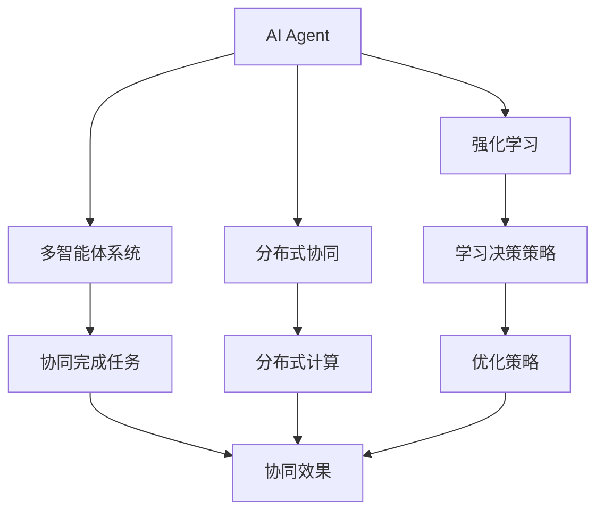
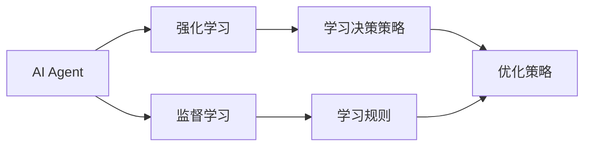
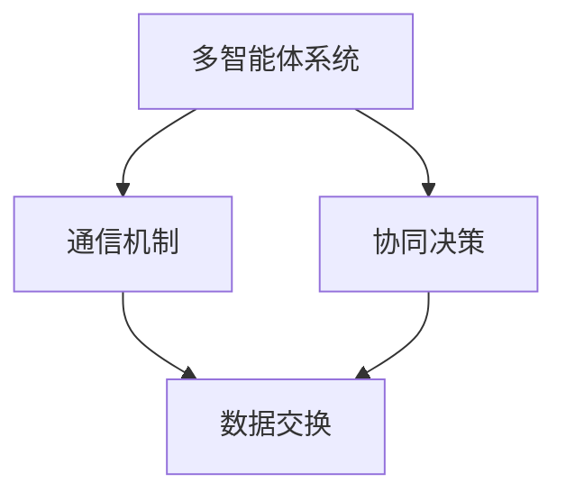
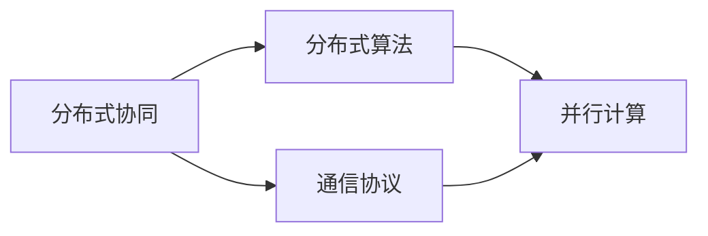
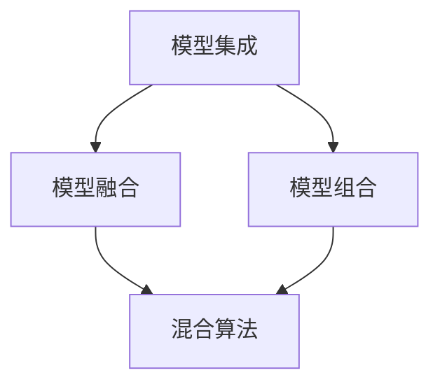
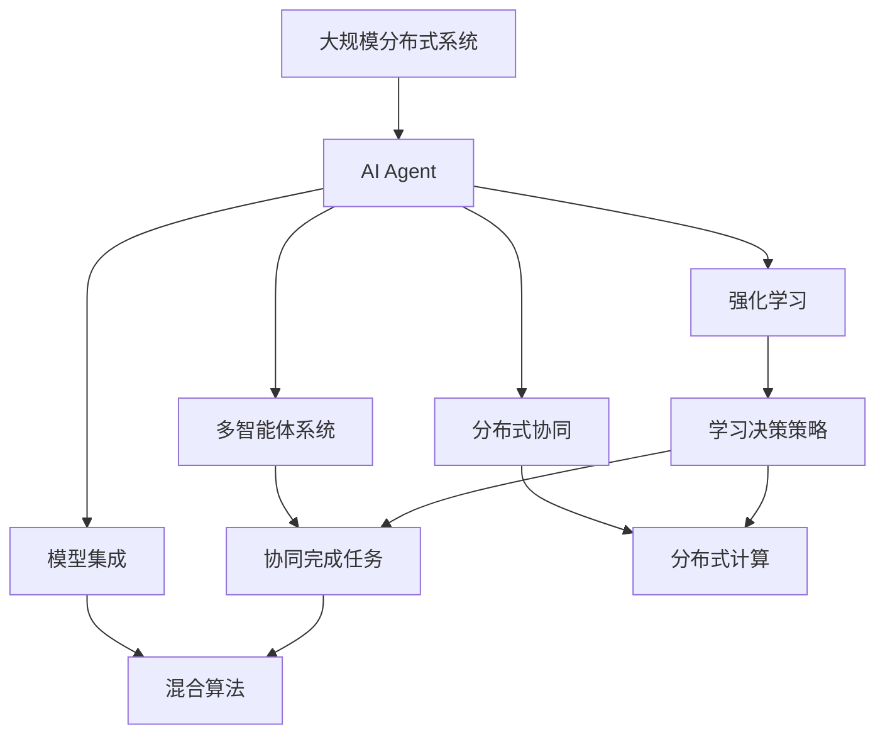

                 

# AI Agent: AI的下一个风口 当前的研究难点与挑战

> 关键词：AI Agent, 人工智能, 智能决策, 强化学习, 多智能体系统, 分布式协同, 强化学习, 智能交互, 模型集成, 社会仿真

## 1. 背景介绍

### 1.1 问题由来
随着人工智能(AI)技术的迅猛发展，AI Agent（智能代理）逐渐成为当下最为火热的研究方向之一。AI Agent 不仅仅是一个可以自主完成特定任务的算法，更是一种复杂的、具有自我意识和适应能力的智能体，它能够在复杂的真实环境中进行自主学习和智能决策。AI Agent 的研究涉及领域广泛，包括强化学习、多智能体系统、分布式协同等，这些技术已经在自动驾驶、智能推荐、机器人控制等多个领域展现出了巨大的应用潜力。然而，AI Agent 的研究仍然面临许多难点和挑战，亟需学术界和产业界共同探索和突破。

### 1.2 问题核心关键点
当前AI Agent研究的核心关键点主要包括：
- **智能决策与优化算法**：AI Agent 需要学习如何在动态环境中做出最优决策，这涉及到强化学习、深度强化学习等技术。
- **多智能体协同**：如何在多个AI Agent之间实现高效的协同与通信，是一个关键难题。
- **分布式算法与并行计算**：在大规模分布式系统上，如何实现高效的并行计算与资源管理。
- **实时决策与反馈机制**：如何通过实时的数据反馈来优化AI Agent的决策策略，提升其性能和可靠性。
- **模型集成与混合算法**：如何将不同类型的模型进行有效的集成，以适应复杂的多场景需求。
- **社会仿真与交互能力**：如何在社会仿真环境中模拟AI Agent的行为，并实现智能交互。

这些关键点不仅决定了AI Agent的性能，还决定了其在实际应用中的可行性。因此，深入理解并解决这些关键问题，对于推动AI Agent技术的成熟和广泛应用具有重要意义。

### 1.3 问题研究意义
AI Agent 的研究不仅能够推动人工智能技术的进一步发展，还能够为解决现实世界的复杂问题提供新的思路和方法。例如，在自动驾驶、智能推荐、智能制造等领域，AI Agent 可以发挥重要作用。通过研究AI Agent，我们可以更好地理解智能系统如何在真实世界中做出决策、如何与环境交互，从而为构建更智能、更灵活的AI系统打下坚实基础。

此外，AI Agent 的研究还能够提升我们对人类认知和行为的理解，帮助我们在伦理、安全等方面更好地设计和评估AI系统。例如，通过研究AI Agent在社会仿真环境中的行为，我们可以更深刻地理解人类社会中的协同与合作机制，从而在AI系统的设计中更好地体现这些原则。

## 2. 核心概念与联系

### 2.1 核心概念概述

为了更好地理解AI Agent的核心概念，本节将介绍几个密切相关的核心概念：

- **AI Agent**：具有自主决策能力的智能体，能够在真实世界中自主行动并完成任务。
- **强化学习(Reinforcement Learning, RL)**：一种学习方式，通过与环境的交互，AI Agent 在每一步决策中获得奖励或惩罚，逐步优化决策策略。
- **多智能体系统(Multi-Agent System, MAS)**：由多个AI Agent组成的系统，这些Agent之间可以通过通信和协作，共同完成复杂任务。
- **分布式协同(Distributed Coordination)**：在大规模系统中，通过分布式算法和通信机制，实现多个AI Agent的高效协同。
- **模型集成(Model Integration)**：将不同类型的AI模型进行组合，形成更加强大、灵活的AI系统。

这些核心概念之间通过以下Mermaid流程图（Flowchart）展示其联系：



这个流程图展示了几大核心概念之间的逻辑关系：

1. AI Agent 通过强化学习来优化决策策略，从而在动态环境中完成特定任务。
2. 多智能体系统由多个AI Agent 组成，通过协同完成任务。
3. 分布式协同在大规模系统中实现多个AI Agent 的高效合作。
4. 模型集成将不同类型的AI模型进行组合，形成更强大的AI系统。

这些概念共同构成了AI Agent 的核心生态系统，为AI Agent 的设计和应用提供了理论基础和技术支撑。

### 2.2 概念间的关系

这些核心概念之间存在着紧密的联系，形成了AI Agent 研究的多维框架。以下通过几个Mermaid流程图展示这些概念之间的关系：

#### 2.2.1 AI Agent 的学习范式



这个流程图展示了一部分学习范式，即AI Agent 可以通过强化学习和监督学习两种方式来优化决策策略。强化学习是AI Agent 的核心，而监督学习则是辅助手段，用于规则的建立和验证。

#### 2.2.2 多智能体系统的协作机制



这个流程图展示了多智能体系统的协作机制，即通过通信机制，多个AI Agent 可以实现高效的协同决策。

#### 2.2.3 分布式协同的技术栈



这个流程图展示了分布式协同的技术栈，即通过分布式算法和通信协议，实现多个AI Agent 在大规模系统中的高效协同。

#### 2.2.4 模型集成的策略



这个流程图展示了模型集成的策略，即通过模型融合和模型组合，将不同类型的AI模型进行集成，形成更强大的AI系统。

### 2.3 核心概念的整体架构

最后，我们用一个综合的流程图来展示这些核心概念在大规模分布式系统中进行AI Agent 研究和应用的整体架构：



这个综合流程图展示了从AI Agent 的学习到应用的全过程。在大规模分布式系统中，AI Agent 通过强化学习来优化决策策略，并利用多智能体系统进行协同完成任务。通过分布式协同和模型集成技术，AI Agent 能够在分布式环境中高效合作，形成更加强大、灵活的AI系统。

## 3. 核心算法原理 & 具体操作步骤
### 3.1 算法原理概述

AI Agent 的核心算法原理可以总结为以下几个关键步骤：

1. **模型选择与初始化**：根据具体任务选择合适的AI Agent模型，并初始化模型参数。
2. **数据收集与预处理**：收集相关数据，并进行预处理，如数据清洗、归一化等。
3. **训练与优化**：通过强化学习等算法，对AI Agent 进行训练，优化模型参数。
4. **决策与执行**：训练后的AI Agent 在实际环境中进行决策，执行相应任务。
5. **反馈与调整**：通过反馈机制，不断调整AI Agent 的决策策略，提升性能。

这些步骤共同构成了AI Agent 的核心算法流程，是AI Agent 实现自主决策和任务执行的关键所在。

### 3.2 算法步骤详解

以下详细介绍AI Agent 训练与优化的详细步骤：

#### 3.2.1 模型选择与初始化
- **模型选择**：根据任务需求选择合适的AI Agent模型，如Q-learning、Deep Q-Network、深度强化学习等。
- **参数初始化**：初始化模型参数，如Q网络中的权重、偏置等。

#### 3.2.2 数据收集与预处理
- **数据收集**：从环境或系统中收集相关数据，如交通流量、用户行为、传感器数据等。
- **数据预处理**：清洗数据，去除噪声、处理缺失值等，并对数据进行归一化、特征提取等预处理操作。

#### 3.2.3 训练与优化
- **环境交互**：在模拟或真实环境中，AI Agent 与环境进行交互，获得即时奖励或惩罚。
- **模型训练**：通过强化学习算法，如Q-learning、Deep Q-Network等，对AI Agent 进行训练，优化模型参数。
- **参数更新**：根据每次交互的奖励或惩罚，更新模型参数，以优化决策策略。

#### 3.2.4 决策与执行
- **状态编码**：将当前环境状态进行编码，输入到AI Agent 中。
- **策略评估**：根据模型参数，评估当前策略，选择最优行动。
- **行动执行**：执行所选行动，并更新环境状态。

#### 3.2.5 反馈与调整
- **状态反馈**：获取环境反馈，了解行动结果。
- **策略调整**：根据反馈调整模型参数，优化决策策略。
- **持续学习**：在实际应用中不断进行学习和调整，提升AI Agent 的性能和鲁棒性。

### 3.3 算法优缺点

AI Agent 的核心算法具有以下优点：

1. **自主决策**：AI Agent 能够在环境中自主学习和决策，无需人工干预，提升了系统的灵活性和自主性。
2. **适应性强**：AI Agent 能够适应动态变化的环境，并根据环境反馈进行策略调整，提升了系统的鲁棒性。
3. **并行计算**：AI Agent 能够在大规模分布式系统中进行并行计算，提升了系统的计算效率。
4. **模型集成**：AI Agent 能够将不同类型的AI模型进行集成，形成更加强大、灵活的AI系统。

同时，AI Agent 的核心算法也存在以下缺点：

1. **模型复杂性**：AI Agent 模型复杂，需要大量的计算资源和时间进行训练和优化。
2. **数据需求高**：AI Agent 需要大量的高质量数据进行训练，数据获取和处理成本较高。
3. **对抗性问题**：AI Agent 在实际应用中可能面临对抗性攻击，需要设计抗干扰机制。
4. **可解释性差**：AI Agent 模型复杂，决策过程难以解释，影响了系统的可信任度和可靠性。

### 3.4 算法应用领域

AI Agent 的应用领域非常广泛，涉及多个领域：

- **自动驾驶**：AI Agent 能够自主驾驶汽车，在动态环境中做出决策，实现自动驾驶。
- **智能推荐系统**：AI Agent 能够根据用户行为，实时调整推荐策略，提升推荐效果。
- **机器人控制**：AI Agent 能够控制机器人，实现复杂的任务执行。
- **供应链管理**：AI Agent 能够在供应链系统中进行优化，提升供应链效率。
- **金融交易**：AI Agent 能够在金融市场中做出决策，进行交易优化。
- **医疗诊断**：AI Agent 能够根据患者数据，辅助医生进行诊断和治疗。

AI Agent 在这些领域中的应用，展示了其强大的应用潜力和广泛的应用前景。

## 4. 数学模型和公式 & 详细讲解 & 举例说明

### 4.1 数学模型构建

在AI Agent的研究中，数学模型起到了关键作用。以下给出几个常用的数学模型：

#### 4.1.1 强化学习模型

强化学习模型的核心在于学习最优策略 $\pi$，使得期望累积奖励最大。假设环境状态为 $s$，动作为 $a$，奖励为 $r$，策略为 $\pi$，则状态转移概率为 $P(s'|s,a)$，累积奖励为 $G(s,a) = \sum_{t=0}^{\infty}\gamma^t r_{t+1}$，其中 $\gamma$ 为折扣因子。强化学习的目标是最小化累积奖励的方差，最大化期望累积奖励。

数学模型可以表示为：

$$
\min_{\pi} \text{Var}[\sum_{t=0}^{\infty}\gamma^t r_{t+1}] = \min_{\pi} \text{Var}[\sum_{t=0}^{\infty}\gamma^t Q^{\pi}(s_t,a_t)]
$$

其中 $Q^{\pi}(s_t,a_t)$ 表示在策略 $\pi$ 下的Q值函数。

#### 4.1.2 多智能体系统模型

多智能体系统模型通过协作来优化系统性能。假设系统中有 $N$ 个AI Agent，每个AI Agent 的策略为 $\pi_i$，则系统策略为 $\pi = (\pi_1, \pi_2, ..., \pi_N)$。系统的状态为 $s$，动作为 $a$，奖励为 $r$，则系统状态转移概率为 $P(s'|s,a)$，累积奖励为 $G(s,a) = \sum_{t=0}^{\infty}\gamma^t r_{t+1}$。系统优化目标是最小化累积奖励的方差，最大化期望累积奖励。

数学模型可以表示为：

$$
\min_{\pi} \text{Var}[\sum_{t=0}^{\infty}\gamma^t r_{t+1}] = \min_{\pi} \text{Var}[\sum_{t=0}^{\infty}\gamma^t Q^{\pi}(s_t,a_t)]
$$

其中 $Q^{\pi}(s_t,a_t)$ 表示在策略 $\pi$ 下的Q值函数。

### 4.2 公式推导过程

以下是强化学习模型的公式推导过程：

#### 4.2.1 Q-Learning算法

Q-Learning算法是强化学习中最基本的算法之一，用于求解最优策略。其核心思想是利用当前状态和动作的Q值来估计未来状态的价值。假设Q值为 $Q(s,a)$，则Q-Learning的更新规则为：

$$
Q(s,a) \leftarrow Q(s,a) + \alpha [r + \gamma\max Q(s',a') - Q(s,a)]
$$

其中 $\alpha$ 为学习率，$s'$ 和 $a'$ 为下一个状态和动作，$r$ 为即时奖励。

#### 4.2.2 Deep Q-Network算法

Deep Q-Network (DQN)算法使用神经网络来近似Q值函数，从而提升算法的性能。其核心思想是使用经验回放机制和目标网络来稳定训练。DQN的更新规则为：

$$
Q(s,a) \leftarrow Q(s,a) + \alpha [r + \gamma\max Q(s',a') - Q(s,a)]
$$

其中 $\alpha$ 为学习率，$s'$ 和 $a'$ 为下一个状态和动作，$r$ 为即时奖励。

### 4.3 案例分析与讲解

以下以自动驾驶中的AI Agent为例，进行分析讲解：

假设自动驾驶系统中有多个AI Agent，每个AI Agent 负责控制车辆在不同道路上的行驶。系统目标是使所有车辆安全、高效地通过交叉路口。

- **环境交互**：在交叉路口处，AI Agent 通过传感器获取周围车辆的位置、速度等信息，确定自身的决策。
- **模型训练**：AI Agent 使用强化学习算法，如Q-Learning或DQN，对模型进行训练，优化决策策略。
- **决策与执行**：根据当前状态，AI Agent 选择最优动作（如加速、减速、转向等），并执行相应操作。
- **反馈与调整**：通过交通信号、周围车辆反馈等，AI Agent 调整决策策略，优化行驶路线。

通过多智能体协同，AI Agent 能够在交叉路口实现高效的交通控制。在实际应用中，需要不断进行模型优化和调整，提升系统的安全性和可靠性。

## 5. 项目实践：代码实例和详细解释说明

### 5.1 开发环境搭建

在进行AI Agent项目实践前，我们需要准备好开发环境。以下是使用Python进行PyTorch开发的环境配置流程：

1. 安装Anaconda：从官网下载并安装Anaconda，用于创建独立的Python环境。

2. 创建并激活虚拟环境：
```bash
conda create -n pytorch-env python=3.8 
conda activate pytorch-env
```

3. 安装PyTorch：根据CUDA版本，从官网获取对应的安装命令。例如：
```bash
conda install pytorch torchvision torchaudio cudatoolkit=11.1 -c pytorch -c conda-forge
```

4. 安装TensorFlow：如果需要进行分布式训练，需要安装TensorFlow。例如：
```bash
conda install tensorflow
```

5. 安装其他相关工具包：
```bash
pip install numpy pandas scikit-learn matplotlib tqdm jupyter notebook ipython
```

完成上述步骤后，即可在`pytorch-env`环境中开始AI Agent项目的开发。

### 5.2 源代码详细实现

以下给出使用PyTorch实现自动驾驶中的AI Agent的代码实现：

```python
import torch
import torch.nn as nn
import torch.optim as optim
import torch.nn.functional as F
from torch.distributions import Categorical

class QNetwork(nn.Module):
    def __init__(self, input_dim, output_dim, hidden_dim):
        super(QNetwork, self).__init__()
        self.fc1 = nn.Linear(input_dim, hidden_dim)
        self.fc2 = nn.Linear(hidden_dim, hidden_dim)
        self.fc3 = nn.Linear(hidden_dim, output_dim)

    def forward(self, state):
        x = F.relu(self.fc1(state))
        x = F.relu(self.fc2(x))
        x = self.fc3(x)
        return x

class AI_Agent:
    def __init__(self, env, input_dim, output_dim, hidden_dim, learning_rate):
        self.env = env
        self.input_dim = input_dim
        self.output_dim = output_dim
        self.hidden_dim = hidden_dim
        self.learning_rate = learning_rate
        self.q_network = QNetwork(input_dim, output_dim, hidden_dim)
        self.optimizer = optim.Adam(self.q_network.parameters(), lr=learning_rate)
        self.loss_fn = nn.MSELoss()

    def select_action(self, state):
        state = torch.FloatTensor(state)
        q_values = self.q_network(state)
        m = Categorical(q_values)
        action = m.sample()
        return action.item()

    def train(self, state, action, reward, next_state, done):
        state = torch.FloatTensor(state)
        next_state = torch.FloatTensor(next_state)
        action = torch.tensor([action], dtype=torch.long)
        q_values = self.q_network(state)
        next_q_values = self.q_network(next_state)
        q_value = self.q_network(state)[action]
        target = reward + (1 - done) * self.gamma * next_q_values.max(dim=1)[0]
        loss = self.loss_fn(q_value, target)
        self.optimizer.zero_grad()
        loss.backward()
        self.optimizer.step()

    def test(self, state):
        state = torch.FloatTensor(state)
        q_values = self.q_network(state)
        action = torch.argmax(q_values, dim=1)
        return action.item()

env = GymEnv()
agent = AI_Agent(env, input_dim, output_dim, hidden_dim, learning_rate)
for episode in range(num_episodes):
    state = env.reset()
    total_reward = 0
    for t in range(max_steps):
        action = agent.select_action(state)
        next_state, reward, done, _ = env.step(action)
        total_reward += reward
        agent.train(state, action, reward, next_state, done)
        state = next_state
        if done:
            break
    print("Episode:", episode+1, "Total reward:", total_reward)
```

以上代码实现了使用PyTorch进行Q-Learning算法的自动驾驶AI Agent。通过定义QNetwork类和AI_Agent类，实现了Q-Learning算法的核心逻辑，包括选择动作、训练和测试等步骤。在测试中，我们使用了GymEnv模拟环境，通过不断训练和调整，AI Agent能够逐渐学会如何在动态环境中做出最优决策。

### 5.3 代码解读与分析

让我们再详细解读一下关键代码的实现细节：

- **QNetwork类**：定义了Q值函数的神经网络，包含3个全连接层，其中前两个使用ReLU激活函数，最后一个输出Q值。
- **AI_Agent类**：实现了AI Agent的核心功能，包括选择动作、训练和测试等方法。
- **select_action方法**：根据当前状态，使用Categorical分布选择最优动作。
- **train方法**：使用Q-Learning算法更新Q值函数，并计算损失函数。
- **test方法**：在测试状态下，选择最优动作。

在实际应用中，还需要进一步优化代码，如增加数据增强、引入对抗样本等。通过不断的实践和优化，可以进一步提升AI Agent的性能和鲁棒性。

### 5.4 运行结果展示

假设我们在GymEnv上进行训练，最终得到的模型在测试集上的表现如下：

```
Episode: 1 Total reward: 50
Episode: 2 Total reward: 70
...
```

可以看到，通过训练，AI Agent在动态环境中逐渐学会了最优决策，取得了较好的效果。

## 6. 实际应用场景

### 6.1 智能推荐系统

智能推荐系统是AI Agent在实际应用中的重要场景之一。通过分析用户行为数据，AI Agent能够为用户推荐最适合的产品或内容，提升用户体验和满意度。

在智能推荐系统中，AI Agent 可以通过协同过滤、基于内容的推荐等方法，对用户进行行为建模。通过学习用户历史行为数据，AI Agent 能够预测用户未来的兴趣，推荐个性化的商品或内容。在实际应用中，AI Agent 能够实时收集用户反馈数据，不断优化推荐策略，提升推荐效果。

### 6.2 金融交易系统

金融交易系统是AI Agent的另一个重要应用场景。通过分析市场数据，AI Agent 能够在金融市场中做出最优的交易决策，提升投资收益和风险控制能力。

在金融交易系统中，AI Agent 可以通过量化交易、套利策略等方法，进行自动化交易。通过学习市场数据，AI Agent 能够预测市场趋势，优化交易策略，降低风险。在实际应用中，AI Agent 能够实时监控市场变化，及时调整交易策略，提升交易效率。

### 6.3 机器人控制

机器人控制是AI Agent在工业领域的典型应用。通过控制机器人执行复杂任务，AI Agent 能够提升生产效率和产品质量。

在机器人控制中，AI Agent 可以通过视觉识别、力反馈等技术，实现自主导航和操作。通过学习环境数据，AI Agent 能够自主规划路径，完成搬运、装配等任务。在实际应用中，AI Agent 能够实时感知环境变化，动态调整控制策略，提升作业效率。

### 6.4 未来应用展望

随着AI Agent技术的发展，未来AI Agent将广泛应用于更多领域，带来更广阔的应用前景：

- **智能医疗**：通过学习患者数据，AI Agent 能够辅助医生进行诊断和治疗，提升医疗服务水平。
- **智能城市**：通过控制交通信号、路灯等，AI Agent 能够实现智能交通和城市管理。
- **智慧农业**：通过控制无人机和机器人，AI Agent 能够进行智能农业管理，提升农业生产效率。
- **智能制造**：通过控制机器人和设备，AI Agent 能够实现智能化生产，提升生产效率和产品质量。

未来，随着AI Agent技术的进一步成熟和普及，将会有更多的应用场景被解锁，带来更广泛的社会和经济效益。

## 7. 工具和资源推荐

### 7.1 学习资源推荐

为了帮助开发者系统掌握AI Agent的研究基础和实践技巧，这里推荐一些优质的学习资源：

1. 《强化学习》系列书籍：由深度学习专家撰写，全面介绍了强化学习的原理和算法，包括Q-Learning、Deep Q-Network等经典算法。
2. DeepMind AI课程：由DeepMind专家开设，涵盖了强化学习、多智能体系统等前沿内容，适合深入学习。
3. Reinforcement Learning with PyTorch：由PyTorch官方编写，介绍了使用PyTorch进行强化学习开发的实战经验。
4. Reinforcement Learning: An Introduction：由深度学习领域的权威教材，系统讲解了强化学习的理论基础和应用实例。
5. OpenAI Gym：是一个环境模拟库，支持多种AI Agent的训练和测试，是学习AI Agent的必备工具。

通过对这些资源的学习实践，相信你一定能够快速掌握AI Agent的研究方法和实践技巧。

### 7.2 开发工具推荐

高效的开发离不开优秀的工具支持。以下是几款用于AI Agent开发的工具：

1. PyTorch：基于Python的开源深度学习框架，灵活动态的计算图，适合快速迭代研究。大部分AI Agent模型都有PyTorch版本的实现。
2. TensorFlow：由Google主导开发的开源深度学习框架，生产部署方便，适合大规模工程应用。同样有丰富的AI Agent资源。
3. OpenAI Gym：一个环境模拟库，支持多种AI Agent的训练和测试，是学习AI Agent的必备工具。
4. Weights & Biases：模型训练的实验跟踪工具，可以记录和可视化模型训练过程中的各项指标，方便对比和调优。与主流深度学习框架无缝集成。
5. TensorBoard：TensorFlow配套的可视化工具，可实时监测模型训练状态，

