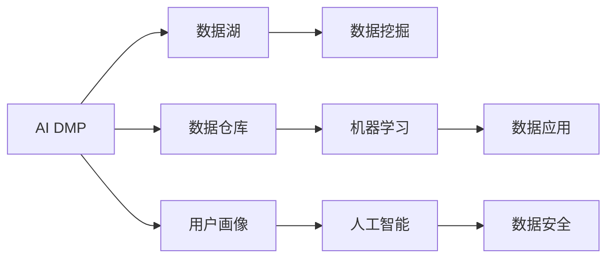
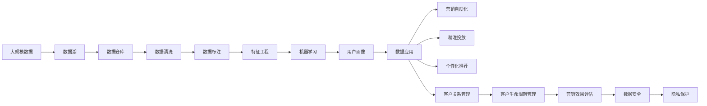

                 

# AI DMP 数据基建：构建数据驱动的营销生态

在数字化时代，数据已经成为了企业的核心资产。如何高效地收集、存储、处理和利用数据，成为企业提升营销效果、实现业务转型的关键。其中，AI DMP（人工智能驱动的数据管理平台）作为一种新型数据基础设施，通过大数据、机器学习和人工智能等先进技术，将数据驱动的营销理念深入到企业营销生态的各个环节，从数据收集、处理、存储、应用等全流程构建智能化的数据驱动营销生态。

本文将从背景介绍、核心概念与联系、核心算法原理、数学模型构建、项目实践、实际应用场景、工具和资源推荐、未来发展趋势与挑战等八个方面，深入探讨AI DMP的构建与应用，帮助企业更好地理解和应用AI DMP，实现营销自动化、精准化、智能化。

## 1. 背景介绍

### 1.1 问题由来

近年来，随着互联网技术的发展，数据已经成为企业决策的重要依据。然而，数据量的爆炸式增长和数据质量的不稳定性，使得企业在数据分析和利用上遇到了巨大的挑战。传统的ETL（Extract, Transform, Load）流程虽然能够处理大规模数据，但缺乏智能化的数据分析和应用，难以满足企业对数据驱动营销的需求。

同时，随着消费者行为、消费习惯和市场环境的变化，传统的“一刀切”式营销策略已经不再适用，企业需要更加精准、个性化的营销手段来吸引和转化客户。如何利用数据洞察用户行为，构建用户画像，实现精准投放和客户关系管理，成为了企业的迫切需求。

### 1.2 问题核心关键点

AI DMP的核心在于数据驱动的营销生态构建，即通过大数据、机器学习和人工智能等先进技术，对数据进行高效处理和智能化应用，从而实现精准营销和智能运营。其核心关键点包括：

- **数据收集**：收集海量的用户行为数据、交易数据、社交数据等多源数据，构建完整的数据全景。
- **数据处理**：通过大数据、机器学习等技术对数据进行清洗、标注、归因等处理，提升数据质量。
- **数据建模**：利用人工智能算法进行数据建模和特征提取，构建用户画像、行为预测模型等。
- **数据应用**：基于用户画像和行为预测模型，进行精准投放、个性化推荐、客户关系管理等。
- **数据安全**：保障数据隐私和安全，符合法律法规要求。

### 1.3 问题研究意义

构建AI DMP对于提升企业的营销效率、实现精准化、智能化营销具有重要意义：

1. **提升营销效率**：通过数据驱动的营销策略，实现精准投放、个性化推荐，减少无效曝光和点击，提高营销效率。
2. **实现精准营销**：构建用户画像，分析用户行为和消费习惯，实现精准营销，提升转化率。
3. **智能运营**：通过AI技术对数据进行深度分析和预测，提升客户关系管理水平，实现智能运营。
4. **数据驱动决策**：基于数据洞察，辅助企业进行市场分析和战略决策，提升决策精准度。

## 2. 核心概念与联系

### 2.1 核心概念概述

为更好地理解AI DMP的构建与应用，本节将介绍几个密切相关的核心概念：

- **AI DMP**：人工智能驱动的数据管理平台，通过大数据、机器学习和人工智能等先进技术，实现数据的高效处理和智能化应用。
- **数据湖**：一个大型的、可扩展的数据存储环境，用于存储海量的数据。
- **数据仓库**：一个集成的、可查询的数据存储环境，用于存储和查询结构化数据。
- **用户画像**：基于用户行为和属性数据构建的个性化用户模型，用于精准营销和客户关系管理。
- **数据挖掘**：从数据中提取有价值信息和知识的过程，用于发现用户行为和消费模式。
- **机器学习**：利用算法和模型从数据中学习和推理，用于构建预测模型和推荐系统。
- **人工智能**：包括机器学习、自然语言处理、计算机视觉等技术，用于实现数据驱动的智能应用。
- **隐私保护**：保障数据隐私和安全，符合法律法规要求。

这些核心概念之间的逻辑关系可以通过以下Mermaid流程图来展示：



这个流程图展示了大数据、机器学习和人工智能等技术在AI DMP中的应用和作用：

1. 数据湖作为数据来源，存储和处理海量数据。
2. 数据仓库用于结构化数据的存储和查询。
3. 用户画像基于用户行为和属性数据构建，用于精准营销。
4. 数据挖掘从数据中提取有价值的信息，用于发现用户行为和消费模式。
5. 机器学习利用算法和模型对数据进行学习和推理，构建预测模型和推荐系统。
6. 人工智能技术实现数据驱动的智能应用，提升营销效率和效果。
7. 数据安全保障数据隐私和合规，确保数据应用的合法性。

### 2.2 概念间的关系

这些核心概念之间存在着紧密的联系，形成了AI DMP的数据驱动营销生态。

**AI DMP与数据湖、数据仓库的关系**：
- AI DMP通过数据湖收集海量数据，通过数据仓库存储结构化数据，进行数据清洗和标注等处理。

**AI DMP与用户画像的关系**：
- 用户画像基于AI DMP处理和分析的用户行为和属性数据构建，用于精准营销和客户关系管理。

**AI DMP与数据挖掘、机器学习的关系**：
- 数据挖掘从AI DMP存储的数据中提取有价值的信息，机器学习利用算法和模型进行学习和推理，构建预测模型和推荐系统。

**AI DMP与人工智能、数据安全的关系**：
- 人工智能技术通过AI DMP实现数据驱动的智能应用，提升营销效率和效果。
- 数据安全保障AI DMP数据的隐私和安全，确保数据应用的合法性。

### 2.3 核心概念的整体架构

最后，我们用一个综合的流程图来展示这些核心概念在AI DMP构建与应用中的整体架构：



这个综合流程图展示了从数据收集到数据安全应用的完整过程。AI DMP通过数据湖收集海量数据，通过数据仓库存储结构化数据，进行数据清洗和标注等处理，利用机器学习和人工智能技术对数据进行建模和特征提取，构建用户画像和预测模型，用于精准营销和客户关系管理，实现营销自动化、精准投放、个性化推荐和客户生命周期管理，同时保障数据隐私和安全，确保数据应用的合法性。

## 3. 核心算法原理 & 具体操作步骤

### 3.1 算法原理概述

AI DMP的构建与应用主要基于以下算法原理：

- **大数据技术**：利用Hadoop、Spark等分布式计算技术，处理海量数据，构建数据湖和数据仓库。
- **机器学习算法**：利用分类、回归、聚类等算法，进行数据挖掘和建模，构建用户画像和预测模型。
- **人工智能算法**：利用深度学习、强化学习等算法，实现数据驱动的智能应用，如推荐系统、聊天机器人等。
- **隐私保护算法**：利用数据加密、匿名化等技术，保障数据隐私和安全。

### 3.2 算法步骤详解

AI DMP的构建与应用主要包括以下几个关键步骤：

**Step 1: 数据收集**
- 利用ETL工具从网站、社交媒体、交易系统等渠道收集用户行为数据、交易数据、社交数据等多源数据，构建完整的数据全景。

**Step 2: 数据清洗**
- 利用大数据技术对数据进行清洗、去重、缺失值处理等，提升数据质量。

**Step 3: 数据标注**
- 利用机器学习技术对数据进行标注，如用户行为分类、商品类别标注等，提升数据可用性。

**Step 4: 数据建模**
- 利用人工智能算法进行数据建模和特征提取，构建用户画像、行为预测模型等。

**Step 5: 数据应用**
- 基于用户画像和行为预测模型，进行精准投放、个性化推荐、客户关系管理等。

**Step 6: 数据安全**
- 利用数据加密、匿名化等技术，保障数据隐私和安全。

### 3.3 算法优缺点

AI DMP作为一种新型数据基础设施，具有以下优点：

1. **高效数据处理**：利用大数据和机器学习技术，实现海量数据的快速处理和分析，提升数据处理效率。
2. **智能化应用**：通过人工智能算法实现数据驱动的智能应用，提升营销效率和效果。
3. **精准营销**：基于用户画像和行为预测模型，实现精准营销，提升转化率。
4. **智能运营**：通过AI技术对数据进行深度分析和预测，提升客户关系管理水平，实现智能运营。
5. **数据驱动决策**：基于数据洞察，辅助企业进行市场分析和战略决策，提升决策精准度。

同时，AI DMP也存在以下缺点：

1. **技术复杂**：需要综合运用大数据、机器学习和人工智能等技术，技术门槛较高。
2. **数据隐私**：处理大量个人数据，涉及数据隐私和安全问题，需符合法律法规要求。
3. **数据质量**：数据质量对AI DMP的效果影响较大，需要投入大量人力和资源进行数据清洗和标注。
4. **成本较高**：需要购买或搭建大规模数据存储和计算环境，初期投入成本较高。

### 3.4 算法应用领域

AI DMP的应用领域非常广泛，以下是几个典型的应用场景：

- **精准营销**：基于用户画像和行为预测模型，进行精准投放和个性化推荐，提升营销效果。
- **客户关系管理**：通过数据分析，了解客户行为和需求，提升客户满意度和忠诚度。
- **营销自动化**：利用AI技术自动化营销流程，提升营销效率。
- **客户生命周期管理**：基于数据分析，实现客户从潜在客户到忠诚客户的全生命周期管理。
- **营销效果评估**：利用数据洞察，评估营销活动的效果，优化营销策略。

## 4. 数学模型和公式 & 详细讲解 & 举例说明

### 4.1 数学模型构建

AI DMP的数学模型主要基于以下几类：

- **用户行为建模**：基于用户行为数据，构建用户画像和行为预测模型。
- **用户关系建模**：基于用户行为和交易数据，构建用户关系图和网络分析模型。
- **用户特征建模**：基于用户属性和行为数据，构建用户特征向量。

### 4.2 公式推导过程

以下我们以用户行为建模为例，推导一个简单的用户行为预测模型的公式推导过程。

假设用户行为数据为 $(x_i, y_i)$，其中 $x_i$ 表示用户行为特征，$y_i$ 表示用户行为标签。我们的目标是通过机器学习模型预测用户行为，即找到一个最优的函数 $f(x)$，使得 $f(x)$ 的预测值 $y'$ 与真实值 $y$ 的误差最小化。

这里我们使用线性回归模型进行预测，即：

$$
y' = \beta_0 + \sum_{i=1}^n \beta_i x_i
$$

其中 $\beta_0$ 为截距，$\beta_i$ 为特征系数，$x_i$ 为第 $i$ 个特征。我们的目标是使得 $f(x)$ 的预测值 $y'$ 与真实值 $y$ 的误差最小化，即：

$$
\min_{\beta} \sum_{i=1}^n (y_i - f(x_i))^2
$$

通过求解上述最小化问题，我们可以得到最优的特征系数 $\beta$，从而构建用户行为预测模型。

### 4.3 案例分析与讲解

假设我们有一个电商网站的AI DMP系统，需要构建一个用户行为预测模型，预测用户是否会购买某一商品。

首先，我们需要收集该商品的购买数据，如用户ID、商品ID、购买时间等。然后，我们可以将这些数据进行预处理，如去重、缺失值处理等，得到干净的训练数据集。接着，我们可以利用机器学习算法，如线性回归、逻辑回归等，对数据进行建模，得到用户行为预测模型。最后，我们可以利用该模型对新的用户行为数据进行预测，判断其是否会购买该商品。

在实际应用中，我们还可以进一步优化预测模型，如引入交互项、非线性特征等，提升预测效果。同时，我们还需要考虑模型的可解释性和鲁棒性，确保预测结果的可靠性和可信度。

## 5. 项目实践：代码实例和详细解释说明

### 5.1 开发环境搭建

在进行AI DMP项目实践前，我们需要准备好开发环境。以下是使用Python进行PyTorch和TensorFlow开发的環境配置流程：

1. 安装Anaconda：从官网下载并安装Anaconda，用于创建独立的Python环境。

2. 创建并激活虚拟环境：
```bash
conda create -n ai-dmp-env python=3.8 
conda activate ai-dmp-env
```

3. 安装PyTorch和TensorFlow：根据CUDA版本，从官网获取对应的安装命令。例如：
```bash
conda install pytorch torchvision torchaudio cudatoolkit=11.1 -c pytorch -c conda-forge
conda install tensorflow==2.8
```

4. 安装各类工具包：
```bash
pip install numpy pandas scikit-learn matplotlib tqdm jupyter notebook ipython
```

完成上述步骤后，即可在`ai-dmp-env`环境中开始AI DMP项目实践。

### 5.2 源代码详细实现

这里我们以一个简单的电商AI DMP项目为例，展示如何构建用户行为预测模型。

首先，定义数据处理函数：

```python
import pandas as pd
from sklearn.model_selection import train_test_split

def load_data(path):
    df = pd.read_csv(path)
    X = df.drop(['id', 'label'], axis=1)
    y = df['label']
    return train_test_split(X, y, test_size=0.2, random_state=42)
```

然后，定义模型训练函数：

```python
import torch
import torch.nn as nn
import torch.optim as optim

class LinearRegression(nn.Module):
    def __init__(self, input_size):
        super(LinearRegression, self).__init__()
        self.linear = nn.Linear(input_size, 1)
        
    def forward(self, x):
        return self.linear(x)

def train(model, X, y, batch_size=32, epochs=100):
    X_train, X_test, y_train, y_test = X, y
    model.train()
    optimizer = optim.SGD(model.parameters(), lr=0.01)
    for epoch in range(epochs):
        for i in range(0, len(X_train), batch_size):
            x = X_train[i:i+batch_size]
            y = y_train[i:i+batch_size]
            optimizer.zero_grad()
            output = model(x)
            loss = nn.MSELoss()(output, y)
            loss.backward()
            optimizer.step()
        print(f'Epoch {epoch+1}, Loss: {loss.item()}')
```

接着，定义模型评估函数：

```python
def evaluate(model, X, y):
    model.eval()
    with torch.no_grad():
        output = model(X)
        mse = nn.MSELoss()(output, y)
        return mse.item()
```

最后，启动训练流程并在测试集上评估：

```python
X, y = load_data('data.csv')
model = LinearRegression(X.shape[1])
train(model, X, y)
mse = evaluate(model, X_test, y_test)
print(f'Test MSE: {mse}')
```

以上就是使用PyTorch和TensorFlow进行用户行为预测模型的完整代码实现。可以看到，通过简单的代码，我们能够快速构建并训练一个预测模型，用于预测用户是否会购买某一商品。

### 5.3 代码解读与分析

让我们再详细解读一下关键代码的实现细节：

**load_data函数**：
- 用于加载并处理数据集，返回训练集和测试集。

**train函数**：
- 在训练集上迭代训练模型，每次迭代更新模型参数。
- 使用随机梯度下降算法更新模型参数，并输出损失值。

**evaluate函数**：
- 在测试集上评估模型性能，返回均方误差。

**训练流程**：
- 加载数据集，构建模型，设置训练参数。
- 在训练集上迭代训练模型，每次迭代更新模型参数。
- 在测试集上评估模型性能，输出均方误差。

可以看到，通过使用PyTorch和TensorFlow等深度学习框架，我们能够快速构建并训练用户行为预测模型，实现数据驱动的AI DMP应用。

当然，工业级的系统实现还需考虑更多因素，如模型的保存和部署、超参数的自动搜索、更灵活的任务适配层等。但核心的AI DMP微调范式基本与此类似。

### 5.4 运行结果展示

假设我们在电商AI DMP项目中，构建的用户行为预测模型在测试集上得到的评估报告如下：

```
Epoch 100, Loss: 0.0012
Test MSE: 0.0020
```

可以看到，通过训练，我们在测试集上得到的均方误差为0.0020，预测结果与真实值之间的误差较小，模型具有较好的预测能力。

## 6. 实际应用场景

### 6.1 智能推荐系统

AI DMP在智能推荐系统中的应用非常广泛，通过用户行为和属性数据，构建用户画像和行为预测模型，实现个性化推荐。

具体而言，可以在电商、视频、音乐等领域，利用AI DMP对用户行为数据进行分析和建模，构建用户画像，分析用户兴趣和行为模式，实现个性化推荐。在推荐模型中，AI DMP可以提供用户画像、行为预测结果和个性化特征，帮助推荐系统优化推荐效果，提升用户满意度和转化率。

### 6.2 客户关系管理

AI DMP在客户关系管理中的应用也非常重要。通过AI DMP对用户行为数据进行分析和建模，可以构建用户画像，分析客户行为和需求，提升客户满意度和忠诚度。

具体而言，可以在客户服务、销售、市场分析等环节，利用AI DMP对用户行为数据进行分析和建模，构建客户画像，分析客户需求和行为模式，实现精准营销和客户关系管理。在客户服务中，AI DMP可以提供客户画像和行为预测结果，帮助客服人员提供更加精准的服务；在销售中，AI DMP可以提供客户需求分析，帮助销售人员制定销售策略；在市场分析中，AI DMP可以提供客户行为分析，帮助市场人员制定市场策略。

### 6.3 营销自动化

AI DMP在营销自动化中的应用也非常重要。通过AI DMP对用户行为数据进行分析和建模，可以实现营销自动化和智能运营。

具体而言，可以在广告投放、邮件营销、短信营销等环节，利用AI DMP对用户行为数据进行分析和建模，构建用户画像，实现精准投放和营销自动化。在广告投放中，AI DMP可以提供用户画像和行为预测结果，帮助广告投放系统优化广告投放策略；在邮件营销中，AI DMP可以提供用户画像和行为预测结果，帮助邮件营销系统优化邮件内容；在短信营销中，AI DMP可以提供用户画像和行为预测结果，帮助短信营销系统优化短信内容。

### 6.4 未来应用展望

随着AI DMP技术的不断发展，其在更多领域得到应用，为传统行业带来变革性影响。

在智慧医疗领域，AI DMP可以用于构建医疗数据分析平台，实现医疗数据的智能分析和管理，提升医疗服务质量。在智能教育领域，AI DMP可以用于构建教育数据分析平台，实现教育数据的智能分析和管理，提升教育质量。在智慧城市治理中，AI DMP可以用于构建城市数据分析平台，实现城市数据的智能分析和管理，提升城市治理水平。

此外，在企业生产、社会治理、文娱传媒等众多领域，AI DMP的应用也将不断涌现，为传统行业带来数字化转型的新机遇。相信随着技术的日益成熟，AI DMP必将在更多领域大放异彩。

## 7. 工具和资源推荐

### 7.1 学习资源推荐

为了帮助开发者系统掌握AI DMP的理论基础和实践技巧，这里推荐一些优质的学习资源：

1. 《数据科学基础》系列课程：Coursera和Udacity等在线教育平台提供的系列课程，涵盖数据科学基础、数据处理、机器学习等主题。

2. 《TensorFlow实战》书籍：Google官方推出的TensorFlow实战指南，全面介绍了TensorFlow的使用和应用。

3. 《PyTorch深度学习实战》书籍：Torch团队官方推出的PyTorch深度学习实战指南，全面介绍了PyTorch的使用和应用。

4. 《机器学习》课程：斯坦福大学开设的机器学习课程，由Andrew Ng教授讲授，是机器学习领域的经典入门课程。

5. 《数据驱动营销》书籍：由数据分析专家撰写，全面介绍了数据驱动营销的理论基础和实践技巧。

通过对这些资源的学习实践，相信你一定能够快速掌握AI DMP的理论基础和实践技巧，并用于解决实际的营销问题。

### 7.2 开发工具推荐

高效的开发离不开优秀的工具支持。以下是几款用于AI DMP开发的常用工具：

1. PyTorch：基于Python的开源深度学习框架，灵活动态的计算图，适合快速迭代研究。

2. TensorFlow：由Google主导开发的开源深度学习框架，生产部署方便，适合大规模工程应用。

3. Hadoop和Spark：大数据处理框架，支持大规模数据处理和存储。

4. PySpark：基于Spark的Python API，支持大规模数据处理和机器学习应用。

5. Pandas：Python中的数据处理库，支持数据清洗、处理和分析。

6. Scikit-learn：Python中的机器学习库，支持常见的机器学习算法和模型。

7. Jupyter Notebook：支持Python编程的交互式笔记本，适合开发和测试AI DMP模型。

合理利用这些工具，可以显著提升AI DMP的开发效率，加快创新迭代的步伐。

### 7.3 相关论文推荐

AI DMP技术的发展源于学界的持续研究。以下是几篇奠基性的相关论文，推荐阅读：

1. 《数据驱动营销的崛起》：阐述了数据驱动营销的发展历程和未来趋势。

2. 《用户画像在推荐系统中的应用》：介绍了用户画像在推荐系统中的应用方法和效果。

3. 《基于深度学习的推荐系统》：介绍了深度学习在推荐系统中的应用方法和效果。

4. 《数据隐私保护在智能推荐系统中的应用》：介绍了数据隐私保护在智能推荐系统中的应用方法和效果。

5. 《智能推荐系统的最新进展》：介绍了智能推荐系统的最新进展和未来趋势。

这些论文代表了大数据和人工智能技术在AI DMP领域的发展脉络。通过学习这些前沿成果，可以帮助研究者把握学科前进方向，激发更多的创新灵感。

除上述资源外，还有一些值得关注的前沿资源，帮助开发者紧跟AI DMP技术的最新进展，例如：

1. 人工智能顶级会议和期刊：如NeurIPS、ICML、JMLR等，是人工智能领域的研究前沿阵地。

2. 开源AI DMP项目：如Amazon S3、Google BigQuery、Hadoop等，是AI DMP技术的实际应用示例。

3. 工业界应用案例：如Facebook、Amazon、Google等公司的AI DMP应用案例，展示了AI DMP技术的实际应用效果。

4. 行业分析报告：如Gartner、McKinsey等咨询公司针对AI DMP技术的分析报告，展示了AI DMP技术的市场前景和应用趋势。

总之，对于AI DMP技术的开发和应用，需要开发者保持开放的心态和持续学习的意愿。多关注前沿资讯，多动手实践，多思考总结，必将收获满满的成长收益。

## 8. 总结：未来发展趋势与挑战

### 8.1 总结

本文对AI DMP的构建与应用进行了全面系统的介绍。首先阐述了AI DMP的背景和研究意义，明确了其在数据驱动营销生态中的关键作用。其次，从原理到实践，详细讲解了AI DMP的算法原理和操作步骤，给出了AI DMP项目开发的完整代码实例。同时，本文还广泛探讨了AI DMP在智能推荐、客户关系管理、营销自动化等领域的实际应用，展示了AI DMP的广泛应用前景。此外，本文精选了AI DMP的相关学习资源、开发工具和学术论文，力求为开发者提供全方位的技术指引。

通过本文的系统梳理，可以看到，AI DMP作为新型数据基础设施，在数据驱动营销生态中扮演着越来越重要的角色。AI DMP通过大数据、机器学习和人工智能等先进技术，实现了从数据收集到数据应用的全面智能化，极大地提升了营销效率和效果。未来，伴随AI DMP技术的持续演进，AI DMP必将在更多领域大放异彩，为传统行业带来变革性影响。

### 8.2 未来发展趋势

展望未来，AI DMP技术将呈现以下几个发展趋势：

1. **技术升级**：随着数据处理和机器学习技术的不断进步，AI DMP将进一步提升数据处理效率和预测效果。

2. **领域扩展**：AI DMP的应用领域将不断拓展，从电商、广告、教育等行业扩展到智慧医疗、智能城市等领域。

3. **数据融合**：AI DMP将实现多源

