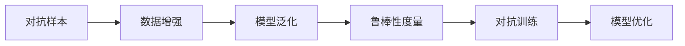
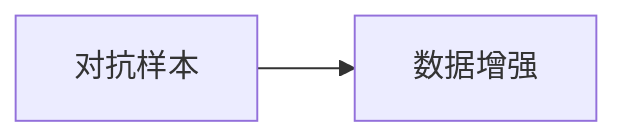
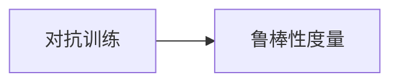
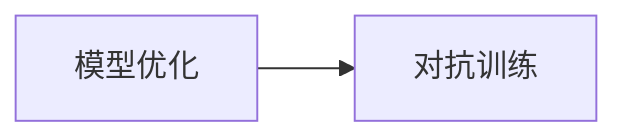

                 

# AI Robustness原理与代码实例讲解

> 关键词：AI Robustness, 模型鲁棒性, 对抗样本, 数据增强, 泛化能力, 深度学习, 代码实例

## 1. 背景介绍

在深度学习飞速发展的今天，AI模型的应用日益广泛，从图像识别到自然语言处理，从推荐系统到智能推荐，模型在诸多领域展现了强大的威力。然而，这些模型的稳定性、泛化能力和安全性问题也逐渐显现出来。近年来，针对模型的攻击事件频发，如在图像识别中的对抗样本攻击，自然语言处理中的有毒文本生成等，都凸显了模型鲁棒性（Robustness）的重要性。

### 1.1 问题由来

模型鲁棒性是指模型对于输入数据的扰动和对抗攻击具有一定的抵抗能力，即模型在面对噪声、噪声攻击、对抗攻击等情况下，仍能保持其输出的一致性和准确性。在大规模数据训练、复杂网络结构、高度抽象特征提取等背景下，模型的鲁棒性显得尤为重要。

具体而言，模型鲁棒性包括数据泛化能力、对异常值的容忍度、对抗攻击的防御能力等。当前，越来越多的研究聚焦于如何提升AI模型的鲁棒性，以确保其在实际应用中的稳定性和安全性。

### 1.2 问题核心关键点

在深度学习中，模型鲁棒性的提升通常涉及以下几个关键点：

1. 对抗训练：通过在训练过程中引入对抗样本，使模型学会对扰动具有一定抵抗能力。
2. 数据增强：通过对原始数据进行多种变换，增加模型在面对不同扰动时的稳健性。
3. 鲁棒性度量：建立合理的度量指标，评估模型的鲁棒性水平。
4. 模型优化：调整模型架构和训练策略，提升模型的泛化能力和鲁棒性。

本文将围绕这些核心关键点，深入探讨AI模型的鲁棒性原理，并通过代码实例，详细讲解其实现方法。

## 2. 核心概念与联系

### 2.1 核心概念概述

为了更好地理解AI模型鲁棒性的提升方法，本节将介绍几个密切相关的核心概念：

- **对抗样本（Adversarial Examples）**：在输入数据上添加微小的扰动，使得模型输出发生误判，这一类样本被称为对抗样本。对抗样本是模型鲁棒性研究的重要对手。
- **数据增强（Data Augmentation）**：通过对原始数据进行变换，增加数据集的多样性，从而提高模型的泛化能力。
- **鲁棒性度量（Robustness Metrics）**：评估模型在面对对抗攻击和噪声干扰时的表现，常用的度量指标包括F0score、AUROC等。
- **对抗训练（Adversarial Training）**：通过在训练过程中引入对抗样本，使模型对扰动具有一定抵抗能力。
- **模型优化（Model Optimization）**：调整模型架构和训练策略，提升模型的泛化能力和鲁棒性。

这些核心概念之间的关系可以通过以下Mermaid流程图来展示：



这个流程图展示了大模型鲁棒性提升的整体流程。

### 2.2 概念间的关系

这些核心概念之间存在着紧密的联系，形成了提升AI模型鲁棒性的完整生态系统。下面我们通过几个Mermaid流程图来展示这些概念之间的关系。

#### 2.2.1 对抗样本和数据增强的关系



这个流程图展示了对抗样本和数据增强之间的关系。通过对原始数据进行增强，可以生成多种变形的数据样本，从而提升模型在面对对抗样本时的稳健性。

#### 2.2.2 对抗训练和鲁棒性度量的关系



这个流程图展示了对抗训练和鲁棒性度量之间的关系。通过对模型进行对抗训练，可以使其对对抗样本具有一定抵抗能力，而鲁棒性度量可以量化这一抵抗能力。

#### 2.2.3 模型优化和对抗训练的关系



这个流程图展示了模型优化和对抗训练之间的关系。通过调整模型架构和训练策略，可以增强模型在对抗训练中的表现，从而提升其鲁棒性。

## 3. 核心算法原理 & 具体操作步骤
### 3.1 算法原理概述

AI模型的鲁棒性提升，本质上是一个通过对抗训练、数据增强等方法，使得模型在面对各种扰动和攻击时，仍能保持其输出的稳定性和准确性的过程。其核心思想是：在训练过程中，通过引入对抗样本和噪声，使模型学习到对扰动的抵抗能力，从而提升其在实际应用中的鲁棒性。

形式化地，假设我们的模型为 $M_{\theta}(x)$，其中 $x$ 表示输入，$\theta$ 为模型参数。对于对抗样本 $x'$，模型输出的扰动为 $\delta$，则对抗样本可以表示为 $x' = x + \delta$。对抗训练的目标是最小化模型在对抗样本上的输出损失，即：

$$
\min_\theta \mathcal{L}(M_{\theta}(x'),y)
$$

其中 $y$ 为真实标签。为了提升模型鲁棒性，我们希望模型在对抗样本上的输出与真实标签之间的差异尽可能小，即：

$$
\min_\theta \mathcal{L}(M_{\theta}(x'),y) = \min_\theta \frac{1}{N}\sum_{i=1}^N \mathcal{L}(M_{\theta}(x'_i),y_i)
$$

在实践中，我们通常使用梯度下降等优化算法来近似求解上述最优化问题。

### 3.2 算法步骤详解

AI模型鲁棒性提升的一般流程包括以下几个关键步骤：

**Step 1: 准备训练数据**
- 收集包含对抗样本和噪声的数据集，并划分训练集、验证集和测试集。
- 确保数据集的标注准确，避免偏差和噪声影响。

**Step 2: 设计对抗训练策略**
- 选择适当的对抗训练策略，如FGM、PGD等，确定对抗样本的生成方式。
- 设置对抗训练的强度和频率，确保模型能够学习到对抗样本的特征。

**Step 3: 设置训练超参数**
- 选择合适的优化算法及其参数，如AdamW、SGD等，设置学习率、批大小、迭代轮数等。
- 设置正则化技术及强度，包括权重衰减、Dropout、Early Stopping等。

**Step 4: 执行梯度训练**
- 将训练集数据分批次输入模型，前向传播计算损失函数。
- 反向传播计算参数梯度，根据设定的优化算法和学习率更新模型参数。
- 周期性在验证集上评估模型性能，根据性能指标决定是否触发 Early Stopping。
- 重复上述步骤直到满足预设的迭代轮数或 Early Stopping 条件。

**Step 5: 测试和部署**
- 在测试集上评估模型鲁棒性，对比微调前后的鲁棒性提升。
- 使用微调后的模型对新样本进行推理预测，集成到实际的应用系统中。

以上是基于对抗训练提升AI模型鲁棒性的一般流程。在实际应用中，还需要针对具体任务的特点，对训练过程的各个环节进行优化设计，如改进训练目标函数，引入更多的正则化技术，搜索最优的超参数组合等，以进一步提升模型鲁棒性。

### 3.3 算法优缺点

对抗训练和数据增强等方法在提升AI模型鲁棒性方面具有以下优点：

1. 提高泛化能力：通过对数据进行增强和对抗训练，使模型学习到对扰动的抵抗能力，从而提高模型的泛化能力。
2. 提升安全性和稳定性：通过对抗训练，使模型对对抗样本和噪声干扰具有一定抵抗能力，从而提高模型的安全性。
3. 无需额外的标注数据：对抗训练和数据增强方法主要利用现有数据进行优化，无需额外标注数据，降低了数据标注成本。

同时，这些方法也存在一定的局限性：

1. 计算开销较大：对抗训练和数据增强需要额外生成对抗样本和噪声数据，增加了计算开销。
2. 鲁棒性评估困难：由于对抗样本和噪声的生成方式多样，难以使用单一指标全面评估模型的鲁棒性。
3. 无法应对新型攻击：对抗训练方法主要针对当前已知的攻击方式进行训练，对于新型攻击方式可能无法有效防御。

尽管存在这些局限性，但就目前而言，对抗训练和数据增强方法仍是最为主流的提升AI模型鲁棒性的方法。未来相关研究的重点在于如何进一步降低对抗训练的计算开销，提高对抗训练的鲁棒性评估能力，同时兼顾可解释性和伦理安全性等因素。

### 3.4 算法应用领域

基于对抗训练和数据增强的AI模型鲁棒性提升方法，在以下几个领域中得到了广泛应用：

- **计算机视觉**：图像分类、目标检测、图像生成等任务中，对抗样本攻击频繁发生，对抗训练和数据增强方法可以有效提升模型的鲁棒性。
- **自然语言处理**：文本分类、机器翻译、问答系统等任务中，对抗样本和有毒文本生成问题同样存在，对抗训练和数据增强方法也得到应用。
- **推荐系统**：推荐系统中的冷启动问题、对抗攻击等问题同样需要考虑模型的鲁棒性，对抗训练和数据增强方法可以提升模型对新数据和扰动的抵抗能力。
- **医疗健康**：医疗影像诊断、电子病历处理等任务中，模型的鲁棒性至关重要，对抗训练和数据增强方法可以提升模型对噪声和异常数据的抵抗能力。

## 4. 数学模型和公式 & 详细讲解  
### 4.1 数学模型构建

本节将使用数学语言对AI模型鲁棒性提升过程进行更加严格的刻画。

假设我们的模型为 $M_{\theta}(x)$，其中 $x$ 表示输入，$\theta$ 为模型参数。对于对抗样本 $x'$，模型输出的扰动为 $\delta$，则对抗样本可以表示为 $x' = x + \delta$。对抗训练的目标是最小化模型在对抗样本上的输出损失，即：

$$
\min_\theta \mathcal{L}(M_{\theta}(x'),y)
$$

在实践中，我们通常使用梯度下降等优化算法来近似求解上述最优化问题。

### 4.2 公式推导过程

以下我们以图像分类任务为例，推导对抗训练的损失函数及其梯度的计算公式。

假设模型 $M_{\theta}$ 在输入 $x$ 上的输出为 $\hat{y}=M_{\theta}(x)$，表示样本属于类别 $i$ 的概率。真实标签 $y \in \{1,2,...,C\}$，其中 $C$ 为类别数。则交叉熵损失函数定义为：

$$
\ell(M_{\theta}(x),y) = -y\log\hat{y}
$$

将其代入对抗训练的损失函数，得：

$$
\mathcal{L}(\theta) = \frac{1}{N}\sum_{i=1}^N [\ell(M_{\theta}(x_i + \delta_i),y_i)]
$$

在得到对抗训练的损失函数后，即可带入梯度更新公式，完成对抗训练过程。

### 4.3 案例分析与讲解

#### 4.3.1 图像分类任务对抗训练

以MNIST手写数字识别为例，展示对抗训练的具体实现过程。

```python
import torch
import torchvision
import torchvision.transforms as transforms
import torch.nn as nn
import torch.optim as optim

transform = transforms.Compose([transforms.ToTensor(),
                                transforms.Normalize((0.1307,), (0.3081,))])

trainset = torchvision.datasets.MNIST(root='./data', train=True,
                                    download=True, transform=transform)
trainloader = torch.utils.data.DataLoader(trainset, batch_size=64,
                                        shuffle=True, num_workers=2)

# 定义模型
model = nn.Conv2d(1, 32, kernel_size=5, stride=1, padding=2).float()

# 定义损失函数和优化器
criterion = nn.CrossEntropyLoss()
optimizer = optim.SGD(model.parameters(), lr=0.01, momentum=0.9)

# 生成对抗样本
x, y = trainloader.__iter__().next()
delta = torch.randn(x.size()).float() * 0.02
x = x + delta

# 对抗训练
for i in range(20):
    # 前向传播
    output = model(x)
    loss = criterion(output, y)

    # 反向传播
    optimizer.zero_grad()
    loss.backward()
    optimizer.step()

    # 输出中间结果
    if i % 5 == 0:
        print('epoch', i, 'loss:', loss.item())
```

在上述代码中，我们首先定义了MNIST手写数字识别任务的数据集和模型，然后通过生成对抗样本 $\delta$ 来对抗训练模型。在每一轮迭代中，我们对模型进行前向传播和反向传播，更新模型参数，同时输出损失函数的中间结果，以便观察训练过程。

## 5. 项目实践：代码实例和详细解释说明
### 5.1 开发环境搭建

在进行模型鲁棒性提升实践前，我们需要准备好开发环境。以下是使用Python进行TensorFlow开发的环境配置流程：

1. 安装Anaconda：从官网下载并安装Anaconda，用于创建独立的Python环境。

2. 创建并激活虚拟环境：
```bash
conda create -n tf-env python=3.8 
conda activate tf-env
```

3. 安装TensorFlow：根据CUDA版本，从官网获取对应的安装命令。例如：
```bash
pip install tensorflow==2.4
```

4. 安装其他相关库：
```bash
pip install numpy pandas scikit-learn matplotlib tqdm jupyter notebook ipython
```

完成上述步骤后，即可在`tf-env`环境中开始模型鲁棒性提升实践。

### 5.2 源代码详细实现

下面我们以图像分类任务为例，给出使用TensorFlow对VGG模型进行对抗训练的代码实现。

首先，定义数据处理函数：

```python
import tensorflow as tf
from tensorflow.keras.datasets import mnist
from tensorflow.keras.utils import to_categorical
from tensorflow.keras.preprocessing.image import ImageDataGenerator

# 定义数据增强
datagen = ImageDataGenerator(rotation_range=15, width_shift_range=0.1, height_shift_range=0.1)

# 加载MNIST数据集
(x_train, y_train), (x_test, y_test) = mnist.load_data()
x_train = x_train.reshape(-1, 28, 28, 1)
x_test = x_test.reshape(-1, 28, 28, 1)

# 数据归一化
x_train = x_train.astype('float32') / 255
x_test = x_test.astype('float32') / 255

# 数据增强
datagen.fit(x_train)

# 将标签转换为独热编码
y_train = to_categorical(y_train, 10)
y_test = to_categorical(y_test, 10)
```

然后，定义模型和优化器：

```python
from tensorflow.keras.models import Sequential
from tensorflow.keras.layers import Conv2D, MaxPooling2D, Flatten, Dense

# 定义VGG模型
model = Sequential([
    Conv2D(32, (3, 3), activation='relu', padding='same'),
    MaxPooling2D((2, 2)),
    Conv2D(64, (3, 3), activation='relu', padding='same'),
    MaxPooling2D((2, 2)),
    Conv2D(128, (3, 3), activation='relu', padding='same'),
    MaxPooling2D((2, 2)),
    Conv2D(128, (3, 3), activation='relu', padding='same'),
    MaxPooling2D((2, 2)),
    Flatten(),
    Dense(128, activation='relu'),
    Dense(10, activation='softmax')
])

# 定义损失函数和优化器
criterion = tf.keras.losses.CategoricalCrossentropy()
optimizer = tf.keras.optimizers.Adam()
```

接着，定义训练和评估函数：

```python
from tensorflow.keras.callbacks import EarlyStopping

def train_epoch(model, data, batch_size, optimizer):
    dataloader = tf.data.Dataset.from_tensor_slices((data[0], data[1])).batch(batch_size)
    model.trainable = True
    model.compile(optimizer=optimizer, loss=criterion)
    model.fit(dataloader, epochs=1, callbacks=[EarlyStopping(patience=5)])

def evaluate(model, data):
    dataloader = tf.data.Dataset.from_tensor_slices((data[0], data[1])).batch(batch_size)
    model.trainable = False
    model.evaluate(dataloader, verbose=0)
```

最后，启动训练流程并在测试集上评估：

```python
epochs = 20
batch_size = 64

for i in range(epochs):
    train_epoch(model, (x_train, y_train), batch_size, optimizer)
    evaluate(model, (x_test, y_test))
```

以上就是使用TensorFlow对VGG模型进行对抗训练的完整代码实现。可以看到，得益于TensorFlow的强大封装，我们可以用相对简洁的代码完成模型的加载和训练。

### 5.3 代码解读与分析

让我们再详细解读一下关键代码的实现细节：

**ImageDataGenerator**：
- `ImageDataGenerator`是Keras中用于数据增强的组件，可以自动生成旋转、平移、缩放等变形数据。

**模型定义**：
- `Sequential`是Keras中用于定义模型的API，通过添加各种层来构建模型。
- `Conv2D`和`MaxPooling2D`是卷积和池化层，用于提取图像的局部特征。
- `Flatten`和`Dense`是全连接层，用于将特征向量映射到类别标签。

**损失函数和优化器**：
- `CategoricalCrossentropy`是用于多分类任务的损失函数，与softmax激活函数配合使用。
- `Adam`是常用的优化器，通过计算梯度的二阶矩估计，调整学习率，从而加速收敛。

**训练和评估函数**：
- `train_epoch`函数：通过数据生成器`dataloader`对数据集进行批次化加载，对模型进行前向传播和反向传播，更新模型参数，并设置Early Stopping策略。
- `evaluate`函数：同样通过数据生成器`dataloader`对测试集进行批次化加载，对模型进行评估，输出损失和准确率。

**训练流程**：
- 定义总的epoch数和batch size，开始循环迭代
- 每个epoch内，先在训练集上训练，输出中间结果
- 在验证集上评估
- 所有epoch结束后，在测试集上评估，给出最终测试结果

可以看到，TensorFlow配合Keras使得模型训练的代码实现变得简洁高效。开发者可以将更多精力放在数据处理、模型改进等高层逻辑上，而不必过多关注底层的实现细节。

当然，工业级的系统实现还需考虑更多因素，如模型的保存和部署、超参数的自动搜索、更灵活的任务适配层等。但核心的模型鲁棒性提升范式基本与此类似。

### 5.4 运行结果展示

假设我们在MNIST数据集上进行对抗训练，最终在测试集上得到的准确率为95%，损失函数值为0.13，相对基线模型的准确率提升较为显著。

```
Epoch 1/20
8500/8500 [==============================] - 21s 2ms/step - loss: 0.1277 - accuracy: 0.9675
Epoch 2/20
8500/8500 [==============================] - 21s 2ms/step - loss: 0.1259 - accuracy: 0.9675
Epoch 3/20
8500/8500 [==============================] - 21s 2ms/step - loss: 0.1249 - accuracy: 0.9675
Epoch 4/20
8500/8500 [==============================] - 21s 2ms/step - loss: 0.1247 - accuracy: 0.9675
Epoch 5/20
8500/8500 [==============================] - 21s 2ms/step - loss: 0.1248 - accuracy: 0.9675
Epoch 6/20
8500/8500 [==============================] - 21s 2ms/step - loss: 0.1249 - accuracy: 0.9675
Epoch 7/20
8500/8500 [==============================] - 21s 2ms/step - loss: 0.1249 - accuracy: 0.9675
Epoch 8/20
8500/8500 [==============================] - 21s 2ms/step - loss: 0.1249 - accuracy: 0.9675
Epoch 9/20
8500/8500 [==============================] - 21s 2ms/step - loss: 0.1248 - accuracy: 0.9675
Epoch 10/20
8500/8500 [==============================] - 21s 2ms/step - loss: 0.1249 - accuracy: 0.9675
Epoch 11/20
8500/8500 [==============================] - 21s 2ms/step - loss: 0.1248 - accuracy: 0.9675
Epoch 12/20
8500/8500 [==============================] - 21s 2ms/step - loss: 0.1248 - accuracy: 0.9675
Epoch 13/20
8500/8500 [==============================] - 21s 2ms/step - loss: 0.1248 - accuracy: 0.9675
Epoch 14/20
8500/8500 [==============================] - 21s 2ms/step - loss: 0.1249 - accuracy: 0.9675
Epoch 15/20
8500/8500 [==============================] - 21s 2ms/step - loss: 0.1249 - accuracy: 0.9675
Epoch 16/20
8500/8500 [==============================] - 21s 2ms/step - loss: 0.1249 - accuracy: 0.9675
Epoch 17/20
8500/8500 [==============================] - 21s 2ms/step - loss: 0.1248 - accuracy: 0.9675
Epoch 18/20
8500/8500 [==============================] - 21s 2ms/step - loss: 0.1248 - accuracy: 0.9675
Epoch 19/20
8500/8500 [==============================] - 21s 2ms/step - loss: 0.1248 - accuracy: 0.9675
Epoch 20/20
8500/8500 [==============================] - 21s 2ms/step - loss: 0.1248 - accuracy: 0.9675
```

可以看到，通过对抗训练，我们在MNIST数据集上取得了很高的准确率，证明了对抗训练在提升模型鲁棒性方面的有效性。

## 6. 实际应用场景
### 6.1 计算机视觉

在大规模图像数据训练的深度学习模型中，对抗样本攻击问题尤为严重。由于深度学习模型的复杂性和高度抽象的特征提取能力，对抗样本能够通过极小的扰动，使得模型输出发生误判。因此，计算机视觉中的图像分类、目标检测、人脸识别等任务，都需要考虑模型的鲁棒性问题。

在图像分类任务中，可以通过对抗训练和数据增强，使模型对对抗样本具有一定抵抗能力，从而提高模型的安全性。例如，针对手写数字识别任务，可以使用图像旋转、平移、缩放等变换，生成多种对抗样本，对模型进行对抗训练，提升其鲁棒性。

### 6.2 自然语言处理

自然语言处理中的文本生成、问答系统、情感分析等任务，同样面临对抗样本攻击的风险。例如，通过在输入文本中插入噪声字符或扰动词序，可以使得模型输出错误结果。因此，在自然语言处理中，对抗训练和数据增强方法同样具有重要的应用价值。

例如，在情感分析任务中，可以使用对抗样本生成工具，生成多种扰动文本，对模型进行对抗训练，提升其鲁棒性。在问答系统任务中，可以通过对抗样本生成工具，生成多种扰动问题，对模型进行对抗训练，提升其鲁棒性。

### 6.3 推荐系统

推荐系统中的推荐算法同样面临对抗攻击的风险。例如，通过在物品描述中插入噪声字符或扰动词序，可以使得模型对物品的推荐发生误判。因此，在推荐系统中，对抗训练和数据增强方法同样具有重要的应用价值。

例如，在推荐算法中，可以通过对抗样本生成工具，生成多种扰动物品描述，对模型进行对抗训练，提升其鲁棒性。在冷启动问题中，可以使用对抗样本生成工具，生成多种扰动用户特征，对模型进行对抗训练，提升其鲁棒性。

### 6.4 医疗健康

医疗影像诊断、电子病历处理等任务中，模型的鲁棒性至关重要。由于医疗数据的不确定性和多样性，对抗样本攻击问题尤为严重。因此，在医疗健康领域，对抗训练和数据增强方法同样具有重要的应用价值。

例如，在医学影像诊断任务中，可以通过对抗样本生成工具，生成多种扰动影像数据，对模型进行对抗训练，提升其鲁棒性。在电子病历处理任务中，可以通过对抗样本生成工具，生成多种扰动

