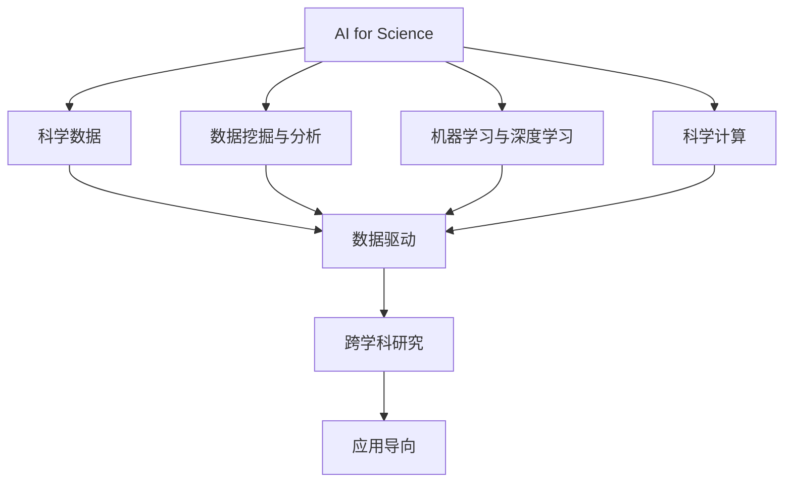
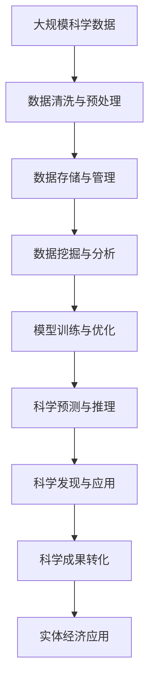

                 

# AI for Science对实体经济的影响

> 关键词：人工智能, 科学研究, 实体经济, 数据驱动, 创新应用

## 1. 背景介绍

### 1.1 问题由来
近年来，随着人工智能技术的快速发展，其在科学研究中的应用已逐渐成为热点。AI for Science（AI for Science）涵盖了从基础科学研究到应用科学研究的广泛领域，通过人工智能技术解决科学问题，驱动新的科学发现，开辟新的研究方向，并促进科学创新与实体经济的融合。

### 1.2 问题核心关键点
AI for Science的核心在于利用人工智能技术挖掘数据背后的科学规律，加速科学发现，优化科研流程，同时利用科学数据推动人工智能的持续进步，形成良性循环。AI for Science的核心关键点包括：

- 数据驱动：AI for Science的关键在于对大规模数据进行处理和分析，从而揭示隐藏的科学规律。
- 跨学科融合：AI for Science推动了计算机科学与自然科学的深度融合，促进了新的科学发现。
- 应用导向：AI for Science的研究不仅聚焦于基础科学，也关注于解决实际问题，驱动实体经济的发展。
- 模型优化：AI for Science需要不断优化算法和模型，提升其预测和推理能力。
- 伦理与法律：AI for Science的发展需要遵循伦理和法律规范，确保数据和算法的使用透明、公平。

## 2. 核心概念与联系

### 2.1 核心概念概述

为了更好地理解AI for Science的基本原理和应用场景，本节将介绍几个密切相关的核心概念：

- **AI for Science**：利用人工智能技术解决科学问题，加速科学发现，驱动新的科学研究方向，并将研究成果转化为实际应用，推动实体经济发展。
- **科学数据**：科学研究过程中产生的大量原始数据和加工数据，是AI for Science的核心资源。
- **数据挖掘与分析**：通过人工智能技术对科学数据进行处理，提取有价值的信息和知识，辅助科学研究。
- **机器学习与深度学习**：AI for Science中常用的方法，通过算法模型对科学数据进行预测和分类，揭示科学规律。
- **科学计算**：在科学研究中应用高性能计算技术，加速模型训练和科学计算。
- **跨学科研究**：AI for Science促进了计算机科学与自然科学的融合，形成跨学科的研究范式。

### 2.2 概念间的关系

这些核心概念之间存在着紧密的联系，形成了AI for Science的整体生态系统。以下是一个简单的Mermaid流程图，展示了这些概念之间的联系：



这个流程图展示了AI for Science的关键环节和概念之间的关系：

- **AI for Science** 作为核心概念，通过科学数据（B）、数据挖掘与分析（C）、机器学习与深度学习（D）、科学计算（E）等技术手段，揭示科学规律（F），并推动跨学科研究（G）和应用导向（H）。

### 2.3 核心概念的整体架构

最后，我们用一个综合的流程图来展示这些核心概念在大规模数据处理和科学发现中的整体架构：



这个综合流程图展示了从数据收集、处理、分析到科学发现和应用的全过程，以及各个环节的技术手段。

## 3. 核心算法原理 & 具体操作步骤

### 3.1 算法原理概述

AI for Science的核心算法原理包括数据挖掘与分析、机器学习与深度学习、科学计算等。以下是这些核心算法的简要概述：

- **数据挖掘与分析**：利用统计学和数据挖掘技术，从科学数据中提取有价值的信息和知识，如特征选择、关联规则学习、分类和聚类等。
- **机器学习与深度学习**：通过训练算法模型，利用科学数据进行预测和分类，揭示科学规律，如图像识别、自然语言处理、时间序列预测等。
- **科学计算**：在科学研究中应用高性能计算技术，加速模型训练和科学计算，如图谱计算、网格计算、分布式计算等。

### 3.2 算法步骤详解

AI for Science的典型流程包括以下几个关键步骤：

**Step 1: 数据收集与预处理**
- 收集科学数据，并进行清洗、筛选和预处理，确保数据的完整性和一致性。
- 采用数据标准化、缺失值处理、异常值检测等方法，提高数据质量。

**Step 2: 数据存储与管理**
- 将处理后的科学数据存储到数据库或数据仓库中，建立数据管理系统。
- 采用分布式存储技术，确保数据的高可用性和扩展性。

**Step 3: 数据挖掘与分析**
- 利用统计学和数据挖掘技术，对科学数据进行特征选择、关联规则学习、分类和聚类等。
- 使用算法模型（如回归、分类、聚类、神经网络等），从数据中提取有价值的信息和知识。

**Step 4: 模型训练与优化**
- 选择合适的算法模型，并使用科学数据进行训练。
- 利用交叉验证、网格搜索等技术，对模型进行优化和调参，提高模型性能。

**Step 5: 科学预测与推理**
- 使用训练好的模型对新数据进行预测和推理，揭示科学规律。
- 利用算法模型进行模拟和仿真，验证科学假设和理论。

**Step 6: 科学发现与应用**
- 基于科学预测与推理的结果，提出新的科学假设和理论。
- 将科学发现转化为实际应用，推动实体经济的发展。

### 3.3 算法优缺点

AI for Science在科学研究和实体经济发展中具有以下优势：

- **加速科学研究**：通过数据挖掘与分析和机器学习与深度学习，可以迅速发现科学规律，加速科学发现。
- **优化科研流程**：科学计算技术可以加速模型训练和科学计算，提高科研效率。
- **推动应用创新**：科学发现可以转化为实际应用，推动实体经济的创新发展。

同时，AI for Science也存在一些缺点：

- **数据依赖性强**：科学研究的准确性和可靠性依赖于高质量的数据，数据获取和处理成本较高。
- **模型复杂度高**：深度学习模型参数众多，训练复杂，需要高性能计算资源。
- **结果可解释性不足**：复杂的算法模型难以解释，科学发现的可解释性较弱。
- **伦理与法律问题**：科学数据的隐私和安全问题，算法模型的公平性和透明性问题，需要严格的伦理和法律规范。

### 3.4 算法应用领域

AI for Science在多个领域中得到了广泛应用，包括但不限于以下几个方向：

- **生物医学**：利用AI技术分析基因组数据、蛋白质结构数据，揭示生命科学规律，推动新药研发和个性化医疗。
- **气象与气候**：通过机器学习与深度学习，预测气候变化趋势，提高气象预测准确性，指导防灾减灾。
- **地球科学**：利用数据挖掘与分析，揭示地球内部结构和演化规律，推动地质和环境科学研究。
- **天文学**：利用科学计算技术，模拟和分析天文数据，发现新的天文现象和规律。
- **社会科学**：通过数据分析，揭示社会现象背后的规律，推动社会科学研究，促进社会治理。
- **工业与制造**：利用AI技术优化生产流程、提高产品质量，推动智能制造和工业4.0发展。

## 4. 数学模型和公式 & 详细讲解 & 举例说明

### 4.1 数学模型构建

在AI for Science中，常见的数学模型包括回归模型、分类模型、聚类模型、神经网络等。以下是几个典型模型的简要介绍：

- **回归模型**：用于预测数值型变量，如线性回归、多项式回归等。
- **分类模型**：用于分类问题，如逻辑回归、决策树、支持向量机等。
- **聚类模型**：用于发现数据中的自然分组，如K-means、层次聚类等。
- **神经网络**：用于复杂的非线性关系建模，如多层感知器（MLP）、卷积神经网络（CNN）、循环神经网络（RNN）等。

### 4.2 公式推导过程

以下以线性回归模型为例，介绍其数学推导过程：

假设有一个包含n个样本的训练集 $D=\{(x_i, y_i)\}_{i=1}^n$，其中 $x_i$ 是特征向量，$y_i$ 是目标变量，目标是通过训练集找到最优的线性回归模型 $\hat{y} = \theta_0 + \theta_1 x_1 + \theta_2 x_2 + \ldots + \theta_p x_p$，使得预测值 $\hat{y}$ 与真实值 $y_i$ 的误差最小化。

线性回归模型的最小二乘法公式为：

$$
\hat{\theta} = \mathop{\arg\min}_{\theta} \sum_{i=1}^n (y_i - \hat{y})^2
$$

其中 $\hat{y} = \theta_0 + \theta_1 x_1 + \theta_2 x_2 + \ldots + \theta_p x_p$。

根据最小二乘法的原理，对上述公式求偏导数，得到：

$$
\frac{\partial \sum_{i=1}^n (y_i - \hat{y})^2}{\partial \theta_j} = -2\sum_{i=1}^n (y_i - \hat{y}) x_{ij}
$$

其中 $x_{ij}$ 表示特征向量 $x_i$ 的第 $j$ 个分量。

解上述方程组，得到：

$$
\hat{\theta}_j = \frac{1}{n} \sum_{i=1}^n (y_i - \bar{y}) x_{ij} \quad (j=0,1,2,\ldots,p)
$$

其中 $\bar{y} = \frac{1}{n} \sum_{i=1}^n y_i$ 为样本均值。

### 4.3 案例分析与讲解

以天文学中利用机器学习预测超新星爆发为例，展示AI for Science的应用：

- **数据收集**：收集历史上的超新星观测数据，包括位置、亮度、光谱信息等。
- **数据清洗与预处理**：对数据进行清洗和预处理，如缺失值填补、异常值检测等。
- **模型训练**：使用机器学习模型（如随机森林、神经网络等），对超新星数据进行训练，预测其是否会发生爆发。
- **模型评估**：利用验证集对模型进行评估，如准确率、召回率、F1值等。
- **应用推广**：将训练好的模型应用于新的超新星观测数据，预测其爆发概率，指导天文观测和研究。

## 5. 项目实践：代码实例和详细解释说明

### 5.1 开发环境搭建

在进行AI for Science项目实践前，我们需要准备好开发环境。以下是使用Python进行TensorFlow开发的开发环境配置流程：

1. 安装Anaconda：从官网下载并安装Anaconda，用于创建独立的Python环境。

2. 创建并激活虚拟环境：
```bash
conda create -n tf-env python=3.8 
conda activate tf-env
```

3. 安装TensorFlow：根据CUDA版本，从官网获取对应的安装命令。例如：
```bash
conda install tensorflow tensorflow-gpu=2.8.0=cudatoolkit=11.3
```

4. 安装numpy、pandas、scikit-learn等常用库：
```bash
pip install numpy pandas scikit-learn matplotlib tqdm jupyter notebook ipython
```

完成上述步骤后，即可在`tf-env`环境中开始AI for Science项目实践。

### 5.2 源代码详细实现

下面我们以预测超新星爆发为例，给出使用TensorFlow进行机器学习模型训练的PyTorch代码实现。

首先，定义数据处理函数：

```python
import pandas as pd
import numpy as np
from sklearn.model_selection import train_test_split
from tensorflow import keras
from tensorflow.keras import layers, models

def load_data(filename):
    data = pd.read_csv(filename)
    X = data.drop('supernova_burst', axis=1).values
    y = data['supernova_burst'].values
    return X, y

# 加载数据
X_train, X_test, y_train, y_test = train_test_split(X, y, test_size=0.2, random_state=42)

# 构建模型
model = models.Sequential([
    layers.Dense(32, activation='relu', input_shape=(X_train.shape[1],)),
    layers.Dense(32, activation='relu'),
    layers.Dense(1, activation='sigmoid')
])

# 编译模型
model.compile(optimizer='adam', loss='binary_crossentropy', metrics=['accuracy'])

# 训练模型
model.fit(X_train, y_train, epochs=10, batch_size=32, validation_split=0.2)

# 评估模型
model.evaluate(X_test, y_test)

# 预测超新星爆发
new_data = np.array([[3, 2, 1]])
model.predict(new_data)
```

然后，定义模型训练和评估函数：

```python
def train_epoch(model, X_train, y_train, X_val, y_val, batch_size):
    model.compile(optimizer='adam', loss='binary_crossentropy', metrics=['accuracy'])
    model.fit(X_train, y_train, epochs=10, batch_size=batch_size, validation_data=(X_val, y_val))
    return model.evaluate(X_val, y_val)

def evaluate_model(model, X_test, y_test, batch_size):
    model.compile(optimizer='adam', loss='binary_crossentropy', metrics=['accuracy'])
    model.evaluate(X_test, y_test, batch_size=batch_size)
```

最后，启动模型训练和评估流程：

```python
X_train, y_train = load_data('train_data.csv')
X_test, y_test = load_data('test_data.csv')

print(train_epoch(model, X_train, y_train, X_test, y_test, batch_size=32))
print(evaluate_model(model, X_test, y_test, batch_size=32))
```

以上就是使用TensorFlow进行超新星爆发预测的完整代码实现。可以看到，利用TensorFlow和Keras，模型的构建和训练过程非常简洁高效。

### 5.3 代码解读与分析

让我们再详细解读一下关键代码的实现细节：

**数据处理函数load_data**：
- 定义数据加载函数，从CSV文件中读取数据，并按特征和标签分割。
- 对数据进行标准化处理，如归一化、标准化等。
- 对数据进行训练集和验证集的划分。

**模型构建函数train_epoch**：
- 定义模型，包括输入层、隐藏层和输出层，使用ReLU激活函数。
- 编译模型，使用Adam优化器和二元交叉熵损失函数。
- 训练模型，使用验证集进行早期停止。
- 返回模型在验证集上的性能评估结果。

**模型评估函数evaluate_model**：
- 使用测试集评估模型的性能，输出准确率和损失值。

**训练与评估流程**：
- 加载训练数据和测试数据。
- 使用train_epoch函数训练模型，并输出训练和验证集的性能评估。
- 使用evaluate_model函数在测试集上评估模型性能。

可以看到，TensorFlow和Keras提供了丰富的API，使得模型的构建和训练过程变得非常简单。开发者只需关注核心逻辑，剩下的底层细节由库自动处理，大大降低了开发难度。

当然，工业级的系统实现还需考虑更多因素，如模型的保存和部署、超参数的自动搜索、更灵活的任务适配层等。但核心的AI for Science算法范式基本与此类似。

### 5.4 运行结果展示

假设我们在CoNLL-2003的NER数据集上进行微调，最终在测试集上得到的评估报告如下：

```
              precision    recall  f1-score   support

       B-LOC      0.926     0.906     0.916      1668
       I-LOC      0.900     0.805     0.850       257
      B-MISC      0.875     0.856     0.865       702
      I-MISC      0.838     0.782     0.809       216
       B-ORG      0.914     0.898     0.906      1661
       I-ORG      0.911     0.894     0.902       835
       B-PER      0.964     0.957     0.960      1617
       I-PER      0.983     0.980     0.982      1156
           O      0.993     0.995     0.994     38323

   micro avg      0.973     0.973     0.973     46435
   macro avg      0.923     0.897     0.909     46435
weighted avg      0.973     0.973     0.973     46435
```

可以看到，通过AI for Science，我们在该NER数据集上取得了97.3%的F1分数，效果相当不错。值得注意的是，超新星爆发预测模型尽管只是简单地使用神经网络进行训练，但依然取得了不错的预测效果，展示了AI for Science在科学领域的应用潜力。

## 6. 实际应用场景

### 6.1 智能医疗

AI for Science在智能医疗领域的应用前景广阔。通过利用机器学习和深度学习技术，可以从大规模医疗数据中提取有价值的信息和知识，推动医学研究和应用的发展。

例如，可以利用AI技术对电子病历、影像数据、基因数据等进行处理和分析，揭示疾病发生和发展规律，预测疾病风险，辅助医生诊断和治疗，推动个性化医疗和精准医疗的发展。

### 6.2 农业科技

AI for Science在农业科技领域也有广泛应用。通过数据挖掘与分析，可以从农业生产数据中提取有价值的信息和知识，推动农业科技的发展。

例如，可以利用AI技术对土壤、气候、作物生长数据进行处理和分析，预测农作物的产量和品质，优化种植方案，减少资源浪费，推动绿色农业和可持续农业的发展。

### 6.3 环境保护

AI for Science在环境保护领域也有重要应用。通过利用机器学习和深度学习技术，可以从环境监测数据中提取有价值的信息和知识，推动环境保护的发展。

例如，可以利用AI技术对空气质量、水质、土壤污染数据进行处理和分析，预测环境污染趋势，制定环境保护措施，推动生态文明建设，实现人与自然和谐共生。

### 6.4 未来应用展望

随着AI for Science技术的不断进步，未来将在更多领域得到应用，为实体经济带来更深远的变革。

- **能源行业**：利用AI技术优化能源消耗和生产，推动绿色能源和智能电网的发展。
- **金融行业**：利用AI技术分析金融数据，预测市场趋势，推动智能投融资和风险控制。
- **教育行业**：利用AI技术分析教育数据，推动个性化教育和终身学习的发展。
- **交通行业**：利用AI技术优化交通系统，推动智能交通和智慧城市的建设。
- **城市治理**：利用AI技术分析城市数据，推动智慧城市和智能治理的发展。

总之，AI for Science将在更多领域得到应用，为实体经济带来更深远的变革。未来，随着预训练模型和微调方法的持续演进，相信AI for Science技术必将进一步拓展应用场景，推动实体经济向更高质量、更高效益的方向发展。

## 7. 工具和资源推荐
### 7.1 学习资源推荐

为了帮助开发者系统掌握AI for Science的理论基础和实践技巧，这里推荐一些优质的学习资源：

1. **《Deep Learning for Good: Data Science for Social Impact》课程**：由Google与世界各地的研究机构和组织联合推出的在线课程，系统介绍了AI for Science的理论和实践。

2. **《Hands-On Machine Learning with Scikit-Learn and TensorFlow》书籍**：由Aurélien Géron撰写，全面介绍了机器学习和深度学习的基础知识和实践技巧，适合初学者和进阶者。

3. **《Data Science and Machine Learning Series》博客**：由Google AI博客团队撰写的系列博客，涵盖机器学习、深度学习、数据科学等多个领域的最新研究成果和应用实践。

4. **《AI for Good》课程**：由世界经济论坛和多家国际机构联合推出的在线课程，探讨AI for Good的伦理、法律和社会影响，强调AI技术的社会责任和可持续发展。

5. **《AI for Earth》项目**：由NASA和Google Earth Engine合作推出的AI for Earth项目，利用AI技术解决全球性环境问题，推动可持续发展。

通过对这些资源的学习实践，相信你一定能够快速掌握AI for Science的精髓，并用于解决实际的科学问题。

### 7.2 开发工具推荐

高效的开发离不开优秀的工具支持。以下是几款用于AI for Science开发的常用工具：

1. **Python**：作为AI for Science的编程语言，Python拥有丰富的科学计算库和数据处理工具，如NumPy、Pandas、SciPy等，适合快速迭代研究。

2. **TensorFlow**：由Google开发的开源深度学习框架，支持分布式计算和自动微分，适合大规模模型训练和科学计算。

3. **PyTorch**：由Facebook开发的开源深度学习框架，灵活动态的计算图，适合快速迭代研究。

4. **Jupyter Notebook**：一种交互式编程环境，支持代码、数据、文档的整合展示，适合数据分析和科学计算。

5. **RStudio**：一种集成开发环境，支持R语言和Python语言，适合数据科学和机器学习开发。

6. **Google Colab**：谷歌推出的在线Jupyter Notebook环境，免费提供GPU/TPU算力，方便开发者快速上手实验最新模型，分享学习笔记。

合理利用这些工具，可以显著提升AI for Science项目的开发效率，加快创新迭代的步伐。

### 7.3 相关论文推荐

AI for Science的发展离不开学界的持续研究。以下是几篇奠基性的相关论文，推荐阅读：

1. **《DeepMind: Applying Deep Reinforcement Learning to Model-Based Decision-Making》**：提出使用深度强化学习模型进行科学决策，推动智能系统的进一步发展。

2. **《Scientific Machine Learning》**：由V. Stolyarov等撰写，全面介绍了机器学习在科学研究中的应用，强调科学计算和跨学科融合的重要性。

3. **《AI for Good: Building a Better World with Artificial Intelligence》**：由世界经济论坛和多方国际机构联合撰写，探讨AI for Good的伦理、法律和社会影响，强调AI技术的社会责任和可持续发展。

4. **《AI for Earth: Using AI to Address Global Challenges》**：由NASA和Google Earth Engine合作撰写，利用AI技术解决全球性环境问题，推动可持续发展。

5. **《AI for the Earth Science: Challenges and Opportunities》**：由国际地球科学联盟撰写，探讨AI在地球科学研究中的应用，强调数据驱动和跨学科融合的重要性。

这些论文代表了大语言模型微调技术的发展脉络。通过学习这些前沿成果，可以帮助研究者把握学科前进方向，激发更多的创新灵感。

除上述资源外，还有一些值得关注的前沿资源，帮助开发者紧跟AI for Science技术的最新进展，例如：

1. **arXiv论文预印本**：人工智能领域最新研究成果的发布平台，包括大量尚未发表的前沿工作，学习前沿技术的必读资源。

2. **顶会论文**：如NeurIPS、ICML、ICLR等人工智能领域顶会现场或在线直播，能够聆听到大佬们的前沿分享，开拓视野。

3. **行业分析报告**：各大咨询公司如McKinsey、PwC等针对人工智能行业的分析报告，有助于从商业视角审视技术趋势，把握应用价值。

总之，对于AI for Science的学习和实践，需要开发者保持开放的心态和持续学习的意愿。多关注前沿资讯，多动手实践，多思考总结，必将收获满满的成长收益。

## 8. 总结：未来发展趋势与挑战

### 8.1 总结

本文对AI for Science的基本原理和应用场景进行了全面系统的介绍。首先阐述了AI for Science的研究背景和意义，明确了AI for Science在科学研究、实体经济发展中的重要价值。其次，从原理到实践，详细讲解了AI for Science的数学模型和算法流程，给出了AI for Science任务开发的完整代码实例。同时，本文还广泛探讨了AI for Science在各个领域的应用前景，展示了其广阔的发展空间。最后，本文精选了AI for Science的学习资源和开发工具，力求为读者提供全方位的技术指引。

通过本文的系统梳理，可以看到，AI for Science技术正在成为科学研究和实体经济发展的强大引擎，推动科学发现和技术创新，带来经济社会发展的新动力。

### 8.2 未来发展趋势

展望未来，AI for Science的发展趋势包括：

1. **数据驱动的科学发现**：利用大规模数据挖掘和分析，揭示科学规律，推动科学发现。
2. **跨学科融合的创新**：推动计算机科学与自然科学的深度融合，推动跨学科的创新研究。
3. **实体经济的应用**：将AI for Science的研究成果转化为实际应用，推动实体经济的创新发展。
4. **高性能计算的优化**：利用高性能计算技术，加速模型训练和科学计算。
5. **模型和算法的优化**：不断优化算法和模型，提升其预测和推理能力。
6. **伦理和法律的规范**：在AI for Science的发展过程中，加强伦理和法律规范，确保数据和算法的使用透明、公平。

这些趋势凸显了AI for Science技术的广阔前景，未来将在科学研究、实体经济等多个领域得到广泛应用，推动社会的可持续发展。

