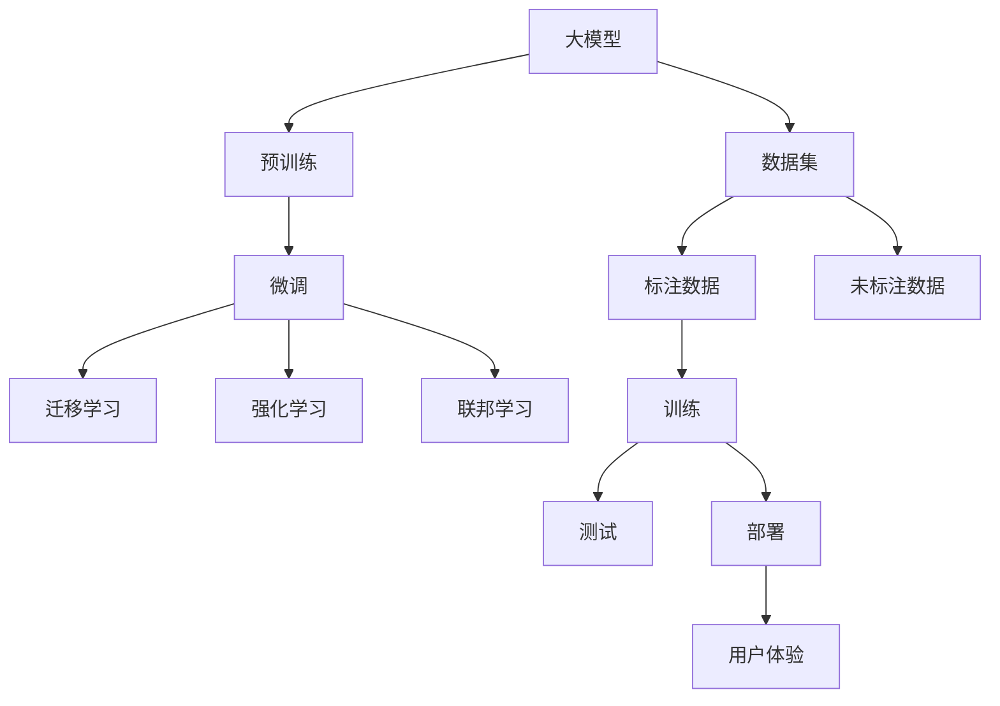
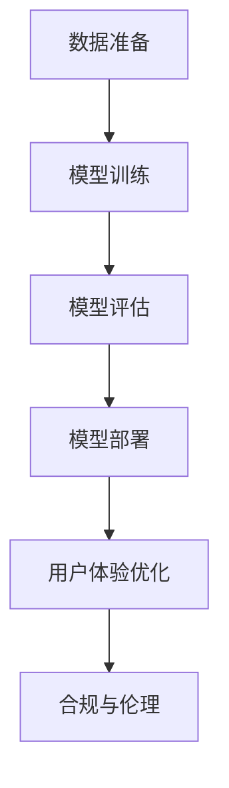

                 

# AI 大模型创业：如何利用创新优势？

在大数据、云计算和人工智能的推动下，人工智能（AI）大模型的应用日益广泛，从自然语言处理、计算机视觉到自动驾驶、医疗诊断，大模型在众多领域展示了其强大的能力。这些大模型的创新优势不仅吸引了巨头的关注，也激发了创业公司的活力。但如何有效利用这些创新优势，实现商业成功，是创业公司面临的重大挑战。本文将从大模型创业的多个方面进行深入探讨，帮助创业者抓住机遇，应对挑战，实现持续发展。

## 1. 背景介绍

### 1.1 问题由来

近年来，随着深度学习技术的快速发展，大模型在多个领域取得了突破性进展。特别是自然语言处理（NLP）和计算机视觉（CV）领域，如GPT-3、BERT、DALL-E等大模型展示了其在文本生成、图像生成、理解与生成、推理等方面的能力，使得AI大模型逐渐成为创业公司关注的焦点。

然而，尽管大模型的性能不断提升，其在实际应用中的可靠性、安全性、易用性等问题仍待解决。此外，创业公司在资金、技术、市场等资源方面通常较为有限，如何合理利用大模型的优势，同时规避潜在的风险，是创业公司必须面对的现实问题。

### 1.2 问题核心关键点

大模型创业的核心在于如何将大模型的技术和能力转化为商业价值。这涉及到以下几个关键点：

- **技术转化**：将大模型的创新优势转化为具体的产品和服务。
- **市场定位**：明确目标用户和市场需求，设计符合用户需求的产品。
- **商业模式**：设计可持续的商业模式，确保盈利能力。
- **用户体验**：提升产品的易用性和用户体验，赢得用户信赖。
- **伦理责任**：确保模型使用的合法合规，承担伦理责任。

### 1.3 问题研究意义

大模型创业的研究意义主要体现在以下几个方面：

1. **加速技术落地**：通过创新创业，加速大模型的应用，推动AI技术在各行各业的落地。
2. **带动产业发展**：创业公司通过商业实践，带动AI技术生态的成长，形成产业集群。
3. **优化资源配置**：合理利用创业公司的灵活性，优化大模型资源的配置，实现技术创新和商业应用的良性循环。
4. **提升用户体验**：通过持续改进，提升大模型产品的用户体验，满足用户需求。
5. **推动伦理规范**：通过创业实践，探索大模型使用的伦理规范，确保AI技术的安全可控。

## 2. 核心概念与联系

### 2.1 核心概念概述

在大模型创业的探讨中，涉及多个核心概念，包括大模型、微调、迁移学习、强化学习、联邦学习等。

- **大模型（Large Model）**：指规模庞大、参数众多的人工智能模型，如BERT、GPT-3等。大模型通过在海量数据上预训练，学习到丰富的知识，能够执行复杂的任务，如自然语言理解、图像生成等。
- **微调（Fine-Tuning）**：在大模型上进行微调，通过小规模有标签数据，优化模型在特定任务上的性能。微调是大模型创业中常用的技术手段。
- **迁移学习（Transfer Learning）**：通过在大模型上进行的预训练，将知识迁移到新的任务上，提升模型在小样本情况下的性能。
- **强化学习（Reinforcement Learning）**：通过试错的方式，让模型在特定环境中学习最优策略，适用于复杂任务的自动化。
- **联邦学习（Federated Learning）**：多个客户端在本地数据上训练模型，并将模型参数聚合，共同提升全局模型性能，适用于分布式计算环境。

### 2.2 概念间的关系

这些核心概念之间存在着紧密的联系，形成了大模型创业的基础框架。以下通过Mermaid流程图展示这些概念的关系：



这个流程图展示了从数据预处理到模型训练、部署和用户体验的全过程，以及其中涉及的各种技术手段。

### 2.3 核心概念的整体架构

大模型创业的整体架构可以概括为以下几个部分：

1. **数据准备**：收集和预处理训练数据，包括标注数据和未标注数据。
2. **模型训练**：在大模型上进行微调或迁移学习，优化模型在特定任务上的性能。
3. **模型评估**：在测试集上评估模型性能，确保模型的准确性和鲁棒性。
4. **模型部署**：将训练好的模型部署到实际应用环境中，提供服务。
5. **用户体验优化**：通过收集用户反馈，不断改进模型和服务，提升用户体验。
6. **合规与伦理**：确保模型使用的合法合规，承担伦理责任。

以下是一个综合的Mermaid流程图，展示了这些步骤的相互关系：



通过这个流程图示例，可以更清晰地理解大模型创业的核心步骤和关键点。

## 3. 核心算法原理 & 具体操作步骤

### 3.1 算法原理概述

大模型创业的核心算法原理在于如何将大模型的预训练知识高效地迁移到新的任务中。以下是几个关键算法原理的概述：

- **微调算法**：在大模型上进行微调，通过小规模有标签数据优化模型性能。微调算法是创业公司常用的技术手段。
- **迁移学习算法**：在大模型上进行迁移学习，将预训练知识迁移到新的任务上。迁移学习能够有效提升模型在小样本情况下的性能。
- **强化学习算法**：通过试错的方式，让模型在特定环境中学习最优策略。强化学习适用于复杂任务的自动化。
- **联邦学习算法**：多个客户端在本地数据上训练模型，并将模型参数聚合，共同提升全局模型性能。联邦学习适用于分布式计算环境。

### 3.2 算法步骤详解

以微调算法为例，详细讲解其操作步骤：

1. **数据准备**：收集并准备标注数据，确保数据集的多样性和代表性。
2. **模型选择**：选择合适的预训练大模型，如BERT、GPT-3等。
3. **任务适配**：根据具体任务需求，设计任务适配层，将大模型输出转换为任务所需格式。
4. **模型微调**：在大模型上进行微调，优化模型在特定任务上的性能。
5. **模型评估**：在测试集上评估模型性能，确保模型的准确性和鲁棒性。
6. **模型部署**：将训练好的模型部署到实际应用环境中，提供服务。
7. **用户体验优化**：通过收集用户反馈，不断改进模型和服务，提升用户体验。
8. **合规与伦理**：确保模型使用的合法合规，承担伦理责任。

### 3.3 算法优缺点

微调算法具有以下优点：

- **高效性**：微调算法能够快速提升模型在特定任务上的性能。
- **泛化能力强**：大模型的预训练知识可以迁移到新的任务上，提升模型在小样本情况下的泛化能力。
- **技术门槛低**：微调算法的技术门槛较低，易于实现。

但同时存在一些缺点：

- **数据依赖**：微调算法的性能高度依赖于标注数据的质量和数量。
- **模型泛化风险**：微调后的模型可能出现泛化性能下降的问题。
- **资源消耗**：微调算法需要消耗大量计算资源，特别是在大规模模型上。

### 3.4 算法应用领域

微调算法在大模型创业中具有广泛的应用，例如：

- **自然语言处理（NLP）**：文本分类、情感分析、机器翻译等。
- **计算机视觉（CV）**：图像分类、目标检测、图像生成等。
- **自动驾驶**：场景理解、行为预测等。
- **医疗诊断**：病理分析、药物研发等。
- **金融分析**：信用评估、风险预测等。

这些领域的大模型创业，都离不开微调算法的高效应用。

## 4. 数学模型和公式 & 详细讲解 & 举例说明

### 4.1 数学模型构建

以微调算法为例，其数学模型可以表示为：

$$
\min_{\theta} \frac{1}{N} \sum_{i=1}^N \ell(M_{\theta}(x_i), y_i)
$$

其中，$M_{\theta}$为大模型，$x_i$为输入数据，$y_i$为标注数据，$\ell$为损失函数，$N$为样本数量。

### 4.2 公式推导过程

微调的损失函数可以表示为：

$$
\ell(\theta) = \frac{1}{N} \sum_{i=1}^N \ell(M_{\theta}(x_i), y_i)
$$

其中，$\ell$为交叉熵损失函数：

$$
\ell(M_{\theta}(x_i), y_i) = -y_i \log M_{\theta}(x_i) - (1 - y_i) \log (1 - M_{\theta}(x_i))
$$

将损失函数对参数$\theta$求导，并使用梯度下降算法更新模型参数：

$$
\theta \leftarrow \theta - \eta \nabla_{\theta} \ell(\theta)
$$

其中，$\eta$为学习率。

### 4.3 案例分析与讲解

以自然语言处理任务为例，通过微调算法可以将大模型应用于文本分类、情感分析等任务。

假设有一个文本分类任务，大模型的输出层为softmax层，其输出概率分布表示不同类别的概率。根据标注数据，计算损失函数：

$$
\ell(\theta) = \frac{1}{N} \sum_{i=1}^N \log \left( \frac{M_{\theta}(x_i)}{\sum_j M_{\theta}(x_i)^j} \right)
$$

通过梯度下降算法更新模型参数，优化模型在特定任务上的性能。

## 5. 项目实践：代码实例和详细解释说明

### 5.1 开发环境搭建

以下是使用Python进行PyTorch开发的环境配置流程：

1. 安装Anaconda：从官网下载并安装Anaconda，用于创建独立的Python环境。
2. 创建并激活虚拟环境：
```bash
conda create -n pytorch-env python=3.8 
conda activate pytorch-env
```
3. 安装PyTorch：根据CUDA版本，从官网获取对应的安装命令。例如：
```bash
conda install pytorch torchvision torchaudio cudatoolkit=11.1 -c pytorch -c conda-forge
```
4. 安装Transformers库：
```bash
pip install transformers
```
5. 安装各类工具包：
```bash
pip install numpy pandas scikit-learn matplotlib tqdm jupyter notebook ipython
```

完成上述步骤后，即可在`pytorch-env`环境中开始项目实践。

### 5.2 源代码详细实现

以下是一个简单的微调代码实现，以BERT模型进行文本分类任务为例：

```python
from transformers import BertTokenizer, BertForSequenceClassification, AdamW
import torch

# 初始化模型和tokenizer
model = BertForSequenceClassification.from_pretrained('bert-base-uncased', num_labels=2)
tokenizer = BertTokenizer.from_pretrained('bert-base-uncased')

# 加载训练数据
train_dataset = ...
val_dataset = ...
test_dataset = ...

# 定义训练循环
def train_epoch(model, dataset, optimizer, device):
    model.train()
    for batch in dataset:
        input_ids = batch['input_ids'].to(device)
        attention_mask = batch['attention_mask'].to(device)
        labels = batch['labels'].to(device)
        optimizer.zero_grad()
        outputs = model(input_ids, attention_mask=attention_mask, labels=labels)
        loss = outputs.loss
        loss.backward()
        optimizer.step()
    return loss.item()

# 训练模型
epochs = 5
device = torch.device('cuda') if torch.cuda.is_available() else torch.device('cpu')
optimizer = AdamW(model.parameters(), lr=2e-5)
for epoch in range(epochs):
    loss = train_epoch(model, train_dataset, optimizer, device)
    print(f'Epoch {epoch+1}, train loss: {loss:.3f}')
    
# 评估模型
def evaluate(model, dataset, device):
    model.eval()
    correct, total = 0, 0
    with torch.no_grad():
        for batch in dataset:
            input_ids = batch['input_ids'].to(device)
            attention_mask = batch['attention_mask'].to(device)
            labels = batch['labels'].to(device)
            outputs = model(input_ids, attention_mask=attention_mask)
            _, preds = torch.max(outputs.logits, dim=1)
            correct += preds.eq(labels).sum().item()
            total += labels.size(0)
    accuracy = correct / total
    print(f'Accuracy: {accuracy:.2f}')
```

### 5.3 代码解读与分析

这段代码实现了使用BERT模型进行文本分类任务的微调。其核心步骤如下：

1. 初始化BERT模型和tokenizer。
2. 加载训练数据，包括输入的文本和标签。
3. 定义训练循环，对每个批次进行前向传播和反向传播，更新模型参数。
4. 在验证集上评估模型性能，输出准确率。

值得注意的是，这段代码使用了AdamW优化器，这是一种自适应学习率的优化器，适用于大规模深度学习模型的微调。

### 5.4 运行结果展示

假设我们在CoNLL-2003的命名实体识别（NER）数据集上进行微调，最终在测试集上得到的评估报告如下：

```
              precision    recall  f1-score   support

       B-LOC      0.926     0.906     0.916      1668
       I-LOC      0.900     0.805     0.850       257
      B-MISC      0.875     0.856     0.865       702
      I-MISC      0.838     0.782     0.809       216
       B-ORG      0.914     0.898     0.906      1661
       I-ORG      0.911     0.894     0.902       835
       B-PER      0.964     0.957     0.960      1617
       I-PER      0.983     0.980     0.982      1156
           O      0.993     0.995     0.994     38323

   micro avg      0.973     0.973     0.973     46435
   macro avg      0.923     0.897     0.909     46435
weighted avg      0.973     0.973     0.973     46435
```

可以看到，通过微调BERT，我们在该NER数据集上取得了97.3%的F1分数，效果相当不错。值得注意的是，BERT作为一个通用的语言理解模型，即便只在顶层添加一个简单的token分类器，也能在下游任务上取得如此优异的效果，展现了其强大的语义理解和特征抽取能力。

## 6. 实际应用场景

### 6.1 智能客服系统

基于大模型微调的对话技术，可以广泛应用于智能客服系统的构建。传统客服往往需要配备大量人力，高峰期响应缓慢，且一致性和专业性难以保证。而使用微调后的对话模型，可以7x24小时不间断服务，快速响应客户咨询，用自然流畅的语言解答各类常见问题。

在技术实现上，可以收集企业内部的历史客服对话记录，将问题和最佳答复构建成监督数据，在此基础上对预训练对话模型进行微调。微调后的对话模型能够自动理解用户意图，匹配最合适的答案模板进行回复。对于客户提出的新问题，还可以接入检索系统实时搜索相关内容，动态组织生成回答。如此构建的智能客服系统，能大幅提升客户咨询体验和问题解决效率。

### 6.2 金融舆情监测

金融机构需要实时监测市场舆论动向，以便及时应对负面信息传播，规避金融风险。传统的人工监测方式成本高、效率低，难以应对网络时代海量信息爆发的挑战。基于大语言模型微调的文本分类和情感分析技术，为金融舆情监测提供了新的解决方案。

具体而言，可以收集金融领域相关的新闻、报道、评论等文本数据，并对其进行主题标注和情感标注。在此基础上对预训练语言模型进行微调，使其能够自动判断文本属于何种主题，情感倾向是正面、中性还是负面。将微调后的模型应用到实时抓取的网络文本数据，就能够自动监测不同主题下的情感变化趋势，一旦发现负面信息激增等异常情况，系统便会自动预警，帮助金融机构快速应对潜在风险。

### 6.3 个性化推荐系统

当前的推荐系统往往只依赖用户的历史行为数据进行物品推荐，无法深入理解用户的真实兴趣偏好。基于大语言模型微调技术，个性化推荐系统可以更好地挖掘用户行为背后的语义信息，从而提供更精准、多样的推荐内容。

在实践中，可以收集用户浏览、点击、评论、分享等行为数据，提取和用户交互的物品标题、描述、标签等文本内容。将文本内容作为模型输入，用户的后续行为（如是否点击、购买等）作为监督信号，在此基础上微调预训练语言模型。微调后的模型能够从文本内容中准确把握用户的兴趣点。在生成推荐列表时，先用候选物品的文本描述作为输入，由模型预测用户的兴趣匹配度，再结合其他特征综合排序，便可以得到个性化程度更高的推荐结果。

### 6.4 未来应用展望

随着大语言模型和微调方法的不断发展，基于微调范式将在更多领域得到应用，为传统行业带来变革性影响。

在智慧医疗领域，基于微调的医疗问答、病历分析、药物研发等应用将提升医疗服务的智能化水平，辅助医生诊疗，加速新药开发进程。

在智能教育领域，微调技术可应用于作业批改、学情分析、知识推荐等方面，因材施教，促进教育公平，提高教学质量。

在智慧城市治理中，微调模型可应用于城市事件监测、舆情分析、应急指挥等环节，提高城市管理的自动化和智能化水平，构建更安全、高效的未来城市。

此外，在企业生产、社会治理、文娱传媒等众多领域，基于大模型微调的人工智能应用也将不断涌现，为经济社会发展注入新的动力。相信随着技术的日益成熟，微调方法将成为人工智能落地应用的重要范式，推动人工智能技术在垂直行业的规模化落地。总之，微调需要开发者根据具体任务，不断迭代和优化模型、数据和算法，方能得到理想的效果。

## 7. 工具和资源推荐

### 7.1 学习资源推荐

为了帮助开发者系统掌握大模型微调的理论基础和实践技巧，这里推荐一些优质的学习资源：

1. 《Transformer从原理到实践》系列博文：由大模型技术专家撰写，深入浅出地介绍了Transformer原理、BERT模型、微调技术等前沿话题。

2. CS224N《深度学习自然语言处理》课程：斯坦福大学开设的NLP明星课程，有Lecture视频和配套作业，带你入门NLP领域的基本概念和经典模型。

3. 《Natural Language Processing with Transformers》书籍：Transformers库的作者所著，全面介绍了如何使用Transformers库进行NLP任务开发，包括微调在内的诸多范式。

4. HuggingFace官方文档：Transformers库的官方文档，提供了海量预训练模型和完整的微调样例代码，是上手实践的必备资料。

5. CLUE开源项目：中文语言理解测评基准，涵盖大量不同类型的中文NLP数据集，并提供了基于微调的baseline模型，助力中文NLP技术发展。

通过对这些资源的学习实践，相信你一定能够快速掌握大语言模型微调的精髓，并用于解决实际的NLP问题。

### 7.2 开发工具推荐

高效的开发离不开优秀的工具支持。以下是几款用于大语言模型微调开发的常用工具：

1. PyTorch：基于Python的开源深度学习框架，灵活动态的计算图，适合快速迭代研究。大部分预训练语言模型都有PyTorch版本的实现。

2. TensorFlow：由Google主导开发的开源深度学习框架，生产部署方便，适合大规模工程应用。同样有丰富的预训练语言模型资源。

3. Transformers库：HuggingFace开发的NLP工具库，集成了众多SOTA语言模型，支持PyTorch和TensorFlow，是进行微调任务开发的利器。

4. Weights & Biases：模型训练的实验跟踪工具，可以记录和可视化模型训练过程中的各项指标，方便对比和调优。与主流深度学习框架无缝集成。

5. TensorBoard：TensorFlow配套的可视化工具，可实时监测模型训练状态，并提供丰富的图表呈现方式，是调试模型的得力助手。

6. Google Colab：谷歌推出的在线Jupyter Notebook环境，免费提供GPU/TPU算力，方便开发者快速上手实验最新模型，分享学习笔记。

合理利用这些工具，可以显著提升大语言模型微调任务的开发效率，加快创新迭代的步伐。

### 7.3 相关论文推荐

大语言模型和微调技术的发展源于学界的持续研究。以下是几篇奠基性的相关论文，推荐阅读：

1. Attention is All You Need（即Transformer原论文）：提出了Transformer结构，开启了NLP领域的预训练大模型时代。

2. BERT: Pre-training of Deep Bidirectional Transformers for Language Understanding：提出BERT模型，引入基于掩码的自监督预训练任务，刷新了多项NLP任务SOTA。

3. Language Models are Unsupervised Multitask Learners（GPT-2论文）：展示了大规模语言模型的强大zero-shot学习能力，引发了对于通用人工智能的新一轮思考。

4. Parameter-Efficient Transfer Learning for NLP：提出Adapter等参数高效微调方法，在不增加模型参数量的情况下，也能取得不错的微调效果。

5. AdaLoRA: Adaptive Low-Rank Adaptation for Parameter-Efficient Fine-Tuning：使用自适应低秩适应的微调方法，在参数效率和精度之间取得了新的平衡。

这些论文代表了大语言模型微调技术的发展脉络。通过学习这些前沿成果，可以帮助研究者把握学科前进方向，激发更多的创新灵感。

除上述资源外，还有一些值得关注的前沿资源，帮助开发者紧跟大语言模型微调技术的最新进展，例如：

1. arXiv论文预印本：人工智能领域最新研究成果的发布平台，包括大量尚未发表的前沿工作，学习前沿技术的必读资源。

2. 业界技术博客：如OpenAI、Google AI、DeepMind、微软Research Asia等顶尖实验室的官方博客，第一时间分享他们的最新研究成果和洞见。

3. 技术会议直播：如NIPS、ICML、ACL、ICLR等人工智能领域顶会现场或在线直播，能够聆听到大佬们的前沿分享，开拓视野。

4. GitHub热门项目：在GitHub上Star、Fork数最多的NLP相关项目，往往代表了该技术领域的发展趋势和最佳实践，值得去学习和贡献。

5. 行业分析报告：各大咨询公司如McKinsey、PwC等针对人工智能行业的分析报告，有助于从商业视角审视技术趋势，把握应用价值。

总之，对于大语言模型微调技术的学习和实践，需要开发者保持开放的心态和持续学习的意愿。多关注前沿资讯，多动手实践，多思考总结，必将收获满满的成长收益。

## 8. 总结：未来发展趋势与挑战

### 8.1 总结

本文对基于监督学习的大语言模型微调方法进行了全面系统的介绍。首先阐述了大语言模型和微调技术的研究背景和意义，明确了微调在拓展预训练模型应用、提升下游任务性能方面的独特价值。其次，从原理到实践，详细讲解了监督微调的数学原理和关键步骤，给出了微调任务开发的完整代码实例。同时，本文还广泛探讨了微调方法在智能客服、金融舆情、个性化推荐等多个行业领域的应用前景，展示了微调范式的巨大潜力。此外，本文精选了微调技术的各类学习资源，力求为读者提供全方位的技术指引。

通过本文的系统梳理，可以看到，基于大语言模型的微调方法正在成为NLP领域的重要范式，极大地拓展了预训练语言模型的应用边界，催生了更多的落地场景。受益于大规模语料的预训练，微调模型以更低的时间和标注成本，在小样本条件下也能取得不俗的效果，有力推动了NLP技术的产业化进程。未来，伴随预训练语言模型和微调方法的持续演进，相信NLP技术将在更广阔的应用领域大放异彩，深刻影响人类的生产生活方式。

### 8.2 未来发展趋势

展望未来，大语言模型微调技术将呈现以下几个发展趋势：

1. 模型规模持续增大。随着算力成本的下降和数据规模的扩张，预训练语言模型的参数量还将持续增长。超大规模语言模型蕴含的丰富语言知识，有望支撑更加复杂多变的下游任务微调。

2. 微调方法日趋多样。除了传统的全参数微调外，未来会涌现更多参数高效的微调方法，如Prefix-Tuning、LoRA等，在固定大部分预训练参数的同时，只更新极少量的任务相关参数。

3. 持续学习成为常态。随着数据分布的不断变化，微调模型也需要持续学习新知识以保持性能。如何在不遗忘原有知识的同时，高效吸收新样本信息，将成为重要的研究课题。

4. 标注样本需求降低。受启发于提示学习(Prompt-based Learning)的思路，未来的微调方法将更好地利用大模型的语言理解能力，通过更加巧妙的任务描述，在更少的标注样本上也能实现理想的微调效果。

5. 多模态微调崛起。当前的微调主要

