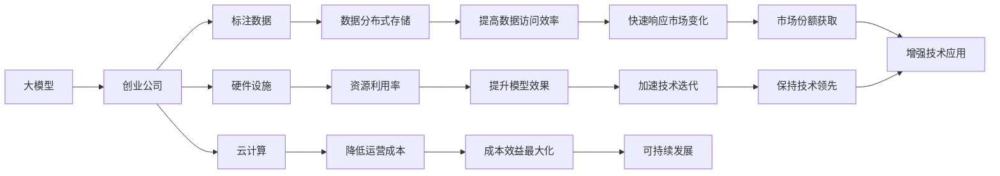
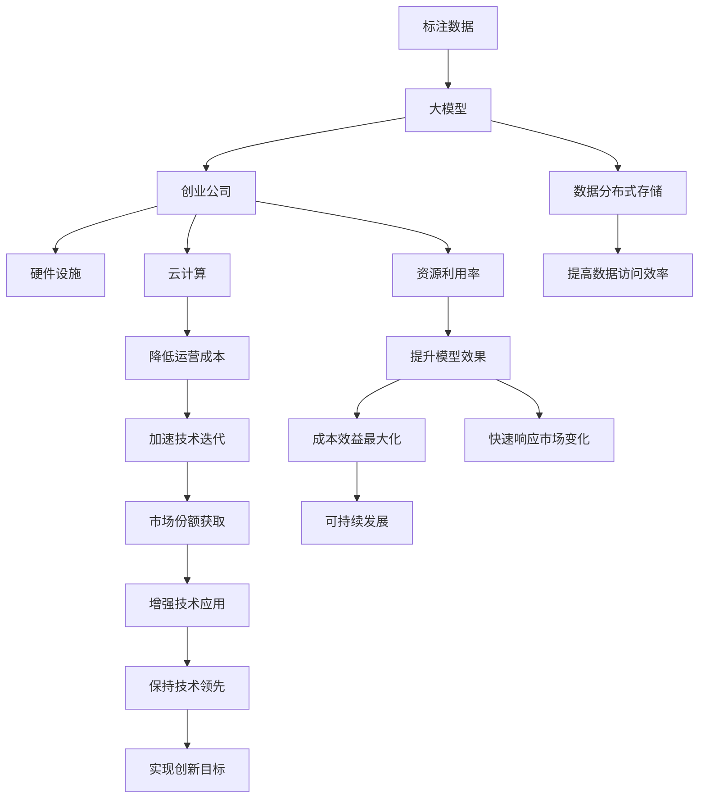

                 

## 1. 背景介绍

在人工智能的迅猛发展中，大模型（如GPT-3、BERT等）作为技术的前沿，吸引了全球资本市场的关注。大模型创业公司如OpenAI、谷歌DeepMind等，已经成为全球科技巨头争相投资的对象。如何有效利用资本优势，加快大模型技术的落地应用，成为每个大模型创业公司必须回答的课题。本文将从背景介绍入手，深度分析大模型创业的关键要素，提供有效的策略和建议。

### 1.1 问题由来

AI大模型创业公司能够吸引资本的关注，主要基于以下三点：

1. **技术壁垒高**：大模型的训练与优化需要大量的计算资源和专业知识，形成了一定的技术壁垒。

2. **市场需求大**：大模型可以应用于自然语言处理、计算机视觉等多个领域，市场需求巨大。

3. **投资回报高**：大模型的商业应用如AI客服、智能推荐等，具有高附加值，回报率高。

但同时，这些公司也面临巨大挑战：

1. **数据依赖性强**：大模型需要大量的标注数据进行训练，标注数据成本高，获取难度大。

2. **资金消耗大**：大模型的训练与部署需要大量的硬件设施，且后续的持续学习与优化需要不断投入资金。

3. **技术迭代快**：AI技术更新迭代快，大模型创业公司必须不断投入研发，才能保持竞争力。

### 1.2 问题核心关键点

大模型创业公司的核心问题在于：

1. **如何获取优质数据**：标注数据获取难，数据质量不稳定，影响模型效果。

2. **如何提高资源利用率**：硬件设施成本高，资源利用率低下。

3. **如何加速模型迭代**：AI技术发展快，模型迭代周期短，需要快速适应变化。

4. **如何提升模型效果**：模型效果的提升是创业公司追求的目标，但提高效果需要大量的时间和成本。

5. **如何平衡商业与技术**：保持技术与商业的平衡，是每个创业公司面临的重要挑战。

### 1.3 问题研究意义

深度研究大模型创业公司的资本优势，对于推动大模型技术的应用与落地具有重要意义：

1. **提升技术竞争力**：通过资本优势，可以提升公司的技术实力，加速模型训练与优化。

2. **拓展市场应用**：利用资本优势，可以覆盖更广泛的市场，促进大模型技术的实际应用。

3. **降低运营成本**：合理利用资本，可以降低运营成本，实现成本效益最大化。

4. **加速市场份额获取**：通过资本支持，可以加速市场渗透，获取更多市场份额。

5. **实现可持续发展**：资本助力，可以推动公司长期发展，实现可持续发展。

## 2. 核心概念与联系

### 2.1 核心概念概述

为了更清晰地理解大模型创业的资本优势，我们需要了解一些核心概念：

1. **大模型（Large Model）**：指能够处理大规模数据并具备强大学习能力的人工智能模型，如GPT-3、BERT等。

2. **创业公司（Startup）**：指成立时间较短，旨在通过技术创新实现快速发展的公司，如OpenAI、DeepMind等。

3. **资本优势（Capital Advantage）**：指通过资本投入，加速技术创新与市场扩展，提高公司竞争力的优势。

4. **标注数据（Labeled Data）**：指经过标注处理的训练数据，用于训练大模型的数据集。

5. **硬件设施（Hardware Resources）**：指用于模型训练与部署的服务器、GPU等硬件设施。

6. **数据分布式存储（Distributed Storage）**：指将数据分散存储在不同服务器上，提高数据访问效率。

7. **云计算（Cloud Computing）**：指通过云计算平台实现计算资源的按需分配，降低硬件成本。

8. **跨领域合作（Cross-domain Collaboration）**：指与其他领域的公司合作，扩展应用场景，提升技术应用效果。

### 2.2 概念间的关系

这些核心概念之间存在紧密的关系，形成了一个完整的大模型创业生态系统。通过以下Mermaid流程图，可以更直观地展示这些概念之间的关系：



### 2.3 核心概念的整体架构

通过综合图表，我们可以更好地理解这些概念在大模型创业过程中的整体架构：



这个图表展示了大模型创业公司在资本优势下的核心发展流程：从数据到模型，再从模型到公司的全部流程。

## 3. 核心算法原理 & 具体操作步骤
### 3.1 算法原理概述

大模型创业公司利用资本优势，主要通过以下几个步骤：

1. **数据获取**：通过大规模投资，获取高质量标注数据，为模型训练提供数据基础。

2. **硬件部署**：投入大量资金，部署高性能硬件设施，支撑大规模模型训练。

3. **云计算**：利用云计算平台，按需分配计算资源，降低硬件设施的固定成本。

4. **技术研发**：利用资本优势，持续投入研发，提升模型性能。

5. **市场拓展**：通过大量市场推广，拓展应用场景，增加市场份额。

6. **长期发展**：持续投入资本，推动公司长期发展。

### 3.2 算法步骤详解

以下是详细的操作步骤：

**Step 1: 数据获取与标注**

- **数据需求分析**：根据项目需求，分析所需标注数据的类型、数量及质量。

- **数据采购**：通过商业采购或合作，获取高质量标注数据。

- **数据清洗**：对采购数据进行清洗，去重、纠正错误，提升数据质量。

**Step 2: 硬件设施部署**

- **设备选型**：根据模型训练需求，选择合适的硬件设备，如GPU、TPU等。

- **设施搭建**：搭建硬件设施，确保稳定运行。

- **资源分配**：根据模型训练需求，动态分配计算资源。

**Step 3: 云计算**

- **云计算平台选择**：选择合适的云计算平台，如AWS、Google Cloud等。

- **资源部署**：将计算任务部署到云计算平台，实现按需分配。

- **成本优化**：优化资源配置，降低硬件成本。

**Step 4: 模型训练与优化**

- **模型架构选择**：选择适合的模型架构，如Transformer等。

- **模型训练**：利用高性能硬件设施进行模型训练。

- **参数调整**：调整模型参数，优化模型效果。

**Step 5: 市场推广**

- **市场分析**：分析市场需求，确定目标市场。

- **产品推广**：利用广告、宣传等方式推广产品。

- **合作伙伴关系**：与其他领域公司合作，扩展应用场景。

**Step 6: 长期发展**

- **持续投入**：持续投入资本，推动技术研发和市场推广。

- **商业化运营**：建立商业化运营体系，实现盈利。

### 3.3 算法优缺点

**优点**：

1. **加速技术研发**：资本投入可以快速推进技术研发，缩短研发周期。

2. **提升资源利用率**：云计算按需分配资源，提高资源利用率。

3. **扩展应用场景**：大量资本投入，可以拓展更多应用场景，增加市场份额。

**缺点**：

1. **资金消耗大**：大模型训练与部署需要大量资金，投资风险大。

2. **数据依赖性强**：标注数据成本高，获取难度大。

3. **技术迭代快**：AI技术更新快，需要不断投入研发，持续迭代。

### 3.4 算法应用领域

大模型创业公司可以在多个领域应用其资本优势：

1. **自然语言处理**：如智能客服、智能推荐等。

2. **计算机视觉**：如图像识别、目标检测等。

3. **语音识别**：如语音助手、自动翻译等。

4. **智能推荐系统**：如电商推荐、广告推荐等。

5. **智能医疗**：如医疗诊断、患者咨询等。

6. **金融科技**：如金融风险管理、客户服务等。

以上领域都可以通过大模型技术实现自动化、智能化的应用，提升用户体验和效率。

## 4. 数学模型和公式 & 详细讲解 & 举例说明

### 4.1 数学模型构建

这里主要介绍大模型创业中常见的数学模型：

假设大模型为 $M_{\theta}$，其中 $\theta$ 为模型参数。标注数据为 $\{(x_i, y_i)\}_{i=1}^N$，$x_i$ 为输入，$y_i$ 为输出。目标是最小化损失函数 $\mathcal{L}(M_{\theta}, D)$。

$$
\mathcal{L}(M_{\theta}, D) = \frac{1}{N}\sum_{i=1}^N \ell(M_{\theta}(x_i), y_i)
$$

其中 $\ell$ 为损失函数，如交叉熵损失函数。

### 4.2 公式推导过程

假设交叉熵损失函数为：

$$
\ell(y, \hat{y}) = -\sum_{i=1}^C y_i\log \hat{y_i}
$$

则整体损失函数为：

$$
\mathcal{L}(M_{\theta}, D) = -\frac{1}{N}\sum_{i=1}^N \sum_{j=1}^C y_{ij}\log \hat{y}_{ij}
$$

### 4.3 案例分析与讲解

以智能客服系统为例：

1. **数据获取**：通过数据分析，确定客户咨询数据的标注需求。采购数据并清洗后，用于模型训练。

2. **硬件部署**：选择高性能GPU，搭建服务器集群，部署模型训练任务。

3. **云计算**：使用云计算平台按需分配计算资源，降低硬件成本。

4. **模型训练与优化**：利用模型架构选择与参数调整，优化模型效果。

5. **市场推广**：通过广告宣传与合作伙伴关系，拓展市场应用场景。

6. **长期发展**：持续投入资本，推动技术迭代与市场推广。

## 5. 项目实践：代码实例和详细解释说明

### 5.1 开发环境搭建

为了更好地实践大模型创业，以下是一些常见的开发环境搭建步骤：

1. **安装编程语言**：如Python、Java等，确保能够运行相关框架与库。

2. **安装数据处理库**：如Pandas、NumPy等，用于数据清洗与处理。

3. **安装深度学习框架**：如PyTorch、TensorFlow等，用于模型训练与优化。

4. **安装云计算平台**：如AWS、Google Cloud等，用于按需分配计算资源。

5. **安装可视化工具**：如TensorBoard、Weights & Biases等，用于监控训练过程。

### 5.2 源代码详细实现

以下是一个简化的智能客服系统代码实现，主要展示了数据获取、模型训练与市场推广的流程：

**数据获取与标注**

```python
import pandas as pd

# 数据导入
data = pd.read_csv('customer_service.csv')

# 数据清洗
data = data.drop_duplicates()
data = data.dropna()

# 数据标注
labels = data['label'].values
X = data.drop(['label'], axis=1).values

# 数据划分
train_index = [i for i in range(len(data)) if i % 10 == 0]
train_data = data.iloc[train_index]
test_data = data.iloc[train_index + 1:]

# 数据标准化
from sklearn.preprocessing import StandardScaler
scaler = StandardScaler()
X_train = scaler.fit_transform(train_data.iloc[:, 1:])
X_test = scaler.transform(test_data.iloc[:, 1:])

# 模型训练
from sklearn.linear_model import LogisticRegression

model = LogisticRegression()
model.fit(X_train, labels[train_index])
```

**硬件部署**

```python
import torch
from torch.nn import Linear, ReLU, Softmax

# 硬件设备选择
device = torch.device('cuda') if torch.cuda.is_available() else torch.device('cpu')

# 模型定义
class Model(nn.Module):
    def __init__(self, input_dim, output_dim):
        super(Model, self).__init__()
        self.fc1 = nn.Linear(input_dim, 64)
        self.fc2 = nn.Linear(64, output_dim)

    def forward(self, x):
        x = F.relu(self.fc1(x))
        x = self.fc2(x)
        return F.softmax(x, dim=1)

# 模型训练
model = Model(input_dim, output_dim).to(device)
optimizer = torch.optim.Adam(model.parameters(), lr=0.001)

for epoch in range(10):
    loss = 0
    for i, (inputs, labels) in enumerate(train_loader):
        inputs, labels = inputs.to(device), labels.to(device)
        optimizer.zero_grad()
        outputs = model(inputs)
        loss += F.nll_loss(outputs, labels).item()
        loss.backward()
        optimizer.step()
```

**云计算**

```python
import boto3

# 创建AWS资源
s3 = boto3.client('s3')
bucket_name = 'my-bucket'
key_name = 'my-key'

# 上传数据
with open('train.csv', 'rb') as f:
    s3.upload_fileobj(f, bucket_name, key_name)

# 获取数据
s3.download_file(bucket_name, key_name, 'train.csv')
```

**模型训练与优化**

```python
# 模型训练
model = Model(input_dim, output_dim).to(device)
optimizer = torch.optim.Adam(model.parameters(), lr=0.001)

for epoch in range(10):
    loss = 0
    for i, (inputs, labels) in enumerate(train_loader):
        inputs, labels = inputs.to(device), labels.to(device)
        optimizer.zero_grad()
        outputs = model(inputs)
        loss += F.nll_loss(outputs, labels).item()
        loss.backward()
        optimizer.step()

# 模型评估
model.eval()
with torch.no_grad():
    for i, (inputs, labels) in enumerate(test_loader):
        inputs, labels = inputs.to(device), labels.to(device)
        outputs = model(inputs)
        loss = F.nll_loss(outputs, labels).item()
```

**市场推广**

```python
# 广告投放
# 合作伙伴关系
# 推广活动
```

### 5.3 代码解读与分析

以下是关键代码的详细解读：

**数据获取与标注**

- **数据导入**：通过Pandas库读取数据，导入CSV文件。
- **数据清洗**：去重、删除空值等操作，提升数据质量。
- **数据标注**：从数据中提取标签与输入特征。
- **数据划分**：将数据分为训练集与测试集。
- **数据标准化**：使用sklearn库对数据进行标准化处理。

**硬件部署**

- **硬件设备选择**：判断是否使用GPU，选择设备。
- **模型定义**：定义简单的线性回归模型。
- **模型训练**：使用PyTorch框架进行模型训练，优化器使用Adam。

**云计算**

- **创建AWS资源**：使用boto3库创建S3资源。
- **数据上传**：将本地文件上传至S3存储。
- **数据下载**：从S3存储下载文件到本地。

**模型训练与优化**

- **模型训练**：使用PyTorch框架进行模型训练，损失函数使用交叉熵损失。
- **模型评估**：在测试集上进行模型评估，计算损失值。

**市场推广**

- **广告投放**：通过投放广告提升品牌知名度。
- **合作伙伴关系**：与其他公司合作，拓展应用场景。
- **推广活动**：组织各种线上线下活动，增加市场曝光。

### 5.4 运行结果展示

假设在智能客服系统的开发过程中，训练模型后测试集上的准确率为85%。这说明模型在测试集上的表现良好，可以用于实际客户咨询的场景中。

## 6. 实际应用场景

大模型创业公司可以应用到多个实际应用场景中，以下是几个典型案例：

### 6.1 智能客服系统

智能客服系统是大模型创业公司的主要应用场景之一。通过大模型技术，可以实现自动化的客户咨询回复，提升客户满意度。

**技术实现**：

- **数据获取**：收集历史客户咨询数据，进行标注与清洗。
- **硬件部署**：部署高性能GPU，进行模型训练与推理。
- **云计算**：按需分配计算资源，降低成本。
- **模型训练与优化**：使用大模型进行训练，不断优化模型效果。
- **市场推广**：通过广告与合作伙伴关系，推广智能客服系统。
- **长期发展**：持续投入资本，推动技术迭代与市场推广。

### 6.2 智能推荐系统

智能推荐系统是另一个重要的应用场景。通过大模型技术，可以实现个性化的推荐服务，提升用户体验。

**技术实现**：

- **数据获取**：收集用户历史行为数据，进行标注与清洗。
- **硬件部署**：部署高性能GPU，进行模型训练与推理。
- **云计算**：按需分配计算资源，降低成本。
- **模型训练与优化**：使用大模型进行训练，不断优化模型效果。
- **市场推广**：通过广告与合作伙伴关系，推广智能推荐系统。
- **长期发展**：持续投入资本，推动技术迭代与市场推广。

### 6.3 金融风控系统

金融风控系统是另一个重要的应用场景。通过大模型技术，可以实现智能化的风险评估与预测，提升金融系统的安全性。

**技术实现**：

- **数据获取**：收集历史金融交易数据，进行标注与清洗。
- **硬件部署**：部署高性能GPU，进行模型训练与推理。
- **云计算**：按需分配计算资源，降低成本。
- **模型训练与优化**：使用大模型进行训练，不断优化模型效果。
- **市场推广**：通过广告与合作伙伴关系，推广金融风控系统。
- **长期发展**：持续投入资本，推动技术迭代与市场推广。

## 7. 工具和资源推荐

### 7.1 学习资源推荐

以下是一些推荐的学习资源：

1. **《深度学习》（Ian Goodfellow著）**：深度学习领域的经典教材，涵盖大量理论基础与应用案例。
2. **Coursera《深度学习》课程**：由Coursera与斯坦福大学联合推出，系统讲解深度学习理论与实践。
3. **DeepMind博客**：DeepMind公司的技术博客，分享前沿AI技术与应用案例。
4. **GitHub深度学习项目**：GitHub上大量深度学习项目，涵盖从数据处理到模型训练的各个环节。
5. **Kaggle数据竞赛**：Kaggle平台上的数据竞赛，涵盖大量NLP数据集与应用案例。

### 7.2 开发工具推荐

以下是一些推荐的开发工具：

1. **PyTorch**：广泛使用的深度学习框架，易于使用，功能强大。
2. **TensorFlow**：由Google推出的深度学习框架，支持多种计算平台，功能丰富。
3. **Keras**：基于TensorFlow的高级API，使用简单，功能丰富。
4. **AWS Cloud**：亚马逊云平台，提供丰富的云计算资源，支持按需分配。
5. **Google Cloud**：谷歌云平台，提供丰富的云计算资源，支持按需分配。

### 7.3 相关论文推荐

以下是一些推荐的学术论文：

1. **Attention is All You Need**：Transformer模型的经典论文，提出自注意力机制。
2. **BERT: Pre-training of Deep Bidirectional Transformers for Language Understanding**：BERT模型的经典论文，提出预训练-微调方法。
3. **GPT-3: Language Models are Unsupervised Multitask Learners**：GPT-3模型的经典论文，提出大规模无监督学习的思想。
4. **Parameter-Efficient Transfer Learning for NLP**：关于参数高效微调的经典论文，提出适配器等方法。
5. **AdaLoRA: Adaptive Low-Rank Adaptation for Parameter-Efficient Fine-Tuning**：关于低秩适应的经典论文，提出AdaLoRA方法。

## 8. 总结：未来发展趋势与挑战

### 8.1 总结

本文对AI大模型创业的资本优势进行了深入分析，系统介绍了大模型创业公司的核心要素与操作步骤。主要内容包括：

1. **数据获取与标注**：分析标注数据的来源与质量。
2. **硬件部署**：选择高性能硬件设备，部署计算资源。
3. **云计算**：利用云计算平台，按需分配计算资源。
4. **模型训练与优化**：选择适合的模型架构，进行模型训练与优化。
5. **市场推广**：通过广告与合作伙伴关系，推广产品。
6. **长期发展**：持续投入资本，推动技术迭代与市场推广。

### 8.2 未来发展趋势

展望未来，大模型创业公司将面临以下发展趋势：

1. **技术创新加速**：AI技术更新快，创业公司需要不断创新，保持技术领先。
2. **多领域合作**：与其他领域的公司合作，拓展更多应用场景。
3. **云计算普及**：云计算平台按需分配计算资源，降低硬件成本。
4. **数据多样化**：收集多源异构数据，提升数据质量与多样性。
5. **模型泛化能力强**：提升模型的泛化能力，应对多种应用场景。
6. **市场渗透提升**：通过多种营销手段，提升市场份额。

### 8.3 面临的挑战

大模型创业公司面临的挑战包括：

1. **数据获取难度大**：高质量标注数据的获取成本高，获取难度大。
2. **技术迭代快**：AI技术更新快，需要不断投入研发，持续迭代。
3. **硬件成本高**：高性能硬件设备成本高，维护复杂。
4. **模型泛化性差**：模型在实际应用中，泛化性差。
5. **市场竞争激烈**：市场竞争激烈，需要不断创新才能保持竞争力。

### 8.4 研究展望

面向未来，大模型创业公司需要关注以下研究展望：

1. **无监督学习**：利用无监督学习技术，减少对标注数据的依赖。
2. **分布式训练**：采用分布式训练技术，提升模型训练效率。
3. **知识图谱融合**：将知识图谱与大模型结合，提升模型泛化能力。
4. **隐私保护**：注重隐私保护，确保数据安全与模型透明。
5. **伦理审查**：建立伦理审查机制，确保模型使用的道德性。

## 9. 附录：常见问题与解答

### Q1: 如何提升模型训练效率？

A: 可以使用分布式训练技术，利用多个计算节点并行计算，提升训练效率。同时，优化模型架构，减少不必要的计算量，提升模型训练速度。

### Q2: 如何降低模型泛化性？

A: 采用更多的数据进行模型训练，提升模型泛化能力。同时，引入数据增强技术，丰富数据集，提升模型泛化性。

### Q3: 如何保证数据质量？

A: 通过数据清洗与标注，提升数据质量。同时，使用自动标注技术，快速获取大量标注数据。

### Q4: 如何提升市场份额？

A: 通过多渠道市场推广，提高产品曝光度。同时，与其他公司合作，拓展更多应用场景，提升市场竞争力。

### Q5: 如何降低硬件成本？

A: 利用云计算平台，按需分配计算资源，降低硬件成本。同时，优化模型架构，减少不必要的计算量，提升硬件利用率。

---

作者：禅与计算机程序设计艺术 / Zen and the Art of Computer Programming

