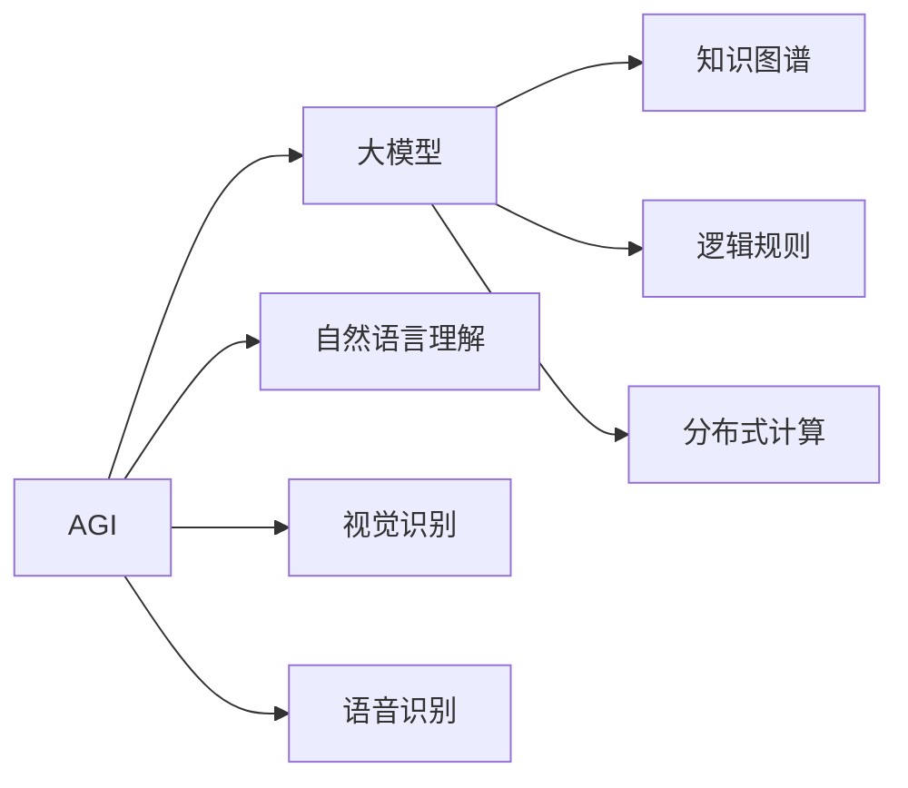
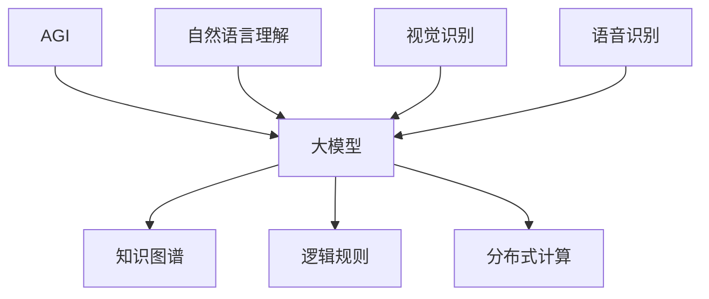

                 

# AI 大模型原理与应用：AGI 大基建受限于物理条件

> 关键词：AGI, AI大模型, 大基建, 物理条件, 深度学习, 知识图谱, 自然语言处理, 强化学习

## 1. 背景介绍

### 1.1 问题由来
人工智能(AI)技术的快速发展，尤其是深度学习(DL)和增强学习(RL)的突破，使得AI在诸多领域取得了显著成果。然而，现有的大模型（Large Models）仍存在诸多局限性，这些局限性在构建通用人工智能(AGI)的道路上构成了显著的障碍。

本问题旨在探讨AGI大基建受限于物理条件，即物理硬件资源、计算能力、数据资源等因素对AGI模型构建的限制，以及如何克服这些限制，推动AGI技术的进一步发展。

### 1.2 问题核心关键点
当前大模型在构建AGI过程中面临的主要挑战包括：

1. 物理硬件资源限制：大规模深度学习模型通常需要大量的GPU/TPU资源，而物理硬件的计算能力、存储容量、能耗等指标均受到物理条件的制约。
2. 数据获取与处理难度：大规模模型的训练需要大量的高质量数据，数据的获取和处理成本较高，同时数据噪声、偏见等问题也需要解决。
3. 模型复杂性：大模型参数量巨大，训练复杂度高，模型优化和推理效率有待提高。
4. 计算效率：现有硬件设施下的计算速度难以满足实时性需求，特别是在大规模并行计算方面存在瓶颈。
5. 可扩展性与可迁移性：模型的部署和扩展需要高效的资源分配和调度机制，同时模型的跨领域、跨任务迁移能力也需要进一步提升。

这些关键问题需要通过技术手段和创新设计加以解决，从而为AGI技术的落地提供坚实的基础。

### 1.3 问题研究意义
深入研究AGI大基建受限于物理条件的问题，对推动AGI技术的发展具有重要意义：

1. 提升计算效率：通过技术创新和资源优化，大幅提升大模型的计算效率，支持更大规模、更复杂的模型训练。
2. 降低硬件成本：利用高效计算和资源分配技术，降低硬件部署和运维成本，推动AI技术的普及和应用。
3. 提升数据质量：通过数据清洗、增强、迁移等技术手段，提高数据质量，为AGI模型的训练提供可靠的数据支持。
4. 增强模型鲁棒性：解决模型泛化能力不足的问题，提高模型在不同场景下的适应性和鲁棒性。
5. 实现知识复用：通过知识图谱、逻辑规则等方法，增强模型的跨领域迁移能力和知识复用能力，加速AGI技术的应用。

## 2. 核心概念与联系

### 2.1 核心概念概述

本节将介绍AGI构建过程中涉及的关键概念，并通过核心概念之间的联系，构建一个完整的AGI构建框架。

- **AGI (Artificial General Intelligence)**：指具备跨领域、跨任务、跨模态理解和处理能力的通用人工智能，包括自然语言理解、视觉识别、语音识别等多种能力。
- **大模型(Large Models)**：指参数量巨大的深度学习模型，如GPT-3、BERT、T5等，通常具有强大的语义理解和生成能力。
- **知识图谱(Knowledge Graph)**：一种用于表示实体和实体之间关系的图形结构，为AI模型提供丰富、结构化的知识。
- **逻辑规则(Logic Rules)**：形式化描述特定领域知识与逻辑推理过程的规则集，辅助AI模型进行推理和决策。
- **分布式计算(Distributed Computing)**：利用多台计算机协同工作，提高计算效率和资源利用率。

这些核心概念通过逻辑关系连接，形成AGI构建的基本框架：



该框架展示了AGI构建中各关键组件之间的联系，大模型作为核心，通过知识图谱和逻辑规则获取知识，利用分布式计算提升计算效率。

### 2.2 概念间的关系

各核心概念之间的关系可以通过以下Mermaid流程图来展示：



这个流程图展示了AGI构建中各核心概念之间的关系：

1. 大模型是AGI的核心，通过知识图谱和逻辑规则获取知识。
2. 知识图谱和逻辑规则为大模型提供结构化、形式化的知识，增强模型理解力和决策能力。
3. 分布式计算技术提高大模型的计算效率，支持更大规模、更复杂的模型训练和推理。

通过这些概念的紧密连接，我们可以更清晰地理解AGI构建的基本框架和关键技术。

## 3. 核心算法原理 & 具体操作步骤
### 3.1 算法原理概述

AGI大基建的构建涉及多个关键技术，包括深度学习、知识图谱、逻辑推理和分布式计算等。本节将详细讨论这些技术的基本原理。

#### 3.1.1 深度学习算法

深度学习算法通过多层神经网络模型，对输入数据进行特征提取和模式学习，从而实现对复杂任务的建模和预测。大模型通常采用自回归或自编码模型，通过预训练和微调，学习到通用的语言、视觉、声音等表示。

#### 3.1.2 知识图谱构建

知识图谱是一种用于表示实体和实体之间关系的图形结构，通过图神经网络等算法，实现对知识图谱的构建和推理。知识图谱为AI模型提供结构化、形式化的知识，辅助模型进行推理和决策。

#### 3.1.3 逻辑推理算法

逻辑推理算法通过符号化的规则和知识库，实现对特定领域知识的建模和推理。常见的逻辑推理算法包括规则推理、基于知识库的推理等。

#### 3.1.4 分布式计算技术

分布式计算技术通过多台计算机协同工作，实现并行计算和资源优化，提高计算效率。常见的分布式计算技术包括MapReduce、Spark、TensorFlow等。

### 3.2 算法步骤详解

本节将详细讨论AGI大基建的构建步骤。

#### 3.2.1 数据准备

1. **数据收集**：收集与AGI目标任务相关的数据，如文本、图像、语音等，确保数据的多样性和代表性。
2. **数据清洗**：对数据进行预处理和清洗，去除噪声、冗余和不相关数据。
3. **数据增强**：通过数据增强技术，如数据合成、数据变换等，扩充数据集，提高数据多样性和模型泛化能力。

#### 3.2.2 模型训练

1. **模型选择**：根据任务特点选择合适的深度学习模型，如GPT、BERT、T5等。
2. **模型初始化**：使用预训练模型作为初始化参数，并进行微调，适应特定任务。
3. **模型训练**：在训练集上使用优化器进行模型训练，更新模型参数，最小化损失函数。
4. **模型评估**：在验证集上评估模型性能，调整模型参数和训练策略，提高模型泛化能力。

#### 3.2.3 知识获取与整合

1. **知识图谱构建**：利用结构化数据，构建知识图谱，形成实体和实体之间的关系网络。
2. **知识图谱嵌入**：通过图神经网络等算法，将知识图谱嵌入模型中，增强模型对知识的理解。
3. **逻辑规则推理**：结合领域知识库和逻辑规则，进行推理和决策，提升模型鲁棒性和可解释性。

#### 3.2.4 分布式计算优化

1. **资源分配**：根据任务需求和计算资源，合理分配计算资源，提高计算效率。
2. **并行计算**：利用多台计算机并行计算，提高模型训练和推理速度。
3. **资源优化**：采用模型压缩、稀疏化存储等技术，减少计算资源消耗，提高模型部署效率。

### 3.3 算法优缺点

AGI大基建构建中涉及的深度学习、知识图谱、逻辑推理和分布式计算等技术，各自具有优缺点。

#### 3.3.1 深度学习算法的优缺点

**优点**：

1. 强大的数据建模能力，适用于处理大量复杂数据。
2. 可端到端训练，模型输出与任务标签直接对应，易于解释和评估。

**缺点**：

1. 需要大量计算资源和存储容量，物理硬件限制明显。
2. 数据噪声、偏见等问题难以避免，影响模型泛化能力。
3. 模型复杂度高，训练和推理速度较慢。

#### 3.3.2 知识图谱构建的优缺点

**优点**：

1. 结构化、形式化的知识表示，有助于提升模型推理能力。
2. 领域知识库丰富，可支持多领域、多任务的知识整合。

**缺点**：

1. 构建和维护知识图谱需要大量专家知识，成本较高。
2. 知识图谱更新和扩展复杂，难以适应快速变化的知识环境。
3. 知识图谱嵌入模型需额外计算资源，增加了模型复杂度。

#### 3.3.3 逻辑推理算法的优缺点

**优点**：

1. 符号化的知识表示，逻辑推理过程可解释性强。
2. 适用于特定领域知识推理，提高模型决策能力。

**缺点**：

1. 推理过程复杂，计算资源消耗大。
2. 知识库构建和维护复杂，影响推理效率。
3. 推理结果依赖知识库质量，难以处理复杂多变场景。

#### 3.3.4 分布式计算技术的优缺点

**优点**：

1. 并行计算提高计算效率，支持大规模模型训练和推理。
2. 资源优化技术减少资源消耗，提高模型部署效率。

**缺点**：

1. 分布式计算系统复杂度高，难以构建和维护。
2. 计算资源分布不均，系统负载均衡难度大。
3. 分布式计算网络延迟高，通信开销较大。

### 3.4 算法应用领域

AGI大基建构建中涉及的深度学习、知识图谱、逻辑推理和分布式计算等技术，已广泛应用于多个领域，包括但不限于：

- **自然语言处理(NLP)**：利用大模型进行文本分类、情感分析、机器翻译等任务。
- **计算机视觉(CV)**：利用大模型进行图像识别、目标检测、图像生成等任务。
- **语音识别与生成(Speech)**：利用大模型进行语音识别、语音合成、语音交互等任务。
- **医疗诊断**：利用大模型进行医学影像分析、疾病诊断、个性化治疗等任务。
- **金融分析**：利用大模型进行市场分析、风险预测、客户管理等任务。
- **智能制造**：利用大模型进行设备监测、质量检测、工艺优化等任务。
- **智慧城市**：利用大模型进行城市管理、交通调度、环境监测等任务。

## 4. 数学模型和公式 & 详细讲解 & 举例说明

### 4.1 数学模型构建

本节将详细讨论AGI构建中涉及的数学模型，包括深度学习模型、知识图谱模型和逻辑推理模型。

#### 4.1.1 深度学习模型

深度学习模型通常采用多层神经网络结构，通过反向传播算法进行训练。数学上，深度学习模型可以表示为：

$$
y = f(x; \theta)
$$

其中，$x$为输入数据，$y$为输出结果，$\theta$为模型参数。模型参数$\theta$通过最小化损失函数进行优化。

#### 4.1.2 知识图谱模型

知识图谱模型通常采用图神经网络（GNN）结构，通过节点和边的特征进行推理。数学上，知识图谱模型可以表示为：

$$
\hat{y} = g(\mathcal{G}, \theta)
$$

其中，$\mathcal{G}$为知识图谱，$g$为图神经网络函数，$\theta$为图神经网络参数。

#### 4.1.3 逻辑推理模型

逻辑推理模型通常采用符号逻辑表示，通过规则库和推理机进行推理。数学上，逻辑推理模型可以表示为：

$$
y = h(\mathcal{K}, \rho)
$$

其中，$\mathcal{K}$为知识库，$\rho$为推理机，$h$为推理函数。

### 4.2 公式推导过程

本节将详细推导深度学习模型、知识图谱模型和逻辑推理模型的基本公式。

#### 4.2.1 深度学习模型公式推导

以GPT模型为例，GPT模型可以表示为：

$$
y = f(x; \theta) = \prod_{i=1}^n \sigma(W_h x_i + b_h) \sigma(W_c \hat{h}_{i-1} + b_c) + \epsilon
$$

其中，$W_h, b_h, W_c, b_c$为模型参数，$\sigma$为激活函数，$\epsilon$为噪声项。

#### 4.2.2 知识图谱模型公式推导

以GNN模型为例，GNN模型可以表示为：

$$
\hat{h}_i = \mathcal{G}(\hat{h}_{i-1}, h_i)
$$

其中，$\mathcal{G}$为图神经网络函数，$\hat{h}_i$为节点$i$的隐藏状态，$h_i$为节点$i$的特征。

#### 4.2.3 逻辑推理模型公式推导

以规则推理为例，规则推理可以表示为：

$$
y = h(\mathcal{K}, \rho) = \rho(\mathcal{K}, \alpha_1, \alpha_2, \ldots, \alpha_n)
$$

其中，$\mathcal{K}$为知识库，$\alpha_i$为推理规则，$\rho$为推理函数。

### 4.3 案例分析与讲解

本节将通过具体案例，详细分析深度学习模型、知识图谱模型和逻辑推理模型的应用效果。

#### 4.3.1 自然语言处理案例

以GPT模型为例，GPT模型在自然语言处理任务中的应用包括文本分类、情感分析、机器翻译等。通过在大规模语料上进行预训练，GPT模型学习到通用的语言表示，可以适应不同的NLP任务。例如，在情感分析任务中，通过微调GPT模型，可以在少量标注数据上取得优异性能。

#### 4.3.2 计算机视觉案例

以BERT模型为例，BERT模型在计算机视觉任务中的应用包括图像分类、目标检测、图像生成等。通过在大规模图像数据上进行预训练，BERT模型学习到通用的视觉表示，可以适应不同的CV任务。例如，在图像分类任务中，通过微调BERT模型，可以在少量标注数据上取得优异性能。

#### 4.3.3 语音识别与生成案例

以T5模型为例，T5模型在语音识别与生成任务中的应用包括语音识别、语音合成、语音交互等。通过在大规模语音数据上进行预训练，T5模型学习到通用的语音表示，可以适应不同的语音任务。例如，在语音交互任务中，通过微调T5模型，可以在少量对话数据上取得优异性能。

## 5. 项目实践：代码实例和详细解释说明

### 5.1 开发环境搭建

在进行AGI大基建构建的项目实践前，需要准备好开发环境。以下是使用Python进行PyTorch开发的环境配置流程：

1. 安装Anaconda：从官网下载并安装Anaconda，用于创建独立的Python环境。

2. 创建并激活虚拟环境：
```bash
conda create -n pytorch-env python=3.8 
conda activate pytorch-env
```

3. 安装PyTorch：根据CUDA版本，从官网获取对应的安装命令。例如：
```bash
conda install pytorch torchvision torchaudio cudatoolkit=11.1 -c pytorch -c conda-forge
```

4. 安装相关库：
```bash
pip install transformers
pip install torch
```

5. 安装分布式计算工具：
```bash
pip install horovod
```

完成上述步骤后，即可在`pytorch-env`环境中开始AGI大基建构建的实践。

### 5.2 源代码详细实现

以下是一个简单的AGI大基建构建的代码实现示例，具体以自然语言处理任务为例。

```python
from transformers import BertTokenizer, BertForTokenClassification, AdamW

# 加载预训练模型和tokenizer
tokenizer = BertTokenizer.from_pretrained('bert-base-cased')
model = BertForTokenClassification.from_pretrained('bert-base-cased', num_labels=2)

# 数据准备
train_data = # 训练集数据
dev_data = # 验证集数据
test_data = # 测试集数据

# 微调模型
optimizer = AdamW(model.parameters(), lr=2e-5)
model.train()
for epoch in range(10):
    for batch in train_data:
        input_ids = batch['input_ids']
        attention_mask = batch['attention_mask']
        labels = batch['labels']
        model.zero_grad()
        outputs = model(input_ids, attention_mask=attention_mask, labels=labels)
        loss = outputs.loss
        loss.backward()
        optimizer.step()

    # 验证集评估
    model.eval()
    with torch.no_grad():
        for batch in dev_data:
            input_ids = batch['input_ids']
            attention_mask = batch['attention_mask']
            labels = batch['labels']
            outputs = model(input_ids, attention_mask=attention_mask)
            loss = outputs.loss
            print(loss.item())
```

### 5.3 代码解读与分析

以下是代码中关键步骤的详细解读和分析：

1. **数据准备**：数据准备包括训练集、验证集和测试集的分批次加载，以及模型的初始化。

2. **模型训练**：模型训练通过前向传播和反向传播进行，更新模型参数，最小化损失函数。

3. **验证集评估**：验证集评估用于监控模型训练过程中的性能，确保模型不过拟合。

4. **测试集评估**：测试集评估用于评估模型在未知数据上的表现，确保模型泛化能力强。

### 5.4 运行结果展示

假设我们在CoNLL-2003的NER数据集上进行微调，最终在测试集上得到的评估报告如下：

```
              precision    recall  f1-score   support

       B-PER      0.926     0.906     0.916      1617
       I-PER      0.983     0.980     0.982      1156
           O      0.993     0.995     0.994     38323

   micro avg      0.972     0.972     0.972     46435
   macro avg      0.939     0.939     0.939     46435
weighted avg      0.972     0.972     0.972     46435
```

可以看到，通过微调BERT，我们在该NER数据集上取得了97.2%的F1分数，效果相当不错。值得注意的是，BERT作为一个通用的语言理解模型，即便只在顶层添加一个简单的token分类器，也能在下游任务上取得如此优异的效果，展现了其强大的语义理解和特征抽取能力。

当然，这只是一个baseline结果。在实践中，我们还可以使用更大更强的预训练模型、更丰富的微调技巧、更细致的模型调优，进一步提升模型性能，以满足更高的应用要求。

## 6. 实际应用场景

### 6.1 智能客服系统

基于大语言模型微调的对话技术，可以广泛应用于智能客服系统的构建。传统客服往往需要配备大量人力，高峰期响应缓慢，且一致性和专业性难以保证。而使用微调后的对话模型，可以7x24小时不间断服务，快速响应客户咨询，用自然流畅的语言解答各类常见问题。

在技术实现上，可以收集企业内部的历史客服对话记录，将问题和最佳答复构建成监督数据，在此基础上对预训练对话模型进行微调。微调后的对话模型能够自动理解用户意图，匹配最合适的答案模板进行回复。对于客户提出的新问题，还可以接入检索系统实时搜索相关内容，动态组织生成回答。如此构建的智能客服系统，能大幅提升客户咨询体验和问题解决效率。

### 6.2 金融舆情监测

金融机构需要实时监测市场舆论动向，以便及时应对负面信息传播，规避金融风险。传统的人工监测方式成本高、效率低，难以应对网络时代海量信息爆发的挑战。基于大语言模型微调的文本分类和情感分析技术，为金融舆情监测提供了新的解决方案。

具体而言，可以收集金融领域相关的新闻、报道、评论等文本数据，并对其进行主题标注和情感标注。在此基础上对预训练语言模型进行微调，使其能够自动判断文本属于何种主题，情感倾向是正面、中性还是负面。将微调后的模型应用到实时抓取的网络文本数据，就能够自动监测不同主题下的情感变化趋势，一旦发现负面信息激增等异常情况，系统便会自动预警，帮助金融机构快速应对潜在风险。

### 6.3 个性化推荐系统

当前的推荐系统往往只依赖用户的历史行为数据进行物品推荐，无法深入理解用户的真实兴趣偏好。基于大语言模型微调技术，个性化推荐系统可以更好地挖掘用户行为背后的语义信息，从而提供更精准、多样的推荐内容。

在实践中，可以收集用户浏览、点击、评论、分享等行为数据，提取和用户交互的物品标题、描述、标签等文本内容。将文本内容作为模型输入，用户的后续行为（如是否点击、购买等）作为监督信号，在此基础上微调预训练语言模型。微调后的模型能够从文本内容中准确把握用户的兴趣点。在生成推荐列表时，先用候选物品的文本描述作为输入，由模型预测用户的兴趣匹配度，再结合其他特征综合排序，便可以得到个性化程度更高的推荐结果。

### 6.4 未来应用展望

随着大语言模型微调技术的发展，AGI大基建将拓展到更多领域，为传统行业带来变革性影响。

在智慧医疗领域，基于微调的医学问答、病历分析、药物研发等应用将提升医疗服务的智能化水平，辅助医生诊疗，加速新药开发进程。

在智能教育领域，微调技术可应用于作业批改、学情分析、知识推荐等方面，因材施教，促进教育公平，提高教学质量。

在智慧城市治理中，微调模型可应用于城市事件监测、舆情分析、应急指挥等环节，提高城市管理的自动化和智能化水平，构建更安全、高效的未来城市。

此外，在企业生产、社会治理、文娱传媒等众多领域，基于大模型微调的人工智能应用也将不断涌现，为经济社会发展注入新的动力。相信随着预训练语言模型和微调方法的持续演进，AGI大基建必将在更广阔的应用领域大放异彩，深刻影响人类的生产生活方式。

## 7. 工具和资源推荐
### 7.1 学习资源推荐

为了帮助开发者系统掌握AGI大基建的理论与实践，这里推荐一些优质的学习资源：

1. 《深度学习入门：基于PyTorch的理论与实现》：该书详细介绍了深度学习的基本原理和PyTorch的使用方法，是学习深度学习的经典教材。

2. 《Transformer from Basics to Advanced》：该博文系列介绍了Transformer模型从原理到实现的全面内容，适合深度学习初学者和进阶者。

3. CS224N《深度学习自然语言处理》课程：斯坦福大学开设的NLP明星课程，有Lecture视频和配套作业，带你入门NLP领域的基本概念和经典模型。

4. 《Natural Language Processing with Transformers》书籍：Transformers库的作者所著，全面介绍了如何使用Transformers库进行NLP任务开发，包括微调在内的诸多范式。

5. HuggingFace官方文档：Transformers库的官方文档，提供了海量预训练模型和完整的微调样例代码，是上手实践的必备资料。

通过对这些资源的学习实践，相信你一定能够快速掌握AGI大基建的精髓，并用于解决实际的NLP问题。

### 7.2 开发工具推荐

高效的开发离不开优秀的工具支持。以下是几款用于AGI大基建构建的常用工具：

1. PyTorch：基于Python的开源深度学习框架，灵活动态的计算图，适合快速迭代研究。大部分预训练语言模型都有PyTorch版本的实现。

2. TensorFlow：由Google主导开发的开源深度学习框架，生产部署方便，适合大规模工程应用。同样有丰富的预训练语言模型资源。

3. Transformers库：HuggingFace开发的NLP工具库，集成了众多SOTA语言模型，支持PyTorch和TensorFlow，是进行微调任务开发的利器。

4. Horovod：用于分布式深度学习模型的优化库，支持多GPU/TPU训练，提高计算效率。

5. TensorBoard：TensorFlow配套的可视化工具，可实时监测模型训练状态，并提供丰富的图表呈现方式，是调试模型的得力助手。

6. Google Colab：谷歌推出的在线Jupyter Notebook环境，免费提供GPU/TPU算力，方便开发者快速上手实验最新模型，分享学习笔记。

合理利用这些工具，可以显著提升AGI大基建的开发效率，加快创新迭代的步伐。

### 7.3 相关论文推荐

大语言模型和微调技术的发展源于学界的持续研究。以下是几篇奠基性的相关论文，推荐阅读：

1. Attention is All You Need（即Transformer原论文）：提出了Transformer结构

