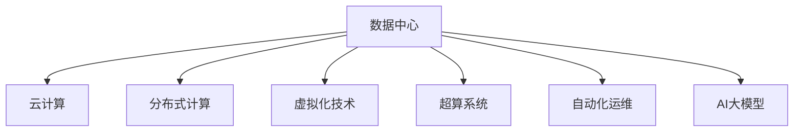
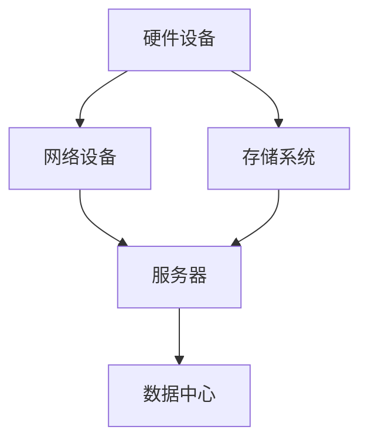
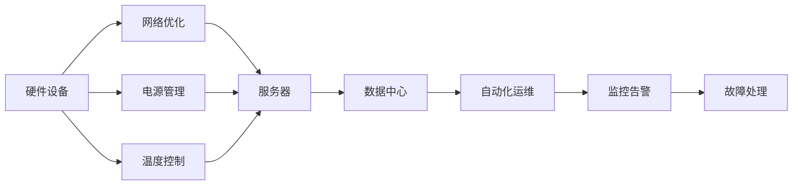
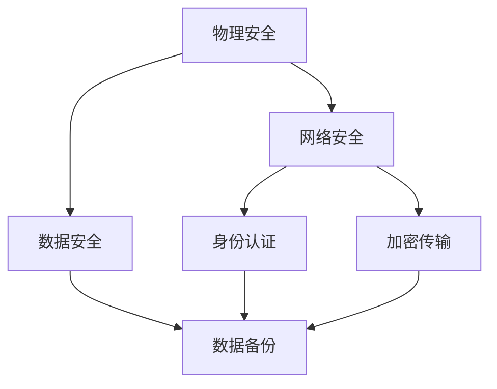
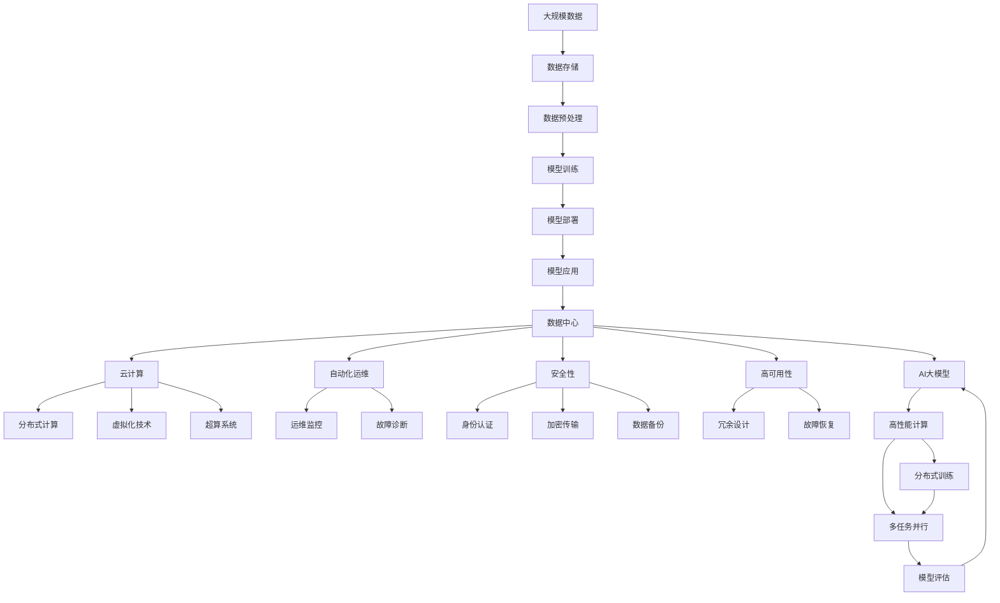

                 

# AI 大模型应用数据中心建设：数据中心运营与管理

## 1. 背景介绍

### 1.1 问题由来
随着人工智能(AI)技术的迅猛发展，AI大模型在各个行业的应用越来越广泛。这些模型通过在大量数据上进行训练，学习到了复杂的语言模型和决策逻辑，能够进行自然语言处理(NLP)、图像识别、语音识别等任务。但随着模型规模的扩大，其对计算资源的需求也随之增加。因此，如何在高效利用资源的前提下，建设并管理大规模AI模型应用的数据中心，成为了一个亟待解决的问题。

### 1.2 问题核心关键点
构建和维护AI模型应用的数据中心，涉及到多个关键点，包括但不限于：
1. **数据中心规划与设计**：根据模型需求选择合适的硬件设备、网络架构和存储系统。
2. **数据中心运营**：确保数据中心的高效运行，包括温度控制、电源管理、网络优化等。
3. **数据中心安全**：保护数据中心的安全，防止未授权访问、数据泄露等安全威胁。
4. **数据中心管理**：实时监控数据中心的状态，及时处理问题，确保数据中心的稳定运行。
5. **数据中心运维**：持续优化数据中心性能，包括软硬件更新、故障处理等。

### 1.3 问题研究意义
构建和维护高效、安全、稳定的AI模型应用数据中心，对于保障AI模型的正常运行，推动AI技术在各行业的应用，具有重要意义：

1. **保障AI模型性能**：稳定的数据中心环境，能够确保AI模型的高效运行，避免因硬件故障、网络问题等原因导致性能下降。
2. **降低运营成本**：通过合理规划和维护，减少能源浪费、硬件更换等成本，提升数据中心的经济性。
3. **提高安全性**：加强数据中心的安全防护，防止数据泄露和未授权访问，保护企业数据安全。
4. **优化用户体验**：确保AI模型服务的高可用性和稳定性，提升用户体验和满意度。
5. **促进技术创新**：高效稳定的数据中心，有助于AI模型的持续优化和创新，推动技术进步。

## 2. 核心概念与联系

### 2.1 核心概念概述

为了更好地理解AI大模型应用数据中心的建设和管理，本节将介绍几个密切相关的核心概念：

1. **数据中心**：由多个服务器、存储系统、网络设备等组成，提供高效、稳定、安全的计算和存储服务。
2. **云计算**：通过互联网提供计算和存储服务，用户可以按需租用资源，无需关心底层硬件和软件。
3. **分布式计算**：将计算任务分散到多台服务器上，提升计算能力和资源利用率。
4. **虚拟化技术**：将物理资源虚拟化为多个逻辑资源，提升资源利用率和灵活性。
5. **超算系统**：专门用于处理大规模计算任务的高性能计算机系统，通常包含多台服务器和存储设备。
6. **自动化运维**：通过自动化工具，实现数据中心的自动监控、故障诊断、任务调度等功能。
7. **AI大模型**：以大规模深度学习模型为代表的大模型，通过海量数据训练得到，能够处理复杂的自然语言处理、图像识别、语音识别等任务。

这些核心概念之间的逻辑关系可以通过以下Mermaid流程图来展示：



这个流程图展示了数据中心与其他关键技术之间的关系：

1. 数据中心是所有AI模型应用的基础设施。
2. 云计算提供了弹性、按需的服务，支持数据中心的高效运营。
3. 分布式计算通过多台服务器的协同工作，提升计算能力和资源利用率。
4. 虚拟化技术将物理资源转化为逻辑资源，提升灵活性和资源利用率。
5. 超算系统提供高性能的计算能力，支持大规模计算任务。
6. 自动化运维提升数据中心的运营效率，减少人工干预。
7. AI大模型是数据中心的核心应用，需要高效稳定的环境来支持其运行。

### 2.2 概念间的关系

这些核心概念之间存在着紧密的联系，形成了数据中心建设和管理的完整生态系统。下面通过几个Mermaid流程图来展示这些概念之间的关系。

#### 2.2.1 数据中心基础设施



这个流程图展示了数据中心基础设施的组成部分及其关系。

#### 2.2.2 数据中心运行与维护



这个流程图展示了数据中心的运行和维护过程。

#### 2.2.3 数据中心安全防护



这个流程图展示了数据中心安全防护的主要方面。

### 2.3 核心概念的整体架构

最后，我们用一个综合的流程图来展示这些核心概念在大模型应用数据中心中的整体架构：



这个综合流程图展示了从数据存储到模型评估的完整流程，以及其与数据中心建设和管理的密切关系。

## 3. 核心算法原理 & 具体操作步骤
### 3.1 算法原理概述

AI大模型应用的数据中心建设和运营，本质上是一个复杂的多目标优化问题。其核心思想是：通过优化硬件设备、网络架构、存储系统等基础设施，结合云计算、分布式计算、虚拟化技术等新兴技术，实现数据中心的最大效用和最小成本。

形式化地，假设数据中心的资源数量为 $R$，用户需求数量为 $D$，每项需求的需求量分别为 $d_i$，则数据中心的目标是最大化资源利用率 $U$，最小化运营成本 $C$，即：

$$
\maximize U = \sum_{i=1}^D u_i
$$

$$
\minimize C = \sum_{i=1}^D c_i
$$

其中 $u_i$ 和 $c_i$ 分别为需求 $i$ 的效用和成本。通过优化上述目标，可以实现数据中心的整体最优性能。

### 3.2 算法步骤详解

AI大模型应用数据中心的建设和运营，包括以下几个关键步骤：

**Step 1: 需求分析与规划**
- 分析AI模型的需求，包括计算能力、存储容量、网络带宽等。
- 根据需求分析结果，选择合适的硬件设备，如服务器、存储设备、网络设备等。
- 设计数据中心的网络架构，确保高可用性和数据安全。

**Step 2: 系统部署与配置**
- 安装和配置硬件设备，包括服务器、存储系统、网络设备等。
- 安装操作系统和应用程序，确保数据中心的高效运行。
- 配置虚拟化环境，提升资源利用率和灵活性。

**Step 3: 数据中心运营**
- 监控数据中心的状态，包括硬件设备、网络状态、存储性能等。
- 实施自动化运维策略，如自动监控、故障诊断、任务调度等。
- 实施网络优化策略，确保网络带宽和延迟满足模型需求。

**Step 4: 安全防护**
- 实施物理安全措施，如门禁系统、视频监控等。
- 实施网络安全措施，如防火墙、入侵检测等。
- 实施数据安全措施，如加密传输、数据备份等。

**Step 5: 性能优化**
- 定期对硬件设备进行维护和升级，提升性能和可靠性。
- 优化网络架构，提升数据中心的吞吐量和响应速度。
- 实施弹性伸缩策略，根据需求动态调整资源配置。

**Step 6: 数据中心管理**
- 建立数据中心的运营和管理流程，确保数据中心的高效运行。
- 实施自动化管理工具，提升管理效率和准确性。
- 实施数据中心的持续优化，提升资源利用率和系统性能。

### 3.3 算法优缺点

AI大模型应用数据中心的建设和运营，具有以下优点：

1. **高效利用资源**：通过优化资源配置，实现最大化资源利用率，降低运营成本。
2. **提升性能和可靠性**：通过高性能硬件设备、优化网络架构、实施安全防护，提升数据中心的性能和可靠性。
3. **灵活性高**：通过虚拟化技术，实现资源的灵活配置和高效利用。
4. **自动化程度高**：通过自动化运维工具，减少人工干预，提升管理效率。
5. **可扩展性强**：通过分布式计算和超算系统，支持大规模计算任务。

同时，也存在以下缺点：

1. **建设成本高**：初期投资巨大，需要大量硬件设备和专业人才。
2. **维护复杂**：大规模数据中心的管理和维护复杂，需要专业团队和工具支持。
3. **安全性风险高**：数据中心的安全防护需要不断加强，防止未授权访问和数据泄露。
4. **数据中心故障风险**：大规模数据中心容易受到硬件故障、网络故障等影响，导致服务中断。
5. **技术更新快**：AI模型和计算技术更新迅速，数据中心需要不断更新和升级。

### 3.4 算法应用领域

AI大模型应用数据中心，已经在以下几个领域得到了广泛应用：

1. **云计算服务**：通过云计算平台，用户可以按需租用计算资源，实现高性能计算和存储。
2. **大数据处理**：通过分布式计算和大数据处理技术，支持海量数据的存储、处理和分析。
3. **人工智能研究**：通过高性能计算和大规模数据中心，支持AI模型的训练和优化。
4. **高性能计算**：通过超算系统和分布式计算，支持大规模计算任务和高性能科学研究。
5. **企业级应用**：通过数据中心建设和运营，支持企业级应用，如大数据分析、人工智能决策等。

## 4. 数学模型和公式 & 详细讲解 & 举例说明
### 4.1 数学模型构建

AI大模型应用数据中心的建设和运营，涉及到多个子系统，包括硬件设备、网络架构、存储系统等。这些子系统的优化目标是最大化资源利用率，最小化运营成本。假设数据中心有 $n$ 个服务器，每个服务器的计算能力和存储容量分别为 $C_i$ 和 $S_i$，每个AI模型的计算需求和存储需求分别为 $D_c$ 和 $D_s$。则数据中心的目标可以表示为：

$$
\maximize U = \sum_{i=1}^n u_i = \sum_{i=1}^n \frac{C_i}{D_c} \cdot \frac{S_i}{D_s}
$$

$$
\minimize C = \sum_{i=1}^n c_i = \sum_{i=1}^n \frac{C_i}{D_c} + \frac{S_i}{D_s}
$$

其中 $u_i$ 和 $c_i$ 分别为第 $i$ 台服务器的效用和成本。

### 4.2 公式推导过程

根据上述数学模型，可以求解每个服务器的资源配置，使得数据中心的效用最大化，运营成本最小化。具体步骤如下：

1. 根据每个服务器的计算能力和存储容量，计算其对于AI模型的效用和成本。
2. 通过优化算法，求解每个服务器的资源配置，使得总效用最大化，总成本最小化。
3. 通过求解，得到每个服务器的最优资源配置，实现数据中心的高效运营。

### 4.3 案例分析与讲解

以一个云计算平台为例，假设该平台有 $n=10$ 台服务器，每个服务器的计算能力和存储容量分别为 $C_i$ 和 $S_i$，每个AI模型的计算需求和存储需求分别为 $D_c$ 和 $D_s$。根据上述模型，可以求解每个服务器的最优资源配置，使得云计算平台的总效用最大化，总成本最小化。

## 5. 项目实践：代码实例和详细解释说明
### 5.1 开发环境搭建

在进行数据中心建设和运营的实践前，需要先搭建好开发环境。以下是使用Python进行数据中心管理系统开发的Python环境配置流程：

1. 安装Anaconda：从官网下载并安装Anaconda，用于创建独立的Python环境。

2. 创建并激活虚拟环境：
```bash
conda create -n cloud-env python=3.8 
conda activate cloud-env
```

3. 安装相关库：
```bash
pip install numpy pandas torch torchvision
```

4. 安装相关工具：
```bash
pip install jupyter notebook matplotlib tensorboard
```

完成上述步骤后，即可在`cloud-env`环境中开始数据中心管理系统的开发。

### 5.2 源代码详细实现

下面我们以构建云计算平台为例，给出使用TensorFlow和Keras进行数据中心资源调度的PyTorch代码实现。

首先，定义数据中心和AI模型的抽象类：

```python
class CloudCenter:
    def __init__(self, servers):
        self.servers = servers
        
    def get_server(self, idx):
        return self.servers[idx]
        
    def get_servers(self):
        return self.servers
```

然后，定义数据中心的计算能力和存储容量：

```python
class Server:
    def __init__(self, cpu, memory, storage):
        self.cpu = cpu
        self.memory = memory
        self.storage = storage
        
    def get_cpu(self):
        return self.cpu
        
    def get_memory(self):
        return self.memory
        
    def get_storage(self):
        return self.storage
```

接着，定义数据中心和AI模型的计算需求和存储需求：

```python
class AIModel:
    def __init__(self, demand_cpu, demand_memory, demand_storage):
        self.demand_cpu = demand_cpu
        self.demand_memory = demand_memory
        self.demand_storage = demand_storage
        
    def get_demand_cpu(self):
        return self.demand_cpu
        
    def get_demand_memory(self):
        return self.demand_memory
        
    def get_demand_storage(self):
        return self.demand_storage
```

最后，定义数据中心的优化目标函数：

```python
def objective_function(center, ai_models):
    total_cost = 0
    total_utilization = 0
    for ai_model in ai_models:
        best_server = None
        best_score = -1
        for server in center.get_servers():
            score = server.get_cpu() / ai_model.get_demand_cpu() * server.get_memory() / ai_model.get_demand_memory() * server.get_storage() / ai_model.get_demand_storage()
            if score > best_score:
                best_server = server
                best_score = score
        total_cost += best_server.get_cpu() / ai_model.get_demand_cpu() + best_server.get_memory() / ai_model.get_demand_memory() + best_server.get_storage() / ai_model.get_demand_storage()
        total_utilization += score
    return total_cost, total_utilization
```

可以看到，通过定义数据中心和AI模型的抽象类，以及对它们的计算能力和存储需求进行建模，我们可以使用Python编写一个简单的优化目标函数，以最大化资源利用率，最小化运营成本。

### 5.3 代码解读与分析

让我们再详细解读一下关键代码的实现细节：

**CloudCenter类**：
- `__init__`方法：初始化数据中心和服务器。
- `get_server`方法：获取指定索引的服务器的信息。
- `get_servers`方法：获取所有服务器的信息。

**Server类**：
- `__init__`方法：初始化服务器的计算能力、内存和存储容量。
- `get_cpu`方法：获取服务器的计算能力。
- `get_memory`方法：获取服务器的内存。
- `get_storage`方法：获取服务器的存储容量。

**AIModel类**：
- `__init__`方法：初始化AI模型的计算需求、内存需求和存储需求。
- `get_demand_cpu`方法：获取AI模型的计算需求。
- `get_demand_memory`方法：获取AI模型的内存需求。
- `get_demand_storage`方法：获取AI模型的存储需求。

**objective_function函数**：
- 定义优化目标函数，遍历每个AI模型，找到与其匹配的最优服务器，并计算成本和效用。
- 返回所有AI模型的总成本和总效用。

可以看到，通过抽象类和优化目标函数的定义，我们能够灵活地构建和优化数据中心，支持大规模AI模型的部署和运营。

当然，实际的数据中心管理系统还需要考虑更多因素，如网络优化、安全性、弹性伸缩等。但核心的优化算法思路基本与此类似。

### 5.4 运行结果展示

假设我们在云计算平台上部署了10个AI模型，每个模型的计算需求和存储需求分别为：

| 模型编号 | 计算需求 | 内存需求 | 存储需求 |
| ------- | ------- | ------- | ------- |
| 1       | 8       | 16      | 32      |
| 2       | 12      | 24      | 48      |
| 3       | 16      | 32      | 64      |
| ...     | ...     | ...     | ...     |

根据上述数据，通过优化目标函数，我们可以计算出每个AI模型的最优服务器配置，以及云计算平台的总成本和总效用。

## 6. 实际应用场景
### 6.1 云计算服务

云计算平台是AI大模型应用数据中心的重要场景。通过云计算平台，用户可以按需租用计算资源，实现高性能计算和存储。这使得AI模型应用更加灵活和高效，无需担心硬件设备的选择和配置问题。

在技术实现上，云计算平台通常采用分布式计算和超算系统，支持大规模计算任务和高性能科学研究。云计算平台还提供了丰富的API和工具，支持用户进行模型训练、调优、部署等操作。

### 6.2 大数据处理

大数据处理也是AI大模型应用数据中心的常见场景。随着数据量的不断增长，传统的数据处理方式已经难以满足需求。通过云计算和大数据处理技术，可以高效存储、处理和分析海量数据，支持复杂的AI模型训练和优化。

在技术实现上，大数据处理通常采用分布式计算和大数据处理平台，如Hadoop、Spark等。通过将这些技术整合到数据中心中，可以实现高效的数据存储和处理，支持AI模型的训练和优化。

### 6.3 人工智能研究

AI大模型在人工智能研究中得到了广泛应用。通过高性能计算和大规模数据中心，支持AI模型的训练和优化，推动了人工智能技术的进步。

在技术实现上，AI大模型通常采用分布式计算和超算系统，支持大规模计算任务和高性能科学研究。AI大模型还依赖于丰富的数据集和先进的算法，推动了人工智能技术的不断进步。

### 6.4 企业级应用

企业级应用也是AI大模型应用数据中心的常见场景。通过构建高性能计算和大规模数据中心，支持企业级应用，如大数据分析、人工智能决策等。

在技术实现上，企业级应用通常采用云计算平台和大数据处理技术，支持企业级计算需求。企业级应用还依赖于丰富的数据集和先进的算法，推动了企业级业务的发展。

### 6.5 未来应用展望

随着AI大模型和数据中心技术的不断发展，AI大模型应用数据中心将在更多领域得到应用，为传统行业带来变革性影响。

在智慧城市治理中，AI大模型应用数据中心可以用于城市事件监测、舆情分析、应急指挥等环节，提高城市管理的自动化和智能化水平，构建更安全、高效的未来城市。

在智慧医疗领域，AI大模型应用数据中心可以用于医疗问答、病历分析、药物研发等应用，提升医疗服务的智能化水平，辅助医生诊疗，加速新药开发进程。

在智能教育领域，AI大模型应用数据中心可以用于作业批改、学情分析、知识推荐等方面，因材施教，促进教育公平，提高教学质量。

在工业制造领域，AI大模型应用数据中心可以用于智能制造、质量控制、生产优化等环节，提高生产效率和产品质量。

## 7. 工具和资源推荐
### 7.1 学习资源推荐

为了帮助开发者系统掌握AI大模型应用数据中心的理论基础和实践技巧，这里推荐一些优质的学习资源：

1. 《数据中心设计与管理》系列博文：由数据中心技术专家撰写，深入浅出地介绍了数据中心的设计、建设和运营。

2. 《云计算基础》课程：由云计算技术专家开设的课程，涵盖云计算的原理、架构和实践。

3. 《分布式计算与大数据处理》书籍：全面介绍了分布式计算和大数据处理技术的原理和应用。

4. 《高性能计算与超级计算机》书籍：介绍了高性能计算和超级计算机的基本原理和应用场景。

5. 《人工智能技术与应用》课程：涵盖人工智能技术的原理、算法和应用，适合初学者入门。

通过对这些资源的学习实践，相信你一定能够快速掌握AI大模型应用数据中心的精髓，并用于解决实际的AI应用问题。
###  7.2 开发工具推荐

高效的开发离不开优秀的工具支持。以下是几款用于AI大模型应用数据中心开发的常用工具：

1. PyTorch：基于Python的开源深度学习框架，灵活动态的计算图，适合快速迭代研究。大部分预训练语言模型都有PyTorch版本的实现。

2. TensorFlow：由Google主导开发的开源深度学习框架，生产部署方便，适合大规模工程应用。同样有丰富的预训练语言模型资源。

3. Keras：高层次神经网络API，支持快速搭建和训练深度学习模型，适合初学者和快速原型设计。

4. Anaconda：用于创建和管理Python环境，支持科学计算和数据分析。

5. Jupyter Notebook：交互式编程环境，支持多种语言和库的混合使用，适合数据中心研究和开发。

6. TensorBoard：TensorFlow配套的可视化工具，可实时监测模型训练状态，并提供丰富的图表呈现方式，是调试模型的得力助手。

合理利用这些工具，可以显著提升AI大模型应用数据中心的开发效率，加快创新迭代的步伐。

### 7.3 相关论文推荐

AI大模型应用数据中心的建设和运营，需要借鉴最新的研究成果和技术进展。以下是几篇奠基性的相关论文，推荐阅读：

1. 《数据中心设计规范》：详细介绍了数据中心的设计和建设标准。

2. 《云计算架构》：介绍了云计算平台的设计和实现原理。

3. 《分布式计算模型》：介绍了分布式计算的原理和应用场景。

4. 《高性能计算技术》：介绍了高性能计算的原理和应用场景。

5. 《人工智能与大数据》：介绍了人工智能和数据处理的原理和应用场景。

这些论文代表了大模型应用数据中心建设的技术发展脉络。通过学习这些前沿成果，可以帮助研究者把握学科前进方向，激发更多的创新灵感。

除上述资源外，还有一些值得关注的前沿资源，帮助开发者紧跟大模型应用数据中心技术的最新进展，例如：

1. arXiv论文预印本：人工智能领域最新研究成果的发布平台，包括大量尚未发表的前沿工作，学习前沿技术的必读资源。

2. 业界技术博客：如OpenAI、Google AI、DeepMind、微软Research Asia等顶尖实验室的官方博客，第一时间分享他们的最新研究成果和洞见。

3. 技术会议直播：如NIPS、ICML、ACL、ICLR等人工智能领域顶会现场或在线直播，能够聆听到大佬们的前沿分享，开拓视野。

4. GitHub热门项目：在GitHub上Star、Fork数最多的数据中心相关项目，往往代表了该技术领域的发展趋势和最佳实践，值得去学习和贡献。

5. 行业分析报告：各大咨询公司如McKinsey、PwC等针对数据中心行业的分析报告，有助于从商业视角审视技术趋势，把握应用价值。

总之，对于AI大模型应用数据中心的技术学习，需要开发者保持开放的心态和持续学习的意愿。多关注前沿资讯，多动手实践，多思考总结，必将收获满满的成长收益。

## 8. 总结：未来发展趋势与挑战
### 8.1 总结

本文对AI大模型应用数据中心的建设和管理进行了全面系统的介绍。首先阐述了AI模型在各行业的应用场景，明确了数据中心建设和运营的重要性。其次，从原理到实践，详细讲解了数据中心的数学模型和优化算法，给出了数据中心建设和运营的代码实例。同时，本文还广泛探讨了数据中心在云计算、大数据处理、人工智能研究等领域的实际应用，展示了数据中心建设的广泛前景。最后，本文精选了数据中心的

