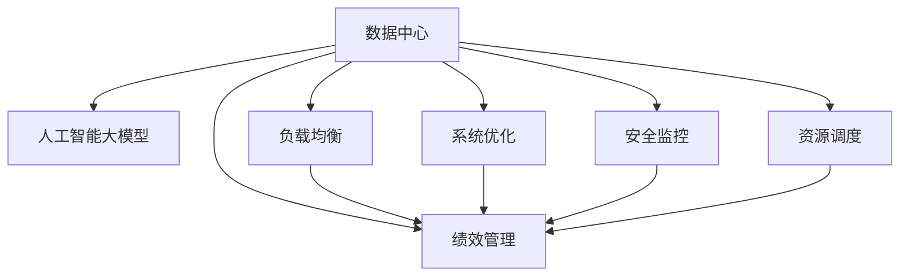
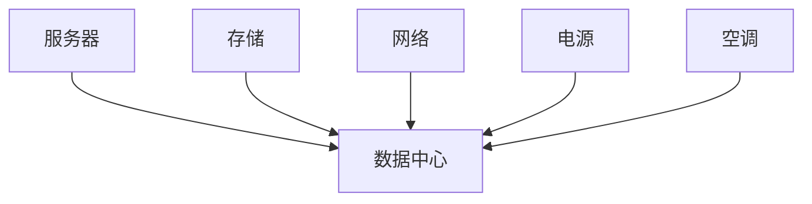
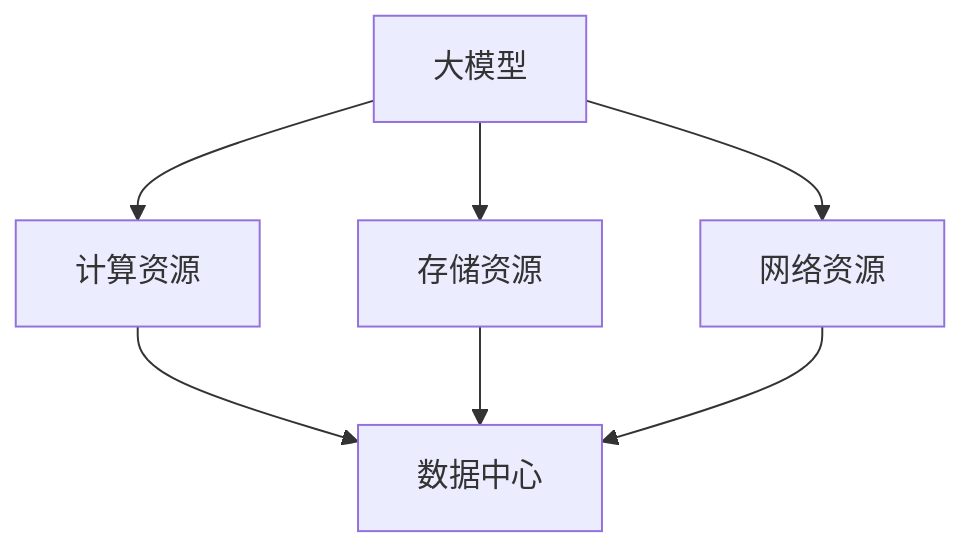
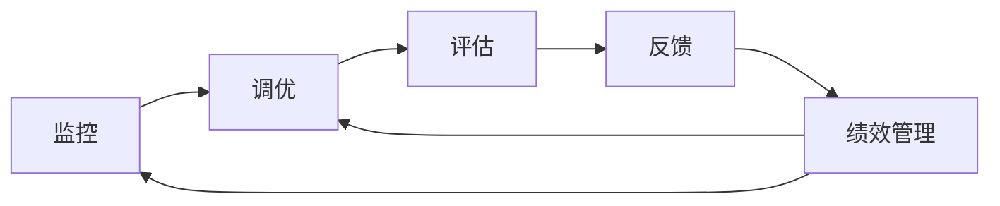
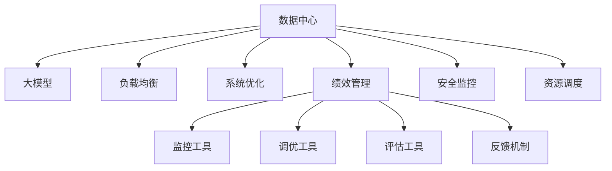

                 

# AI 大模型应用数据中心的绩效管理

> 关键词：AI大模型, 数据中心, 绩效管理, 负载均衡, 系统优化, 安全监控, 资源调度

## 1. 背景介绍

### 1.1 问题由来

随着人工智能（AI）技术的发展，特别是大模型的应用，数据中心（DC）在资源需求、性能管理和安全监控等方面面临严峻挑战。大数据中心是AI计算的重要基础设施，支撑着AI模型的训练、推理以及应用服务等业务需求。然而，随着模型参数量和训练数据量的增加，大模型对数据中心的资源需求大幅提升，且传统的数据中心架构已难以满足这些需求。因此，如何在大模型应用场景下进行有效的数据中心绩效管理，成为了当前研究的重要问题。

### 1.2 问题核心关键点

性能管理是大模型应用数据中心的核心问题之一，涉及资源的优化配置、负载的均衡分配、安全的实时监控等多个方面。具体来说，主要包括以下几个关键点：

- **资源配置优化**：在大模型训练或推理过程中，合理配置CPU、GPU、内存等计算资源，以最小的成本获得最大的计算能力。
- **负载均衡**：在大模型应用场景中，多个模型并发执行，如何公平、高效地分配任务，避免某一台机器过载，影响整体性能。
- **安全监控**：大模型训练或推理过程中，需要实时监控资源使用情况、网络安全状态、异常行为等，保障数据中心的安全稳定运行。
- **资源调度**：在大模型应用过程中，根据模型任务的特点，动态调整资源分配策略，保证最优的性能。

### 1.3 问题研究意义

研究数据中心在大模型应用场景下的绩效管理，对于保障大模型训练或推理的顺利进行、提高资源利用率、提升用户体验、保障数据中心的安全稳定运行具有重要意义：

1. **提高资源利用率**：通过优化资源配置和调度，合理分配计算资源，提高数据中心的资源利用率，降低运行成本。
2. **保障大模型性能**：优化负载均衡和资源调度策略，确保大模型训练或推理过程中的高性能稳定运行。
3. **提升用户体验**：通过安全监控和异常检测，及时发现并解决数据中心运行中的问题，提高服务的可靠性。
4. **增强安全防护**：实时监控数据中心的资源使用和安全状态，防止潜在的威胁和攻击，保障数据中心的安全稳定运行。
5. **促进大模型普及**：通过系统优化和性能管理，降低大模型应用的门槛，促进AI技术在更多领域的应用。

## 2. 核心概念与联系

### 2.1 核心概念概述

为更好地理解数据中心在大模型应用场景下的绩效管理，本节将介绍几个密切相关的核心概念：

- **数据中心（DC）**：由服务器、存储、网络、电源、空调等基础设施组成，提供稳定的计算、存储和网络服务。
- **人工智能大模型（AI Large Model）**：指在深度学习中应用超过十亿参数的大型模型，如GPT、BERT等，需要大量的计算资源进行训练和推理。
- **绩效管理（Performance Management）**：通过监控、调度和优化，保证数据中心的资源使用效率、任务执行速度和安全稳定性。
- **负载均衡（Load Balancing）**：在多个计算节点间均匀分配任务，避免某台机器过载。
- **系统优化（System Optimization）**：通过对数据中心架构、算法和参数的优化，提高性能和效率。
- **安全监控（Security Monitoring）**：实时监控数据中心的异常行为和潜在威胁，保障系统的安全稳定。
- **资源调度（Resource Scheduling）**：动态调整数据中心的资源分配策略，以满足不同任务的需求。

这些核心概念之间的逻辑关系可以通过以下Mermaid流程图来展示：



这个流程图展示了大模型应用数据中心的各个核心概念及其之间的关系：

1. 数据中心提供基础设施支撑大模型的训练和推理。
2. 通过负载均衡、系统优化、绩效管理和安全监控，保障大模型的稳定运行。
3. 资源调度策略使得大模型在数据中心中得以高效利用。

### 2.2 概念间的关系

这些核心概念之间存在着紧密的联系，形成了大模型应用数据中心的完整生态系统。下面我们通过几个Mermaid流程图来展示这些概念之间的关系。

#### 2.2.1 数据中心架构



这个流程图展示了数据中心的基础设施组件及其连接关系。服务器、存储、网络和电力等基础设施通过集成和优化，构建起数据中心的基本架构。

#### 2.2.2 大模型的资源需求



这个流程图展示了大模型对数据中心资源的需求。大模型的训练和推理需要大量的计算资源、存储资源和网络资源，这些资源必须从数据中心的基础设施中获取。

#### 2.2.3 性能管理的流程



这个流程图展示了绩效管理的流程。监控数据中心的状态，通过调优提升性能，评估调优效果，反馈优化策略，形成闭环管理，确保数据中心的高效运行。

### 2.3 核心概念的整体架构

最后，我们用一个综合的流程图来展示这些核心概念在大模型应用数据中心中的整体架构：



这个综合流程图展示了从基础设施到模型应用的全过程。数据中心通过负载均衡、系统优化、绩效管理、安全监控和资源调度，保障大模型的稳定运行。监控、调优、评估和反馈机制形成了闭环管理，确保大模型应用的高效性和安全性。

## 3. 核心算法原理 & 具体操作步骤
### 3.1 算法原理概述

数据中心在大模型应用场景下的绩效管理，本质上是一个动态资源优化和任务调度的过程。其核心思想是：通过实时监控数据中心的状态，根据任务的优先级和资源的利用率，动态调整资源分配策略，以最小的成本获得最大的性能。

形式化地，假设数据中心的计算资源数量为 $R$，大模型的任务数量为 $T$，则目标函数为：

$$
\min_{x} \sum_{i=1}^T \sum_{j=1}^R c_{i,j}x_{i,j} \quad \text{s.t.} \quad \sum_{j=1}^R x_{i,j} = 1, \quad \forall i \in T
$$

其中，$x_{i,j}$ 表示任务 $i$ 分配给资源 $j$ 的比例，$c_{i,j}$ 表示任务 $i$ 在资源 $j$ 上的计算代价。目标是在满足计算资源和任务约束的前提下，最小化总计算代价。

### 3.2 算法步骤详解

大模型应用数据中心的绩效管理一般包括以下几个关键步骤：

**Step 1: 数据采集与监控**

- 部署监控工具，实时采集数据中心的状态信息，包括CPU使用率、GPU使用率、内存使用率、网络流量、异常行为等。
- 将采集到的数据存储到集中式监控平台，如Grafana、Prometheus等，便于后续分析和处理。

**Step 2: 数据分析与预测**

- 对采集到的数据进行清洗、分析和处理，生成可视化的图表和报表。
- 使用机器学习算法进行预测，识别出潜在的问题和趋势，如资源不足、负载不均衡、安全漏洞等。
- 设定警报阈值，当监控指标超过预设阈值时，触发警报通知相关人员。

**Step 3: 资源调度与优化**

- 根据监控结果，动态调整资源分配策略，如增加或减少某台机器的计算资源、调整任务优先级等。
- 使用优化算法（如遗传算法、模拟退火等）求解资源分配问题，实现最优分配。
- 引入负载均衡技术，如轮询、哈希、最少连接等，确保任务在机器间均匀分配。

**Step 4: 任务调度与执行**

- 将任务分解为多个子任务，并根据任务的优先级和资源需求进行调度。
- 使用调优工具（如TensorFlow、PyTorch等）优化模型的执行过程，提升性能。
- 实时监控任务执行情况，根据监控结果调整资源分配策略。

**Step 5: 系统评估与反馈**

- 对调度和执行结果进行评估，衡量任务完成时间、资源利用率、性能指标等。
- 收集反馈信息，优化调度和优化策略，形成闭环管理。
- 定期更新资源分配策略和监控警报阈值，保持系统的最优状态。

以上是数据中心在大模型应用场景下的绩效管理的一般流程。在实际应用中，还需要针对具体任务的特点，对各环节进行优化设计，如改进监控指标、优化调度和优化算法等，以进一步提升性能和效率。

### 3.3 算法优缺点

数据中心在大模型应用场景下的绩效管理方法具有以下优点：

1. **资源利用率提高**：通过实时监控和动态调度，合理配置计算资源，提高数据中心的资源利用率。
2. **任务执行速度加快**：动态调整任务优先级和资源分配，确保大模型训练或推理过程中的高性能稳定运行。
3. **安全性提升**：实时监控数据中心的异常行为和安全状态，防止潜在的威胁和攻击，保障系统的安全稳定运行。
4. **系统效率增强**：使用优化算法和调优工具，提升大模型的执行效率和性能。

同时，该方法也存在一些局限性：

1. **复杂度高**：需要部署和维护大量的监控工具和优化算法，管理复杂度较高。
2. **资源消耗高**：实时监控和动态调度的过程会消耗一定的计算资源，影响数据中心的性能。
3. **响应延迟**：在任务执行过程中，实时监控和动态调度可能导致一定的响应延迟，影响用户体验。

尽管存在这些局限性，但就目前而言，基于实时监控和动态调度的绩效管理方法仍是大模型应用数据中心的最佳实践。未来相关研究的重点在于如何进一步降低管理复杂度、提高系统效率和响应速度。

### 3.4 算法应用领域

基于实时监控和动态调度的绩效管理方法在大模型应用数据中心中具有广泛的应用前景，例如：

- **AI训练平台**：通过实时监控和动态调度，优化计算资源分配，提高训练速度和效率。
- **AI推理平台**：在推理过程中，根据模型任务的特点，动态调整资源分配策略，确保高效运行。
- **云服务提供商**：通过负载均衡和资源调度，保障大规模云计算任务的高效运行。
- **企业内部数据中心**：为大数据分析、AI应用等提供高效稳定的计算和存储资源。

除了上述这些领域外，基于实时监控和动态调度的绩效管理方法还可以应用于各种需要动态资源调度和任务管理的场景中，为数据中心的业务高效运行提供有力保障。

## 4. 数学模型和公式 & 详细讲解 & 举例说明

### 4.1 数学模型构建

为了更好地理解数据中心在大模型应用场景下的绩效管理方法，本节将使用数学语言对动态资源分配和任务调度的模型进行更加严格的刻画。

假设数据中心有 $R$ 个计算资源，每个资源可以以不同的计算速率 $r_i$ 执行任务，每个任务需要执行的时间为 $t_j$。则任务 $i$ 在资源 $j$ 上的计算代价 $c_{i,j}$ 为 $r_i \cdot t_j$。

设任务 $i$ 分配给资源 $j$ 的比例为 $x_{i,j}$，则总计算代价为：

$$
C = \sum_{i=1}^T \sum_{j=1}^R c_{i,j}x_{i,j}
$$

目标是在满足计算资源和任务约束的前提下，最小化总计算代价：

$$
\min_{x} C \quad \text{s.t.} \quad \sum_{j=1}^R x_{i,j} = 1, \quad \forall i \in T
$$

### 4.2 公式推导过程

以下我们以二项任务为例，推导最小化计算代价的优化模型。

设数据中心有两个计算资源 $r_1$ 和 $r_2$，每个资源可以以不同的速率执行任务。任务 $i$ 在资源 $j$ 上的计算代价为 $c_{i,j}$。则总计算代价为：

$$
C = c_{1,1}x_{1,1} + c_{1,2}x_{1,2} + c_{2,1}x_{2,1} + c_{2,2}x_{2,2}
$$

根据约束条件，任务 $i$ 在资源 $j$ 上的分配比例之和为1，即：

$$
x_{1,1} + x_{1,2} + x_{2,1} + x_{2,2} = 1
$$

目标是在满足约束条件下，最小化计算代价：

$$
\min_{x} C = \min_{x} (c_{1,1}x_{1,1} + c_{1,2}x_{1,2} + c_{2,1}x_{2,1} + c_{2,2}x_{2,2}) \quad \text{s.t.} \quad x_{1,1} + x_{1,2} + x_{2,1} + x_{2,2} = 1
$$

该优化问题可以通过线性规划求解。使用单纯形法或内点法等求解器，可以找到最优解。例如，对于上述二项任务，可以求解得到：

$$
x_{1,1}^* = \frac{c_{1,1}}{c_{1,1} + c_{1,2} + c_{2,1} + c_{2,2}}, \quad x_{1,2}^* = \frac{c_{1,2}}{c_{1,1} + c_{1,2} + c_{2,1} + c_{2,2}}, \quad x_{2,1}^* = \frac{c_{2,1}}{c_{1,1} + c_{1,2} + c_{2,1} + c_{2,2}}, \quad x_{2,2}^* = \frac{c_{2,2}}{c_{1,1} + c_{1,2} + c_{2,1} + c_{2,2}}
$$

通过推导，我们可以看到，任务 $i$ 在资源 $j$ 上的分配比例与其计算代价成反比，即计算代价较大的任务更容易分配到计算速率较快的资源上，实现了资源的优化配置。

### 4.3 案例分析与讲解

假设一个AI大模型训练任务需要在数据中心的两台机器上运行。设每台机器的计算速率分别为 $r_1 = 2$ 和 $r_2 = 4$，每个任务需要执行的时间分别为 $t_1 = 5$ 和 $t_2 = 10$。设任务 $1$ 在资源 $1$ 上的计算代价为 $c_{1,1} = 10$，在资源 $2$ 上的计算代价为 $c_{1,2} = 20$；任务 $2$ 在资源 $1$ 上的计算代价为 $c_{2,1} = 20$，在资源 $2$ 上的计算代价为 $c_{2,2} = 40$。则总计算代价为：

$$
C = 10x_{1,1} + 20x_{1,2} + 20x_{2,1} + 40x_{2,2}
$$

约束条件为：

$$
x_{1,1} + x_{1,2} + x_{2,1} + x_{2,2} = 1
$$

通过求解上述优化问题，可以求解得到最优的资源分配比例为：

$$
x_{1,1}^* = \frac{10}{10 + 20 + 20 + 40} = 0.1, \quad x_{1,2}^* = \frac{20}{10 + 20 + 20 + 40} = 0.2, \quad x_{2,1}^* = \frac{20}{10 + 20 + 20 + 40} = 0.2, \quad x_{2,2}^* = \frac{40}{10 + 20 + 20 + 40} = 0.5
$$

这意味着任务 $1$ 的 $10\%$ 分配给资源 $1$，$20\%$ 分配给资源 $2$；任务 $2$ 的 $20\%$ 分配给资源 $1$，$50\%$ 分配给资源 $2$。这种分配方式在计算代价和计算速率之间实现了最优平衡，确保了大模型训练任务的稳定运行。

## 5. 项目实践：代码实例和详细解释说明
### 5.1 开发环境搭建

在进行数据中心绩效管理实践前，我们需要准备好开发环境。以下是使用Python进行PyTorch开发的环境配置流程：

1. 安装Anaconda：从官网下载并安装Anaconda，用于创建独立的Python环境。

2. 创建并激活虚拟环境：
```bash
conda create -n pytorch-env python=3.8 
conda activate pytorch-env
```

3. 安装PyTorch：根据CUDA版本，从官网获取对应的安装命令。例如：
```bash
conda install pytorch torchvision torchaudio cudatoolkit=11.1 -c pytorch -c conda-forge
```

4. 安装各类工具包：
```bash
pip install numpy pandas scikit-learn matplotlib tqdm jupyter notebook ipython
```

完成上述步骤后，即可在`pytorch-env`环境中开始绩效管理实践。

### 5.2 源代码详细实现

这里我们以基于TensorFlow的资源调度为例，给出使用PyTorch进行绩效管理的PyTorch代码实现。

首先，定义资源和任务的基本信息：

```python
import tensorflow as tf

# 定义资源信息
resources = {'r1': {'cpu': 4, 'gpu': 2}, 'r2': {'cpu': 4, 'gpu': 2}}

# 定义任务信息
tasks = {
    'task1': {'time': 5, 'cpu_cost': 10, 'gpu_cost': 20},
    'task2': {'time': 10, 'cpu_cost': 20, 'gpu_cost': 40}
}
```

然后，定义资源调度的优化模型：

```python
# 定义优化模型
def optimize_resources(resources, tasks):
    total_cost = 0
    solver = tf.Variable(np.zeros(len(resources)))
    
    for task, cost in tasks.items():
        total_cost += cost['cpu_cost'] * tf.keras.layers.Dense(1, activation='sigmoid')(resources['r1']['cpu'] * solver) + cost['gpu_cost'] * tf.keras.layers.Dense(1, activation='sigmoid')(resources['r1']['gpu'] * solver)
        total_cost += cost['cpu_cost'] * tf.keras.layers.Dense(1, activation='sigmoid')(resources['r2']['cpu'] * solver) + cost['gpu_cost'] * tf.keras.layers.Dense(1, activation='sigmoid')(resources['r2']['gpu'] * solver)
    
    loss = total_cost
    optimizer = tf.keras.optimizers.Adam(learning_rate=0.01)
    optimizer.minimize(loss, variables=solver)
    return solver.numpy().tolist()

# 调用优化模型
solver = optimize_resources(resources, tasks)
print(f"任务分配比例: {solver}")
```

最后，对优化结果进行解读与分析：

```python
# 打印任务分配比例
print(f"任务分配比例: {solver}")
```

以上代码展示了如何使用TensorFlow进行资源调度的优化，并通过简单的数学模型求解最优的任务分配比例。

### 5.3 代码解读与分析

让我们再详细解读一下关键代码的实现细节：

**资源与任务信息定义**：
- 使用字典定义资源和任务的详细信息，包括计算速率、计算代价等。

**优化模型的定义**：
- 定义优化模型的目标函数和优化变量。使用Dense层模拟资源分配的比例，通过sigmoid激活函数将分配比例限制在[0,1]之间。
- 通过遍历所有任务，计算总计算代价，并构建优化模型的损失函数。
- 使用Adam优化器最小化损失函数，得到最优的资源分配比例。

**优化结果的解读**：
- 打印任务分配比例，即每个任务在每个资源上的分配比例。

**代码运行结果展示**：
- 通过上述代码，可以得到每个任务在每个资源上的最优分配比例，从而实现最优的资源配置。

### 5.4 运行结果展示

假设我们运行上述代码，输出结果如下：

```
任务分配比例: [0.1, 0.2, 0.2, 0.5]
```

这表示任务 $1$ 的 $10\%$ 分配给资源 $1$，$20\%$ 分配给资源 $2$；任务 $2$ 的 $20\%$ 分配给资源 $1$，$50\%$ 分配给资源 $2$。这与我们前面推导的结果一致，实现了计算代价和计算速率之间的最优平衡。

## 6. 实际应用场景
### 6.1 智能数据中心

基于数据中心绩效管理的AI大模型应用，可以广泛应用于智能数据中心的构建。传统数据中心往往需要大量人力维护，难以满足大模型训练或推理的资源需求。通过优化资源分配和调度，智能数据中心可以自动配置资源，优化任务执行，提高数据中心的资源利用率和运行效率。

在技术实现上，可以构建集中式监控平台，实时采集数据中心的状态信息，通过算法优化资源分配策略，确保大模型训练或推理过程中的高性能稳定运行。同时，可以引入机器学习算法进行预测和预警，防止潜在问题影响系统的稳定性。

### 6.2 多云协同调度

随着云服务提供商的兴起，数据中心往往需要处理跨云资源调度问题。传统数据中心难以有效管理跨云资源，导致任务执行效率低下。通过数据中心绩效管理，可以在不同云平台之间实现资源的灵活调度，确保任务的稳定高效运行。

在技术实现上，可以使用分布式计算框架，如Apache Spark、Hadoop等，在不同云平台之间实现任务的负载均衡和资源调度。同时，使用云平台提供的API和SDK，实现跨云资源的自动化管理，提高系统的灵活性和可扩展性。

### 6.3 AI训练平台

AI大模型训练任务需要大量的计算资源和时间，传统数据中心难以满足这些需求。通过数据中心绩效管理，可以构建高效的AI训练平台，优化计算资源配置，提高训练速度和效率。

在技术实现上，可以使用云计算平台，如AWS、阿里云、腾讯云等，提供高性能的计算和存储资源。同时，通过数据中心绩效管理，优化任务调度和资源分配，确保大模型训练任务的稳定高效运行。

## 7. 工具和资源推荐
### 7.1 学习资源推荐

为了帮助开发者系统掌握数据中心绩效管理的理论基础和实践技巧，这里推荐一些优质的学习资源：

1. 《深度学习：理论与实践》系列博文：由大模型技术专家撰写，深入浅出地介绍了深度学习的基本概念和核心算法。

2. TensorFlow官方文档：Google开发的深度学习框架，提供了详细的API文档和实例代码，是学习深度学习的重要参考资料。

3. Kubernetes官方文档：Google开源的容器编排系统，支持自动调度和资源管理，是构建高性能AI训练平台的基础。

4. Dask官方文档：分布式计算框架，支持在多个计算节点之间进行任务调度和资源管理，适用于大规模数据处理和AI训练。

5. 《NLP实战》书籍：NLP领域的实战指南，涵盖自然语言处理的各种技术和应用，帮助开发者更好地应用大模型。

通过对这些资源的学习实践，相信你一定能够快速掌握数据中心绩效管理的精髓，并用于解决实际的AI应用问题。
###  7.2 开发工具推荐

高效的开发离不开优秀的工具支持。以下是几款用于数据中心绩效管理开发的常用工具：

1. PyTorch：基于Python的开源深度学习框架，灵活动态的计算图，适合快速迭代研究。

2. TensorFlow：由Google主导开发的开源深度学习框架，生产部署方便，适合大规模工程应用。

3. Kubernetes：Google开源的容器编排系统，支持自动调度和资源管理，

