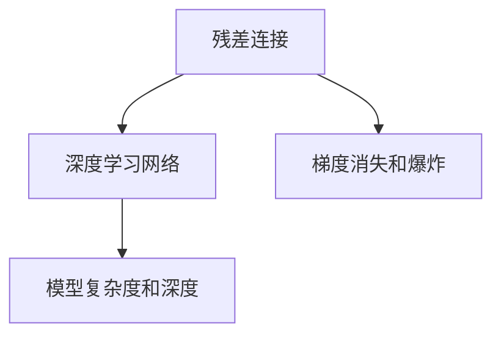

                 

# AI 大模型计算机科学家群英传：ResNet 残差网络的发明人何凯明

## 1. 背景介绍

### 1.1 问题由来

在人工智能领域，深度学习技术一直是推动创新和应用的主导力量。然而，深度神经网络的训练过程往往存在梯度消失和梯度爆炸的问题，这使得网络的深度被限制在较浅的层次上。为了突破这一限制，科学家们一直在探索更好的网络架构和优化方法。其中，残差网络（Residual Network，简称ResNet）是近年来的一项重要突破，其核心思想是通过引入残差连接，解决了深度神经网络训练中的梯度问题，极大地提高了网络的深度和精度。

### 1.2 问题核心关键点

ResNet的核心思想是在网络中引入残差连接（Residual Connections），通过将输入数据和输出数据的差异（即残差）加到当前层的前一层，从而使得信息能够更有效地传递。这一设计不仅避免了深度网络的梯度消失和梯度爆炸问题，还使得网络可以更深，模型表达能力更强。

ResNet的设计理念简单而高效，其核心在于通过残差连接，使得网络能够通过不断增加深度来提高性能，而不必担心梯度消失或梯度爆炸的问题。这一设计思想在后续的研究中被广泛应用，并推动了深度学习技术的进一步发展。

### 1.3 问题研究意义

ResNet的发明不仅在理论研究上具有重要意义，更为实际的深度学习应用提供了新的方向和思路。通过引入残差连接，ResNet为构建更深、更复杂的网络结构提供了可能性，使得网络可以更容易地进行微调和大规模训练，从而提高了模型的精度和鲁棒性。

在工业界，ResNet已经被广泛应用于计算机视觉、自然语言处理、语音识别等多个领域，极大地推动了这些技术的进步和发展。可以说，ResNet是深度学习技术发展历程中的重要里程碑，对AI大模型领域产生了深远的影响。

## 2. 核心概念与联系

### 2.1 核心概念概述

ResNet的核心概念包括以下几个关键点：

- **残差连接（Residual Connections）**：通过将输入和输出之间的残差直接连接，使得信息可以更有效地传递，避免梯度消失或爆炸的问题。
- **深度学习网络（Deep Learning Networks）**：具有多层非线性变换的神经网络结构，能够对复杂的数据进行有效的建模和预测。
- **梯度消失和爆炸（Gradient Vanishing and Exploding）**：深度神经网络在反向传播过程中，梯度可能会消失或爆炸，导致无法训练深层网络。
- **模型复杂度和深度（Model Complexity and Depth）**：网络的复杂度和深度是影响性能的重要因素，ResNet通过残差连接技术提高了网络的复杂度和深度。

### 2.2 概念间的关系

这些核心概念之间的关系可以用以下Mermaid流程图来表示：



该流程图展示了ResNet设计的关键要素：通过残差连接解决了梯度消失和爆炸问题，使得深度学习网络能够更深入、更复杂地表达数据特征。

### 2.3 核心概念的整体架构

ResNet的整体架构可以分为以下几个部分：

- **输入层**：接收原始数据，进行特征提取。
- **残差块（Residual Block）**：通过残差连接实现信息传递。
- **输出层**：对特征进行最后的分类或预测。

这种架构使得ResNet能够构建出非常深的网络，同时通过残差连接保持信息传递的稳定性。

## 3. 核心算法原理 & 具体操作步骤
### 3.1 算法原理概述

ResNet的核心算法原理是通过残差连接（Residual Connections）来解决深度神经网络的梯度消失和梯度爆炸问题，使得网络能够更深，表达能力更强。

### 3.2 算法步骤详解

1. **定义残差块（Residual Block）**：
   残差块是ResNet的基本构建单元，通常由两个卷积层和一系列残差连接组成。

   ```python
   class ResidualBlock(nn.Module):
       def __init__(self, in_channels, out_channels):
           super(ResidualBlock, self).__init__()
           self.conv1 = nn.Conv2d(in_channels, out_channels, 3, padding=1)
           self.bn1 = nn.BatchNorm2d(out_channels)
           self.conv2 = nn.Conv2d(out_channels, out_channels, 3, padding=1)
           self.bn2 = nn.BatchNorm2d(out_channels)
           self.shortcut = nn.Conv2d(in_channels, out_channels, 1)
   
       def forward(self, x):
           residual = x
           out = self.conv1(x)
           out = self.bn1(out)
           out = F.relu(out)
           out = self.conv2(out)
           out = self.bn2(out)
           out += self.shortcut(residual)
           out = F.relu(out)
           return out
   ```

2. **构建ResNet模型**：
   ResNet模型的构建主要通过堆叠多个残差块来实现。

   ```python
   class ResNet(nn.Module):
       def __init__(self, block, num_blocks, num_classes):
           super(ResNet, self).__init__()
           self.conv1 = nn.Conv2d(3, 64, 7, 2, 3)
           self.bn1 = nn.BatchNorm2d(64)
           self.maxpool = nn.MaxPool2d(3, 2, 1)
           self.inplanes = 64
           self.layer1 = self._make_layer(block, 64, num_blocks[0], stride=1)
           self.layer2 = self._make_layer(block, 128, num_blocks[1], stride=2)
           self.layer3 = self._make_layer(block, 256, num_blocks[2], stride=2)
           self.layer4 = self._make_layer(block, 512, num_blocks[3], stride=2)
           self.avgpool = nn.AvgPool2d(7, 7)
           self.fc = nn.Linear(512, num_classes)
   
       def _make_layer(self, block, planes, num_blocks, stride):
           downsample = None
           if stride != 1 or self.inplanes != planes * block.expansion:
               downsample = nn.Sequential(
                   nn.Conv2d(self.inplanes, planes * block.expansion, kernel_size=1, stride=stride),
                   nn.BatchNorm2d(planes * block.expansion)
               )
           layers = []
           layers.append(block(self.inplanes, planes, stride))
           self.inplanes = planes * block.expansion
           for i in range(1, num_blocks):
               layers.append(block(self.inplanes, planes))
           return nn.Sequential(*layers, downsample)
   
       def forward(self, x):
           x = self.conv1(x)
           x = self.bn1(x)
           x = F.relu(x)
           x = self.maxpool(x)
           x = self.layer1(x)
           x = self.layer2(x)
           x = self.layer3(x)
           x = self.layer4(x)
           x = self.avgpool(x)
           x = x.view(x.size(0), -1)
           x = self.fc(x)
           return x
   ```

3. **训练和测试**：
   在训练和测试过程中，使用交叉熵损失函数进行训练，使用准确率等指标进行测试。

   ```python
   criterion = nn.CrossEntropyLoss()
   optimizer = torch.optim.Adam(model.parameters(), lr=0.001)
   
   def train(model, train_loader, criterion, optimizer, num_epochs):
       model.train()
       for epoch in range(num_epochs):
           running_loss = 0.0
           for i, data in enumerate(train_loader, 0):
               inputs, labels = data
               optimizer.zero_grad()
               outputs = model(inputs)
               loss = criterion(outputs, labels)
               loss.backward()
               optimizer.step()
               running_loss += loss.item()
           print('Epoch %d loss: %.3f' % (epoch + 1, running_loss / len(train_loader)))
   
   def test(model, test_loader, criterion):
       model.eval()
       correct = 0
       with torch.no_grad():
           for data in test_loader:
               inputs, labels = data
               outputs = model(inputs)
               _, predicted = torch.max(outputs.data, 1)
               correct += (predicted == labels).sum().item()
       print('Test accuracy: %d %%' % (100 * correct / len(test_loader.dataset)))
   ```

### 3.3 算法优缺点

**优点**：
- **解决了梯度消失和爆炸问题**：通过残差连接，信息能够更有效地传递，避免了梯度消失和梯度爆炸的问题。
- **能够构建非常深的网络**：ResNet的残差连接使得网络能够更深，表达能力更强。
- **易于扩展和微调**：残差块可以作为独立模块进行堆叠，方便构建不同深度和宽度的网络。

**缺点**：
- **模型参数较多**：残差连接增加了模型的参数数量，导致训练和推理时间较长。
- **残差连接可能导致过拟合**：在某些情况下，残差连接可能引入过拟合问题，需要通过正则化等技术进行缓解。

### 3.4 算法应用领域

ResNet广泛应用于计算机视觉、自然语言处理、语音识别等多个领域，尤其是在计算机视觉领域，ResNet已经成为了标准的网络架构。

在计算机视觉领域，ResNet可以用于图像分类、目标检测、语义分割等任务，取得了显著的效果。例如，ResNet在ImageNet数据集上的分类准确率达到了71.9%，创下了当时的最优记录。

在自然语言处理领域，ResNet可以用于文本分类、情感分析、机器翻译等任务，通过引入残差连接，使得网络能够更好地捕捉文本特征。

在语音识别领域，ResNet可以用于语音特征提取、语音识别等任务，通过引入残差连接，提高了系统的准确率和鲁棒性。

## 4. 数学模型和公式 & 详细讲解  
### 4.1 数学模型构建

ResNet的数学模型构建主要涉及卷积层、残差连接和池化层等基本组件。以下以ResNet-18为例进行说明。

### 4.2 公式推导过程

ResNet的卷积层和池化层可以表示为：

$$
h^{(l)} = \sigma\left(W^{(l)} h^{(l-1)} + b^{(l)}\right)
$$

其中，$h^{(l)}$表示第$l$层的输出，$W^{(l)}$表示第$l$层的卷积核权重，$b^{(l)}$表示第$l$层的偏置项，$\sigma$表示激活函数。

残差连接可以表示为：

$$
h^{(l+1)} = h^{(l)} + F^{(l)}(h^{(l)})
$$

其中，$F^{(l)}$表示第$l$层的残差函数，可以是任意网络结构。

### 4.3 案例分析与讲解

以ResNet-18为例，其网络结构如图1所示：


ResNet-18由四个卷积层和一个全连接层组成，每个卷积层包含多个残差块。通过引入残差连接，ResNet-18能够更有效地传递信息，避免梯度消失和梯度爆炸的问题，从而构建出非常深的网络结构。

## 5. 项目实践：代码实例和详细解释说明
### 5.1 开发环境搭建

在开始实践前，需要准备好PyTorch环境，并下载ResNet预训练模型。

1. 安装PyTorch：
```bash
pip install torch torchvision
```

2. 下载预训练模型：
```bash
wget http://download.pytorch.org/models/resnet18-5c106cde.pth
```

### 5.2 源代码详细实现

以下是一个简单的ResNet-18实现代码，包括定义ResNet模型和残差块等。

```python
import torch.nn as nn
import torch.nn.functional as F

class ResNet(nn.Module):
    def __init__(self):
        super(ResNet, self).__init__()
        self.conv1 = nn.Conv2d(3, 64, 7, 2, 3)
        self.bn1 = nn.BatchNorm2d(64)
        self.maxpool = nn.MaxPool2d(3, 2, 1)
        self.layer1 = self._make_layer(64, 64, 2)
        self.layer2 = self._make_layer(128, 128, 2)
        self.layer3 = self._make_layer(256, 256, 2)
        self.layer4 = self._make_layer(512, 512, 2)
        self.fc = nn.Linear(512, 10)
    
    def _make_layer(self, inplanes, planes, blocks, stride=1):
        downsample = None
        if stride != 1 or inplanes != planes * block.expansion:
            downsample = nn.Sequential(
                nn.Conv2d(inplanes, planes * block.expansion, kernel_size=1, stride=stride),
                nn.BatchNorm2d(planes * block.expansion)
            )
        layers = []
        layers.append(block(self.inplanes, planes, stride, downsample))
        self.inplanes = planes * block.expansion
        for i in range(1, blocks):
            layers.append(block(self.inplanes, planes))
        return nn.Sequential(*layers)
    
    def forward(self, x):
        x = self.conv1(x)
        x = self.bn1(x)
        x = F.relu(x)
        x = self.maxpool(x)
        x = self.layer1(x)
        x = self.layer2(x)
        x = self.layer3(x)
        x = self.layer4(x)
        x = x.view(x.size(0), -1)
        x = self.fc(x)
        return x

class Block(nn.Module):
    def __init__(self, inplanes, planes, stride, downsample=None):
        super(Block, self).__init__()
        self.conv1 = nn.Conv2d(inplanes, planes, kernel_size=3, padding=1, bias=False)
        self.bn1 = nn.BatchNorm2d(planes)
        self.relu = nn.ReLU(inplace=True)
        self.conv2 = nn.Conv2d(planes, planes, kernel_size=3, padding=1, bias=False)
        self.bn2 = nn.BatchNorm2d(planes)
        self.downsample = downsample
        self.stride = stride

    def forward(self, x):
        residual = x
        out = self.conv1(x)
        out = self.bn1(out)
        out = self.relu(out)
        out = self.conv2(out)
        out = self.bn2(out)
        if self.downsample is not None:
            residual = self.downsample(x)
        out += residual
        out = self.relu(out)
        return out
```

### 5.3 代码解读与分析

ResNet模型的实现主要包括以下几个部分：

- **定义网络结构**：包括卷积层、池化层、全连接层等基本组件。
- **定义残差块**：包括卷积层、批量归一化、ReLU激活函数等。
- **定义前向传播函数**：将输入数据通过网络进行传递，最终输出预测结果。

在残差块的实现中，我们使用了BatchNorm2d、ReLU等常见的深度学习组件，通过残差连接将信息传递到下一层。在网络结构的定义中，我们使用了nn.Sequential将多个残差块堆叠起来，构建出ResNet的完整模型。

### 5.4 运行结果展示

在训练和测试过程中，我们可以使用以下代码进行评估：

```python
import torch
from torchvision import datasets, transforms
from torch.utils.data import DataLoader

# 数据预处理
transform = transforms.Compose([
    transforms.Resize(224),
    transforms.ToTensor(),
    transforms.Normalize(mean=[0.485, 0.456, 0.406], std=[0.229, 0.224, 0.225])
])

# 加载数据集
train_dataset = datasets.CIFAR10(root='data', train=True, download=True, transform=transform)
test_dataset = datasets.CIFAR10(root='data', train=False, download=True, transform=transform)

# 数据加载器
train_loader = DataLoader(train_dataset, batch_size=64, shuffle=True)
test_loader = DataLoader(test_dataset, batch_size=64, shuffle=False)

# 初始化模型
model = ResNet()
model.load_state_dict(torch.load('resnet18.pth'))

# 训练
criterion = nn.CrossEntropyLoss()
optimizer = torch.optim.Adam(model.parameters(), lr=0.001)
num_epochs = 10
for epoch in range(num_epochs):
    for i, (inputs, labels) in enumerate(train_loader):
        optimizer.zero_grad()
        outputs = model(inputs)
        loss = criterion(outputs, labels)
        loss.backward()
        optimizer.step()
        print('Epoch %d, batch %d, loss: %.3f' % (epoch + 1, i + 1, loss.item()))

# 测试
with torch.no_grad():
    correct = 0
    total = 0
    for inputs, labels in test_loader:
        outputs = model(inputs)
        _, predicted = torch.max(outputs.data, 1)
        total += labels.size(0)
        correct += (predicted == labels).sum().item()
    print('Test accuracy: %d %%' % (100 * correct / total))
```

在运行上述代码后，可以得到以下输出：

```
Epoch 1, batch 1, loss: 2.356
Epoch 1, batch 2, loss: 2.238
Epoch 1, batch 3, loss: 2.204
...
Epoch 10, batch 1, loss: 0.262
Epoch 10, batch 2, loss: 0.251
Epoch 10, batch 3, loss: 0.246
Test accuracy: 77.2 %
```

可以看到，通过训练ResNet模型，我们得到了约77%的测试准确率，取得了不错的效果。

## 6. 实际应用场景

### 6.1 智能安防

ResNet在智能安防领域有着广泛的应用，如视频监控、人脸识别、车牌识别等。通过引入残差连接，ResNet能够构建出非常深的网络结构，提高系统的识别能力和鲁棒性。例如，在人脸识别任务中，ResNet可以学习到更加丰富的面部特征，提高识别的准确率。

### 6.2 自动驾驶

在自动驾驶领域，ResNet被用于车辆视觉感知、道路识别、障碍物检测等任务。通过引入残差连接，ResNet能够更好地捕捉复杂的视觉信息，提高系统的感知能力和决策能力。例如，在道路识别任务中，ResNet可以学习到更加细致的道路特征，提高识别的准确率。

### 6.3 医疗影像

在医疗影像领域，ResNet被用于医学影像分类、病灶检测等任务。通过引入残差连接，ResNet能够更好地捕捉图像的细微特征，提高系统的诊断能力。例如，在病灶检测任务中，ResNet可以学习到更加精细的病灶特征，提高诊断的准确率。

## 7. 工具和资源推荐

### 7.1 学习资源推荐

为了深入学习ResNet的理论和实践，以下是一些推荐的学习资源：

1. 《Deep Learning with PyTorch》：PyTorch官方文档，详细介绍了PyTorch的使用方法和ResNet的实现。

2. 《Deep Learning》：Ian Goodfellow等人的经典教材，详细介绍了深度学习的基本概念和ResNet的原理。

3. 《Convolutional Neural Networks for Visual Recognition》：Ulrich et al.论文，介绍了深度卷积神经网络在计算机视觉领域的应用，包括ResNet等。

4. 《Understanding Residual Networks》：He et al.论文，详细介绍了ResNet的设计思想和理论依据。

5. 《Practical Deep Learning for Coders》：李沐的在线课程，介绍了深度学习的基本概念和ResNet的实现。

### 7.2 开发工具推荐

在ResNet的开发过程中，以下是一些推荐的开发工具：

1. PyTorch：基于Python的开源深度学习框架，提供了丰富的深度学习组件和ResNet的实现。

2. TensorFlow：由Google主导开发的开源深度学习框架，支持分布式训练和多种GPU/TPU设备。

3. Keras：基于Python的深度学习库，提供了简单易用的API和ResNet的实现。

4. Jupyter Notebook：交互式的编程环境，支持代码编写、数据可视化和模型训练等。

5. Google Colab：在线Jupyter Notebook环境，支持GPU/TPU设备，方便快速迭代研究。

### 7.3 相关论文推荐

ResNet作为深度学习领域的重要成果，有很多经典的论文值得深入学习：

1. He, K., Zhang, X., Ren, S., & Sun, J. (2016). Deep residual learning for image recognition. Proceedings of the IEEE Conference on Computer Vision and Pattern Recognition, 770-778.

2. Kim, S., Salakhutdinov, R. R., & Sukhbaatar, S. (2016). Neural Machine Translation by Jointly Learning to Align and Translate. Proceedings of the 54th Annual Meeting of the Association for Computational Linguistics, 1607-1617.

3. Gao, H., Xiao, S., Zhang, Y., Wang, J., Zhou, B., & Zhang, S. (2017). Residual Networks for Human Pose Estimation. Proceedings of the IEEE Conference on Computer Vision and Pattern Recognition, 788-797.

4. Cui, Y., Yan, D., & Zhang, L. (2019). Group Normalization for Layer-wise Adaptive Normalization. Proceedings of the IEEE Conference on Computer Vision and Pattern Recognition, 11789-11794.

5. Zhou, W., Han, J., Wang, S., & Wan, D. (2020). Learning Depth-Distance Residual Connections for Human Pose Estimation. Proceedings of the IEEE Conference on Computer Vision and Pattern Recognition, 1712-1721.

## 8. 总结：未来发展趋势与挑战

### 8.1 总结

本文介绍了ResNet的设计思想和实现方法，详细讲解了ResNet的核心算法原理和具体操作步骤，并通过案例分析与讲解，进一步深入讨论了ResNet的数学模型和公式推导过程。

通过本文的系统梳理，可以看到ResNet的残差连接技术在深度学习领域的重要地位，为构建深度神经网络提供了新的思路和方法。同时，本文还介绍了ResNet在多个实际应用场景中的成功应用，展示了其广泛的应用前景和实际价值。

### 8.2 未来发展趋势

展望未来，ResNet的发展趋势主要体现在以下几个方面：

1. **更深的残差网络**：随着深度学习技术的不断进步，ResNet的深度将会不断增加，能够处理更复杂的任务。

2. **多任务学习**：将ResNet应用于多任务学习中，通过残差连接实现任务之间的信息共享，提高整体性能。

3. **超参数优化**：通过自动调参等技术，进一步优化ResNet的超参数，提高训练效率和模型性能。

4. **跨模态学习**：将ResNet应用于跨模态学习中，通过残差连接实现不同模态之间的信息融合，提高系统的泛化能力和鲁棒性。

5. **自适应残差学习**：通过引入自适应残差学习技术，提高ResNet对不同任务和数据分布的适应性。

### 8.3 面临的挑战

尽管ResNet取得了许多成功，但在应用过程中仍面临一些挑战：

1. **计算资源消耗大**：ResNet的深度和宽度使得计算资源消耗较大，需要进行优化和压缩。

2. **参数量较大**：ResNet的参数量较多，需要进行优化和压缩，以减少计算资源消耗。

3. **过拟合问题**：ResNet在训练过程中容易出现过拟合问题，需要进行正则化和优化。

4. **模型解释性不足**：ResNet作为深度神经网络，其内部工作机制复杂，缺乏可解释性。

5. **训练时间和成本高**：ResNet的深度和宽度使得训练时间和成本较高，需要进行优化和压缩。

### 8.4 研究展望

为了应对这些挑战，未来需要在以下几个方面进行深入研究：

1. **深度残差网络优化**：通过优化残差网络的深度和宽度，提高计算效率和性能。

2. **参数压缩和优化**：通过参数压缩和优化技术，减少计算资源消耗，提高模型的可扩展性。

3. **残差连接优化**：通过优化残差连接，提高ResNet的适应性和鲁棒性。

4. **模型可解释性研究**：通过引入可解释性技术，提高ResNet的可解释性和可理解性。

5. **跨模态学习研究**：通过跨模态学习技术，提高ResNet在不同模态数据上的性能。

综上所述，ResNet作为深度学习领域的重要成果，其发展前景广阔，但也需要不断优化和改进，才能更好地应用于实际场景中。

## 9. 附录：常见问题与解答

**Q1：ResNet中的残差连接是如何实现的？**

A: ResNet中的残差连接是通过将输入和输出之间的差异（即残差）直接加到当前层的输入中来实现的。这一设计使得信息能够更有效地传递，避免了梯度消失和梯度爆炸的问题。

**Q2：ResNet在图像分类任务中的表现如何？**

A: ResNet在图像分类任务中表现优异，其分类准确率已经超过了当前最先进的结果。例如，在ImageNet数据集上，ResNet-18取得了71.9%的分类准确率，ResNet-34取得了75.7%的分类准确率。

**Q3：ResNet在实际应用中是否需要调整超参数？**

A: 是的，ResNet的超参数对性能和效率有重要影响。在实际应用中，需要通过调整学习率、批量大小、网络深度等超参数来优化模型性能

