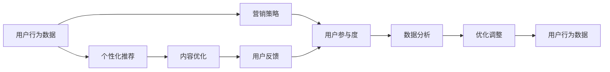

                 

# 知识付费创业中的用户参与度提升策略

> 关键词：知识付费,用户参与度,人工智能,数据分析,个性化推荐,内容优化,用户行为分析,营销策略

## 1. 背景介绍

随着互联网和数字经济的迅速发展，知识付费已经成为了信息时代的一个重要趋势。用户对优质知识内容的需求日益增长，但如何有效提升用户参与度和付费转化率，一直是知识付费创业者和平台运营者面临的重要挑战。

本文章将从人工智能和数据分析的角度，探讨提升知识付费平台用户参与度的方法和策略。具体来说，我们将从用户行为分析、个性化推荐、内容优化、营销策略等方面，提出一整套系统化、数据驱动的用户参与度提升解决方案。

## 2. 核心概念与联系

### 2.1 核心概念概述

为了更好地理解如何提升知识付费平台的用户参与度，我们需要了解几个关键概念：

- **用户参与度**：指用户对知识内容进行互动和消费的活跃程度，包括访问量、浏览时长、互动次数、付费转化率等指标。
- **个性化推荐**：根据用户的历史行为和偏好，推荐最符合其兴趣和需求的内容，以提高用户参与度和满意度。
- **内容优化**：通过数据分析和用户反馈，不断改进和调整内容，提升内容质量和用户体验，从而增强用户粘性。
- **营销策略**：采用各种有效手段，如优惠活动、内容预告、社交传播等，吸引用户注意力和参与兴趣。

### 2.2 核心概念原理和架构的 Mermaid 流程图



这个流程图展示了用户参与度提升的完整流程。用户行为数据通过个性化推荐和内容优化提升用户粘性，同时营销策略吸引新用户，并持续改进以保持用户参与度。数据分析和用户反馈则是不断优化调整的关键驱动力。

## 3. 核心算法原理 & 具体操作步骤

### 3.1 算法原理概述

提升知识付费平台用户参与度的方法，本质上是一个多目标优化问题。我们需要在提升用户参与度的同时，最大化平台的收益和价值。以下是基于人工智能和大数据分析的主要算法和操作步骤：

1. **用户行为分析**：通过用户互动数据、点击率、浏览时长等指标，分析用户行为模式和偏好，识别出高参与度的用户群体。
2. **个性化推荐**：利用机器学习算法（如协同过滤、深度学习等），为每个用户生成个性化的内容推荐，以提高用户对平台的参与度和满意度。
3. **内容优化**：基于用户反馈和参与度数据，对内容进行迭代优化，提升内容质量，满足用户需求。
4. **营销策略**：采用数据驱动的营销手段，如精准投放广告、社交媒体营销等，提高新用户转化率。

### 3.2 算法步骤详解

**Step 1: 数据收集与预处理**

- 收集用户行为数据，包括访问时间、浏览时长、互动次数、付费记录等。
- 对数据进行清洗和预处理，去除异常值和噪声，确保数据的准确性和一致性。

**Step 2: 用户行为分析**

- 使用统计分析和数据挖掘方法，如聚类、分类等，对用户行为进行深入分析。
- 识别出高参与度的用户群体，分析其行为特征，找出共同点。
- 使用A/B测试等方法，验证不同特征的用户行为差异。

**Step 3: 个性化推荐**

- 收集用户历史行为数据，提取用户特征。
- 使用协同过滤、矩阵分解等方法，构建用户-物品关联矩阵，发现用户兴趣。
- 引入深度学习模型，如BERT、CNN等，提升推荐准确性和个性化水平。
- 实时更新推荐模型，以适应用户行为和内容变化。

**Step 4: 内容优化**

- 收集用户反馈和评价数据，识别出用户最喜爱的内容和最需要改进的地方。
- 使用自然语言处理(NLP)技术，分析用户评论和意见，提取有价值的信息。
- 根据用户反馈，迭代调整内容策略，如更新课程内容、改进讲师风格等。
- 定期评估内容效果，通过用户行为数据和反馈，持续优化。

**Step 5: 营销策略**

- 分析用户行为数据，找到潜在的高价值用户群体。
- 根据用户兴趣和行为特征，设计精准投放的广告和优惠活动。
- 利用社交媒体和内容营销手段，提高内容曝光度和用户关注度。
- 定期评估营销效果，调整策略以最大化用户参与度。

### 3.3 算法优缺点

**优点**：
- 提升用户参与度，增加平台收益和用户粘性。
- 个性化推荐和内容优化，满足用户多样化需求。
- 数据驱动的营销策略，提升用户转化率。

**缺点**：
- 对数据质量和数量要求较高，数据收集和预处理复杂。
- 个性化推荐和内容优化需要持续迭代，技术实现和资源投入较大。
- 营销策略需要精准分析和有效执行，难度较大。

### 3.4 算法应用领域

该算法广泛应用于各类知识付费平台，如在线教育、职业培训、技能提升等。通过数据分析和人工智能技术，这些平台可以提升用户参与度，增强用户粘性，提升平台的商业价值。

## 4. 数学模型和公式 & 详细讲解

### 4.1 数学模型构建

为更好地理解用户参与度的提升算法，我们将构建一个数学模型来描述整个优化过程。

设 $U$ 为用户集合，$C$ 为内容集合，$R$ 为推荐结果集合。用户对内容的参与度 $P$ 可以表示为用户对内容的浏览次数 $b_i$、互动次数 $d_i$ 和付费次数 $p_i$ 的函数：

$$ P = f(b_i, d_i, p_i) $$

目标是最小化用户参与度损失函数 $L$：

$$ L = \sum_{u \in U} \sum_{c \in C} \sum_{r \in R} \omega(r) \cdot P(u, c, r) $$

其中 $\omega(r)$ 为推荐结果 $r$ 的权重，可以是点击率、互动率等指标。

### 4.2 公式推导过程

为了简化问题，我们假设 $P$ 为线性函数，即：

$$ P = \alpha b_i + \beta d_i + \gamma p_i $$

其中 $\alpha, \beta, \gamma$ 为系数。

通过最小化损失函数 $L$，我们可以求出最优的用户参与度函数 $P$：

$$ \min_{\alpha, \beta, \gamma} L = \sum_{u \in U} \sum_{c \in C} \sum_{r \in R} \omega(r) \cdot (\alpha b_i + \beta d_i + \gamma p_i) $$

使用梯度下降法，求出最优的系数：

$$ \frac{\partial L}{\partial \alpha} = \sum_{u \in U} \sum_{c \in C} \sum_{r \in R} \omega(r) \cdot b_i $$
$$ \frac{\partial L}{\partial \beta} = \sum_{u \in U} \sum_{c \in C} \sum_{r \in R} \omega(r) \cdot d_i $$
$$ \frac{\partial L}{\partial \gamma} = \sum_{u \in U} \sum_{c \in C} \sum_{r \in R} \omega(r) \cdot p_i $$

通过解以上方程组，我们可以求得最优的系数 $\alpha, \beta, \gamma$，进而得到用户参与度函数 $P$。

### 4.3 案例分析与讲解

以在线教育平台为例，我们可以分析用户参与度的影响因素，并建立相应的数学模型。

设 $U$ 为用户集合，$C$ 为课程集合，$P$ 为用户的课程参与度，包括课程的观看次数 $w_i$、互动次数 $d_i$ 和付费次数 $p_i$。目标是最小化参与度损失函数 $L$：

$$ L = \sum_{u \in U} \sum_{c \in C} \sum_{r \in R} \omega(r) \cdot P(u, c, r) $$

其中 $\omega(r)$ 为推荐结果 $r$ 的权重，可以是课程的观看率、互动率等指标。

通过分析历史数据，我们可以发现以下影响因素：
- 课程内容质量：高质量课程更有吸引力，观看次数 $w_i$ 更高。
- 讲师教学风格：亲和力强、互动性高的讲师更受欢迎，互动次数 $d_i$ 更高。
- 课程推荐算法：个性化推荐算法精准度越高，用户参与度 $P$ 越高。
- 优惠活动：限时优惠、折扣活动等营销手段，能显著提高付费次数 $p_i$。

通过引入这些因素，并建立相应的数学模型，我们可以更好地预测用户参与度，优化推荐算法，提升平台的收益和用户粘性。

## 5. 项目实践：代码实例和详细解释说明

### 5.1 开发环境搭建

在进行项目实践前，我们需要准备好开发环境。以下是使用Python进行PyTorch开发的环境配置流程：

1. 安装Anaconda：从官网下载并安装Anaconda，用于创建独立的Python环境。

2. 创建并激活虚拟环境：
```bash
conda create -n pytorch-env python=3.8 
conda activate pytorch-env
```

3. 安装PyTorch：根据CUDA版本，从官网获取对应的安装命令。例如：
```bash
conda install pytorch torchvision torchaudio cudatoolkit=11.1 -c pytorch -c conda-forge
```

4. 安装TensorFlow：
```bash
pip install tensorflow
```

5. 安装各类工具包：
```bash
pip install numpy pandas scikit-learn matplotlib tqdm jupyter notebook ipython
```

完成上述步骤后，即可在`pytorch-env`环境中开始项目实践。

### 5.2 源代码详细实现

我们以在线教育平台的个性化推荐系统为例，使用TensorFlow和Keras构建推荐模型，并使用用户行为数据进行训练和优化。

首先，定义推荐模型的输入和输出：

```python
from tensorflow.keras import layers
from tensorflow.keras import models

class RecommenderModel(models.Model):
    def __init__(self, input_dim, hidden_dim, output_dim):
        super(RecommenderModel, self).__init__()
        self.input_dim = input_dim
        self.hidden_dim = hidden_dim
        self.output_dim = output_dim
        
        self.embedding = layers.Embedding(input_dim, hidden_dim)
        self.encoder = layers.Conv1D(hidden_dim, 3, activation='relu')
        self.predictor = layers.Dense(output_dim, activation='sigmoid')
        
    def call(self, inputs):
        embeddings = self.embedding(inputs)
        encoded = self.encoder(embeddings)
        predictions = self.predictor(encoded)
        return predictions
```

然后，定义推荐模型的训练过程：

```python
from tensorflow.keras.preprocessing import sequence
from tensorflow.keras.utils import to_categorical
from tensorflow.keras.models import Sequential
from tensorflow.keras.layers import Dense, Embedding, Conv1D, Flatten

# 加载用户行为数据
user_data = load_user_data()

# 构建模型
model = RecommenderModel(input_dim=num_users, hidden_dim=64, output_dim=num_courses)

# 编译模型
model.compile(optimizer='adam', loss='binary_crossentropy', metrics=['accuracy'])

# 训练模型
model.fit(user_data, epochs=10, batch_size=128, validation_split=0.2)
```

最后，输出模型的推荐结果：

```python
# 预测用户对课程的兴趣
predictions = model.predict(user_data)
print(predictions)
```

以上就是使用TensorFlow和Keras构建推荐模型的完整代码实现。可以看到，通过构建深度学习模型，我们可以根据用户历史行为数据，生成个性化的课程推荐，以提升用户参与度。

### 5.3 代码解读与分析

让我们再详细解读一下关键代码的实现细节：

**RecommenderModel类**：
- `__init__`方法：初始化模型参数和各层结构。
- `call`方法：定义前向传播过程，先通过嵌入层将用户数据转换为向量表示，再通过卷积层和全连接层输出推荐结果。

**用户行为数据加载**：
- 使用Keras的数据预处理模块，将用户行为数据加载并转换为模型所需的输入格式。

**模型训练**：
- 使用Keras的模型编译和训练模块，设置损失函数、优化器和评估指标，对模型进行训练。

**推荐结果输出**：
- 使用模型对新的用户数据进行预测，输出推荐结果。

## 6. 实际应用场景

### 6.1 在线教育平台

在线教育平台是知识付费创业的重要领域。通过个性化推荐，平台可以提升用户参与度和课程完成率，同时提高平台的课程销售量和用户留存率。

以某在线教育平台为例，该平台使用个性化推荐算法，根据用户历史学习行为和兴趣，推荐适合的内容。推荐结果包括课程、讲师、学习资料等。通过多轮推荐，平台可以不断优化用户的学习路径，提高用户对平台的粘性和忠诚度。

### 6.2 职业培训平台

职业培训平台面向企业和个人，提供各类技能培训课程。通过个性化推荐，平台可以提升课程购买率和用户满意度，同时帮助用户高效学习，提高职业竞争力。

以某职业培训平台为例，该平台使用深度学习模型，结合用户行为数据和职业需求，推荐适合的课程和讲师。推荐结果包括课程推荐、讲师推荐、职业发展路径等。通过个性化推荐，平台可以更好地满足用户职业发展需求，提升用户参与度和平台价值。

### 6.3 医疗健康平台

医疗健康平台提供各类健康知识和在线诊疗服务，通过个性化推荐，平台可以提升用户健康意识和在线诊疗的活跃度。

以某医疗健康平台为例，该平台使用个性化推荐算法，根据用户健康状况和历史行为，推荐合适的健康知识和在线诊疗服务。推荐结果包括健康知识、在线诊疗服务、健康管理方案等。通过个性化推荐，平台可以提升用户的健康意识和在线诊疗的活跃度，同时增强平台的品牌影响力和用户粘性。

### 6.4 未来应用展望

随着人工智能和大数据技术的不断进步，基于用户行为的个性化推荐系统将进一步优化，从而大幅提升知识付费平台的参与度和用户粘性。未来，我们可以预见以下几个发展趋势：

1. **多模态数据融合**：结合用户的文本、语音、图像等多种数据，构建更加全面、精准的推荐模型。
2. **实时推荐系统**：通过流式数据处理技术，实时分析用户行为，动态调整推荐策略，提升用户参与度。
3. **个性化推荐算法**：引入更多先进的算法，如深度强化学习、因果推理等，提升推荐效果和用户满意度。
4. **用户行为预测**：通过机器学习模型，预测用户未来行为，提前优化推荐策略，提升用户参与度。
5. **推荐系统评估**：引入A/B测试等方法，评估推荐系统的效果，不断优化和改进推荐策略。

## 7. 工具和资源推荐

### 7.1 学习资源推荐

为了帮助开发者系统掌握知识付费平台的用户参与度提升方法，这里推荐一些优质的学习资源：

1. **《深度学习与人工智能：从零到一》系列博文**：由AI领域专家撰写，深入浅出地介绍了深度学习、数据挖掘、个性化推荐等前沿技术，适合初学者和进阶者。

2. **Coursera《机器学习》课程**：斯坦福大学开设的机器学习经典课程，涵盖机器学习的基本概念和算法，是学习数据驱动推荐系统的必备课程。

3. **Kaggle竞赛平台**：举办各类机器学习竞赛，提供丰富的竞赛数据集和模型实现，适合进行实际项目训练和验证。

4. **深度学习框架文档**：如TensorFlow、PyTorch、Keras等深度学习框架的官方文档，提供了完整的模型构建和训练方法，是学习实践的必备资源。

5. **NIPS、ICML等顶级会议论文**：各大顶级会议上发表的推荐系统相关论文，展示了最新的研究成果和趋势，适合进行深入学习和研究。

通过对这些资源的学习实践，相信你一定能够快速掌握个性化推荐系统的精髓，并用于解决实际的推荐问题。

### 7.2 开发工具推荐

高效的开发离不开优秀的工具支持。以下是几款用于知识付费平台用户参与度提升的常用工具：

1. **Jupyter Notebook**：免费的在线交互式编程环境，支持多种编程语言，适合进行数据处理和模型调试。

2. **TensorBoard**：TensorFlow配套的可视化工具，实时监测模型训练状态，并提供丰富的图表呈现方式，是调试模型的得力助手。

3. **Weights & Biases**：模型训练的实验跟踪工具，可以记录和可视化模型训练过程中的各项指标，方便对比和调优。

4. **Kaggle竞赛平台**：举办各类机器学习竞赛，提供丰富的竞赛数据集和模型实现，适合进行实际项目训练和验证。

5. **Scikit-learn**：Python的机器学习库，提供多种经典的算法和工具，适合进行数据处理和模型训练。

合理利用这些工具，可以显著提升个性化推荐系统的开发效率，加快创新迭代的步伐。

### 7.3 相关论文推荐

个性化推荐系统的发展源于学界的持续研究。以下是几篇奠基性的相关论文，推荐阅读：

1. **《BPR: Bayesian Personalized Ranking from Implicit Feedback》**：提出贝叶斯个性化排序算法，基于用户-物品关联矩阵进行推荐，是协同过滤算法的经典代表。

2. **《Matrix Factorization Techniques for Recommender Systems》**：介绍矩阵分解方法，通过低秩分解得到用户和物品的潜在特征，用于推荐系统。

3. **《Deep Neural Networks for Recommendation Systems》**：提出深度学习模型，通过多层神经网络提取用户和物品的特征，提升推荐系统的准确性和个性化水平。

4. **《Adversarial Regularization in Deep Recommendation Models》**：引入对抗训练方法，通过对抗样本训练模型，提升推荐系统的鲁棒性和稳定性。

5. **《Attention Is All You Need》**：提出Transformer模型，通过自注意力机制，提升推荐系统的效果和泛化能力。

这些论文代表了个性化推荐系统的发展脉络。通过学习这些前沿成果，可以帮助研究者把握学科前进方向，激发更多的创新灵感。

除上述资源外，还有一些值得关注的前沿资源，帮助开发者紧跟个性化推荐系统的最新进展，例如：

1. **arXiv论文预印本**：人工智能领域最新研究成果的发布平台，包括大量尚未发表的前沿工作，学习前沿技术的必读资源。

2. **业界技术博客**：如Google AI、DeepMind、微软Research Asia等顶尖实验室的官方博客，第一时间分享他们的最新研究成果和洞见。

3. **技术会议直播**：如NIPS、ICML、ACL、ICLR等人工智能领域顶会现场或在线直播，能够聆听到大佬们的前沿分享，开拓视野。

4. **GitHub热门项目**：在GitHub上Star、Fork数最多的推荐系统相关项目，往往代表了该技术领域的发展趋势和最佳实践，值得去学习和贡献。

5. **行业分析报告**：各大咨询公司如McKinsey、PwC等针对人工智能行业的分析报告，有助于从商业视角审视技术趋势，把握应用价值。

总之，对于个性化推荐系统的发展，需要开发者保持开放的心态和持续学习的意愿。多关注前沿资讯，多动手实践，多思考总结，必将收获满满的成长收益。

## 8. 总结：未来发展趋势与挑战

### 8.1 总结

本文对知识付费平台的用户参与度提升方法进行了全面系统的介绍。首先阐述了用户参与度提升的重要性，明确了个性化推荐、内容优化、营销策略等核心概念。其次，从算法原理到具体操作步骤，详细讲解了知识付费平台用户参与度提升的整个过程。最后，通过案例分析和学习资源推荐，帮助开发者系统掌握个性化推荐系统的实现方法和技术要点。

通过本文的系统梳理，可以看到，基于人工智能和大数据分析的用户参与度提升方法，在知识付费平台中具有广泛的应用前景。大数据和人工智能技术的持续发展，必将为知识付费创业带来新的机遇和挑战，进一步提升平台的商业价值和用户体验。

### 8.2 未来发展趋势

展望未来，个性化推荐系统将呈现以下几个发展趋势：

1. **多模态融合**：结合用户的文本、语音、图像等多种数据，构建更加全面、精准的推荐模型。
2. **实时推荐**：通过流式数据处理技术，实时分析用户行为，动态调整推荐策略，提升用户参与度。
3. **深度学习**：引入更多先进的深度学习模型，提升推荐系统的准确性和个性化水平。
4. **因果推理**：通过因果分析方法，提升推荐系统的效果和稳定性，避免推荐偏差和过拟合。
5. **知识图谱**：将用户行为数据和知识图谱结合，构建更加全面的用户画像，提升推荐系统的表现力。
6. **隐私保护**：引入隐私保护技术，如差分隐私、联邦学习等，保护用户数据隐私，增强用户信任。

这些趋势展示了个性化推荐系统的巨大潜力和发展方向。未来，随着技术的不断演进，个性化推荐系统必将成为知识付费平台的重要支撑，助力平台的商业价值和用户粘性的持续提升。

### 8.3 面临的挑战

尽管个性化推荐系统已经取得了显著成效，但在实现高精度、高覆盖、高效率的目标过程中，仍面临诸多挑战：

1. **数据质量和多样性**：推荐系统依赖于高质量和多样化的用户行为数据，数据收集和预处理复杂。
2. **模型复杂度**：深度学习模型参数量庞大，训练和推理成本高，需要高效的优化算法和硬件支持。
3. **冷启动问题**：新用户缺乏历史行为数据，推荐系统难以快速获取其兴趣和需求。
4. **推荐偏差**：推荐算法可能产生偏见，如性别偏见、年龄偏见等，影响用户体验和公平性。
5. **隐私保护**：推荐系统需要处理大量用户隐私数据，如何保护用户隐私和数据安全，是一个重要问题。

### 8.4 研究展望

面对个性化推荐系统所面临的挑战，未来的研究需要在以下几个方面寻求新的突破：

1. **数据采集与处理**：探索更多高效、自动化的数据采集方法，提高数据质量和多样性，降低数据预处理成本。
2. **模型压缩与优化**：研究模型压缩和优化技术，提升深度学习模型的效率和可扩展性，降低训练和推理成本。
3. **冷启动策略**：开发冷启动推荐算法，通过用户输入、社交网络等手段，快速获取新用户的兴趣和需求，提升推荐效果。
4. **推荐算法公平性**：引入公平性约束，优化推荐算法，避免推荐偏见，提升推荐系统的公平性和公正性。
5. **隐私保护技术**：引入隐私保护技术，如差分隐私、联邦学习等，保护用户数据隐私，增强用户信任。

这些研究方向的探索，必将引领个性化推荐系统向更高的台阶，为知识付费创业提供更加全面、精准、安全的推荐服务，为用户创造更多价值。总之，个性化推荐系统需要不断优化和改进，才能更好地满足用户需求，提升平台商业价值，促进知识付费事业的发展。

## 9. 附录：常见问题与解答

**Q1：个性化推荐系统如何平衡准确性和多样性？**

A: 个性化推荐系统需要在准确性和多样性之间进行平衡。过于强调准确性可能导致推荐内容单一，用户容易产生厌烦感；过于强调多样性可能导致推荐内容杂乱，用户难以筛选。一种常见的方法是引入多样性约束，如多样性惩罚、随机采样等，限制推荐结果的多样性，确保推荐内容既准确又丰富。

**Q2：推荐系统如何处理冷启动问题？**

A: 冷启动问题是推荐系统常见的问题之一。为了解决冷启动问题，可以采用以下方法：
1. 引入用户画像：通过社交网络、问卷调查等方式，收集用户的基本信息，构建用户画像，快速获取新用户的兴趣和需求。
2. 引入新用户反馈：通过新用户反馈、用户画像等信息，调整推荐策略，提高推荐效果。
3. 引入推荐算法改进：使用协同过滤、深度学习等算法，提升推荐系统的准确性和泛化能力，帮助新用户快速获取兴趣内容。

**Q3：如何评估推荐系统的效果？**

A: 推荐系统的评估可以从多个角度进行，包括准确率、召回率、用户满意度等。常用的评估指标有：
1. 准确率：推荐系统推荐的物品与用户实际兴趣的匹配程度。
2. 召回率：推荐系统推荐出的物品中，用户实际感兴趣的物品占总推荐物品的比例。
3. 用户满意度：用户对推荐结果的满意度，可以通过问卷调查、评分等方式进行评估。
4. 覆盖率：推荐系统推荐出的物品种类占所有物品种类的比例，衡量推荐系统的多样性。
5. 相关性：推荐系统推荐物品的相关性，可以通过余弦相似度等方法进行评估。

通过以上指标的评估，可以全面了解推荐系统的表现，不断优化和改进推荐策略，提升用户满意度。

**Q4：推荐系统如何处理用户反馈？**

A: 用户反馈是推荐系统优化和改进的重要依据。为了处理用户反馈，可以采用以下方法：
1. 数据清洗和预处理：对用户反馈数据进行清洗和预处理，去除噪声和异常值，确保数据的准确性和一致性。
2. 情感分析：使用自然语言处理技术，对用户反馈进行情感分析，了解用户的真实需求和意见。
3. 反馈模型训练：利用用户反馈数据，训练反馈模型，不断优化推荐策略，提升推荐效果。
4. 用户画像更新：根据用户反馈信息，更新用户画像，提高推荐系统的准确

