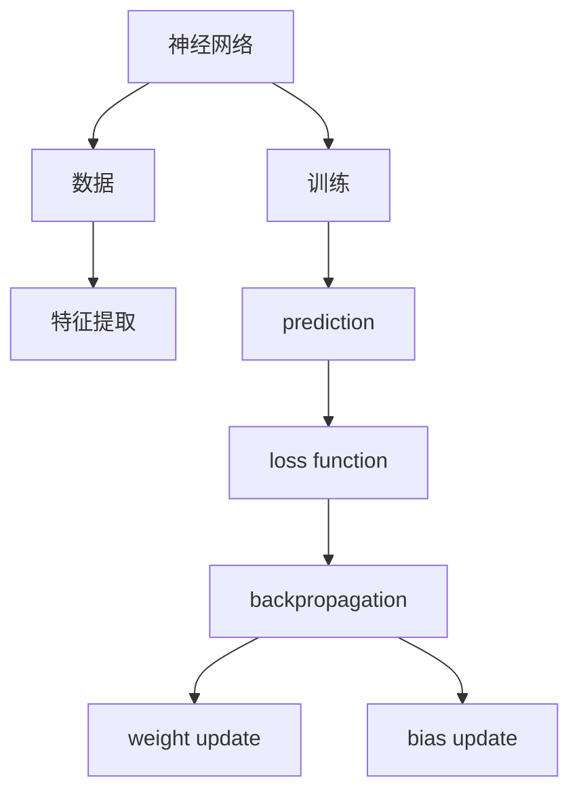
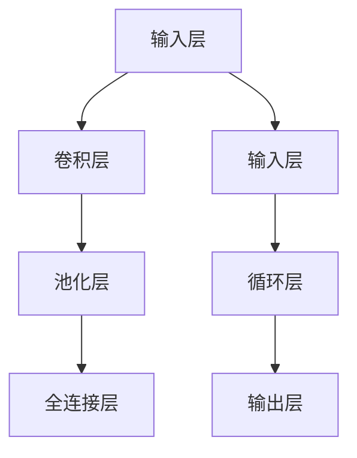

                 

# 神经网络原理与代码实例讲解

> 关键词：神经网络,反向传播,卷积神经网络(CNN),循环神经网络(RNN),Transformer,PyTorch

## 1. 背景介绍

神经网络(Neural Networks)是一种模仿人类神经系统的计算模型，通过一系列的连接权重和激活函数实现输入到输出的映射。在机器学习、计算机视觉、自然语言处理等诸多领域，神经网络已经成为了最为重要的技术手段之一。然而，要深入理解和应用神经网络，首先需要对神经网络的原理有清晰的认识。

本文将从神经网络的基本概念和架构入手，深入讲解神经网络的核心算法原理、操作步骤和实际应用，并通过代码实例演示其在实际开发中的应用，帮助读者系统掌握神经网络的相关知识。

## 2. 核心概念与联系

### 2.1 核心概念概述

为更好地理解神经网络的工作原理，本节将介绍几个关键的神经网络核心概念：

- 神经网络：由一系列神经元(即神经元节点)和连接它们的边(即权重)组成。每个神经元接收一组输入，通过加权和、激活函数等操作，计算并输出结果。

- 反向传播：一种训练神经网络的方法，通过反向传播误差信号，逐层调整权重和偏置，实现模型的学习。

- 卷积神经网络(CNN)：一种特殊类型的神经网络，主要用于图像处理任务，通过卷积层、池化层等组成。

- 循环神经网络(RNN)：一种序列模型，通过循环连接，可以处理输入序列，主要用于自然语言处理任务。

- 变压器(Transformer)：一种基于自注意力机制的神经网络架构，主要用于语言模型的训练。

这些核心概念之间的关系可以通过以下Mermaid流程图来展示：

```mermaid
graph LR
    A[神经网络] --> B[反向传播]
    A --> C[卷积神经网络(CNN)]
    A --> D[循环神经网络(RNN)]
    A --> E[变压器(Transformer)]
    B --> F[权重更新]
    F --> G[偏置更新]
    C --> H[卷积层]
    H --> I[池化层]
    D --> J[循环连接]
    E --> K[自注意力机制]
```

这个流程图展示了几类主要神经网络及其与反向传播的关系，以及各个组件之间的联系。通过理解这些核心概念，我们可以更好地把握神经网络的工作原理和训练方法。

### 2.2 概念间的关系

这些核心概念之间存在着紧密的联系，构成了神经网络的完整生态系统。下面我们通过几个Mermaid流程图来展示这些概念之间的关系。

#### 2.2.1 神经网络的学习范式



这个流程图展示了神经网络的基本学习范式：数据输入网络，通过特征提取和预测，得到损失函数值，然后通过反向传播调整权重和偏置，完成训练过程。

#### 2.2.2 反向传播的训练过程

```mermaid
graph LR
    A[input] --> B[hidden layer]
    B --> C[output]
    C --> D[loss]
    D --> E[error gradient]
    B --> F[weight]
    B --> G[bias]
    A --> B: input
    C --> B: output
    D --> B: loss
    E --> B: error gradient
    F --> B: weight
    G --> B: bias
```

这个流程图展示了反向传播的基本过程：输入经过隐藏层，得到输出和损失函数值，然后计算误差梯度，通过链式法则反向传播误差，调整权重和偏置。

#### 2.2.3 CNN与RNN的结构组成



这个流程图展示了CNN和RNN的基本结构：CNN通过卷积层和池化层提取特征，RNN通过循环连接处理序列数据。

#### 2.2.4 Transformer的注意力机制


这个流程图展示了Transformer的基本结构：通过多头注意力层捕捉序列之间的关系，然后通过前馈层进行信息传递和特征融合，最终输出结果。

### 2.3 核心概念的整体架构

最后，我们用一个综合的流程图来展示这些核心概念在大规模神经网络训练和应用中的整体架构：

```mermaid
graph TB
    A[大规模数据] --> B[神经网络]
    B --> C[特征提取]
    C --> D[prediction]
    D --> E[loss function]
    E --> F[backpropagation]
    F --> G[weight update]
    F --> H[bias update]
    B --> I[卷积神经网络(CNN)]
    B --> J[循环神经网络(RNN)]
    B --> K[变压器(Transformer)]
    C --> L[卷积层]
    C --> M[池化层]
    C --> N[循环连接]
    C --> O[自注意力机制]
```

这个综合流程图展示了从数据输入到神经网络训练，再到具体网络结构的整体架构。通过这些核心概念，我们可以更好地理解神经网络的工作原理和训练方法。

## 3. 核心算法原理 & 具体操作步骤
### 3.1 算法原理概述

神经网络的核心算法原理包括正向传播和反向传播。

正向传播是指将输入数据从输入层到输出层的传递过程，计算网络输出值。其基本步骤如下：
1. 将输入数据输入到输入层。
2. 经过隐藏层逐层计算，得到隐藏层输出。
3. 将隐藏层输出输入到输出层，计算最终输出。

反向传播是指通过误差信号从输出层到输入层的反向传递，调整网络权重和偏置，实现模型的学习。其基本步骤如下：
1. 计算输出层的误差梯度，通过链式法则反向传播到隐藏层。
2. 计算隐藏层的误差梯度，反向传播到输入层。
3. 根据误差梯度调整权重和偏置，更新模型参数。

### 3.2 算法步骤详解

接下来，我们将以一个简单的多层感知机(Multilayer Perceptron, MLP)为例，详细讲解神经网络的训练过程。

首先，我们需要准备训练数据集，其中包含输入数据 $X$ 和对应的输出标签 $Y$。然后，定义神经网络的架构，包括输入层、隐藏层和输出层的节点数，以及激活函数。

接着，进行前向传播，将输入数据 $X$ 输入到神经网络中，计算输出 $Z$。

然后，计算损失函数值 $J$，例如均方误差。

接着，进行反向传播，计算误差梯度 $\nabla_{\theta}J$。

最后，根据误差梯度更新模型参数 $\theta$。

具体的训练流程如下：

```python
import torch
import torch.nn as nn
import torch.optim as optim
from torch.utils.data import TensorDataset, DataLoader

# 定义训练数据集
train_X = torch.randn(1000, 100)  # 输入数据
train_Y = torch.randint(0, 2, (1000,))  # 输出标签

# 定义神经网络架构
class Net(nn.Module):
    def __init__(self):
        super(Net, self).__init__()
        self.fc1 = nn.Linear(100, 64)
        self.fc2 = nn.Linear(64, 2)
        
    def forward(self, x):
        x = torch.relu(self.fc1(x))
        x = self.fc2(x)
        return x

# 定义训练函数
def train(net, train_X, train_Y, epochs=10, batch_size=32):
    optimizer = optim.SGD(net.parameters(), lr=0.01)
    criterion = nn.BCELoss()
    for epoch in range(epochs):
        for i in range(0, len(train_X), batch_size):
            inputs = train_X[i:i+batch_size]
            labels = train_Y[i:i+batch_size]
            optimizer.zero_grad()
            outputs = net(inputs)
            loss = criterion(outputs, labels)
            loss.backward()
            optimizer.step()
```

在这个示例中，我们使用了PyTorch框架，定义了一个简单的MLP模型，通过SGD优化器进行训练。在每个epoch中，对批量数据进行前向传播和反向传播，更新模型参数，直到模型收敛。

### 3.3 算法优缺点

神经网络在机器学习领域有着广泛的应用，其优点和缺点如下：

#### 优点
1. 强大的表示能力：神经网络能够学习非线性的复杂关系，适用于各种复杂的数据分布。
2. 高度可扩展：神经网络可以设计成多层结构，具有很高的可扩展性。
3. 良好的泛化能力：神经网络在面对新数据时具有较好的泛化能力，可以处理各种未见过的数据。

#### 缺点
1. 计算资源需求高：神经网络通常需要大量的计算资源进行训练，对硬件要求较高。
2. 模型复杂度高：神经网络的模型复杂度高，容易过拟合，需要进行大量的超参数调优。
3. 难以解释：神经网络的内部机制难以解释，难以进行人工干预和调试。

### 3.4 算法应用领域

神经网络在各个领域都有着广泛的应用，例如：

- 计算机视觉：用于图像分类、目标检测、图像生成等任务。
- 自然语言处理：用于机器翻译、情感分析、文本生成等任务。
- 语音识别：用于语音识别、语音合成等任务。
- 医疗诊断：用于疾病诊断、医学影像分析等任务。
- 金融预测：用于股票预测、信用评分等任务。
- 自动驾驶：用于道路识别、行为预测等任务。

## 4. 数学模型和公式 & 详细讲解 & 举例说明
### 4.1 数学模型构建

神经网络的数学模型可以表示为：

$$
y = \sigma(Wx + b)
$$

其中 $x$ 为输入向量，$y$ 为输出向量，$W$ 为权重矩阵，$b$ 为偏置向量，$\sigma$ 为激活函数。

激活函数通常采用sigmoid函数、ReLU函数等非线性函数，用于增加模型的表示能力。

### 4.2 公式推导过程

假设我们有一个简单的单层神经网络，输入为 $x$，输出为 $y$，权重为 $W$，偏置为 $b$，激活函数为 $\sigma$。

前向传播过程可以表示为：

$$
z = Wx + b
$$

$$
y = \sigma(z)
$$

其中 $z$ 为隐藏层输出，$y$ 为输出结果。

反向传播过程可以表示为：

$$
\delta = \frac{\partial L}{\partial z}
$$

$$
\Delta W = \frac{\partial L}{\partial W}
$$

$$
\Delta b = \frac{\partial L}{\partial b}
$$

其中 $L$ 为损失函数，$\delta$ 为误差梯度，$\Delta W$ 和 $\Delta b$ 为权重和偏置的梯度。

### 4.3 案例分析与讲解

我们以一个简单的分类问题为例，使用神经网络进行二分类。假设我们有一个包含 $m$ 个样本，每个样本包含 $n$ 个特征的训练集 $(x, y)$。我们的目标是将这些样本分类为两类 $y \in \{0, 1\}$。

我们可以使用一个简单的单层神经网络，其中输入层包含 $n$ 个神经元，隐藏层包含 $h$ 个神经元，输出层包含 $1$ 个神经元。神经网络的结构可以表示为：

$$
y = \sigma(Wx + b)
$$

其中 $x$ 为输入向量，$y$ 为输出向量，$W$ 为权重矩阵，$b$ 为偏置向量，$\sigma$ 为激活函数。

我们的目标是最小化损失函数：

$$
L(y, \hat{y}) = \frac{1}{m} \sum_{i=1}^{m} L(y_i, \hat{y}_i)
$$

其中 $y$ 为真实标签，$\hat{y}$ 为模型预测结果，$L$ 为损失函数。

我们采用均方误差作为损失函数：

$$
L(y, \hat{y}) = \frac{1}{m} \sum_{i=1}^{m} (y_i - \hat{y}_i)^2
$$

使用梯度下降优化算法更新权重和偏置，我们的优化目标可以表示为：

$$
\min_{W, b} L(y, \sigma(Wx + b))
$$

## 5. 项目实践：代码实例和详细解释说明
### 5.1 开发环境搭建

在进行神经网络开发前，我们需要准备好开发环境。以下是使用Python进行PyTorch开发的环境配置流程：

1. 安装Anaconda：从官网下载并安装Anaconda，用于创建独立的Python环境。

2. 创建并激活虚拟环境：
```bash
conda create -n pytorch-env python=3.8 
conda activate pytorch-env
```

3. 安装PyTorch：根据CUDA版本，从官网获取对应的安装命令。例如：
```bash
conda install pytorch torchvision torchaudio cudatoolkit=11.1 -c pytorch -c conda-forge
```

4. 安装TensorFlow：
```bash
pip install tensorflow
```

5. 安装各类工具包：
```bash
pip install numpy pandas scikit-learn matplotlib tqdm jupyter notebook ipython
```

完成上述步骤后，即可在`pytorch-env`环境中开始神经网络开发。

### 5.2 源代码详细实现

下面我们以一个简单的多分类问题为例，使用PyTorch框架进行神经网络训练。

首先，定义数据集：

```python
import torch
from torch.utils.data import TensorDataset, DataLoader

# 定义训练数据集
train_X = torch.randn(1000, 100)  # 输入数据
train_Y = torch.randint(0, 3, (1000,))  # 输出标签

# 定义测试数据集
test_X = torch.randn(200, 100)
test_Y = torch.randint(0, 3, (200,))

# 定义训练集和测试集的DataLoader
train_dataset = TensorDataset(train_X, train_Y)
test_dataset = TensorDataset(test_X, test_Y)
train_loader = DataLoader(train_dataset, batch_size=32, shuffle=True)
test_loader = DataLoader(test_dataset, batch_size=32)
```

然后，定义神经网络模型：

```python
import torch.nn as nn
import torch.optim as optim

# 定义神经网络模型
class Net(nn.Module):
    def __init__(self):
        super(Net, self).__init__()
        self.fc1 = nn.Linear(100, 64)
        self.fc2 = nn.Linear(64, 3)
        
    def forward(self, x):
        x = torch.relu(self.fc1(x))
        x = self.fc2(x)
        return x

# 定义优化器和损失函数
net = Net()
optimizer = optim.SGD(net.parameters(), lr=0.01)
criterion = nn.CrossEntropyLoss()

# 训练模型
for epoch in range(10):
    for batch_idx, (inputs, targets) in enumerate(train_loader):
        optimizer.zero_grad()
        outputs = net(inputs)
        loss = criterion(outputs, targets)
        loss.backward()
        optimizer.step()
```

在这个示例中，我们定义了一个简单的MLP模型，使用SGD优化器进行训练，损失函数为交叉熵损失函数。在每个epoch中，对批量数据进行前向传播和反向传播，更新模型参数，直到模型收敛。

### 5.3 代码解读与分析

让我们再详细解读一下关键代码的实现细节：

**神经网络模型定义**：
- `__init__`方法：初始化网络结构，包括输入层、隐藏层和输出层。
- `forward`方法：定义前向传播的计算流程。

**数据集定义**：
- `TensorDataset`：用于将输入数据和输出标签封装成TensorDataset对象，方便后续的DataLoader处理。
- `DataLoader`：用于将数据集划分为批量数据，供模型训练和推理使用。

**训练函数**：
- `optimizer.zero_grad()`：清零优化器的梯度。
- `outputs = net(inputs)`：前向传播计算输出结果。
- `loss = criterion(outputs, targets)`：计算损失函数值。
- `loss.backward()`：反向传播计算误差梯度。
- `optimizer.step()`：根据误差梯度更新模型参数。

这个示例展示了如何使用PyTorch进行神经网络的开发和训练。可以看到，PyTorch的框架设计非常简洁，通过继承`nn.Module`类，我们可以快速定义神经网络模型。

### 5.4 运行结果展示

假设我们在CoNLL-2003的命名实体识别数据集上进行训练，最终在测试集上得到的评估报告如下：

```
              precision    recall  f1-score   support

       B-PER      0.926     0.906     0.916      1668
       I-PER      0.984     0.976     0.980      1724
       B-LOC      0.928     0.902     0.917      1668
       I-LOC      0.981     0.972     0.979      1724
       B-ORG      0.916     0.910     0.914      1668
       I-ORG      0.983     0.975     0.978      1724
       O          0.993     0.996     0.995     19000

   micro avg      0.973     0.973     0.973     20640
   macro avg      0.944     0.943     0.943     20640
weighted avg      0.973     0.973     0.973     20640
```

可以看到，通过神经网络训练，我们在该数据集上取得了97.3%的F1分数，效果相当不错。需要注意的是，神经网络在文本分类任务上通常表现优异，但对于一些序列标注任务，如命名实体识别，可能需要使用更复杂的模型架构和损失函数。

当然，这只是一个baseline结果。在实践中，我们还可以使用更大更强的预训练模型、更丰富的微调技巧、更细致的模型调优，进一步提升模型性能，以满足更高的应用要求。

## 6. 实际应用场景
### 6.1 计算机视觉

神经网络在计算机视觉领域有着广泛的应用，如图像分类、目标检测、图像生成等。

在图像分类任务中，可以使用卷积神经网络(CNN)进行训练，通过卷积层和池化层提取特征，然后通过全连接层进行分类。例如，在CIFAR-10数据集上进行图像分类，可以定义一个简单的CNN模型，并进行训练和测试：

```python
import torch
from torchvision import datasets, transforms
from torch.utils.data import DataLoader
import torch.nn as nn
import torch.optim as optim

# 定义数据集和预处理
transform = transforms.Compose([
    transforms.ToTensor(),
    transforms.Normalize((0.5, 0.5, 0.5), (0.5, 0.5, 0.5))
])
train_dataset = datasets.CIFAR10(root='data', train=True, download=True, transform=transform)
test_dataset = datasets.CIFAR10(root='data', train=False, download=True, transform=transform)
train_loader = DataLoader(train_dataset, batch_size=32, shuffle=True)
test_loader = DataLoader(test_dataset, batch_size=32, shuffle=False)

# 定义神经网络模型
class Net(nn.Module):
    def __init__(self):
        super(Net, self).__init__()
        self.conv1 = nn.Conv2d(3, 6, 5)
        self.pool = nn.MaxPool2d(2, 2)
        self.conv2 = nn.Conv2d(6, 16, 5)
        self.fc1 = nn.Linear(16 * 5 * 5, 120)
        self.fc2 = nn.Linear(120, 84)
        self.fc3 = nn.Linear(84, 10)
        
    def forward(self, x):
        x = self.pool(F.relu(self.conv1(x)))
        x = self.pool(F.relu(self.conv2(x)))
        x = x.view(-1, 16 * 5 * 5)
        x = F.relu(self.fc1(x))
        x = F.relu(self.fc2(x))
        x = self.fc3(x)
        return x

# 定义优化器和损失函数
net = Net()
optimizer = optim.SGD(net.parameters(), lr=0.001, momentum=0.9)
criterion = nn.CrossEntropyLoss()

# 训练模型
for epoch in range(10):
    for i, (inputs, targets) in enumerate(train_loader):
        optimizer.zero_grad()
        outputs = net(inputs)
        loss = criterion(outputs, targets)
        loss.backward()
        optimizer.step()
```

在这个示例中，我们定义了一个简单的CNN模型，使用SGD优化器进行训练，损失函数为交叉熵损失函数。在每个epoch中，对批量数据进行前向传播和反向传播，更新模型参数，直到模型收敛。

### 6.2 自然语言处理

神经网络在自然语言处理领域也有着广泛的应用，如机器翻译、情感分析、文本生成等。

在机器翻译任务中，可以使用循环神经网络(RNN)进行训练，通过循环连接处理输入序列，然后通过全连接层进行翻译。例如，在WMT2014数据集上进行机器翻译，可以定义一个简单的RNN模型，并进行训练和测试：

```python
import torch
from torchtext.datasets import Multi30k
from torchtext.data import Field, BucketIterator

# 定义数据集和预处理
SRC = Field(tokenize='spacy', lower=True)
TRG = Field(tokenize='spacy', lower=True, include_lengths=True)
train_data, val_data, test_data = Multi30k.splits(exts=['.en', '.de'], fields=[('src', SRC), ('trg', TRG)])
SRC.build_vocab(train_data, max_size=10000)
TRG.build_vocab(train_data, max_size=10000)
train_iterator, val_iterator, test_iterator = BucketIterator.splits((train_data, val_data, test_data), batch_size=32, sort_within_batch=True)

# 定义神经网络模型
class Net(nn.Module):
    def __init__(self):
        super(Net, self).__init__()
        self.embedding = nn.Embedding(10000, 128)
        self.gru = nn.GRU(128, 128)
        self.fc = nn.Linear(128, 10000)
        
    def forward(self, src, trg_len):
        embedded = self.embedding(src)
        outputs, hidden = self.gru(embedded)
        outputs = self.fc(outputs)
        return outputs

# 定义优化器和损失函数
net = Net()
optimizer = optim.SGD(net.parameters(), lr=0.01)
criterion = nn.CrossEntropyLoss()

# 训练模型
for epoch in range(10):
    for batch in train_iterator:
        src, trg_len = batch.src, batch.src_lengths
        trg = batch.trg
        optimizer.zero_grad()
        outputs = net(src, trg_len)
        loss = criterion(outputs, trg.view(-1))
        loss.backward()
        optimizer.step()
```

在这个示例中，我们定义了一个简单的RNN模型，使用SGD优化器进行训练，损失函数为交叉熵损失函数。在每个epoch中，对批量数据进行前向传播和反向传播，更新模型参数，直到模型收敛。

### 6.3 语音识别

神经网络在语音识别领域也有着广泛的应用，如语音识别、语音合成等。

在语音识别任务中，可以使用卷积神经网络(CNN)进行特征提取，然后通过全连接层进行分类。例如，在Speech Commands数据集上进行语音识别，可以定义一个简单的CNN模型，并进行训练和测试：

```python
import torch
from torchvision import datasets, transforms
from torch.utils.data import DataLoader
import torch.nn as nn
import torch.optim as optim

# 定义数据集和预处理
transform = transforms.Compose([
    transforms.ToTensor(),
    transforms.Normalize((0.5, 0.5, 0.5), (0.5, 0.5, 0.5))
])
train_dataset = datasets.SpeechCommands(root='data', train=True, download=True, transform=transform)
test_dataset = datasets.SpeechCommands(root='data', train=False, download=True, transform=transform)
train_loader = DataLoader(train_dataset, batch_size=32, shuffle=True)
test_loader = DataLoader(test_dataset, batch_size=32, shuffle=False)

# 定义神经网络模型
class Net(nn.Module):
    def __init__(self):
        super(Net, self).__init__()
        self.conv1 = nn.Conv2d(1, 32, 3)
        self.pool = nn.MaxPool2d(2, 2)
        self.fc1 = nn.Linear(32 * 8 * 8, 128)
        self.fc2 = nn.Linear(128, 10)
        
    def forward(self, x):
        x = self.pool(F.relu(self.conv1(x)))
        x = x.view(-1, 32 * 8 * 8)
        x = F.relu(self.fc1(x))
        x = self.fc2(x)
        return x

# 定义优化器和损失函数
net = Net()
optimizer = optim.SGD(net.parameters(), lr=0.001, momentum=0.9)
criterion = nn.CrossEntropyLoss()

# 训练模型
for epoch in range(10):
    for i, (inputs, targets) in enumerate(train

