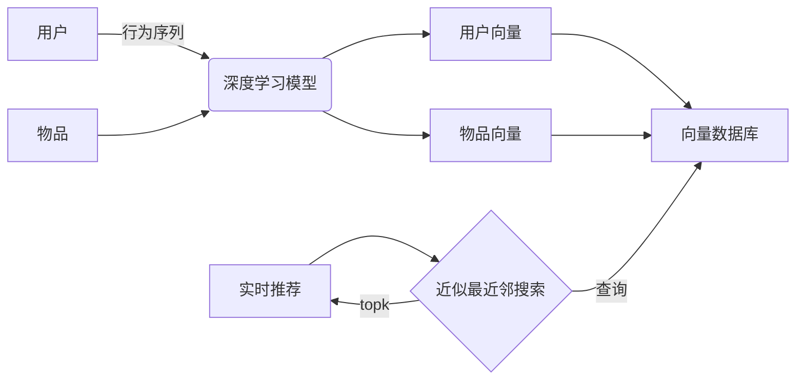

# AI向量数据库在实时推荐系统中的应用

关键词：AI、向量数据库、实时推荐系统、深度学习、相似度搜索

## 1. 背景介绍
### 1.1  问题的由来
在当今信息爆炸的时代,人们面临着海量的信息和选择。如何从茫茫多的选项中找到自己感兴趣和需要的内容,成为了一个亟待解决的问题。推荐系统应运而生,其目的就是根据用户的历史行为和偏好,自动为其推荐可能感兴趣的物品,从而提升用户的使用体验和满意度。

### 1.2  研究现状
传统的推荐系统大多基于协同过滤和矩阵分解等算法,存在数据稀疏、冷启动等问题。近年来,随着深度学习的发展,基于深度神经网络的推荐模型不断涌现,在表征学习、序列建模等方面取得了很大进展。然而,面对海量用户和物品,推荐系统的实时响应也提出了更高的要求。

### 1.3  研究意义
向量数据库是一种高效的相似度搜索引擎,通过将数据对象表示为高维向量,并使用近似最近邻搜索算法,实现毫秒级的相似度查询。将向量数据库与深度学习推荐模型相结合,可以显著提升推荐系统的实时性能,同时保证较高的推荐质量。这对于需要实时推荐的场景,如新闻推荐、广告投放等具有重要意义。

### 1.4  本文结构
本文将围绕AI向量数据库在实时推荐系统中的应用展开,内容组织如下:第2部分介绍相关的核心概念;第3部分阐述核心算法原理和步骤;第4部分给出数学模型和公式推导;第5部分提供项目实践的代码实例;第6部分分析实际应用场景;第7部分推荐相关工具和资源;第8部分总结全文并展望未来;第9部分列举常见问题解答。

## 2. 核心概念与联系
- 推荐系统:根据用户的历史行为和兴趣偏好,自动推荐用户可能感兴趣的信息、商品或服务的系统。
- 深度学习:一种基于多层神经网络的机器学习方法,能够学习数据的层次化特征表示。
- 表征学习:通过机器学习方法将原始数据映射到低维稠密向量的过程,向量捕捉了数据的语义信息。
- 向量数据库:一种支持高维向量存储、索引和快速相似度搜索的数据库系统。
- 近似最近邻搜索:在高维空间中寻找与查询向量最相似的K个向量的算法,通过牺牲少量准确率换取大幅的性能提升。

其联系如下:深度学习模型学习用户和物品的低维向量表示,向量数据库对其进行存储和索引,实时推荐时使用ANN在海量向量中高效查询与用户最相似的物品向量。



## 3. 核心算法原理 & 具体操作步骤
### 3.1  算法原理概述
使用深度学习和向量数据库构建实时推荐系统的核心算法原理可概括为两大步骤:
1. 离线建模:使用深度神经网络学习用户和物品的低维向量表示,并将其存入向量数据库。常见的模型包括双塔模型、DeepFM等。
2. 在线查询:实时推荐时,将用户的最新行为编码为向量,在向量数据库中查询与之最相似的topk个物品向量,即为推荐结果。

### 3.2  算法步骤详解
离线建模阶段:
1. 构建用户和物品的特征,包括ID、类别、文本、图像等特征。
2. 设计双塔神经网络分别学习用户和物品的向量表示,损失函数为两者的内积或余弦相似度。
3. 训练模型至收敛,提取所有用户和物品的embedding向量。
4. 将向量导入向量数据库,建立索引。

在线查询阶段:
1. 接收用户最新的行为,如浏览、点击等。
2. 使用用户塔将其encode为用户向量q。
3. 使用向量数据库的ANN接口,在物品向量集中查询与q最相似的topk个物品。
4. 返回topk物品作为推荐结果。

### 3.3  算法优缺点
优点:
- 实时性高,秒级响应用户请求。
- 推荐质量好,充分利用了用户行为序列信息。
- 灵活性强,物品库更新时只需增量建立索引。

缺点:
- 离线训练耗时长,需要大量计算资源。
- 模型设计需要经验,如塔的结构、损失函数等。
- 向量数据库的选型和调优有难度。

### 3.4  算法应用领域
双塔模型+向量数据库广泛应用于各类实时推荐场景:
- 新闻推荐:根据用户的历史浏览和实时兴趣推荐新闻文章。
- 短视频推荐:抓取用户的观看行为序列,实时推荐下一个短视频。
- 广告投放:学习用户的广告偏好,实时竞价推荐相关广告。
- 电商推荐:基于用户购买、加购等行为,实时推荐可能购买的商品。

## 4. 数学模型和公式 & 详细讲解 & 举例说明
### 4.1  数学模型构建
考虑用户集合$U$和物品集合$I$,用户$u$和物品$i$的特征分别为$x_u$和$x_i$。双塔模型学习两个映射函数$f(·)$和$g(·)$,将原始高维特征映射为d维向量:

$$
\begin{aligned}
\mathbf{u} &= f(x_u) \in \mathbb{R}^d \
\mathbf{i} &= g(x_i) \in \mathbb{R}^d
\end{aligned}
$$

用户$u$对物品$i$的偏好分数定义为两个向量的内积:

$$
\hat{y}(u,i) = \mathbf{u}^T \mathbf{i}
$$

模型的目标是最小化真实偏好$y(u,i)$与预测偏好$\hat{y}(u,i)$的差异,损失函数可使用交叉熵或平方损失:

$$
\mathcal{L} = \sum_{(u,i) \in \mathcal{D}} l(y(u,i), \hat{y}(u,i))
$$

其中$\mathcal{D}$为训练集,包含用户-物品交互对$(u,i)$。

### 4.2  公式推导过程
模型的训练过程即求解参数$\theta$以最小化损失函数$\mathcal{L}$:

$$
\theta^* = \arg\min_\theta \mathcal{L}(\theta)
$$

其中$\theta$包括两个塔$f(·)$和$g(·)$的权重。求解通常使用随机梯度下降法及其变种,对每个正样本$(u,i)$,随机采样一个负样本$i'$,计算损失:

$$
l(u,i,i') = -\log \sigma(\hat{y}(u,i)) - \log(1-\sigma(\hat{y}(u,i')))
$$

其中$\sigma(·)$为sigmoid函数。然后计算梯度并更新参数:

$$
\theta \leftarrow \theta - \eta · \nabla_\theta l(u,i,i')
$$

$\eta$为学习率。重复以上步骤直到模型收敛。

### 4.3  案例分析与讲解
以新闻推荐为例,假设有以下用户浏览历史记录:

| 用户ID | 浏览新闻 |
|-------|---------|
| 001   | A, B, D |
| 002   | C, D, E |
| 003   | A, E, F |

首先将用户和新闻的原始特征(如ID、类别、标题等)输入双塔模型,学习到它们的embedding向量,存入向量数据库中:

```
用户 001 -> [0.2, -0.1, 0.3, ...]
新闻 A -> [-0.1, 0.4, 0.2, ...]
新闻 B -> [0.5, 0.1, -0.3, ...]
...
```

当用户001产生一次新的浏览行为,如浏览新闻C,实时推荐流程如下:
1. 将[A, B, D, C]编码为用户向量q
2. 在新闻向量集中查询与q最相似的topk个新闻,如[E, F, G]
3. 推荐E, F, G给用户001

通过向量数据库的ANN查询,上述过程可以在毫秒级完成,实现实时推荐。

### 4.4  常见问题解答
Q: 双塔模型的两个塔结构必须一致吗?
A: 两个塔分别建模用户和物品,其内部结构可以根据各自的特征设计,不必完全一致。但两塔的输出embedding维度需要相同,以计算相似度。

Q: 向量数据库的索引如何建立?
A: 常见的向量索引算法包括Faiss、HNSW等,原理是将高维空间划分为多个聚类,每个聚类形成一个索引单元。查询时先找到最相关的单元,再在其中搜索,从而加速查找过程。

Q: 如何平衡推荐的实时性和多样性?
A: 实时推荐倾向于推荐与用户最新行为相关的物品,可能导致推荐结果过于集中。可以在物品向量中融合物品的类别、流行度等信息,并在查询时引入随机性,以提高推荐的多样性。也可以与基于规则的推荐结合,人为引入新颖的物品。

## 5. 项目实践：代码实例和详细解释说明
### 5.1  开发环境搭建
- Python 3.7+
- PyTorch 1.8+
- Faiss 1.7+

安装依赖:
```bash
pip install torch faiss-cpu
```

### 5.2  源代码详细实现
双塔模型定义:
```python
import torch
import torch.nn as nn

class TowerModel(nn.Module):
    def __init__(self, input_dim, hidden_dim, output_dim):
        super().__init__()
        self.net = nn.Sequential(
            nn.Linear(input_dim, hidden_dim),
            nn.ReLU(),
            nn.Linear(hidden_dim, output_dim)
        )

    def forward(self, x):
        return self.net(x)

class DualTower(nn.Module):
    def __init__(self, user_dim, item_dim, hidden_dim, embed_dim):
        super().__init__()
        self.user_tower = TowerModel(user_dim, hidden_dim, embed_dim)
        self.item_tower = TowerModel(item_dim, hidden_dim, embed_dim)

    def forward(self, user_feat, item_feat):
        user_embed = self.user_tower(user_feat)
        item_embed = self.item_tower(item_feat)
        score = torch.sum(user_embed * item_embed, dim=1)
        return score
```

模型训练:
```python
import torch.optim as optim
from sklearn.metrics import roc_auc_score

def train(model, train_loader, epochs, lr, device):
    model.to(device)
    criterion = nn.BCEWithLogitsLoss()
    optimizer = optim.Adam(model.parameters(), lr=lr)

    for epoch in range(epochs):
        model.train()
        total_loss = 0
        for user_feat, item_feat, label in train_loader:
            user_feat, item_feat, label = user_feat.to(device), item_feat.to(device), label.to(device)
            optimizer.zero_grad()
            pred = model(user_feat, item_feat)
            loss = criterion(pred, label)
            loss.backward()
            optimizer.step()
            total_loss += loss.item()

        print(f"Epoch {epoch+1}/{epochs}, Loss: {total_loss/len(train_loader):.4f}")

        model.eval()
        preds, labels = [], []
        with torch.no_grad():
            for user_feat, item_feat, label in val_loader:
                user_feat, item_feat, label = user_feat.to(device), item_feat.to(device), label.to(device)
                pred = model(user_feat, item_feat)
                preds.append(pred)
                labels.append(label)
        preds = torch.cat(preds).cpu().numpy()
        labels = torch.cat(