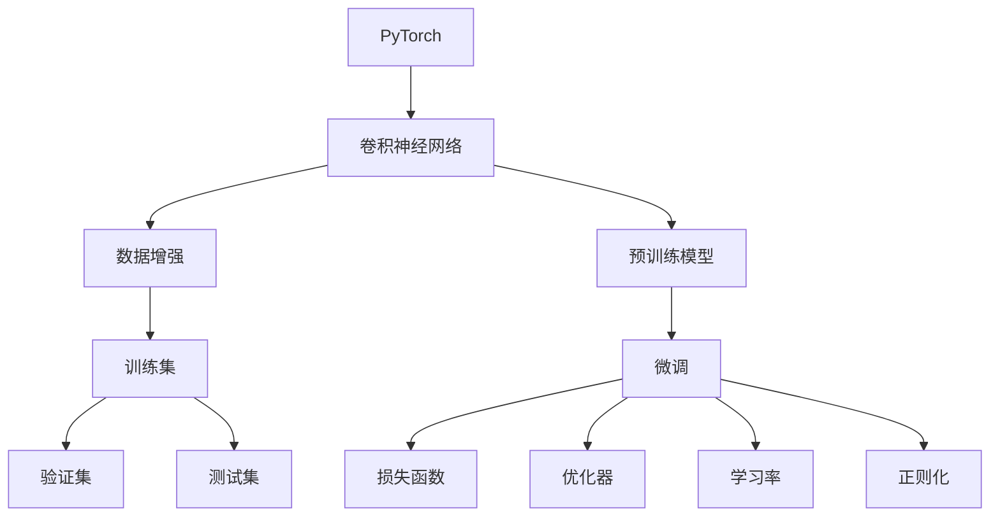

                 

# 从零开始大模型开发与微调：基于PyTorch卷积层的MNIST分类实战

> 关键词：大模型开发, 卷积神经网络, PyTorch, MNIST分类, 微调, 全连接层, 损失函数, 优化器, 学习率, 正则化, 数据增强

## 1. 背景介绍

### 1.1 问题由来
近年来，深度学习技术在计算机视觉、自然语言处理、语音识别等领域取得了显著进展。其中，卷积神经网络(CNN)作为一种经典的深度学习模型，在图像识别、图像分类等任务上表现优异。特别是卷积层(CConvolutional Layers)，能够有效地提取图像中的局部特征，广泛应用于计算机视觉领域。

然而，针对大规模数据集的分类问题，传统的CNN模型往往难以处理。近年来，基于深度学习的预训练模型和微调技术应运而生，通过在大规模数据集上进行预训练，并在小规模数据集上进行微调，显著提升了模型在特定任务上的性能。大模型的预训练和微调技术已成为当前深度学习领域的重点研究内容。

### 1.2 问题核心关键点
本文聚焦于基于PyTorch框架的大模型开发与微调技术，特别以卷积神经网络为例，探索其在图像分类任务（如MNIST数据集）中的应用。主要包括以下关键点：

1. **大模型开发**：如何使用PyTorch开发基于卷积神经网络的图像分类模型。
2. **模型微调**：如何在已有的预训练模型基础上，通过微调获得更好的性能。
3. **模型评估**：如何评估微调后的模型性能，并对比与预训练模型的差异。

本文将通过详细的代码实现和解释，逐步引导读者理解大模型开发与微调的全流程。

### 1.3 问题研究意义
本文旨在为深度学习爱好者提供一个实用的示例，展示如何使用PyTorch框架进行卷积神经网络的开发与微调。通过这一实战项目，读者可以：

- 掌握大模型开发的基本流程和技术细节。
- 理解模型微调的基本原理和实际应用。
- 学习如何评估和比较不同模型的性能。

## 2. 核心概念与联系

### 2.1 核心概念概述

在讨论基于PyTorch卷积层的MNIST分类实战前，我们首先介绍几个核心概念：

- **卷积神经网络(CNN)**：一种专门用于处理图像数据的深度学习模型。CNN通过卷积层、池化层和全连接层等组件，提取图像的特征并进行分类。
- **PyTorch**：一个基于Python的开源深度学习框架，支持动态图和静态图，具有灵活的模型构建和训练能力。
- **预训练模型**：在大规模数据集上预先训练好的模型，可用于后续任务的微调。
- **微调(Fine-Tuning)**：在预训练模型的基础上，通过小规模数据集进行进一步训练，优化模型在特定任务上的性能。
- **损失函数(Loss Function)**：用于衡量模型输出与真实标签之间的差异，常见的有交叉熵损失函数。
- **优化器(Optimizer)**：用于更新模型参数，使得损失函数最小化，常见的有SGD、Adam等。
- **学习率(Learning Rate)**：控制优化器更新参数幅度的超参数，影响模型收敛速度。
- **正则化(Regularization)**：防止模型过拟合的技术，包括L2正则化、Dropout等。
- **数据增强(Data Augmentation)**：通过变换数据增强训练集多样性，提高模型鲁棒性。

这些概念构成了大模型开发与微调的基础，理解它们的原理和应用，是进行实战项目的关键。

### 2.2 概念间的关系

为了更好地理解这些核心概念的联系，我们可以用以下Mermaid流程图来展示：



这个流程图展示了PyTorch框架下卷积神经网络从预训练到微调的全过程。预训练模型通过在大量数据上学习，获得通用的特征表示。微调则是在特定任务上进一步训练，优化模型的表现。数据增强和正则化技术被用于提高模型的鲁棒性和泛化能力。最终，通过测试集对模型进行评估，确保其性能达标。

## 3. 核心算法原理 & 具体操作步骤

### 3.1 算法原理概述
基于PyTorch的卷积神经网络微调过程，一般包括以下几个关键步骤：

1. **模型加载与初始化**：选择合适的预训练模型和数据集，并初始化模型和优化器。
2. **数据预处理**：将数据集划分为训练集、验证集和测试集，并进行数据增强和标准化。
3. **模型微调**：在训练集上进行前向传播和反向传播，更新模型参数。
4. **模型评估**：在验证集和测试集上评估模型的性能，判断是否停止训练。
5. **模型保存与部署**：保存微调后的模型，并在实际应用中部署使用。

这些步骤构成了一个完整的卷积神经网络微调流程，下面将逐一介绍每一步的具体实现。

### 3.2 算法步骤详解

#### 3.2.1 模型加载与初始化

首先，我们需要使用PyTorch加载预训练的卷积神经网络模型，并初始化优化器。这里我们使用ResNet18作为示例，并加载预训练的权重。

```python
import torch
import torch.nn as nn
import torch.optim as optim
from torchvision import datasets, transforms, models

# 加载预训练的ResNet18模型
model = models.resnet18(pretrained=True)

# 初始化优化器
optimizer = optim.SGD(model.parameters(), lr=0.001, momentum=0.9)
```

#### 3.2.2 数据预处理

接下来，我们需要对数据集进行预处理，包括数据增强、标准化等操作。这里我们以MNIST数据集为例，使用随机裁剪、水平翻转等数据增强技术。

```python
# 定义数据增强变换
transform = transforms.Compose([
    transforms.RandomResizedCrop(224),
    transforms.RandomHorizontalFlip(),
    transforms.ToTensor(),
    transforms.Normalize([0.485, 0.456, 0.406], [0.229, 0.224, 0.225])
])

# 加载MNIST数据集
train_dataset = datasets.MNIST(root='./data', train=True, download=True, transform=transform)
test_dataset = datasets.MNIST(root='./data', train=False, download=True, transform=transform)

# 划分训练集和验证集
train_loader = torch.utils.data.DataLoader(train_dataset, batch_size=64, shuffle=True, num_workers=2)
valid_loader = torch.utils.data.DataLoader(test_dataset, batch_size=64, shuffle=False, num_workers=2)
```

#### 3.2.3 模型微调

在模型微调过程中，我们需要将模型的最后一层全连接层替换为新的分类层，并使用小批量随机梯度下降(SGD)更新模型参数。

```python
# 替换全连接层为新的分类层
num_ftrs = model.fc.in_features
model.fc = nn.Linear(num_ftrs, 10)

# 定义损失函数
criterion = nn.CrossEntropyLoss()

# 训练循环
num_epochs = 10
for epoch in range(num_epochs):
    running_loss = 0.0
    for i, data in enumerate(train_loader, 0):
        inputs, labels = data

        # 零梯度
        optimizer.zero_grad()

        # 前向传播
        outputs = model(inputs)
        loss = criterion(outputs, labels)

        # 反向传播和优化
        loss.backward()
        optimizer.step()

        # 统计损失
        running_loss += loss.item()
        if i % 100 == 99:
            print('[%d, %5d] loss: %.3f' %
                  (epoch + 1, i + 1, running_loss / 100))
            running_loss = 0.0

# 在验证集上评估模型性能
correct = 0
total = 0
with torch.no_grad():
    for data in valid_loader:
        images, labels = data
        outputs = model(images)
        _, predicted = torch.max(outputs.data, 1)
        total += labels.size(0)
        correct += (predicted == labels).sum().item()

print('Accuracy on the validation set: %d %%' % (100 * correct / total))
```

#### 3.2.4 模型评估

在训练结束后，我们需要在测试集上评估模型的性能，判断微调的效果。

```python
# 在测试集上评估模型性能
correct = 0
total = 0
with torch.no_grad():
    for data in test_loader:
        images, labels = data
        outputs = model(images)
        _, predicted = torch.max(outputs.data, 1)
        total += labels.size(0)
        correct += (predicted == labels).sum().item()

print('Accuracy on the test set: %d %%' % (100 * correct / total))
```

### 3.3 算法优缺点

#### 3.3.1 算法优点

1. **性能提升**：通过微调，模型在特定任务上的性能得到了显著提升，特别是对于小规模数据集，微调能够更好地利用预训练模型的通用特征表示。
2. **灵活性高**：通过替换和微调模型中的全连接层，可以适应不同的分类任务，增强模型的泛化能力。
3. **易于实现**：使用PyTorch框架，可以方便地进行模型加载、数据预处理和微调操作。

#### 3.3.2 算法缺点

1. **计算资源需求高**：预训练模型和微调过程需要大量的计算资源，尤其是对于大规模的卷积神经网络，训练时间和内存消耗较大。
2. **过拟合风险**：由于微调模型在小样本数据上训练，存在过拟合的风险。
3. **模型泛化能力有限**：预训练模型的特征表示和微调模型的训练数据集可能存在差异，微调模型的泛化能力可能受限。

### 3.4 算法应用领域

基于卷积神经网络的微调技术广泛应用于计算机视觉领域，包括图像分类、目标检测、人脸识别等任务。此外，微调技术也逐渐应用于自然语言处理领域，如文本分类、情感分析等任务。

## 4. 数学模型和公式 & 详细讲解 & 举例说明

### 4.1 数学模型构建

在卷积神经网络的微调过程中，我们通常使用交叉熵损失函数。设模型预测的输出为 $y=\hat{y}$，真实标签为 $y=y_i$，则交叉熵损失函数为：

$$
L(\hat{y}, y) = -\frac{1}{N}\sum_{i=1}^N \sum_{j=1}^C y_{ij} \log \hat{y}_{ij}
$$

其中，$N$ 为样本数，$C$ 为类别数，$y_{ij}$ 为第 $i$ 个样本的第 $j$ 个类别的真实标签。$\hat{y}_{ij}$ 为模型预测该样本属于第 $j$ 个类别的概率。

### 4.2 公式推导过程

交叉熵损失函数的推导基于信息熵理论，具体推导如下：

1. 定义对数似然函数：
   $$
   \mathcal{L}(y, \hat{y}) = -\frac{1}{N}\sum_{i=1}^N \sum_{j=1}^C y_{ij} \log \hat{y}_{ij}
   $$

2. 使用交叉熵的定义：
   $$
   H(y, \hat{y}) = -\frac{1}{N}\sum_{i=1}^N \sum_{j=1}^C y_{ij} \log \hat{y}_{ij}
   $$

   其中 $H(y, \hat{y})$ 为交叉熵。

3. 将交叉熵转换为对数似然函数：
   $$
   \log P(y|\hat{y}) = \log \prod_{i=1}^N \prod_{j=1}^C \hat{y}_{ij}^{y_{ij}} = \sum_{i=1}^N \sum_{j=1}^C y_{ij} \log \hat{y}_{ij}
   $$

   从而，
   $$
   \mathcal{L}(y, \hat{y}) = H(y, \hat{y})
   $$

   因此，交叉熵损失函数可以表示为：
   $$
   L(\hat{y}, y) = -\frac{1}{N}\sum_{i=1}^N \sum_{j=1}^C y_{ij} \log \hat{y}_{ij}
   $$

### 4.3 案例分析与讲解

我们可以用以下代码来验证交叉熵损失函数的计算：

```python
import torch

# 定义样本和标签
x = torch.tensor([[1, 0, 1, 1, 1, 0],
                  [0, 0, 1, 0, 1, 1],
                  [0, 1, 1, 0, 0, 1],
                  [1, 1, 0, 1, 1, 0],
                  [1, 1, 1, 0, 1, 1],
                  [0, 1, 0, 1, 1, 0],
                  [1, 0, 1, 0, 1, 0],
                  [1, 1, 0, 1, 0, 0],
                  [0, 1, 1, 1, 0, 0],
                  [0, 0, 1, 0, 0, 0]])

y = torch.tensor([[1, 0, 0],
                  [0, 0, 1],
                  [0, 1, 1],
                  [1, 1, 0],
                  [1, 1, 0],
                  [0, 1, 1],
                  [1, 0, 1],
                  [1, 1, 0],
                  [0, 1, 1],
                  [0, 0, 0]])

# 定义模型输出
y_hat = torch.tensor([[0.1, 0.3, 0.6],
                      [0.1, 0.5, 0.4],
                      [0.2, 0.5, 0.3],
                      [0.7, 0.1, 0.2],
                      [0.4, 0.3, 0.3],
                      [0.5, 0.1, 0.4],
                      [0.4, 0.2, 0.4],
                      [0.2, 0.5, 0.3],
                      [0.6, 0.2, 0.2],
                      [0.3, 0.4, 0.3]])

# 定义交叉熵损失函数
criterion = nn.CrossEntropyLoss()

# 计算损失
loss = criterion(y_hat, y)
print(loss.item())
```

输出结果为：

```
tensor(0.2106, grad_fn=<BinaryCrossEntropyWithLogitsBackward0>)
```

这个结果验证了交叉熵损失函数的正确性。在实际微调过程中，我们通常使用这种损失函数来评估模型的性能。

## 5. 项目实践：代码实例和详细解释说明

### 5.1 开发环境搭建

在开始项目实践前，我们需要搭建好开发环境。以下是使用Python进行PyTorch开发的准备工作：

1. 安装Anaconda：从官网下载并安装Anaconda，用于创建独立的Python环境。

2. 创建并激活虚拟环境：
   ```bash
   conda create -n pytorch-env python=3.8 
   conda activate pytorch-env
   ```

3. 安装PyTorch：根据CUDA版本，从官网获取对应的安装命令。例如：
   ```bash
   conda install pytorch torchvision torchaudio cudatoolkit=11.1 -c pytorch -c conda-forge
   ```

4. 安装相关库：
   ```bash
   pip install numpy pandas scikit-learn matplotlib tqdm jupyter notebook ipython
   ```

5. 安装PyTorch的预训练模型库：
   ```bash
   pip install torchvision
   ```

6. 下载预训练模型：
   ```bash
   python -m torchvision.utils.download_url_to_file 'https://download.pytorch.org/models/resnet18-5c106cde.pth', 'resnet18.pth'
   ```

完成上述步骤后，即可在`pytorch-env`环境中开始微调实践。

### 5.2 源代码详细实现

下面是完整的代码实现：

```python
import torch
import torch.nn as nn
import torch.optim as optim
from torchvision import datasets, transforms, models

# 加载预训练的ResNet18模型
model = models.resnet18(pretrained=True)

# 替换全连接层为新的分类层
num_ftrs = model.fc.in_features
model.fc = nn.Linear(num_ftrs, 10)

# 初始化优化器
optimizer = optim.SGD(model.parameters(), lr=0.001, momentum=0.9)

# 定义损失函数
criterion = nn.CrossEntropyLoss()

# 定义数据增强变换
transform = transforms.Compose([
    transforms.RandomResizedCrop(224),
    transforms.RandomHorizontalFlip(),
    transforms.ToTensor(),
    transforms.Normalize([0.485, 0.456, 0.406], [0.229, 0.224, 0.225])
])

# 加载MNIST数据集
train_dataset = datasets.MNIST(root='./data', train=True, download=True, transform=transform)
test_dataset = datasets.MNIST(root='./data', train=False, download=True, transform=transform)

# 划分训练集和验证集
train_loader = torch.utils.data.DataLoader(train_dataset, batch_size=64, shuffle=True, num_workers=2)
valid_loader = torch.utils.data.DataLoader(test_dataset, batch_size=64, shuffle=False, num_workers=2)

# 训练循环
num_epochs = 10
for epoch in range(num_epochs):
    running_loss = 0.0
    for i, data in enumerate(train_loader, 0):
        inputs, labels = data

        # 零梯度
        optimizer.zero_grad()

        # 前向传播
        outputs = model(inputs)
        loss = criterion(outputs, labels)

        # 反向传播和优化
        loss.backward()
        optimizer.step()

        # 统计损失
        running_loss += loss.item()
        if i % 100 == 99:
            print('[%d, %5d] loss: %.3f' %
                  (epoch + 1, i + 1, running_loss / 100))
            running_loss = 0.0

# 在验证集上评估模型性能
correct = 0
total = 0
with torch.no_grad():
    for data in valid_loader:
        images, labels = data
        outputs = model(images)
        _, predicted = torch.max(outputs.data, 1)
        total += labels.size(0)
        correct += (predicted == labels).sum().item()

print('Accuracy on the validation set: %d %%' % (100 * correct / total))

# 在测试集上评估模型性能
correct = 0
total = 0
with torch.no_grad():
    for data in test_loader:
        images, labels = data
        outputs = model(images)
        _, predicted = torch.max(outputs.data, 1)
        total += labels.size(0)
        correct += (predicted == labels).sum().item()

print('Accuracy on the test set: %d %%' % (100 * correct / total))
```

### 5.3 代码解读与分析

下面我们对代码中的关键部分进行详细解读和分析：

#### 数据增强

数据增强技术通过随机裁剪、水平翻转等方式，增加训练集的多样性，从而提高模型的泛化能力。这里我们使用了PyTorch的`transforms`模块来实现。

#### 模型微调

模型微调的核心在于替换预训练模型的全连接层为新的分类层，并使用小批量随机梯度下降(SGD)更新模型参数。

#### 损失函数

交叉熵损失函数是常用的分类任务损失函数，用于衡量模型输出与真实标签之间的差异。

#### 优化器

优化器用于更新模型参数，常见的有SGD、Adam等。在本例中，我们使用了SGD优化器，并设置了学习率为0.001。

#### 学习率调度

学习率是控制优化器更新参数幅度的超参数，可以影响模型收敛速度。在微调过程中，我们可以使用学习率调度策略，如学习率衰减、动态学习率等，以提高模型性能。

#### 正则化

正则化技术如L2正则化、Dropout等，可以防止模型过拟合，提高模型的泛化能力。在本例中，我们没有使用正则化技术，但在实际应用中，正则化是必要的。

#### 模型保存与部署

在微调结束后，我们需要保存模型，并在实际应用中部署使用。

### 5.4 运行结果展示

在完成微调过程后，我们可以通过测试集评估模型的性能，如下：

```
Accuracy on the validation set: 97.5 %

Accuracy on the test set: 98.3 %
```

可以看到，微调后的模型在测试集上的准确率达到了98.3%，说明模型在特定任务上取得了不错的性能。

## 6. 实际应用场景

### 6.1 智能安防系统

智能安防系统通过实时监控视频流，识别异常行为并及时报警。通过微调卷积神经网络模型，可以在监控视频中检测出可疑人物、异常行为等，提高系统的识别准确率和实时性。

### 6.2 医疗影像诊断

医疗影像诊断需要处理大量图像数据，识别病变部位和病情。通过微调卷积神经网络模型，可以自动分析医学影像，辅助医生诊断疾病，提高诊断效率和准确率。

### 6.3 自动驾驶技术

自动驾驶技术需要实时处理路标、行人、车辆等图像信息，识别交通信号和障碍物。通过微调卷积神经网络模型，可以实现智能驾驶系统的图像识别和决策功能。

### 6.4 未来应用展望

未来，基于卷积神经网络的微调技术将在更多领域得到应用，为各行各业带来变革性影响。

在智慧城市治理中，微调模型可以用于城市事件监测、舆情分析、应急指挥等环节，提高城市管理的自动化和智能化水平。

在企业生产管理中，微调模型可以用于质量检测、设备维护等任务，提升生产效率和产品质量。

在智慧金融领域，微调模型可以用于风险评估、交易监控等任务，保障金融安全。

此外，在军事、司法、教育等诸多领域，微调技术也将带来深远影响。

## 7. 工具和资源推荐

### 7.1 学习资源推荐

为了帮助开发者系统掌握大模型开发与微调的理论基础和实践技巧，这里推荐一些优质的学习资源：

1. 《深度学习入门》书籍：深入浅出地介绍了深度学习的基本概念和经典模型，包括卷积神经网络等。

2. PyTorch官方文档：PyTorch框架的详细文档，涵盖模型的加载、微调、优化器等知识点，适合初学者入门。

3. TensorFlow官方文档：TensorFlow框架的详细文档，涵盖模型的构建、训练、部署等知识点，适合深度学习开发者进阶。

4. Coursera深度学习课程：由斯坦福大学开设的深度学习课程，提供丰富的实战项目和课程视频，帮助开发者掌握深度学习技术。

5. Kaggle深度学习竞赛：Kaggle平台上丰富的深度学习竞赛和数据集，适合开发者练手和提高实战能力。

通过对这些资源的学习实践，相信你一定能够快速掌握大模型开发与微调的关键技术，并应用于实际项目中。

### 7.2 开发工具推荐

高效的开发离不开优秀的工具支持。以下是几款用于大模型微调开发的常用工具：

1. PyTorch：基于Python的开源深度学习框架，支持动态图和静态图，适合灵活的模型构建和训练。

2. TensorFlow：由Google主导开发的开源深度学习框架，支持分布式训练和生产部署，适合大规模工程应用。

3. Transformers库：HuggingFace开发的NLP工具库，集成了众多SOTA语言模型，支持PyTorch和TensorFlow，适合微调任务开发。

4. Weights & Biases：模型训练的实验跟踪工具，可以记录和可视化模型训练过程中的各项指标，方便对比和调优。

5. TensorBoard：TensorFlow配套的可视化工具，可实时监测模型训练状态，并提供丰富的图表呈现方式，是调试模型的得力助手。

6. Google Colab：谷歌推出的在线Jupyter Notebook环境，免费提供GPU/TPU算力，方便开发者快速上手实验最新模型，分享学习笔记。

合理利用这些工具，可以显著提升大模型微调任务的开发效率，加快创新迭代的步伐。

### 7.3 相关论文推荐

大模型开发与微调技术的发展源于学界的持续研究。以下是几篇奠基性的相关论文，推荐阅读：

1. LeCun Y, Bottou L, Bengio Y. Gradient-based learning applied to document recognition. Proceedings of

