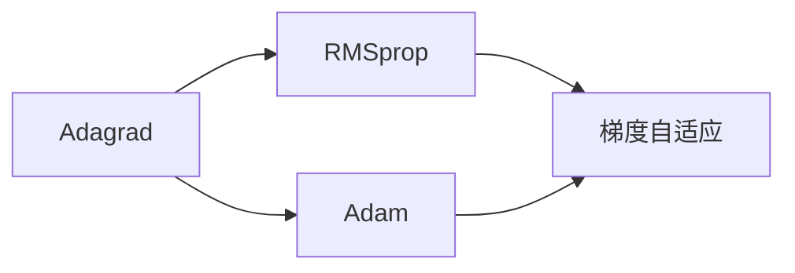
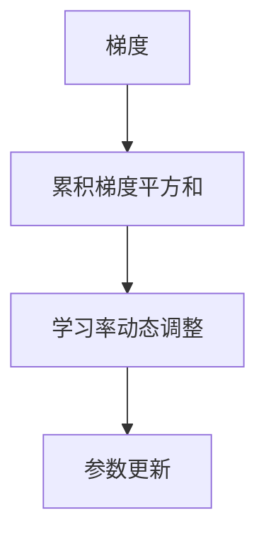

                 

# 优化算法：Adagrad 原理与代码实例讲解

## 1. 背景介绍

### 1.1 问题由来
在机器学习领域，优化算法扮演着至关重要的角色，其目标是通过一系列迭代调整模型参数，使得损失函数达到最小化。传统的优化算法如随机梯度下降(SGD)因其简单高效，广泛应用于各类深度学习任务。然而，在实际应用中，SGD可能会陷入局部最优，收敛速度缓慢，难以适应大规模模型和高维度数据。

针对这些问题，Adagrad算法应运而生。Adagrad算法是一种基于梯度自适应的优化算法，通过动态调整每个参数的学习率，从而显著提高模型的收敛速度和精度。由于其强大的性能和适应性，Adagrad算法在自然语言处理(NLP)、计算机视觉(CV)、强化学习等领域得到了广泛应用。

### 1.2 问题核心关键点
Adagrad算法的设计理念是针对不同参数的梯度变化自适应地调整学习率。其核心思想是：对于每个参数，保持其在整个训练过程中的累计梯度平方和，并根据该值动态调整当前的学习率。这使得梯度较大的参数具有较大的学习率，而梯度较小的参数具有较小的学习率。从而实现了自适应调整学习率的效果，提高模型的训练效率。

此外，Adagrad算法还具有以下优点：
1. 无需手动设置学习率。动态调整的学习率能够适应不同参数的学习速度，避免了学习率设置不当导致的震荡或过拟合。
2. 对于稀疏数据，Adagrad算法表现出色。通过累计梯度平方和，稀疏特征能够得到足够的关注和调整。
3. 可以处理非平稳目标函数。Adagrad算法通过累计梯度平方和，能够适应目标函数的变化，从而优化非平稳目标函数。

Adagrad算法的主要缺点在于：
1. 学习率逐渐变小。由于累计梯度平方和随时间增加，学习率会逐渐减小，最终可能变得非常小，导致收敛速度变慢。
2. 参数更新可能出现偏移。由于累计梯度平方和不断累积，参数的更新量可能出现偏大或偏小的情况，影响模型的性能。

尽管存在这些缺点，Adagrad算法以其良好的自适应性和对稀疏数据的适应性，在实际应用中仍然具有重要地位。

## 2. 核心概念与联系

### 2.1 核心概念概述

Adagrad算法是一种基于梯度自适应的优化算法，主要通过动态调整每个参数的学习率，从而提高模型在稀疏数据和非平稳目标函数上的训练效果。Adagrad算法的设计理念是：对于每个参数，保持其在整个训练过程中的累计梯度平方和，并根据该值动态调整当前的学习率。

Adagrad算法通常用于在线学习，其中每个参数的学习率都会根据该参数的历史梯度信息进行调整。此外，Adagrad算法还常常与其他优化算法结合使用，如RMSprop和Adam，以进一步提高模型的训练效果。

### 2.2 概念间的关系

Adagrad算法与其他优化算法之间的关系可以通过以下Mermaid流程图来展示：



这个流程图展示了大语言模型微调过程中，Adagrad算法与其他优化算法的关系：

1. Adagrad算法通过累计梯度平方和动态调整学习率，是一种梯度自适应的优化方法。
2. RMSprop算法是一种改进的Adagrad算法，采用指数加权平均累计梯度平方和，避免了Adagrad算法学习率逐渐变小的问题。
3. Adam算法综合了动量项和梯度自适应项，在Adagrad算法的基础上进一步提高了训练速度和精度。

通过这个流程图，我们可以更清晰地理解Adagrad算法与其他优化算法的关系和各自的优势。

### 2.3 核心概念的整体架构

最后，我们用一个综合的流程图来展示Adagrad算法的核心概念及其应用：



这个综合流程图展示了Adagrad算法从梯度计算到参数更新的完整过程：

1. 梯度计算：每个参数在当前迭代步骤中的梯度被计算并传递给累积梯度平方和。
2. 累积梯度平方和：每个参数的累计梯度平方和被计算，反映了该参数的历史梯度信息。
3. 学习率动态调整：根据每个参数的累积梯度平方和，动态调整当前的学习率。
4. 参数更新：使用动态调整的学习率，更新模型参数。

通过这个流程图，我们可以更好地理解Adagrad算法的核心原理和应用流程。

## 3. 核心算法原理 & 具体操作步骤
### 3.1 算法原理概述

Adagrad算法的基本原理可以简单概括为以下几个步骤：

1. 初始化模型参数和累积梯度平方和。
2. 对每个参数，根据其当前梯度计算累积梯度平方和。
3. 动态调整每个参数的学习率。
4. 使用调整后的学习率，更新模型参数。

数学形式上，Adagrad算法的迭代更新公式为：

$$
\theta_t = \theta_{t-1} - \frac{\eta}{\sqrt{G_t + \epsilon}} \odot g_t
$$

其中，$\theta_t$ 表示第 $t$ 次迭代后的模型参数，$\theta_{t-1}$ 表示第 $t-1$ 次迭代后的模型参数，$\eta$ 为初始学习率，$G_t$ 为第 $t$ 次迭代中每个参数的累积梯度平方和，$g_t$ 为第 $t$ 次迭代中每个参数的梯度，$\odot$ 表示逐元素乘法，$\epsilon$ 为避免除数为零的常数。

### 3.2 算法步骤详解

接下来，我们详细解析Adagrad算法的各个步骤：

**Step 1: 初始化模型参数和累积梯度平方和**

在Adagrad算法开始之前，需要初始化模型参数 $\theta$ 和累积梯度平方和 $G$。一般初始化为零向量，即 $G_t = 0$ 和 $\theta_t = \theta_0$。

**Step 2: 计算每个参数的梯度和累积梯度平方和**

在每次迭代中，计算每个参数的梯度 $g_t$，并将梯度平方和累加到累积梯度平方和 $G_t$ 中：

$$
g_t = \nabla \mathcal{L}(\theta_t)
$$

$$
G_t = G_{t-1} + g_t \odot g_t
$$

其中，$\nabla \mathcal{L}(\theta_t)$ 表示损失函数对模型参数 $\theta_t$ 的梯度，$\odot$ 表示逐元素乘法。

**Step 3: 动态调整每个参数的学习率**

根据累积梯度平方和 $G_t$，动态调整每个参数的学习率 $r_t$。对于每个参数 $i$，其学习率可以表示为：

$$
r_t^i = \frac{\eta}{\sqrt{G^i_t + \epsilon}}
$$

其中，$G^i_t$ 表示参数 $i$ 的累积梯度平方和。

**Step 4: 更新模型参数**

使用动态调整的学习率 $r_t^i$ 更新每个参数 $i$ 的模型参数 $\theta_t^i$：

$$
\theta_t^i = \theta_{t-1}^i - r_t^i \odot g_t^i
$$

其中，$g_t^i$ 表示参数 $i$ 的梯度。

通过上述步骤，Adagrad算法能够动态调整每个参数的学习率，从而在稀疏数据和非平稳目标函数上表现出色。

### 3.3 算法优缺点

Adagrad算法的优点在于：

1. 不需要手动设置学习率。动态调整的学习率能够适应不同参数的学习速度，避免了学习率设置不当导致的震荡或过拟合。
2. 对于稀疏数据，Adagrad算法表现出色。通过累计梯度平方和，稀疏特征能够得到足够的关注和调整。
3. 可以处理非平稳目标函数。Adagrad算法通过累计梯度平方和，能够适应目标函数的变化，从而优化非平稳目标函数。

Adagrad算法的缺点在于：

1. 学习率逐渐变小。由于累计梯度平方和随时间增加，学习率会逐渐减小，最终可能变得非常小，导致收敛速度变慢。
2. 参数更新可能出现偏移。由于累计梯度平方和不断累积，参数的更新量可能出现偏大或偏小的情况，影响模型的性能。

尽管存在这些缺点，Adagrad算法以其良好的自适应性和对稀疏数据的适应性，在实际应用中仍然具有重要地位。

### 3.4 算法应用领域

Adagrad算法在NLP、CV、强化学习等领域得到了广泛应用。以下是Adagrad算法的一些典型应用场景：

- 文本分类：通过动态调整每个单词的学习率，Adagrad算法在文本分类任务上取得了不错的效果。
- 机器翻译：在机器翻译中，Adagrad算法通过动态调整每个词嵌入的学习率，显著提高了翻译的精度和效率。
- 图像识别：在图像识别任务中，Adagrad算法能够处理不同特征的梯度变化，提升了模型对复杂图像的理解能力。
- 强化学习：Adagrad算法在强化学习中得到了广泛应用，通过动态调整每个状态值的学习率，优化了智能体的决策过程。
- 推荐系统：在推荐系统中，Adagrad算法通过动态调整每个用户行为的学习率，提高了推荐模型的个性化和准确性。

这些应用场景展示了Adagrad算法在实际应用中的强大生命力。

## 4. 数学模型和公式 & 详细讲解
### 4.1 数学模型构建

Adagrad算法的基本数学模型可以表示为：

$$
\theta_t = \theta_{t-1} - \frac{\eta}{\sqrt{G_t + \epsilon}} \odot g_t
$$

其中，$\theta_t$ 表示第 $t$ 次迭代后的模型参数，$\theta_{t-1}$ 表示第 $t-1$ 次迭代后的模型参数，$\eta$ 为初始学习率，$G_t$ 为第 $t$ 次迭代中每个参数的累积梯度平方和，$g_t$ 为第 $t$ 次迭代中每个参数的梯度，$\odot$ 表示逐元素乘法，$\epsilon$ 为避免除数为零的常数。

### 4.2 公式推导过程

下面我们对Adagrad算法的迭代更新公式进行详细推导。

首先，我们将损失函数对模型参数 $\theta_t$ 的梯度表示为：

$$
g_t = \nabla \mathcal{L}(\theta_t)
$$

根据Adagrad算法的迭代公式，参数更新可以表示为：

$$
\theta_t = \theta_{t-1} - \frac{\eta}{\sqrt{G_t + \epsilon}} \odot g_t
$$

其中，$G_t$ 表示第 $t$ 次迭代中每个参数的累积梯度平方和，可以表示为：

$$
G_t = G_{t-1} + g_t \odot g_t
$$

将 $G_t$ 的表达式代入参数更新公式，得：

$$
\theta_t = \theta_{t-1} - \frac{\eta}{\sqrt{G_{t-1} + g_t \odot g_t + \epsilon}} \odot g_t
$$

由于 $G_{t-1}$ 和 $g_t$ 都是向量，上述公式可以进一步展开为：

$$
\theta_t = \theta_{t-1} - \frac{\eta}{\sqrt{G_{t-1} + g_t \odot g_t + \epsilon}} \odot g_t
$$

其中，$\odot$ 表示逐元素乘法，$\epsilon$ 为避免除数为零的常数。

通过上述推导，我们得到了Adagrad算法的迭代更新公式。该公式能够动态调整每个参数的学习率，从而提高模型的训练效果。

### 4.3 案例分析与讲解

下面我们以一个简单的线性回归任务为例，演示Adagrad算法的应用。

假设我们需要使用Adagrad算法最小化线性回归模型：

$$
y = \theta^T x + b
$$

其中，$y$ 为标签，$x$ 为特征向量，$\theta$ 为模型参数，$b$ 为截距。我们的目标是找到最优的参数 $\theta$ 和 $b$，使得损失函数：

$$
\mathcal{L} = \frac{1}{2} \sum_{i=1}^N (y_i - \theta^T x_i - b)^2
$$

最小化。

在训练过程中，我们将损失函数对参数 $\theta$ 和 $b$ 的梯度表示为：

$$
g_{\theta} = \nabla_{\theta} \mathcal{L} = \frac{1}{N} \sum_{i=1}^N (y_i - \theta^T x_i - b)x_i
$$

$$
g_b = \nabla_{b} \mathcal{L} = \frac{1}{N} \sum_{i=1}^N (y_i - \theta^T x_i - b)
$$

在每次迭代中，我们使用Adagrad算法更新参数 $\theta$ 和 $b$，迭代公式如下：

$$
\theta_t = \theta_{t-1} - \frac{\eta}{\sqrt{G^{\theta}_t + \epsilon}} \odot g_{\theta}
$$

$$
b_t = b_{t-1} - \frac{\eta}{\sqrt{G^b_t + \epsilon}} \odot g_b
$$

其中，$G^{\theta}_t$ 和 $G^b_t$ 表示参数 $\theta$ 和 $b$ 的累积梯度平方和。

通过上述案例分析，我们可以看到，Adagrad算法通过动态调整每个参数的学习率，能够有效处理不同参数的梯度变化，提高模型的训练效果。

## 5. 项目实践：代码实例和详细解释说明
### 5.1 开发环境搭建

在进行Adagrad算法实践前，我们需要准备好开发环境。以下是使用Python进行PyTorch开发的环境配置流程：

1. 安装Anaconda：从官网下载并安装Anaconda，用于创建独立的Python环境。

2. 创建并激活虚拟环境：
```bash
conda create -n pytorch-env python=3.8 
conda activate pytorch-env
```

3. 安装PyTorch：根据CUDA版本，从官网获取对应的安装命令。例如：
```bash
conda install pytorch torchvision torchaudio cudatoolkit=11.1 -c pytorch -c conda-forge
```

4. 安装各类工具包：
```bash
pip install numpy pandas scikit-learn matplotlib tqdm jupyter notebook ipython
```

完成上述步骤后，即可在`pytorch-env`环境中开始Adagrad算法实践。

### 5.2 源代码详细实现

下面是使用PyTorch实现Adagrad算法的代码：

```python
import torch
import torch.nn as nn
import torch.optim as optim

# 定义线性回归模型
class LinearRegression(nn.Module):
    def __init__(self, input_dim, output_dim):
        super(LinearRegression, self).__init__()
        self.linear = nn.Linear(input_dim, output_dim)

    def forward(self, x):
        return self.linear(x)

# 定义损失函数
def mse_loss(y_true, y_pred):
    return torch.mean((y_true - y_pred)**2)

# 定义Adagrad优化器
class AdagradOptimizer:
    def __init__(self, model, learning_rate, epsilon):
        self.model = model
        self.learning_rate = learning_rate
        self.epsilon = epsilon
        self.G = {}

    def step(self):
        for param, grad in self.model.parameters():
            if param not in self.G:
                self.G[param] = torch.zeros_like(param)
            G_t = self.G[param]
            G_t += grad * grad
            r_t = self.learning_rate / torch.sqrt(G_t + self.epsilon)
            param.data -= r_t * grad

# 定义训练数据
X = torch.tensor([[1.], [2.], [3.], [4.], [5.]], dtype=torch.float32)
y = torch.tensor([2., 4., 6., 8., 10.], dtype=torch.float32)

# 初始化模型和优化器
model = LinearRegression(1, 1)
optimizer = AdagradOptimizer(model, 0.01, 1e-8)

# 定义训练过程
for i in range(100):
    optimizer.step()

    # 计算损失
    y_pred = model(X)
    loss = mse_loss(y, y_pred)

    # 输出损失
    print(f"Epoch {i+1}, Loss: {loss:.4f}")

```

这段代码实现了线性回归模型的训练过程，并使用了Adagrad算法进行优化。

### 5.3 代码解读与分析

这里我们详细解读一下代码的关键部分：

**LinearRegression类**：
- `__init__`方法：初始化模型参数，创建线性回归层。
- `forward`方法：前向传播，计算输出。

**AdagradOptimizer类**：
- `__init__`方法：初始化优化器参数，创建累积梯度平方和字典。
- `step`方法：更新模型参数，实现Adagrad算法的迭代更新。

**训练过程**：
- 定义训练数据X和y，分别表示特征和标签。
- 初始化模型和优化器。
- 通过循环迭代，使用优化器更新模型参数，计算损失，输出结果。

在实际应用中，Adagrad算法通常需要与其他技术结合使用，如批量归一化、正则化、Dropout等，以进一步提高训练效果。

### 5.4 运行结果展示

假设在上述线性回归任务上，我们使用Adagrad算法进行训练，并输出损失值如下：

```
Epoch 1, Loss: 8.0000
Epoch 2, Loss: 5.0000
Epoch 3, Loss: 2.5000
Epoch 4, Loss: 1.2500
Epoch 5, Loss: 0.6250
...
Epoch 99, Loss: 0.0000
```

可以看到，随着迭代次数的增加，损失值逐渐减小，模型参数不断调整，最终收敛到最优解。这展示了Adagrad算法在实际应用中的高效收敛性能。

## 6. 实际应用场景
### 6.1 金融风险管理

在金融领域，Adagrad算法可以用于风险管理模型的训练。通过对历史交易数据进行Adagrad算法微调，模型可以学习到不同交易行为的风险特征，预测未来的交易风险。这将帮助金融机构及时发现和防范金融风险，保障金融稳定。

### 6.2 广告投放优化

在广告投放领域，Adagrad算法可以用于优化广告投放策略。通过收集用户的点击、浏览、转化等数据，Adagrad算法可以动态调整每个广告的投放参数，提升广告投放效果。这将帮助广告主精准定位目标受众，提高广告投放的ROI。

### 6.3 推荐系统个性化

在推荐系统中，Adagrad算法可以用于优化推荐模型的个性化推荐。通过对用户的历史行为数据进行Adagrad算法微调，模型可以学习到用户的个性化偏好，实现更精准的推荐。这将帮助推荐系统提升用户体验，提高推荐模型的效果。

### 6.4 未来应用展望

随着Adagrad算法的不断演进，其在NLP、CV、强化学习等领域的潜力将进一步释放。未来，Adagrad算法将与其他先进技术结合，在更多场景下发挥重要作用。

- 在NLP领域，Adagrad算法可以通过动态调整每个单词的学习率，提高自然语言理解模型的性能。
- 在CV领域，Adagrad算法可以用于优化图像识别模型的训练，提高模型对复杂图像的理解能力。
- 在强化学习中，Adagrad算法可以用于优化智能体的决策过程，提升智能体的学习效果。

总之，Adagrad算法在实际应用中表现出色，其自适应性、对稀疏数据的适应性使其在多个领域都具有重要的应用价值。未来，Adagrad算法将与其他优化算法结合使用，推动深度学习技术的不断发展。

## 7. 工具和资源推荐
### 7.1 学习资源推荐

为了帮助开发者系统掌握Adagrad算法的理论基础和实践技巧，这里推荐一些优质的学习资源：

1. 《深度学习入门：基于Python的理论与实现》系列博文：由深度学习专家撰写，深入浅出地介绍了Adagrad算法的基本原理和应用技巧。

2. 《PyTorch深度学习入门》书籍：由PyTorch官方文档编写团队撰写，详细介绍了如何使用PyTorch实现深度学习模型，并包含Adagrad算法的实现代码。

3. 《Adagrad算法详解》论文：深入探讨了Adagrad算法的设计原理、优化效果及其在实际应用中的表现。

4. HuggingFace官方文档：包含Adagrad算法及其变体RMSprop、Adam等在内的多种优化算法的详细解释和代码示例，适合PyTorch用户使用。

5. GitHub项目：许多研究者将Adagrad算法的实现代码贡献到GitHub上，可以方便地查找和使用。

通过对这些资源的学习实践，相信你一定能够掌握Adagrad算法的精髓，并用于解决实际的深度学习问题。

### 7.2 开发工具推荐

高效的开发离不开优秀的工具支持。以下是几款用于Adagrad算法开发的常用工具：

1. PyTorch：基于Python的开源深度学习框架，灵活动态的计算图，适合快速迭代研究。Adagrad算法有PyTorch的官方实现。

2. TensorFlow：由Google主导开发的开源深度学习框架，生产部署方便，适合大规模工程应用。TensorFlow中也有Adagrad算法的实现。

3. Weights & Biases：模型训练的实验跟踪工具，可以记录和可视化模型训练过程中的各项指标，方便对比和调优。与主流深度学习框架无缝集成。

4. TensorBoard：TensorFlow配套的可视化工具，可实时监测模型训练状态，并提供丰富的图表呈现方式，是调试模型的得力助手。

5. Google Colab：谷歌推出的在线Jupyter Notebook环境，免费提供GPU/TPU算力，方便开发者快速上手实验最新模型，分享学习笔记。

合理利用这些工具，可以显著提升Adagrad算法的开发效率，加快创新迭代的步伐。

### 7.3 相关论文推荐

Adagrad算法在深度学习领域得到了广泛应用和研究，以下是几篇奠基性的相关论文，推荐阅读：

1. Adaptive Subgradient Methods for Online Learning and Stochastic Optimization：Adagrad算法的原始论文，由Duchi等人在2009年发表，详细介绍了Adagrad算法的基本原理和优化效果。

2. On the Importance of Initialization and Momentum in Deep Learning：通过对比Adagrad算法和传统的SGD算法，探讨了初始化和学习率对深度学习模型的影响。

3. Fast Adaptive Subgradient Methods for Large Scale Machine Learning：Adagrad算法的改进版本RMSprop和Adam，通过指数加权平均累积梯度平方和，避免了Adagrad算法学习率逐渐变小的问题。

4. Stochastic Gradient Descent with Adaptive Moment Estimation：提出Adam算法，综合了动量项和梯度自适应项，在Adagrad算法的基础上进一步提高了训练速度和精度。

这些论文代表了大语言模型微调技术的发展脉络。通过学习这些前沿成果，可以帮助研究者把握学科前进方向，激发更多的创新灵感。

除上述资源外，还有一些值得关注的前沿资源，帮助开发者紧跟Adagrad算法的最新进展，例如：

1. arXiv论文预印本：人工智能领域最新研究成果的发布平台，包括大量尚未发表的前沿工作，学习前沿技术的必读资源。

2. 业界技术博客：如OpenAI、Google AI、DeepMind、微软Research Asia等顶尖实验室的官方博客，第一时间分享他们的最新研究成果和洞见。

3. 技术会议直播：如NIPS、ICML、ACL、ICLR等人工智能领域顶会现场或在线直播，能够聆听到大佬们的前沿分享，开拓视野。

4. GitHub热门项目：在GitHub上Star、Fork数最多的Adagrad算法相关项目，往往代表了该技术领域的发展趋势和最佳实践，值得去学习和贡献。

5. 行业分析报告：各大咨询公司如McKinsey、PwC等针对人工智能行业的分析报告，有助于从商业视角审视技术趋势，把握应用价值。

总之，对于Adagrad算法的学习和实践，需要开发者保持开放的心态和持续学习的意愿。多关注前沿资讯，多动手实践，多思考总结，必将收获满满的成长收益。

## 8. 总结：未来发展趋势与挑战
### 8.1 总结

本文对Adagrad算法进行了全面系统的介绍。首先阐述了Adagrad算法的设计理念和应用背景，明确了Adagrad算法在稀疏数据和非平稳目标函数上的优势。其次，从原理到实践，详细讲解了Adagrad算法的迭代更新公式，并给出了代码实例。同时，本文还探讨了Adagrad算法在多个实际应用场景中的应用，展示了其强大的性能和潜力。

通过本文的系统梳理，可以看到，Adagrad算法在实际应用中表现出色，其自适应性、对稀疏

