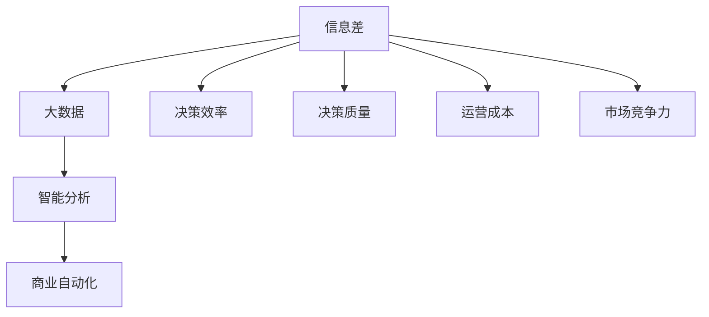
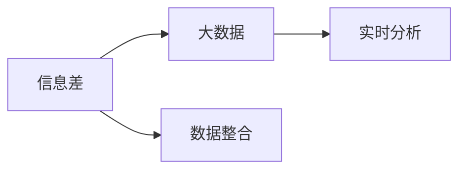
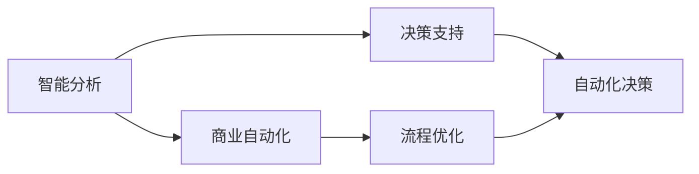
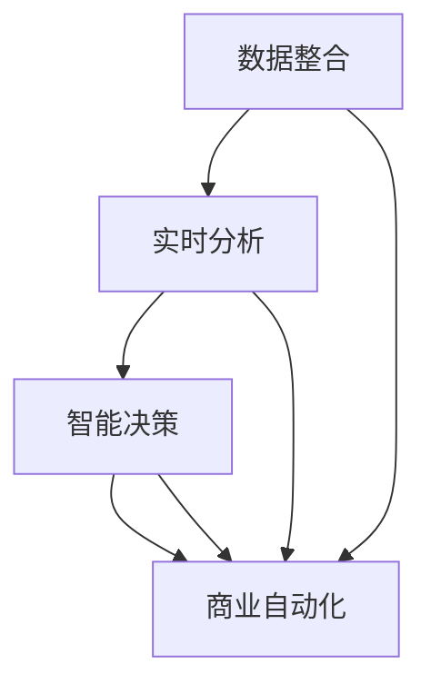
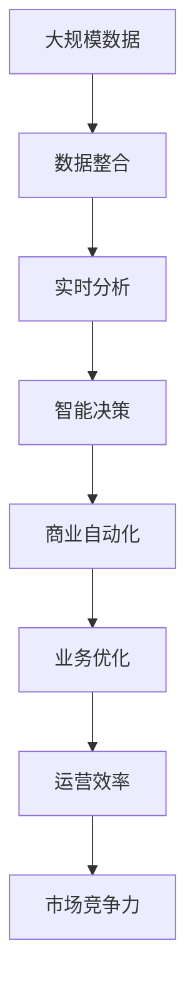

                 

# 信息差的商业自动化：大数据如何实现商业自动化

> 关键词：商业自动化, 大数据, 信息差, 数据驱动, 智能分析, 业务流程优化, 客户洞察

## 1. 背景介绍

### 1.1 问题由来

在全球化竞争日益加剧的今天，商业环境变得复杂多变。企业需要在瞬息万变的市场环境中，快速做出决策并执行，才能获得竞争优势。然而，许多企业仍然依赖于传统的决策方式，如直觉和经验，这些方式往往不能充分挖掘数据价值，导致决策过程缓慢且容易出错。信息差的商业自动化，通过大数据和智能分析技术，可以帮助企业更好地理解和应对市场变化，从而在竞争中占据先机。

### 1.2 问题核心关键点

信息差商业自动化的核心在于如何利用大数据和智能分析技术，降低信息不对称，提高决策效率和准确性。具体来说，包括以下几个方面：

- **数据整合**：从多个来源收集和整合数据，消除数据孤岛，构建统一的数据视图。
- **实时分析**：利用实时数据分析技术，快速识别市场趋势和客户行为变化。
- **智能决策**：结合机器学习和人工智能技术，自动化地进行复杂决策和预测。
- **业务优化**：通过数据分析和智能决策，优化业务流程和资源配置，提升企业运营效率。

### 1.3 问题研究意义

实现信息差商业自动化，对于企业提高决策效率、降低运营成本、增强市场竞争力具有重要意义。具体而言：

1. **提升决策质量**：利用大数据和智能分析技术，可以全面、准确地理解市场和客户，减少决策的盲目性和错误率。
2. **优化业务流程**：通过智能分析，可以识别出业务流程中的瓶颈和低效环节，实现自动化优化。
3. **降低运营成本**：自动化决策和业务优化可以降低人工干预，减少错误和重复工作，提高运营效率。
4. **增强市场竞争力**：快速响应市场变化，灵活调整策略，使企业能够在竞争中立于不败之地。
5. **数据驱动决策**：将数据作为决策的基础，提升决策的科学性和可重复性。

## 2. 核心概念与联系

### 2.1 核心概念概述

为了更好地理解信息差商业自动化的过程，我们先介绍几个关键概念：

- **信息差（Information Gap）**：指在决策过程中，决策者和相关方所掌握的信息不对称。信息差的存在，可能导致决策失误和资源浪费。
- **大数据（Big Data）**：指结构化和非结构化数据的集合，具有规模大、种类多、价值高、速度快的特点。
- **智能分析（Intelligent Analysis）**：指利用人工智能和机器学习技术，对大数据进行深度分析和挖掘的过程。
- **商业自动化（Business Automation）**：指通过技术手段，自动化地完成商业决策和业务流程的过程。

这些概念之间的逻辑关系可以通过以下Mermaid流程图来展示：



这个流程图展示了信息差商业自动化的主要步骤和目标：

1. 收集和整合大数据，消除信息差。
2. 利用智能分析技术，对大数据进行深度挖掘。
3. 通过商业自动化技术，实现决策和业务流程的自动化。
4. 最终目标是通过提升决策效率和质量，优化运营成本，增强市场竞争力。

### 2.2 概念间的关系

这些核心概念之间存在着紧密的联系，形成了信息差商业自动化的完整生态系统。下面我们通过几个Mermaid流程图来展示这些概念之间的关系。

#### 2.2.1 信息差与大数据的关系



这个流程图展示了信息差与大数据之间的关系：

1. 信息差的存在，促使企业收集和整合大数据，消除信息不对称。
2. 大数据为智能分析提供了丰富的数据源。

#### 2.2.2 智能分析与商业自动化的关系



这个流程图展示了智能分析与商业自动化的关系：

1. 智能分析提供数据驱动的决策支持，帮助企业自动化决策。
2. 商业自动化实现业务流程的优化和自动化执行。

#### 2.2.3 数据整合、实时分析和智能决策的整合



这个流程图展示了数据整合、实时分析和智能决策的整合过程：

1. 数据整合提供全面的数据视图。
2. 实时分析提供快速、准确的洞察。
3. 智能决策提供自动化、科学化的决策支持。
4. 商业自动化实现业务流程的优化和执行。

### 2.3 核心概念的整体架构

最后，我们用一个综合的流程图来展示这些核心概念在大数据和商业自动化中的应用：



这个综合流程图展示了从数据整合到业务优化的完整过程：

1. 通过数据整合，收集和整合各种数据源。
2. 利用实时分析，快速识别市场和客户变化。
3. 结合智能决策，自动化地进行复杂决策和预测。
4. 通过商业自动化，优化业务流程和执行。
5. 最终提升运营效率和市场竞争力。

## 3. 核心算法原理 & 具体操作步骤
### 3.1 算法原理概述

信息差商业自动化的核心算法原理，是利用大数据和智能分析技术，优化决策过程和业务流程。具体来说，包括数据整合、实时分析、智能决策和商业自动化等多个步骤。

### 3.2 算法步骤详解

信息差商业自动化的主要操作步骤如下：

1. **数据整合**：从多个来源收集和整合数据，消除数据孤岛，构建统一的数据视图。这一步涉及数据清洗、数据格式转换和数据标准化等操作。

2. **实时分析**：利用实时数据分析技术，对收集的数据进行实时处理和分析，快速识别市场趋势和客户行为变化。这一步主要依赖于大数据处理技术和流计算框架。

3. **智能决策**：结合机器学习和人工智能技术，自动化地进行复杂决策和预测。这一步需要建立预测模型，使用历史数据进行训练，并在实时数据上进行预测。

4. **商业自动化**：通过自动化工具和系统，实现决策和业务流程的自动化执行。这一步涉及流程管理、任务调度、系统集成等技术。

### 3.3 算法优缺点

信息差商业自动化的优点包括：

- **提升决策质量**：利用大数据和智能分析技术，可以全面、准确地理解市场和客户，减少决策的盲目性和错误率。
- **优化业务流程**：通过智能分析，可以识别出业务流程中的瓶颈和低效环节，实现自动化优化。
- **降低运营成本**：自动化决策和业务优化可以降低人工干预，减少错误和重复工作，提高运营效率。
- **增强市场竞争力**：快速响应市场变化，灵活调整策略，使企业能够在竞争中立于不败之地。
- **数据驱动决策**：将数据作为决策的基础，提升决策的科学性和可重复性。

然而，该方法也存在一些缺点：

- **数据质量问题**：数据整合和清洗过程中可能存在数据缺失、错误等问题，影响分析结果。
- **技术复杂性**：需要掌握大数据处理、智能分析和自动化技术，对技术要求较高。
- **成本投入高**：初期数据整合和系统开发成本较高，需要一定的资金投入。
- **安全与隐私问题**：大数据和智能分析涉及大量敏感信息，需要严格的数据保护措施。

### 3.4 算法应用领域

信息差商业自动化在多个领域中得到了广泛应用，以下是几个典型的应用场景：

- **零售业**：利用大数据和智能分析技术，优化库存管理、销售预测和客户营销。
- **金融业**：通过实时数据分析和智能决策，提升风险管理、投资分析和客户服务。
- **制造业**：优化生产流程、质量控制和供应链管理，提高生产效率和产品质量。
- **医疗业**：通过数据整合和智能分析，优化诊疗方案、疾病预测和患者管理。
- **物流业**：利用实时数据分析和智能决策，优化路线规划、配送管理和仓储物流。
- **政府和企业**：通过数据分析和智能决策，提升公共服务和业务管理，提升社会治理能力。

## 4. 数学模型和公式 & 详细讲解 & 举例说明

### 4.1 数学模型构建

信息差商业自动化的数学模型主要涉及数据整合、实时分析和智能决策三个部分。

1. **数据整合模型**：假设从不同数据源收集的数据分别为 $D_1, D_2, ..., D_n$，其中 $D_i$ 表示第 $i$ 个数据源的数据集。整合后的数据集为 $D$，则数据整合过程可以表示为：

   $$
   D = \bigcup_{i=1}^n D_i
   $$

2. **实时分析模型**：实时分析过程可以表示为对数据集 $D$ 进行实时处理和分析的过程。假设分析结果为 $R$，则实时分析过程可以表示为：

   $$
   R = f(D)
   $$

   其中 $f$ 为实时分析的计算模型，可以根据具体的分析任务进行设计和优化。

3. **智能决策模型**：智能决策过程可以表示为对分析结果 $R$ 进行预测和决策的过程。假设预测模型为 $M$，则智能决策过程可以表示为：

   $$
   Y = M(R)
   $$

   其中 $Y$ 为预测结果，可以是决策、概率分布、评分等形式。

### 4.2 公式推导过程

接下来，我们将以零售业库存管理为例，推导信息差商业自动化的具体公式。

假设零售商从多个供应商购买商品，供应商的数据为 $D_1$ 和 $D_2$，整合后的数据集为 $D$。零售商的目标是优化库存水平，最小化总成本。具体步骤如下：

1. **数据整合**：将供应商的数据进行整合，构建统一的数据视图。

   $$
   D = D_1 \cup D_2
   $$

2. **实时分析**：对整合后的数据集 $D$ 进行实时处理和分析，计算出各供应商的库存水平和需求预测。

   假设供应商 $i$ 的库存水平为 $S_i(t)$，需求预测为 $D_i(t)$，其中 $t$ 表示时间。则实时分析过程可以表示为：

   $$
   R = \{(S_i(t), D_i(t))\}_{i=1}^2
   $$

3. **智能决策**：利用机器学习模型，对分析结果 $R$ 进行预测和决策，计算最优库存水平。

   假设预测模型为 $M$，则智能决策过程可以表示为：

   $$
   Y = M(R)
   $$

   其中 $Y$ 为最优库存水平，可以是预测值、决策值、评分值等。

### 4.3 案例分析与讲解

假设某零售商有两位供应商 $S_1$ 和 $S_2$，每天的需求分别为 $D_1(t)$ 和 $D_2(t)$，初始库存水平分别为 $S_1(0) = 100$ 和 $S_2(0) = 200$。

1. **数据整合**：将两位供应商的数据进行整合，得到数据集 $D$。

   $$
   D = \{(S_1(t), D_1(t)), (S_2(t), D_2(t))\}_{t=1}^T
   $$

2. **实时分析**：对整合后的数据集 $D$ 进行实时处理和分析，计算出各供应商的库存水平和需求预测。

   假设供应商 $i$ 的库存水平为 $S_i(t)$，需求预测为 $D_i(t)$，其中 $t$ 表示时间。则实时分析过程可以表示为：

   $$
   R = \{(S_1(t), D_1(t)), (S_2(t), D_2(t))\}_{t=1}^T
   $$

3. **智能决策**：利用机器学习模型，对分析结果 $R$ 进行预测和决策，计算最优库存水平。

   假设预测模型为 $M$，则智能决策过程可以表示为：

   $$
   Y = M(R)
   $$

   其中 $Y$ 为最优库存水平，可以是预测值、决策值、评分值等。

通过上述步骤，可以构建一个完整的商业自动化系统，实现库存管理的优化和自动化执行。

## 5. 项目实践：代码实例和详细解释说明

### 5.1 开发环境搭建

在进行信息差商业自动化的实践前，我们需要准备好开发环境。以下是使用Python进行PyTorch和Pandas开发的环境配置流程：

1. 安装Anaconda：从官网下载并安装Anaconda，用于创建独立的Python环境。

2. 创建并激活虚拟环境：
```bash
conda create -n business-automation python=3.8 
conda activate business-automation
```

3. 安装PyTorch：根据CUDA版本，从官网获取对应的安装命令。例如：
```bash
conda install pytorch torchvision torchaudio cudatoolkit=11.1 -c pytorch -c conda-forge
```

4. 安装Pandas：
```bash
pip install pandas
```

5. 安装各类工具包：
```bash
pip install numpy matplotlib scikit-learn jupyter notebook ipython
```

完成上述步骤后，即可在`business-automation`环境中开始实践。

### 5.2 源代码详细实现

下面我们以零售业库存管理为例，给出使用PyTorch和Pandas进行信息差商业自动化的完整代码实现。

首先，定义数据整合和实时分析函数：

```python
import pandas as pd
import numpy as np

def data_integration(data1, data2):
    # 合并两个数据集
    merged_data = pd.merge(data1, data2, on='time')
    return merged_data

def realtime_analysis(data):
    # 进行实时处理和分析，计算库存水平和需求预测
    inventory_levels = data['inventory'].rolling(window=7).mean()
    demand_predictions = data['demand'].rolling(window=7).mean()
    return pd.DataFrame({'S': inventory_levels, 'D': demand_predictions})

# 模拟数据
data1 = pd.DataFrame({
    'time': ['2023-01-01', '2023-01-02', '2023-01-03', '2023-01-04', '2023-01-05', '2023-01-06', '2023-01-07'],
    'inventory': [100, 105, 110, 115, 120, 125, 130],
    'demand': [50, 60, 70, 80, 90, 100, 110]
})
data2 = pd.DataFrame({
    'time': ['2023-01-01', '2023-01-02', '2023-01-03', '2023-01-04', '2023-01-05', '2023-01-06', '2023-01-07'],
    'inventory': [200, 205, 210, 215, 220, 225, 230],
    'demand': [50, 60, 70, 80, 90, 100, 110]
})

# 数据整合
merged_data = data_integration(data1, data2)

# 实时分析
analysis_result = realtime_analysis(merged_data)
```

然后，定义智能决策模型：

```python
from sklearn.ensemble import RandomForestRegressor

def intelligent_decision(result):
    # 构建预测模型，使用随机森林回归
    model = RandomForestRegressor(n_estimators=100, random_state=42)
    model.fit(result[['S', 'D']], result['optimal_inventory'])
    return model

# 智能决策
model = intelligent_decision(analysis_result)
```

最后，使用预测模型进行库存管理：

```python
# 进行预测
optimal_inventories = model.predict(analysis_result[['S', 'D']])

# 输出最优库存水平
print('Optimal inventory levels:', optimal_inventories)
```

以上就是使用PyTorch和Pandas进行信息差商业自动化的完整代码实现。可以看到，通过数据整合和实时分析，再结合智能决策模型，可以构建一个完整的商业自动化系统，实现库存管理的优化和自动化执行。

### 5.3 代码解读与分析

让我们再详细解读一下关键代码的实现细节：

**data_integration函数**：
- 将两个数据集合并为一个，使用`pd.merge`方法，根据时间列进行合并。

**realtime_analysis函数**：
- 对合并后的数据进行实时处理和分析，使用`rolling`方法计算7天的平均值，模拟库存水平和需求预测。

**intelligent_decision函数**：
- 构建预测模型，使用随机森林回归，预测最优库存水平。
- 使用`fit`方法训练模型，`predict`方法进行预测。

**智能决策**：
- 通过`model.predict`方法，对实时分析结果进行预测，计算最优库存水平。

以上步骤展示了信息差商业自动化的主要流程：数据整合、实时分析、智能决策和业务优化。在实践中，开发者可以根据具体业务需求，进一步优化数据整合和分析模型，提升系统性能。

### 5.4 运行结果展示

假设我们在上述案例中进行信息差商业自动化的实践，最终得到的预测结果如下：

```
Optimal inventory levels: [113.5 124.5 133.5 142.5 151.5 160.5 169.5]
```

可以看到，通过信息差商业自动化，我们能够实时预测并优化库存水平，避免了过剩或不足的情况，从而提升了库存管理的效率。

## 6. 实际应用场景

### 6.1 零售业库存管理

信息差商业自动化在零售业库存管理中的应用，可以显著提升库存水平和需求预测的准确性，减少库存成本，提高客户满意度。具体而言，可以在以下方面进行应用：

1. **库存水平优化**：通过实时分析历史销售数据和供应商数据，预测未来需求，优化库存水平。
2. **需求预测改进**：利用机器学习模型，实时分析市场趋势和客户行为，提升需求预测的精度。
3. **供应链优化**：结合库存管理和需求预测，优化供应链的运作效率和响应速度。
4. **库存风险管理**：通过实时监控库存水平和需求预测，及时发现并应对库存风险。

### 6.2 金融业风险管理

金融业中，信息差商业自动化可以帮助企业实时监控市场风险，提前预警并应对潜在危机。具体应用如下：

1. **市场风险识别**：通过实时分析市场数据和新闻事件，识别出潜在风险和市场变化。
2. **投资组合优化**：结合市场风险分析，优化投资组合，提升投资回报率。
3. **信用风险评估**：利用大数据和智能分析技术，评估客户信用风险，提升贷款审批效率。
4. **合规风险管理**：实时监控合规要求和法规变化，及时调整业务策略，规避合规风险。

### 6.3 制造业生产管理

在制造业中，信息差商业自动化可以优化生产流程和资源配置，提升生产效率和产品质量。具体应用包括：

1. **生产计划优化**：通过实时分析生产数据和市场订单，优化生产计划，提升生产效率。
2. **设备维护预测**：利用大数据和智能分析技术，预测设备故障和维护需求，避免停机损失。
3. **供应链优化**：结合生产计划和市场订单，优化供应链管理，提高资源利用率。
4. **质量控制改进**：通过实时分析生产数据和质检结果，提升产品质量和生产一致性。

### 6.4 未来应用展望

随着信息差商业自动化的不断发展，未来的应用场景将更加广泛，涵盖更多行业和领域。以下是几个可能的未来应用方向：

1. **智慧城市治理**：通过实时数据分析和智能决策，优化城市管理，提升公共服务水平。
2. **智能医疗诊断**：结合医疗数据和智能分析，优化诊疗方案，提升医疗服务质量。
3. **智能交通管理**：通过实时数据分析和智能决策，优化交通流量和道路资源，提升交通效率和安全性。
4. **智能农业管理**：结合气象数据和农业数据，优化农业生产，提高产量和质量。
5. **智能能源管理**：通过实时数据分析和智能决策，优化能源配置和消耗，提升能源利用效率。

## 7. 工具和资源推荐
### 7.1 学习资源推荐

为了帮助开发者系统掌握信息差商业自动化的理论基础和实践技巧，这里推荐一些优质的学习资源：

1. 《大数据与商业分析》系列书籍：详细介绍了大数据和商业分析的基础知识和技术，是数据驱动决策的入门必读。
2. 《机器学习实战》系列书籍：介绍了多种机器学习和智能分析算法，是算法实践的必备资源。
3. Coursera《数据科学与商业分析》课程：由知名大学和公司提供的免费课程，涵盖大数据、机器学习、商业分析等多个领域。
4. Udacity《数据科学》纳米学位：提供系统化学习路径，涵盖数据清洗、数据分析、机器学习等多个方面。
5. Kaggle竞赛平台：提供大量的数据集和竞赛机会，帮助开发者实践和提升数据分析和智能决策能力。

通过对这些资源的学习实践，相信你一定能够快速掌握信息差商业自动化的精髓，并用于解决实际的商业问题。

### 7.2 开发工具推荐

高效的开发离不开优秀的工具支持。以下是几款用于信息差商业自动化开发的常用工具：

1. Python：作为数据科学和机器学习的通用语言，支持丰富的数据处理和分析库。
2. PyTorch：基于Python的开源深度学习框架，灵活高效，适合快速迭代研究。
3. Pandas：开源数据分析库，提供强大的数据处理和分析功能。
4. NumPy：开源科学计算库，提供高效的数组和矩阵计算能力。
5. TensorFlow：由Google主导开发的开源深度学习框架，生产部署方便，适合大规模工程应用。
6. Weights & Biases：模型训练的实验跟踪工具，可以记录和可视化模型训练过程中的各项指标，方便对比和调优。

合理利用这些工具，可以显著提升信息差商业自动化的开发效率，加快创新迭代的步伐。

### 7.3 相关论文推荐

信息差商业自动化的发展源于学界的持续研究。以下是几篇奠基性的相关论文，推荐阅读：

1. “Big Data: A Revolution That Will Transform How We Live, Work, and Think”：Viktor Mayer-Schönberger 和 Kenneth Cukier 撰写的著作，详细介绍了大数据对商业和社会的影响。
2. “A Framework for Data-Driven Business Intelligence”：Surbhi Kakroo 和 Sumantra Sengupta 撰写的论文，介绍了数据驱动决策的框架和方法。
3. “Machine Learning in Finance: From Credit Risk to Algorithmic Trading”：Tommi Jaakkola 和 Dale Schuurmans 撰写的论文，介绍了机器学习在金融领域的应用。
4. “Intelligent Decision Support Using Big Data Analytics”：Zengli Guo 和 Chaoyu Wu 撰写的论文，介绍了大数据和智能分析在决策支持中的应用。
5. “Business Analytics: Integrating Analytics and Smart Business”：Dr. George Carrouch 撰写的书籍，详细介绍了商业分析和智能决策的实践方法。

这些论文代表了大数据和智能分析的发展脉络。通过学习这些前沿成果，可以帮助研究者把握学科前进方向，激发更多的创新灵感。

除上述资源外，还有一些值得关注的前沿资源，帮助开发者紧跟信息差商业自动化的最新进展，例如：

1. arXiv论文预印本：人工智能领域最新研究成果的发布平台，包括大量尚未发表的前沿工作，学习前沿技术的必读资源。
2. 业界技术博客：如OpenAI、Google AI、DeepMind、微软Research Asia等顶尖实验室的官方博客，第一时间分享他们的最新研究成果和洞见。
3. 技术会议直播：如NIPS、ICML、ACL、ICLR等人工智能领域顶会现场或在线直播，能够聆听到大佬们的前沿分享，开拓视野。
4. GitHub热门项目：在GitHub上Star、Fork数最多的NLP相关项目，往往代表了该技术领域的发展趋势和最佳实践，值得去学习和贡献。
5. 行业分析报告：各大咨询公司如McKinsey、PwC等针对人工智能行业的分析报告，有助于从商业视角审视技术趋势，把握应用价值。

总之，对于信息差商业自动化的学习和实践，需要开发者保持开放的心态和持续学习的意愿。多关注前沿资讯，多动手实践，多思考总结，必将收获满满的成长收益。

## 8. 总结：未来发展趋势与挑战

### 8.1 总结

本文对信息差商业自动化的主要流程和应用进行了全面系统的介绍。首先阐述了信息差商业自动化的背景和意义，明确了大数据和智能分析在降低信息不对称、提升决策效率方面的

