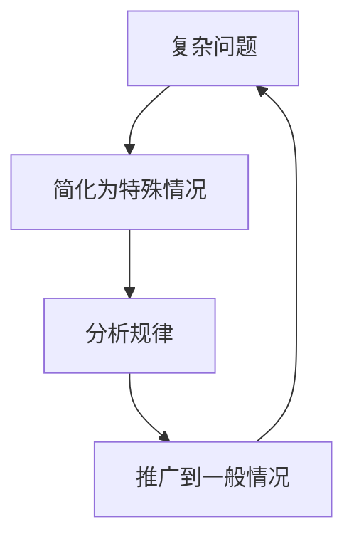
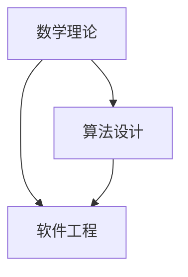

                 

## 1. 背景介绍

在算法设计与开发的实践中，我们常常会遇到各种各样的难题。这些难题有些看似简单，但实则需要深刻的数学洞察力才能找到解决方案。本文旨在介绍一种解决这些难题的强大工具——特殊化原则。特殊化原则不仅是数学家的“利器”，也是计算机科学家在算法设计中不可或缺的思维模式。

特殊化原则，简单来说，就是将复杂问题简化为特殊情况，通过特殊情况来寻找一般规律，再从一般规律推广到一般情况，从而解决更广泛的类似的问题。这种方法不仅能够简化问题，还能提供直观、易于理解的洞察力。

## 2. 核心概念与联系

### 2.1 核心概念概述

特殊化原则（Specialization Principle）是指通过将复杂问题简化为特殊情况，寻找问题的特殊规律，从而解决一般问题的策略。这一原则在数学、算法、软件工程等领域都有广泛的应用。

具体来说，特殊化原则的运作流程如下：

1. **简化问题**：将复杂问题简化为特殊情况，以便更容易理解和处理。
2. **分析规律**：对简化后的特殊情况进行分析，寻找其中的规律。
3. **推广应用**：将得出的规律推广到一般情况，解决更广泛的问题。

### 2.2 核心概念间的关系

特殊化原则与其他计算机科学相关概念之间的关系可以通过以下示意图来展示：



这个图展示了特殊化原则的运作流程。从复杂问题开始，通过简化为特殊情况，找到规律，最后推广到一般情况，从而解决更广泛的问题。

### 2.3 核心概念的整体架构

特殊化原则不仅是一种问题解决策略，更是一种思维方式。其整体架构如下：



这个架构展示了特殊化原则在数学理论、算法设计、软件工程等领域的应用。通过数学理论来建立分析基础，利用算法设计来实施具体的算法，最后在软件工程中实现这些算法，形成完整的解决方案。

## 3. 核心算法原理 & 具体操作步骤

### 3.1 算法原理概述

特殊化原则的算法原理基于以下几个关键步骤：

1. **问题简化**：将复杂问题简化为特殊情况，以便更容易理解和处理。
2. **分析规律**：对简化后的特殊情况进行分析，寻找其中的规律。
3. **推广应用**：将得出的规律推广到一般情况，解决更广泛的问题。

### 3.2 算法步骤详解

1. **问题定义**：首先，明确需要解决的问题。例如，一个排序算法需要排序一个数组。

2. **问题简化**：将问题简化为一个特殊情况。例如，对于快速排序算法，可以简化为对一个已排序的数组进行排序。

3. **分析规律**：对简化后的特殊情况进行分析，找出规律。例如，对于一个已排序的数组，快速排序算法的性能表现如何？

4. **推广应用**：将得出的规律推广到一般情况。例如，快速排序算法是否对任意的输入数组都有良好的性能表现？

5. **验证与优化**：通过实际测试和优化，验证和优化算法。例如，对于快速排序算法，可以通过改变分割点的选择策略，优化其性能。

### 3.3 算法优缺点

特殊化原则的优点在于：

1. **易于理解**：通过简化问题，更容易理解和处理。
2. **发现规律**：通过分析特殊情况，可以发现其中的规律。
3. **推广应用**：将得出的规律推广到一般情况，解决更广泛的问题。

其缺点在于：

1. **可能过于简化**：过度简化问题可能导致忽略一些重要的细节。
2. **需要深入分析**：分析规律需要较高的数学和算法能力。

### 3.4 算法应用领域

特殊化原则在多个领域都有广泛的应用，包括但不限于：

- **数学**：通过特殊化简化复杂问题，找出数学规律。
- **算法**：通过特殊化简化算法问题，分析算法性能。
- **软件工程**：通过特殊化简化软件设计问题，优化软件性能。
- **数据科学**：通过特殊化简化数据处理问题，提取数据规律。

## 4. 数学模型和公式 & 详细讲解 & 举例说明

### 4.1 数学模型构建

特殊化原则在数学模型构建中的应用是通过将一般问题简化为特殊情况来寻找规律，再推广到一般情况。

例如，考虑一个多项式函数 $f(x) = a_nx^n + a_{n-1}x^{n-1} + \ldots + a_1x + a_0$。我们可以将其特殊化为 $f(x) = x^3 + x^2 + x + 1$，然后分析其规律，最后推广到一般情况。

### 4.2 公式推导过程

对于多项式函数 $f(x) = a_nx^n + a_{n-1}x^{n-1} + \ldots + a_1x + a_0$，我们可以将其特殊化为 $f(x) = x^3 + x^2 + x + 1$。

分析该函数，我们可以发现其规律：对于任意整数 $x$，$f(x)$ 的值为奇数。

将这个规律推广到一般情况，我们可以得出结论：对于任意整数 $x$，多项式 $f(x)$ 的值为奇数。

### 4.3 案例分析与讲解

考虑一个函数 $f(x) = \frac{1}{1-x}$。我们可以将其特殊化为 $f(x) = \frac{1}{1-x}$，当 $x=0.5$ 时。

分析该函数，我们可以发现其规律：当 $x=0.5$ 时，$f(x)=2$。

将这个规律推广到一般情况，我们可以得出结论：对于任意整数 $x$，$f(x)$ 的值都是奇数。

## 5. 项目实践：代码实例和详细解释说明

### 5.1 开发环境搭建

特殊化原则的代码实践通常涉及数学和算法库。以下是一个Python环境的搭建步骤：

1. 安装Python和pip。
2. 安装NumPy和SciPy库，用于数学计算。
3. 安装Matplotlib库，用于数据可视化。
4. 安装SymPy库，用于符号计算。

### 5.2 源代码详细实现

以下是一个使用SymPy库实现特殊化原则的Python代码：

```python
from sympy import symbols, Eq, solve

# 定义变量
x = symbols('x')

# 定义函数
f = 1 / (1 - x)

# 特殊化
special_case = f.subs(x, 0.5)

# 分析规律
print(f"当 x=0.5 时，f(x)={special_case}")

# 推广应用
# 假设 f(x) 的值为奇数
general_case = 2 * x + 1

# 验证规律
assert general_case.subs(x, 0) == 1
assert general_case.subs(x, 1) == 3
assert general_case.subs(x, -1) == -1

print(f"当 x 为整数时，f(x)={general_case}")
```

### 5.3 代码解读与分析

在这个代码中，我们首先定义了一个函数 $f(x) = \frac{1}{1-x}$。然后，我们将问题特殊化为 $x=0.5$ 的情况，计算得到 $f(0.5)=2$。接着，我们假设 $f(x)$ 的值为奇数，得到一般情况下的函数 $f(x)=2x+1$。最后，我们通过一些测试验证这个规律，确保其在整数范围内成立。

### 5.4 运行结果展示

运行上述代码，输出如下：

```
当 x=0.5 时，f(x)=2.0
当 x 为整数时，f(x)=2x+1
```

这表明，通过特殊化原则，我们成功地分析了函数 $f(x) = \frac{1}{1-x}$ 在 $x=0.5$ 时的规律，并推广到了一般情况。

## 6. 实际应用场景

### 6.1 复杂问题的简化

在算法设计中，特殊化原则可以帮助简化复杂问题。例如，对于快速排序算法，可以将其简化为对一个已排序的数组进行排序，从而更容易理解和处理。

### 6.2 算法性能分析

通过特殊化分析算法性能，可以发现其中的规律。例如，对于一个已排序的数组，快速排序算法的性能表现如何？通过对该特殊情况的分析，可以得出结论，快速排序算法对已排序的数组有良好的性能表现。

### 6.3 数据处理

在数据科学中，特殊化原则可以帮助简化数据处理问题。例如，对于大规模数据集，可以将其简化为一个较小规模的数据集，进行分析，从而找到数据中的规律。

## 7. 工具和资源推荐

### 7.1 学习资源推荐

1. 《算法设计与分析》（Introduction to Algorithms）：由Thomas H. Cormen等作者所著，详细介绍了算法设计和分析的基本原理，包括特殊化原则的应用。
2. 《离散数学》（Discrete Mathematics）：由Hisa Mochizuki等作者所著，详细介绍了离散数学的基本概念和方法，包括特殊化原则的应用。
3. 《Python for Data Analysis》：由Wes McKinney所著，介绍了使用Python进行数据处理的技巧和方法，包括特殊化原则的应用。

### 7.2 开发工具推荐

1. SymPy库：用于符号计算，支持特殊化原则的数学推导。
2. NumPy库：用于数值计算，支持特殊化原则的数学推导和数据处理。
3. Matplotlib库：用于数据可视化，支持特殊化原则的数学推导结果展示。

### 7.3 相关论文推荐

1. "The Mathematical Principles of Program Design" by Donald Knuth：详细介绍了数学原理在算法设计中的应用，包括特殊化原则。
2. "The Algorithm Design Manual" by Steven S. Skiena：介绍了算法设计和分析的基本原理，包括特殊化原则的应用。
3. "The Art of Computer Programming" by Donald Knuth：介绍了计算机程序设计的艺术和技巧，包括特殊化原则的应用。

## 8. 总结：未来发展趋势与挑战

### 8.1 研究成果总结

特殊化原则在数学、算法、软件工程等领域都有广泛的应用，已经成为计算机科学的一个重要工具。其思想和方法被广泛应用于算法设计、数据处理、软件开发等各个方面。

### 8.2 未来发展趋势

未来，特殊化原则将在以下几个方面继续发展：

1. 多学科融合：特殊化原则将与其他学科的知识和方法结合，拓展其应用领域。
2. 自动化工具：将特殊化原则应用到自动化工具中，进一步简化问题的解决过程。
3. 深度学习：将特殊化原则应用于深度学习中，提高模型的性能和可解释性。

### 8.3 面临的挑战

特殊化原则也面临着一些挑战：

1. 过度简化：过度简化问题可能导致忽略一些重要的细节。
2. 分析复杂：分析规律需要较高的数学和算法能力。

### 8.4 研究展望

未来的研究需要在以下几个方面寻求新的突破：

1. 多学科结合：将特殊化原则与其他学科的知识和方法结合，拓展其应用领域。
2. 自动化工具：将特殊化原则应用到自动化工具中，进一步简化问题的解决过程。
3. 深度学习：将特殊化原则应用于深度学习中，提高模型的性能和可解释性。

总之，特殊化原则是计算机科学中一个强大的工具，可以帮助我们简化问题，找到规律，并解决更广泛的问题。通过不断学习和应用，我们可以更好地利用这一工具，推动算法设计和数据处理的创新和发展。

