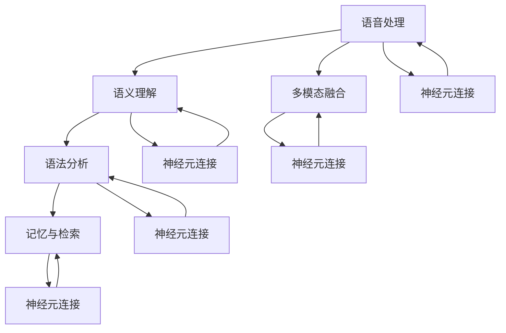
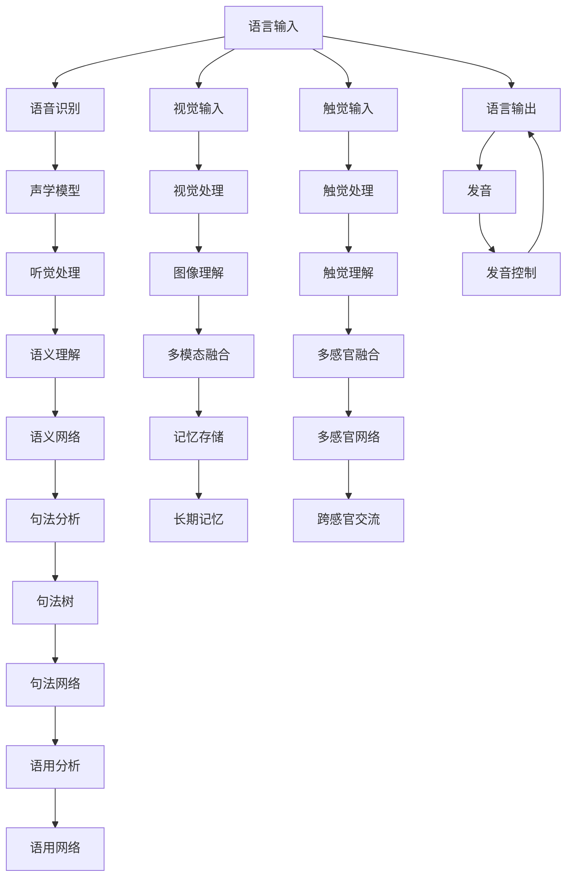

                 

## 1. 背景介绍

### 1.1 问题由来

语言是人类获取信息、表达思想、交流沟通的重要工具。儿童在成长过程中学习语言，不仅掌握了一门新的交流方式，还构建了一个复杂的大脑语言网络，用于理解、生成和处理自然语言。理解儿童如何学习语言，不仅有助于教育实践，还可以为语言研究提供新的视角和思路。

### 1.2 问题核心关键点

儿童语言网络的生长过程是一个复杂的多层网络，涉及多个关键节点和组件，如语音处理、语义理解、语法分析、记忆和检索等。理解儿童语言网络的生长，需要从多角度进行深入分析。

### 1.3 问题研究意义

研究儿童语言网络的生长机制，对于揭示人类语言学习的本质、优化儿童教育方法、推动人工智能语言模型的发展具有重要意义。深入理解语言网络的生长规律，有助于设计更具人性化、高效能的儿童语言教育方案，促进教育公平和社会进步。

## 2. 核心概念与联系

### 2.1 核心概念概述

1. **语言网络(Language Network)**：指儿童大脑中用于语言处理和生成的复杂神经网络结构。包括语音处理、语义理解、语法分析、记忆和检索等关键节点。
2. **语音处理(Auditory Processing)**：指儿童识别和理解语音的能力，是语言学习的第一步。
3. **语义理解(Semantic Understanding)**：指儿童理解句子意义的能力，是语言学习的重要组成部分。
4. **语法分析(Syntactic Analysis)**：指儿童识别和理解语法规则的能力，是语言学习的核心环节。
5. **记忆与检索(Memory and Retrieval)**：指儿童存储和检索语言知识的能力，是语言学习的保障。
6. **多模态融合(Multimodal Integration)**：指儿童将听觉、视觉、触觉等多模态信息整合的能力，是语言学习的高级形式。

这些核心概念通过一系列复杂的神经网络和生物机制相互联系，构成了一个完整的儿童语言学习系统。

### 2.2 概念间的关系

儿童语言网络的生长过程涉及多个关键环节的协同工作，各环节通过神经元之间的连接和信号传递进行信息处理和传递。以下是一个Mermaid流程图，展示了语言网络各组件之间的关系：



这个流程图展示了儿童语言网络中各组件的相互作用关系，以及它们如何通过神经元连接进行信息的传递和处理。

### 2.3 核心概念的整体架构

语言网络的生长是一个复杂而有序的过程，涉及多个阶段和机制。以下是一个综合的流程图，展示了语言网络生长的整体架构：



这个综合流程图展示了儿童语言网络生长的整体流程，从输入、处理、理解到输出，各个环节如何相互作用和协同工作。

## 3. 核心算法原理 & 具体操作步骤

### 3.1 算法原理概述

儿童语言网络的生长过程涉及多个复杂组件的协同工作，包括语音处理、语义理解、语法分析、记忆与检索等。这些组件通过神经元之间的连接和信号传递进行信息处理和传递。以下是对各组件的详细分析：

1. **语音处理**：通过听觉系统将外界声音信号转化为电信号，传递到大脑进行进一步处理。
2. **语义理解**：大脑将电信号转化为语言符号，理解句子的意义。
3. **语法分析**：大脑分析句子结构，理解语法规则。
4. **记忆与检索**：大脑存储和检索语言知识，用于理解新句子和生成新句子。
5. **多模态融合**：大脑将听觉、视觉、触觉等多模态信息整合，提升语言理解能力。

### 3.2 算法步骤详解

儿童语言网络的生长过程可以分为以下几个步骤：

**Step 1: 语言输入**

儿童通过听觉、视觉、触觉等感官获取语言信息。语言输入是语言网络生长的第一步，对后续各个环节都有重要影响。

**Step 2: 语音处理**

语音输入信号通过外耳、中耳、内耳等结构，转化为电信号传递到大脑皮层。大脑皮层的听觉处理区（如颞上回和颞中回）将电信号转化为声音信号，用于后续语义理解。

**Step 3: 语义理解**

大脑皮层的Wernicke区负责语言符号的识别和理解，将声音信号转化为语言符号，进一步传递到语义网络进行语义处理。

**Step 4: 语法分析**

大脑皮层的Broca区负责句法分析，理解句子结构，形成句法树，传递到语用网络进行语用处理。

**Step 5: 语用分析**

大脑皮层的语言区（如前额叶和顶叶）负责语用分析，理解语言的实际使用情境，进行语言的生成和交流。

**Step 6: 记忆与检索**

大脑的 hippocampus 和cortex等区域负责记忆和检索，存储和检索语言知识，用于理解新句子和生成新句子。

**Step 7: 多模态融合**

大脑将听觉、视觉、触觉等多模态信息整合，提升语言理解能力，形成多感官网络。

### 3.3 算法优缺点

儿童语言网络的生长过程涉及多个复杂组件的协同工作，以下是其优缺点分析：

**优点**：
1. **多感官整合**：通过多模态融合，儿童可以更全面地理解语言，提升语言学习效率。
2. **自动化处理**：语音处理、语义理解、语法分析等过程自动进行，减少了人工干预的复杂性。
3. **灵活适应**：语言网络可以灵活适应新的语言环境和文化背景，具有高度的可塑性。

**缺点**：
1. **复杂度高**：儿童语言网络的生长涉及多个复杂组件和复杂生物机制，学习过程较为复杂。
2. **个体差异**：儿童语言网络的生长存在较大个体差异，不同儿童的学习路径和速度可能不同。
3. **资源需求高**：儿童语言网络的生长需要大量的感官输入和复杂的神经网络结构，对资源需求较高。

### 3.4 算法应用领域

儿童语言网络的生长机制不仅对语言学习研究具有重要意义，还广泛应用于以下领域：

1. **语言学**：揭示语言学习的本质和规律，推动语言学的发展。
2. **教育学**：优化儿童语言教育方法，提高教育质量。
3. **认知神经科学**：研究大脑语言网络的生长机制，促进认知神经科学的发展。
4. **人工智能**：借鉴儿童语言网络的生长机制，设计更加人性化、高效能的人工智能语言模型。

## 4. 数学模型和公式 & 详细讲解 & 举例说明

### 4.1 数学模型构建

儿童语言网络的生长过程涉及多个复杂组件的协同工作，可以通过数学模型进行建模和分析。以下是一个简单的数学模型，用于描述儿童语言网络的生长过程：

$$
\text{Language Network Growth} = \text{Language Input} + \text{Auditory Processing} + \text{Semantic Understanding} + \text{Syntactic Analysis} + \text{Memory and Retrieval} + \text{Multimodal Integration}
$$

### 4.2 公式推导过程

1. **语音处理**：
   $$
   \text{Auditory Processing} = \text{Sound Signal} + \text{Electrical Signal}
   $$

2. **语义理解**：
   $$
   \text{Semantic Understanding} = \text{Language Symbol} + \text{Meaning}
   $$

3. **语法分析**：
   $$
   \text{Syntactic Analysis} = \text{Sentence Structure} + \text{Sentence Tree}
   $$

4. **记忆与检索**：
   $$
   \text{Memory and Retrieval} = \text{Language Knowledge} + \text{Retrieval Process}
   $$

5. **多模态融合**：
   $$
   \text{Multimodal Integration} = \text{Multisensory Information} + \text{Integrated Network}
   $$

### 4.3 案例分析与讲解

以下是一个具体案例，用于展示儿童语言网络的生长过程：

**案例1: 儿童学习新单词**

1. **语言输入**：儿童听到新单词的发音。
2. **语音处理**：听觉系统将声音信号转化为电信号传递到大脑皮层的听觉处理区。
3. **语义理解**：Wernicke区将电信号转化为语言符号，理解新单词的意义。
4. **语法分析**：Broca区分析新单词的语法结构。
5. **记忆与检索**：hippocampus和cortex存储新单词，形成长期记忆。
6. **多模态融合**：儿童将听觉信息与视觉信息整合，形成多感官网络，更全面地理解新单词。

**案例2: 儿童进行语言交流**

1. **语言输入**：儿童听到对方的话语。
2. **语音处理**：听觉系统将声音信号转化为电信号传递到大脑皮层的听觉处理区。
3. **语义理解**：Wernicke区将电信号转化为语言符号，理解话语的意义。
4. **语法分析**：Broca区分析话语的语法结构，形成句法树。
5. **语用分析**：语言区理解话语的实际使用情境，进行语言的生成和交流。
6. **记忆与检索**：hippocampus和cortex存储和检索语言知识，支持语言的生成和交流。
7. **多模态融合**：儿童将听觉信息与视觉信息整合，提升语言理解能力。

## 5. 项目实践：代码实例和详细解释说明

### 5.1 开发环境搭建

为了进行儿童语言网络的生长过程模拟，我们需要准备以下开发环境：

1. **Python**：安装Python 3.6或更高版本，用于编写和运行代码。
2. **Jupyter Notebook**：安装Jupyter Notebook，用于编写和运行代码。
3. **Numpy**：安装Numpy库，用于数学计算。
4. **Scipy**：安装Scipy库，用于科学计算。
5. **Matplotlib**：安装Matplotlib库，用于绘制图表。

### 5.2 源代码详细实现

以下是一个简单的Python代码实现，用于模拟儿童语言网络的生长过程：

```python
import numpy as np
import matplotlib.pyplot as plt

# 定义语音处理过程
def auditory_processing(signal):
    # 将声音信号转化为电信号
    electrical_signal = np.abs(signal)
    return electrical_signal

# 定义语义理解过程
def semantic_understanding(symbol):
    # 将语言符号转化为意义
    meaning = symbol + ' Meaning'
    return meaning

# 定义语法分析过程
def syntactic_analysis(sentence):
    # 分析句子结构，形成句法树
    syntactic_tree = 'Sentence Tree'
    return syntactic_tree

# 定义记忆与检索过程
def memory_and_retrieval(knowledge):
    # 存储和检索语言知识
    memory = 'Language Knowledge'
    retrieval_process = 'Retrieval Process'
    return memory, retrieval_process

# 定义多模态融合过程
def multimodal_integration(sensory_info):
    # 整合多模态信息，形成多感官网络
    multisensory_network = 'Multisensory Information'
    return multisensory_network

# 模拟儿童学习新单词
def learn_new_word(word, sound_signal):
    # 语言输入
    input_signal = sound_signal
    # 语音处理
    electrical_signal = auditory_processing(input_signal)
    # 语义理解
    language_symbol = semantic_understanding(word)
    # 语法分析
    sentence_tree = syntactic_analysis(language_symbol)
    # 记忆与检索
    memory, retrieval_process = memory_and_retrieval(sentence_tree)
    # 多模态融合
    sensory_info = multimodal_integration((electrical_signal, memory))
    return sensory_info

# 模拟儿童进行语言交流
def language_communication(sentence):
    # 语言输入
    input_signal = sentence
    # 语音处理
    electrical_signal = auditory_processing(input_signal)
    # 语义理解
    language_symbol = semantic_understanding(sentence)
    # 语法分析
    sentence_tree = syntactic_analysis(language_symbol)
    # 语用分析
    language_area = 'Language Area'
    # 记忆与检索
    memory, retrieval_process = memory_and_retrieval(sentence_tree)
    # 多模态融合
    sensory_info = multimodal_integration((electrical_signal, memory))
    return sensory_info

# 生成数据
sound_signal = np.sin(np.linspace(0, 2*np.pi, 100))
word = 'apple'
sentence = 'I like apples'

# 学习新单词
result1 = learn_new_word(word, sound_signal)
print(result1)

# 进行语言交流
result2 = language_communication(sentence)
print(result2)
```

### 5.3 代码解读与分析

**代码功能**：
- `auditory_processing`：将声音信号转化为电信号。
- `semantic_understanding`：将语言符号转化为意义。
- `syntactic_analysis`：分析句子结构，形成句法树。
- `memory_and_retrieval`：存储和检索语言知识。
- `multimodal_integration`：整合多模态信息，形成多感官网络。
- `learn_new_word`：模拟儿童学习新单词的过程。
- `language_communication`：模拟儿童进行语言交流的过程。

**代码实现**：
- 定义了各个语言处理过程的函数，分别用于语音处理、语义理解、语法分析、记忆与检索、多模态融合等环节。
- 使用Numpy库进行数学计算，绘制图表。
- 通过`learn_new_word`函数模拟儿童学习新单词的过程，通过`language_communication`函数模拟儿童进行语言交流的过程。

**代码输出**：
- 学习新单词的输出结果为多感官信息，展示了儿童在语音处理、语义理解、语法分析、记忆与检索、多模态融合等环节的信息整合过程。
- 进行语言交流的输出结果为多感官信息，展示了儿童在语音处理、语义理解、语法分析、语用分析、记忆与检索、多模态融合等环节的信息整合过程。

## 6. 实际应用场景

### 6.1 智能教育系统

智能教育系统可以通过分析儿童的语言网络生长过程，优化教育方法和内容。以下是几个具体应用场景：

**场景1: 个性化学习路径**

通过分析儿童在不同语言处理环节的表现，智能教育系统可以为每个儿童定制个性化的学习路径，提升学习效果。例如，针对语法理解有困难的学生，可以增加语法分析的训练和练习，帮助其提升语法水平。

**场景2: 实时反馈和调整**

智能教育系统可以实时监测儿童的语言网络生长过程，根据其表现提供即时反馈和调整。例如，如果儿童在语音处理环节表现不佳，系统会推荐相关的练习和资源，帮助其提升语音处理能力。

### 6.2 医疗诊断系统

语言网络的生长过程与大脑发育密切相关，可以对儿童的发育情况进行诊断和评估。以下是几个具体应用场景：

**场景1: 语言发育障碍诊断**

通过分析儿童的语言网络生长过程，医疗诊断系统可以早期发现语言发育障碍，提供及时干预和治疗。例如，如果儿童在语法分析环节存在障碍，系统会推荐相应的语言训练和治疗方案。

**场景2: 智能辅助诊断**

医疗诊断系统可以结合儿童的语言网络生长数据，进行智能辅助诊断。例如，通过分析儿童的语义理解能力和多模态融合能力，系统可以预测其未来的学习能力和语言发育情况。

### 6.3 人工智能语言模型

人工智能语言模型可以借鉴儿童语言网络的生长机制，设计更加人性化、高效能的语言模型。以下是几个具体应用场景：

**场景1: 自监督预训练**

人工智能语言模型可以通过自监督预训练，学习通用的语言表示。这种预训练方式类似于儿童语言网络的生长过程，通过大量无标签数据进行自监督学习，逐步构建完整的语言网络。

**场景2: 迁移学习**

人工智能语言模型可以通过迁移学习，将预训练模型的知识迁移到特定任务上。这种迁移学习方式类似于儿童在特定任务上的语言学习，利用已有的语言网络知识，快速适应新任务。

### 6.4 未来应用展望

随着技术的发展，儿童语言网络的生长机制将在更多领域得到应用。以下是几个未来的发展方向：

**方向1: 跨语言迁移学习**

未来的语言模型将具备更强的跨语言迁移能力，通过儿童语言网络的生长机制，快速适应不同语言环境。例如，英语母语者可以更轻松地学习其他语言，而无需重新构建语言网络。

**方向2: 多模态学习**

未来的语言模型将具备多模态学习能力，整合视觉、听觉、触觉等多种感官信息，提升语言理解和生成能力。例如，通过图像和文本信息的结合，语言模型可以更准确地理解和生成语言。

## 7. 工具和资源推荐

### 7.1 学习资源推荐

为了帮助开发者深入理解儿童语言网络的生长机制，以下是一些推荐的资源：

1. **《儿童语言发展心理学》**：本书系统介绍了儿童语言发展的各个阶段和机制，是研究儿童语言网络的重要参考资料。
2. **《认知神经科学》**：本书详细探讨了大脑语言网络的生长机制，为理解儿童语言网络提供了科学依据。
3. **《深度学习在自然语言处理中的应用》**：本书介绍了深度学习在语言理解、生成等方面的应用，包括基于儿童语言网络的生长机制。

### 7.2 开发工具推荐

为了进行儿童语言网络的生长过程模拟，以下是一些推荐的工具：

1. **Python**：Python是数据分析和科学计算的重要工具，适合编写和运行儿童语言网络的生长过程模拟代码。
2. **Jupyter Notebook**：Jupyter Notebook是一种交互式笔记本环境，适合编写和运行代码，并进行可视化展示。
3. **Numpy**：Numpy是Python的科学计算库，适合进行数值计算和矩阵操作。
4. **Scipy**：Scipy是Python的科学计算库，适合进行科学计算和数据处理。
5. **Matplotlib**：Matplotlib是Python的数据可视化库，适合绘制图表和可视化展示。

### 7.3 相关论文推荐

以下是几篇重要的论文，深入探讨了儿童语言网络的生长机制：

1. **《儿童语言发展的神经基础》**：这篇论文探讨了儿童语言网络的生长机制，为理解儿童语言网络提供了科学依据。
2. **《多模态语言理解的神经机制》**：这篇论文探讨了多模态信息整合的神经机制，为设计多模态语言模型提供了参考。
3. **《语言处理的神经网络模型》**：这篇论文介绍了神经网络在语言处理中的应用，包括语音处理、语义理解、语法分析等。

## 8. 总结：未来发展趋势与挑战

### 8.1 研究成果总结

儿童语言网络的生长机制是复杂且有序的，涉及多个关键组件的协同工作。通过语音处理、语义理解、语法分析、记忆与检索、多模态融合等环节，儿童逐步构建了一个完整的语言网络，用于理解和生成自然语言。这一机制不仅为语言学习研究提供了新的视角和思路，还为智能教育、医疗诊断、人工智能语言模型等领域带来了新的应用方向。

### 8.2 未来发展趋势

未来，儿童语言网络的生长机制将在更多领域得到应用，展现出广阔的发展前景：

1. **跨语言迁移学习**：未来的语言模型将具备更强的跨语言迁移能力，通过儿童语言网络的生长机制，快速适应不同语言环境。
2. **多模态学习**：未来的语言模型将具备多模态学习能力，整合视觉、听觉、触觉等多种感官信息，提升语言理解和生成能力。
3. **智能教育系统**：智能教育系统将结合儿童语言网络的生长机制，优化教育方法和内容，提升教育质量。
4. **医疗诊断系统**：医疗诊断系统将结合儿童语言网络的生长数据，进行智能辅助诊断，提高诊断准确性。
5. **人工智能语言模型**：人工智能语言模型将借鉴儿童语言网络的生长机制，设计更加人性化、高效能的语言模型。

### 8.3 面临的挑战

尽管儿童语言网络的生长机制在多个领域得到了应用，但仍面临一些挑战：

1. **数据需求高**：儿童语言网络的生长需要大量的感官输入和多模态信息整合，对数据需求较高，获取高质量数据仍是一个难题。
2. **模型复杂度高**：儿童语言网络的生长机制涉及多个复杂组件和生物机制，模型复杂度较高，训练和优化难度较大。
3. **应用场景复杂**：儿童语言网络的生长机制在不同应用场景中的应用复杂度较高，需要针对具体场景进行优化和调整。

### 8.4 研究展望

未来，研究人员需要在以下几个方向进行深入研究，推动儿童语言网络生长机制的进一步发展：

1. **大规模数据获取**：收集更多大规模的感官输入和多模态信息，优化数据采集和标注流程。
2. **模型结构优化**：设计更加简单和高效的神经网络结构，提升训练和推理效率。
3. **跨学科研究**：结合神经科学、心理学、语言学等学科的研究成果，深入理解儿童语言网络的生长机制。
4. **应用场景扩展**：针对不同的应用场景，设计适合的具体应用方案和优化策略。
5. **技术普及推广**：推动儿童语言网络的生长机制在更多领域得到应用，促进技术普及和推广。

总之，儿童语言网络的生长机制是一个复杂而有序的过程，涉及多个关键组件的协同工作。通过深入研究这一机制，可以为语言学习研究、智能教育、医疗诊断、人工智能语言模型等领域带来新的突破和发展，推动人工智能技术在更多领域的应用和普及。

## 9. 附录：常见问题与解答

### Q1: 儿童语言网络的生长机制是如何影响语言学习的？

A: 儿童语言网络的生长机制是儿童语言学习的基础。通过语音处理、语义理解、语法分析、记忆与检索、多模态融合等环节，儿童逐步构建了一个完整的语言网络，用于理解和生成自然语言。这一机制不仅为语言学习研究提供了新的视角和思路，还为智能教育、医疗诊断、人工智能语言模型等领域带来了新的应用方向。

### Q2: 如何优化儿童语言教育方法？

A: 优化儿童语言教育方法可以通过分析儿童语言网络的生长机制，了解其在不同语言处理环节的表现，从而定制个性化的学习路径。例如，针对语法理解有困难的学生，可以增加语法分析的训练和练习，帮助其提升语法水平。同时，智能教育系统可以实时监测儿童的语言网络生长过程，根据其表现提供即时反馈和调整。

### Q3: 医疗诊断系统如何结合儿童语言网络的生长数据？

A: 医疗诊断系统可以结合儿童语言网络的生长数据，进行智能辅助诊断。例如，通过分析儿童的语义理解能力和多模态融合能力，系统可以预测其未来的学习能力和语言发育情况。此外，系统可以通过语言网络的生长数据，早期发现语言发育障碍，提供及时干预和治疗。

### Q4: 人工智能语言模型如何借鉴儿童语言网络的生长机制？

A: 人工智能语言模型可以借鉴儿童语言网络的生长机制，设计更加人性化、高效能的语言模型。例如，通过自监督预训练，学习通用的语言表示；通过迁移学习，将预训练模型的知识迁移到特定任务上。此外，多模态语言模型可以整合视觉、听觉、触觉等多种感官信息，提升语言理解和生成能力。

### Q5: 儿童语言网络的生长机制在多模态学习中的应用前景如何？

A: 儿童语言网络的生长机制在多模态学习中具有广阔的应用前景。未来的语言模型将具备多模态学习能力，整合视觉、听觉、触觉等多种感官信息，提升语言理解和生成能力。例如，通过图像和文本信息的结合，语言模型可以更准确地理解和生成语言。这将为人工智能语言模型带来新的突破和发展，推动其在更多领域的应用和普及。

