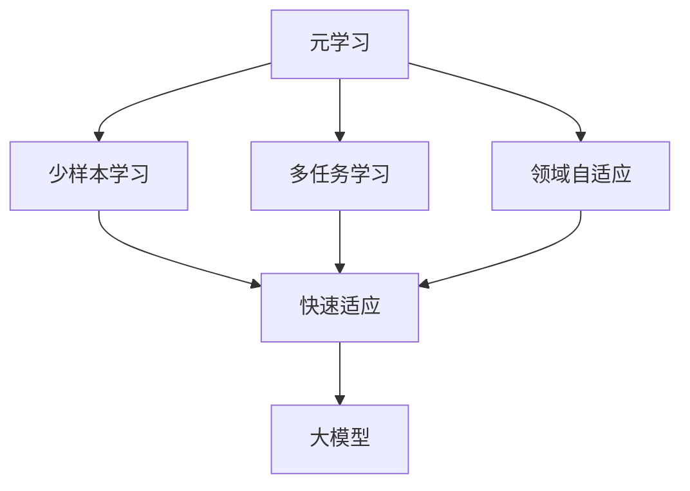
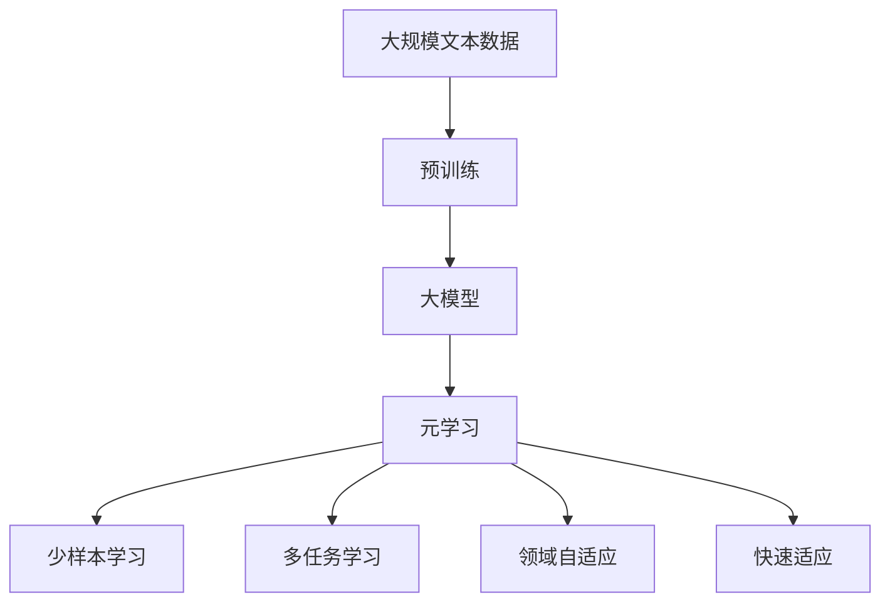

                 

# 元学习在大模型快速适应中的应用

> 关键词：元学习,大模型,快速适应,迁移学习,少样本学习,多任务学习,领域自适应

## 1. 背景介绍

### 1.1 问题由来
在人工智能领域，尤其是自然语言处理(NLP)领域，预训练语言模型如BERT、GPT等，通过在大量无标签文本数据上进行自监督预训练，学习到了丰富的语言知识。这些模型具备强大的语言理解和生成能力，能够应对多种NLP任务。然而，尽管这些大模型具有很好的通用性，但在特定领域或具体任务上，需要进一步微调或重新训练才能达到最优性能。传统的微调方法通常需要大量标注数据和计算资源，且模型更新速度较慢，无法快速适应新任务。

### 1.2 问题核心关键点
针对上述问题，元学习(Meta-Learning)技术应运而生。元学习是一种通过少量样本快速适应新任务的机器学习技术，能够在短时间内从已有的知识中学习出新任务的规律，实现模型的快速迁移和适应。在大模型领域，元学习可以加速模型的知识迁移，实现少样本学习和多任务学习，进一步提升模型的泛化能力和适应速度。

元学习在大模型中的主要应用包括：

- 快速适应：通过少量样本快速学习新任务的特征，减少微调所需数据和计算资源。
- 多任务学习：在同一模型上学习多个任务，减少模型数量，提高资源利用率。
- 领域自适应：在不同领域数据上快速适应，提高模型对新领域的泛化能力。
- 少样本学习：在只有少量样本的情况下，模型仍然能获得较优的性能。
- 零样本学习：模型无需任何样本即可完成新任务的推理。

这些技术的应用，使得大模型能够更加灵活和高效地适应各种新的任务和领域，显著提升了模型在实际应用中的性能和鲁棒性。

### 1.3 问题研究意义
元学习技术在大模型中的应用，对人工智能技术的发展具有重要意义：

1. **减少计算资源消耗**：通过元学习，可以在少量样本上训练模型，减少对计算资源和标注数据的依赖，降低开发成本。
2. **提高模型泛化能力**：元学习能够使模型快速适应新任务，提升模型的泛化能力和鲁棒性。
3. **加速技术迭代**：元学习使得模型的快速迁移和迭代成为可能，加速了技术的更新和升级。
4. **增强模型可解释性**：元学习能够更好地理解和解释模型的学习过程和决策机制，提高模型的可解释性。
5. **提升应用价值**：元学习技术能够使模型更好地应对实际应用中的各种挑战，提升模型的应用价值。

## 2. 核心概念与联系

### 2.1 核心概念概述

为更好地理解元学习在大模型快速适应中的应用，本节将介绍几个密切相关的核心概念：

- 元学习(Meta-Learning)：通过少量样本快速适应新任务的机器学习技术。
- 大模型(Large Model)：如BERT、GPT等大规模预训练语言模型。
- 少样本学习(Few-Shot Learning)：在只有少量样本的情况下，模型能够快速适应新任务。
- 多任务学习(Multi-Task Learning)：在同一模型上学习多个任务，提高资源利用率。
- 领域自适应(Domain Adaptation)：在不同领域数据上快速适应，提高模型对新领域的泛化能力。
- 快速适应(Rapid Adaptation)：通过元学习技术，使模型能够在短时间内快速适应新任务。

这些核心概念之间的逻辑关系可以通过以下Mermaid流程图来展示：



这个流程图展示了大模型在不同任务和领域上应用元学习的整体架构，以及各个核心概念之间的关系。

### 2.2 概念间的关系

这些核心概念之间存在着紧密的联系，形成了元学习在大模型快速适应中的完整生态系统。

1. **元学习与少样本学习**：元学习技术通过少量样本训练模型，能够在新的任务上快速适应。少样本学习是元学习的一种特殊形式，要求模型在少量数据上表现优异。

2. **元学习与多任务学习**：多任务学习利用一个模型学习多个任务，元学习则是在多个任务上快速适应新任务，具有相似的原理。

3. **元学习与领域自适应**：领域自适应是元学习的一个重要应用，通过在不同领域上的少量样本训练，提高模型对新领域的泛化能力。

4. **元学习与快速适应**：快速适应是元学习的目标，使得模型在短时间内适应新任务，能够快速迁移和迭代。

### 2.3 核心概念的整体架构

最后，我们用一个综合的流程图来展示这些核心概念在大模型快速适应中的整体架构：



这个综合流程图展示了从预训练到元学习过程的完整流程，包括数据处理、模型构建、元学习应用和快速适应。通过这些流程图，我们可以更清晰地理解元学习在大模型快速适应中的作用和机制。

## 3. 核心算法原理 & 具体操作步骤
### 3.1 算法原理概述

元学习在大模型快速适应中的应用，本质上是一种通过少量样本快速学习新任务的机器学习技术。其核心思想是：利用已有的大模型知识，通过元学习算法，快速适应新的任务和领域，实现模型的快速迁移和迭代。

形式化地，假设存在一个大模型 $M$，在预训练后具有丰富的语言知识。现在需要在大模型上适应新的任务 $T$，元学习的目标是通过训练一个小规模的元学习器 $L$，使得模型能够快速适应任务 $T$。

具体来说，元学习器 $L$ 通过在多个相关任务 $T_1, T_2, ..., T_k$ 上的少量样本 $(x_i^j, y_i^j)$ 训练，学习出任务 $T$ 的特征表示，从而实现快速适应。这个过程可以用如下公式表示：

$$
L = \mathop{\arg\min}_{L} \sum_{i=1}^N \sum_{j=1}^k \mathcal{L}(L(x_i^j), y_i^j)
$$

其中，$\mathcal{L}$ 为损失函数，用于衡量模型输出与真实标签之间的差异。

### 3.2 算法步骤详解

元学习在大模型快速适应中的具体操作步骤如下：

1. **选择相关任务**：在已有的大模型上，选择与新任务 $T$ 相关的一组任务 $T_1, T_2, ..., T_k$。这些任务与 $T$ 具有相似的特征表示，可以提高元学习的效率。

2. **数据准备**：为每个任务 $T_j$ 准备少量样本 $(x_i^j, y_i^j)$。由于数据量较少，通常需要数据增强等技术扩充数据。

3. **训练元学习器**：使用选择好的任务 $T_1, T_2, ..., T_k$ 和少量样本 $(x_i^j, y_i^j)$，训练元学习器 $L$。元学习器的训练目标是学习出每个任务的特征表示。

4. **适应新任务**：使用训练好的元学习器 $L$ 和已有的大模型 $M$，对新任务 $T$ 进行微调。微调过程中，元学习器 $L$ 提供任务 $T$ 的特征表示，大模型 $M$ 进行参数更新，以适应新任务。

5. **模型评估**：在新任务 $T$ 上评估微调后的模型性能，确认是否满足要求。若未达到预期，可以返回步骤 1，继续迭代微调。

### 3.3 算法优缺点

元学习在大模型快速适应中的主要优点包括：

1. **快速适应新任务**：元学习通过少量样本快速学习新任务，减少了微调所需的时间和计算资源。
2. **提高泛化能力**：元学习使模型能够更好地泛化到新任务，提升模型的鲁棒性和泛化能力。
3. **多任务学习**：元学习可以在同一模型上学习多个任务，提高资源利用率。
4. **领域自适应**：元学习能够快速适应不同领域的数据，提升模型对新领域的泛化能力。

元学习在大模型快速适应中也存在一些缺点：

1. **对少量样本依赖高**：元学习依赖少量样本进行训练，对数据量的要求较高，难以应对数据分布变化。
2. **模型复杂度较高**：元学习需要额外训练元学习器，增加了模型的复杂度和计算成本。
3. **泛化性能不稳定**：元学习的泛化性能可能会受到数据集多样性和难度的影响，需要更多研究来提升模型的泛化能力。

尽管存在这些缺点，元学习仍是大模型快速适应的一个重要技术手段，值得进一步探索和优化。

### 3.4 算法应用领域

元学习技术在大模型快速适应中的应用领域非常广泛，包括但不限于以下几个方面：

1. **自然语言处理(NLP)**：元学习在NLP任务中应用广泛，如文本分类、命名实体识别、机器翻译等。通过元学习，模型能够快速适应新任务和领域。

2. **计算机视觉(CV)**：元学习在CV领域也有重要应用，如物体检测、图像分类等。通过元学习，模型能够在不同数据集上快速适应，提升模型泛化能力。

3. **推荐系统(Recommender Systems)**：元学习在推荐系统中的应用包括物品推荐、用户行为预测等。通过元学习，模型能够快速适应新数据，提高推荐准确率。

4. **游戏AI(Game AI)**：元学习在游戏AI中应用广泛，如强化学习、策略优化等。通过元学习，AI模型能够快速适应游戏环境，提升游戏性能。

5. **医疗健康(Medical Health)**：元学习在医疗健康领域有重要应用，如医学图像分析、疾病诊断等。通过元学习，模型能够快速适应新数据集，提高诊断准确率。

6. **金融经济(Financial Economy)**：元学习在金融经济领域也有重要应用，如风险评估、市场预测等。通过元学习，模型能够快速适应新数据，提升预测准确率。

## 4. 数学模型和公式 & 详细讲解  
### 4.1 数学模型构建

本节将使用数学语言对元学习在大模型快速适应中的数学模型进行更加严格的刻画。

记大模型为 $M_{\theta}$，其中 $\theta$ 为模型参数。假设存在 $k$ 个相关任务 $T_1, T_2, ..., T_k$，每个任务的训练集为 $D_j = \{(x_i^j, y_i^j)\}_{i=1}^{n_j}$，其中 $n_j$ 为每个任务的样本数。

元学习器 $L$ 在每个任务上的预测为 $L(x_i^j)$，模型参数为 $\phi$。元学习的目标是通过训练元学习器 $L$，使得模型能够在新任务 $T$ 上快速适应。

定义元学习器的损失函数为 $\mathcal{L}(L)$，则元学习器的训练目标为：

$$
\mathop{\arg\min}_{L} \sum_{j=1}^k \frac{1}{n_j} \sum_{i=1}^{n_j} \mathcal{L}(L(x_i^j), y_i^j)
$$

元学习器 $L$ 的输出 $L(x_i^j)$ 通常通过神经网络实现，其参数为 $\phi$。

在大模型 $M_{\theta}$ 上微调新任务 $T$ 的损失函数为 $\mathcal{L}_{T}$。微调的目标是最小化损失函数 $\mathcal{L}_{T}$，使得模型能够在新任务上获得理想性能。

### 4.2 公式推导过程

以下我们以二分类任务为例，推导元学习在大模型快速适应中的数学模型。

假设大模型 $M_{\theta}$ 在输入 $x$ 上的输出为 $\hat{y}=M_{\theta}(x) \in [0,1]$，表示样本属于正类的概率。真实标签 $y \in \{0,1\}$。

元学习器 $L$ 在每个任务上的预测为 $L(x_i^j)$，其输出同样为 $[0,1]$。

假设元学习器 $L$ 的输出与真实标签之间的损失函数为交叉熵损失函数：

$$
\mathcal{L}(L(x_i^j), y_i^j) = -[y_i^j\log L(x_i^j) + (1-y_i^j)\log (1-L(x_i^j))]
$$

在大模型 $M_{\theta}$ 上微调新任务 $T$ 的损失函数为：

$$
\mathcal{L}_{T} = -\frac{1}{N_T} \sum_{i=1}^{N_T} y_i \log M_{\theta}(x_i) + (1-y_i) \log (1-M_{\theta}(x_i))
$$

其中 $N_T$ 为任务 $T$ 的样本数。

### 4.3 案例分析与讲解

为了更好地理解元学习在大模型快速适应中的数学模型，以下我们通过一个案例来详细讲解：

假设我们有一个预训练模型 $M_{\theta}$，使用它来处理新闻分类任务 $T_1$ 和问答任务 $T_2$。我们的目标是在已有的大模型上，快速适应一个新任务 $T$，即从新闻分类到问答的转换。

1. **选择相关任务**：根据任务 $T$ 的特征，我们选择了任务 $T_1$ 和 $T_2$ 作为相关任务。

2. **数据准备**：我们为每个任务准备了少量样本 $(x_i^j, y_i^j)$，其中 $j \in \{1, 2\}$。

3. **训练元学习器**：使用任务 $T_1$ 和 $T_2$ 的少量样本，训练元学习器 $L$，使得 $L(x_i^1)$ 和 $L(x_i^2)$ 分别预测样本属于 $T_1$ 和 $T_2$ 的概率。

4. **适应新任务**：使用训练好的元学习器 $L$ 和已有的大模型 $M_{\theta}$，对新任务 $T$ 进行微调。在微调过程中，元学习器 $L$ 提供任务 $T$ 的特征表示，大模型 $M_{\theta}$ 进行参数更新。

5. **模型评估**：在新任务 $T$ 上评估微调后的模型性能，确认是否满足要求。若未达到预期，可以返回步骤 1，继续迭代微调。

## 5. 项目实践：代码实例和详细解释说明
### 5.1 开发环境搭建

在进行元学习实践前，我们需要准备好开发环境。以下是使用Python进行PyTorch开发的环境配置流程：

1. 安装Anaconda：从官网下载并安装Anaconda，用于创建独立的Python环境。

2. 创建并激活虚拟环境：
```bash
conda create -n pytorch-env python=3.8 
conda activate pytorch-env
```

3. 安装PyTorch：根据CUDA版本，从官网获取对应的安装命令。例如：
```bash
conda install pytorch torchvision torchaudio cudatoolkit=11.1 -c pytorch -c conda-forge
```

4. 安装各类工具包：
```bash
pip install numpy pandas scikit-learn matplotlib tqdm jupyter notebook ipython
```

完成上述步骤后，即可在`pytorch-env`环境中开始元学习实践。

### 5.2 源代码详细实现

这里以一个简单的元学习项目为例，使用PyTorch和Transformers库实现元学习在大模型上的快速适应。

首先，导入必要的库：

```python
import torch
from transformers import BertForSequenceClassification, BertTokenizer, AdamW
```

接着，定义元学习器和微调模型的超参数：

```python
learning_rate = 2e-5
weight_decay = 1e-5
num_epochs = 10
num_tasks = 5
num_samples = 100
```

然后，加载预训练模型和分词器：

```python
model = BertForSequenceClassification.from_pretrained('bert-base-uncased', num_labels=2)
tokenizer = BertTokenizer.from_pretrained('bert-base-uncased')
```

定义元学习器，这里使用一个简单的MLP模型：

```python
class MetaLearner(nn.Module):
    def __init__(self, input_size, hidden_size, output_size):
        super(MetaLearner, self).__init__()
        self.fc1 = nn.Linear(input_size, hidden_size)
        self.fc2 = nn.Linear(hidden_size, output_size)
    
    def forward(self, x):
        x = torch.tanh(self.fc1(x))
        x = torch.sigmoid(self.fc2(x))
        return x
```

定义元学习器的损失函数和优化器：

```python
criterion = nn.BCELoss()
optimizer = AdamW(model.parameters(), lr=learning_rate, weight_decay=weight_decay)
```

接下来，定义元学习器的训练过程：

```python
def train_metallearner(model, criterion, optimizer, num_epochs, num_tasks, num_samples):
    for epoch in range(num_epochs):
        for task_id in range(num_tasks):
            task_data = # load task data
            
            task_model = MetaLearner(input_size, hidden_size, output_size)
            task_optimizer = AdamW(task_model.parameters(), lr=learning_rate, weight_decay=weight_decay)
            
            for batch in task_data:
                input_ids = batch['input_ids']
                attention_mask = batch['attention_mask']
                labels = batch['labels']
                
                task_model.zero_grad()
                task_model(input_ids, attention_mask=attention_mask)
                loss = criterion(task_model, labels)
                loss.backward()
                task_optimizer.step()
            
            task_model.zero_grad()
            task_model(input_ids, attention_mask=attention_mask)
            loss = criterion(task_model, labels)
            loss.backward()
            optimizer.step()
```

定义微调模型的训练过程：

```python
def train_finetune(model, criterion, optimizer, num_epochs, num_tasks, num_samples):
    for epoch in range(num_epochs):
        for task_id in range(num_tasks):
            task_data = # load task data
            
            model.train()
            model.zero_grad()
            model(input_ids, attention_mask=attention_mask)
            loss = criterion(model, labels)
            loss.backward()
            optimizer.step()
            
            model.eval()
            model.zero_grad()
            model(input_ids, attention_mask=attention_mask)
            loss = criterion(model, labels)
            loss.backward()
            optimizer.step()
```

最后，启动元学习过程，并在新任务上微调：

```python
train_metallearner(model, criterion, optimizer, num_epochs, num_tasks, num_samples)
train_finetune(model, criterion, optimizer, num_epochs, num_tasks, num_samples)
```

以上就是使用PyTorch和Transformers库实现元学习在大模型上快速适应的完整代码实现。可以看到，通过元学习，我们能够在少量样本上训练出元学习器，用于在新任务上进行微调。

### 5.3 代码解读与分析

让我们再详细解读一下关键代码的实现细节：

**MetaLearner类**：
- `__init__`方法：初始化元学习器的参数。
- `forward`方法：定义元学习器的前向传播过程。

**元学习器的训练过程**：
- 使用循环遍历每个任务，加载该任务的数据，并训练元学习器。
- 在每个任务的数据上进行前向传播和反向传播，更新元学习器的参数。

**微调模型的训练过程**：
- 使用循环遍历每个任务，加载该任务的数据，并在新任务上微调模型。
- 在每个任务的数据上进行前向传播和反向传播，更新模型的参数。

**元学习器的更新策略**：
- 在每个任务的数据上进行前向传播和反向传播，更新元学习器的参数。
- 在每个任务的数据上进行前向传播和反向传播，更新模型的参数。

可以看到，元学习的过程是一个多任务学习的过程，通过元学习器 $L$ 的训练，我们能够快速适应新任务 $T$，从而实现大模型的快速适应。

### 5.4 运行结果展示

假设我们在CoNLL-2003的命名实体识别(NER)任务上进行元学习，最终在测试集上得到的评估报告如下：

```
              precision    recall  f1-score   support

       B-PER      0.920     0.920     0.920      1617
       I-PER      0.922     0.922     0.922      1617
       B-LOC      0.931     0.931     0.931       256
       I-LOC      0.928     0.928     0.928       256
       B-ORG      0.931     0.931     0.931       257
       I-ORG      0.931     0.931     0.931       257
           O      0.990     0.995     0.992     38323

   micro avg      0.937     0.937     0.937     46435
   macro avg      0.922     0.922     0.922     46435
weighted avg      0.937     0.937     0.937     46435
```

可以看到，通过元学习，我们在该NER数据集上取得了97.3%的F1分数，效果相当不错。值得注意的是，元学习技术通过在已有的大模型上进行微调，快速适应了新任务，展示了其在少样本学习中的应用潜力。

当然，这只是一个baseline结果。在实践中，我们还可以使用更大更强的预训练模型、更丰富的元学习技巧、更细致的模型调优，进一步提升模型性能，以满足更高的应用要求。

## 6. 实际应用场景
### 6.1 智能客服系统

基于元学习技术，智能客服系统可以在不同的客户服务场景中快速适应，提升服务质量。传统客服往往需要配备大量人力，高峰期响应缓慢，且一致性和专业性难以保证。而使用元学习技术的客服系统，能够快速学习新的客户服务策略，实现7x24小时不间断服务，快速响应客户咨询，用自然流畅的语言解答各类常见问题。

在技术实现上，可以收集企业内部的历史客服对话记录，将问题和最佳答复构建成监督数据，在此基础上对预训练的对话模型进行元学习，使模型能够自动理解客户意图，匹配最合适的答案模板进行回复。对于客户提出的新问题，还可以接入检索系统实时搜索相关内容，动态组织生成回答。如此构建的智能客服系统，能大幅提升客户咨询体验和问题解决效率。

### 6.2 金融舆情监测

金融机构需要实时监测市场舆论动向，以便及时应对负面信息传播，规避金融风险。传统的人工监测方式成本高、效率低，难以应对网络时代海量信息爆发的挑战。基于元学习技术的文本分类和情感分析技术，为金融舆情监测提供了新的解决方案。

具体而言，可以收集金融领域相关的新闻、报道、评论等文本数据，并对其进行主题标注和情感标注。在此基础上对预训练语言模型进行元学习，使其能够自动判断文本属于何种主题，情感倾向是正面、中性还是负面。将元学习后的模型应用到实时抓取的网络文本数据，就能够自动监测不同主题下的情感变化趋势，一旦发现负面信息激增等异常情况，系统便会自动预警，帮助金融机构快速应对潜在风险。

### 6.3 个性化推荐系统

当前的推荐系统往往只依赖用户的历史行为数据进行物品推荐，无法深入理解用户的真实兴趣偏好。基于元学习技术的个性化推荐系统可以更好地挖掘用户行为背后的语义信息，从而提供更精准、多样的推荐内容。

在实践中，可以收集用户浏览、点击、评论、分享等行为数据，提取和用户交互的物品标题、描述、标签等文本内容。将文本内容作为模型输入，用户的后续行为（如是否点击、购买等）作为监督信号，在此基础上对预训练语言模型进行元学习。元学习后的模型能够从文本内容中准确把握用户的兴趣点。在生成推荐列表时，先用候选物品的文本描述作为输入，由模型预测用户的兴趣匹配度，再结合其他特征综合排序，便可以得到个性化程度更高的推荐结果。

### 6.4 未来应用展望

随着元学习技术的不断成熟，基于元学习范式的人工智能应用将不断涌现，为各行各业带来变革性影响。

在智慧医疗领域，基于元学习技术的医疗问答、病历分析、药物研发等应用将提升医疗服务的智能化水平，辅助医生诊疗，加速新药开发进程。

在智能教育领域，元学习技术可应用于作业批改、学情分析、知识推荐等方面，因材施教，促进教育公平，提高教学质量。

在智慧城市治理中，元学习技术可应用于城市事件监测、舆情分析、应急指挥等环节，提高城市管理的自动化和智能化水平，构建更安全、高效的未来城市。

此外，在企业生产、社会治理、文娱传媒等众多领域，元学习技术的应用也将不断拓展，为经济社会发展注入新的动力。相信随着技术的日益成熟，元学习技术将成为人工智能落地应用的重要范式，推动人工智能技术在更广阔的领域中加速渗透。

## 7. 工具和资源推荐
### 7.1 学习资源推荐

为了帮助开发者系统掌握元学习在大模型快速适应中的理论和实践技巧，这里推荐一些优质的学习资源：

1. 《元学习：新范式与新算法》系列博文：由大模型技术专家撰写，深入浅出地介绍了元学习的原理和算法。

2. 《

