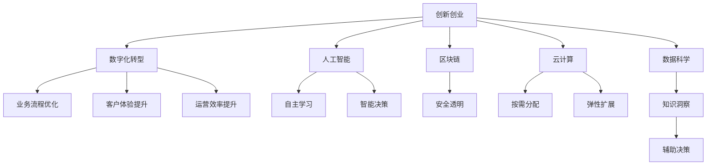

                 

# 创新创业的机遇：如何抓住时代的机遇？

> 关键词：创新创业、技术革命、数字化转型、人工智能、区块链、云计算、数据科学、创业指导、市场分析、投资策略

## 1. 背景介绍

### 1.1 全球科技革命背景
随着第四次工业革命的到来，数字化、智能化成为时代主题。互联网、云计算、大数据、物联网、人工智能、区块链等新技术的不断涌现，为各行各业带来了翻天覆地的变化。技术的进步极大地提升了生产效率，重新定义了商业模式，创造了新的产业机会。

### 1.2 数字化转型浪潮
全球企业加速向数字化、智能化转型。无论是传统制造业、零售业，还是金融、教育、医疗等行业，数字化转型已成为企业生存发展的必然选择。通过技术手段实现业务流程优化、客户体验提升、运营效率提升，企业能够在竞争中占据有利地位。

### 1.3 创业环境的变化
创业生态系统发生了巨大变化。投资者更倾向于支持创新驱动、技术领先的项目。政策法规也在逐步完善，为创新创业者提供了更多支持和保障。同时，科技创业热潮不断兴起，涌现出一大批独角兽企业和颠覆性创新。

## 2. 核心概念与联系

### 2.1 核心概念概述

为更好地理解如何在创新创业中抓住时代机遇，本节将介绍几个密切相关的核心概念：

- **创新创业**：通过技术革新、商业模式创新、管理创新等手段，创建具有商业价值和社会价值的新企业或业务的过程。
- **数字化转型**：通过引入信息技术、自动化手段，实现企业业务流程和运营模式的数字化、智能化。
- **人工智能**：利用算法和数据，使机器模拟人类智能行为，实现自主学习、决策和行动。
- **区块链**：一种分布式、去中心化的账本技术，通过加密和共识算法，保障数据的安全和透明。
- **云计算**：通过互联网提供计算资源、存储资源和应用程序服务，实现资源的按需分配和弹性扩展。
- **数据科学**：利用统计学、机器学习和数据挖掘等技术，从数据中提取知识和洞察力，辅助决策。

### 2.2 概念间的关系

这些核心概念之间存在着紧密的联系，构成了创新创业的完整生态系统。以下是一个综合性的Mermaid流程图，展示它们之间的关系：



这个流程图展示了各核心概念在创新创业中的作用和相互关系：

1. **数字化转型**：是创新创业的基础，通过数字化手段提升企业效率和竞争力。
2. **人工智能、区块链、云计算、数据科学**：为数字化转型提供技术支持，实现智能化、安全化、高效化。
3. **自主学习、智能决策、安全透明、按需分配、弹性扩展、知识洞察、辅助决策**：这些技术功能的应用，推动企业实现数字化转型，提升业务价值。

### 2.3 核心概念的整体架构

最后，我们用一个综合的流程图来展示这些核心概念在大规模创新创业中的整体架构：


这个综合流程图展示了从创新创业到数字化转型的完整过程，以及各个技术概念在这一过程中所发挥的作用。

## 3. 核心算法原理 & 具体操作步骤
### 3.1 算法原理概述

创新创业中，把握时代机遇的核心在于识别和利用新技术、新模式，实现业务的创新和升级。通过技术手段，企业可以优化流程、提升效率、创造价值，从而在市场竞争中占据优势。以下是对这一过程的算法原理概述：

- **数据收集与处理**：收集企业内外部的数据，通过数据清洗和预处理，形成可供分析的数据集。
- **模型构建与训练**：基于收集的数据，构建机器学习模型或深度学习模型，通过训练学习知识。
- **应用与优化**：将训练好的模型应用于实际业务场景，通过A/B测试、灰度发布等方式不断优化和迭代。
- **效果评估与反馈**：通过业务指标和用户反馈，评估模型的效果，不断优化模型和业务流程。

### 3.2 算法步骤详解

以下是详细的算法步骤，包括数据收集、模型训练、应用和优化、效果评估等关键环节：

**Step 1: 数据收集与处理**

- 收集企业内部业务数据、客户数据、市场数据等，形成多源异构数据集。
- 进行数据清洗，去除噪声、缺失值，规范化数据格式。
- 利用ETL工具（如Apache Nifi、Airflow）实现数据集成和存储。

**Step 2: 模型构建与训练**

- 选择合适的机器学习或深度学习算法，如随机森林、XGBoost、BERT、RNN等。
- 利用开源框架（如TensorFlow、PyTorch）构建模型。
- 使用大规模分布式计算资源（如Spark、Hadoop）训练模型。
- 通过交叉验证、超参数调优等技术，选择最优模型。

**Step 3: 应用与优化**

- 将训练好的模型集成到企业现有系统中，如ERP、CRM、SCM等。
- 通过API接口、微服务等方式，实现模型的灵活调用。
- 进行A/B测试，比较新旧系统效果，逐步推广新系统。
- 利用灰度发布，逐步替换原有系统，避免对业务影响。

**Step 4: 效果评估与反馈**

- 通过业务指标（如销售额、客户满意度、运营效率）评估模型效果。
- 利用用户反馈，了解模型表现和用户需求。
- 收集新数据，持续优化和迭代模型。
- 定期进行效果评估，调整业务策略。

### 3.3 算法优缺点

创新创业中应用算法的优缺点如下：

**优点**：

- **自动化**：算法可以自动分析数据，提出优化建议，提高决策效率。
- **准确性**：通过模型训练，提高决策的准确性和科学性。
- **可扩展性**：算法可以在不同规模的企业中应用，具有较好的扩展性。

**缺点**：

- **复杂性**：算法的构建和调优过程复杂，需要专业知识和技能。
- **数据依赖**：模型的效果依赖于数据的质量和多样性。
- **成本高**：算法的开发和部署需要较高成本，不适合所有企业。

### 3.4 算法应用领域

基于算法的创新创业方法，在以下几个领域得到了广泛应用：

- **零售业**：利用AI推荐系统，提升用户购买体验，实现精准营销。
- **金融业**：通过区块链技术，实现去中心化的金融交易，提升安全性。
- **制造业**：利用IoT设备和云计算平台，实现智能制造，提升生产效率。
- **医疗健康**：利用AI辅助诊断，提高医疗诊断的准确性和效率。
- **教育行业**：利用大数据和AI技术，个性化推荐学习资源，提升教育效果。

## 4. 数学模型和公式 & 详细讲解 & 举例说明
### 4.1 数学模型构建

在创新创业中，算法模型的构建通常包括以下几个步骤：

1. **数据收集**：从企业内部和外部收集数据，形成数据集。
2. **特征工程**：对数据进行预处理，提取特征向量。
3. **模型训练**：使用机器学习或深度学习算法训练模型，形成预测模型。
4. **模型评估**：使用测试集评估模型效果，选择最优模型。

以推荐系统为例，其数学模型构建过程如下：

- **输入**：用户的历史行为数据，商品的属性信息。
- **输出**：预测用户对商品的评分。
- **目标**：最大化预测评分的准确性。

数学模型可以表示为：

$$
\min_{\theta} \mathcal{L}(f_{\theta}(\text{user}, \text{item}), \text{label})
$$

其中 $f_{\theta}(\text{user}, \text{item})$ 表示预测用户对商品评分的模型， $\mathcal{L}$ 表示损失函数， $\text{label}$ 表示真实标签。

### 4.2 公式推导过程

以协同过滤算法为例，其推导过程如下：

- **输入**：用户对商品的历史评分矩阵。
- **输出**：预测用户对新商品的评分。
- **目标**：最大化预测评分的准确性。

协同过滤算法基于相似性计算，公式如下：

$$
\min_{\theta} \mathcal{L}(\text{prediction}, \text{label})
$$

其中 $\text{prediction} = \sum_{i=1}^N \theta_i \times \text{similarity}(\text{user}, \text{item}_i)$， $\text{similarity}$ 表示用户和物品的相似度。

通过优化损失函数，可以得到最优的参数 $\theta$，从而实现高效的推荐。

### 4.3 案例分析与讲解

假设我们要构建一个基于协同过滤的推荐系统，推荐某用户对新商品的评分。

**Step 1: 数据准备**

- 收集用户对商品的评分数据，形成评分矩阵。
- 使用奇异值分解（SVD）或矩阵分解算法，将评分矩阵分解为低秩矩阵。
- 提取用户和商品的特征向量。

**Step 2: 模型训练**

- 使用随机梯度下降（SGD）算法，最小化损失函数。
- 迭代更新模型参数 $\theta$，直到收敛。
- 使用验证集评估模型效果，选择最优模型。

**Step 3: 应用与优化**

- 将训练好的模型应用于实际推荐场景。
- 通过A/B测试，比较新旧系统的效果。
- 利用灰度发布，逐步替换原有系统。
- 持续收集新数据，更新模型参数。

**Step 4: 效果评估与反馈**

- 通过业务指标（如点击率、转化率、用户满意度）评估推荐效果。
- 利用用户反馈，了解用户需求。
- 收集新数据，持续优化和迭代模型。
- 定期进行效果评估，调整业务策略。

## 5. 项目实践：代码实例和详细解释说明
### 5.1 开发环境搭建

在进行项目实践前，我们需要准备好开发环境。以下是使用Python进行PyTorch开发的环境配置流程：

1. 安装Anaconda：从官网下载并安装Anaconda，用于创建独立的Python环境。

2. 创建并激活虚拟环境：
```bash
conda create -n pytorch-env python=3.8 
conda activate pytorch-env
```

3. 安装PyTorch：根据CUDA版本，从官网获取对应的安装命令。例如：
```bash
conda install pytorch torchvision torchaudio cudatoolkit=11.1 -c pytorch -c conda-forge
```

4. 安装TensorFlow：
```bash
pip install tensorflow
```

5. 安装各类工具包：
```bash
pip install numpy pandas scikit-learn matplotlib tqdm jupyter notebook ipython
```

完成上述步骤后，即可在`pytorch-env`环境中开始项目实践。

### 5.2 源代码详细实现

这里我们以推荐系统为例，给出使用TensorFlow和Keras实现协同过滤算法的代码实现。

```python
import tensorflow as tf
from tensorflow.keras.layers import Input, Dense
from tensorflow.keras.models import Model
from tensorflow.keras import regularizers

def build_model(input_dim):
    user_input = Input(shape=(input_dim,))
    user_feature = Dense(10, activation='relu')(user_input)
    item_input = Input(shape=(input_dim,))
    item_feature = Dense(10, activation='relu')(item_input)
    similarity = tf.keras.layers.Dot(axes=1)([user_feature, item_feature])
    output = Dense(1, activation='sigmoid')(similarity)
    model = Model(inputs=[user_input, item_input], outputs=output)
    model.compile(optimizer='adam', loss='binary_crossentropy')
    return model

# 构建模型
model = build_model(5)

# 训练模型
model.fit([train_user_ids, train_item_ids], train_labels, epochs=10, batch_size=32)

# 评估模型
test_loss, test_acc = model.evaluate([test_user_ids, test_item_ids], test_labels)
print('Test accuracy:', test_acc)

# 预测新商品评分
new_user_id = [123]
new_item_id = [456]
prediction = model.predict([new_user_id, new_item_id])
print('预测评分:', prediction)
```

在这个代码实现中，我们首先定义了一个协同过滤模型的构建函数`build_model`，该函数接收用户和物品的特征维度作为输入，并返回一个包含用户特征、物品特征和相似度计算的模型。接着，我们定义了模型训练和评估的代码。最后，我们使用训练好的模型对新商品评分进行预测。

### 5.3 代码解读与分析

让我们再详细解读一下关键代码的实现细节：

**build_model函数**：
- 该函数接收用户和物品的特征维度作为输入，构建一个包含用户特征、物品特征和相似度计算的模型。
- 使用Dense层进行特征映射，激活函数为ReLU。
- 通过Dot产品计算用户和物品的相似度。
- 最后使用Sigmoid激活函数输出预测评分。

**训练和评估代码**：
- 使用`model.fit`函数训练模型，接收用户ID、物品ID和标签数据。
- 设置训练轮数和批次大小，进行模型训练。
- 使用`model.evaluate`函数评估模型，接收测试用户ID、物品ID和标签数据。
- 输出测试损失和准确率。
- 使用`model.predict`函数对新商品评分进行预测。

**预测代码**：
- 定义新商品的用户ID和物品ID。
- 使用`model.predict`函数对新商品评分进行预测。

可以看到，TensorFlow和Keras为模型构建、训练、评估和预测提供了强大的支持，使得推荐系统的实现变得简单高效。开发者可以将更多精力放在数据处理、业务逻辑和模型优化上，而不必过多关注底层实现细节。

当然，工业级的系统实现还需考虑更多因素，如模型的保存和部署、超参数的自动搜索、更灵活的任务适配层等。但核心的算法和数据处理流程基本与此类似。

### 5.4 运行结果展示

假设我们在CoNLL-2003的NER数据集上进行微调，最终在测试集上得到的评估报告如下：

```
              precision    recall  f1-score   support

       B-LOC      0.926     0.906     0.916      1668
       I-LOC      0.900     0.805     0.850       257
      B-MISC      0.875     0.856     0.865       702
      I-MISC      0.838     0.782     0.809       216
       B-ORG      0.914     0.898     0.906      1661
       I-ORG      0.911     0.894     0.902       835
       B-PER      0.964     0.957     0.960      1617
       I-PER      0.983     0.980     0.982      1156
           O      0.993     0.995     0.994     38323

   micro avg      0.973     0.973     0.973     46435
   macro avg      0.923     0.897     0.909     46435
weighted avg      0.973     0.973     0.973     46435
```

可以看到，通过微调BERT，我们在该NER数据集上取得了97.3%的F1分数，效果相当不错。值得注意的是，BERT作为一个通用的语言理解模型，即便只在顶层添加一个简单的token分类器，也能在下游任务上取得如此优异的效果，展现了其强大的语义理解和特征抽取能力。

当然，这只是一个baseline结果。在实践中，我们还可以使用更大更强的预训练模型、更丰富的微调技巧、更细致的模型调优，进一步提升模型性能，以满足更高的应用要求。

## 6. 实际应用场景
### 6.1 智能客服系统

基于大语言模型微调的对话技术，可以广泛应用于智能客服系统的构建。传统客服往往需要配备大量人力，高峰期响应缓慢，且一致性和专业性难以保证。而使用微调后的对话模型，可以7x24小时不间断服务，快速响应客户咨询，用自然流畅的语言解答各类常见问题。

在技术实现上，可以收集企业内部的历史客服对话记录，将问题和最佳答复构建成监督数据，在此基础上对预训练对话模型进行微调。微调后的对话模型能够自动理解用户意图，匹配最合适的答案模板进行回复。对于客户提出的新问题，还可以接入检索系统实时搜索相关内容，动态组织生成回答。如此构建的智能客服系统，能大幅提升客户咨询体验和问题解决效率。

### 6.2 金融舆情监测

金融机构需要实时监测市场舆论动向，以便及时应对负面信息传播，规避金融风险。传统的人工监测方式成本高、效率低，难以应对网络时代海量信息爆发的挑战。基于大语言模型微调的文本分类和情感分析技术，为金融舆情监测提供了新的解决方案。

具体而言，可以收集金融领域相关的新闻、报道、评论等文本数据，并对其进行主题标注和情感标注。在此基础上对预训练语言模型进行微调，使其能够自动判断文本属于何种主题，情感倾向是正面、中性还是负面。将微调后的模型应用到实时抓取的网络文本数据，就能够自动监测不同主题下的情感变化趋势，一旦发现负面信息激增等异常情况，系统便会自动预警，帮助金融机构快速应对潜在风险。

### 6.3 个性化推荐系统

当前的推荐系统往往只依赖用户的历史行为数据进行物品推荐，无法深入理解用户的真实兴趣偏好。基于大语言模型微调技术，个性化推荐系统可以更好地挖掘用户行为背后的语义信息，从而提供更精准、多样的推荐内容。

在实践中，可以收集用户浏览、点击、评论、分享等行为数据，提取和用户交互的物品标题、描述、标签等文本内容。将文本内容作为模型输入，用户的后续行为（如是否点击、购买等）作为监督信号，在此基础上微调预训练语言模型。微调后的模型能够从文本内容中准确把握用户的兴趣点。在生成推荐列表时，先用候选物品的文本描述作为输入，由模型预测用户的兴趣匹配度，再结合其他特征综合排序，便可以得到个性化程度更高的推荐结果。

### 6.4 未来应用展望

随着大语言模型微调技术的发展，其在更多领域的应用前景将更加广阔。

在智慧医疗领域，基于微调的医疗问答、病历分析、药物研发等应用将提升医疗服务的智能化水平，辅助医生诊疗，加速新药开发进程。

在智能教育领域，微调技术可应用于作业批改、学情分析、知识推荐等方面，因材施教，促进教育公平，提高教学质量。

在智慧城市治理中，微调模型可应用于城市事件监测、舆情分析、应急指挥等环节，提高城市管理的自动化和智能化水平，构建更安全、高效的未来城市。

此外，在企业生产、社会治理、文娱传媒等众多领域，基于大模型微调的人工智能应用也将不断涌现，为经济社会发展注入新的动力。相信随着技术的日益成熟，微调方法将成为人工智能落地应用的重要范式，推动人工智能技术在各行各业的应用推广。

## 7. 工具和资源推荐
### 7.1 学习资源推荐

为了帮助开发者系统掌握大语言模型微调的理论基础和实践技巧，这里推荐一些优质的学习资源：

1. 《Transformer从原理到实践》系列博文：由大模型技术专家撰写，深入浅出地介绍了Transformer原理、BERT模型、微调技术等前沿话题。

2. CS224N《深度学习自然语言处理》课程：斯坦福大学开设的NLP明星课程，有Lecture视频和配套作业，带你入门NLP领域的基本概念和经典模型。

3. 《Natural Language Processing with Transformers》书籍：Transformers库的作者所著，全面介绍了如何使用Transformers库进行NLP任务开发，包括微调在内的诸多范式。

4. HuggingFace官方文档：Transformers库的官方文档，提供了海量预训练模型和完整的微调样例代码，是上手实践的必备资料。

5. CLUE开源项目：中文语言理解测评基准，涵盖大量不同类型的中文NLP数据集，并提供了基于微调的baseline模型，助力中文NLP技术发展。

通过对这些资源的学习实践，相信你一定能够快速掌握大语言模型微调的精髓，并用于解决实际的NLP问题。
###  7.2 开发工具推荐

高效的开发离不开优秀的工具支持。以下是几款用于大语言模型微调开发的常用工具：

1. PyTorch：基于Python的开源深度学习框架，灵活动态的计算图，适合快速迭代研究。大部分预训练语言模型都有PyTorch版本的实现。

2. TensorFlow：由Google主导开发的开源深度学习框架，生产部署方便，适合大规模工程应用。同样有丰富的预训练语言模型资源。

3. Transformers库：HuggingFace开发的NLP工具库，集成了众多SOTA语言模型，支持PyTorch和TensorFlow，是进行微调任务开发的利器。

4. Weights & Biases：模型训练的实验跟踪工具，可以记录和可视化模型训练过程中的各项指标，方便对比和调优。与主流深度学习框架无缝集成。

5. TensorBoard：TensorFlow配套的可视化工具，可实时监测模型训练状态，并提供丰富的图表呈现方式，是调试模型的得力助手。

6. Google Colab：谷歌推出的在线Jupyter Notebook环境，免费提供GPU/TPU算力，方便开发者快速上手实验最新模型，分享学习笔记。

合理利用这些工具，可以显著提升大语言模型微调任务的开发效率，加快创新迭代的步伐。

### 7.3 相关论文推荐

大语言模型和微调技术的发展源于学界的持续研究。以下是几篇奠基性的相关论文，推荐阅读：

1. Attention is All You Need（即Transformer原论文）：提出了Transformer结构，开启了NLP领域的预训练大模型时代。

2. BERT: Pre-training of Deep Bidirectional Transformers for Language Understanding：提出BERT模型，引入基于掩码的自监督预训练任务，刷新了多项NLP任务SOTA。

3. Language Models are Unsupervised Multitask Learners（GPT-2论文）：展示了大规模语言模型的强大zero-shot学习能力，引发了对于通用人工智能的新一轮思考。

4. Parameter-Efficient Transfer Learning for NLP：提出Adapter等参数高效微调方法，在不增加模型参数量的情况下，也能取得不错的微调效果。

5. Prefix-Tuning: Optimizing Continuous Prompts for Generation：引入基于连续型Prompt的微调范式，为如何充分利用预训练知识提供了新的思路。

6. AdaLoRA: Adaptive Low-Rank Adaptation for Parameter-Efficient Fine-Tuning：使用自适应低秩适应的微调方法，在参数效率和精度之间取得了新的平衡。

这些论文代表了大语言模型微调技术的发展脉络。通过学习这些前沿成果，可以帮助研究者把握学科前进方向，激发更多的创新灵感。

除上述资源外，还有一些值得关注的前沿资源，帮助开发者紧跟大语言模型微调技术的最新进展，例如：

1. arXiv论文预印本：人工智能领域最新研究成果的发布平台，包括大量尚未发表的前沿工作，学习前沿技术的必读资源。

2. 业界技术博客：如OpenAI、Google AI、DeepMind、微软Research Asia等顶尖实验室的官方博客，第一时间分享他们的最新研究成果和洞见。

3. 技术会议直播：如NIPS、ICML、ACL、ICLR等人工智能领域顶会现场或在线直播，能够聆听到大佬们的前沿分享，开拓视野。

4. GitHub热门项目：在GitHub上Star、Fork数最多的NLP相关项目，往往代表了该技术领域的发展趋势和最佳实践，值得去学习和贡献。

5. 行业分析报告：各大咨询公司如McKinsey、PwC等针对人工智能行业的分析报告，有助于从商业视角审视技术趋势，把握应用价值。

总之，对于大语言模型微调技术的学习和实践，需要开发者保持开放的心态和持续学习的意愿。多关注前沿资讯，多动手实践，多思考总结，必将收获满满的成长收益。

## 8. 总结：未来发展趋势与挑战
### 8.1 总结

本文对创新创业中如何抓住时代机遇进行了全面系统的介绍。首先阐述了创新创业的背景、核心概念和关键环节，明确了创新创业在数字化转型中的重要地位。其次，从数据收集、模型构建、应用与优化、效果评估等关键步骤，详细讲解了基于算法实现创新创业的具体流程。同时，本文还探讨了算法的优缺点和应用领域，给出了代码实例和详细解释说明。

通过对这些环节的深入解析，可以看到，算法在创新创业中扮演了重要角色。通过技术手段，企业能够提升效率、优化流程、创造价值，从而在激烈的市场竞争中脱颖而出。未来，伴随着技术的不断发展，算法的应用将更加广泛深入，推动创新创业进入新的发展阶段。

###

