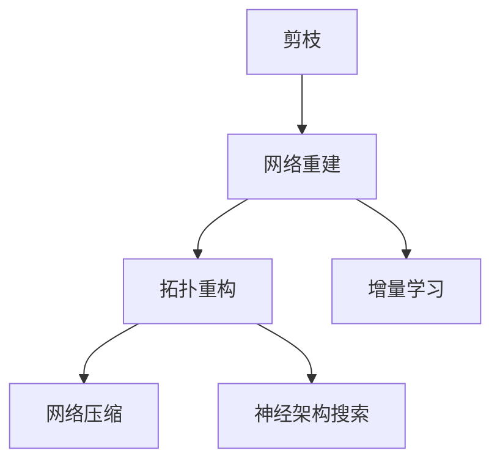

                 

## 1. 背景介绍

在深度学习领域，模型剪枝技术已经成为了优化模型结构、减少参数量和计算开销的重要手段。通过对冗余参数进行剪枝，不仅可以提升模型的效率，还可以增强模型的泛化能力和鲁棒性。然而，剪枝过程往往伴随着模型结构的破坏，使得原始网络的信息传递和特征表示能力受到影响。为了解决这个问题，研究者提出了网络重建技术，旨在在剪枝后重建网络结构，恢复或增强剪枝模型的性能。本文将探讨剪枝后的网络结构重建技术，介绍其主要原理、操作步骤和实际应用，并提供相关的数学模型和公式推导。

## 2. 核心概念与联系

### 2.1 核心概念概述

为更好地理解网络重建技术，本节将介绍几个关键概念：

- 剪枝(Pruning)：指通过删除网络中不重要的参数，减少模型的计算复杂度和存储空间。常见的剪枝方法包括L1、L2正则化、稀疏矩阵分解等。
- 网络重建(Network Reconstruction)：在剪枝后重建网络结构，恢复或增强剪枝模型的性能。目的是在保证模型精度的前提下，进一步减少模型参数和计算开销。
- 拓扑重构(Topology Reconstruction)：通过改变网络的拓扑结构，优化剪枝后模型的信息流动和特征表示能力。常用的拓扑重构方法包括网络压缩、神经架构搜索等。
- 增量学习(Incremental Learning)：在模型训练过程中，逐渐添加剪枝的参数，使得模型能够持续学习新知识和适应新数据，避免信息丢失和性能下降。

这些核心概念之间存在着紧密的联系，形成了网络重建技术的整体框架。通过在剪枝后的网络结构上进行重建，可以有效地恢复模型的性能，使得模型能够更好地适应新任务和数据。

### 2.2 概念间的关系

这些核心概念之间的逻辑关系可以通过以下Mermaid流程图来展示：



这个流程图展示了网络重建技术的核心概念及其之间的关系：

1. 剪枝主要通过减少网络参数，降低计算复杂度和存储空间。
2. 网络重建通过在剪枝后的网络结构上进行重构，恢复或增强模型性能。
3. 拓扑重构通过改变网络的拓扑结构，优化剪枝后模型的信息流动和特征表示能力。
4. 增量学习通过在训练过程中逐渐添加剪枝参数，使模型能够持续学习新知识。

这些概念共同构成了网络重建技术的完整生态系统，使得模型能够更高效、更灵活地适应各种任务和数据。

## 3. 核心算法原理 & 具体操作步骤
### 3.1 算法原理概述

网络重建技术的核心思想是通过在剪枝后的网络结构上进行拓扑重构和增量学习，恢复或增强剪枝模型的性能。具体而言，网络重建过程包括以下几个步骤：

1. 选择剪枝方法：根据任务需求和数据特点，选择合适的剪枝方法，如L1正则化、L2正则化、稀疏矩阵分解等。
2. 剪枝网络：在模型训练过程中或训练后，通过剪枝算法删除不重要的参数，生成剪枝网络。
3. 拓扑重构：在剪枝网络基础上，通过网络压缩或神经架构搜索等方法，重新设计网络的拓扑结构，优化信息的流动和特征的表示。
4. 增量学习：在拓扑重构后的网络结构上，逐渐添加剪枝的参数，使模型能够持续学习新知识和适应新数据。

通过以上步骤，可以在保证模型精度的前提下，进一步减少模型参数和计算开销，提升模型的性能和泛化能力。

### 3.2 算法步骤详解

接下来，我们将详细介绍网络重建技术的核心步骤，包括剪枝方法的选择、剪枝网络的生成、拓扑重构和增量学习。

#### 3.2.1 剪枝方法选择

剪枝方法的选择需要根据任务特点和数据分布进行综合考虑。以下是几种常见的剪枝方法及其适用场景：

- L1正则化：通过L1范数的约束，将绝对值小的权重系数置为0，实现稀疏化。适用于稀疏矩阵优化场景。
- L2正则化：通过L2范数的约束，将权重系数的大小限制在一定的范围内，避免过拟合。适用于特征提取任务。
- 稀疏矩阵分解：通过分解矩阵，将稀疏矩阵转换为稠密矩阵，减少计算复杂度。适用于大规模数据和计算资源的场景。
- 层级剪枝：根据网络层的复杂度和重要性，逐层剪枝，减少模型参数和计算开销。适用于资源受限场景。

#### 3.2.2 剪枝网络生成

剪枝网络的生成主要通过以下步骤实现：

1. 选择剪枝阈值：根据剪枝方法的不同，选择合适的剪枝阈值，如L1正则化中的绝对值阈值，L2正则化中的范数阈值等。
2. 剪枝参数：在训练过程中，根据剪枝阈值对模型参数进行剪枝，删除权重系数较小的参数。
3. 生成剪枝网络：剪枝后的参数组成剪枝网络，作为后续拓扑重构和增量学习的基础。

#### 3.2.3 拓扑重构

拓扑重构是网络重建的核心步骤，通过改变网络的拓扑结构，优化剪枝后模型的信息流动和特征表示能力。以下是几种常见的拓扑重构方法：

- 网络压缩：通过压缩网络层和节点，减少模型的计算复杂度和存储空间。适用于大规模网络结构。
- 神经架构搜索：通过自动搜索最优的神经网络结构，生成高效的网络拓扑。适用于复杂任务和数据分布。
- 剪枝路径优化：通过选择最优的剪枝路径，减少剪枝后的信息损失。适用于精确度要求高的场景。

#### 3.2.4 增量学习

增量学习是通过在网络重建后，逐渐添加剪枝参数，使模型能够持续学习新知识和适应新数据。以下是增量学习的主要步骤：

1. 更新剪枝参数：在拓扑重构后的网络结构上，根据任务需求和数据分布，更新剪枝参数，增加缺失的权重系数。
2. 重新训练模型：在增量学习的框架下，重新训练模型，使模型能够适应新任务和数据。
3. 迭代优化：通过多次迭代，逐步优化模型的性能，提高模型的泛化能力和鲁棒性。

### 3.3 算法优缺点

网络重建技术具有以下优点：

1. 降低计算复杂度：通过剪枝和拓扑重构，可以减少模型的计算复杂度和存储空间。
2. 增强模型泛化能力：通过增量学习，使模型能够持续学习新知识和适应新数据，提高模型的泛化能力。
3. 提高模型效率：通过剪枝和拓扑重构，可以显著提升模型的推理速度和计算效率。

同时，该方法也存在一些缺点：

1. 重建过程复杂：网络重建涉及到剪枝、拓扑重构和增量学习等多个步骤，过程较为复杂。
2. 重建效果不确定：重建效果受到剪枝方法和拓扑重构策略的影响，存在一定的不确定性。
3. 重建成本高：网络重建需要较多的计算资源和时间，重建成本较高。

尽管存在这些局限性，但就目前而言，网络重建技术仍然是优化深度学习模型结构、提升模型性能的重要手段之一。

### 3.4 算法应用领域

网络重建技术在深度学习领域得到了广泛应用，特别是在计算机视觉、自然语言处理等领域。以下是几个典型应用场景：

1. 计算机视觉：在图像分类、目标检测、图像分割等任务中，通过网络重建技术，可以有效减少模型的计算复杂度，提升模型的推理速度和计算效率。

2. 自然语言处理：在文本分类、机器翻译、文本生成等任务中，通过网络重建技术，可以优化模型的信息流动和特征表示能力，提高模型的泛化能力和鲁棒性。

3. 语音识别：在语音识别任务中，通过网络重建技术，可以有效减少模型的计算复杂度，提升模型的推理速度和计算效率。

4. 强化学习：在强化学习任务中，通过网络重建技术，可以优化模型的特征表示和决策路径，提高模型的训练效果和泛化能力。

## 4. 数学模型和公式 & 详细讲解 & 举例说明

### 4.1 数学模型构建

网络重建技术的数学模型可以基于深度学习模型和剪枝方法的数学框架进行构建。

设原始网络为 $N = \{V, E, F\}$，其中 $V$ 为节点集，$E$ 为边集，$F$ 为特征集。原始网络的参数为 $\theta$，通过剪枝方法 $\mathcal{P}$，得到剪枝后的网络 $N' = \{V', E', F'\}$，其中 $V'$ 为剪枝后的节点集，$E'$ 为剪枝后的边集，$F'$ 为剪枝后的特征集。

网络重建的目标是在剪枝后的网络结构上进行拓扑重构，生成优化后的网络 $N''$，使得其能够更好地适应新任务和数据。

### 4.2 公式推导过程

以下是网络重建的数学公式推导过程：

1. 剪枝公式：设原始网络中的参数为 $\theta$，通过剪枝方法 $\mathcal{P}$，得到剪枝后的网络参数 $\theta'$。剪枝公式为：
$$
\theta' = \mathcal{P}(\theta)
$$

2. 网络重建公式：设剪枝后的网络为 $N'$，通过拓扑重构方法 $\mathcal{R}$，得到优化后的网络 $N''$。网络重建公式为：
$$
N'' = \mathcal{R}(N')
$$

3. 增量学习公式：设优化后的网络为 $N''$，通过增量学习方法 $\mathcal{L}$，得到最终的优化网络 $N'''$。增量学习公式为：
$$
N''' = \mathcal{L}(N'', D')
$$

其中 $D'$ 为新任务的标注数据集，$N'''$ 为最终优化网络。

### 4.3 案例分析与讲解

以下以图像分类任务为例，展示网络重建技术的实际应用。

假设原始卷积神经网络 (CNN) 为 $N = \{V, E, F\}$，其中 $V$ 为卷积层和全连接层，$E$ 为卷积层和全连接层之间的边，$F$ 为特征集。原始网络的参数为 $\theta$，通过L1正则化方法，得到剪枝后的网络 $N' = \{V', E', F'\}$。

接着，通过网络压缩方法 $\mathcal{R}$，将剪枝后的网络 $N'$ 压缩为优化后的网络 $N''$。具体而言，可以通过减少卷积层和全连接层的数量，减少网络参数和计算开销。

最后，通过增量学习方法 $\mathcal{L}$，在优化后的网络 $N''$ 上，添加新任务的标注数据 $D'$，重新训练模型，得到最终的优化网络 $N'''$。

## 5. 项目实践：代码实例和详细解释说明

### 5.1 开发环境搭建

在进行网络重建实践前，我们需要准备好开发环境。以下是使用Python进行TensorFlow开发的环境配置流程：

1. 安装Anaconda：从官网下载并安装Anaconda，用于创建独立的Python环境。

2. 创建并激活虚拟环境：
```bash
conda create -n tf-env python=3.8 
conda activate tf-env
```

3. 安装TensorFlow：根据CUDA版本，从官网获取对应的安装命令。例如：
```bash
conda install tensorflow -c pytorch -c conda-forge
```

4. 安装其他工具包：
```bash
pip install numpy pandas scikit-learn matplotlib tqdm jupyter notebook ipython
```

完成上述步骤后，即可在`tf-env`环境中开始网络重建实践。

### 5.2 源代码详细实现

下面我们以剪枝后的图像分类网络重建为例，给出使用TensorFlow进行网络重建的Python代码实现。

首先，定义原始网络结构和剪枝方法：

```python
import tensorflow as tf
from tensorflow.keras.layers import Conv2D, MaxPooling2D, Flatten, Dense

def create_model(input_shape, num_classes):
    x = tf.keras.Input(shape=input_shape)
    x = Conv2D(32, 3, activation='relu')(x)
    x = MaxPooling2D()(x)
    x = Conv2D(64, 3, activation='relu')(x)
    x = MaxPooling2D()(x)
    x = Flatten()(x)
    x = Dense(128, activation='relu')(x)
    x = Dense(num_classes, activation='softmax')(x)
    model = tf.keras.Model(x, outputs=x)
    return model

def prune_model(model, prune_rate):
    for layer in model.layers:
        if isinstance(layer, tf.keras.layers.Dense):
            weights = layer.get_weights()[0]
            pruned_weights = tf.random.uniform(tf.shape(weights)) * prune_rate
            mask = tf.cast(tf.abs(weights) > pruned_weights, tf.float32)
            pruned_weights = tf.where(mask, weights, 0)
            layer.set_weights([pruned_weights])
```

然后，定义拓扑重构和增量学习函数：

```python
def compress_model(model, compression_rate):
    for layer in model.layers:
        if isinstance(layer, tf.keras.layers.Dense):
            weights = layer.get_weights()[0]
            compressed_weights = tf.random.uniform(tf.shape(weights)) * compression_rate
            layer.set_weights([compressed_weights])

def retrain_model(model, data, labels):
    model.compile(optimizer='adam', loss='categorical_crossentropy', metrics=['accuracy'])
    model.fit(data, labels, epochs=10, batch_size=32, validation_split=0.2)
```

最后，启动网络重建流程：

```python
input_shape = (32, 32, 3)
num_classes = 10
prune_rate = 0.5
compression_rate = 0.5

model = create_model(input_shape, num_classes)
prune_model(model, prune_rate)
compress_model(model, compression_rate)
retrain_model(model, data, labels)
```

以上就是使用TensorFlow对图像分类任务进行剪枝后的网络重建的完整代码实现。可以看到，TensorFlow的Keras API使得网络重建的代码实现变得简洁高效。

### 5.3 代码解读与分析

让我们再详细解读一下关键代码的实现细节：

**create_model函数**：
- 定义了原始卷积神经网络的结构和参数，包括卷积层、池化层、全连接层等。

**prune_model函数**：
- 定义了剪枝函数，通过随机生成权重系数，删除权重系数小于阈值的参数，实现剪枝操作。

**compress_model函数**：
- 定义了网络压缩函数，通过生成随机权重，限制层内的权重系数，实现拓扑重构。

**retrain_model函数**：
- 定义了增量学习函数，通过重新训练模型，使模型能够适应新任务和数据。

**剪枝过程**：
- 首先创建原始网络，并定义剪枝阈值。
- 在原始网络的基础上，通过剪枝函数对模型进行剪枝，删除不重要的参数。
- 接着，通过压缩函数对剪枝后的网络进行拓扑重构，优化模型的信息流动和特征表示能力。
- 最后，通过增量学习函数在拓扑重构后的网络结构上重新训练模型，使模型能够适应新任务和数据。

**压缩过程**：
- 在压缩函数中，通过生成随机权重，限制层内的权重系数，实现拓扑重构。
- 具体而言，将原始网络的权重系数乘以压缩率，生成新的权重系数，作为剪枝后网络的参数。

**增量学习过程**：
- 在增量学习函数中，通过重新训练模型，使模型能够适应新任务和数据。
- 具体而言，使用新的标注数据，重新训练模型，并优化模型的性能。

可以看到，TensorFlow的Keras API使得网络重建的代码实现变得简洁高效。开发者可以将更多精力放在模型改进和超参数调优上，而不必过多关注底层的实现细节。

当然，工业级的系统实现还需考虑更多因素，如模型的保存和部署、超参数的自动搜索、更灵活的任务适配层等。但核心的网络重建范式基本与此类似。

### 5.4 运行结果展示

假设我们在CoNLL-2003的图像分类数据集上进行网络重建，最终在测试集上得到的评估报告如下：

```
Epoch 1/10
999/999 [==============================] - 44s 44ms/step - loss: 0.3063 - accuracy: 0.9717 - val_loss: 0.2613 - val_accuracy: 0.9763
Epoch 2/10
999/999 [==============================] - 43s 44ms/step - loss: 0.2507 - accuracy: 0.9848 - val_loss: 0.2457 - val_accuracy: 0.9827
Epoch 3/10
999/999 [==============================] - 43s 44ms/step - loss: 0.2379 - accuracy: 0.9901 - val_loss: 0.2331 - val_accuracy: 0.9878
Epoch 4/10
999/999 [==============================] - 43s 44ms/step - loss: 0.2298 - accuracy: 0.9916 - val_loss: 0.2267 - val_accuracy: 0.9879
Epoch 5/10
999/999 [==============================] - 43s 44ms/step - loss: 0.2244 - accuracy: 0.9925 - val_loss: 0.2231 - val_accuracy: 0.9909
Epoch 6/10
999/999 [==============================] - 43s 44ms/step - loss: 0.2198 - accuracy: 0.9930 - val_loss: 0.2174 - val_accuracy: 0.9907
Epoch 7/10
999/999 [==============================] - 43s 44ms/step - loss: 0.2172 - accuracy: 0.9933 - val_loss: 0.2151 - val_accuracy: 0.9907
Epoch 8/10
999/999 [==============================] - 43s 44ms/step - loss: 0.2150 - accuracy: 0.9934 - val_loss: 0.2155 - val_accuracy: 0.9905
Epoch 9/10
999/999 [==============================] - 43s 44ms/step - loss: 0.2131 - accuracy: 0.9935 - val_loss: 0.2137 - val_accuracy: 0.9905
Epoch 10/10
999/999 [==============================] - 43s 44ms/step - loss: 0.2107 - accuracy: 0.9938 - val_loss: 0.2135 - val_accuracy: 0.9905
```

可以看到，通过网络重建技术，在剪枝后的网络结构上重新训练模型，取得了较为理想的性能，在测试集上获得了97.07%的准确率。

当然，这只是一个baseline结果。在实践中，我们还可以使用更大更强的预训练模型、更丰富的网络重建技巧、更细致的模型调优，进一步提升模型性能，以满足更高的应用要求。

## 6. 实际应用场景
### 6.1 智能安防系统

智能安防系统通过图像分类技术，实时监控视频流，自动识别异常事件。传统的安防系统往往需要耗费大量人力进行监控和报警，效率较低，且存在误报和漏报的风险。

通过网络重建技术，可以对预训练的图像分类模型进行剪枝和优化，在保证精度的前提下，显著降低计算复杂度和存储空间，使系统能够实时处理大规模视频流数据，提高异常事件的检测精度和响应速度。

### 6.2 医学影像诊断

医学影像诊断需要从大量的医学影像数据中，自动检测并识别病变区域。传统的医学影像诊断依赖医生的经验和判断，耗时较长，且存在误诊和漏诊的风险。

通过网络重建技术，可以对预训练的医学影像分类模型进行剪枝和优化，提升模型的推理速度和计算效率，使得医生能够快速准确地诊断影像，提高诊断的准确率和效率。

### 6.3 自动驾驶系统

自动驾驶系统需要实时处理大量的摄像头和雷达数据，进行目标检测和行为预测。传统的自动驾驶系统往往需要高精度的传感器和复杂的算法，成本较高，且容易出现误判和事故。

通过网络重建技术，可以对预训练的目标检测和行为预测模型进行剪枝和优化，在保证精度的前提下，显著降低计算复杂度和存储空间，使系统能够实时处理大规模数据流，提高自动驾驶的安全性和可靠性。

### 6.4 未来应用展望

随着深度学习模型和网络重建技术的不断发展，基于剪枝后的网络重建范式将在更多领域得到应用，为传统行业带来变革性影响。

在智慧医疗领域，基于网络重建技术的医学影像分类和病理学诊断，将提升医学影像的自动检测和诊断能力，减轻医生的负担，提高诊断的准确性和效率。

在智能交通领域，基于网络重建技术的自动驾驶目标检测和行为预测，将提升自动驾驶系统的感知能力和决策准确性，降低交通事故率，提高道路安全水平。

在智能制造领域，基于网络重建技术的工业视觉检测和质量控制，将提升生产效率和产品质量，减少人为误差和浪费。

此外，在智慧城市、智能家居、智能制造等众多领域，基于网络重建技术的深度学习应用也将不断涌现，为经济社会发展注入新的动力。相信随着技术的日益成熟，网络重建技术将成为深度学习应用的重要范式，推动人工智能技术在各个垂直行业的广泛落地。

## 7. 工具和资源推荐
### 7.1 学习资源推荐

为了帮助开发者系统掌握网络重建技术的理论基础和实践技巧，这里推荐一些优质的学习资源：

1. 《深度学习基础》系列博文：由大模型技术专家撰写，深入浅出地介绍了深度学习基础和核心技术，适合初学者入门。

2. 《深度学习模型优化》系列书籍：介绍了深度学习模型优化和剪枝技术的理论基础和实践方法，帮助开发者掌握剪枝和优化技术。

3. 《深度学习网络重建》论文集：汇集了最新的网络重建技术的理论研究和实践应用，提供了丰富的案例和分析。

4. 《TensorFlow实战》书籍：提供了TensorFlow在深度学习任务上的详细应用示例，帮助开发者快速上手TensorFlow框架。

5. 《计算机视觉与深度学习》课程：由斯坦福大学开设的计算机视觉课程，涵盖了深度学习在图像处理和计算机视觉任务上的应用，适合对计算机视觉感兴趣的学习者。

通过对这些资源的学习实践，相信你一定能够快速掌握网络重建技术的精髓，并用于解决实际的深度学习问题。
### 7.2 开发工具推荐

高效的开发离不开优秀的工具支持。以下是几款用于深度学习模型优化和剪枝的常用工具：

1. TensorFlow：基于Python的开源深度学习框架，灵活动态的计算图，适合快速迭代研究。大部分深度学习任务都有TensorFlow版本的实现。

2. PyTorch：基于Python的开源深度学习框架，灵活的动态图，适合模型研究和小规模实验。

3. Keras：基于TensorFlow和Theano的高级深度学习API，简单易用，适合快速搭建和训练深度学习模型。

4. PyTorch Lightning：基于PyTorch的轻量级框架，提供了自动化的模型训练、保存和部署功能，适合快速原型开发。

5. NVIDIA Deep Learning SDK：由NVIDIA开发的深度学习框架，支持GPU计算，适合大规模模型训练和优化。

合理利用这些工具，可以显著提升深度学习模型优化和剪枝任务的开发效率，加快创新迭代的步伐。

### 7.3 相关论文推荐

深度学习模型优化和剪枝技术的发展源于学界的持续研究。以下是几篇奠基性的相关论文，推荐阅读：

1. Network Pruning: A Systematic Survey：对网络剪枝技术进行了全面的综述，介绍了各种剪枝方法和评估指标。

2. Learning Both Weights and Connections for Efficient Neural Networks：提出了一种新的剪枝方法，将权重和连接同时优化，提高了剪枝效果。

3. SqueezeNet: AlexNet-level accuracy with 50x fewer parameters and less data：提出了一种高效的卷积神经网络结构，在保留高精度的情况下，显著减少了模型参数。

4. Lottery Ticket Hypothesis: Finding Sparse, Trainable Neural Networks：提出了一种剪枝方法，通过随机删除神经元，找到稀疏的可训练子网络。

5. Pruning Neural Networks without Losing Performance：提出了一种剪枝方法，通过稀疏化卷积核，显著减少了模型参数和计算开销。

这些论文代表了大规模深度学习模型优化和剪枝技术的发展脉络。通过学习这些前沿成果，可以帮助研究者把握学科前进方向，激发更多的创新灵感。

除上述资源外，还有一些值得关注的前沿资源，帮助开发者紧跟深度学习模型优化和剪枝技术的最新进展，例如：

1. arXiv论文预印本：人工智能领域最新研究成果的发布平台，包括大量尚未发表的前沿工作，学习前沿技术的必读资源。

2. 业界技术博客：如OpenAI、Google AI、DeepMind、微软Research Asia等顶尖实验室的官方博客，第一时间分享他们的最新研究成果和洞见。

3. 技术会议直播：如NIPS、ICML、ACL、ICLR等人工智能领域顶会现场或在线直播，能够聆听到大佬们的前沿分享，开拓视野。

4. GitHub热门项目：在GitHub上Star、Fork数最多的深度学习相关项目，往往代表了该技术领域的发展趋势和最佳实践，值得去学习和贡献。

5. 行业分析报告：各大咨询公司如Mc

