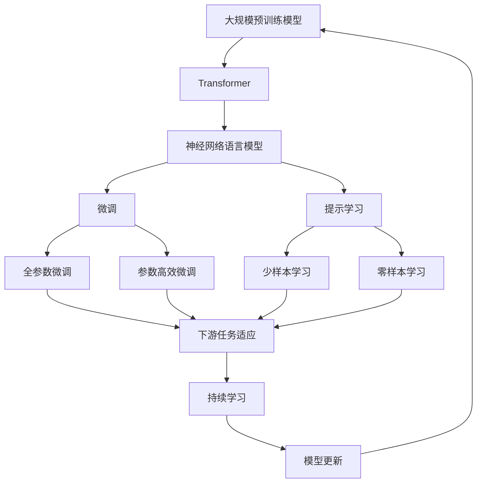
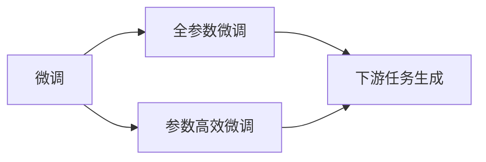
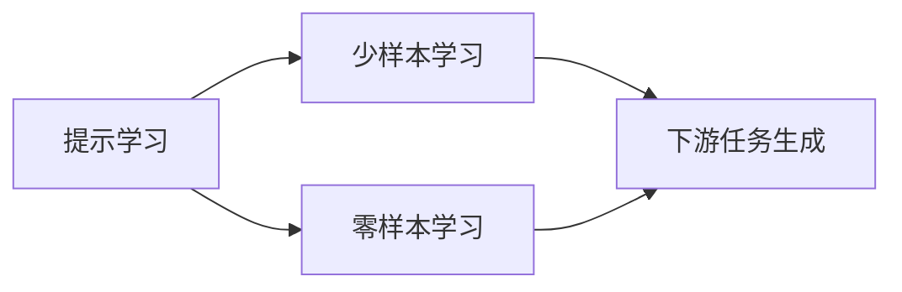
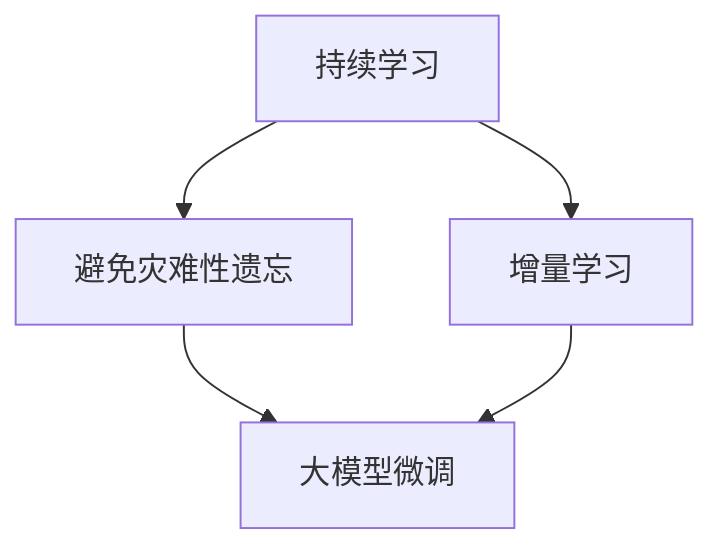
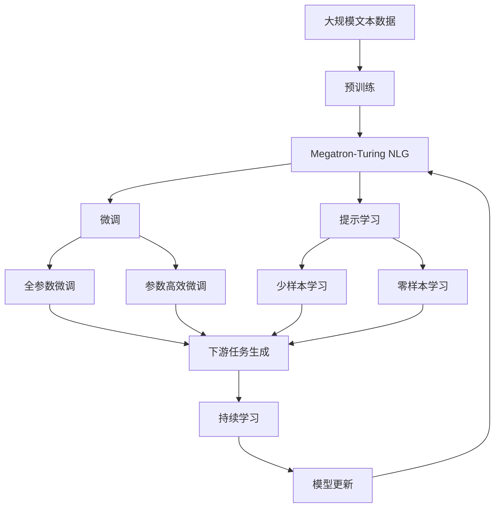

                 

# Megatron-Turing NLG原理与代码实例讲解

> 关键词：Megatron-Turing NLG, 自然语言生成(NLG), 预训练语言模型(PLM), Transformer, 神经网络语言模型(Neural Network Language Model, NLLM), 神经网络生成模型(Neural Network Generation Model, NGM), 大模型微调, 代码实例

## 1. 背景介绍

### 1.1 问题由来

近年来，自然语言生成（Natural Language Generation, NLG）技术在人工智能领域取得了显著进展。NLG旨在使计算机能够生成人类可读的自然语言文本，从而在各种应用场景中模拟人类书写和交流的能力。这一技术的应用范围涵盖了自动摘要、机器翻译、自动问答、对话系统、智能客服等多个领域。

Megatron-Turing NLG作为一类先进的自然语言生成技术，以其卓越的性能和大规模预训练模型为基础，结合Transformer架构和神经网络语言模型（Neural Network Language Model, NLLM），成为当前NLG领域的热门研究方向之一。本文将深入探讨Megatron-Turing NLG的原理与实现，并通过代码实例详细讲解其应用流程。

### 1.2 问题核心关键点

Megatron-Turing NLG的核心在于其大模型微调的方法和实践，具体包括以下几个关键点：

- **大规模预训练模型**：Megatron-Turing NLG依赖于预训练语言模型，如BERT、GPT等，这些模型通过大规模无标签数据训练，学习到丰富的语言知识和语义表示。
- **Transformer架构**：利用Transformer自注意力机制，实现对输入文本的自动编码和解码，提高模型的表达能力和生成效果。
- **神经网络语言模型（NLLM）**：基于语言模型原理，利用上下文信息预测下一个词的概率，从而实现文本生成。
- **微调技术**：通过有标签数据进行微调，调整模型参数以适应特定任务，提升模型性能。
- **代码实例**：本文将通过Python代码实例，展示Megatron-Turing NLG的实现过程，并进行详细解释和分析。

这些关键点共同构成了Megatron-Turing NLG的核心框架，使得其在自然语言处理领域展现出强大的生成能力和应用潜力。

### 1.3 问题研究意义

研究Megatron-Turing NLG的原理与实现，对于推动自然语言生成技术的发展，加速NLP技术的产业化进程，具有重要意义：

- **提升模型效果**：通过微调技术，Megatron-Turing NLG可以显著提升模型在特定任务上的表现，尤其是在低资源环境下。
- **降低应用开发成本**：使用成熟的大模型进行微调，可以显著减少从头开发所需的成本和时间投入。
- **加速开发进度**：微调使得模型能够快速适应特定任务，缩短开发周期，加速应用的落地。
- **提供技术创新**：微调范式促进了对预训练模型的深入研究，催生了更多的研究方向，如提示学习、少样本学习等。
- **赋能产业升级**：Megatron-Turing NLG技术可以应用于各行各业，为传统行业数字化转型提供新的技术路径。

总之，Megatron-Turing NLG的研究和应用，将极大地拓展自然语言处理技术的应用范围，推动人工智能技术的广泛落地。

## 2. 核心概念与联系

### 2.1 核心概念概述

为更好地理解Megatron-Turing NLG的原理与实现，本节将介绍几个密切相关的核心概念：

- **大规模预训练模型（PLM）**：指通过大规模无标签数据训练，学习到丰富语言知识和语义表示的模型，如BERT、GPT等。
- **Transformer架构**：利用自注意力机制，实现对输入文本的自动编码和解码，提高模型的表达能力和生成效果。
- **神经网络语言模型（NLLM）**：基于语言模型原理，利用上下文信息预测下一个词的概率，从而实现文本生成。
- **微调技术**：通过有标签数据进行微调，调整模型参数以适应特定任务，提升模型性能。
- **提示学习（Prompt Learning）**：通过在输入文本中添加提示模板，引导模型进行特定任务的推理和生成。
- **少样本学习（Few-shot Learning）**：在只有少量标注样本的情况下，模型能够快速适应新任务的学习方法。
- **零样本学习（Zero-shot Learning）**：在模型没有见过任何特定任务的训练样本的情况下，仅凭任务描述就能够执行新任务的能力。

这些核心概念之间的逻辑关系可以通过以下Mermaid流程图来展示：



这个流程图展示了大语言模型的核心概念及其之间的关系：

1. 大规模预训练模型通过大规模无标签数据训练，学习到丰富的语言知识和语义表示。
2. Transformer架构利用自注意力机制，实现对输入文本的自动编码和解码，提高模型的表达能力和生成效果。
3. 神经网络语言模型基于语言模型原理，利用上下文信息预测下一个词的概率，从而实现文本生成。
4. 微调技术通过有标签数据进行微调，调整模型参数以适应特定任务，提升模型性能。
5. 提示学习通过在输入文本中添加提示模板，引导模型进行特定任务的推理和生成。
6. 少样本学习和零样本学习使得模型在只有少量标注样本或无标注样本的情况下，仍能执行新任务。
7. 持续学习技术使模型能够不断学习新知识，保持时效性和适应性。

这些核心概念共同构成了Megatron-Turing NLG的生成框架，使其能够生成自然流畅、高质量的文本。

### 2.2 概念间的关系

这些核心概念之间存在着紧密的联系，形成了Megatron-Turing NLG的完整生态系统。下面我通过几个Mermaid流程图来展示这些概念之间的关系。

#### 2.2.1 预训练与微调的关系


这个流程图展示了预训练与微调的基本关系。预训练模型通过大规模无标签数据学习到语言知识，然后通过微调适应特定任务。

#### 2.2.2 微调与生成范式



这个流程图展示了微调与生成范式的关系。微调可以分为全参数微调和参数高效微调，前者更新所有参数，后者仅更新部分参数。两种方式都可以用于下游任务的生成。

#### 2.2.3 提示学习与微调的关系



这个流程图展示了提示学习与微调的关系。提示学习通过在输入文本中添加提示模板，可以在不更新模型参数的情况下实现少样本和零样本学习。

#### 2.2.4 持续学习在大模型中的应用



这个流程图展示了持续学习在大模型中的应用。持续学习旨在使模型能够不断学习新知识，同时保持已学习的知识，避免灾难性遗忘。

### 2.3 核心概念的整体架构

最后，我们用一个综合的流程图来展示这些核心概念在大模型微调过程中的整体架构：



这个综合流程图展示了从预训练到微调，再到持续学习的完整过程。Megatron-Turing NLG首先在大规模文本数据上进行预训练，然后通过微调（包括全参数微调和参数高效微调）或提示学习（包括少样本学习和零样本学习）来适应下游任务。最后，通过持续学习技术，模型可以不断更新和适应新的任务和数据。通过这些流程图，我们可以更清晰地理解Megatron-Turing NLG的生成框架及其与微调技术的关系。

## 3. 核心算法原理 & 具体操作步骤
### 3.1 算法原理概述

Megatron-Turing NLG是一种基于神经网络语言模型（NLLM）的自然语言生成技术。其核心思想是通过大规模预训练模型，学习到语言的丰富表示，然后通过微调技术，调整模型参数以适应特定任务，生成高质量的文本。

具体而言，Megatron-Turing NLG利用Transformer架构，将输入文本编码成高维向量表示，通过多层自注意力机制，学习文本中的语义关系和上下文信息。然后，通过神经网络语言模型（NLLM），利用上下文信息预测下一个词的概率分布，生成连续的自然语言文本。

### 3.2 算法步骤详解

Megatron-Turing NLG的实现过程可以分为以下几个关键步骤：

**Step 1: 准备预训练模型和数据集**
- 选择合适的预训练语言模型，如BERT、GPT等，作为初始化参数。
- 准备下游任务的标注数据集，划分为训练集、验证集和测试集。一般要求标注数据与预训练数据的分布不要差异过大。

**Step 2: 添加任务适配层**
- 根据任务类型，在预训练模型顶层设计合适的输出层和损失函数。
- 对于分类任务，通常在顶层添加线性分类器和交叉熵损失函数。
- 对于生成任务，通常使用语言模型的解码器输出概率分布，并以负对数似然为损失函数。

**Step 3: 设置微调超参数**
- 选择合适的优化算法及其参数，如 AdamW、SGD 等，设置学习率、批大小、迭代轮数等。
- 设置正则化技术及强度，包括权重衰减、Dropout、Early Stopping等。
- 确定冻结预训练参数的策略，如仅微调顶层，或全部参数都参与微调。

**Step 4: 执行梯度训练**
- 将训练集数据分批次输入模型，前向传播计算损失函数。
- 反向传播计算参数梯度，根据设定的优化算法和学习率更新模型参数。
- 周期性在验证集上评估模型性能，根据性能指标决定是否触发 Early Stopping。
- 重复上述步骤直到满足预设的迭代轮数或 Early Stopping 条件。

**Step 5: 测试和部署**
- 在测试集上评估微调后模型 $M_{\hat{\theta}}$ 的性能，对比微调前后的精度提升。
- 使用微调后的模型对新样本进行推理预测，集成到实际的应用系统中。
- 持续收集新的数据，定期重新微调模型，以适应数据分布的变化。

以上是Megatron-Turing NLG的微调过程的详细步骤。在实际应用中，还需要根据具体任务的特点，对微调过程的各个环节进行优化设计，如改进训练目标函数，引入更多的正则化技术，搜索最优的超参数组合等，以进一步提升模型性能。

### 3.3 算法优缺点

Megatron-Turing NLG的微调方法具有以下优点：

1. 简单高效：仅需要准备少量标注数据，即可对预训练模型进行快速适配，生成高质量的文本。
2. 通用适用：适用于各种NLP下游任务，包括分类、匹配、生成等，设计简单的任务适配层即可实现微调。
3. 参数高效：利用参数高效微调技术，在固定大部分预训练参数的情况下，仍可取得不错的微调效果。
4. 效果显著：在学术界和工业界的诸多任务上，基于微调的方法已经刷新了最先进的性能指标。

同时，该方法也存在一定的局限性：

1. 依赖标注数据：微调的效果很大程度上取决于标注数据的质量和数量，获取高质量标注数据的成本较高。
2. 迁移能力有限：当目标任务与预训练数据的分布差异较大时，微调的性能提升有限。
3. 负面效果传递：预训练模型的固有偏见、有害信息等，可能通过微调传递到下游任务，造成负面影响。
4. 可解释性不足：微调模型的决策过程通常缺乏可解释性，难以对其推理逻辑进行分析和调试。

尽管存在这些局限性，但就目前而言，Megatron-Turing NLG的微调方法仍是大语言模型应用的最主流范式。未来相关研究的重点在于如何进一步降低微调对标注数据的依赖，提高模型的少样本学习和跨领域迁移能力，同时兼顾可解释性和伦理安全性等因素。

### 3.4 算法应用领域

Megatron-Turing NLG的微调方法在NLP领域已经得到了广泛的应用，覆盖了几乎所有常见任务，例如：

- 文本分类：如情感分析、主题分类、意图识别等。通过微调使模型学习文本-标签映射。
- 命名实体识别：识别文本中的人名、地名、机构名等特定实体。通过微调使模型掌握实体边界和类型。
- 关系抽取：从文本中抽取实体之间的语义关系。通过微调使模型学习实体-关系三元组。
- 问答系统：对自然语言问题给出答案。将问题-答案对作为微调数据，训练模型学习匹配答案。
- 机器翻译：将源语言文本翻译成目标语言。通过微调使模型学习语言-语言映射。
- 文本摘要：将长文本压缩成简短摘要。将文章-摘要对作为微调数据，使模型学习抓取要点。
- 对话系统：使机器能够与人自然对话。将多轮对话历史作为上下文，微调模型进行回复生成。

除了上述这些经典任务外，Megatron-Turing NLG的微调方法也被创新性地应用到更多场景中，如可控文本生成、常识推理、代码生成、数据增强等，为NLP技术带来了全新的突破。随着预训练模型和微调方法的不断进步，相信Megatron-Turing NLG将在更广阔的应用领域大放异彩。

## 4. 数学模型和公式 & 详细讲解  
### 4.1 数学模型构建

本节将使用数学语言对Megatron-Turing NLG的微调过程进行更加严格的刻画。

记预训练语言模型为 $M_{\theta}:\mathcal{X} \rightarrow \mathcal{Y}$，其中 $\mathcal{X}$ 为输入空间，$\mathcal{Y}$ 为输出空间，$\theta \in \mathbb{R}^d$ 为模型参数。假设微调任务的训练集为 $D=\{(x_i,y_i)\}_{i=1}^N, x_i \in \mathcal{X}, y_i \in \mathcal{Y}$。

定义模型 $M_{\theta}$ 在数据样本 $(x,y)$ 上的损失函数为 $\ell(M_{\theta}(x),y)$，则在数据集 $D$ 上的经验风险为：

$$
\mathcal{L}(\theta) = \frac{1}{N} \sum_{i=1}^N \ell(M_{\theta}(x_i),y_i)
$$

微调的优化目标是最小化经验风险，即找到最优参数：

$$
\theta^* = \mathop{\arg\min}_{\theta} \mathcal{L}(\theta)
$$

在实践中，我们通常使用基于梯度的优化算法（如SGD、Adam等）来近似求解上述最优化问题。设 $\eta$ 为学习率，$\lambda$ 为正则化系数，则参数的更新公式为：

$$
\theta \leftarrow \theta - \eta \nabla_{\theta}\mathcal{L}(\theta) - \eta\lambda\theta
$$

其中 $\nabla_{\theta}\mathcal{L}(\theta)$ 为损失函数对参数 $\theta$ 的梯度，可通过反向传播算法高效计算。

### 4.2 公式推导过程

以下我们以二分类任务为例，推导交叉熵损失函数及其梯度的计算公式。

假设模型 $M_{\theta}$ 在输入 $x$ 上的输出为 $\hat{y}=M_{\theta}(x) \in [0,1]$，表示样本属于正类的概率。真实标签 $y \in \{0,1\}$。则二分类交叉熵损失函数定义为：

$$
\ell(M_{\theta}(x),y) = -[y\log \hat{y} + (1-y)\log (1-\hat{y})]
$$

将其代入经验风险公式，得：

$$
\mathcal{L}(\theta) = -\frac{1}{N}\sum_{i=1}^N [y_i\log M_{\theta}(x_i)+(1-y_i)\log(1-M_{\theta}(x_i))]
$$

根据链式法则，损失函数对参数 $\theta_k$ 的梯度为：

$$
\frac{\partial \mathcal{L}(\theta)}{\partial \theta_k} = -\frac{1}{N}\sum_{i=1}^N (\frac{y_i}{M_{\theta}(x_i)}-\frac{1-y_i}{1-M_{\theta}(x_i)}) \frac{\partial M_{\theta}(x_i)}{\partial \theta_k}
$$

其中 $\frac{\partial M_{\theta}(x_i)}{\partial \theta_k}$ 可进一步递归展开，利用自动微分技术完成计算。

在得到损失函数的梯度后，即可带入参数更新公式，完成模型的迭代优化。重复上述过程直至收敛，最终得到适应下游任务的最优模型参数 $\theta^*$。

## 5. 项目实践：代码实例和详细解释说明
### 5.1 开发环境搭建

在进行Megatron-Turing NLG的微调实践前，我们需要准备好开发环境。以下是使用Python进行PyTorch开发的环境配置流程：

1. 安装Anaconda：从官网下载并安装Anaconda，用于创建独立的Python环境。

2. 创建并激活虚拟环境：
```bash
conda create -n pytorch-env python=3.8 
conda activate pytorch-env
```

3. 安装PyTorch：根据CUDA版本，从官网获取对应的安装命令。例如：
```bash
conda install pytorch torchvision torchaudio cudatoolkit=11.1 -c pytorch -c conda-forge
```

4. 安装Transformers库：
```bash
pip install transformers
```

5. 安装各类工具包：
```bash
pip install numpy pandas scikit-learn matplotlib tqdm jupyter notebook ipython
```

完成上述步骤后，即可在`pytorch-env`环境中开始Megatron-Turing NLG的微调实践。

### 5.2 源代码详细实现

下面我们以命名实体识别(NER)任务为例，给出使用Transformers库对BERT模型进行微调的PyTorch代码实现。

首先，定义NER任务的数据处理函数：

```python
from transformers import BertTokenizer
from torch.utils.data import Dataset
import torch

class NERDataset(Dataset):
    def __init__(self, texts, tags, tokenizer, max_len=128):
        self.texts = texts
        self.tags = tags
        self.tokenizer = tokenizer
        self.max_len = max_len
        
    def __len__(self):
        return len(self.texts)
    
    def __getitem__(self, item):
        text = self.texts[item]
        tags = self.tags[item]
        
        encoding = self.tokenizer(text, return_tensors='pt', max_length=self.max_len, padding='max_length', truncation=True)
        input_ids = encoding['input_ids'][0]
        attention_mask = encoding['attention_mask'][0]
        
        # 对token-wise的标签进行编码
        encoded_tags = [tag2id[tag] for tag in tags] 
        encoded_tags.extend([tag2id['O']] * (self.max_len - len(encoded_tags)))
        labels = torch.tensor(encoded_tags, dtype=torch.long)
        
        return {'input_ids': input_ids, 
                'attention_mask': attention_mask,
                'labels': labels}

# 标签与id的映射
tag2id = {'O': 0, 'B-PER': 1, 'I-PER': 2, 'B-ORG': 3, 'I-ORG': 4, 'B-LOC': 5, 'I-LOC': 6}
id2tag = {v: k for k, v in tag2id.items()}

# 创建dataset
tokenizer = BertTokenizer.from_pretrained('bert-base-cased')

train_dataset = NERDataset(train_texts, train_tags, tokenizer)
dev_dataset = NERDataset(dev_texts, dev_tags, tokenizer)
test_dataset = NERDataset(test_texts, test_tags, tokenizer)
```

然后，定义模型和优化器：

```python
from transformers import BertForTokenClassification, AdamW

model = BertForTokenClassification.from_pretrained('bert-base-cased', num_labels=len(tag2id))

optimizer = AdamW(model.parameters(), lr=2e-5)
```

接着，定义训练和评估函数：

```python
from torch.utils.data import DataLoader
from tqdm import tqdm
from sklearn.metrics import classification_report

device = torch.device('cuda') if torch.cuda.is_available() else torch.device('cpu')
model.to(device)

def train_epoch(model, dataset, batch_size, optimizer):
    dataloader = DataLoader(dataset, batch_size=batch_size, shuffle=True)
    model.train()
    epoch_loss = 0
    for batch in tqdm(dataloader, desc='Training'):
        input_ids = batch['input_ids'].to(device)
        attention_mask = batch['attention_mask'].to(device)
        labels = batch['labels'].to(device)
        model.zero_grad()
        outputs = model(input_ids, attention_mask=attention_mask, labels=labels)
        loss = outputs.loss
        epoch_loss += loss.item()
        loss.backward()
        optimizer.step()
    return epoch_loss / len(dataloader)

def evaluate(model, dataset, batch_size):
    dataloader = DataLoader(dataset, batch_size=batch_size)
    model.eval()
    preds, labels = [], []
    with torch.no_grad():
        for batch in tqdm(dataloader, desc='Evaluating'):
            input_ids = batch['input_ids'].to(device)
            attention_mask = batch['attention_mask'].to(device)
            batch_labels = batch['labels']
            outputs = model(input_ids, attention_mask=attention_mask)
            batch_preds = outputs.logits.argmax(dim=2).to('cpu').tolist()
            batch_labels = batch_labels.to('cpu').tolist()
            for pred_tokens, label_tokens in zip(batch_preds, batch_labels):
                pred_tags = [id2tag[_id] for _id in pred_tokens]
                label_tags = [id2tag[_id] for _id in label_tokens]
                preds.append(pred_tags[:len(label_tags)])
                labels.append(label_tags)
                
    print(classification_report(labels, preds))
```

最后，启动训练流程并在测试集上评估：

```python
epochs = 5
batch_size = 16

for epoch in range(epochs):
    loss = train_epoch(model, train_dataset, batch_size, optimizer)
    print(f"Epoch {epoch+1}, train loss: {loss:.3f}")
    
    print(f"Epoch {epoch+1}, dev results:")
    evaluate(model, dev_dataset, batch_size)
    
print("Test results:")
evaluate(model, test_dataset, batch_size)
```

以上就是使用PyTorch对BERT进行命名实体识别任务微调的完整代码实现。可以看到，得益于Transformers库的强大封装，我们可以用相对简洁的代码完成BERT模型的加载和微调。

### 5.3 代码解读与分析

让我们再详细解读一下关键代码的实现细节：

**NERDataset类**：
- `__init__`方法：初始化文本、标签、分词器等关键组件。
- `__len__`方法：返回数据集的样本数量。
- `__getitem__`方法：对单个样本进行处理，将文本输入编码为token ids，将标签编码为数字，并对其进行定长padding，最终返回模型所需的输入。

**tag2id和id2tag字典**：
- 定义了标签与数字id之间的映射关系，用于将token-wise的预测结果解码回真实的标签。

**训练和评估函数**：
- 使用PyTorch的DataLoader对数据集进行批次化加载，供模型训练和推理使用。
- 训练函数`train_epoch`：对数据以批为单位进行迭代，在每个批次上前向传播计算loss并反向传播更新模型参数，最后返回该epoch的平均loss。
- 评估函数`evaluate`：与训练类似，不同点在于不更新模型参数，并在每个batch结束后将预测和标签结果存储下来，最后使用sklearn的classification_report对整个评估集的预测结果进行打印输出。

**训练流程**

