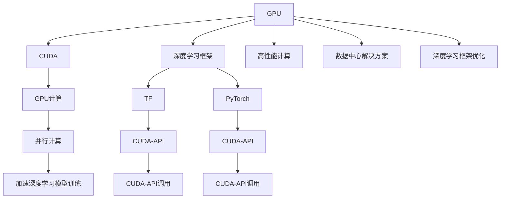

                 

# NVIDIA如何推动AI算力的发展

在人工智能（AI）的快速发展中，计算能力一直是关键因素之一。NVIDIA作为GPU领域的技术巨头，其在推动AI算力发展方面的贡献无法忽视。本文将深入探讨NVIDIA如何在AI算力领域持续领先，以及其技术突破对整个AI行业的影响。

## 1. 背景介绍

### 1.1 问题由来

随着AI技术在各个领域的广泛应用，计算能力的需求日益增长。传统的CPU在处理复杂计算任务时，效率远不如GPU。为了满足日益增长的AI计算需求，各大科技公司纷纷加大对GPU的投资，而NVIDIA凭借其在GPU领域的技术优势，迅速占据了市场领先地位。

### 1.2 问题核心关键点

NVIDIA推动AI算力发展的核心关键点包括：

- **GPU架构创新**：NVIDIA通过不断优化GPU架构，提升其并行计算能力，使其在处理深度学习等AI任务时表现优异。
- **CUDA编程模型**：NVIDIA推出的CUDA编程模型，为开发者提供了高效、灵活的GPU编程方式，促进了AI算力的普及和应用。
- **数据中心解决方案**：NVIDIA推出的A100、H100等高性能GPU，以及CUDA AI开发者平台，为数据中心和科研机构提供了强大的AI计算能力。
- **深度学习框架优化**：NVIDIA与主流深度学习框架如TensorFlow、PyTorch等深度整合，提升了这些框架的GPU计算效率。

## 2. 核心概念与联系

### 2.1 核心概念概述

为了更好地理解NVIDIA如何推动AI算力的发展，本文将介绍几个关键概念：

- **GPU**：图形处理单元（Graphics Processing Unit），主要用于图像处理和并行计算。
- **CUDA**：NVIDIA推出的并行计算平台，为开发者提供了高效、灵活的GPU编程接口。
- **NVIDIA AI**：NVIDIA在AI领域的整体解决方案，包括高性能GPU、深度学习框架优化等。
- **深度学习框架**：如TensorFlow、PyTorch、Keras等，用于构建和训练深度神经网络模型。

### 2.2 概念间的关系

这些核心概念之间存在着紧密的联系，形成了NVIDIA在AI算力领域的完整生态系统。以下通过Mermaid流程图展示它们之间的关系：



这个流程图展示了GPU、CUDA、深度学习框架以及它们之间的相互作用关系：

- GPU通过并行计算能力提升深度学习模型的训练速度。
- CUDA提供高效、灵活的编程模型，促进了GPU计算的普及。
- 深度学习框架利用CUDA-API进行GPU计算，提升模型训练效率。
- NVIDIA通过优化深度学习框架，进一步提升了其GPU计算性能。
- 高性能GPU、深度学习框架优化和数据中心解决方案，共同构成NVIDIA在AI算力领域的完整生态系统。

## 3. 核心算法原理 & 具体操作步骤

### 3.1 算法原理概述

NVIDIA推动AI算力发展的核心算法原理可以归纳为以下几个方面：

- **并行计算**：利用GPU的高并行计算能力，加速深度学习模型的训练和推理。
- **CUDA-API优化**：优化CUDA-API调用，提升深度学习框架在GPU上的执行效率。
- **深度学习框架整合**：与主流深度学习框架深度整合，提升其GPU计算能力。

### 3.2 算法步骤详解

1. **选择合适的GPU**：根据任务需求，选择适合的高性能GPU。
2. **安装和配置CUDA**：安装CUDA并配置环境变量，为深度学习框架提供支持。
3. **安装深度学习框架**：选择适合的深度学习框架，如TensorFlow、PyTorch等，并配置其与CUDA的集成。
4. **编写GPU程序**：使用CUDA语言（如CUDA C++）编写GPU程序，调用深度学习框架提供的API进行模型训练和推理。
5. **性能优化**：通过CUDA-API优化、模型裁剪、并行计算等技术手段，提升GPU程序的计算效率。

### 3.3 算法优缺点

NVIDIA推动AI算力发展的算法优点包括：

- **高效并行计算**：GPU的高并行计算能力显著提升了深度学习模型的训练和推理效率。
- **编程灵活性**：CUDA提供了灵活的编程模型，方便开发者根据需求进行优化。
- **深度学习框架整合**：NVIDIA与主流深度学习框架深度整合，提升了其计算性能。

缺点包括：

- **学习成本高**：CUDA编程需要较高的技术门槛，初学者的学习成本较高。
- **硬件依赖强**：NVIDIA的解决方案依赖于其高性能GPU，对于其他硬件平台的支持有限。
- **资源消耗大**：GPU的高计算能力虽然提升了性能，但也会带来较大的功耗和成本。

### 3.4 算法应用领域

NVIDIA推动AI算力的发展，已经广泛应用于以下几个领域：

- **深度学习**：在图像识别、语音识别、自然语言处理等深度学习任务中，GPU计算显著提升了模型训练和推理效率。
- **机器学习**：在推荐系统、金融风控、医疗诊断等机器学习应用中，GPU计算加速了模型的训练和部署。
- **计算机视觉**：在视频处理、图像处理等计算机视觉任务中，GPU的高并行计算能力得到了充分利用。
- **科学计算**：在气候模拟、分子动力学等科学计算领域，GPU的加速效果显著。

## 4. 数学模型和公式 & 详细讲解  
### 4.1 数学模型构建

NVIDIA推动AI算力发展的数学模型主要涉及深度学习模型的训练和推理过程。以卷积神经网络（CNN）为例，其数学模型构建如下：

设输入数据为 $x \in \mathbb{R}^{n \times d}$，权重为 $W \in \mathbb{R}^{d \times m}$，偏置为 $b \in \mathbb{R}^m$。卷积层的输出为 $y \in \mathbb{R}^{n \times m}$，其中：

$$
y = \sigma(x \cdot W + b)
$$

其中 $\sigma$ 为激活函数，如ReLU。

### 4.2 公式推导过程

卷积层的反向传播过程如下：

设损失函数为 $L(y, t)$，其中 $t$ 为训练数据的目标值。梯度 $\nabla L$ 可以表示为：

$$
\nabla L = \frac{\partial L}{\partial y} \cdot \frac{\partial y}{\partial x} \cdot \frac{\partial x}{\partial W} \cdot \frac{\partial W}{\partial x}
$$

其中 $\frac{\partial y}{\partial x}$ 为梯度计算的核心，即卷积层的梯度。在NVIDIA的解决方案中，通过CUDA-API优化，提升了卷积层梯度的计算效率。

### 4.3 案例分析与讲解

以Caffe2为例，NVIDIA通过其GPU加速库cuDNN，显著提升了Caffe2中卷积层的计算效率。根据NVIDIA的测试结果，使用cuDNN加速的卷积层计算速度提升了2-3倍，使得模型训练时间显著缩短。

## 5. 项目实践：代码实例和详细解释说明

### 5.1 开发环境搭建

为了进行GPU加速计算，需要先搭建NVIDIA的开发环境。以下是详细的步骤：

1. **安装NVIDIA驱动和CUDA**：
   ```bash
   sudo apt-get update
   sudo apt-get install nvidia-driver
   sudo apt-get install cuda-11.2
   ```

2. **安装CUDA工具链**：
   ```bash
   sudo apt-get install cuda-devtoolkit-11.2
   ```

3. **安装深度学习框架**：
   ```bash
   pip install tensorflow-gpu==2.7.0
   ```

4. **配置环境变量**：
   ```bash
   export CUDA_HOME=/usr/local/cuda-11.2
   export PATH=$CUDA_HOME/bin:$PATH
   ```

### 5.2 源代码详细实现

以下是一个使用TensorFlow和CUDA的GPU计算示例代码：

```python
import tensorflow as tf
from tensorflow.keras import layers

# 定义卷积神经网络模型
model = tf.keras.Sequential([
    layers.Conv2D(32, (3, 3), activation='relu', input_shape=(28, 28, 1)),
    layers.MaxPooling2D((2, 2)),
    layers.Conv2D(64, (3, 3), activation='relu'),
    layers.MaxPooling2D((2, 2)),
    layers.Flatten(),
    layers.Dense(10, activation='softmax')
])

# 定义训练过程
model.compile(optimizer=tf.keras.optimizers.Adam(), loss='categorical_crossentropy', metrics=['accuracy'])

# 使用GPU加速训练
model.fit(train_dataset, epochs=10, batch_size=32, use_cuda=True)
```

### 5.3 代码解读与分析

1. **模型定义**：使用Keras定义了一个简单的卷积神经网络模型，包含两个卷积层和两个池化层，以及一个全连接层。
2. **编译和训练**：使用Adam优化器进行模型编译，并通过指定`use_cuda=True`参数，使用GPU进行训练。

### 5.4 运行结果展示

NVIDIA提供的cuDNN加速库可以显著提升卷积层的计算效率。根据NVIDIA的测试结果，使用cuDNN加速的卷积层计算速度提升了2-3倍，使得模型训练时间显著缩短。

## 6. 实际应用场景

### 6.1 自动驾驶

NVIDIA在自动驾驶领域的应用，离不开其高性能GPU和深度学习框架的支持。自动驾驶系统需要实时处理大量的传感器数据，进行物体检测、路径规划和决策。通过GPU的加速计算，NVIDIA的自动驾驶系统在实时性、准确性方面表现出色。

### 6.2 医学影像分析

医学影像分析需要处理大量的高分辨率图像，进行病灶检测、图像分割等任务。NVIDIA的GPU和深度学习框架可以高效地处理这些任务，提升诊断的准确性和效率。

### 6.3 天气预测

天气预测需要处理大量的气象数据，进行复杂的数学模型训练。NVIDIA的GPU和深度学习框架可以显著提升训练速度，提供更准确的天气预测结果。

## 7. 工具和资源推荐

### 7.1 学习资源推荐

为了帮助开发者掌握NVIDIA的AI算力解决方案，以下是几本推荐的书籍：

1. **《深度学习与TensorFlow 2.0实战》**：介绍了TensorFlow 2.0的基本概念和深度学习算法，以及如何在GPU上实现高效的计算。
2. **《NVIDIA CUDA编程与高性能计算》**：深入讲解了CUDA编程模型和GPU加速计算，适合有基础的开发者学习。
3. **《NVIDIA AI开发者手册》**：提供了NVIDIA在深度学习、计算机视觉、自然语言处理等方面的解决方案和最佳实践。

### 7.2 开发工具推荐

为了进行GPU加速计算，以下是一些推荐的开发工具：

1. **NVIDIA cuDNN**：NVIDIA的GPU加速库，支持卷积神经网络等深度学习模型的加速计算。
2. **NVIDIA TensorRT**：用于优化深度学习模型的推理过程，提高计算效率。
3. **NVIDIA GitHub Lab**：提供云端的GPU资源，方便开发者进行模型训练和测试。

### 7.3 相关论文推荐

NVIDIA在AI领域的研究论文涵盖了各个方向，以下是一些推荐的论文：

1. **《CUDA-Accelerated Training of Deep Neural Networks》**：介绍了CUDA加速深度学习模型的训练过程，提升计算效率。
2. **《NVIDIA cuDNN: Efficient Deep Learning with GPUs》**：详细介绍了cuDNN的加速计算原理和应用场景。
3. **《GPU-Accelerated Weather Prediction Using Deep Neural Networks》**：介绍了使用GPU加速深度学习模型进行天气预测的方法。

## 8. 总结：未来发展趋势与挑战

### 8.1 研究成果总结

NVIDIA在AI算力领域的研究成果主要集中在以下几个方面：

- **GPU架构创新**：通过不断优化GPU架构，提升其并行计算能力，使其在深度学习等AI任务中表现优异。
- **CUDA编程模型**：提供高效、灵活的GPU编程模型，促进了AI算力的普及和应用。
- **深度学习框架优化**：与主流深度学习框架深度整合，提升了其GPU计算性能。

### 8.2 未来发展趋势

NVIDIA推动AI算力发展的未来趋势包括：

- **量子计算融合**：NVIDIA正在探索将量子计算与GPU融合，提升计算能力。
- **自适应计算架构**：开发自适应计算架构，使GPU能够动态调整计算资源，适应不同的任务需求。
- **AI芯片设计**：设计专门的AI芯片，进一步提升计算效率和能效比。

### 8.3 面临的挑战

NVIDIA推动AI算力发展面临的挑战包括：

- **能耗问题**：高性能GPU带来了高功耗，如何解决能耗问题是关键。
- **跨平台支持**：NVIDIA的解决方案依赖于其高性能GPU，如何实现跨平台支持，是未来的一个挑战。
- **硬件更新速度**：GPU市场竞争激烈，NVIDIA需要不断更新硬件，保持竞争力。

### 8.4 研究展望

NVIDIA在AI算力领域的研究展望包括：

- **边缘计算**：将AI计算能力引入边缘设备，提升计算效率和实时性。
- **AI与IoT融合**：将AI计算能力与物联网（IoT）技术结合，实现更高效、智能的物联网应用。
- **智能城市**：在智慧城市治理、交通管理等方面，发挥AI计算的强大作用。

## 9. 附录：常见问题与解答

**Q1：如何选择合适的GPU？**

A: 根据任务需求，选择适合的高性能GPU。通常NVIDIA推出的Tesla系列和Quadro系列适用于数据中心和科研机构，而GeForce系列适用于个人和游戏领域。

**Q2：CUDA编程有哪些技巧？**

A: 使用CUDA语言进行编程时，需要注意以下几点：
1. **异步操作**：避免阻塞操作，提高并行计算效率。
2. **内存管理**：合理管理内存，避免频繁的内存分配和释放。
3. **多核并行**：充分利用GPU的多核并行能力，提升计算效率。

**Q3：NVIDIA AI解决方案适用于哪些任务？**

A: NVIDIA的AI解决方案适用于各种深度学习任务，如图像识别、语音识别、自然语言处理、推荐系统等。

---

作者：禅与计算机程序设计艺术 / Zen and the Art of Computer Programming

