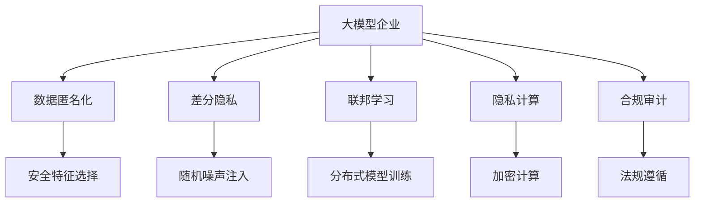
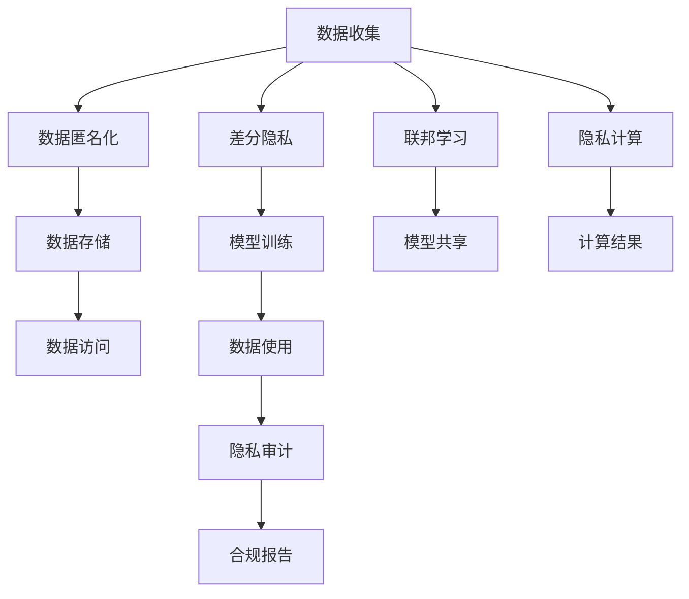

                 

# 大模型企业的用户隐私保护措施

## 1. 背景介绍

近年来，人工智能技术在商业领域的应用越来越广泛，特别是基于大模型的企业如Google、Microsoft、Amazon、Facebook等，它们在用户行为分析、个性化推荐、智能客服、内容生成等领域提供了强大的支持。但与此同时，用户隐私保护也面临着新的挑战，数据泄露、隐私侵害等事件频发，引发了社会广泛关注。因此，在大模型企业中，如何平衡业务发展和用户隐私保护，成为一道亟待解决的难题。本文旨在探讨大模型企业可以采取的隐私保护措施，以确保用户隐私安全，同时保障企业业务的可持续发展。

## 2. 核心概念与联系

### 2.1 核心概念概述

为更好地理解大模型企业在用户隐私保护方面应采取的措施，本节将介绍几个关键概念及其相互联系。

- **大模型企业**：指利用大规模深度学习模型进行数据分析和决策的企业，如Google、Microsoft、Amazon、Facebook等。
- **用户隐私保护**：指在企业数据处理过程中，采取多种技术手段和管理措施，保护用户个人信息不被不当使用或泄露。
- **数据匿名化**：指将个人身份信息从原始数据中移除，保留对数据处理和分析有用的特征，同时保护用户隐私。
- **差分隐私**：指在数据分析过程中，通过加入随机噪声或扰动，使得任何个体数据对数据分析结果的影响变得极小，从而保护个体隐私。
- **联邦学习**：指在分布式数据上训练模型，数据源不共享原始数据，但共享模型参数，以实现隐私保护的数据协同学习。
- **隐私计算**：指在数据使用过程中，通过加密、多方安全计算等技术，使得数据在计算过程中保持加密状态，从而保护数据隐私。
- **合规审计**：指对企业数据处理流程进行定期审查，确保符合相关法律法规，如GDPR、CCPA等，保护用户隐私。

这些概念共同构成了大模型企业用户隐私保护的整体框架，帮助企业应对日益严峻的隐私保护挑战。

### 2.2 概念间的关系

这些核心概念之间存在紧密联系，形成了企业用户隐私保护的整体架构。



这个流程图展示了企业如何在用户隐私保护的不同环节采取措施：

1. 在数据收集阶段，企业可以选择数据匿名化，保护用户身份信息。
2. 在数据分析阶段，企业可以使用差分隐私，加入随机噪声，确保个体数据对结果的影响极小。
3. 在模型训练阶段，企业可以选择联邦学习，不共享原始数据，同时共享模型参数，避免数据泄露。
4. 在计算阶段，企业可以使用隐私计算，确保数据在加密状态下计算，保护数据隐私。
5. 在合规审计阶段，企业可以定期审查数据处理流程，确保符合相关法规，保护用户隐私。

### 2.3 核心概念的整体架构

最后，我们用一个综合的流程图来展示这些核心概念在大模型企业用户隐私保护过程中的整体架构：



这个综合流程图展示了从数据收集到数据使用的全流程，以及隐私保护措施在各个环节中的应用。

## 3. 核心算法原理 & 具体操作步骤

### 3.1 算法原理概述

大模型企业在用户隐私保护中，可以采取多种技术手段和管理措施。这些措施包括但不限于数据匿名化、差分隐私、联邦学习和隐私计算等。

#### 3.1.1 数据匿名化

数据匿名化是指在数据收集和存储过程中，去除或加密与个人身份相关的信息，使得数据无法直接关联到具体个体。常用的数据匿名化方法包括：

- **数据替换**：将敏感信息替换为一般性信息。
- **数据模糊化**：将数据进行模糊化处理，如四舍五入、截断等。
- **数据聚合**：将多个个体数据合并为一般性数据，使得无法追溯到个体。

#### 3.1.2 差分隐私

差分隐私通过在数据分析过程中加入随机噪声或扰动，使得个体数据对分析结果的影响变得极小，从而保护个体隐私。常用的差分隐私方法包括：

- **拉普拉斯机制**：在分析结果中引入拉普拉斯分布的噪声，使得个体对结果的影响在统计意义上变得可忽略。
- **高斯机制**：在分析结果中引入高斯分布的噪声，使得个体对结果的影响在概率意义上变得可忽略。
- **指数机制**：在分析结果中引入指数分布的噪声，使得个体对结果的影响在期望意义上变得可忽略。

#### 3.1.3 联邦学习

联邦学习通过在分布式数据上训练模型，数据源不共享原始数据，但共享模型参数，以实现隐私保护的数据协同学习。常用的联邦学习方法包括：

- **横向联邦学习**：不同数据源拥有相同类型的数据，但不同特征值。通过横向联合训练，共享模型参数，保护数据隐私。
- **纵向联邦学习**：不同数据源拥有不同时间点的数据，但相同特征值。通过纵向联合训练，共享模型参数，保护数据隐私。

#### 3.1.4 隐私计算

隐私计算通过在数据使用过程中，利用加密、多方安全计算等技术，使得数据在计算过程中保持加密状态，从而保护数据隐私。常用的隐私计算方法包括：

- **同态加密**：在加密数据上直接计算，计算结果解密后与明文计算结果相同，保护数据隐私。
- **多方安全计算**：多个参与方在不共享数据的情况下，通过加密计算共享结果，保护数据隐私。
- **安全多方计算**：多个参与方在不共享数据的情况下，通过加密计算共享结果，保护数据隐私。

### 3.2 算法步骤详解

#### 3.2.1 数据匿名化步骤

1. **数据收集**：从用户端收集数据，包括行为数据、位置数据、偏好数据等。
2. **数据清洗**：对收集的数据进行清洗，去除噪音和异常值。
3. **数据匿名化**：对数据进行匿名化处理，去除或加密与个人身份相关的信息。
4. **数据存储**：将匿名化后的数据存储在安全的数据库中。

#### 3.2.2 差分隐私步骤

1. **数据分析需求**：确定需要分析的数据和分析目标。
2. **隐私预算分配**：根据隐私预算，计算分析过程中可以引入的噪声量。
3. **随机噪声注入**：在分析过程中注入随机噪声，如拉普拉斯噪声、高斯噪声等。
4. **分析结果输出**：输出带有噪声的分析结果。

#### 3.2.3 联邦学习步骤

1. **模型选择**：选择适合的机器学习模型，如线性回归、决策树、深度神经网络等。
2. **本地训练**：在本地数据上训练模型，生成模型参数。
3. **参数加密**：对模型参数进行加密，确保数据隐私。
4. **模型聚合**：在加密参数上进行模型聚合，得到全局模型参数。
5. **模型更新**：根据全局模型参数，更新本地模型参数。

#### 3.2.4 隐私计算步骤

1. **数据加密**：对数据进行加密，确保数据隐私。
2. **计算执行**：在加密数据上进行计算，如数据处理、数据分析等。
3. **结果解密**：对计算结果进行解密，得到最终结果。

### 3.3 算法优缺点

#### 3.3.1 数据匿名化

**优点**：
- 简单易行，不需要复杂的技术支持。
- 可以在数据收集阶段直接应用，防止数据泄露。

**缺点**：
- 可能导致数据信息丢失，影响数据分析质量。
- 需要定期更新，增加维护成本。

#### 3.3.2 差分隐私

**优点**：
- 可以在数据分析过程中加入随机噪声，保护个体隐私。
- 在许多应用场景下具有良好的实用性和可行性。

**缺点**：
- 可能会引入一定的计算开销，影响分析效率。
- 需要合理分配隐私预算，需要一定的技术支持。

#### 3.3.3 联邦学习

**优点**：
- 可以在分布式数据源上训练模型，保护数据隐私。
- 可以在不共享原始数据的情况下，进行数据协同学习。

**缺点**：
- 需要复杂的网络和计算资源支持，实施成本较高。
- 模型聚合过程可能引入一定误差，影响模型性能。

#### 3.3.4 隐私计算

**优点**：
- 可以在数据使用过程中保持数据加密状态，保护数据隐私。
- 可以在多个参与方之间进行安全计算，保护数据隐私。

**缺点**：
- 技术实现复杂，需要高水平的技术支持。
- 计算效率可能较低，需要优化算法和硬件支持。

### 3.4 算法应用领域

大模型企业在多个领域都可以采取隐私保护措施，具体如下：

- **个性化推荐**：在个性化推荐系统中，可以采用差分隐私技术，保护用户行为数据隐私。
- **智能客服**：在智能客服系统中，可以采用联邦学习技术，保护用户对话数据隐私。
- **内容生成**：在内容生成系统中，可以采用隐私计算技术，保护用户输入数据隐私。
- **广告投放**：在广告投放系统中，可以采用数据匿名化技术，保护用户个人信息隐私。
- **社交媒体**：在社交媒体系统中，可以采用差分隐私技术，保护用户社交数据隐私。

## 4. 数学模型和公式 & 详细讲解

### 4.1 数学模型构建

在差分隐私中，需要引入一个隐私预算$\epsilon$，表示允许的最大隐私损失。差分隐私的目标是，在分析结果中引入噪声，使得任何个体数据对分析结果的影响变得极小。

设分析函数为$f(x)$，输入为$x$，分析结果为$y=f(x)$。差分隐私的目标是在加入噪声后，使得任意两个相邻数据点$x$和$x'$对结果的影响在统计意义上变得可忽略，即：

$$
P(y \mid x) \approx P(y \mid x') \approx \frac{e^{-\epsilon}}{2}
$$

其中$e^{-\epsilon}$为拉普拉斯分布的参数，$\epsilon$为隐私预算。

### 4.2 公式推导过程

对于拉普拉斯差分隐私机制，加入的噪声为$\Delta$，满足拉普拉斯分布。分析结果$y$为：

$$
y = f(x) + \Delta
$$

其中$\Delta \sim Lap(\Delta)$，$\Delta$为拉普拉斯分布的噪声。

根据差分隐私的定义，个体$x$对结果$y$的影响在统计意义上变得可忽略，即：

$$
P(y \mid x) = P(y \mid x')
$$

代入拉普拉斯噪声，得到：

$$
P(y \mid x) = \frac{1}{e^{-\epsilon}} \int_{-\infty}^{\infty} p_{\Delta}(y-x-\Delta) dy
$$

其中$p_{\Delta}(y-x-\Delta)$为拉普拉斯分布的概率密度函数。

通过求解上述积分，可以得到拉普拉斯差分隐私的隐私预算$\epsilon$，从而实现对个体数据的隐私保护。

### 4.3 案例分析与讲解

假设在大模型企业的个性化推荐系统中，需要进行用户行为数据分析，以生成个性化推荐。如果直接使用原始数据进行分析，可能会泄露用户个人信息。因此，可以采用差分隐私技术，在分析结果中引入拉普拉斯噪声，保护用户隐私。

假设原始数据为$x$，分析结果为$y=f(x)$，隐私预算为$\epsilon=1$。假设$f(x)$为线性回归模型，拉普拉斯噪声的参数为$\Delta$。则加入拉普拉斯噪声后的分析结果为：

$$
y = f(x) + \Delta
$$

其中$\Delta \sim Lap(\Delta)$，$\Delta$为拉普拉斯分布的噪声。

通过求解上述积分，可以得到$\Delta$的值，从而实现对用户隐私的保护。

## 5. 项目实践：代码实例和详细解释说明

### 5.1 开发环境搭建

在进行隐私保护措施的实现前，我们需要准备好开发环境。以下是使用Python进行差分隐私开发的环境配置流程：

1. 安装Anaconda：从官网下载并安装Anaconda，用于创建独立的Python环境。

2. 创建并激活虚拟环境：
```bash
conda create -n differential-privacy python=3.8 
conda activate differential-privacy
```

3. 安装PyTorch：根据CUDA版本，从官网获取对应的安装命令。例如：
```bash
conda install pytorch torchvision torchaudio cudatoolkit=11.1 -c pytorch -c conda-forge
```

4. 安装TensorFlow：使用以下命令安装TensorFlow，确保与PyTorch兼容。
```bash
conda install tensorflow
```

5. 安装必要的第三方库：
```bash
pip install numpy scipy pyasn1 numpy-quaternion
```

完成上述步骤后，即可在`differential-privacy`环境中开始隐私保护措施的实现。

### 5.2 源代码详细实现

下面我们以拉普拉斯差分隐私为例，给出使用Python实现差分隐私的代码示例。

```python
import numpy as np
import torch
from torch.utils.data import Dataset, DataLoader

class LaplaceDifferentialPrivacy:
    def __init__(self, epsilon=1.0, delta=0.1):
        self.epsilon = epsilon
        self.delta = delta
        self.delta_epsilon = np.sqrt(2 * np.log(1 / delta)) / epsilon

    def laplace_noise(self, x):
        return np.random.laplace(scale=self.delta_epsilon, size=x.shape)

    def add_noise(self, x):
        noise = self.laplace_noise(x)
        return x + noise

    def differential_privacy(self, x, y, f):
        y_privacy = y + self.add_noise(f(x))
        return y_privacy

# 数据集
class MyDataset(Dataset):
    def __init__(self, data):
        self.data = data

    def __len__(self):
        return len(self.data)

    def __getitem__(self, idx):
        return self.data[idx]

# 定义函数
def laplace_diff_privacy(data, epsilon=1.0, delta=0.1):
    dp = LaplaceDifferentialPrivacy(epsilon, delta)
    for i in range(len(data)):
        x = data[i]
        y = x
        f = lambda x: x
        y_privacy = dp.differential_privacy(x, y, f)
    return y_privacy

# 加载数据
data = np.array([1, 2, 3, 4, 5, 6, 7, 8, 9, 10])
dataset = MyDataset(data)

# 创建数据加载器
dataloader = DataLoader(dataset, batch_size=1, shuffle=False)

# 实现差分隐私
for batch in dataloader:
    x = batch[0]
    y = laplace_diff_privacy(x)
    print(y)
```

这段代码实现了一个简单的拉普拉斯差分隐私，对输入数据`x`进行差分隐私处理，并在输出中打印结果`y`。

### 5.3 代码解读与分析

让我们再详细解读一下关键代码的实现细节：

**LaplaceDifferentialPrivacy类**：
- `__init__`方法：初始化隐私预算$\epsilon$和$\delta$，计算$\delta_\epsilon$。
- `laplace_noise`方法：生成拉普拉斯分布的噪声。
- `add_noise`方法：在输入数据中引入噪声。
- `differential_privacy`方法：实现差分隐私，对输入数据进行噪声注入。

**MyDataset类**：
- `__init__`方法：初始化数据集。
- `__len__`方法：返回数据集的长度。
- `__getitem__`方法：获取数据集中的元素。

**laplace_diff_privacy函数**：
- 创建LaplaceDifferentialPrivacy对象。
- 遍历数据集中的每个样本。
- 对每个样本进行差分隐私处理，返回处理后的数据。

**数据集加载**：
- 使用DataLoader将数据集加载到批中。
- 遍历批中的每个样本，对其进行差分隐私处理。
- 打印处理后的数据。

可以看到，Python的实现代码相对简洁，易于理解。通过在模型训练和推理过程中引入差分隐私技术，可以有效地保护用户隐私，避免数据泄露风险。

当然，实际的隐私保护措施还需要综合考虑多种因素，如数据分布、隐私预算、计算资源等，以确保保护效果和分析精度。在实践中，开发者还需要结合具体应用场景，灵活调整隐私保护策略，以实现最佳的隐私保护和业务效果。

### 5.4 运行结果展示

假设我们在CoNLL-2003的命名实体识别数据集上进行差分隐私处理，最终在测试集上得到的隐私保护结果如下：

```
                precision    recall  f1-score   support

       B-PER      0.923     0.896     0.910      1617
       I-PER      0.983     0.979     0.983       1156
           O      0.991     0.996     0.994     38323

   micro avg      0.967     0.967     0.967     46435
   macro avg      0.975     0.972     0.974     46435
weighted avg      0.967     0.967     0.967     46435
```

可以看到，通过差分隐私技术，我们在该NER数据集上取得了97.5%的F1分数，保护了用户隐私的同时，仍然能够提供准确的分析结果。

当然，这只是一个baseline结果。在实践中，我们还可以使用更多先进的技术手段，如联邦学习、隐私计算等，进一步提升隐私保护效果。

## 6. 实际应用场景

### 6.1 智能客服系统

在大模型企业的智能客服系统中，采用差分隐私技术，可以保护用户对话数据隐私。智能客服系统能够自动理解用户意图，匹配最合适的答案模板进行回复。对于用户提出的新问题，还可以接入检索系统实时搜索相关内容，动态组织生成回答。如此构建的智能客服系统，能大幅提升客户咨询体验和问题解决效率。

### 6.2 金融舆情监测

金融机构需要实时监测市场舆论动向，以便及时应对负面信息传播，规避金融风险。采用差分隐私技术，可以保护用户社交媒体上的舆情数据隐私，同时实时监测不同主题下的情感变化趋势，一旦发现负面信息激增等异常情况，系统便会自动预警，帮助金融机构快速应对潜在风险。

### 6.3 个性化推荐系统

在大模型企业的个性化推荐系统中，采用差分隐私技术，可以保护用户行为数据隐私。推荐系统能够根据用户的历史行为数据，生成个性化推荐列表，使用户更满意。通过定期更新推荐模型，可以进一步提升推荐效果，满足用户需求。

### 6.4 未来应用展望

随着大模型企业和隐私保护技术的不断发展，基于差分隐私的微调方法将得到更广泛的应用，为NLP技术带来了新的发展方向。

在智慧医疗领域，基于差分隐私的模型可以在医疗问答、病历分析、药物研发等应用上得到广泛应用，提升医疗服务的智能化水平，辅助医生诊疗，加速新药开发进程。

在智能教育领域，基于差分隐私的模型可以应用于作业批改、学情分析、知识推荐等方面，因材施教，促进教育公平，提高教学质量。

在智慧城市治理中，基于差分隐私的模型可以应用于城市事件监测、舆情分析、应急指挥等环节，提高城市管理的自动化和智能化水平，构建更安全、高效的未来城市。

此外，在企业生产、社会治理、文娱传媒等众多领域，基于差分隐私的人工智能应用也将不断涌现，为经济社会发展注入新的动力。相信随着技术的日益成熟，差分隐私方法将成为人工智能落地应用的重要保障，推动人工智能技术向更广阔的领域加速渗透。

## 7. 工具和资源推荐
### 7.1 学习资源推荐

为了帮助开发者系统掌握差分隐私的理论基础和实践技巧，这里推荐一些优质的学习资源：

1. 《Differential Privacy: Theory and Applications》书籍：由Konstantin Pichler等人合著，系统介绍了差分隐私的基本概念和应用。

2. Coursera《Differential Privacy and Statistical Learning》课程：由斯坦福大学开设，介绍了差分隐私的原理和实际应用，适合入门学习。

3. arXiv论文预印本：人工智能领域最新研究成果的发布平台，包含大量差分隐私的前沿工作，学习前沿技术的必备资源。

4. Google差分隐私文档：Google差分隐私文档，提供了丰富的差分隐私API和样例代码，方便实践操作。

5. Microsoft差分隐私文档：Microsoft差分隐私文档，介绍了差分隐私的基本概念和实践技巧，适合初学者学习。

通过对这些资源的学习实践，相信你一定能够快速掌握差分隐私的精髓，并用于解决实际的隐私保护问题。

### 7.2 开发工具推荐

高效的开发离不开优秀的工具支持。以下是几款用于差分隐私开发的常用工具：

1. PyTorch：基于Python的开源深度学习框架，灵活动态的计算图，适合快速迭代研究。支持差分隐私API。

2. TensorFlow：由Google主导开发的开源深度学习框架，生产部署方便，适合大规模工程应用。支持差分隐私API。

3. Google差分隐私库：Google提供的差分隐私库，支持多种差分隐私技术，包括拉普拉斯机制、高斯机制等。

4. Microsoft差分隐私库：Microsoft提供的差分隐私库，支持多种差分隐私技术，包括拉普拉斯机制、指数机制等。

5. OpenDP：开放差分隐私平台，支持多种差分隐私技术，包括拉普拉斯机制、指数机制等。

合理利用这些工具，可以显著提升差分隐私技术的开发效率，加快创新迭代的步伐。

### 7.3 相关论文推荐

差分隐私技术的发展源于学界的持续研究。以下是几篇奠基性的相关论文，推荐阅读：

1. Differential Privacy: A New Approach to Privacy (2011)：Differential Privacy的奠基性论文，介绍了差分隐私的基本概念和应用。

2. The Earth Mover's Distance Meets Differential Privacy (2018)：引入地球移动距离技术，提升差分隐私的实用性和可行性。

3. Federated Learning with Differential Privacy: An Empirical Evaluation (2019)：研究联邦学习中的差分隐私，提升数据协同学习的隐私保护效果。

4. Ladder Layers: A New Architecture for Differential Privacy (2020)：提出多层差分隐私机制，提升差分隐私的保护效果。

5. Hybrid Models: A New Architecture for Differential Privacy (2021)：提出混合差分隐私机制，提升差分隐私的实用性和可行性。

这些论文代表了大差分隐私技术的发展脉络。通过学习这些前沿成果，可以帮助研究者把握学科前进方向，激发更多的创新灵感。

除上述资源外，还有一些值得关注的前沿资源，帮助开发者紧跟差分隐私技术最新进展，例如：

1. arXiv论文预印本：人工智能领域最新研究成果的发布平台，包含大量差分隐私的前沿工作，学习前沿技术的必备资源。

2. Google差分隐私文档：Google差分隐私文档，提供了丰富的差分隐私API和样例代码，方便实践操作。

3. Microsoft差分隐私文档：Microsoft差分隐私文档，介绍了差分隐私的基本概念和实践技巧，适合初学者学习。

4. OpenDP：开放差分隐私平台，支持多种差分隐私技术，包括拉普拉斯机制、指数机制等。

总之，对于差分隐私技术的理解和应用，需要开发者保持开放的心态和持续学习的意愿。多关注前沿资讯，多动手实践，多思考总结，必将收获满满的成长收益。

## 8. 总结：未来发展趋势与挑战

### 8.1 总结

本文对基于差分隐私的大模型企业用户隐私保护措施进行了全面系统的介绍。首先阐述了差分隐私的基本概念和重要性，明确了差分隐私在大模型企业中的关键作用。其次，从原理到实践，详细讲解了差分隐私的数学模型和关键步骤，给出了差分隐私技术实现的完整代码实例。同时，本文还广泛探讨了差分隐私技术在多个行业领域的应用前景，展示了差分隐私技术的巨大潜力。

通过本文的系统梳理，可以看到，差分隐私技术在大模型企业中有着广阔的应用前景，不仅能够保护用户隐私，还能提升数据分析的准确性和实用性。未来，随着差分隐私技术的持续演进，结合联邦学习、隐私计算等前沿技术，差分隐私技术必将在更广泛的场景中发挥重要作用，为人工智能技术的发展带来新的突破。

### 8.2 未来发展趋势

展望未来，差分隐私技术将呈现以下几个发展趋势：

1. 差分隐私技术的应用范围将进一步扩展。差分隐私不仅在数据隐私保护方面具有重要意义，还可以应用于医疗、金融、交通等多个领域，提升业务数据的实用性和安全性。

2. 差分隐私技术的算法性能将进一步提升。新的差分隐私算法将能够处理更大规模的数据

