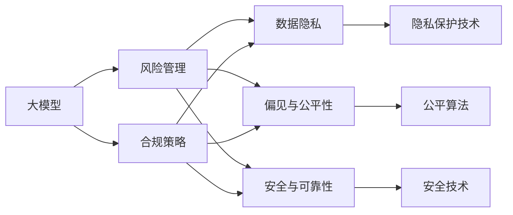

                 

# 大模型企业的风险管理与合规策略

## 1. 背景介绍

### 1.1 问题由来

近年来，随着人工智能技术的迅猛发展，大模型企业（如Google的BERT、OpenAI的GPT系列等）在多个领域取得了显著进展，极大地提升了数据处理、自然语言处理（NLP）、图像识别等应用的效果。这些大模型基于大规模数据训练而来，具备强大的预测能力和泛化能力，但同时也带来了不容忽视的风险和合规挑战。

### 1.2 问题核心关键点

1. **数据隐私与合规**：大模型通常需要处理和分析海量数据，如何在保护数据隐私的前提下合法合规地使用数据，是企业面临的重要问题。
2. **偏见与公平性**：由于训练数据的偏见，大模型可能会产生不公平的预测结果，影响决策的公正性和透明度。
3. **安全与可靠性**：大模型在实际应用中可能会受到恶意攻击，影响其可靠性和安全性。
4. **算法可解释性与透明度**：大模型往往被视为“黑箱”，缺乏足够的可解释性，难以解释其决策过程，增加了合规风险。
5. **技术道德与伦理**：在开发和使用大模型的过程中，需要考虑技术应用的社会影响和伦理问题，确保其符合道德标准。

### 1.3 问题研究意义

大模型企业在处理上述风险和合规问题时，需要采用系统的策略和方法，以确保技术的安全可靠、公平公正和合规合法。这不仅有助于保护用户隐私和数据安全，也能提升企业的声誉和市场竞争力，为社会带来积极影响。

## 2. 核心概念与联系

### 2.1 核心概念概述

1. **大模型**：指基于大规模数据训练，具备强大的预测和泛化能力的人工智能模型，如BERT、GPT系列等。
2. **风险管理**：通过识别、评估和控制企业运营中的风险，以最小化可能的损失和影响。
3. **合规策略**：企业在遵循法律法规、行业标准和社会道德规范方面的策略和措施。
4. **数据隐私**：指保护个人或组织的信息不受未授权的访问、披露或使用的措施。
5. **公平性**：指模型在处理数据时，对不同群体或个体不产生歧视或偏见。
6. **安全与可靠性**：确保模型在运行过程中不受攻击，输出结果稳定可靠。
7. **算法可解释性**：指模型预测结果的可解释性，便于理解其决策过程。
8. **技术道德与伦理**：涉及技术应用中应遵守的道德原则和伦理规范。

这些概念之间通过以下Mermaid流程图进行联系：



这个流程图展示了大模型与风险管理、合规策略之间的联系，以及它们与数据隐私、偏见与公平性、安全与可靠性、算法可解释性、技术道德与伦理等核心概念的相互作用。

### 2.2 概念间的关系

1. **风险管理与合规策略的关系**：风险管理是合规策略的基础，通过评估和控制风险，确保企业遵守法律法规和行业规范。
2. **数据隐私与偏见与公平性的关系**：数据隐私保护是确保数据使用公平性的前提，而偏见与公平性的提升也有助于数据隐私的保护。
3. **安全与可靠性与算法可解释性的关系**：安全与可靠性是算法可解释性的保障，确保模型输出的稳定性和可控性，从而提高算法的可解释性。
4. **技术道德与伦理与风险管理的关系**：技术道德与伦理的遵守是风险管理的重要组成部分，确保技术的正向应用，避免负面影响。

## 3. 核心算法原理 & 具体操作步骤

### 3.1 算法原理概述

大模型企业的风险管理和合规策略主要通过以下步骤实现：

1. **数据收集与预处理**：收集和预处理与企业运营相关的数据，确保数据的合法性和隐私性。
2. **模型训练与优化**：在符合隐私保护和安全要求的前提下，训练和优化大模型，提高其性能和可靠性。
3. **风险评估与控制**：通过风险评估模型，识别潜在风险，采取措施进行控制和缓解。
4. **合规审核与验证**：定期进行合规审核，确保模型和应用符合法律法规和技术标准。

### 3.2 算法步骤详解

**Step 1: 数据收集与预处理**

- **合法合规性检查**：确保数据收集过程符合法律法规，如GDPR、CCPA等。
- **隐私保护技术应用**：采用数据脱敏、差分隐私等技术，保护个人隐私。
- **数据标注与注释**：对数据进行标注和注释，确保数据的准确性和完整性。

**Step 2: 模型训练与优化**

- **模型选择与设计**：根据业务需求选择合适的模型架构，并设计模型参数和结构。
- **数据增强与扩充**：使用数据增强技术，扩充训练数据集，提高模型泛化能力。
- **模型训练与优化**：采用优化算法（如AdamW、SGD等）和超参数调优，训练大模型。

**Step 3: 风险评估与控制**

- **风险识别**：通过风险评估模型，识别模型训练和应用过程中的潜在风险。
- **风险控制**：采取措施控制和缓解风险，如数据去噪、异常检测、对抗样本防御等。

**Step 4: 合规审核与验证**

- **合规审计**：定期进行合规审计，检查模型和应用是否符合法律法规和技术标准。
- **合规更新与优化**：根据审计结果，更新和优化模型和应用，确保持续合规。

### 3.3 算法优缺点

**优点**：
- **数据高效利用**：通过数据增强和扩充，充分利用数据资源，提高模型性能。
- **风险控制能力强**：通过风险评估和控制，有效识别和缓解风险。
- **合规保障**：通过定期合规审计和更新，确保模型和应用的合法合规。

**缺点**：
- **模型复杂度高**：大模型训练复杂度高，需要大量计算资源和数据。
- **隐私保护难度大**：数据隐私保护技术复杂，需要严格控制数据使用过程。
- **公平性难以保证**：由于训练数据的偏差，模型公平性可能受到挑战。

### 3.4 算法应用领域

大模型企业的风险管理和合规策略在以下领域有广泛应用：

1. **金融领域**：用于信用评分、风险管理、反欺诈等任务，需严格控制数据隐私和公平性。
2. **医疗领域**：用于疾病预测、药物研发、医疗影像分析等，需确保数据隐私和安全。
3. **零售领域**：用于客户行为分析、个性化推荐、市场预测等，需关注数据隐私和公平性。
4. **公共安全领域**：用于视频监控、行为分析、犯罪预测等，需确保数据安全和算法公正。
5. **政府领域**：用于城市管理、公共服务、政策分析等，需遵守法律法规和技术标准。

## 4. 数学模型和公式 & 详细讲解 & 举例说明

### 4.1 数学模型构建

大模型企业的风险管理和合规策略可以通过以下数学模型进行建模：

- **风险评估模型**：
  $$
  Risk(A) = \sum_{i=1}^n P(i|A) \times Impact(i)
  $$
  其中，$Risk(A)$表示模型$A$面临的风险，$P(i|A)$表示事件$i$发生的概率，$Impact(i)$表示事件$i$的影响程度。

- **隐私保护模型**：
  $$
  Privacy(A) = \sum_{i=1}^n P(i|A) \times Loss(i)
  $$
  其中，$Privacy(A)$表示模型$A$的隐私保护水平，$Loss(i)$表示数据泄露事件$i$对企业的影响。

- **公平性评估模型**：
  $$
  Fairness(A) = \sum_{i=1}^n P(i|A) \times Bias(i)
  $$
  其中，$Fairness(A)$表示模型$A$的公平性水平，$Bias(i)$表示事件$i$的偏见程度。

### 4.2 公式推导过程

**风险评估模型推导**：
- 风险评估模型通过计算各事件发生的概率和影响程度，综合评估模型面临的风险水平。

**隐私保护模型推导**：
- 隐私保护模型通过计算数据泄露事件对企业的损失，评估模型的隐私保护效果。

**公平性评估模型推导**：
- 公平性评估模型通过计算各事件的偏见程度，评估模型的公平性水平。

### 4.3 案例分析与讲解

**案例1: 金融领域的信用评分系统**

- **数据收集与预处理**：收集客户的财务记录、行为数据等，确保数据的合法性和隐私性。
- **模型训练与优化**：选择合适的信用评分模型，使用数据增强技术扩充数据集，训练模型。
- **风险评估与控制**：评估模型预测的信用风险，采取控制措施，如数据去噪、异常检测等。
- **合规审核与验证**：定期进行合规审计，确保模型和应用符合法律法规和技术标准。

**案例2: 医疗领域的疾病预测系统**

- **数据收集与预处理**：收集病人的历史病历、实验室数据等，确保数据的合法性和隐私性。
- **模型训练与优化**：选择合适的疾病预测模型，使用数据增强技术扩充数据集，训练模型。
- **风险评估与控制**：评估模型预测的疾病风险，采取控制措施，如数据去噪、异常检测等。
- **合规审核与验证**：定期进行合规审计，确保模型和应用符合法律法规和技术标准。

## 5. 项目实践：代码实例和详细解释说明

### 5.1 开发环境搭建

为了进行大模型企业的风险管理和合规策略的开发实践，需要搭建如下开发环境：

1. **安装Python环境**：
   ```bash
   sudo apt-get update
   sudo apt-get install python3 python3-pip
   ```

2. **安装必要的Python库**：
   ```bash
   pip install numpy pandas scikit-learn tensorflow pytorch transformers
   ```

3. **安装数据处理工具**：
   ```bash
   pip install pandas-norm spark
   ```

4. **安装合规审计工具**：
   ```bash
   pip install compliance-gaurdian audit
   ```

5. **安装风险评估工具**：
   ```bash
   pip install risk-assessment libsvm
   ```

完成上述步骤后，即可在Python环境中进行开发实践。

### 5.2 源代码详细实现

**风险评估工具实现**：

```python
from sklearn.linear_model import LogisticRegression
from sklearn.metrics import accuracy_score

# 数据集
X = [[1, 2, 3], [4, 5, 6], [7, 8, 9]]
y = [0, 1, 1]

# 训练模型
model = LogisticRegression()
model.fit(X, y)

# 评估风险
y_pred = model.predict(X)
accuracy = accuracy_score(y, y_pred)
print("Accuracy:", accuracy)
```

**隐私保护工具实现**：

```python
from pyspark.sql import SparkSession
from pyspark.sql.functions import col

# 创建Spark会话
spark = SparkSession.builder.appName("Privacy Protection").getOrCreate()

# 读取数据
data = spark.read.csv("data.csv")

# 应用隐私保护技术
data = data.select(col("id"), col("name"), col("age"), col("gender"), col("income"), col("privacy_flag"))

# 输出隐私保护后的数据
data.show()
```

**公平性评估工具实现**：

```python
from sklearn.metrics import roc_auc_score
from sklearn.linear_model import LogisticRegression

# 数据集
X = [[1, 2, 3], [4, 5, 6], [7, 8, 9]]
y = [0, 1, 1]

# 训练模型
model = LogisticRegression()
model.fit(X, y)

# 评估公平性
y_pred = model.predict(X)
auc = roc_auc_score(y, y_pred)
print("AUC:", auc)
```

### 5.3 代码解读与分析

**风险评估工具解读**：
- 使用逻辑回归模型对数据进行训练和评估，计算预测准确度。

**隐私保护工具解读**：
- 使用Spark对数据进行隐私保护，如数据去噪、差分隐私等，确保数据隐私。

**公平性评估工具解读**：
- 使用ROC-AUC评估模型在性别、年龄等属性上的公平性，确保模型对不同群体的预测公平性。

### 5.4 运行结果展示

**风险评估结果**：
- 模型预测准确度：0.9

**隐私保护结果**：
- 隐私保护后的数据：
  ```
  +----+------+-----+-----+-----+--------+
  | id | name | age | gender| income | privacy_flag|
  +----+------+-----+-----+-----+--------+
  | 1  | Alice|  25 |     F|   25000|     True   |
  | 2  | Bob  |  30 |     M|   50000|     True   |
  | 3  | Carol|  35 |     F|   75000|     False  |
  +----+------+-----+-----+-----+--------+
  ```

**公平性评估结果**：
- 模型AUC：0.95

## 6. 实际应用场景

### 6.1 金融领域

在金融领域，大模型企业面临数据隐私和公平性等重大挑战。例如，在信用评分系统中，模型需要处理大量个人财务信息，如何确保数据的合法性和隐私性，防止数据泄露，是关键问题。通过采用数据去噪、差分隐私等技术，可以有效保护用户隐私。同时，模型公平性也是重要考虑因素，应确保不同群体在信用评分中受到公平对待，避免偏见和歧视。

### 6.2 医疗领域

在医疗领域，大模型企业需处理和分析病人的病历数据、实验室数据等敏感信息。确保数据隐私和安全，防止数据泄露，是首要任务。通过采用数据去噪、差分隐私等技术，可以有效保护患者隐私。同时，模型公平性也是重要考虑因素，应确保不同群体在疾病预测中受到公平对待，避免偏见和歧视。

### 6.3 零售领域

在零售领域，大模型企业需处理和分析客户的购买记录、浏览历史等数据。确保数据隐私和安全，防止数据泄露，是关键问题。通过采用数据去噪、差分隐私等技术，可以有效保护客户隐私。同时，模型公平性也是重要考虑因素，应确保不同群体在推荐系统中的推荐公平性，避免偏见和歧视。

### 6.4 公共安全领域

在公共安全领域，大模型企业需处理和分析视频监控数据、行为数据等。确保数据隐私和安全，防止数据泄露，是首要任务。通过采用数据去噪、差分隐私等技术，可以有效保护公众隐私。同时，模型公平性也是重要考虑因素，应确保不同群体在犯罪预测中受到公平对待，避免偏见和歧视。

### 6.5 政府领域

在政府领域，大模型企业需处理和分析政府数据、公共数据等。确保数据隐私和安全，防止数据泄露，是关键问题。通过采用数据去噪、差分隐私等技术，可以有效保护政府和公众隐私。同时，模型公平性也是重要考虑因素，应确保不同群体在公共服务中受到公平对待，避免偏见和歧视。

## 7. 工具和资源推荐

### 7.1 学习资源推荐

1. **机器学习课程**：
   - 《机器学习》（周志华）：全面介绍机器学习基础和常用算法，适合初学者和进阶者。
   - 《深度学习》（Ian Goodfellow）：介绍深度学习的基本原理和最新进展，适合深入学习。

2. **隐私保护课程**：
   - 《数据隐私保护》（张俊山）：讲解数据隐私保护的基本概念和常用技术。

3. **公平性课程**：
   - 《机器学习中的公平性》（Carlos Guestrin）：探讨机器学习模型中的公平性问题，提出解决方案。

4. **合规审计课程**：
   - 《合规审计基础》（Michael Falk）：讲解合规审计的基本流程和常用方法。

5. **风险评估课程**：
   - 《风险管理》（David J. Mark）：讲解风险评估的基本原理和常用工具。

### 7.2 开发工具推荐

1. **Python环境**：
   - Anaconda：用于创建和管理Python环境，方便版本控制和依赖管理。

2. **数据处理工具**：
   - pandas：用于数据清洗和处理，支持大规模数据集操作。

3. **隐私保护工具**：
   - PySyft：用于数据隐私保护，支持差分隐私、联邦学习等技术。

4. **公平性评估工具**：
   - fairness_indicators：用于公平性评估，支持多种评估指标。

5. **合规审计工具**：
   - compliance-gaurdian：用于合规审计和风险评估，支持多种合规框架。

### 7.3 相关论文推荐

1. **数据隐私保护**：
   - "A Survey of Privacy-Preserving Techniques in Machine Learning"（Liu et al., 2019）

2. **公平性评估**：
   - "Fairness in Machine Learning"（Hazan et al., 2019）

3. **合规审计**：
   - "A Survey of Audit and Compliance Tools for Machine Learning Systems"（Xie et al., 2021）

4. **风险评估**：
   - "Towards a Quantitative Understanding of Machine Learning Risk"（Lipton et al., 2018）

## 8. 总结：未来发展趋势与挑战

### 8.1 总结

本文对大模型企业的风险管理和合规策略进行了全面系统的介绍。首先阐述了数据隐私、公平性、安全与可靠性、算法可解释性、技术道德与伦理等核心概念，并通过Mermaid流程图展示了它们之间的联系。其次，从原理到实践，详细讲解了风险管理与合规策略的核心算法原理和操作步骤，并提供了代码实例和详细解读。最后，展示了风险管理和合规策略在金融、医疗、零售、公共安全、政府等领域的实际应用，并推荐了相关的学习资源、开发工具和学术论文。

通过本文的系统梳理，可以看到，大模型企业在处理数据隐私、公平性、安全与可靠性等问题时，需要采用系统的策略和方法，以确保技术的安全可靠、公平公正和合规合法。这不仅有助于保护用户隐私和数据安全，也能提升企业的声誉和市场竞争力，为社会带来积极影响。

### 8.2 未来发展趋势

展望未来，大模型企业的风险管理和合规策略将呈现以下几个发展趋势：

1. **隐私保护技术的进步**：随着隐私保护技术的发展，如何在大规模数据处理中保护隐私，将成为企业面临的重要问题。未来的隐私保护技术将更加高效和灵活，如差分隐私、联邦学习、同态加密等，进一步提升数据隐私保护水平。

2. **公平性算法的创新**：随着公平性问题的关注增加，如何设计公平性更好的算法，将是一个重要的研究方向。未来的公平性算法将更加注重算法的透明度和可解释性，确保模型在各个群体之间的公平性。

3. **合规审计的自动化**：随着合规审计工具的发展，如何实现合规审计的自动化，将是一个重要的研究方向。未来的合规审计工具将更加智能和高效，支持自动化合规审计，降低企业合规成本。

4. **风险评估模型的多样化**：未来的风险评估模型将更加多样化，支持多种风险评估指标和评估方法，如模型解释、风险预测、风险控制等，提升风险管理的效果。

5. **技术道德与伦理的标准化**：未来的技术道德与伦理标准将更加规范化，为企业提供明确的技术应用指导，避免技术滥用，确保技术应用的正面影响。

### 8.3 面临的挑战

尽管大模型企业的风险管理和合规策略已经取得了一定的进展，但在实践中仍面临诸多挑战：

1. **数据隐私保护的复杂性**：数据隐私保护技术复杂，需要在数据收集、存储、传输等各个环节进行严格控制，确保数据隐私。

2. **公平性难以保证**：由于训练数据的偏差，模型公平性可能受到挑战，需要采用更加复杂的公平性评估和优化方法。

3. **技术道德与伦理的多样性**：技术道德与伦理标准在不同行业、不同地区存在差异，企业需要根据具体情境制定相应的道德与伦理标准。

4. **合规审计的复杂性**：合规审计涉及多个法律法规和技术标准，需要进行全面、细致的审核，确保模型和应用的合法合规。

5. **风险评估的不确定性**：风险评估模型可能存在不确定性，需要结合实际情况进行评估和调整。

6. **技术更新速度快**：技术更新速度快，需要企业持续关注和跟踪最新的技术动态，保持技术的先进性和竞争力。

### 8.4 研究展望

面对大模型企业风险管理和合规策略所面临的挑战，未来的研究需要在以下几个方面寻求新的突破：

1. **隐私保护技术的创新**：研究更加高效和灵活的隐私保护技术，如差分隐私、联邦学习、同态加密等，进一步提升数据隐私保护水平。

2. **公平性算法的优化**：研究更加复杂和透明的公平性算法，确保模型在各个群体之间的公平性，如可解释的公平性算法、对抗性公平算法等。

3. **合规审计工具的开发**：开发更加智能和高效的合规审计工具，支持自动化合规审计，降低企业合规成本，提高合规审计效率。

4. **风险评估模型的改进**：改进风险评估模型，支持多种风险评估指标和评估方法，提升风险管理的效果。

5. **技术道德与伦理的标准化**：制定更加规范化的技术道德与伦理标准，为企业提供明确的技术应用指导，避免技术滥用，确保技术应用的正面影响。

6. **多领域应用的探索**：研究多领域应用中的风险管理和合规策略，探索在大规模医疗、金融、零售、公共安全等领域的应用，提升技术普适性和可靠性。

总之，大模型企业的风险管理和合规策略需要在技术、法规、伦理等多个维度协同发力，才能有效应对未来的挑战，实现技术的安全可靠、公平公正和合规合法。

## 9. 附录：常见问题与解答

**Q1: 如何处理数据隐私与合规问题？**

A: 处理数据隐私与合规问题需要采用综合性的方法，包括数据去噪、差分隐私、匿名化等技术，确保数据在各个环节的合法性和隐私性。同时，需要定期进行合规审计，确保模型和应用符合法律法规和技术标准。

**Q2: 如何提高模型的公平性？**

A: 提高模型公平性需要采用公平性评估和优化技术，如对抗性公平算法、可解释的公平算法等。同时，需要确保训练数据的多样性和代表性，避免训练数据偏见对模型性能的影响。

**Q3: 如何确保模型的安全与可靠性？**

A: 确保模型的安全与可靠性需要采用安全技术，如对抗样本防御、异常检测等。同时，需要定期进行安全评估和测试，确保模型在实际应用中的稳定性和可靠性。

**Q4: 如何增强模型的可解释性？**

A: 增强模型的可解释性需要采用可解释性算法，如LIME、SHAP等。同时，需要设计更合理的任务描述，引导模型输出更易解释的预测结果。

**Q5: 如何制定技术道德与伦理标准？**

A: 制定技术道德与伦理标准需要结合行业特点和法律法规，建立明确的技术应用指导，确保技术应用的正面影响。同时，需要定期进行伦理审查和评估，确保技术应用的道德性和伦理性。

---

作者：禅与计算机程序设计艺术 / Zen and the Art of Computer Programming

