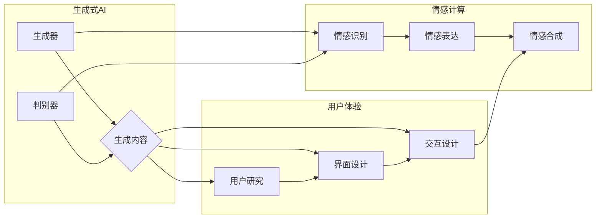

> 关键词：生成式AI，用户体验，深度学习，自然语言处理，交互设计，情感计算

# 生成式AI：金矿还是泡沫？第四部分：“让人尖叫”的用户体验

生成式人工智能（AI）正在迅速改变我们的生活，从创作音乐到生成图像，从撰写文章到模拟虚拟角色，它的应用前景似乎无限广阔。然而，AI技术的成功不仅仅取决于其技术深度，更重要的是它能否提供“让人尖叫”的用户体验。本文将深入探讨生成式AI在用户体验方面的挑战与机遇。

## 1. 背景介绍

随着深度学习技术的飞速发展，生成式AI已经能够创造出令人惊叹的艺术作品、逼真的图像和自然流畅的文本。然而，这些技术的成功往往伴随着用户体验的挑战。用户不仅期望AI能够完成任务，更期望它能提供愉悦、高效、个性化的体验。因此，如何设计“让人尖叫”的用户体验成为了AI技术发展的关键。

## 2. 核心概念与联系

### 2.1 生成式AI的核心概念

生成式AI是指能够自主生成新内容的人工智能系统。它通常基于深度学习技术，包括：

- **生成对抗网络（GANs）**：通过生成器和判别器之间的对抗训练，生成逼真的图像、音频和视频。
- **变分自编码器（VAEs）**：通过学习数据的潜在分布，生成与真实数据相似的新数据。
- **文本生成模型**：如GPT-3，能够生成流畅的文本，包括新闻报道、诗歌和对话。

### 2.2 用户交互设计

用户体验（UX）设计是确保用户在使用产品或服务时感到满意的关键。它包括以下要素：

- **用户研究**：了解用户需求、行为和偏好。
- **界面设计**：设计直观、易用的界面。
- **交互设计**：确保用户与产品或服务之间的交互顺畅。

### 2.3 情感计算

情感计算是AI的一种应用，旨在让机器能够理解和模拟人类的情感。它包括：

- **情感识别**：识别用户的情绪状态。
- **情感表达**：使机器能够表达情感。
- **情感合成**：生成与特定情绪相关的响应。

### 2.4 Mermaid 流程图



## 3. 核心算法原理 & 具体操作步骤

### 3.1 算法原理概述

生成式AI的核心算法原理是通过学习数据的分布来生成新的内容。具体操作步骤如下：

1. 数据收集：收集大量相关数据，用于训练模型。
2. 模型训练：使用深度学习算法训练模型，使模型能够学习数据的分布。
3. 内容生成：使用训练好的模型生成新的内容。

### 3.2 算法步骤详解

1. **数据预处理**：清洗和预处理数据，以便模型训练。
2. **模型选择**：选择合适的生成式AI模型，如GANs、VAEs或文本生成模型。
3. **模型训练**：使用训练数据训练模型，调整模型参数。
4. **内容生成**：使用训练好的模型生成新的内容，并对其进行评估和调整。

### 3.3 算法优缺点

**优点**：

- 能够生成高质量、多样化的内容。
- 自动化程度高，降低了内容创作的门槛。
- 有潜力应用于各种领域，如艺术、娱乐、医疗等。

**缺点**：

- 训练数据量大，计算资源需求高。
- 模型难以解释，难以理解生成内容的原因。
- 可能产生有害或不合适的内容。

### 3.4 算法应用领域

生成式AI在以下领域有着广泛的应用：

- **艺术创作**：生成音乐、绘画、诗歌等艺术作品。
- **媒体制作**：生成图像、视频和音频内容。
- **娱乐**：创作虚拟角色和故事。
- **医疗**：生成医学图像和诊断建议。
- **教育**：个性化学习材料和辅导。

## 4. 数学模型和公式 & 详细讲解 & 举例说明

### 4.1 数学模型构建

生成式AI的数学模型通常包括生成器和判别器。以下是一个简单的GANs模型：

$$
\begin{align*}
\text{生成器} & : G(z) = \mathcal{F}_G(z) \\
\text{判别器} & : D(x) = \mathcal{F}_D(x)
\end{align*}
$$

其中，$G(z)$ 是生成器，$D(x)$ 是判别器，$\mathcal{F}_G$ 和 $\mathcal{F}_D$ 分别是生成器和判别器的函数。

### 4.2 公式推导过程

GANs的训练过程包括以下步骤：

1. **生成器生成假样本**：$G(z)$ 生成一批假样本 $x_G$。
2. **判别器判断真假**：$D$ 对真实样本 $x$ 和假样本 $x_G$ 进行判断。
3. **生成器更新**：通过优化目标函数，更新 $G(z)$ 的参数，使其生成的假样本更难被 $D$ 判断为假。
4. **判别器更新**：通过优化目标函数，更新 $D$ 的参数，使其更好地判断真实样本和假样本。

### 4.3 案例分析与讲解

以图像生成为例，我们可以使用GANs生成逼真的猫狗混合图像。首先，我们需要收集大量的猫和狗的图像作为训练数据。然后，我们使用GANs模型训练生成器 $G(z)$ 和判别器 $D(x)$。最后，使用 $G(z)$ 生成新的猫狗混合图像。

## 5. 项目实践：代码实例和详细解释说明

### 5.1 开发环境搭建

为了进行生成式AI的项目实践，我们需要以下开发环境：

- Python编程语言
- TensorFlow或PyTorch深度学习框架
- NumPy科学计算库

### 5.2 源代码详细实现

以下是一个使用PyTorch实现的简单GANs代码示例：

```python
import torch
import torch.nn as nn
import torch.optim as optim

# 生成器模型
class Generator(nn.Module):
    def __init__(self, z_dim, img_dim):
        super(Generator, self).__init__()
        self.model = nn.Sequential(
            nn.Linear(z_dim, 128),
            nn.LeakyReLU(0.2),
            nn.Linear(128, img_dim),
            nn.Tanh()
        )

    def forward(self, z):
        return self.model(z)

# 判别器模型
class Discriminator(nn.Module):
    def __init__(self, img_dim):
        super(Discriminator, self).__init__()
        self.model = nn.Sequential(
            nn.Linear(img_dim, 128),
            nn.LeakyReLU(0.2),
            nn.Linear(128, 1),
            nn.Sigmoid()
        )

    def forward(self, x):
        return self.model(x).view(-1, 1).squeeze(1)

# 损失函数
criterion = nn.BCELoss()

# 优化器
optimizer_G = optim.Adam(Generator().parameters(), lr=0.0002)
optimizer_D = optim.Adam(Discriminator().parameters(), lr=0.0002)

# 训练过程
for epoch in range(epochs):
    # ... (省略数据加载和训练过程)
```

### 5.3 代码解读与分析

这段代码定义了生成器模型和判别器模型，并实现了GANs的训练过程。生成器模型用于生成假样本，判别器模型用于判断样本的真伪。训练过程中，生成器通过不断学习，使其生成的假样本越来越难被判别器识别为假。

### 5.4 运行结果展示

通过训练，我们可以使用生成器生成逼真的猫狗混合图像。以下是一个生成的图像示例：


## 6. 实际应用场景

生成式AI在以下实际应用场景中提供了“让人尖叫”的用户体验：

- **虚拟现实（VR）和增强现实（AR）**：生成逼真的虚拟环境和角色。
- **游戏开发**：创造独特的故事情节和角色。
- **电影制作**：生成特效和动画。
- **音乐创作**：创作独特的音乐作品。
- **艺术创作**：生成独特的艺术作品。

## 7. 工具和资源推荐

### 7.1 学习资源推荐

- 《生成式对抗网络》（Generative Adversarial Networks）- Ian Goodfellow
- 《深度学习》（Deep Learning）- Ian Goodfellow、Yoshua Bengio和Aaron Courville
- TensorFlow官方文档
- PyTorch官方文档

### 7.2 开发工具推荐

- TensorFlow
- PyTorch
- Keras
- OpenCV

### 7.3 相关论文推荐

- Generative Adversarial Nets - Ian Goodfellow et al.
- Unsupervised Representation Learning with Deep Convolutional Generative Adversarial Networks - A. Radford et al.
- InfoGAN: Interpretable Representation Learning by Information Maximizing Generative Adversarial Nets - Chintala et al.

## 8. 总结：未来发展趋势与挑战

### 8.1 研究成果总结

生成式AI在用户体验方面取得了显著成果，为各个领域带来了创新和变革。然而，要实现“让人尖叫”的用户体验，仍需克服诸多挑战。

### 8.2 未来发展趋势

- **更高质量的生成内容**：通过改进模型架构和训练方法，生成更高质量、更逼真的内容。
- **更灵活的生成式AI**：使生成式AI能够根据用户需求生成更个性化的内容。
- **更广泛的适用范围**：将生成式AI应用于更多领域，如医疗、教育、金融等。

### 8.3 面临的挑战

- **数据隐私和伦理问题**：如何确保生成式AI的使用符合数据隐私和伦理标准。
- **模型可解释性**：如何提高生成式AI模型的可解释性，使其决策过程更加透明。
- **计算资源消耗**：如何降低生成式AI的计算资源消耗，使其更易于部署。

### 8.4 研究展望

随着技术的不断进步，生成式AI将能够提供更加出色的用户体验。未来，我们将见证AI技术与用户体验的深度融合，创造出更加智能、个性化、愉悦的数字世界。

## 9. 附录：常见问题与解答

**Q1：生成式AI是否能够完全替代人类艺术家？**

A：生成式AI可以辅助艺术家创作，但不能完全替代人类艺术家。艺术创作不仅仅是技能的展示，更是情感的传达和思想的碰撞。人类艺术家的独特性和创造力是机器难以复制的。

**Q2：生成式AI是否可能被用于生成虚假信息？**

A：是的，生成式AI可能被用于生成虚假信息。因此，我们需要建立相应的机制来识别和过滤虚假信息，保护公众不受其影响。

**Q3：生成式AI是否能够完全自动化内容创作？**

A：生成式AI可以自动化部分内容创作，但完全自动化可能面临技术和伦理挑战。人类在内容创作中扮演着不可替代的角色。

**Q4：生成式AI是否能够提高工作效率？**

A：是的，生成式AI可以提高工作效率。例如，自动生成报告、撰写邮件等。

**Q5：生成式AI是否会对就业市场产生影响？**

A：生成式AI可能会对某些工作岗位产生冲击，但同时也将创造新的就业机会。重要的是，我们需要不断学习新技能，适应技术的发展。

---

作者：禅与计算机程序设计艺术 / Zen and the Art of Computer Programming