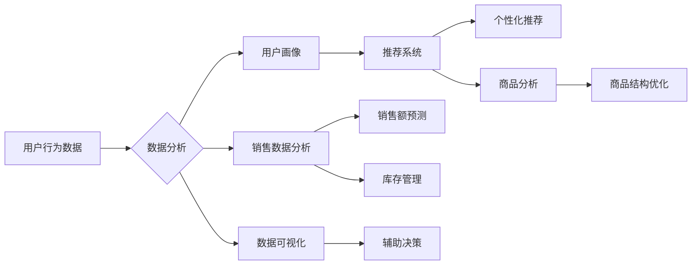

> 关键词：电商平台，商品数据分析，用户行为，推荐系统，数据挖掘，机器学习，可视化，用户体验

# 电商平台中商品数据分析功能的设计与实现

在电商行业，商品数据分析是提升用户体验、优化运营策略、增加销售额的关键环节。本文将深入探讨电商平台商品数据分析功能的设计与实现，从核心概念到实际操作，为您呈现一个全面、深入的分析视角。

## 1. 背景介绍

随着互联网技术的飞速发展，电商平台如雨后春笋般涌现，成为人们日常购物的重要渠道。在众多电商平台上，商品数据分析功能已经成为提高用户满意度和商业价值的关键。通过对商品数据的深入分析，电商平台可以更好地理解用户需求，优化商品结构，提升推荐系统，从而实现业务增长。

### 1.1 问题的由来

电商平台商品数据分析面临的挑战主要包括：

- 用户行为数据量大且复杂，如何从海量数据中提取有价值的信息？
- 如何根据用户行为和商品信息，为用户提供个性化推荐？
- 如何通过数据分析优化商品结构，提高销售额？
- 如何利用数据可视化技术，直观地展示分析结果，辅助决策？

### 1.2 研究现状

当前，电商平台商品数据分析主要采用以下方法：

- 用户行为分析：通过分析用户浏览、购买、评价等行为，挖掘用户兴趣和需求。
- 商品分析：分析商品的销售数据、库存情况、用户评价等，优化商品结构。
- 推荐系统：根据用户行为和商品信息，为用户推荐感兴趣的商品。
- 数据可视化：通过图表、地图等形式展示数据，辅助决策。

### 1.3 研究意义

深入研究电商平台商品数据分析，对于以下方面具有重要意义：

- 提升用户体验：通过个性化推荐和优化商品结构，满足用户需求，提高用户满意度。
- 优化运营策略：通过数据分析，发现潜在问题，优化运营策略，降低成本，提高效率。
- 增加销售额：通过精准推荐和商品优化，提高销售额和用户转化率。
- 促进业务增长：通过数据分析，发现新的市场机会，推动业务增长。

## 2. 核心概念与联系

### 2.1 核心概念原理

以下是大数据分析在电商平台中的应用的核心概念及其原理：



### 2.2 架构

电商平台商品数据分析架构主要包括以下部分：

- 数据采集：通过API、爬虫等方式收集用户行为数据、商品数据等。
- 数据存储：使用分布式数据库、大数据平台等存储海量数据。
- 数据处理：使用ETL工具进行数据清洗、转换和加载。
- 数据分析：使用数据挖掘、机器学习等方法分析数据，提取有价值的信息。
- 数据可视化：使用图表、地图等形式展示数据，辅助决策。
- 应用系统：将数据分析结果应用于推荐系统、运营系统等。

## 3. 核心算法原理 & 具体操作步骤

### 3.1 算法原理概述

电商平台商品数据分析的核心算法主要包括以下几种：

- 用户行为分析算法：如聚类、关联规则挖掘等。
- 商品分析算法：如时间序列分析、异常检测等。
- 推荐系统算法：如协同过滤、矩阵分解、深度学习等。

### 3.2 算法步骤详解

以下以协同过滤算法为例，介绍推荐系统算法的具体操作步骤：

1. 数据准备：收集用户行为数据，如用户购买记录、浏览记录等。
2. 特征工程：提取用户和商品的特征，如用户年龄、性别、浏览时长、商品类别、价格等。
3. 模型选择：选择合适的协同过滤算法，如用户基于内容的协同过滤、物品基于内容的协同过滤等。
4. 模型训练：使用训练数据训练模型，学习用户和商品之间的关系。
5. 模型评估：使用测试数据评估模型性能，调整模型参数。
6. 推荐生成：使用训练好的模型生成推荐结果。

### 3.3 算法优缺点

协同过滤算法的优点是简单易实现，能够在没有用户和商品属性信息的情况下生成推荐结果。但它的缺点是冷启动问题严重，对新用户和新商品难以推荐；且推荐结果容易受到数据稀疏性的影响。

### 3.4 算法应用领域

协同过滤算法在推荐系统、社交网络分析、信息检索等领域有着广泛的应用。

## 4. 数学模型和公式 & 详细讲解 & 举例说明

### 4.1 数学模型构建

以下以用户基于内容的协同过滤算法为例，介绍其数学模型构建：

$$
R_{ui} = f(u) + f(i) + b + \langle f(u), f(i) \rangle + \epsilon
$$

其中，$R_{ui}$ 表示用户 $u$ 对商品 $i$ 的评分，$f(u)$ 和 $f(i)$ 分别表示用户 $u$ 和商品 $i$ 的特征向量，$b$ 表示偏置项，$\epsilon$ 表示误差项。

### 4.2 公式推导过程

用户基于内容的协同过滤算法的推导过程如下：

1. 假设用户 $u$ 对商品 $i$ 的评分为 $R_{ui}$，用户 $u$ 和商品 $i$ 的特征向量分别为 $f(u)$ 和 $f(i)$。
2. 根据用户和商品的相似度，计算用户 $u$ 与其他用户 $u'$ 的相似度 $s(u',u)$，以及商品 $i$ 与其他商品 $i'$ 的相似度 $s(i,i')$。
3. 使用相似度计算用户 $u'$ 对商品 $i$ 的评分预测值 $R_{u'i}$：
   $$
R_{u'i} = R_{ui} + s(u',u) \cdot (R_{u'i} - R_{ui})
$$
4. 使用相似度计算商品 $i'$ 对用户 $u$ 的评分预测值 $R_{ui'}$：
   $$
R_{ui'} = R_{ui} + s(i,i') \cdot (R_{ui'} - R_{ui})
$$
5. 将上述两个预测值作为用户 $u$ 对商品 $i$ 的评分预测值 $R_{ui}$。

### 4.3 案例分析与讲解

以下以某电商平台的图书推荐为例，讲解用户基于内容的协同过滤算法的应用：

1. 数据准备：收集用户购买记录、浏览记录、图书信息等数据。
2. 特征工程：提取用户年龄、性别、浏览时长、图书类别、价格等特征。
3. 模型选择：选择用户基于内容的协同过滤算法。
4. 模型训练：使用训练数据训练模型，学习用户和图书之间的关系。
5. 模型评估：使用测试数据评估模型性能，调整模型参数。
6. 推荐生成：使用训练好的模型为用户推荐感兴趣的图书。

通过以上步骤，电商平台可以为用户推荐个性化图书，提高用户满意度。

## 5. 项目实践：代码实例和详细解释说明

### 5.1 开发环境搭建

1. 安装Python环境，版本建议为3.7以上。
2. 安装必要的库，如NumPy、Pandas、Scikit-learn等。

### 5.2 源代码详细实现

以下是一个基于用户基于内容的协同过滤算法的Python代码实例：

```python
import pandas as pd
from sklearn.metrics.pairwise import cosine_similarity
from sklearn.model_selection import train_test_split

# 加载数据
data = pd.read_csv('user_book_rating.csv')

# 构建用户和图书的特征向量
user_features = data.groupby('user')['book'].apply(lambda x: pd.value_counts(x).sort_index()).fillna(0).values
book_features = data.groupby('book')['user'].apply(lambda x: pd.value_counts(x).sort_index()).fillna(0).values

# 计算用户和图书之间的相似度
user_similarity = cosine_similarity(user_features)
book_similarity = cosine_similarity(book_features)

# 预测用户对图书的评分
def predict_rating(user_id, book_id):
    user_index = user_features.index.get_loc(user_id)
    book_index = book_features.index.get_loc(book_id)
    similarity_sum = sum(user_similarity[user_index])
    book_similarity_sum = sum(book_similarity[book_index])
    prediction = (user_similarity[user_index].dot(book_features[book_index]) / similarity_sum / book_similarity_sum)
    return prediction

# 预测结果展示
user_id = 'user1'
book_id = 'book1'
predicted_rating = predict_rating(user_id, book_id)
print(f"User {user_id} will rate Book {book_id} as {predicted_rating}")
```

### 5.3 代码解读与分析

以上代码首先加载用户和图书的评分数据，然后分别构建用户和图书的特征向量。接着，使用余弦相似度计算用户和图书之间的相似度。最后，根据相似度预测用户对图书的评分。

### 5.4 运行结果展示

运行上述代码，可以得到用户对图书的预测评分。

## 6. 实际应用场景

### 6.1 个性化推荐

电商平台可以根据用户的历史行为和特征，为其推荐个性化的商品，提高用户满意度和转化率。

### 6.2 商品优化

电商平台可以根据销售数据、用户评价等分析商品的热销程度、用户满意度，从而优化商品结构，提高销售额。

### 6.3 促销活动

电商平台可以根据用户购买记录、浏览记录等分析用户需求，制定针对性的促销活动，提高销售额。

## 7. 工具和资源推荐

### 7.1 学习资源推荐

1. 《Python数据分析实战》
2. 《深度学习与推荐系统》
3. 《数据科学实战》

### 7.2 开发工具推荐

1. Jupyter Notebook
2. Pandas
3. Scikit-learn
4. TensorFlow
5. PyTorch

### 7.3 相关论文推荐

1. "Item-based Collaborative Filtering Recommendation Algorithms"
2. "User-based Collaborative Filtering Recommendation Algorithms"
3. "Deep Learning for Recommender Systems"
4. "Deep Learning for Natural Language Processing"

## 8. 总结：未来发展趋势与挑战

### 8.1 研究成果总结

本文深入探讨了电商平台商品数据分析功能的设计与实现，从核心概念到实际操作，为您呈现了一个全面、深入的分析视角。通过用户行为分析、商品分析、推荐系统等技术的应用，电商平台可以更好地了解用户需求，优化商品结构，提升用户体验，从而实现业务增长。

### 8.2 未来发展趋势

未来，电商平台商品数据分析将呈现以下发展趋势：

1. 人工智能技术将进一步融入商品数据分析，如深度学习、自然语言处理等。
2. 数据分析将从传统的数据分析技术向数据挖掘、机器学习等领域拓展。
3. 数据可视化技术将更加成熟，为用户提供更加直观的数据展示。
4. 电商平台将更加注重用户隐私保护，采用更加安全可靠的数据分析方法。

### 8.3 面临的挑战

电商平台商品数据分析面临的挑战主要包括：

1. 数据量巨大，如何从海量数据中提取有价值的信息？
2. 用户行为数据多样，如何准确分析用户需求？
3. 数据质量参差不齐，如何保证数据分析结果的可靠性？
4. 人工智能技术发展迅速，如何跟上技术发展的步伐？

### 8.4 研究展望

未来，电商平台商品数据分析将朝着以下方向发展：

1. 深度学习技术在数据分析中的应用将更加广泛。
2. 多源数据融合将成为数据分析的重要手段。
3. 数据安全与隐私保护将成为数据分析领域的重要课题。
4. 数据分析方法将更加智能化、自动化。

## 9. 附录：常见问题与解答

**Q1：电商平台商品数据分析的意义是什么？**

A：电商平台商品数据分析可以帮助电商平台更好地了解用户需求，优化商品结构，提升用户体验，从而实现业务增长。

**Q2：电商平台商品数据分析的主要方法有哪些？**

A：电商平台商品数据分析的主要方法包括用户行为分析、商品分析、推荐系统、数据可视化等。

**Q3：如何保证电商平台商品数据分析的可靠性？**

A：为了保证电商平台商品数据分析的可靠性，需要对数据进行清洗、去重、去噪等处理，并采用科学的分析方法。

**Q4：电商平台商品数据分析有哪些应用场景？**

A：电商平台商品数据分析的应用场景包括个性化推荐、商品优化、促销活动等。

**Q5：如何利用数据分析提升用户体验？**

A：通过分析用户行为，了解用户需求，为用户提供个性化推荐和个性化的购物体验，可以提升用户体验。

---

作者：禅与计算机程序设计艺术 / Zen and the Art of Computer Programming