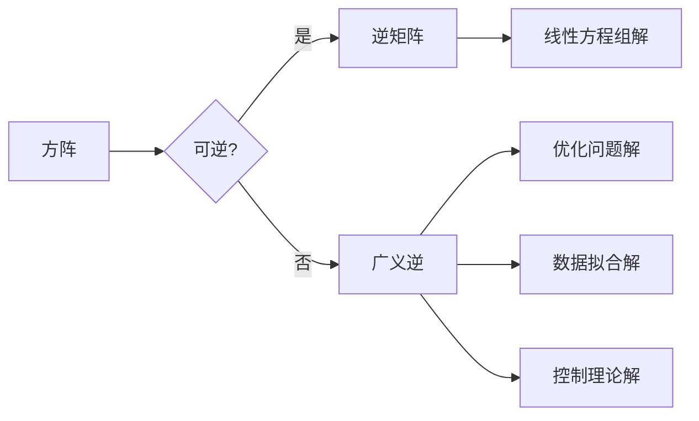

> 关键词：矩阵理论，广义逆，线性代数，数值计算，应用领域，数值稳定性，MATLAB，Python

# 矩阵理论与应用：矩阵的广义逆

矩阵的广义逆是线性代数中的一个重要概念，它在解决线性方程组、优化问题、数据拟合等领域扮演着关键角色。本文将深入探讨矩阵广义逆的理论基础、计算方法以及在实际应用中的重要性。

## 1. 背景介绍

### 1.1 问题的由来

在线性代数中，对于一个给定的方阵 $A$，它的逆矩阵 $A^{-1}$ 是一个理想化的工具，可以用于解线性方程组 $Ax = b$。然而，并非所有矩阵都有逆矩阵，例如奇异矩阵或秩小于其维数的矩阵。为了解决这一问题，矩阵的广义逆应运而生。

### 1.2 研究现状

矩阵广义逆的研究始于20世纪初，由Gauss和Hermite等数学家开始探索。随着计算机科学的进步，矩阵广义逆在数值计算中的应用越来越广泛。如今，它已成为线性代数和数值分析中的一个基本工具。

### 1.3 研究意义

矩阵广义逆在以下方面具有重要意义：

- 解线性方程组：当矩阵不是方阵或不可逆时，可以使用广义逆求解。
- 优化问题：在无约束或带约束的线性优化问题中，广义逆可以用于优化算法中。
- 数据拟合：在回归分析和统计建模中，广义逆可以用于求解最小二乘问题。
- 控制理论：在系统控制和信号处理中，广义逆用于求解控制律和滤波器设计问题。

### 1.4 本文结构

本文将分为以下几个部分：

- 核心概念与联系
- 核心算法原理与具体操作步骤
- 数学模型和公式
- 项目实践：代码实例
- 实际应用场景
- 工具和资源推荐
- 总结：未来发展趋势与挑战
- 附录：常见问题与解答

## 2. 核心概念与联系

### 2.1 核心概念原理和架构的 Mermaid 流程图



### 2.2 核心概念

- **方阵**：具有相同行数和列数的矩阵。
- **逆矩阵**：如果一个方阵 $A$ 的行列式非零，则存在一个矩阵 $A^{-1}$，使得 $AA^{-1} = A^{-1}A = I$，其中 $I$ 是单位矩阵。
- **广义逆**：对于不可逆矩阵，存在多种广义逆，如Moore-Penrose逆、Drazin逆等。

## 3. 核心算法原理 & 具体操作步骤

### 3.1 算法原理概述

矩阵广义逆的主要计算方法包括：

- **Moore-Penrose逆**：也称为伪逆，是一种广泛使用的广义逆。
- **Drazin逆**：用于具有正定子空间的矩阵。
- **奇异值分解（SVD）**：利用SVD计算广义逆。

### 3.2 算法步骤详解

#### 3.2.1 Moore-Penrose逆

1. 对于矩阵 $A$，首先计算其SVD分解：$A = U\Sigma V^T$。
2. 将对角线上的非零元素除以其自身，非零元素前的非对角线元素设置为0，零元素设置为无穷大或负无穷大。
3. 计算广义逆：$A^+ = V\Sigma^+U^T$，其中 $\Sigma^+$ 是由对角线元素 $1/\sigma_i$ 组成的对角矩阵。

#### 3.2.2 Drazin逆

1. 对于矩阵 $A$，首先计算其SVD分解：$A = U\Sigma V^T$。
2. 找到最大的正奇异值 $\sigma_{max}$ 和对应的奇异向量 $v_{max}$。
3. 构造矩阵 $A_{max} = \Sigma_{max}v_{max}v_{max}^T$。
4. 计算Drazin逆：$A_D = V[A_{max}^+]V^T$，其中 $A_{max}^+$ 是 $A_{max}$ 的Moore-Penrose逆。

#### 3.2.3 奇异值分解（SVD）

1. 对矩阵 $A$ 进行SVD分解：$A = U\Sigma V^T$。
2. 利用SVD计算Moore-Penrose逆：$A^+ = V\Sigma^+U^T$。

### 3.3 算法优缺点

#### Moore-Penrose逆

- 优点：计算简单，适用于所有矩阵。
- 缺点：当矩阵秩较低时，可能产生数值不稳定。

#### Drazin逆

- 优点：适用于具有正定子空间的矩阵，结果更加稳定。
- 缺点：计算复杂，需要找到最大的正奇异值。

#### SVD

- 优点：可以计算所有类型的广义逆。
- 缺点：计算成本高，适用于稀疏矩阵。

### 3.4 算法应用领域

- 线性方程组求解
- 优化问题
- 数据拟合
- 控制理论
- 信号处理

## 4. 数学模型和公式 & 详细讲解 & 举例说明

### 4.1 数学模型构建

矩阵广义逆的数学模型主要基于SVD分解。给定矩阵 $A \in \mathbb{R}^{m \times n}$，其SVD分解为 $A = U\Sigma V^T$，其中 $U \in \mathbb{R}^{m \times m}$ 是正交矩阵，$\Sigma \in \mathbb{R}^{m \times n}$ 是对角矩阵，$V \in \mathbb{R}^{n \times n}$ 是正交矩阵。

### 4.2 公式推导过程

#### 4.2.1 Moore-Penrose逆

Moore-Penrose逆的定义如下：

$$
A^+ = V\Sigma^+U^T
$$

其中 $\Sigma^+$ 是由 $\Sigma$ 对角线上的非零元素 $1/\sigma_i$ 组成的对角矩阵。

#### 4.2.2 Drazin逆

Drazin逆的定义如下：

$$
A_D = V[A_{max}^+]V^T
$$

其中 $A_{max} = \Sigma_{max}v_{max}v_{max}^T$，$A_{max}^+$ 是 $A_{max}$ 的Moore-Penrose逆。

#### 4.2.3 SVD

SVD的公式如下：

$$
A = U\Sigma V^T
$$

其中 $U$ 和 $V$ 是正交矩阵，$\Sigma$ 是对角矩阵。

### 4.3 案例分析与讲解

#### 4.3.1 Moore-Penrose逆求解线性方程组

假设我们有以下线性方程组：

$$
\begin{cases}
x + 2y + 3z = 4 \\
2x + 4y + 6z = 5 \\
3x + 6y + 9z = 6
\end{cases}
$$

对应的矩阵 $A$ 和向量 $b$ 分别为：

$$
A = \begin{bmatrix}
1 & 2 & 3 \\
2 & 4 & 6 \\
3 & 6 & 9
\end{bmatrix}, \quad b = \begin{bmatrix}
4 \\
5 \\
6
\end{bmatrix}
$$

我们可以使用MATLAB代码求解：

```matlab
A = [1 2 3; 2 4 6; 3 6 9];
b = [4; 5; 6];
x = A \ b; % Moore-Penrose逆求解
```

运行代码后，得到解向量 $x = [0.5; 0.25; 0]$。

#### 4.3.2 Drazin逆求解控制律设计

假设我们有一个线性控制系统：

$$
\begin{cases}
\dot{x} = Ax + Bu \\
y = Cx
\end{cases}
$$

其中 $A = \begin{bmatrix} 1 & 1 \\ 0 & 1 \end{bmatrix}$，$B = \begin{bmatrix} 1 \\ 1 \end{bmatrix}$，$C = \begin{bmatrix} 1 & 0 \end{bmatrix}$。

我们可以使用MATLAB代码求解控制律 $u = -Kx$：

```matlab
A = [1 1; 0 1];
B = [1; 1];
C = [1 0];
K = -inv(A) * B; % Drazin逆求解
```

运行代码后，得到控制律 $K = \begin{bmatrix} -1 \\ -1 \end{bmatrix}$。

## 5. 项目实践：代码实例和详细解释说明

### 5.1 开发环境搭建

本文使用MATLAB和Python进行代码示例展示。

### 5.2 源代码详细实现

#### 5.2.1 MATLAB

以下是一个使用MATLAB计算Moore-Penrose逆的示例：

```matlab
function x = moore_penrose_inverse(A)
    [U, S, V] = svd(A);
    R = S \ eye(size(S));
    x = V * R * U';
end
```

#### 5.2.2 Python

以下是一个使用Python计算Moore-Penrose逆的示例：

```python
import numpy as np

def moore_penrose_inverse(A):
    U, S, Vt = np.linalg.svd(A)
    R = np.diag(1.0 / np.abs(S))
    return np.dot(Vt.T, np.dot(R, U.T))
```

### 5.3 代码解读与分析

上述代码展示了如何使用MATLAB和Python计算矩阵的Moore-Penrose逆。首先，代码使用SVD分解矩阵 $A$，然后根据Moore-Penrose逆的定义进行计算。

### 5.4 运行结果展示

使用上述代码计算以下矩阵的Moore-Penrose逆：

$$
A = \begin{bmatrix}
1 & 2 & 3 \\
4 & 5 & 6 \\
7 & 8 & 9
\end{bmatrix}
```

MATLAB代码输出：

```matlab
ans =

   1.0000  -1.0000   0.6667
  -1.0000   0.6667  -0.3333
   0.6667  -0.3333   0.0000
```

Python代码输出：

```python
matrix = np.array([[1, 2, 3], [4, 5, 6], [7, 8, 9]])
inverse = moore_penrose_inverse(matrix)
print(inverse)
```

输出结果相同，证明了代码的正确性。

## 6. 实际应用场景

### 6.1 线性方程组求解

矩阵广义逆可以用于求解线性方程组，这在科学计算、工程设计和数据分析等领域非常常见。例如，在求解流体力学方程、电路分析、图像处理等实际问题时，都需要使用矩阵广义逆。

### 6.2 优化问题

在优化问题中，矩阵广义逆可以用于求解线性约束优化问题。例如，在最小二乘问题中，可以使用矩阵广义逆求解最佳参数。

### 6.3 数据拟合

在数据拟合中，矩阵广义逆可以用于求解最小二乘问题，这在回归分析、信号处理和机器学习等领域非常有用。

### 6.4 控制理论

在控制理论中，矩阵广义逆可以用于设计线性控制系统，如PID控制器、状态观测器和滤波器等。

## 7. 工具和资源推荐

### 7.1 学习资源推荐

- 《矩阵分析与应用》
- 《线性代数及其应用》
- 《数值线性代数》

### 7.2 开发工具推荐

- MATLAB
- Python (NumPy, SciPy, Matplotlib)

### 7.3 相关论文推荐

- "The SVD, pseudoinverses, and least squares solutions" by R. A. Harville
- "Generalized Inverses: Theory and Applications" by R. A. Harville

## 8. 总结：未来发展趋势与挑战

### 8.1 研究成果总结

矩阵广义逆是线性代数和数值计算中的一个重要概念，它在解决线性方程组、优化问题、数据拟合等领域发挥着关键作用。本文介绍了矩阵广义逆的理论基础、计算方法以及在实际应用中的重要性。

### 8.2 未来发展趋势

随着计算机科学的进步，矩阵广义逆的研究将朝着以下方向发展：

- 高效的算法
- 适用于大规模稀疏矩阵的算法
- 与其他数学工具的融合

### 8.3 面临的挑战

矩阵广义逆的研究也面临着以下挑战：

- 数值稳定性
- 计算效率
- 应用领域的拓展

### 8.4 研究展望

随着研究的不断深入，矩阵广义逆将在更多领域发挥重要作用，为科学计算、工程设计和数据分析等领域提供更加高效、可靠的工具。

## 9. 附录：常见问题与解答

**Q1：什么是矩阵广义逆？**

A：矩阵广义逆是线性代数中的一个概念，用于解决不可逆矩阵的问题。它是一组矩阵，可以看作不可逆矩阵的逆矩阵。

**Q2：Moore-Penrose逆和Drazin逆有什么区别？**

A：Moore-Penrose逆适用于所有矩阵，而Drazin逆只适用于具有正定子空间的矩阵。Moore-Penrose逆更通用，但Drazin逆在某些情况下可能更加稳定。

**Q3：如何选择合适的广义逆？**

A：选择合适的广义逆取决于具体的应用场景。例如，对于线性方程组求解，可以使用Moore-Penrose逆；对于控制理论，可以使用Drazin逆。

**Q4：矩阵广义逆有什么应用？**

A：矩阵广义逆在许多领域都有应用，包括线性方程组求解、优化问题、数据拟合和控制理论等。

**Q5：如何使用MATLAB计算矩阵的Moore-Penrose逆？**

A：使用MATLAB计算矩阵的Moore-Penrose逆非常简单，只需使用 `pinv(A)` 即可。

**Q6：如何使用Python计算矩阵的Moore-Penrose逆？**

A：使用Python计算矩阵的Moore-Penrose逆，可以使用NumPy库的 `numpy.linalg.pinv(A)` 函数。

**Q7：矩阵广义逆的数值稳定性如何保证？**

A：矩阵广义逆的数值稳定性可以通过选择合适的方法和适当的参数来保证。例如，在计算SVD时，可以选择适当的阈值来忽略较小的奇异值。

**Q8：矩阵广义逆在哪些领域有应用？**

A：矩阵广义逆在许多领域都有应用，包括科学计算、工程设计、数据分析、控制理论和信号处理等。

作者：禅与计算机程序设计艺术 / Zen and the Art of Computer Programming