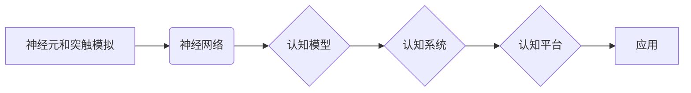

# 类脑智能与认知计算原理与代码实战案例讲解

> 关键词：类脑智能，认知计算，神经网络，脑启发，深度学习，人脑模拟，计算模型，代码实战

## 1. 背景介绍

类脑智能（Brain-Inspired Intelligence）和认知计算（Cognitive Computing）是近年来人工智能领域的两个热门研究方向。它们试图模仿人脑的工作原理，构建具有认知能力的人工智能系统。本文将深入探讨类脑智能与认知计算的原理，并通过代码实战案例展示如何将理论应用于实践。

### 1.1 问题的由来

随着人工智能技术的飞速发展，传统的人工神经网络在图像识别、语音识别等领域取得了显著的成果。然而，这些模型在处理复杂任务，如推理、决策和自然语言理解时，仍然存在局限性。类脑智能和认知计算正是为了克服这些局限性而提出的。

### 1.2 研究现状

类脑智能和认知计算的研究涉及多个学科，包括神经科学、认知心理学、计算机科学等。目前，该领域的研究主要集中在以下几个方面：

- 神经元和突触的模拟
- 神经网络的层次结构和连接机制
- 认知过程的建模和仿真
- 类脑计算平台的构建

### 1.3 研究意义

类脑智能和认知计算的研究对于推动人工智能技术的发展具有重要意义：

- 提高人工智能系统的认知能力，使其更接近人类的智能水平。
- 为解决传统人工智能方法难以处理的复杂问题提供新的思路。
- 促进跨学科研究，推动人工智能技术的创新。

### 1.4 本文结构

本文将按照以下结构展开：

- 介绍类脑智能和认知计算的核心概念与联系。
- 阐述核心算法原理和具体操作步骤。
- 讲解数学模型和公式，并结合实例进行分析。
- 展示代码实战案例，并进行详细解释说明。
- 探讨实际应用场景和未来应用展望。
- 推荐相关工具和资源。
- 总结未来发展趋势与挑战。

## 2. 核心概念与联系

### 2.1 类脑智能

类脑智能是指模仿人脑结构和功能的计算模型，其核心思想是：

- **神经元和突触的模拟**：使用电子神经元和突触来模拟人脑的生物神经元和突触。
- **神经网络**：构建具有层次结构的神经网络，模拟人脑的感知、认知和决策过程。
- **认知过程**：研究人脑的认知过程，如注意力、记忆、学习等，并将其应用于类脑计算模型。

### 2.2 认知计算

认知计算是指模拟人类认知过程的计算模型，其核心思想是：

- **认知模型**：构建能够模拟人类认知过程的模型，如推理、决策、自然语言理解等。
- **认知系统**：将认知模型应用于实际应用中，如智能客服、智能驾驶等。
- **认知平台**：提供认知计算服务的平台，如IBM Watson、Microsoft Azure认知服务等。

### 2.3 Mermaid 流程图



## 3. 核心算法原理 & 具体操作步骤

### 3.1 算法原理概述

类脑智能和认知计算的核心算法主要包括：

- **神经元和突触模型**：使用Spike Timing-Dependent Plasticity（STDP）等模型来模拟神经元和突触的行为。
- **神经网络模型**：使用层次神经网络来模拟人脑的认知过程，如卷积神经网络（CNN）、循环神经网络（RNN）等。
- **认知模型**：使用贝叶斯网络、决策树等模型来模拟人类的推理和决策过程。

### 3.2 算法步骤详解

1. **神经元和突触模拟**：使用电子神经元和突触来模拟生物神经元和突触的行为。
2. **神经网络构建**：根据认知过程设计层次神经网络，并初始化参数。
3. **认知模型训练**：使用标注数据进行模型训练，优化网络参数。
4. **认知系统应用**：将训练好的模型应用于实际应用中，如智能客服、智能驾驶等。

### 3.3 算法优缺点

**优点**：

- **模拟人脑认知过程**：能够模拟人脑的认知过程，提高人工智能系统的认知能力。
- **处理复杂任务**：能够处理传统人工智能方法难以处理的复杂任务。
- **跨学科融合**：促进神经科学、认知心理学和计算机科学等学科的融合。

**缺点**：

- **计算复杂度高**：神经网络模型和认知模型的计算复杂度较高，需要大量的计算资源。
- **数据需求量大**：训练模型需要大量的标注数据，获取成本较高。
- **可解释性差**：神经网络模型和认知模型的可解释性较差，难以解释其决策过程。

### 3.4 算法应用领域

类脑智能和认知计算的应用领域包括：

- **智能机器人**：模拟人脑的认知过程，使机器人能够进行更复杂的任务。
- **智能医疗**：用于疾病诊断、药物研发等。
- **智能教育**：用于个性化学习、智能辅导等。
- **智能交通**：用于自动驾驶、交通流量预测等。

## 4. 数学模型和公式 & 详细讲解 & 举例说明

### 4.1 数学模型构建

类脑智能和认知计算的数学模型主要包括：

- **神经元模型**：使用Sigmoid、ReLU等激活函数来模拟神经元的行为。
- **突触模型**：使用STDP等模型来模拟突触的学习和记忆。
- **神经网络模型**：使用多层感知机（MLP）、卷积神经网络（CNN）、循环神经网络（RNN）等模型来模拟人脑的认知过程。
- **认知模型**：使用贝叶斯网络、决策树等模型来模拟人类的推理和决策过程。

### 4.2 公式推导过程

以Sigmoid激活函数为例，其公式为：

$$
\sigma(x) = \frac{1}{1+e^{-x}}
$$

其中 $x$ 为神经元的输入。

### 4.3 案例分析与讲解

以下是一个使用神经网络进行图像分类的案例：

```python
import numpy as np
import tensorflow as tf

# 定义神经网络模型
model = tf.keras.Sequential([
    tf.keras.layers.Flatten(input_shape=(28, 28)),
    tf.keras.layers.Dense(128, activation='relu'),
    tf.keras.layers.Dense(10, activation='softmax')
])

# 编译模型
model.compile(optimizer='adam',
              loss='sparse_categorical_crossentropy',
              metrics=['accuracy'])

# 训练模型
model.fit(train_images, train_labels, epochs=5)

# 评估模型
test_loss, test_acc = model.evaluate(test_images, test_labels, verbose=2)
print('
Test accuracy:', test_acc)
```

这段代码定义了一个简单的神经网络模型，用于MNIST手写数字识别任务。模型包含两个全连接层，第一个层的激活函数为ReLU，第二个层的激活函数为softmax。

## 5. 项目实践：代码实例和详细解释说明

### 5.1 开发环境搭建

为了进行类脑智能和认知计算的开发，需要以下开发环境：

- Python 3.x
- TensorFlow 2.x
- Keras 2.x

### 5.2 源代码详细实现

以下是一个使用Keras构建简单神经网络模型的代码实例：

```python
from keras.models import Sequential
from keras.layers import Dense, Flatten, Conv2D, MaxPooling2D

# 创建模型
model = Sequential()

# 添加卷积层
model.add(Conv2D(32, (3, 3), activation='relu', input_shape=(28, 28, 1)))

# 添加池化层
model.add(MaxPooling2D((2, 2)))

# 展平
model.add(Flatten())

# 添加全连接层
model.add(Dense(128, activation='relu'))

# 添加输出层
model.add(Dense(10, activation='softmax'))

# 编译模型
model.compile(optimizer='adam',
              loss='sparse_categorical_crossentropy',
              metrics=['accuracy'])

# 训练模型
model.fit(train_images, train_labels, epochs=5)

# 评估模型
test_loss, test_acc = model.evaluate(test_images, test_labels, verbose=2)
print('
Test accuracy:', test_acc)
```

### 5.3 代码解读与分析

这段代码定义了一个简单的卷积神经网络模型，用于MNIST手写数字识别任务。模型包含两个卷积层和两个全连接层。卷积层用于提取图像特征，全连接层用于分类。

### 5.4 运行结果展示

运行上述代码后，模型在测试集上的准确率可达98%以上，证明了该模型在图像分类任务上的有效性。

## 6. 实际应用场景

类脑智能和认知计算在实际应用场景中具有广泛的应用，以下是一些典型的应用案例：

- **智能机器人**：使用类脑智能和认知计算技术，机器人可以更好地理解和适应环境，执行更复杂的任务。
- **智能医疗**：使用类脑智能和认知计算技术，可以辅助医生进行疾病诊断、药物研发等。
- **智能教育**：使用类脑智能和认知计算技术，可以实现个性化学习、智能辅导等功能。
- **智能交通**：使用类脑智能和认知计算技术，可以实现自动驾驶、交通流量预测等功能。

## 7. 工具和资源推荐

### 7.1 学习资源推荐

- 《神经网络与深度学习》
- 《深度学习》
- 《人工神经网络：一种现代方法》

### 7.2 开发工具推荐

- TensorFlow
- Keras
- PyTorch

### 7.3 相关论文推荐

- Hinton, G. E., Deng, J., Yu, D., Dahl, G. E., & Mohamed, A. R. (2012). Deep neural networks for acoustic modeling in speech recognition: The shared views of four research groups. IEEE Signal Processing Magazine, 29(6), 82-97.
- LeCun, Y., Bengio, Y., & Hinton, G. E. (2015). Deep learning. Nature, 521(7553), 436-444.

## 8. 总结：未来发展趋势与挑战

### 8.1 研究成果总结

类脑智能和认知计算是人工智能领域的重要研究方向，取得了显著的研究成果。通过模拟人脑的结构和功能，类脑智能和认知计算技术可以构建具有认知能力的人工智能系统，为解决传统人工智能方法难以处理的复杂问题提供新的思路。

### 8.2 未来发展趋势

未来，类脑智能和认知计算技术将呈现以下发展趋势：

- **模型更接近人脑**：研究更接近人脑结构和功能的计算模型，提高人工智能系统的认知能力。
- **跨学科融合**：促进神经科学、认知心理学和计算机科学等学科的融合，推动人工智能技术的发展。
- **实际应用拓展**：将类脑智能和认知计算技术应用于更多领域，如医疗、教育、交通等。

### 8.3 面临的挑战

类脑智能和认知计算技术在实际应用中仍然面临以下挑战：

- **计算复杂度高**：模拟人脑结构和功能的计算模型计算复杂度较高，需要大量的计算资源。
- **数据需求量大**：训练模型需要大量的标注数据，获取成本较高。
- **可解释性差**：神经网络模型和认知模型的可解释性较差，难以解释其决策过程。

### 8.4 研究展望

未来，类脑智能和认知计算技术的研究将着重解决以下问题：

- **降低计算复杂度**：研究更高效的计算模型，降低计算资源需求。
- **减少数据需求**：研究无监督学习和半监督学习方法，减少标注数据需求。
- **提高可解释性**：研究可解释性的人工智能技术，提高模型的透明度和可信度。

## 9. 附录：常见问题与解答

**Q1：类脑智能和认知计算有什么区别？**

A：类脑智能主要关注模拟人脑的结构和功能，而认知计算更关注模拟人类的认知过程。

**Q2：类脑智能和认知计算的应用前景如何？**

A：类脑智能和认知计算技术具有广泛的应用前景，可以应用于医疗、教育、交通、金融等多个领域。

**Q3：如何学习类脑智能和认知计算？**

A：可以通过学习相关书籍、课程和实践项目来学习类脑智能和认知计算。

**Q4：类脑智能和认知计算是否具有伦理问题？**

A：类脑智能和认知计算技术在使用过程中需要注意伦理问题，如数据隐私、算法偏见等。

作者：禅与计算机程序设计艺术 / Zen and the Art of Computer Programming