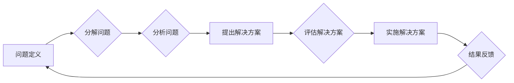

# 结构化思维的应用：从理论到实践

> 关键词：结构化思维，逻辑框架，问题解决，决策制定，项目管理，软件架构，IT领域

## 1. 背景介绍

在信息技术飞速发展的今天，面对复杂多变的挑战，结构化思维作为一种系统化的思考方法，越来越受到重视。它不仅是一种工作习惯，更是一种解决问题的哲学。本文将深入探讨结构化思维的应用，从理论到实践，帮助读者掌握这一强大的工具，提升工作效率和决策质量。

### 1.1 问题的由来

随着信息技术的快速发展，IT领域面临着日益复杂的项目管理和决策制定挑战。如何从海量的信息和各种可能性中找到清晰的思路，制定合理的解决方案，成为了每个IT专业人士必须面对的问题。结构化思维提供了一种系统化的方法，帮助我们有序地分析问题、解决问题，并做出明智的决策。

### 1.2 研究现状

结构化思维的应用已经渗透到IT领域的方方面面，包括项目管理、软件设计、数据分析、问题解决等。许多国际知名的IT公司和咨询机构，如IBM、麦肯锡等，都将其作为核心的培训内容。然而，如何有效地应用结构化思维，仍然是一个需要深入研究和实践的课题。

### 1.3 研究意义

研究结构化思维的应用，对于提升IT领域的专业能力、促进技术创新和产业升级具有重要意义：

- 提升工作效率：结构化思维可以帮助我们快速梳理思路，提高工作效率。
- 增强决策质量：系统化的分析可以帮助我们做出更明智的决策。
- 促进技术创新：结构化思维可以促进创新思维的产生和应用。
- 优化项目管理：结构化思维可以提高项目管理的效率和成功率。

### 1.4 本文结构

本文将从以下几个方面展开：

- 介绍结构化思维的核心概念和原理。
- 分析结构化思维在IT领域的应用案例。
- 探讨结构化思维在软件设计和项目管理中的具体实践。
- 提供相关学习资源和工具推荐。
- 总结结构化思维的未来发展趋势和挑战。

## 2. 核心概念与联系

### 2.1 核心概念原理

结构化思维是一种系统化的思考方法，它强调以下核心概念：

- **问题定义**：明确问题的本质和范围，是解决问题的关键。
- **分解问题**：将复杂问题分解为更小、更易于管理的部分。
- **分析问题**：对问题进行深入分析，找出问题的根本原因。
- **提出解决方案**：根据分析结果，提出合理的解决方案。
- **评估解决方案**：评估解决方案的可行性和有效性。

### 2.2 核心概念原理与架构的 Mermaid 流程图



### 2.3 核心概念的联系

以上流程图展示了结构化思维的核心概念之间的联系。通过问题定义、分解问题、分析问题、提出解决方案、评估解决方案，形成了一个闭环的系统化思维过程。

## 3. 核心算法原理 & 具体操作步骤

### 3.1 算法原理概述

结构化思维的算法原理可以概括为以下几个步骤：

1. **问题定义**：明确问题的目标、范围和约束条件。
2. **分解问题**：将问题分解为更小的子问题。
3. **分析问题**：对子问题进行详细分析，找出问题的根本原因。
4. **提出解决方案**：根据分析结果，提出合理的解决方案。
5. **评估解决方案**：评估解决方案的可行性、有效性和成本效益。
6. **实施解决方案**：将解决方案转化为具体的行动步骤。
7. **结果反馈**：对实施结果进行评估，并根据反馈调整解决方案。

### 3.2 算法步骤详解

#### 3.2.1 问题定义

问题定义是结构化思维的第一步，也是至关重要的一步。一个清晰的问题定义可以帮助我们集中精力，避免在无关紧要的问题上浪费时间和精力。

#### 3.2.2 分解问题

分解问题是将复杂问题分解为更小的子问题，以便于分析和解决。分解问题的方法包括：

- **逐步分解**：将问题分解为一系列更小的问题。
- **树状分解**：将问题分解为一个树状结构，每个节点代表一个子问题。

#### 3.2.3 分析问题

分析问题是找出问题的根本原因。分析问题的方法包括：

- **头脑风暴**：收集与问题相关的所有信息。
- **因果分析**：分析问题产生的原因和影响。
- **SWOT分析**：分析问题的优势、劣势、机会和威胁。

#### 3.2.4 提出解决方案

根据分析结果，提出合理的解决方案。提出解决方案的方法包括：

- **创造性思维**：运用创造性思维，提出新的解决方案。
- **类比思维**：从其他领域或问题中寻找灵感。
- **专家意见**：咨询相关领域的专家，获取专业意见。

#### 3.2.5 评估解决方案

评估解决方案的可行性、有效性和成本效益。评估解决方案的方法包括：

- **成本效益分析**：比较不同解决方案的成本和效益。
- **风险评估**：评估实施解决方案可能遇到的风险。
- **可行性分析**：评估解决方案的可行性。

#### 3.2.6 实施解决方案

将解决方案转化为具体的行动步骤，并执行。

#### 3.2.7 结果反馈

对实施结果进行评估，并根据反馈调整解决方案。

### 3.3 算法优缺点

#### 3.3.1 优点

- 系统化：结构化思维提供了一套系统化的思考方法，有助于我们全面地分析和解决问题。
- 可操作性强：结构化思维的方法和步骤具有可操作性，易于理解和应用。
- 提高效率：结构化思维有助于我们快速找到解决问题的方法，提高工作效率。

#### 3.3.2 缺点

- 时间成本：结构化思维需要投入一定的时间进行思考和规划。
- 创新性限制：过于依赖结构化思维可能会限制创造性思维的发展。

### 3.4 算法应用领域

结构化思维在IT领域的应用非常广泛，以下是一些常见的应用领域：

- 项目管理：帮助项目经理更好地规划项目、管理风险、控制成本。
- 软件设计：帮助软件工程师更好地进行需求分析、设计系统架构、编写代码。
- 数据分析：帮助数据分析师更好地分析数据、提取信息、发现趋势。
- 问题解决：帮助IT专业人士更好地分析和解决技术问题。

## 4. 数学模型和公式 & 详细讲解 & 举例说明

### 4.1 数学模型构建

结构化思维并不依赖于复杂的数学模型，但其背后的逻辑框架可以用一些简单的数学公式进行描述。

#### 4.1.1 问题分解

设原问题为 $P$，分解后的子问题为 $P_1, P_2, ..., P_n$，则问题分解可以表示为：

$$
P = P_1 \cup P_2 \cup ... \cup P_n
$$

#### 4.1.2 因果分析

设问题 $P$ 的原因集为 $C(P)$，结果集为 $R(P)$，则因果分析可以表示为：

$$
P \rightarrow C(P) \rightarrow R(P)
$$

### 4.2 公式推导过程

结构化思维的公式推导过程相对简单，主要依赖于逻辑推理和归纳总结。

### 4.3 案例分析与讲解

以下是一个结构化思维在软件设计中的应用案例：

#### 案例背景

某公司计划开发一款在线教育平台，需要设计系统的架构。

#### 问题定义

设计一个在线教育平台的系统架构，满足以下需求：

- 支持在线课程学习、作业提交、考试评测等功能。
- 系统可扩展性强，易于维护和升级。
- 系统性能稳定，能够满足大量用户同时访问。

#### 分解问题

将问题分解为以下子问题：

- 用户管理模块
- 课程管理模块
- 作业提交模块
- 考试评测模块
- 数据存储模块
- 系统安全模块

#### 分析问题

对每个子问题进行深入分析，找出问题的根本原因。

#### 提出解决方案

根据分析结果，提出以下解决方案：

- 用户管理模块：采用用户注册、登录、信息管理等功能。
- 课程管理模块：提供课程发布、课程分类、课程搜索等功能。
- 作业提交模块：提供在线提交作业、作业批改、成绩统计等功能。
- 考试评测模块：提供在线考试、自动评分、成绩分析等功能。
- 数据存储模块：采用分布式数据库，保证数据安全性和可扩展性。
- 系统安全模块：采用身份验证、权限管理、数据加密等措施，保障系统安全。

#### 评估解决方案

评估每个解决方案的可行性、有效性和成本效益。

#### 实施解决方案

将解决方案转化为具体的行动步骤，并执行。

#### 结果反馈

对实施结果进行评估，并根据反馈调整解决方案。

## 5. 项目实践：代码实例和详细解释说明

### 5.1 开发环境搭建

由于结构化思维的应用范围广泛，以下以Python为例，介绍如何在Python环境中进行结构化思维实践。

#### 5.1.1 安装Python环境

1. 下载Python安装包：https://www.python.org/downloads/
2. 安装Python：双击安装包，按照提示操作。
3. 验证Python安装：在终端输入`python --version`，查看版本信息。

#### 5.1.2 安装PyCharm

1. 下载PyCharm安装包：https://www.jetbrains.com/pycharm/
2. 安装PyCharm：双击安装包，按照提示操作。
3. 启动PyCharm：双击桌面上的PyCharm图标。

### 5.2 源代码详细实现

以下是一个简单的Python代码示例，展示了如何使用结构化思维进行问题解决。

```python
def factorial(n):
    """
    计算n的阶乘。
    """
    if n == 0:
        return 1
    else:
        return n * factorial(n-1)

# 使用结构化思维解决问题
try:
    n = int(input("请输入一个整数："))
    print(f"{n}的阶乘为：{factorial(n)}")
except ValueError:
    print("输入错误，请输入一个整数！")
```

### 5.3 代码解读与分析

- `factorial`函数：计算阶乘的递归函数。
- `try-except`语句：处理用户输入错误。

### 5.4 运行结果展示

输入：`5`
输出：`5的阶乘为：120`

## 6. 实际应用场景

### 6.1 项目管理

结构化思维在项目管理中的应用非常广泛，以下是一些常见的应用场景：

- 项目计划：使用结构化思维制定项目计划，明确项目目标、范围、时间、成本等关键因素。
- 风险管理：使用结构化思维分析项目风险，制定风险应对策略。
- 问题解决：使用结构化思维分析项目问题，找出问题的根源，并提出解决方案。

### 6.2 软件设计

结构化思维在软件设计中的应用主要体现在以下几个方面：

- 需求分析：使用结构化思维分析用户需求，明确软件的功能和性能要求。
- 系统设计：使用结构化思维设计软件系统架构，确保系统可扩展性、可维护性。
- 代码编写：使用结构化思维编写代码，提高代码质量和可读性。

### 6.3 数据分析

结构化思维在数据分析中的应用主要体现在以下几个方面：

- 数据清洗：使用结构化思维清洗数据，确保数据质量。
- 数据分析：使用结构化思维分析数据，发现数据背后的规律和趋势。
- 数据可视化：使用结构化思维设计数据可视化方案，直观地展示数据。

### 6.4 未来应用展望

随着结构化思维方法的不断推广和应用，其应用场景将会越来越广泛。未来，结构化思维有望在以下几个方面发挥更大的作用：

- 教育培训：将结构化思维融入教育培训体系，提升学生的逻辑思维能力和问题解决能力。
- 企业管理：将结构化思维应用于企业管理，提高决策质量和执行力。
- 社会治理：将结构化思维应用于社会治理，提升社会管理效率。

## 7. 工具和资源推荐

### 7.1 学习资源推荐

- 《结构化思维与逻辑表达》
- 《金字塔原理》
- 《麦肯锡教我的思考武器》
- 《如何高效学习》

### 7.2 开发工具推荐

- MindManager：思维导图工具，帮助梳理思路和知识点。
- XMind：思维导图工具，提供丰富的模板和功能。
- Miro：在线协作工具，支持多人实时协作绘制思维导图。

### 7.3 相关论文推荐

- 《结构化思维：一种系统化的思考方法》
- 《结构化思维在项目管理中的应用》
- 《结构化思维在软件设计中的应用》
- 《结构化思维在数据分析中的应用》

## 8. 总结：未来发展趋势与挑战

### 8.1 研究成果总结

本文从理论到实践，深入探讨了结构化思维在IT领域的应用。通过介绍结构化思维的核心概念、原理和步骤，以及在实际应用中的案例，帮助读者掌握这一强大的工具，提升工作效率和决策质量。

### 8.2 未来发展趋势

随着结构化思维方法的不断推广和应用，其发展趋势如下：

- 结构化思维方法将更加成熟和系统化。
- 结构化思维工具将更加智能化和便捷化。
- 结构化思维将与其他领域的方法相结合，形成更加多元化的应用场景。

### 8.3 面临的挑战

结构化思维在应用过程中也面临以下挑战：

- 需要投入时间和精力进行学习和实践。
- 需要适应不同的应用场景和领域。
- 需要与其他方法相结合，形成更加综合的解决方案。

### 8.4 研究展望

未来，结构化思维的研究将更加注重以下几个方面：

- 结构化思维方法的推广和应用。
- 结构化思维与其他方法的融合创新。
- 结构化思维在跨学科领域的应用研究。

## 9. 附录：常见问题与解答

**Q1：结构化思维与其他思维方法有什么区别？**

A：结构化思维是一种系统化的思考方法，强调逻辑性和系统性。而其他思维方法，如创造性思维、批判性思维等，则更注重创新性和批判性。

**Q2：如何将结构化思维应用于具体问题解决？**

A：将结构化思维应用于具体问题解决，需要遵循以下步骤：

1. 定义问题：明确问题的目标和范围。
2. 分解问题：将问题分解为更小的子问题。
3. 分析问题：分析每个子问题的原因和影响因素。
4. 提出解决方案：根据分析结果，提出合理的解决方案。
5. 评估解决方案：评估解决方案的可行性和有效性。
6. 实施解决方案：将解决方案转化为具体的行动步骤。
7. 结果反馈：对实施结果进行评估，并根据反馈调整解决方案。

**Q3：结构化思维是否适用于所有领域？**

A：结构化思维适用于大多数领域，如项目管理、软件设计、数据分析等。但在一些创新性较强的领域，可能需要与其他思维方法相结合。

**Q4：如何提高结构化思维能力？**

A：提高结构化思维能力需要以下方法：

1. 学习相关知识和技能。
2. 多进行实践和锻炼。
3. 与他人交流和合作。
4. 反思和总结经验。

**Q5：结构化思维与人工智能有什么关系？**

A：结构化思维可以为人工智能提供一种系统化的思考方法，帮助人工智能更好地理解和解决复杂问题。

---

作者：禅与计算机程序设计艺术 / Zen and the Art of Computer Programming