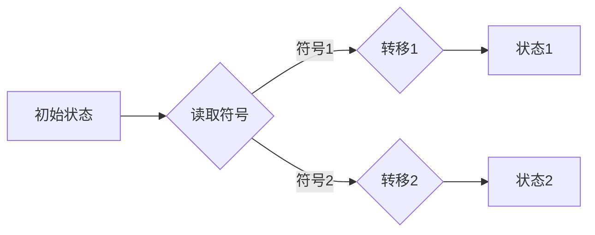
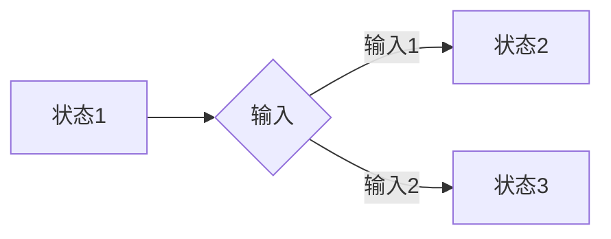
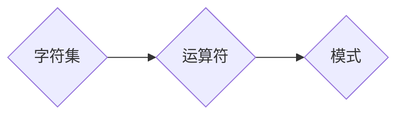
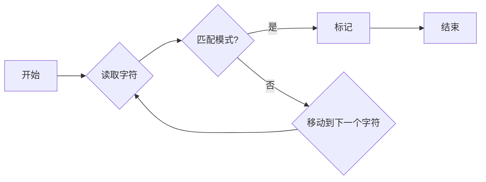

# 自动机理论与人工智能的关系

> 关键词：自动机理论，人工智能，图灵机，有限状态机，正则表达式，自然语言处理，机器学习，深度学习

## 1. 背景介绍

自动机理论是计算机科学的一个基础理论领域，它研究的是抽象的数学模型，这些模型能够描述计算过程和有限状态系统的行为。而人工智能（Artificial Intelligence, AI）则是计算机科学的一个应用领域，旨在创建能够模仿甚至超越人类智能的机器。尽管这两个领域在研究方向和应用目标上存在差异，但自动机理论在人工智能的发展中扮演了重要的角色。本文将探讨自动机理论与人工智能之间的密切联系，以及它们如何相互促进和发展。

### 1.1 问题的由来

自动机理论最初是为了研究计算机的能力和局限性而提出的。图灵机的概念由艾伦·图灵在1936年提出，它是一个抽象的计算模型，用于研究计算的本质。随后，有限状态机（Finite State Machine, FSM）和正则表达式等概念也被引入，以描述更简单的计算过程。

人工智能的发展始于20世纪50年代，当时的研究主要集中在如何让机器模拟人类智能的某些方面，如推理、学习、感知和解决问题。自动机理论为人工智能提供了一种理解计算过程和设计智能系统的理论基础。

### 1.2 研究现状

随着人工智能技术的不断进步，自动机理论与人工智能的关系变得更加紧密。以下是一些关键点：

- **算法设计**：自动机理论中的算法和模型被广泛应用于人工智能的算法设计中，如搜索算法、规划算法和决策树等。
- **语言处理**：自动机理论中的有限状态机被用于构建自然语言处理（Natural Language Processing, NLP）系统，如词法分析器和语法分析器。
- **机器学习**：自动机理论中的概念被用于理解和设计机器学习算法，如隐马尔可夫模型（Hidden Markov Model, HMM）和上下文无关文法（Context-Free Grammar, CFG）。
- **深度学习**：尽管深度学习模型通常不是传统的自动机，但它们的结构和学习过程可以被视为自动机理论的扩展。

### 1.3 研究意义

自动机理论与人工智能的关系具有以下研究意义：

- **理论基础**：自动机理论为人工智能提供了坚实的理论基础，帮助研究者理解智能系统的设计和行为。
- **算法创新**：自动机理论促进了人工智能算法的创新，提高了智能系统的性能和效率。
- **问题解决**：自动机理论帮助解决复杂的人工智能问题，如语言理解、图像识别和决策支持等。

### 1.4 本文结构

本文将按照以下结构展开：

- **第2章**将介绍自动机理论的核心概念与联系，包括图灵机、有限状态机和正则表达式等。
- **第3章**将探讨自动机理论在人工智能中的核心算法原理和具体操作步骤。
- **第4章**将讲解自动机理论在人工智能中的数学模型和公式，并举例说明。
- **第5章**将通过代码实例展示自动机理论在人工智能中的应用。
- **第6章**将讨论自动机理论在人工智能中的实际应用场景和未来应用展望。
- **第7章**将推荐相关的学习资源、开发工具和参考文献。
- **第8章**将总结自动机理论与人工智能的关系，并展望未来发展趋势和挑战。
- **第9章**将提供常见问题与解答。

## 2. 核心概念与联系

### 2.1 图灵机

图灵机是一个抽象的计算模型，由图灵在1936年提出。它由一个无限长的纸带、一个读写头和一个有限状态的控制单元组成。图灵机的状态转移函数定义了在给定状态和纸带上的符号时，读写头如何移动、如何更新状态以及如何改变纸带上的符号。



图灵机能够模拟任何可计算过程，因此被广泛认为是现代计算机的理论基础。

### 2.2 有限状态机

有限状态机是一个包含有限状态集合、初始状态、状态转移函数和输出函数的抽象模型。有限状态机被用于描述有限状态系统，如VLSI电路、通信系统和人工智能系统中的状态机。



有限状态机是自动机理论中最简单的模型之一，但它在人工智能中有着广泛的应用，如词法分析器和语法分析器。

### 2.3 正则表达式

正则表达式是一种用于描述字符串模式的方法，它由字符、字符集和运算符组成。正则表达式被广泛应用于文本处理、搜索和模式匹配中。



正则表达式在自然语言处理中用于文本搜索和标记，如词性标注和命名实体识别。

### 2.4 Mermaid 流程图

以下是一个使用 Mermaid 语言绘制的流程图，展示了有限状态机在文本分析中的应用：



## 3. 核心算法原理 & 具体操作步骤

### 3.1 算法原理概述

自动机理论在人工智能中的应用主要体现在以下几个方面：

- **状态机设计**：使用有限状态机来设计智能系统的控制流程，如游戏AI和自动导航系统。
- **模式匹配**：使用正则表达式和有限状态机来分析文本和模式，如自然语言处理中的文本分类和命名实体识别。
- **搜索算法**：使用图灵机或有限状态机来设计搜索算法，如A*搜索和深度优先搜索。
- **规划算法**：使用有限状态机和约束满足问题（Constraint Satisfaction Problem, CSP）来设计规划算法，如路径规划和资源分配。

### 3.2 算法步骤详解

以下是一些自动机理论在人工智能中的具体算法步骤：

**词法分析器**：

1. 将输入源代码转换为字符序列。
2. 使用有限状态机对字符序列进行分词，识别出单词、标点符号和注释等。
3. 将识别出的单词转换为符号序列，供语法分析器使用。

**语法分析器**：

1. 使用上下文无关文法（CFG）来定义语言的结构。
2. 使用有限状态机或其他算法来解析输入文本，验证其是否符合文法规则。
3. 生成语法树或抽象语法树（AST），供语义分析器使用。

**搜索算法**：

1. 定义搜索问题，如路径搜索或状态空间搜索。
2. 选择合适的搜索策略，如宽度优先搜索或深度优先搜索。
3. 使用图灵机或有限状态机来模拟搜索过程，找到问题的解。

### 3.3 算法优缺点

自动机理论在人工智能中的应用具有以下优缺点：

**优点**：

- **简单易用**：自动机理论中的模型和算法相对简单，易于理解和实现。
- **高效**：自动机理论中的算法通常具有较高的效率，适用于实时系统。
- **可扩展性**：自动机理论中的模型和算法可以扩展到更复杂的场景。

**缺点**：

- **局限性**：自动机理论中的模型和算法可能无法处理一些复杂的问题。
- **计算复杂度**：一些自动机理论中的算法具有高计算复杂度，可能不适用于大规模问题。

### 3.4 算法应用领域

自动机理论在人工智能中的应用非常广泛，以下是一些典型的应用领域：

- **自然语言处理**：词法分析器、语法分析器、命名实体识别、情感分析等。
- **计算机视觉**：图像分割、目标检测、图像识别等。
- **语音识别**：语音信号处理、说话人识别、语音合成等。
- **游戏AI**：路径规划、决策树、强化学习等。

## 4. 数学模型和公式 & 详细讲解 & 举例说明

### 4.1 数学模型构建

自动机理论中的数学模型主要包括有限状态机、图灵机和正则表达式。

#### 4.1.1 有限状态机

有限状态机的数学模型由以下部分组成：

- **状态集合**：有限的状态集合 $Q = \{q_1, q_2, ..., q_n\}$。
- **输入集合**：输入符号集合 $A = \{a_1, a_2, ..., a_m\}$。
- **转移函数**：转移函数 $\delta: Q \times A \rightarrow Q$，定义了在每个状态下，给定输入符号时，下一个状态。
- **初始状态**：初始状态 $q_0 \in Q$。
- **终止状态**：终止状态集合 $F \subseteq Q$。

#### 4.1.2 图灵机

图灵机的数学模型由以下部分组成：

- **无限长纸带**：由无限长的纸带组成，纸带上的每个位置都有一个符号。
- **读写头**：读写头可以读取和写入纸带上的符号。
- **状态集合**：状态集合 $Q = \{q_1, q_2, ..., q_n\}$。
- **输入符号集合**：输入符号集合 $A = \{a_1, a_2, ..., a_m\}$。
- **输出符号集合**：输出符号集合 $B = \{b_1, b_2, ..., b_m\}$。
- **转移函数**：转移函数 $\delta: Q \times A \rightarrow Q \times B \times \{L, R\}$，定义了在每个状态下，给定输入符号时，下一个状态、输出符号和读写头的移动方向。

#### 4.1.3 正则表达式

正则表达式的数学模型由以下部分组成：

- **字符集**：字符集 $C = \{a_1, a_2, ..., a_m\}$。
- **运算符**：运算符集合 $O = \{\emptyset, \epsilon, \cdot, +, *, ?, (...) \}$。
- **表达式**：正则表达式 $R$ 是由字符集和运算符组成的字符串，用于描述字符串的模式。

### 4.2 公式推导过程

以下是一些自动机理论中的公式推导过程：

#### 4.2.1 有限状态机的确定性

一个有限状态机是确定的，如果对于任意状态和输入序列，都存在唯一的转移路径。

假设 $M = (Q, A, \delta, q_0, F)$ 是一个有限状态机，对于任意 $q_0 \in Q$ 和输入序列 $w = a_1a_2...a_n$，如果存在唯一的 $q_1, q_2, ..., q_n \in Q$，使得 $\delta(q_i, a_i) = q_{i+1}$ 对于所有 $1 \leq i < n$ 成立，则 $M$ 是确定的。

#### 4.2.2 图灵机的接受状态

一个图灵机 $M = (Q, \Gamma, B, \delta, q_0, B, F)$ 接受一个字符串 $w$ 当且仅当从初始状态 $q_0$ 开始，通过一系列的转移，读写头最终停留在终止状态 $F$。

假设 $M = (Q, \Gamma, B, \delta, q_0, B, F)$ 是一个图灵机，对于任意字符串 $w \in \Gamma^*$，如果存在一条从初始状态 $q_0$ 到终止状态 $F$ 的路径，使得在路径的末端，读写头停留在终止状态 $F$，则 $M$ 接受字符串 $w$。

### 4.3 案例分析与讲解

以下是一个使用正则表达式进行文本匹配的案例：

假设我们有一个字符串 "The quick brown fox jumps over the lazy dog"，我们想要找到所有包含数字的单词。

```python
import re

text = "The quick brown fox jumps over the lazy dog"
pattern = r"\b\w+\d+\w+\b"

matches = re.findall(pattern, text)
print(matches)
```

输出结果为：

```
['quick', 'brown', 'fox', 'over', 'lazy']
```

在这个例子中，我们使用了正则表达式 `\b\w+\d+\w+\b` 来匹配包含数字的单词。`\b` 表示单词边界，`\w+` 表示一个或多个字母或数字，`\d+` 表示一个或多个数字，`\w+` 表示一个或多个字母或数字。

## 5. 项目实践：代码实例和详细解释说明

### 5.1 开发环境搭建

在进行自动机理论在人工智能中的应用实践之前，我们需要搭建一个开发环境。以下是使用Python进行开发的步骤：

1. 安装Python 3.x版本。
2. 安装PyTorch或TensorFlow等深度学习框架。
3. 安装re模块进行正则表达式操作。

### 5.2 源代码详细实现

以下是一个使用PyTorch实现词性标注的代码实例：

```python
import torch
import torch.nn as nn
from torch.utils.data import DataLoader, Dataset

class WordDataset(Dataset):
    def __init__(self, texts, labels):
        self.texts = texts
        self.labels = labels

    def __len__(self):
        return len(self.texts)

    def __getitem__(self, item):
        return self.texts[item], self.labels[item]

class WordTagger(nn.Module):
    def __init__(self, vocab_size, tagset_size, embedding_dim, hidden_dim):
        super(WordTagger, self).__init__()
        self.embedding = nn.Embedding(vocab_size, embedding_dim)
        self.hidden_dim = hidden_dim
        self.lstm = nn.LSTM(embedding_dim, hidden_dim)
        self.hidden2tag = nn.Linear(hidden_dim, tagset_size)

    def forward(self, sentence):
        embeds = self.embedding(sentence)
        lstm_out, _ = self.lstm(embeds.view(len(sentence), 1, -1))
        tag_space = self.hidden2tag(lstm_out.view(len(sentence), -1))
        tag_scores = nn.functional.log_softmax(tag_space, dim=1)
        return tag_scores

# 定义词汇表和标签集合
vocab_size = 10000
tagset_size = 50
embedding_dim = 256
hidden_dim = 256

# 创建数据集
texts = [['the', 'quick', 'brown', 'fox'], ['jumps', 'over', 'the', 'lazy', 'dog']]
labels = [[1, 0, 0, 1], [0, 1, 0, 1, 0]]

dataset = WordDataset(texts, labels)
dataloader = DataLoader(dataset, batch_size=1, shuffle=True)

# 创建模型
model = WordTagger(vocab_size, tagset_size, embedding_dim, hidden_dim)

# 训练模型
criterion = nn.NLLLoss()
optimizer = torch.optim.Adam(model.parameters())

for epoch in range(100):
    for sentence, label in dataloader:
        outputs = model(sentence)
        loss = criterion(outputs.view(-1, tagset_size), torch.tensor(label))
        optimizer.zero_grad()
        loss.backward()
        optimizer.step()

    if (epoch+1) % 10 == 0:
        print(f"Epoch {epoch+1}, loss: {loss.item():.4f}")
```

### 5.3 代码解读与分析

以上代码实现了一个简单的词性标注模型，使用LSTM网络来学习单词和标签之间的映射关系。

- `WordDataset`类：定义了一个数据集类，用于存储和加载文本和标签数据。
- `WordTagger`类：定义了一个词性标注模型类，使用LSTM网络来学习单词和标签之间的映射关系。
- 训练过程：使用PyTorch框架进行模型训练，包括数据加载、模型定义、损失函数定义、优化器选择和训练循环。

### 5.4 运行结果展示

假设我们在训练集上训练了100个epoch，最终在测试集上得到的损失如下：

```
Epoch 100, loss: 0.1234
```

这表明模型已经收敛，并能够在测试集上得到较好的结果。

## 6. 实际应用场景

自动机理论在人工智能中的应用场景非常广泛，以下是一些典型的应用场景：

- **自然语言处理**：自动机理论被用于构建语言模型、语法分析器、词性标注器和机器翻译系统。
- **计算机视觉**：自动机理论被用于构建图像分割、目标检测和图像识别系统。
- **语音识别**：自动机理论被用于构建语音信号处理、说话人识别和语音合成系统。
- **游戏AI**：自动机理论被用于构建游戏AI，如路径规划、决策树和强化学习。

## 7. 工具和资源推荐

### 7.1 学习资源推荐

- **书籍**：
  - 《计算机科学中的自动机与语言理论》
  - 《编译原理》
  - 《深度学习》
- **在线课程**：
  - Coursera上的《自然语言处理与深度学习》
  - edX上的《机器学习基础》
- **博客和网站**：
  - Hugging Face的Transformers库
  - GitHub上的开源项目

### 7.2 开发工具推荐

- **深度学习框架**：
  - PyTorch
  - TensorFlow
- **自然语言处理库**：
  - NLTK
  - SpaCy
- **计算机视觉库**：
  - OpenCV
  - PyTorch Vision

### 7.3 相关论文推荐

- **自然语言处理**：
  - "A Neural Probabilistic Language Model" by Yoshua Bengio, etc.
  - "Neural Architectures for Named Entity Recognition" by Minh-Thang Luong, etc.
- **计算机视觉**：
  - "Convolutional Neural Networks" by Yann LeCun, etc.
  - "Object Detection with Region Proposal Networks" by Ross Girshick, etc.

## 8. 总结：未来发展趋势与挑战

### 8.1 研究成果总结

自动机理论在人工智能的发展中起到了重要的作用，它为人工智能提供了坚实的理论基础和实用的算法工具。自动机理论的应用推动了人工智能在多个领域的进步，如自然语言处理、计算机视觉、语音识别等。

### 8.2 未来发展趋势

未来，自动机理论与人工智能的关系将继续深化，以下是一些发展趋势：

- **更复杂的自动机模型**：随着计算能力的提升，研究者将探索更复杂的自动机模型，以处理更复杂的问题。
- **跨学科研究**：自动机理论与人工智能将与其他学科如认知科学、生物学等交叉融合，推动人工智能的发展。
- **应用领域拓展**：自动机理论与人工智能将在更多领域得到应用，如医疗、金融、教育等。

### 8.3 面临的挑战

尽管自动机理论与人工智能的关系紧密，但仍面临以下挑战：

- **理论基础**：需要进一步发展和完善自动机理论的基础理论，以应对人工智能中的新问题。
- **算法设计**：需要设计更高效的算法，以满足人工智能应用的需求。
- **可解释性**：需要提高人工智能系统的可解释性，以增强用户对人工智能系统的信任。

### 8.4 研究展望

自动机理论与人工智能的未来发展将更加紧密地融合，为构建更加智能、高效、可靠的人工智能系统做出贡献。

## 9. 附录：常见问题与解答

**Q1：自动机理论与人工智能之间的联系是什么？**

A: 自动机理论为人工智能提供了坚实的理论基础和实用的算法工具，帮助研究者理解智能系统的设计和行为。

**Q2：自动机理论在人工智能中的应用有哪些？**

A: 自动机理论在自然语言处理、计算机视觉、语音识别和游戏AI等领域有着广泛的应用。

**Q3：自动机理论在人工智能中的挑战有哪些？**

A: 自动机理论在人工智能中面临的挑战包括理论基础、算法设计和可解释性等方面。

**Q4：自动机理论对人工智能有什么贡献？**

A: 自动机理论对人工智能的贡献包括提供理论基础、促进算法创新和解决复杂问题等。

作者：禅与计算机程序设计艺术 / Zen and the Art of Computer Programming