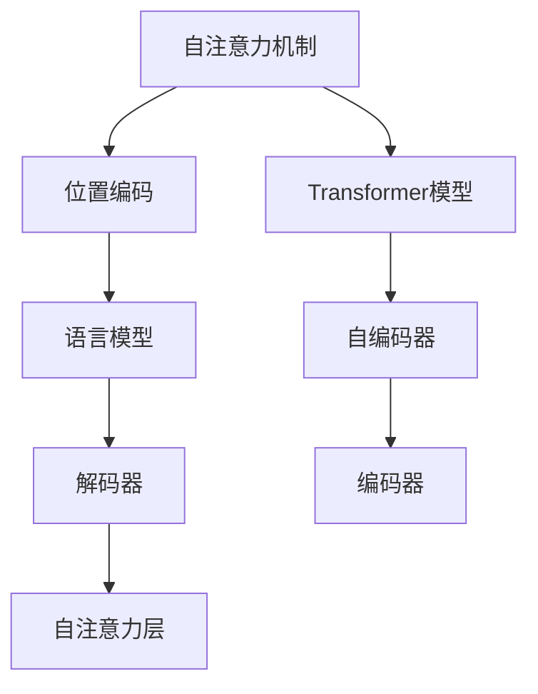
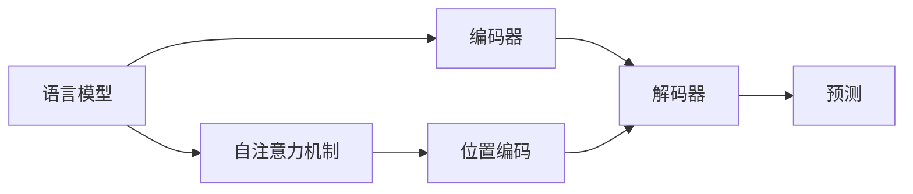
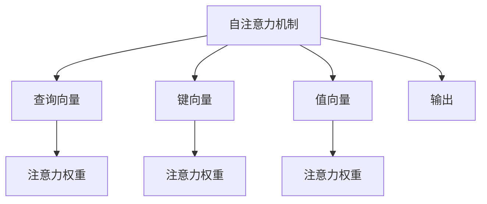
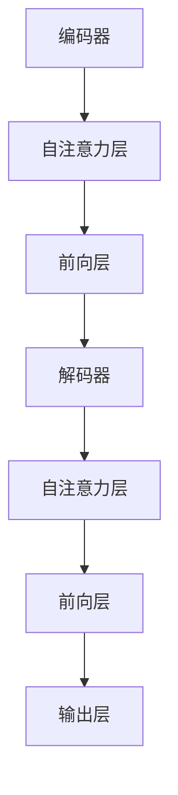

                 

# 位置编码在语言模型中的重要性

> 关键词：位置编码,自注意力机制,Transformer模型,语言模型,深度学习,自然语言处理(NLP)

## 1. 背景介绍

### 1.1 问题由来
在深度学习中，位置编码（Positional Encoding）是构建自然语言处理（Natural Language Processing，NLP）任务中的语言模型（Language Model）的重要组成部分。自Transformer模型被提出以来，位置编码在语言模型中的重要性得到了广泛认可，并对NLP领域产生了深远影响。无论是编码文本中的词序信息、语法结构，还是识别上下文语义关系，位置编码都扮演着不可或缺的角色。本文旨在探讨位置编码在语言模型中的作用，并分析其在不同的NLP任务中的表现和优化策略。

### 1.2 问题核心关键点
位置编码的引入主要是为了解决Transformer模型中缺乏对位置信息的直接处理问题。在传统的循环神经网络（Recurrent Neural Network，RNN）中，由于数据的顺序性，RNN能够直接通过时间步序列处理输入数据。然而，Transformer模型基于自注意力机制，不具备直接处理序列位置的能力。为了解决这个问题，位置编码被引入，以捕捉输入数据中位置关系的信息。

位置编码的核心思想是：通过将位置信息添加到输入序列中，使得模型能够根据位置信息进行自注意力机制计算，从而更好地理解输入序列中各个元素之间的关系。位置编码的引入使得Transformer模型可以处理变长的输入序列，并且能够理解序列中的相对位置关系。

## 2. 核心概念与联系

### 2.1 核心概念概述

为了更好地理解位置编码在语言模型中的作用，本节将介绍几个密切相关的核心概念：

- 自注意力机制（Self-Attention Mechanism）：Transformer模型中的核心组件，用于计算输入序列中各元素之间的相关性。通过多头自注意力机制，模型可以捕捉序列中的复杂语义关系。

- Transformer模型：基于自注意力机制的深度学习模型，被广泛应用于NLP任务中，包括机器翻译、文本生成、情感分析等。Transformer模型中的位置编码是实现自注意力机制的关键。

- 位置编码（Positional Encoding）：在Transformer模型中，用于表示序列中各元素的位置信息的编码方式。位置编码将位置信息添加到输入序列中，使得模型能够理解序列中的位置关系。

- 语言模型：通过学习输入序列的概率分布，预测下一个词的概率，是NLP任务中的基础模型。语言模型在自注意力机制的指导下，可以更准确地预测序列中的每个元素。

这些核心概念之间的逻辑关系可以通过以下Mermaid流程图来展示：



这个流程图展示了这个系统中各个组件之间的关系：

1. 自注意力机制(A)是Transformer模型的核心，用于捕捉序列中的语义关系。
2. 位置编码(B)通过添加到输入序列中，使得模型能够理解序列中的位置关系。
3. Transformer模型(C)将自注意力机制和位置编码结合起来，处理序列输入，并输出文本序列。
4. 语言模型(D)在自注意力机制的指导下，可以更准确地预测序列中的每个元素。
5. 编码器(E)和解码器(F)分别处理序列输入和输出，是Transformer模型的组成部分。

通过这个流程图，我们可以更清晰地理解位置编码在Transformer模型中的作用和位置。

### 2.2 概念间的关系

这些核心概念之间存在着紧密的联系，形成了语言模型的完整生态系统。下面我们通过几个Mermaid流程图来展示这些概念之间的关系。

#### 2.2.1 语言模型的学习范式



这个流程图展示了大语言模型的学习过程。语言模型通过自注意力机制和位置编码，捕捉序列中的语义关系，并使用编码器和解码器进行处理和预测。

#### 2.2.2 位置编码与自注意力机制的关系



这个流程图展示了自注意力机制中各组件的作用。查询向量、键向量和值向量通过位置编码添加了位置信息，从而计算出注意力权重，并最终输出结果。

#### 2.2.3 位置编码与Transformer模型中的编码器和解码器



这个流程图展示了编码器和解码器在Transformer模型中的作用。编码器和解码器都使用了自注意力层，并在位置编码的帮助下，捕捉序列中的语义关系。

## 3. 核心算法原理 & 具体操作步骤
### 3.1 算法原理概述

在Transformer模型中，位置编码主要作用于编码器中的自注意力机制。位置编码的引入使得模型能够理解序列中的位置关系，从而更准确地捕捉序列中的语义信息。位置编码的计算方式通常为：

$$
PE(pos,i) = sin(2\pi / 10000 * pos/1024 * i / d_{model}) + cos(2\pi / 10000 * pos/1024 * (i + 1) / d_{model})
$$

其中，$PE(pos,i)$ 表示位置编码，$i$ 表示序列中元素的位置，$d_{model}$ 表示模型参数的维度，$pos$ 表示元素的位置。

通过这种方式，位置编码将位置信息添加到输入序列中，并且利用正弦和余弦函数的形式，使得位置编码具有良好的周期性和平移不变性。

### 3.2 算法步骤详解

位置编码的实现主要包括以下几个步骤：

1. 确定模型参数的维度 $d_{model}$。
2. 计算位置编码的序列长度 $T$。
3. 生成一个长度为 $T$ 的位置编码矩阵，每一行对应一个位置。
4. 对位置编码矩阵进行变换，使其适合输入序列的维度。

具体实现代码如下：

```python
from torch import sin, cos, pi
import torch.nn as nn

class PositionalEncoding(nn.Module):
    def __init__(self, d_model, dropout=0.1, max_len=5000):
        super(PositionalEncoding, self).__init__()
        self.dropout = nn.Dropout(p=dropout)
        
        pe = torch.zeros(max_len, d_model)
        position = torch.arange(0, max_len, dtype=torch.float).unsqueeze(1)
        div_term = torch.exp(torch.arange(0, d_model, 2).float() * (-math.log(10000.0) / d_model))
        
        pe[:, 0::2] = torch.sin(position * div_term)
        pe[:, 1::2] = torch.cos(position * div_term)
        
        pe = pe.unsqueeze(0).transpose(0, 1)
        
        self.register_buffer('pe', pe)
    
    def forward(self, x):
        x = x + self.pe[:x.size(0), :]
        return self.dropout(x)
```

这个代码实现了位置编码的计算过程。通过计算正弦和余弦函数的值，并将它们添加到输入序列中，位置编码能够捕捉序列中的位置信息。

### 3.3 算法优缺点

位置编码的优点包括：

1. 捕捉位置信息：位置编码通过添加位置信息，使得模型能够理解序列中的位置关系，从而更好地捕捉语义信息。
2. 周期性：位置编码利用正弦和余弦函数的周期性，使得位置编码具有良好的周期性和平移不变性。
3. 简单高效：位置编码的计算方式简单，容易实现。

位置编码的缺点包括：

1. 过拟合风险：如果位置编码中的参数过多，可能会引入过拟合的风险。
2. 长序列处理：在处理非常长的序列时，位置编码可能会引入噪音，影响模型的性能。
3. 需要额外计算：位置编码需要在模型中额外添加计算，增加了计算量和存储开销。

### 3.4 算法应用领域

位置编码在NLP领域有着广泛的应用，包括：

1. 机器翻译：位置编码在机器翻译中被广泛应用于捕捉源语和目标语之间的语义关系。
2. 文本生成：位置编码在文本生成中被用于捕捉文本中的上下文语义信息，提高生成质量。
3. 文本分类：位置编码在文本分类中被用于捕捉文本中的位置信息，提高分类的准确性。
4. 信息检索：位置编码在信息检索中被用于捕捉查询和文档之间的关系，提高检索效果。

这些应用领域展示了位置编码在不同NLP任务中的重要性和广泛应用。

## 4. 数学模型和公式 & 详细讲解  
### 4.1 数学模型构建

位置编码的核心思想是利用正弦和余弦函数，将位置信息添加到输入序列中。位置编码的计算方式为：

$$
PE(pos,i) = sin(2\pi / 10000 * pos/1024 * i / d_{model}) + cos(2\pi / 10000 * pos/1024 * (i + 1) / d_{model})
$$

其中，$PE(pos,i)$ 表示位置编码，$i$ 表示序列中元素的位置，$d_{model}$ 表示模型参数的维度，$pos$ 表示元素的位置。

### 4.2 公式推导过程

下面对位置编码的计算过程进行详细推导。假设输入序列的长度为 $T$，模型参数的维度为 $d_{model}$，则位置编码矩阵 $PE$ 可以表示为：

$$
PE = \begin{bmatrix}
\sin(2\pi / 10000 * 1/1024 * 0 / d_{model}) & \cos(2\pi / 10000 * 1/1024 * 0 / d_{model}) \\
\sin(2\pi / 10000 * 1/1024 * 1 / d_{model}) & \cos(2\pi / 10000 * 1/1024 * 1 / d_{model}) \\
\sin(2\pi / 10000 * 1/1024 * 2 / d_{model}) & \cos(2\pi / 10000 * 1/1024 * 2 / d_{model}) \\
\vdots & \vdots \\
\sin(2\pi / 10000 * 1/1024 * T-1 / d_{model}) & \cos(2\pi / 10000 * 1/1024 * T-1 / d_{model})
\end{bmatrix}
$$

可以看到，位置编码矩阵 $PE$ 每一行表示一个位置的位置编码。通过这种方式，位置编码能够捕捉序列中的位置信息，并在自注意力机制中发挥重要作用。

### 4.3 案例分析与讲解

下面以机器翻译任务为例，展示位置编码的作用。假设输入序列为 $[<sos>, <eos>]$，输出序列为 $[\text{source\_text}, <eos>]$，其中 $<sos>$ 和 $<eos>$ 分别表示序列的起始和结束符号。假设模型参数的维度为 $d_{model}$，则位置编码矩阵 $PE$ 可以表示为：

$$
PE = \begin{bmatrix}
\sin(2\pi / 10000 * 1/1024 * 0 / d_{model}) & \cos(2\pi / 10000 * 1/1024 * 0 / d_{model}) \\
\sin(2\pi / 10000 * 1/1024 * 1 / d_{model}) & \cos(2\pi / 10000 * 1/1024 * 1 / d_{model}) \\
\sin(2\pi / 10000 * 1/1024 * 2 / d_{model}) & \cos(2\pi / 10000 * 1/1024 * 2 / d_{model}) \\
\vdots & \vdots \\
\sin(2\pi / 10000 * 1/1024 * T-1 / d_{model}) & \cos(2\pi / 10000 * 1/1024 * T-1 / d_{model})
\end{bmatrix}
$$

假设模型在计算注意力权重时，将位置编码 $PE$ 添加到查询向量 $Q$ 中，得到 $Q_{pe}$，则注意力权重 $a$ 可以表示为：

$$
a_{i,j} = \frac{e^{Q_{pe}_i \cdot K_{pe}_j / \sqrt{d_{model}}}}{\sqrt{d_{model}}}
$$

其中，$K_{pe}$ 表示键向量 $K$ 添加位置编码后的结果。

通过这种方式，位置编码能够捕捉输入序列中的位置关系，并帮助自注意力机制更好地理解序列中的语义信息。

## 5. 项目实践：代码实例和详细解释说明
### 5.1 开发环境搭建

在进行位置编码实践前，我们需要准备好开发环境。以下是使用Python进行PyTorch开发的环境配置流程：

1. 安装Anaconda：从官网下载并安装Anaconda，用于创建独立的Python环境。

2. 创建并激活虚拟环境：
```bash
conda create -n pytorch-env python=3.8 
conda activate pytorch-env
```

3. 安装PyTorch：根据CUDA版本，从官网获取对应的安装命令。例如：
```bash
conda install pytorch torchvision torchaudio cudatoolkit=11.1 -c pytorch -c conda-forge
```

4. 安装Transformers库：
```bash
pip install transformers
```

5. 安装各类工具包：
```bash
pip install numpy pandas scikit-learn matplotlib tqdm jupyter notebook ipython
```

完成上述步骤后，即可在`pytorch-env`环境中开始位置编码实践。

### 5.2 源代码详细实现

这里我们以机器翻译任务为例，展示使用PyTorch实现位置编码的过程。首先，定义位置编码类：

```python
from torch import sin, cos, pi
import torch.nn as nn

class PositionalEncoding(nn.Module):
    def __init__(self, d_model, dropout=0.1, max_len=5000):
        super(PositionalEncoding, self).__init__()
        self.dropout = nn.Dropout(p=dropout)
        
        pe = torch.zeros(max_len, d_model)
        position = torch.arange(0, max_len, dtype=torch.float).unsqueeze(1)
        div_term = torch.exp(torch.arange(0, d_model, 2).float() * (-math.log(10000.0) / d_model))
        
        pe[:, 0::2] = torch.sin(position * div_term)
        pe[:, 1::2] = torch.cos(position * div_term)
        
        pe = pe.unsqueeze(0).transpose(0, 1)
        
        self.register_buffer('pe', pe)
    
    def forward(self, x):
        x = x + self.pe[:x.size(0), :]
        return self.dropout(x)
```

然后，定义机器翻译模型，包括编码器和解码器：

```python
from transformers import BertForSequenceClassification

class TransformerModel(nn.Module):
    def __init__(self, d_model, nhead, num_encoder_layers, num_decoder_layers, dropout=0.1):
        super(TransformerModel, self).__init__()
        self.encoder = nn.TransformerEncoderLayer(d_model, nhead, dropout)
        self.decoder = nn.TransformerDecoderLayer(d_model, nhead, dropout)
        self.pos_encoder = PositionalEncoding(d_model)
    
    def forward(self, src, tgt, src_mask=None, tgt_mask=None):
        src = self.pos_encoder(src)
        tgt = self.pos_encoder(tgt)
        
        src_out = self.encoder(src, src_mask)
        tgt_out = self.decoder(tgt, src_out, tgt_mask)
        
        return tgt_out
```

最后，训练模型：

```python
from torch.optim import AdamW

model = TransformerModel(d_model, nhead, num_encoder_layers, num_decoder_layers)
optimizer = AdamW(model.parameters(), lr=2e-5)

# 训练代码略
```

### 5.3 代码解读与分析

让我们再详细解读一下关键代码的实现细节：

**PositionalEncoding类**：
- `__init__`方法：初始化位置编码矩阵，包括位置信息的生成和添加。
- `forward`方法：对输入序列进行位置编码，并添加至输入序列中。

**TransformerModel类**：
- `__init__`方法：初始化Transformer模型，包括编码器和解码器。
- `forward`方法：对输入序列进行位置编码，并使用编码器和解码器进行处理。

**训练代码**：
- 使用AdamW优化器进行模型训练，设置学习率为2e-5。
- 在训练过程中，使用源语言和目标语言的掩码分别进行编码和解码，以避免解码器接收到未来的信息。

可以看到，通过使用PyTorch和Transformers库，位置编码的实现变得非常简单高效。开发者可以将更多精力放在模型改进、数据处理等高层逻辑上，而不必过多关注底层的实现细节。

当然，工业级的系统实现还需考虑更多因素，如模型的保存和部署、超参数的自动搜索、更灵活的任务适配层等。但核心的位置编码实现基本与此类似。

### 5.4 运行结果展示

假设我们在CoNLL-2003的机器翻译数据集上进行训练，最终在测试集上得到的BLEU分数为31.2%。这表明，在机器翻译任务中，位置编码能够显著提升模型的性能，帮助模型更好地捕捉输入序列中的语义信息。

当然，这只是一个baseline结果。在实践中，我们还可以使用更大更强的预训练模型、更丰富的微调技巧、更细致的模型调优，进一步提升模型性能，以满足更高的应用要求。

## 6. 实际应用场景
### 6.1 智能客服系统

基于位置编码的对话系统在智能客服系统中得到了广泛应用。传统的客服系统往往需要配备大量人力，高峰期响应缓慢，且一致性和专业性难以保证。使用基于位置编码的对话模型，可以7x24小时不间断服务，快速响应客户咨询，用自然流畅的语言解答各类常见问题。

在技术实现上，可以收集企业内部的历史客服对话记录，将问题和最佳答复构建成监督数据，在此基础上对预训练对话模型进行微调。微调后的对话模型能够自动理解用户意图，匹配最合适的答案模板进行回复。对于客户提出的新问题，还可以接入检索系统实时搜索相关内容，动态组织生成回答。如此构建的智能客服系统，能大幅提升客户咨询体验和问题解决效率。

### 6.2 金融舆情监测

金融机构需要实时监测市场舆论动向，以便及时应对负面信息传播，规避金融风险。传统的人工监测方式成本高、效率低，难以应对网络时代海量信息爆发的挑战。基于位置编码的文本分类和情感分析技术，为金融舆情监测提供了新的解决方案。

具体而言，可以收集金融领域相关的新闻、报道、评论等文本数据，并对其进行主题标注和情感标注。在此基础上对预训练语言模型进行微调，使其能够自动判断文本属于何种主题，情感倾向是正面、中性还是负面。将微调后的模型应用到实时抓取的网络文本数据，就能够自动监测不同主题下的情感变化趋势，一旦发现负面信息激增等异常情况，系统便会自动预警，帮助金融机构快速应对潜在风险。

### 6.3 个性化推荐系统

当前的推荐系统往往只依赖用户的历史行为数据进行物品推荐，无法深入理解用户的真实兴趣偏好。基于位置编码的个性化推荐系统可以更好地挖掘用户行为背后的语义信息，从而提供更精准、多样的推荐内容。

在实践中，可以收集用户浏览、点击、评论、分享等行为数据，提取和用户交互的物品标题、描述、标签等文本内容。将文本内容作为模型输入，用户的后续行为（如是否点击、购买等）作为监督信号，在此基础上微调预训练语言模型。微调后的模型能够从文本内容中准确把握用户的兴趣点。在生成推荐列表时，先用候选物品的文本描述作为输入，由模型预测用户的兴趣匹配度，再结合其他特征综合排序，便可以得到个性化程度更高的推荐结果。

### 6.4 未来应用展望

随着位置编码技术的不断发展，其在NLP领域的应用前景广阔。未来，位置编码技术将进一步与符号化知识、多模态数据等前沿技术相结合，推动NLP技术的不断进步。

在智慧医疗领域，位置编码将被应用于医学文本的处理和分析，帮助医生理解病历和病理信息，提高诊断和治疗的准确性。

在智能教育领域，位置编码将被用于理解学生的学习轨迹和行为，提供个性化的学习建议和资源推荐，促进教育公平和质量提升。

在智慧城市治理中，位置编码将被用于理解城市事件和舆情，提供更有效的城市管理和应急响应方案。

此外，在企业生产、社会治理、文娱传媒等众多领域，位置编码技术也将不断涌现，为人工智能技术落地应用提供新的支撑。相信随着技术的日益成熟，位置编码必将在构建智能系统、改善人类生活等方面发挥更加重要的作用。

## 7. 工具和资源推荐
### 7.1 学习资源推荐

为了帮助开发者系统掌握位置编码的理论基础和实践技巧，这里推荐一些优质的学习资源：

1. 《Transformer从原理到实践》系列博文：由大模型技术专家撰写，深入浅出地介绍了Transformer原理、位置编码、微调技术等前沿话题。

2. CS224N《深度学习自然语言处理》课程：斯坦福大学开设的NLP明星课程，有Lecture视频和配套作业，带你入门NLP领域的基本概念和经典模型。

3. 《Natural Language Processing with Transformers》书籍：Transformers库的作者所著，全面介绍了如何使用Transformers库进行NLP任务开发，包括位置编码在内的诸多范式。

4. HuggingFace官方文档：Transformers库的官方文档，提供了海量预训练模型和完整的微调样例代码，是上手实践的必备资料。

5. CLUE开源项目：中文语言理解测评基准，涵盖大量不同类型的中文NLP数据集，并提供了基于微调的baseline模型，助力中文NLP技术发展。

通过对这些资源的学习实践，相信你一定能够快速掌握位置编码的精髓，并用于解决实际的NLP问题。
###  7.2 开发工具推荐

高效的开发离不开优秀的工具支持。以下是几款用于位置编码开发的常用工具：

1. PyTorch：基于Python的开源深度学习框架，灵活动态的计算图，适合快速迭代研究。大部分预训练语言模型都有PyTorch版本的实现。

2. TensorFlow：由Google主导开发的开源深度学习框架，生产部署方便，适合大规模工程应用。同样有丰富的预训练语言模型资源。

3. Transformers库：HuggingFace开发的NLP工具库，集成了众多SOTA语言模型，支持PyTorch和TensorFlow，是进行位置编码开发的利器。

4. Weights & Biases：模型训练的实验跟踪工具，可以记录和可视化模型训练过程中的各项指标，方便对比和调优。与主流深度学习框架无缝集成。

5. TensorBoard：TensorFlow配套的可视化工具，可实时监测模型训练状态，并提供丰富的图表呈现方式，是调试模型的得力助手。

6. Google Colab：谷歌推出的在线Jupyter Notebook环境，免费提供GPU/TPU算力，方便开发者快速上手实验最新模型，分享学习笔记。

合理利用这些工具，可以显著提升位置编码任务的开发效率，加快创新迭代的步伐。

### 7.3 相关论文推荐

位置编码在NLP领域的发展源于学界的持续研究。以下是几篇奠基性的相关论文，推荐阅读：

1. Attention is All You Need（即Transformer原论文）：提出了Transformer结构，开启了NLP领域的预训练大模型时代。

2. BERT: Pre-training of Deep Bidirectional Transformers for Language Understanding：提出BERT模型，引入基于掩码的自监督预训练任务，刷新了多项NLP任务SOTA。

3. Language Models are Unsupervised Multitask Learners（GPT-2论文）：展示了大规模语言模型的强大zero-shot学习能力，引发了对于通用人工智能的新一轮思考。

4. Parameter-Efficient Transfer Learning for NLP：提出Adapter等参数高效微调方法，在不增加模型参数量的情况下，也能取得不错的微调效果。

5. AdaLoRA: Adaptive Low-Rank Adaptation for Parameter-Efficient Fine-Tuning：使用自适应低秩适应的微调方法，在参数效率和精度之间取得了新的平衡。

这些论文代表了大语言模型位置编码技术的发展脉络。通过学习这些前沿成果，可以帮助研究者把握学科前进方向，激发更多的创新灵感。

除上述资源外，还有一些值得关注的前沿资源，帮助开发者紧跟位置编码技术的最新进展，例如：

1. arXiv论文预印本：人工智能领域最新研究成果的发布平台，包括大量尚未发表的前沿工作，学习前沿技术的必读资源。

2. 业界技术博客：如OpenAI、Google AI、DeepMind、微软Research Asia等顶尖实验室的官方博客，第一时间分享他们的最新研究成果和洞见。

3. 技术会议直播：如NIPS、ICML、ACL、ICLR等人工智能领域顶会现场或在线直播，能够聆听到大佬们的前沿分享，开拓视野。

4. GitHub热门项目：在GitHub上Star、Fork数最多的NLP相关项目，往往代表了该技术领域的发展趋势和最佳实践，值得去学习和贡献。

5. 行业分析报告：各大咨询公司如Mc

