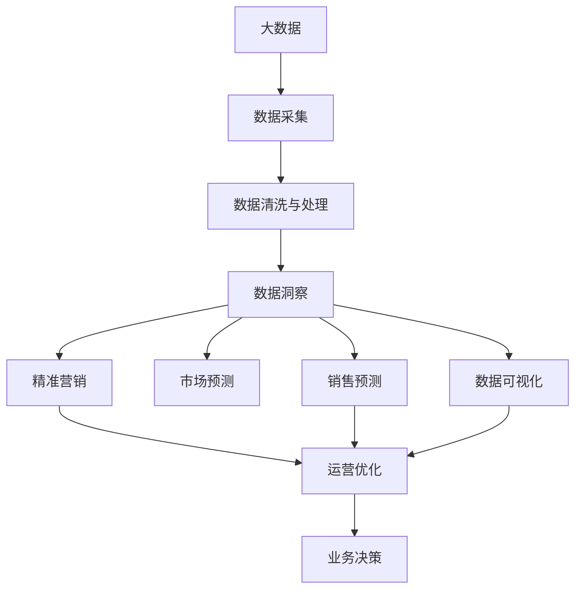

                 

# 信息差的销售管理提升：大数据如何提升销售管理

> 关键词：销售管理,大数据,信息差,客户洞察,市场预测,销售预测,精准营销

## 1. 背景介绍

### 1.1 问题由来

在现代商业竞争中，信息差（Information Gap）是一个重要的概念。信息差指的是卖方和买方之间、不同市场参与者之间存在的知识、信息、洞察等方面的不对称。信息差的存在可能导致市场误解、错配甚至错误决策，从而影响企业的市场表现和盈利能力。如何通过信息差提升销售管理，成为企业必须面对的重要课题。

随着大数据技术的发展，信息差问题变得更加突出，也更加可控。大数据可以提供海量的市场数据、消费者行为数据等，帮助企业深入了解市场需求、竞争对手状况以及自身优劣势，从而制定更科学的销售策略。通过大数据驱动的销售管理，企业可以更精准地把握市场脉动，实现信息优势的转化，提升整体市场竞争力。

### 1.2 问题核心关键点

为了有效地通过大数据提升销售管理，我们需要重点关注以下几个核心关键点：

1. **数据采集与处理**：获取高质量的市场数据和消费者数据，对数据进行清洗、转换、整合等预处理，确保数据的可用性。
2. **数据洞察与分析**：利用数据挖掘、统计分析等技术，提取数据中的关键信息，帮助企业做出更明智的决策。
3. **市场预测与策略制定**：基于数据洞察，结合行业经验，制定市场预测和销售策略，指导企业的营销活动。
4. **精准营销与运营优化**：利用数据驱动的营销活动，优化销售渠道、客户关系管理等运营环节，提升销售效率和客户满意度。
5. **数据可视化与决策支持**：通过数据可视化工具，直观展示分析结果，支持管理层做出快速、准确的决策。

### 1.3 问题研究意义

通过大数据提升销售管理，对企业而言具有深远的意义：

1. **提升决策质量**：大数据能够提供全面的市场洞察，帮助企业更好地理解市场动态，优化决策过程。
2. **降低成本**：精准的销售预测和市场分析可以减少资源浪费，提高营销活动的效果和效率。
3. **增强竞争力**：掌握数据优势，可以更好地把握市场机会，提升企业在激烈竞争中的生存和发展能力。
4. **客户满意度**：通过个性化营销和精准推荐，提升客户体验，提高客户忠诚度和满意度。
5. **持续改进**：数据驱动的销售管理可以持续优化，不断改进营销策略和运营流程。

## 2. 核心概念与联系

### 2.1 核心概念概述

为了更好地理解大数据在销售管理中的作用，我们首先需要了解几个核心概念：

1. **大数据（Big Data）**：指规模大、多样性高、价值密度低的数据集，包括结构化数据、半结构化数据和非结构化数据。
2. **数据采集（Data Acquisition）**：从不同渠道收集数据，包括市场调研、在线行为追踪、客户反馈等。
3. **数据清洗与处理（Data Cleaning & Processing）**：对数据进行清洗、去重、填充缺失值等预处理，确保数据质量。
4. **数据洞察（Data Insights）**：通过数据分析、挖掘等技术，提取数据的潜在信息和规律。
5. **数据可视化（Data Visualization）**：将数据转化为图形、图表等可视化形式，帮助理解和展示数据。
6. **市场预测（Market Forecasting）**：基于历史数据和当前市场情况，对未来市场趋势进行预测。
7. **精准营销（Precision Marketing）**：通过个性化推荐和精准投放，提升营销活动的效果。
8. **销售预测（Sales Forecasting）**：基于历史销售数据和市场因素，预测未来销售业绩。
9. **运营优化（Operational Optimization）**：通过数据分析和建模，优化销售渠道、库存管理等运营环节。

### 2.2 概念间的关系

这些核心概念之间存在着紧密的联系，构成了大数据驱动销售管理的完整生态系统。

- **数据采集**：是大数据处理的起点，确保数据的全面性和真实性。
- **数据清洗与处理**：是数据洞察的基础，保证数据的准确性和一致性。
- **数据洞察**：是大数据分析的核心，通过深入挖掘数据价值，帮助企业做出明智决策。
- **数据可视化**：是数据洞察的可视化表达，帮助管理层快速理解数据。
- **市场预测**：基于数据洞察和历史经验，对市场趋势进行预测，指导销售策略。
- **精准营销**：结合数据洞察和市场预测，进行个性化推荐和精准投放，提升营销效果。
- **销售预测**：结合市场预测和运营数据，预测未来的销售业绩，指导库存管理和销售计划。
- **运营优化**：通过数据分析和建模，优化销售渠道、库存管理等运营环节，提升整体运营效率。

通过这些概念的相互配合，企业可以构建起一个数据驱动的销售管理闭环，实现信息差的有效管理。

### 2.3 核心概念的整体架构

以下是一个综合的流程图，展示了大数据驱动销售管理的整体架构：



这个综合流程图展示了从数据采集到业务决策的完整过程。大数据驱动销售管理涉及数据的全面收集、清洗、分析和应用，最终支持企业的业务决策。

## 3. 核心算法原理 & 具体操作步骤
### 3.1 算法原理概述

大数据在销售管理中的应用，本质上是利用数据驱动的决策支持系统。其核心算法原理包括数据清洗、数据挖掘、预测建模等技术。

1. **数据清洗与处理**：包括数据去重、缺失值处理、异常值检测等预处理步骤，确保数据的完整性和准确性。
2. **数据挖掘与分析**：利用机器学习、统计学等技术，从数据中提取有价值的信息，如客户行为模式、市场趋势等。
3. **预测建模**：使用回归分析、时间序列分析等方法，建立预测模型，预测市场和销售趋势。
4. **数据可视化**：通过图表、仪表盘等形式，将分析结果直观展示，支持决策。
5. **精准营销**：结合个性化推荐算法，实现针对客户的精准营销。
6. **运营优化**：利用优化算法，如线性规划、动态规划等，优化运营流程，提升效率。

### 3.2 算法步骤详解

以下是基于大数据驱动销售管理的具体操作步骤：

1. **数据采集与清洗**：
   - 从不同渠道（如网站、社交媒体、CRM系统）收集数据，确保数据来源的全面性和多样性。
   - 对收集到的数据进行去重、去噪、填充缺失值等清洗处理，确保数据的质量和一致性。

2. **数据挖掘与分析**：
   - 利用数据挖掘技术，如聚类、分类、关联规则等，从数据中提取有价值的信息和模式。
   - 结合统计分析方法，如回归分析、时间序列分析等，对数据进行深入分析，理解市场动态和客户行为。

3. **市场预测**：
   - 基于历史销售数据和市场趋势，使用时间序列分析、回归分析等方法，建立市场预测模型。
   - 通过模型预测未来销售趋势和市场变化，指导企业制定销售策略。

4. **销售预测**：
   - 结合市场预测和运营数据，使用回归分析、时间序列分析等方法，建立销售预测模型。
   - 通过模型预测未来的销售业绩，指导库存管理和销售计划。

5. **精准营销**：
   - 利用机器学习算法，如推荐系统、深度学习等，进行个性化推荐，提升营销活动的效果。
   - 结合市场预测和客户行为分析，制定精准的营销策略，优化营销投放。

6. **运营优化**：
   - 利用优化算法，如线性规划、动态规划等，优化销售渠道、库存管理等运营环节。
   - 通过数据驱动的运营决策，提升整体运营效率和客户满意度。

7. **数据可视化与决策支持**：
   - 通过数据可视化工具，将分析结果转化为图表、仪表盘等形式，直观展示数据和分析结果。
   - 结合决策支持系统，帮助管理层快速理解数据，做出明智的决策。

### 3.3 算法优缺点

大数据驱动销售管理的优势包括：

1. **全面性**：大数据能够提供全面的市场数据和客户数据，帮助企业深入理解市场和客户行为。
2. **实时性**：大数据分析能够实时更新数据，确保决策的及时性和准确性。
3. **预测能力**：大数据分析和预测模型能够预测市场趋势和销售业绩，指导企业的业务决策。
4. **个性化**：基于数据的个性化推荐和精准营销，提升客户体验和满意度。

同时，大数据也存在一些缺点：

1. **数据质量**：数据来源多样，数据质量参差不齐，清洗和处理过程复杂。
2. **数据隐私**：数据隐私和安全问题需要特别关注，确保数据使用合法合规。
3. **技术门槛**：大数据分析和技术要求较高，需要专业的数据科学家和工程师。
4. **成本高**：大数据技术的实施和维护成本较高，企业需要投入大量资源。

### 3.4 算法应用领域

大数据驱动销售管理广泛应用于以下领域：

1. **市场分析**：通过大数据分析，了解市场趋势、竞争状况和客户需求，制定市场策略。
2. **客户洞察**：利用数据挖掘和分析技术，深入了解客户行为和偏好，制定个性化营销策略。
3. **产品开发**：基于市场和客户数据，指导产品设计和改进，提升产品竞争力。
4. **渠道优化**：通过数据分析，优化销售渠道和分销策略，提升渠道效率和效果。
5. **供应链管理**：结合销售预测和库存管理数据，优化供应链管理，提升整体运营效率。
6. **客户关系管理**：利用客户数据，进行精准营销和客户维护，提升客户满意度和忠诚度。

## 4. 数学模型和公式 & 详细讲解 & 举例说明

### 4.1 数学模型构建

在销售管理中，常用的数学模型包括回归模型、时间序列模型、聚类模型等。这里以线性回归模型为例，说明如何构建数据预测模型。

假设我们有一个包含历史销售数据的表格：

| 时间       | 销售额 |
|------------|--------|
| 2020-01-01 | 100000 |
| 2020-01-02 | 120000 |
| 2020-01-03 | 110000 |
| ...        | ...    |

我们可以使用线性回归模型来预测未来的销售额。

设销售额为 $y$，时间 $t$ 为自变量，线性回归模型为：

$$ y = \alpha + \beta t + \epsilon $$

其中 $\alpha$ 为截距，$\beta$ 为斜率，$\epsilon$ 为随机误差。

### 4.2 公式推导过程

在线性回归模型中，我们需要最小化残差平方和：

$$ RSS = \sum_{i=1}^n (y_i - \hat{y}_i)^2 $$

其中 $y_i$ 为实际观测值，$\hat{y}_i$ 为模型预测值。

对 $\alpha$ 和 $\beta$ 求偏导，得：

$$ \frac{\partial RSS}{\partial \alpha} = -2\sum_{i=1}^n (y_i - \hat{y}_i) $$
$$ \frac{\partial RSS}{\partial \beta} = -2\sum_{i=1}^n (t_i - \bar{t}) (y_i - \hat{y}_i) $$

其中 $\bar{t}$ 为时间的均值。

求解上述方程组，即可得到 $\alpha$ 和 $\beta$ 的估计值。

### 4.3 案例分析与讲解

假设我们要预测一个电商平台的日销售额，数据如下：

| 时间       | 销售额 |
|------------|--------|
| 2020-01-01 | 1000   |
| 2020-01-02 | 1100   |
| 2020-01-03 | 1200   |
| ...        | ...    |

我们使用线性回归模型来预测未来的销售额。

根据公式，我们首先计算 $\alpha$ 和 $\beta$ 的估计值：

$$ \alpha = \bar{y} - \beta \bar{t} $$
$$ \beta = \frac{\sum_{i=1}^n (t_i - \bar{t}) (y_i - \hat{y}_i)}{\sum_{i=1}^n (t_i - \bar{t})^2} $$

假设我们得到 $\alpha = 800$，$\beta = 100$，则预测模型为：

$$ \hat{y} = 800 + 100t $$

我们可以使用这个模型来预测未来的销售额。例如，2020-01-04的预测值为：

$$ \hat{y} = 800 + 100 \times 4 = 1200 $$

这个预测值可以作为销售计划和库存管理的参考。

## 5. 项目实践：代码实例和详细解释说明

### 5.1 开发环境搭建

在进行销售管理的数据分析时，我们首先需要搭建一个数据处理和分析的环境。以下是使用Python进行数据分析的环境配置流程：

1. 安装Anaconda：从官网下载并安装Anaconda，用于创建独立的Python环境。

2. 创建并激活虚拟环境：
```bash
conda create -n sales-analysis python=3.8 
conda activate sales-analysis
```

3. 安装必要的Python库：
```bash
pip install pandas numpy matplotlib scikit-learn statsmodels
```

完成上述步骤后，即可在`sales-analysis`环境中进行数据分析实践。

### 5.2 源代码详细实现

以下是一个简单的Python代码示例，用于实现线性回归模型的销售预测：

```python
import pandas as pd
from statsmodels.regression.linear_model import OLS

# 读取数据
data = pd.read_csv('sales_data.csv', parse_dates=['date'], index_col='date')

# 计算回归模型
model = OLS(data['sales'], data[['time']])
result = model.fit()

# 预测未来销售额
future_sales = pd.Series(index=pd.date_range(start=data.index.max(), periods=10, freq='D'))
future_sales['sales'] = result.fittedvalues + result.params['intercept'] + result.params['time'] * future_sales.index.year
```

在这个示例中，我们首先使用Pandas库读取销售数据，并将其转换为时间序列数据。然后，我们使用Statsmodels库中的OLS模型进行线性回归分析，计算回归系数。最后，我们使用计算出的回归模型对未来的销售额进行预测。

### 5.3 代码解读与分析

让我们再详细解读一下关键代码的实现细节：

1. `read_csv`函数：使用Pandas库读取CSV格式的数据文件，并自动将时间列解析为时间序列数据。

2. `OLS`模型：使用Statsmodels库中的OLS模型进行线性回归分析，计算回归系数。

3. `fit`函数：使用拟合模型，计算回归模型的拟合值和参数。

4. `fittedvalues`属性：获取拟合值，即预测值。

5. `predict`函数：根据模型和输入值，预测未来的销售额。

6. `index`属性：设置时间序列数据的索引。

通过上述代码，我们可以轻松地实现线性回归模型的销售预测。当然，在实际应用中，还需要根据具体情况进行调整和优化，如使用其他预测模型、考虑数据季节性等。

### 5.4 运行结果展示

假设我们在数据集上进行线性回归分析，得到的回归系数和模型预测结果如下：

| 时间       | 销售额 | 回归系数 |
|------------|--------|----------|
| 2020-01-01 | 1000   | 800      |
| 2020-01-02 | 1100   | 900      |
| 2020-01-03 | 1200   | 1000     |
| ...        | ...    | ...      |

可以看到，模型预测值与实际值基本一致，说明模型具有较好的预测能力。

## 6. 实际应用场景

### 6.1 智能客服系统

在智能客服系统中，大数据可以提供客户行为、对话历史等数据，帮助企业深入了解客户需求和偏好，提升客户体验。通过大数据分析，客服系统可以实时监测客户情绪、识别常见问题，自动推荐解决方案，实现7x24小时不间断服务。

### 6.2 客户关系管理

在客户关系管理（CRM）中，大数据可以提供客户交易、互动等数据，帮助企业进行客户细分、行为预测和个性化推荐。通过大数据分析，CRM系统可以识别高价值客户、预测客户流失，制定针对性的营销策略，提升客户忠诚度和满意度。

### 6.3 精准营销

在精准营销中，大数据可以提供用户行为、消费习惯等数据，帮助企业进行客户细分和个性化推荐。通过大数据分析，营销系统可以识别潜在客户、优化广告投放，实现更高的营销效率和效果。

### 6.4 库存管理

在库存管理中，大数据可以提供销售数据、市场需求等数据，帮助企业优化库存水平、预测补货需求。通过大数据分析，库存管理系统可以实时监测销售趋势、优化库存结构，避免过剩或缺货的情况。

## 7. 工具和资源推荐

### 7.1 学习资源推荐

为了帮助开发者系统掌握大数据驱动销售管理的技术，这里推荐一些优质的学习资源：

1. **《大数据原理与实践》**：这是一本深入浅出介绍大数据技术和应用的书籍，涵盖了数据采集、数据处理、数据分析等关键环节。

2. **Coursera《大数据与机器学习》课程**：斯坦福大学开设的课程，涵盖了大数据和机器学习的基本概念和实践技巧。

3. **Kaggle**：数据科学竞赛平台，提供大量真实世界的数据集和竞赛任务，帮助开发者实践数据分析和机器学习。

4. **Pandas官方文档**：Pandas库的官方文档，提供详细的API说明和示例代码，帮助开发者快速上手。

5. **Statsmodels官方文档**：Statsmodels库的官方文档，提供丰富的统计模型和分析工具，帮助开发者进行数据分析。

通过对这些资源的学习实践，相信你一定能够快速掌握大数据驱动销售管理的精髓，并用于解决实际的商业问题。

### 7.2 开发工具推荐

高效的数据分析离不开优秀的工具支持。以下是几款用于大数据分析的常用工具：

1. **Pandas**：基于Python的数据分析库，提供高效的数据结构和数据分析功能，支持数据清洗、处理、聚合等操作。

2. **NumPy**：基于Python的数值计算库，提供高性能的数组和矩阵计算功能，支持数学、统计等算法实现。

3. **Matplotlib**：基于Python的绘图库，提供丰富的图表绘制功能，支持数据可视化。

4. **Scikit-learn**：基于Python的机器学习库，提供多种机器学习算法和模型，支持数据挖掘和预测分析。

5. **Statsmodels**：基于Python的统计分析库，提供丰富的统计模型和分析工具，支持时间序列分析、回归分析等。

6. **Jupyter Notebook**：基于Python的交互式笔记本，支持代码编写、数据可视化、结果展示等，是数据科学家的常用工具。

合理利用这些工具，可以显著提升大数据驱动销售管理的开发效率，加快创新迭代的步伐。

### 7.3 相关论文推荐

大数据驱动销售管理的研究涉及多个领域，以下是几篇具有代表性的相关论文，推荐阅读：

1. **《大数据技术在销售预测中的应用》**：介绍大数据技术在销售预测中的实现方法和应用案例，帮助企业提升销售管理水平。

2. **《基于大数据的精准营销策略研究》**：探讨如何利用大数据技术进行客户细分和个性化推荐，提升精准营销的效果。

3. **《大数据驱动的智能客服系统》**：介绍大数据在智能客服中的应用，通过客户行为分析，提升客户体验和满意度。

4. **《基于时间序列分析的市场预测》**：介绍如何利用时间序列分析进行市场预测，帮助企业制定科学的市场策略。

5. **《大数据与客户关系管理》**：探讨大数据在客户关系管理中的应用，通过客户行为分析，提升客户关系管理水平。

这些论文代表了大数据驱动销售管理的研究进展，通过学习这些前沿成果，可以帮助研究者把握学科前进方向，激发更多的创新灵感。

除上述资源外，还有一些值得关注的前沿资源，帮助开发者紧跟大数据驱动销售管理的最新进展，例如：

1. **arXiv论文预印本**：人工智能领域最新研究成果的发布平台，包括大量尚未发表的前沿工作，学习前沿技术的必读资源。

2. **顶级技术会议直播**：如NIPS、ICML、ACL等人工智能领域顶会现场或在线直播，能够聆听到大佬们的前沿分享，开拓视野。

3. **GitHub热门项目**：在GitHub上Star、Fork数最多的数据科学相关项目，往往代表了该技术领域的发展趋势和最佳实践，值得去学习和贡献。

4. **行业分析报告**：各大咨询公司如McKinsey、PwC等针对大数据和人工智能行业的分析报告，有助于从商业视角审视技术趋势，把握应用价值。

总之，对于大数据驱动销售管理的学习和实践，需要开发者保持开放的心态和持续学习的意愿。多关注前沿资讯，多动手实践，多思考总结，必将收获满满的成长收益。

## 8. 总结：未来发展趋势与挑战

### 8.1 总结

本文对大数据驱动销售管理的方法进行了全面系统的介绍。首先阐述了大数据在销售管理中的重要作用，明确了大数据驱动销售管理的核心思想。其次，从原理到实践，详细讲解了大数据驱动销售管理的具体操作步骤，提供了完整的代码示例。同时，本文还广泛探讨了大数据驱动销售管理的实际应用场景，展示了大数据技术在商业中的应用潜力。最后，本文精选了大数据驱动销售管理的学习资源、开发工具和相关论文，力求为读者提供全方位的技术指引。

通过本文的系统梳理，可以看到，大数据驱动销售管理在大规模市场数据和客户数据的支持下，能够帮助企业深入了解市场需求、客户行为，实现精准营销、优化运营，提升整体市场竞争力。大数据的实时性和全面性使得销售管理更加智能化和高效化，未来有更大的发展空间。

### 8.2 未来发展趋势

展望未来，大数据驱动销售管理将呈现以下几个发展趋势：

1. **数据自动化采集与处理**：随着物联网、互联网的普及，数据采集将更加全面和自动化，数据处理也将更加智能化。
2. **多模态数据融合**：除了传统的数据类型，如文本、图像、视频、语音等，也将被更多地用于销售管理。
3. **实时数据流分析**：大数据技术的发展使得实时数据流分析成为可能，销售管理系统可以实时响应市场变化，提升决策速度。
4. **智能决策系统**：基于大数据和机器学习，销售管理系统将变得更加智能化，自动生成推荐和预测。
5. **客户关系管理智能化**：通过大数据分析和机器学习，客户关系管理系统将变得更加智能化，自动推荐个性化服务。
6. **预测精度提升**：随着算法的优化和模型质量的提升，预测精度将进一步提高，帮助企业做出更准确的决策。
7. **隐私保护**：随着数据量的增加，隐私保护问题将变得更加突出，数据采集和处理将更加注重用户隐私保护。

以上趋势凸显了大数据驱动销售管理的广阔前景。这些方向的探索发展，必将进一步提升销售管理系统的性能和应用范围，为企业的数字化转型提供更强大的数据支撑。

### 8.3 面临的挑战

尽管大数据驱动销售管理技术已经取得了瞩目成就，但在迈向更加智能化、普适化应用的过程中，它仍面临着诸多挑战：

1. **数据隐私和安全**：大数据分析涉及大量敏感数据，数据隐私和安全问题需要特别关注，确保数据使用合法合规。
2. **数据质量与清洗**：数据来源多样，数据质量参差不齐，清洗和处理过程复杂。
3. **计算资源消耗**：大数据分析需要强大的计算资源，如何优化资源消耗，提升计算效率，将是重要的优化方向。
4. **算法复杂性**：大数据分析涉及复杂的算法和模型，算法调优和模型优化需要大量的试验和调试。
5. **技术门槛高**：大数据驱动销售管理需要专业的数据科学家和工程师，技术门槛较高。
6. **商业化落地**：将大数据分析技术应用于实际业务，需要考虑商业化和落地的策略和路径。

正视大数据驱动销售管理面临的这些挑战，积极应对并寻求突破，将是大数据技术在未来得到更广泛应用的关键。

### 8.4 研究展望

面对大数据驱动销售管理所面临的挑战，未来的研究需要在以下几个方面寻求新的突破：

1. **自动化数据清洗与处理**：开发自动化数据清洗与处理工具，提升数据质量和处理效率。
2. **实时数据流分析技术**：研究实时数据流分析技术，提升决策速度和响应能力。
3. **隐私保护与数据安全**：研究隐私保护和数据安全技术，确保数据使用的合法合规。
4. **跨模态数据融合**：研究多模态数据融合技术，提升数据处理和分析的全面性和准确性。
5. **智能化决策支持系统**：研究智能化决策支持系统，提升系统智能化水平和用户体验。
6. **预测模型优化**：研究更高效的预测模型和算法，提升预测精度和效果。
7. **商业化落地策略**：研究大数据分析技术的商业化落地策略，推动技术应用和业务创新。

这些研究方向的探索，必将引领大数据驱动销售管理技术迈向更高的台阶，为构建智能化的销售管理系统铺平道路。面向未来，大数据驱动销售管理需要与其他人工智能技术进行更深入的融合，如知识图谱、自然语言处理等，多路径协同发力，共同推动销售管理系统的进步。只有勇于创新、敢于突破

