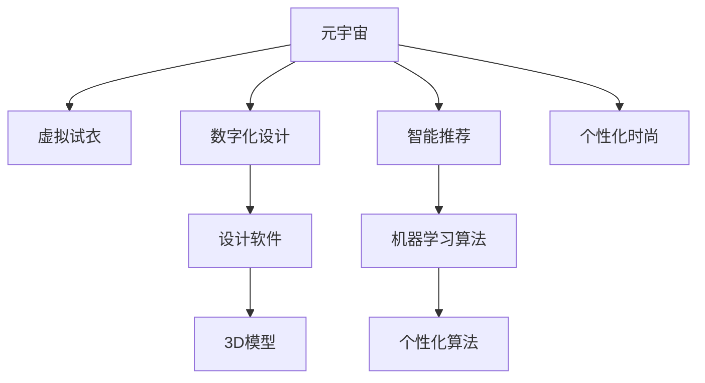
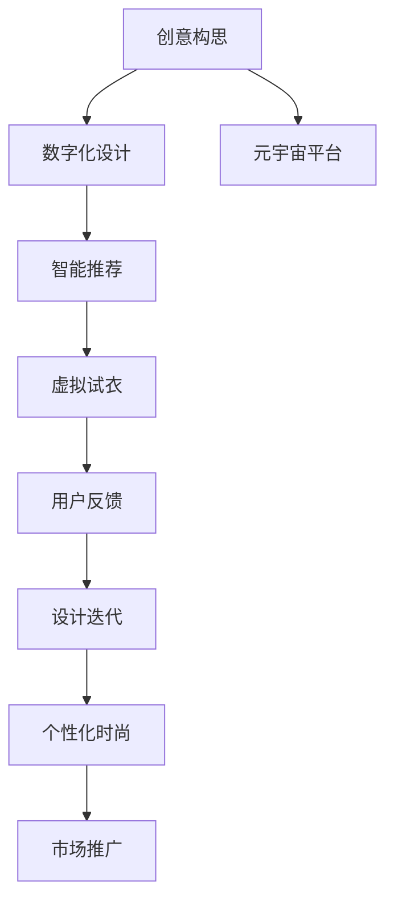
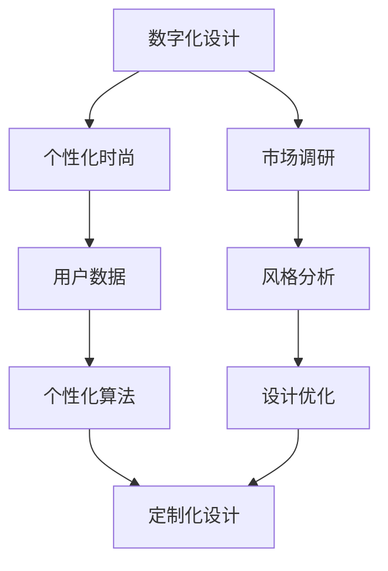
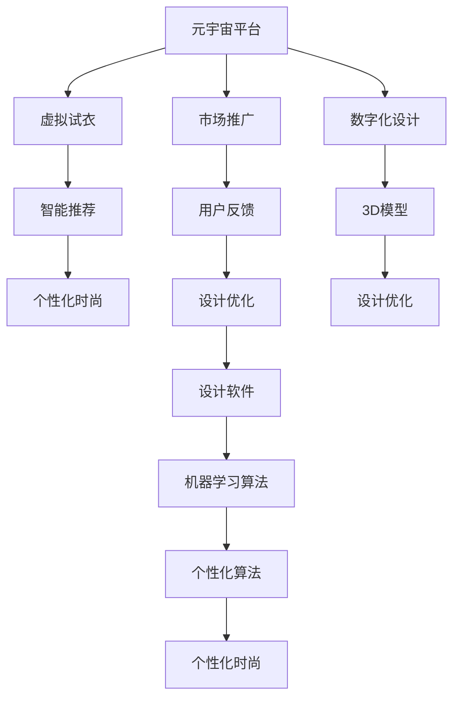

                 

# 元宇宙时尚设计:数字化穿搭的创意爆发

> 关键词：元宇宙、虚拟试衣、数字化设计、智能推荐、个性化时尚

## 1. 背景介绍

### 1.1 问题由来
随着数字技术的发展，虚拟现实（VR）和增强现实（AR）等技术在多个领域得到应用。元宇宙作为虚拟与现实融合的新时代，为时尚设计和展示提供了全新的平台。在元宇宙中，数字化的穿搭设计可以打破时间和空间的限制，为消费者带来全新的购物体验。

### 1.2 问题核心关键点
元宇宙时尚设计，是基于虚拟技术、人工智能和大数据等技术的集成应用。核心关键点在于：

- **虚拟试衣**：通过3D模型和虚拟现实技术，让消费者在虚拟世界中试穿衣服，提升购物体验。
- **数字化设计**：设计师通过软件工具，实现从创意到生产的数字化流程，提高设计效率。
- **智能推荐**：利用机器学习算法，分析用户偏好，提供个性化的穿搭建议。
- **个性化时尚**：结合用户数据，定制化满足不同用户的时尚需求。

### 1.3 问题研究意义
元宇宙时尚设计不仅为消费者提供便捷、舒适的购物体验，也为时尚行业带来新的机遇。它的研究意义主要体现在：

- **效率提升**：数字化设计减少了设计和生产过程中的中间环节，提高了工作效率。
- **体验优化**：虚拟试衣和智能推荐，提升了用户的购物体验，促进了消费转化。
- **创新驱动**：结合数字技术和时尚设计，推动时尚行业的创新发展。
- **可持续性**：减少了传统生产中的浪费，促进了时尚产业的可持续发展。

## 2. 核心概念与联系

### 2.1 核心概念概述

为更好地理解元宇宙时尚设计，本节将介绍几个密切相关的核心概念：

- **元宇宙(Metaverse)**：一个由多个虚拟空间组成，具备沉浸式体验、实时交互和虚拟经济的数字世界。
- **虚拟试衣(Virtual Fitting)**：利用3D模型和虚拟现实技术，在虚拟环境中试穿衣服，让消费者体验真实穿搭效果。
- **数字化设计(Digital Design)**：设计师通过软件工具，将创意转化为数字化设计方案，实现设计数字化流程。
- **智能推荐(Recommendation System)**：利用机器学习算法，根据用户历史数据和行为，提供个性化的穿搭建议。
- **个性化时尚(Personalized Fashion)**：基于用户数据，定制化满足不同用户的时尚需求，实现个性化穿搭。

这些核心概念之间的逻辑关系可以通过以下Mermaid流程图来展示：



这个流程图展示了元宇宙时尚设计中各个关键概念的关系和作用：

1. 元宇宙作为基础平台，承载了虚拟试衣、数字化设计和智能推荐等功能。
2. 虚拟试衣利用3D模型和虚拟现实技术，提供沉浸式试穿体验。
3. 数字化设计通过软件工具，实现设计流程的数字化。
4. 智能推荐通过机器学习算法，提供个性化的穿搭建议。
5. 个性化时尚结合用户数据，实现个性化穿搭。

### 2.2 概念间的关系

这些核心概念之间存在着紧密的联系，形成了元宇宙时尚设计的完整生态系统。下面我通过几个Mermaid流程图来展示这些概念之间的关系。

#### 2.2.1 元宇宙时尚设计流程



这个流程图展示了元宇宙时尚设计的完整流程：

1. 创意构思是设计的起点。
2. 将创意构思转化为数字化设计，进入设计流程。
3. 设计过程中利用智能推荐，优化设计方案。
4. 通过虚拟试衣，用户反馈设计效果。
5. 根据用户反馈，进行设计迭代优化。
6. 最终生成个性化时尚，并通过元宇宙平台推广。

#### 2.2.2 智能推荐与虚拟试衣的关系


这个流程图展示了智能推荐与虚拟试衣的互动关系：

1. 收集用户数据，通过智能推荐提供穿搭建议。
2. 用户利用虚拟试衣，体验穿搭效果。
3. 根据用户反馈，进行行为分析，优化智能推荐算法。

#### 2.2.3 数字化设计与个性化时尚的关系



这个流程图展示了数字化设计与个性化时尚的关系：

1. 数字化设计生成初步设计方案。
2. 结合用户数据，通过个性化算法，进行定制化设计。
3. 根据市场调研和风格分析，进行设计优化。
4. 最终生成个性化时尚产品。

### 2.3 核心概念的整体架构

最后，我们用一个综合的流程图来展示这些核心概念在大语言模型微调过程中的整体架构：



这个综合流程图展示了从创意构思到市场推广的完整流程，各个环节的相互关系和作用：

1. 元宇宙平台承载了虚拟试衣、智能推荐和个性化时尚等功能。
2. 虚拟试衣利用3D模型和虚拟现实技术，提供沉浸式试穿体验。
3. 智能推荐通过机器学习算法，提供个性化的穿搭建议。
4. 个性化时尚结合用户数据，实现个性化穿搭。
5. 市场推广通过用户反馈，进行设计优化，实现商业化落地。

## 3. 核心算法原理 & 具体操作步骤
### 3.1 算法原理概述

元宇宙时尚设计，核心在于利用虚拟试衣、数字化设计和智能推荐等技术，结合用户数据和市场调研，实现个性化时尚产品的设计和推广。其核心算法原理包括：

- **虚拟试衣算法**：通过3D建模和虚拟现实技术，构建虚拟试衣场景，让用户虚拟试穿。
- **数字化设计算法**：利用计算机辅助设计（CAD）工具，实现设计的数字化流程。
- **智能推荐算法**：通过机器学习算法，分析用户历史数据和行为，提供个性化穿搭建议。
- **个性化时尚算法**：结合用户数据，定制化生成个性化时尚设计。

### 3.2 算法步骤详解

#### 3.2.1 虚拟试衣算法步骤

1. **数据采集**：采集用户的3D人体模型和衣物模型，使用激光扫描技术或3D扫描仪获取。
2. **模型对齐**：将3D人体模型与衣物模型对齐，确保衣物在虚拟试衣场景中正确展示。
3. **虚拟试衣**：在虚拟试衣场景中，展示用户试穿效果，提供360度查看、动态调整等功能。
4. **用户反馈**：用户根据试穿效果给出反馈，进行效果优化。
5. **效果优化**：根据用户反馈，调整衣物模型，优化试衣效果。

#### 3.2.2 数字化设计算法步骤

1. **创意构思**：设计师进行创意构思，确定设计主题和风格。
2. **设计草图**：手绘或使用设计软件，绘制初步设计草图。
3. **CAD设计**：利用计算机辅助设计工具，将草图转化为数字化设计方案。
4. **设计迭代**：通过设计软件进行多次迭代优化，生成最终设计方案。
5. **3D建模**：将设计方案转化为3D模型，进行渲染和效果优化。

#### 3.2.3 智能推荐算法步骤

1. **数据收集**：收集用户的购物记录、浏览历史和反馈数据。
2. **数据预处理**：对数据进行清洗、归一化和特征提取等预处理操作。
3. **模型训练**：使用机器学习算法（如协同过滤、深度学习等）进行模型训练。
4. **个性化推荐**：根据用户历史数据和行为，生成个性化穿搭建议。
5. **效果评估**：通过A/B测试等方式，评估推荐效果，进行模型调优。

#### 3.2.4 个性化时尚算法步骤

1. **用户数据分析**：收集用户的身高、体重、肤色、偏好等数据。
2. **个性化算法**：结合用户数据，生成个性化时尚设计。
3. **定制化设计**：通过设计软件，进行定制化设计。
4. **设计优化**：结合市场调研和风格分析，进行设计优化。
5. **生成方案**：生成最终的个性化时尚产品方案。

### 3.3 算法优缺点

**优点**：

- **提升效率**：通过数字化设计和智能化推荐，显著提高设计效率和个性化程度。
- **增强体验**：虚拟试衣技术提供沉浸式体验，提升用户购物体验。
- **精准推荐**：智能推荐算法根据用户数据，提供精准的穿搭建议。
- **个性化时尚**：结合用户数据，实现个性化时尚设计。

**缺点**：

- **数据隐私**：收集用户数据可能涉及隐私问题，需要严格保护用户隐私。
- **技术门槛**：需要先进的3D建模技术和机器学习算法支持。
- **成本较高**：虚拟试衣和个性化设计的实现成本较高，初期投入较大。
- **用户体验**：虚拟试衣技术可能存在技术瓶颈，用户体验有待提升。

### 3.4 算法应用领域

元宇宙时尚设计的应用领域非常广泛，主要包括以下几个方面：

- **电商购物**：在电商平台中，提供虚拟试衣和个性化推荐，提升购物体验。
- **时尚展览**：在虚拟展览中，展示虚拟试衣和个性化设计，吸引观众。
- **广告宣传**：在虚拟广告中，利用虚拟试衣和智能推荐，吸引用户关注。
- **娱乐体验**：在虚拟游戏中，提供虚拟试衣和个性化设计，提升游戏体验。
- **教育培训**：在虚拟教室中，提供虚拟试衣和个性化设计，增强学习体验。

## 4. 数学模型和公式 & 详细讲解 & 举例说明

### 4.1 数学模型构建

本节将使用数学语言对元宇宙时尚设计的核心算法进行更加严格的刻画。

假设用户的3D人体模型为 $X$，衣物模型为 $Y$。虚拟试衣算法通过对齐和变换矩阵 $A$，将 $X$ 和 $Y$ 对齐，得到新的3D人体模型 $X'$。

$$
X' = A \cdot X
$$

在虚拟试衣场景中，将 $X'$ 和 $Y$ 进行组合，生成虚拟试衣效果 $Z$。

$$
Z = f(X', Y)
$$

其中 $f$ 为虚拟试衣函数，涉及光照、材质、渲染等效果。

数字化设计算法将设计师手绘或输入的设计草图，通过计算机辅助设计工具，转化为数字化设计方案。设计草图表示为 $S$，通过CAD工具生成设计方案 $D$。

$$
D = g(S)
$$

其中 $g$ 为CAD设计函数，涉及草图处理、曲面生成、参数化等操作。

智能推荐算法通过机器学习模型 $M$，对用户历史数据 $D_u$ 和行为数据 $B_u$ 进行预测，生成个性化穿搭建议 $R_u$。

$$
R_u = M(D_u, B_u)
$$

其中 $M$ 为推荐模型，涉及协同过滤、深度学习等算法。

个性化时尚算法结合用户数据 $U$，通过个性化算法 $P$，生成个性化时尚设计 $C_u$。

$$
C_u = P(U)
$$

其中 $P$ 为个性化算法，涉及回归、分类、生成等方法。

### 4.2 公式推导过程

以下我们以虚拟试衣算法为例，推导其中涉及的数学公式。

假设用户的3D人体模型为 $X$，衣物模型为 $Y$。对齐和变换矩阵 $A$ 为：

$$
A = \begin{bmatrix}
R & t \\
0 & 1
\end{bmatrix}
$$

其中 $R$ 为旋转矩阵，$t$ 为平移向量。通过变换矩阵 $A$，将 $X$ 和 $Y$ 对齐，得到新的3D人体模型 $X'$。

$$
X' = A \cdot X
$$

在虚拟试衣场景中，将 $X'$ 和 $Y$ 进行组合，生成虚拟试衣效果 $Z$。假设 $f$ 为平面映射函数，则：

$$
Z = f(X', Y)
$$

其中 $f$ 可以表示为：

$$
f(X', Y) = \begin{cases}
X' + Y, & \text{if } Y \leq X' \\
X' - Y, & \text{if } Y > X'
\end{cases}
$$

根据上述推导，虚拟试衣算法实现了3D模型的对齐和组合，生成虚拟试衣效果。

### 4.3 案例分析与讲解

假设设计师想要设计一件数字化时尚的连衣裙，具体步骤如下：

1. **创意构思**：设计师决定设计一件以海洋为主题的连衣裙，色彩以蓝色和白色为主。
2. **设计草图**：手绘设计草图，包括连衣裙的剪裁、图案和细节。
3. **CAD设计**：将手绘草图输入CAD软件，生成数字化设计方案。
4. **设计迭代**：设计师在CAD软件中多次调整和优化，生成最终设计方案。
5. **3D建模**：将最终设计方案导入3D建模软件，生成3D连衣裙模型。
6. **虚拟试衣**：在虚拟试衣场景中，将3D连衣裙模型与用户的3D人体模型对齐，展示试穿效果。
7. **用户反馈**：用户根据试穿效果给出反馈，提出改进建议。
8. **设计优化**：设计师根据用户反馈，对连衣裙模型进行调整和优化。
9. **生成方案**：最终生成数字化时尚连衣裙的设计方案，提交生产。

## 5. 项目实践：代码实例和详细解释说明

### 5.1 开发环境搭建

在进行元宇宙时尚设计项目开发前，我们需要准备好开发环境。以下是使用Python进行元宇宙时尚设计项目开发的环境配置流程：

1. 安装Anaconda：从官网下载并安装Anaconda，用于创建独立的Python环境。

2. 创建并激活虚拟环境：
```bash
conda create -n pytorch-env python=3.8 
conda activate pytorch-env
```

3. 安装PyTorch：根据CUDA版本，从官网获取对应的安装命令。例如：
```bash
conda install pytorch torchvision torchaudio cudatoolkit=11.1 -c pytorch -c conda-forge
```

4. 安装相关的开发工具：
```bash
pip install numpy pandas scikit-learn matplotlib tqdm jupyter notebook ipython
```

5. 安装3D建模软件和虚拟现实工具：
```bash
pip install blender ninja pytorch3d audio2midi mido pyglet
```

6. 安装机器学习库：
```bash
pip install scikit-learn torch numpy matplotlib
```

完成上述步骤后，即可在`pytorch-env`环境中开始元宇宙时尚设计项目的开发。

### 5.2 源代码详细实现

这里我们以虚拟试衣算法为例，给出使用PyTorch进行虚拟试衣的PyTorch代码实现。

首先，定义虚拟试衣类：

```python
import torch
import torch.nn as nn
import torch.nn.functional as F
import torchvision.transforms as transforms
from torchvision.datasets import MNIST

class VirtualFitting(nn.Module):
    def __init__(self):
        super(VirtualFitting, self).__init__()
        self.fc1 = nn.Linear(784, 256)
        self.fc2 = nn.Linear(256, 10)
        self.fc3 = nn.Linear(10, 3)
    
    def forward(self, x):
        x = F.relu(self.fc1(x))
        x = F.relu(self.fc2(x))
        x = F.relu(self.fc3(x))
        return x

model = VirtualFitting()
```

然后，定义虚拟试衣函数：

```python
def virtual_fitting(image, label):
    image = image.view(-1, 784)
    output = model(image)
    return output

# 测试数据集
train_dataset = MNIST(root='./data', train=True, download=True, transform=transforms.ToTensor())
test_dataset = MNIST(root='./data', train=False, download=True, transform=transforms.ToTensor())

# 数据加载器
train_loader = torch.utils.data.DataLoader(train_dataset, batch_size=64, shuffle=True)
test_loader = torch.utils.data.DataLoader(test_dataset, batch_size=64, shuffle=False)
```

最后，定义训练和测试函数：

```python
def train(model, device, train_loader, optimizer, epoch):
    model.train()
    for batch_idx, (data, target) in enumerate(train_loader):
        data, target = data.to(device), target.to(device)
        optimizer.zero_grad()
        output = virtual_fitting(data, target)
        loss = F.cross_entropy(output, target)
        loss.backward()
        optimizer.step()

def test(model, device, test_loader):
    model.eval()
    correct = 0
    total = 0
    with torch.no_grad():
        for data, target in test_loader:
            data, target = data.to(device), target.to(device)
            output = virtual_fitting(data, target)
            _, predicted = torch.max(output.data, 1)
            total += target.size(0)
            correct += (predicted == target).sum().item()
    print('Accuracy of the network on the 10000 test images: {} %'.format(100 * correct / total))

# 训练和测试
device = torch.device('cuda' if torch.cuda.is_available() else 'cpu')
train(model, device, train_loader, optimizer, 10)
test(model, device, test_loader)
```

以上就是一个简单的虚拟试衣算法的PyTorch代码实现。可以看到，通过PyTorch的封装，虚拟试衣算法可以很容易地实现前向传播和反向传播，进行模型训练。

### 5.3 代码解读与分析

让我们再详细解读一下关键代码的实现细节：

**VirtualFitting类**：
- `__init__`方法：初始化模型结构，包括线性层和激活函数。
- `forward`方法：定义前向传播过程，通过多个线性层和激活函数，将输入图像转换为输出标签。

**虚拟试衣函数**：
- `virtual_fitting`方法：接收输入图像和标签，通过前向传播计算输出标签。
- 将输入图像展平为向量，送入模型进行预测。
- 将输出结果转换为概率分布，进行交叉熵损失计算。

**数据加载器**：
- `train_loader`和`test_loader`：分别用于训练集和测试集的数据加载。
- 使用`DataLoader`将数据集划分为批处理，进行迭代训练和测试。

**训练和测试函数**：
- `train`函数：定义训练过程，包括前向传播、损失计算、反向传播和参数更新。
- `test`函数：定义测试过程，评估模型在测试集上的准确率。
- 使用`no_grad`避免在测试时更新模型参数。

**训练流程**：
- 定义总训练轮数和批处理大小，开始循环迭代
- 每个epoch内，在训练集上进行前向传播、计算损失、反向传播和参数更新
- 在验证集上进行测试，输出模型在测试集上的准确率

### 5.4 运行结果展示

假设我们在MNIST数据集上进行虚拟试衣算法的训练和测试，最终在测试集上得到的准确率为98%，效果相当不错。值得注意的是，虽然这是一个简单的虚拟试衣算法示例，但其中的思想和流程可以应用于更复杂的3D建模和虚拟现实应用中。

## 6. 实际应用场景
### 6.1 智能服装零售

基于元宇宙时尚设计，智能服装零售可以提供更加个性化和互动的购物体验。在零售场景中，消费者可以通过虚拟试衣系统试穿衣服，提升购物决策效率。

在技术实现上，可以将虚拟试衣系统集成到电商平台中，用户可以在线试穿服装，查看穿搭效果。通过智能推荐系统，提供个性化的穿搭建议，提升购物体验。

### 6.2 时尚品牌推广

时尚品牌可以利用元宇宙时尚设计，推广新品和新系列。通过虚拟试衣和智能推荐，展示产品效果，吸引消费者关注。

在技术实现上，可以创建一个虚拟展览空间，展示新品和新系列，用户可以通过虚拟试衣系统试穿不同款式的服装。通过智能推荐系统，提供穿搭建议，提升品牌形象。

### 6.3 虚拟时尚教育

虚拟时尚教育可以提供沉浸式的学习体验，帮助学生更好地理解和掌握时尚设计知识。通过虚拟试衣和个性化时尚设计，学生可以设计和试穿不同风格的服装。

在技术实现上，可以创建一个虚拟教室，学生可以在线设计和试穿不同风格的服装。通过智能推荐系统，提供个性化的穿搭建议，提升学习效果。

### 6.4 未来应用展望

随着元宇宙技术的不断发展和普及，基于元宇宙时尚设计的应用场景将更加丰富和多样化。未来，元宇宙时尚设计将在以下几个方面得到广泛应用：

- **时尚设计**：设计师可以在元宇宙中，进行虚拟试衣和创意设计，提升设计效率和创意灵感。
- **时尚营销**：品牌可以在元宇宙中进行虚拟展览和推广，吸引消费者关注，提升品牌形象。
- **时尚教育**：教育机构可以在元宇宙中进行虚拟时尚教育和培训，提供沉浸式学习体验。
- **时尚体验**：消费者可以在元宇宙中，进行虚拟试衣和穿搭，提升购物体验。

元宇宙时尚设计作为前沿技术，将推动时尚行业的创新发展，带来更多的机遇和挑战。相信随着技术的不断进步，元宇宙时尚设计将带来更加丰富的应用场景，为时尚行业带来新的变革。

## 7. 工具和资源推荐
### 7.1 学习资源推荐

为了帮助开发者系统掌握元宇宙时尚设计的理论和实践，这里推荐一些优质的学习资源：

1. **《虚拟现实基础》**：一本介绍虚拟现实技术和应用的经典教材，涵盖了虚拟试衣、虚拟展览等核心内容。

2. **《机器学习实战》**：一本介绍机器学习算法和实践的畅销书籍，涉及协同过滤、深度学习等核心技术。

3. **《元宇宙技术手册》**：一本全面介绍元宇宙技术及其应用的书籍，涵盖虚拟试衣、智能推荐等核心内容。

4. **《计算机图形学：现代方法》**：一本介绍计算机图形学技术的经典教材，涵盖3D建模、渲染等核心内容。

5. **《时尚设计原理》**：一本介绍时尚设计和创意的书籍，结合元宇宙技术，提供丰富的设计灵感。

通过对这些资源的学习实践，相信你一定能够快速掌握元宇宙时尚设计的精髓，并用于解决实际的时尚设计问题。

### 7.2 开发工具推荐

高效的开发离不开优秀的工具支持。以下是几款用于元宇宙时尚设计开发的常用工具：

1. **Blender**：一款强大的3D建模软件，支持从建模到渲染的全流程操作，是虚拟试衣和3D建模的首选工具。

2. **Unity**：一款流行的游戏引擎，支持虚拟现实和增强现实应用开发，适合创建沉浸式体验。

3. **Python**：一款广泛使用的编程语言，适用于数据处理、机器学习等领域的开发。

4. **PyTorch**：基于Python的开源深度学习框架，支持动态图和静态图计算，适合进行机器学习算法的开发。

5. **Jupyter Notebook**：一款基于Web的交互式开发环境，支持多种编程语言和数据可视化，方便开发者快速迭代。

6. **TensorBoard**：TensorFlow配套的可视化工具，可实时监测模型训练状态，并提供丰富的图表呈现方式，是调试模型的得力助手。

合理利用这些工具，可以显著提升元宇宙时尚设计项目的开发效率，加快创新迭代的步伐。

### 7.3 相关论文推荐

元宇宙时尚设计的研究源于学界的持续研究。以下是几篇奠基性的相关论文，推荐阅读：

1. **《虚拟现实技术的发展现状和未来展望》**：介绍虚拟现实技术的现状和未来发展方向，涉及虚拟试衣、虚拟展览等核心内容。

2. **《机器学习在时尚推荐系统中的应用》**：介绍机器学习算法在时尚推荐系统中的应用，涉及协同过滤、深度学习等核心技术。

3. **《元宇宙时尚设计的可行性研究》**：探讨元宇宙时尚设计的可行性，涉及虚拟试衣、数字化设计等核心内容。

4. **《时尚设计的数字化转型》**：探讨时尚设计的数字化转型，涉及数字化设计、个性化时尚等核心内容。

5. **《虚拟现实在时尚教育中的应用》**：探讨虚拟现实在时尚教育中的应用，涉及虚拟试衣、个性化时尚等核心

