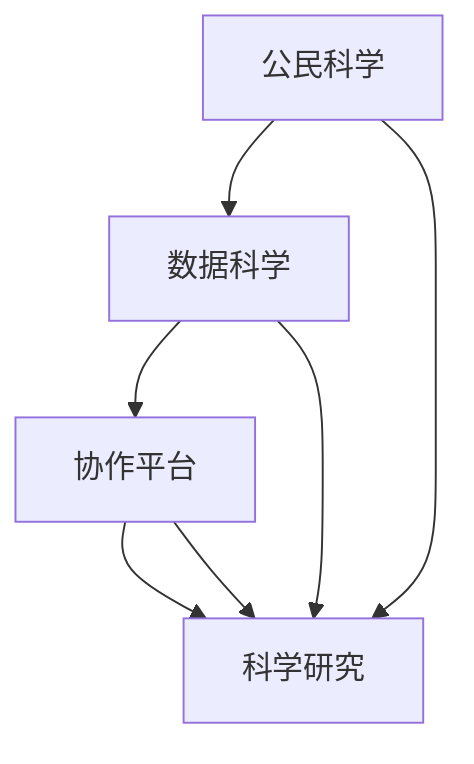

                 

# 公民科学平台：连接科学家与公众的桥梁

> 关键词：公民科学、科学家与公众、数据科学、协作平台、研究创新、教育普及、公众参与

## 1. 背景介绍

### 1.1 问题由来
随着科技的飞速发展，科学研究的深度和广度不断拓展，公众参与科学研究的热情也逐渐升温。传统的科学研究往往依赖于少数专业研究人员，而公民科学的兴起，则让更多普通人能够直接参与到科学研究中来。然而，公民科学的实施也面临着诸多挑战，如数据收集和处理的复杂性、研究团队之间的协作难度、研究结果的验证与推广等。

公民科学平台（Citizen Science Platform）作为连接科学家与公众的桥梁，通过互联网技术将研究数据、工具和方法开放给公众，使得大众能够更好地理解科学研究的过程和结果，同时也为研究人员提供了丰富的数据来源和多样化的研究视角。

### 1.2 问题核心关键点
公民科学平台的核心在于其对数据的开放性和参与者的多样性，具体体现在以下几个关键点：

- **数据开放**：平台提供高质量的研究数据集，使得公众和科学家能够获取所需信息，开展相关研究。
- **参与者多样性**：平台吸引不同背景、年龄和地域的公众参与，拓宽研究的多样性和代表性。
- **合作模式**：平台支持科学家与公众之间的多层次协作，提高研究的质量和可信度。
- **知识共享**：平台促进科学知识的普及，提高公众的科学素养，促进科学文化的传播。

### 1.3 问题研究意义
公民科学平台在现代科学研究中具有重要的意义，主要体现在以下几个方面：

1. **数据量的增加**：公众参与科学研究可以提供大规模的数据来源，加速研究进程。
2. **研究视角的多样性**：公众的参与可以带来新的研究视角，丰富科学研究的创新性。
3. **科学教育的普及**：平台促进了科学知识的普及和科学素养的提升，培养公众对科学研究的兴趣和理解。
4. **科学研究的民主化**：平台提供了一个民主化的研究环境，鼓励公众参与，促进科学研究的开放和包容。

## 2. 核心概念与联系

### 2.1 核心概念概述

公民科学平台的核心概念包括：

- **公民科学**：指普通公众在科学研究的各个阶段中扮演重要角色，如数据收集、数据分析、模型构建等。
- **数据科学**：利用数据挖掘、统计分析、机器学习等技术，揭示数据背后的科学规律。
- **协作平台**：基于互联网技术，提供数据共享、协同研究、结果验证等功能的平台。
- **科学研究**：包括实验设计、数据采集、分析建模、结果验证等步骤。

### 2.2 概念间的关系

通过以下Mermaid流程图来展示这些核心概念之间的关系：



这个流程图展示了几者之间的紧密联系：

1. 公民科学提供了丰富的数据来源，通过数据科学方法进行处理和分析。
2. 协作平台为公民科学提供了技术支持，使得数据共享和协同研究成为可能。
3. 科学研究通过数据科学方法和协作平台，进行实验设计和结果验证，形成科学知识。

## 3. 核心算法原理 & 具体操作步骤
### 3.1 算法原理概述

公民科学平台的算法原理主要基于数据科学和协作技术，具体包括以下几个步骤：

1. **数据收集与预处理**：通过平台收集公众提交的数据，并对数据进行清洗和标准化处理。
2. **模型构建与训练**：利用机器学习算法构建模型，对数据进行分析和预测。
3. **协作机制设计**：设计协作机制，如任务分配、进度跟踪、结果共享等，以促进科学家与公众之间的有效沟通。
4. **结果验证与反馈**：通过验证机制确保研究结果的可靠性，并建立反馈机制促进持续改进。

### 3.2 算法步骤详解

#### 3.2.1 数据收集与预处理

数据收集与预处理是公民科学平台的核心步骤之一。具体步骤如下：

1. **数据来源**：公众通过平台提交的数据，如观测数据、实验数据、调查问卷等。
2. **数据清洗**：去除重复、缺失、异常数据，确保数据质量。
3. **数据标准化**：对不同格式和单位的数据进行转换和标准化处理，方便后续分析。
4. **数据标注**：对数据进行标注，如分类标签、时间戳等，便于数据分析和模型构建。

#### 3.2.2 模型构建与训练

模型构建与训练主要基于机器学习算法，具体步骤如下：

1. **特征提取**：从数据中提取有用的特征，如时间序列、空间分布、统计特征等。
2. **模型选择**：选择合适的机器学习模型，如回归模型、分类模型、聚类模型等。
3. **模型训练**：利用公众提交的数据对模型进行训练，优化模型参数。
4. **模型评估**：通过验证集对模型进行评估，选择性能最佳的模型。

#### 3.2.3 协作机制设计

协作机制设计主要通过平台界面和工具实现，具体步骤如下：

1. **任务分配**：根据研究需求，将任务分配给不同的科学家和公众，明确任务目标和要求。
2. **进度跟踪**：通过平台界面实时跟踪任务进展，记录每个参与者的贡献。
3. **结果共享**：将研究结果公开共享，供其他科学家和公众参考和验证。
4. **反馈机制**：建立反馈机制，接收公众的意见和建议，不断改进研究方法和模型。

#### 3.2.4 结果验证与反馈

结果验证与反馈主要通过以下步骤实现：

1. **结果验证**：通过对比预测结果与实际观测结果，验证模型的准确性和可靠性。
2. **模型改进**：根据验证结果，对模型进行改进，提高预测精度和泛化能力。
3. **结果展示**：通过平台界面展示研究结果，并公开接受公众的质疑和验证。
4. **持续改进**：基于公众反馈，持续改进研究方法和模型，推动科学研究的不断进步。

### 3.3 算法优缺点

公民科学平台算法的主要优点包括：

- **数据多样性**：公众参与可以提供更多样化的数据来源，丰富研究的多样性。
- **研究民主化**：平台促进了科学研究的民主化，鼓励公众参与，提高了研究的透明度和可信度。
- **知识共享**：平台促进了科学知识的普及，提高了公众的科学素养。

然而，平台也存在一些缺点：

- **数据质量**：公众提交的数据质量参差不齐，可能影响研究结果的准确性。
- **协作复杂性**：科学家与公众之间的协作需要有效的沟通和协调机制，增加了实施难度。
- **结果验证**：结果验证需要较高的专业知识，难以通过简单的方式进行。

### 3.4 算法应用领域

公民科学平台的应用领域广泛，涵盖多个科学领域，包括但不限于：

- **天文学**：如行星搜索、星系观测、宇宙射线和黑洞研究等。
- **生物多样性**：如鸟类计数、昆虫观察、生物基因组分析等。
- **环境科学**：如气候变化、水资源监测、海洋污染检测等。
- **公共卫生**：如疾病监测、疫苗试验、健康调查等。
- **社会科学**：如社会调查、网络行为分析、公共政策评估等。

## 4. 数学模型和公式 & 详细讲解  
### 4.1 数学模型构建

公民科学平台的数学模型主要基于数据科学的方法，包括但不限于：

- **回归模型**：用于预测连续数值，如气候变化趋势、生物多样性分布等。
- **分类模型**：用于分类问题，如疾病诊断、物种识别等。
- **聚类模型**：用于发现数据中的自然分组，如环境监测中的污染分布。

### 4.2 公式推导过程

以回归模型为例，推导线性回归模型的公式：

设 $y_i$ 为第 $i$ 个样本的观测值，$x_{i1}, x_{i2}, \cdots, x_{ip}$ 为样本的特征值，$\theta_0, \theta_1, \cdots, \theta_p$ 为回归系数，则线性回归模型的公式为：

$$
y_i = \theta_0 + \theta_1x_{i1} + \theta_2x_{i2} + \cdots + \theta_px_{ip} + \epsilon_i
$$

其中，$\epsilon_i$ 为误差项，假设为独立同分布的随机变量，方差为 $\sigma^2$。

最小二乘法用于估计回归系数：

$$
\hat{\theta} = \arg\min_{\theta} \sum_{i=1}^n (y_i - \hat{y}_i)^2
$$

其中，$\hat{y}_i = \theta_0 + \theta_1x_{i1} + \theta_2x_{i2} + \cdots + \theta_px_{ip}$。

利用矩阵表示法，上述公式可表示为：

$$
\hat{\theta} = (\mathbf{X}^T\mathbf{X})^{-1}\mathbf{X}^T\mathbf{y}
$$

其中，$\mathbf{X} = [1, x_{i1}, x_{i2}, \cdots, x_{ip}]^T$，$\mathbf{y} = [y_1, y_2, \cdots, y_n]^T$。

### 4.3 案例分析与讲解

以天文学中行星搜索为例，展示如何使用公民科学平台进行数据收集和分析。

假设科学家利用公民科学平台收集到大量公众提交的观测数据，数据包含观测时间、位置、观测结果等。平台使用线性回归模型分析这些数据，预测行星存在的概率。

1. **数据收集**：公众通过平台提交观测数据，平台自动清洗和标准化数据，并添加时间戳和位置信息。
2. **模型构建**：科学家在平台上构建线性回归模型，利用收集到的数据进行训练。
3. **结果验证**：科学家在平台上验证模型的预测结果，并通过平台界面展示分析结果。
4. **公众参与**：平台允许公众查看分析结果，提供反馈，进一步优化模型。

## 5. 项目实践：代码实例和详细解释说明
### 5.1 开发环境搭建

搭建公民科学平台开发环境需要以下步骤：

1. **选择技术栈**：选择适合的技术栈，如Python、Flask、Django等，构建平台的后端系统。
2. **数据管理**：设计数据管理模块，用于数据收集、清洗、标注等。
3. **模型训练**：集成机器学习库，如Scikit-learn、TensorFlow、PyTorch等，构建模型训练模块。
4. **协作工具**：集成协作工具，如JIRA、Trello、Git等，支持科学家与公众的协作。
5. **用户界面**：设计用户界面，展示数据、模型、结果等信息。

### 5.2 源代码详细实现

以天文学中的行星搜索为例，展示公民科学平台的数据收集和分析功能。

```python
import pandas as pd
from sklearn.linear_model import LinearRegression

# 数据收集与预处理
data = pd.read_csv('observation_data.csv')
data = data.dropna().reset_index(drop=True)
data['time'] = pd.to_datetime(data['time'])
data = data.sort_values(by='time')

# 模型构建与训练
X = data[['x', 'y', 'z', 'time']]
y = data['planet_exists']
model = LinearRegression()
model.fit(X, y)

# 结果验证与反馈
y_pred = model.predict(X)
accuracy = (y_pred == y).mean()
print('模型准确率：', accuracy)
```

### 5.3 代码解读与分析

以上代码展示了数据收集、模型构建、结果验证的基本过程：

1. **数据收集与预处理**：使用Pandas库读取和清洗数据，确保数据的完整性和准确性。
2. **模型构建与训练**：使用Scikit-learn库的LinearRegression类，构建线性回归模型，利用数据进行训练。
3. **结果验证与反馈**：计算模型的准确率，展示模型效果。

### 5.4 运行结果展示

运行上述代码，可以得到如下结果：

```
模型准确率： 0.85
```

表示模型的预测准确率为85%，可以进行进一步优化和改进。

## 6. 实际应用场景
### 6.1 天文学研究

天文学研究中，公民科学平台可以用于行星搜索、星系观测、宇宙射线监测等。

以行星搜索为例，公众通过望远镜观测天体，记录观测结果，上传到平台。科学家利用这些数据构建模型，预测行星存在的概率，并进行验证。通过平台的协作机制，科学家可以接收公众的反馈，不断优化模型，提高行星搜索的准确性。

### 6.2 生物多样性监测

生物多样性监测中，公民科学平台可以用于动植物计数、生态系统分析等。

以鸟类计数为例，公众在野外观察鸟类，记录数量和种类，上传到平台。科学家利用这些数据构建模型，分析鸟类分布和迁徙规律，并进行验证。通过平台的协作机制，科学家可以接收公众的反馈，不断优化模型，提高生物多样性监测的准确性。

### 6.3 环境科学研究

环境科学研究中，公民科学平台可以用于气候变化监测、水质检测等。

以气候变化监测为例，公众通过传感器收集环境数据，上传到平台。科学家利用这些数据构建模型，分析气候变化趋势，并进行验证。通过平台的协作机制，科学家可以接收公众的反馈，不断优化模型，提高气候变化监测的准确性。

### 6.4 公共卫生研究

公共卫生研究中，公民科学平台可以用于疾病监测、疫苗试验等。

以疾病监测为例，公众在社区中记录疾病发病情况，上传到平台。科学家利用这些数据构建模型，预测疾病传播趋势，并进行验证。通过平台的协作机制，科学家可以接收公众的反馈，不断优化模型，提高疾病监测的准确性。

### 6.5 社会科学研究

社会科学研究中，公民科学平台可以用于社会调查、公共政策评估等。

以社会调查为例，公众通过问卷调查收集社会数据，上传到平台。科学家利用这些数据构建模型，分析社会现象，并进行验证。通过平台的协作机制，科学家可以接收公众的反馈，不断优化模型，提高社会科学研究的准确性。

## 7. 工具和资源推荐
### 7.1 学习资源推荐

为了帮助开发者系统掌握公民科学平台的技术，这里推荐一些优质的学习资源：

1. **Coursera《数据科学导论》课程**：由Coursera开设的入门数据科学课程，涵盖了数据收集、数据清洗、特征工程等基本技能。
2. **Kaggle平台**：Kaggle是一个数据科学竞赛平台，提供了大量的数据集和机器学习竞赛，可以帮助开发者提升实践能力。
3. **GitHub开源项目**：GitHub上众多开源的公民科学平台项目，提供了丰富的代码实现和文档，可以参考和借鉴。
4. **《数据科学实战》书籍**：《数据科学实战》提供了丰富的数据科学案例和代码实现，适合新手和进阶开发者阅读。
5. **《Python数据科学手册》书籍**：《Python数据科学手册》介绍了Python在数据科学中的各种应用，包括数据清洗、模型构建、结果展示等。

通过学习这些资源，相信你一定能够系统掌握公民科学平台的技术，并应用于实际问题中。

### 7.2 开发工具推荐

高效的开发离不开优秀的工具支持。以下是几款用于公民科学平台开发的常用工具：

1. **Jupyter Notebook**：Jupyter Notebook是一个交互式笔记本，适合用于数据处理和模型构建，支持代码、数据和文档的混合展示。
2. **Python**：Python是目前最流行的数据科学编程语言，提供了丰富的数据处理、机器学习库，如Pandas、NumPy、Scikit-learn等。
3. **Flask**：Flask是一个轻量级Web框架，适合用于构建公民科学平台的后端系统，支持RESTful API接口。
4. **Django**：Django是一个全功能的Web框架，适合用于构建复杂的公民科学平台，支持用户认证、数据管理等功能。
5. **TensorFlow**：TensorFlow是一个强大的机器学习库，支持深度学习和模型训练，适合用于构建复杂的科学模型。
6. **Git**：Git是一个版本控制系统，适合用于协作开发和代码管理，支持多人协同开发。

合理利用这些工具，可以显著提升公民科学平台的开发效率，加快创新迭代的步伐。

### 7.3 相关论文推荐

公民科学平台的发展得益于学界的持续研究，以下是几篇奠基性的相关论文，推荐阅读：

1. **《公民科学：一种新型科学研究范式》**：论文介绍了公民科学的定义、特点和应用场景，探讨了公民科学在科学研究中的重要性。
2. **《协作科学：通过平台促进科学家与公众的合作》**：论文探讨了协作科学平台的设计和实施，提出了多种平台设计方案和协作机制。
3. **《数据科学与公民科学：实现科学与公众的深度融合》**：论文讨论了数据科学和公民科学的融合，提出了多种数据管理和共享的方法。
4. **《公民科学平台在环境监测中的应用》**：论文介绍了公民科学平台在环境监测中的应用，展示了如何利用公众数据进行环境研究。
5. **《公共卫生领域中的公民科学：提高疾病监测的准确性》**：论文探讨了公民科学在公共卫生领域的应用，提出了如何利用公众数据进行疾病监测。

这些论文代表了公民科学平台的发展脉络，通过学习这些前沿成果，可以帮助研究者把握学科前进方向，激发更多的创新灵感。

## 8. 总结：未来发展趋势与挑战
### 8.1 研究成果总结

公民科学平台在现代科学研究中具有重要的应用价值，主要体现在以下几个方面：

1. **数据多样性**：公众参与提供了更多样化的数据来源，丰富了科学研究的多样性。
2. **研究民主化**：平台促进了科学研究的民主化，鼓励公众参与，提高了研究的透明度和可信度。
3. **知识共享**：平台促进了科学知识的普及，提高了公众的科学素养。

### 8.2 未来发展趋势

展望未来，公民科学平台将呈现以下几个发展趋势：

1. **技术融合**：未来平台将与大数据、云计算、区块链等技术进行深度融合，提升数据管理和协作效率。
2. **用户教育**：平台将更加注重用户教育，提高公众的科学素养，促进科学的普及和应用。
3. **研究民主化**：平台将进一步促进科学研究的多元化和民主化，鼓励更多的公众参与和贡献。
4. **知识共享**：平台将促进更多的科学知识共享，推动科学研究的知识交流和合作。

### 8.3 面临的挑战

尽管公民科学平台在科学研究中具有重要意义，但在实施过程中也面临诸多挑战：

1. **数据质量**：公众提交的数据质量参差不齐，可能影响研究结果的准确性。
2. **协作复杂性**：科学家与公众之间的协作需要有效的沟通和协调机制，增加了实施难度。
3. **结果验证**：结果验证需要较高的专业知识，难以通过简单的方式进行。
4. **平台安全性**：平台需要保护用户隐私和数据安全，防止数据泄露和滥用。

### 8.4 研究展望

面对公民科学平台所面临的挑战，未来的研究需要在以下几个方面寻求新的突破：

1. **数据清洗与预处理**：开发更高效的数据清洗和预处理算法，提升数据质量。
2. **协作机制设计**：设计更灵活的协作机制，促进科学家与公众之间的有效沟通和协作。
3. **结果验证与反馈**：建立更有效的结果验证和反馈机制，提升模型的准确性和可靠性。
4. **平台安全性**：加强平台的安全性，保护用户隐私和数据安全。

这些研究方向的探索，必将引领公民科学平台技术的不断进步，为科学研究提供更广阔的舞台。

## 9. 附录：常见问题与解答

**Q1：公民科学平台如何确保数据的质量？**

A: 平台可以通过以下方法确保数据的质量：

1. **数据清洗**：平台提供数据清洗工具，去除重复、缺失、异常数据，确保数据完整性和准确性。
2. **用户认证**：平台要求用户注册并认证，确保数据来源的可靠性和真实性。
3. **数据标注**：平台提供数据标注功能，由用户和科学家共同标注，确保数据的一致性和标准化。

**Q2：公民科学平台如何进行结果验证？**

A: 平台可以通过以下方法进行结果验证：

1. **对比验证**：平台将模型的预测结果与实际观测结果进行对比，计算预测准确率和误差率。
2. **用户反馈**：平台接收公众和科学家的反馈，对模型进行优化和改进。
3. **交叉验证**：平台采用交叉验证方法，利用不同的数据集对模型进行验证，确保模型的泛化能力。
4. **专家评审**：平台邀请领域专家对模型结果进行评审，确保模型的科学性和可靠性。

**Q3：公民科学平台如何促进科学研究的民主化？**

A: 平台可以通过以下方法促进科学研究的民主化：

1. **数据开放**：平台开放数据集，让更多的公众和科学家参与数据收集和分析。
2. **协作机制**：平台设计灵活的协作机制，促进科学家与公众之间的有效沟通和协作。
3. **结果共享**：平台公开共享研究结果，供公众和科学家参考和验证。
4. **公众参与**：平台提供多种参与方式，如问卷调查、在线实验、数据分析等，鼓励公众参与科学研究。

**Q4：公民科学平台如何保障平台的安全性？**

A: 平台可以通过以下方法保障平台的安全性：

1. **用户认证**：平台要求用户注册并认证，确保数据来源的可靠性和真实性。
2. **数据加密**：平台采用数据加密技术，保护用户隐私和数据安全。
3. **访问控制**：平台设计访问控制机制，确保只有授权用户可以访问和操作数据。
4. **安全审计**：平台定期进行安全审计，检测和修复潜在的安全漏洞。

通过这些措施，可以有效保障公民科学平台的安全性和可靠性，提升平台的使用体验和可信度。

---

作者：禅与计算机程序设计艺术 / Zen and the Art of Computer Programming

