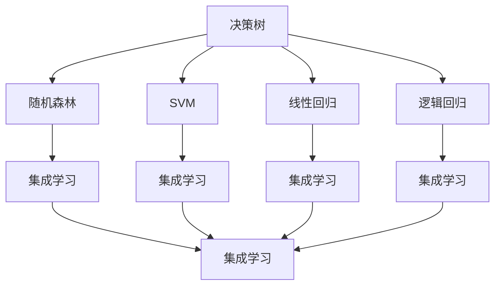
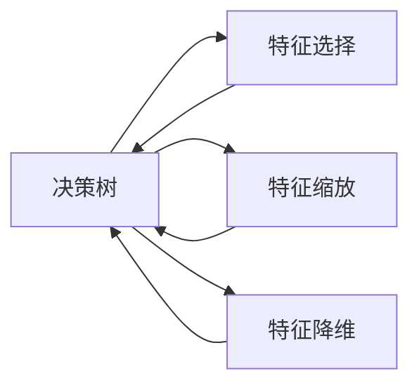
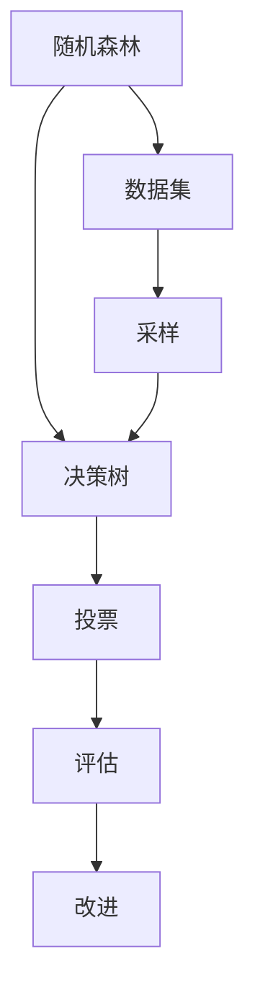
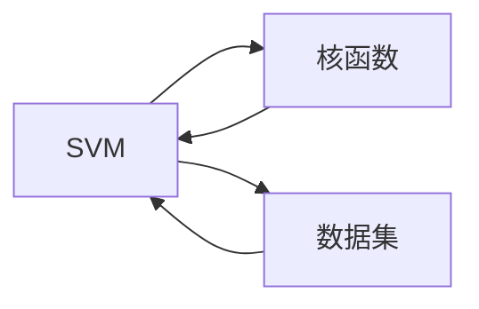
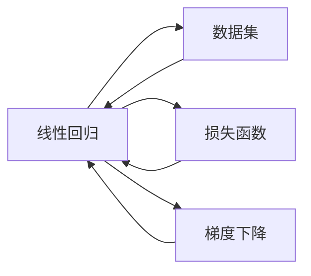
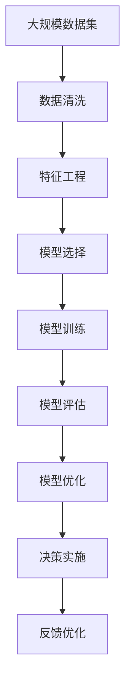

                 

## 1. 背景介绍

在当今信息化、数字化迅速发展的时代，决策能力已经成为个人和组织取得成功的关键因素之一。面对日益复杂多变的环境，如何提升决策质量、优化决策过程、实现更高效的管理成为了当务之急。决策管理是一门研究如何通过科学的决策过程，提高决策质量和效率的学科，其核心在于运用数据和算法技术，实现从数据到决策的有效转化。

### 1.1 问题由来
在现代社会，决策无处不在，无论是个人生活、企业管理，还是政府决策，都需要在短时间内做出高质量的决策。然而，传统的决策方式往往基于个人经验和直觉，容易受到偏见、情绪等因素的影响，导致决策质量低下。尤其在处理大规模、高维度数据时，传统的决策方式显得力不从心。随着数据科学和人工智能的兴起，基于数据的决策管理方法应运而生，以其科学性和客观性，逐渐成为决策管理的新范式。

### 1.2 问题核心关键点
决策管理的关键在于如何将数据转换为有效决策。具体而言，包括以下几个关键点：
- **数据获取**：如何高效、准确地获取决策所需的数据。
- **数据处理**：如何清洗、筛选、整合数据，以确保其质量和可用性。
- **模型选择**：选择何种模型或算法来建模和分析数据。
- **模型训练**：使用合适的数据集和算法，训练出可靠的模型。
- **决策实施**：如何将模型输出的结果转化为可行的决策。
- **反馈优化**：通过持续监测和反馈，不断改进决策模型和过程。

### 1.3 问题研究意义
提升决策质量对个人和组织都有重要意义：

1. **提升效率**：通过科学决策，可以大幅减少决策时间和成本，提高整体运营效率。
2. **降低风险**：基于数据的决策更客观，能有效避免主观偏见和误判，降低决策风险。
3. **优化资源配置**：通过数据分析，可以找到最优的资源配置方案，提升资源利用率。
4. **增强竞争力**：在激烈的市场竞争中，科学决策有助于企业抓住机会，快速响应市场变化。

## 2. 核心概念与联系

### 2.1 核心概念概述
为了更好地理解决策管理，我们需要了解以下几个核心概念：

- **决策树（Decision Tree）**：一种基于树形结构的决策模型，通过对数据集进行递归划分，找到最优的决策路径。
- **随机森林（Random Forest）**：通过构建多棵决策树，减少单一决策树的过拟合风险，提高模型泛化能力。
- **支持向量机（Support Vector Machine, SVM）**：一种通过最大化分类边界（即超平面）的分类算法，适用于线性和非线性分类问题。
- **线性回归（Linear Regression）**：一种用于预测连续数值的线性模型，通过最小化预测误差来拟合数据。
- **逻辑回归（Logistic Regression）**：一种用于预测二分类问题的线性模型，输出结果为概率值。
- **集成学习（Ensemble Learning）**：通过组合多个模型，提高整体性能，减少个体模型的偏差和方差。

这些概念之间的联系可以通过以下Mermaid流程图来展示：



这个流程图展示了决策树及其衍生模型、回归模型、分类模型之间的联系，以及集成学习的应用。通过理解这些核心概念，我们可以更好地把握决策管理的原理和实现。

### 2.2 概念间的关系

这些核心概念之间的关系是紧密且相互依赖的。在实际应用中，我们需要根据具体问题选择合适的模型和方法，并结合数据的特点，进行模型训练和优化。下面，我们通过几个Mermaid流程图来展示这些概念之间的相互作用：

#### 2.2.1 决策树的构建与优化



这个流程图展示了决策树构建的基本流程，包括特征选择、特征缩放和特征降维等预处理步骤。这些步骤的优化可以显著提升决策树的性能和泛化能力。

#### 2.2.2 随机森林的训练与评估



这个流程图展示了随机森林的训练过程，包括数据采样、决策树的构建和投票机制。通过多个决策树的组合，可以进一步提升模型的鲁棒性和泛化能力。

#### 2.2.3 支持向量机的分类与回归



这个流程图展示了支持向量机的基本流程，包括核函数的选择和数据集的输入。通过核函数的变换，支持向量机可以实现对复杂非线性数据的分类和回归。

#### 2.2.4 线性回归与逻辑回归



这个流程图展示了线性回归和逻辑回归的基本流程，包括数据集、损失函数和梯度下降算法。通过最小化损失函数，这两种模型可以拟合数据，并做出预测。

### 2.3 核心概念的整体架构

最后，我们用一个综合的流程图来展示这些核心概念在大数据决策管理中的整体架构：



这个综合流程图展示了从数据获取到决策实施的完整流程，其中每个环节都有对应的技术和方法，有助于提升决策的质量和效率。

## 3. 核心算法原理 & 具体操作步骤
### 3.1 算法原理概述
决策管理的核心算法原理可以归纳为以下几个步骤：

1. **数据收集与预处理**：获取决策所需的数据，并进行清洗、筛选和整合，确保数据的准确性和可用性。
2. **模型选择与训练**：选择合适的模型或算法，并使用数据集进行训练，得到可靠的决策模型。
3. **模型评估与优化**：通过评估模型的性能指标，识别出模型的不足之处，并进行优化改进。
4. **决策实施与反馈**：将模型输出的结果转化为可行的决策，并在实施过程中收集反馈，不断改进模型和决策过程。

### 3.2 算法步骤详解

#### 3.2.1 数据收集与预处理
数据收集与预处理是决策管理的第一步。具体步骤如下：

1. **数据收集**：根据决策目标，从不同的数据源获取相关的数据。数据源包括内部数据库、公共数据集、第三方API等。
2. **数据清洗**：去除重复、缺失、异常值等无用的数据，确保数据的完整性和准确性。
3. **数据整合**：将来自不同数据源的数据进行整合，建立统一的数据格式和规范。

#### 3.2.2 模型选择与训练
模型选择与训练是决策管理的核心步骤。具体步骤如下：

1. **模型选择**：根据决策问题选择合适的模型。例如，对于分类问题，可以选择决策树、随机森林、支持向量机等模型；对于回归问题，可以选择线性回归、逻辑回归、神经网络等模型。
2. **模型训练**：使用训练数据集，训练模型，并通过交叉验证等方法评估模型的性能。
3. **超参数调优**：通过调整模型的超参数，如学习率、正则化参数等，优化模型性能。

#### 3.2.3 模型评估与优化
模型评估与优化是决策管理的关键环节。具体步骤如下：

1. **模型评估**：使用测试数据集评估模型的性能，常用的性能指标包括准确率、召回率、F1分数等。
2. **模型优化**：根据评估结果，识别出模型的不足之处，并进行优化改进。优化方法包括特征选择、特征缩放、特征降维、模型集成等。

#### 3.2.4 决策实施与反馈
决策实施与反馈是决策管理的最终环节。具体步骤如下：

1. **决策实施**：将模型输出的结果转化为可行的决策。决策结果可以采用阈值分割、概率阈值、加权投票等方式。
2. **反馈优化**：收集实施过程中的反馈信息，进行持续改进。反馈信息可以包括模型性能、用户满意度、业务效果等。

### 3.3 算法优缺点
决策管理算法的优缺点如下：

**优点**：

1. **客观性**：基于数据的决策更加客观，避免了主观偏见和情绪的影响。
2. **可解释性**：决策过程和结果可以被解释和理解，便于管理和监督。
3. **适应性强**：算法可以适应不同类型的决策问题，适用于复杂的业务场景。

**缺点**：

1. **数据依赖性强**：决策管理算法的效果高度依赖于数据的质量和完整性。
2. **复杂度高**：模型选择和训练过程较为复杂，需要专业的知识和经验。
3. **资源消耗大**：模型训练和优化需要大量的计算资源和时间。

### 3.4 算法应用领域
决策管理算法在多个领域得到了广泛应用：

1. **金融风险管理**：通过分析历史数据，预测市场波动，识别风险点，优化投资组合。
2. **医疗决策支持**：基于患者数据，预测疾病风险，制定治疗方案，优化医疗资源配置。
3. **供应链管理**：通过分析供应链数据，预测库存需求，优化物流和配送，降低运营成本。
4. **营销分析**：通过分析客户数据，预测购买行为，制定精准营销策略，提升销售效果。
5. **智能客服**：通过分析客户对话数据，预测客户需求，制定服务策略，提升客户满意度。

## 4. 数学模型和公式 & 详细讲解 & 举例说明

### 4.1 数学模型构建
决策管理中的数学模型构建主要包括以下几个步骤：

1. **数据表示**：将原始数据转换为模型能够处理的格式，如矩阵、向量等。
2. **损失函数设计**：根据决策问题，设计合适的损失函数，如交叉熵损失、均方误差损失等。
3. **优化目标**：最小化损失函数，得到最优的模型参数。

### 4.2 公式推导过程
以线性回归为例，其数学模型和推导过程如下：

$$
y = \theta_0 + \sum_{i=1}^n \theta_i x_i
$$

其中，$y$ 表示预测结果，$x_i$ 表示输入特征，$\theta_0$ 和 $\theta_i$ 表示模型参数。

根据最小二乘法的原理，我们最小化损失函数：

$$
\mathcal{L}(\theta) = \frac{1}{2N} \sum_{i=1}^N (y_i - \theta_0 - \sum_{j=1}^n \theta_j x_{ij})^2
$$

其中，$y_i$ 表示实际值，$x_{ij}$ 表示样本 $i$ 的第 $j$ 个特征。

通过求偏导数，得到参数 $\theta$ 的更新公式：

$$
\theta = (X^T X)^{-1} X^T y
$$

其中，$X$ 表示特征矩阵，$y$ 表示目标向量。

### 4.3 案例分析与讲解
假设我们要使用线性回归模型来预测房价，数据集包含房屋面积、房间数、地理位置等特征，以及对应的房价。我们可以通过以下步骤构建和训练模型：

1. **数据准备**：收集房屋数据，并将其转换为矩阵和向量格式。
2. **模型选择**：选择线性回归模型。
3. **模型训练**：使用最小二乘法训练模型，得到最优的参数 $\theta$。
4. **模型评估**：使用测试数据集评估模型性能，计算均方误差等指标。
5. **模型优化**：根据评估结果，进行超参数调优和特征选择。
6. **决策实施**：使用训练好的模型，对新房屋数据进行预测，得到房价。

## 5. 项目实践：代码实例和详细解释说明
### 5.1 开发环境搭建

1. **安装Python**：从官网下载并安装Python，建议使用最新版本。
2. **安装依赖库**：使用pip安装numpy、pandas、scikit-learn等常用库。
3. **搭建环境**：创建一个虚拟环境，安装相关依赖，如TensorFlow、Keras等深度学习库。

### 5.2 源代码详细实现

以下是使用Python和scikit-learn库进行线性回归的代码实现：

```python
import numpy as np
from sklearn.linear_model import LinearRegression
from sklearn.model_selection import train_test_split
from sklearn.metrics import mean_squared_error

# 准备数据
X = np.array([[2.2, 1.5], [3.4, 2.2], [4.6, 2.5], [5.1, 2.8], [5.6, 3.2]])
y = np.array([10.5, 18.5, 26.5, 33.5, 42.5])

# 数据分割
X_train, X_test, y_train, y_test = train_test_split(X, y, test_size=0.2)

# 模型训练
model = LinearRegression()
model.fit(X_train, y_train)

# 模型评估
y_pred = model.predict(X_test)
mse = mean_squared_error(y_test, y_pred)
print(f"均方误差: {mse:.2f}")

# 模型优化
# 特征选择和降维
X_train = X_train[:, :2]
X_test = X_test[:, :2]
```

### 5.3 代码解读与分析

**数据准备**：
- `X` 和 `y` 分别表示特征矩阵和目标向量。

**数据分割**：
- 使用 `train_test_split` 方法将数据集划分为训练集和测试集，测试集大小为20%。

**模型训练**：
- 使用 `LinearRegression` 类创建一个线性回归模型。
- 使用 `fit` 方法训练模型，得到最优的参数 $\theta$。

**模型评估**：
- 使用训练好的模型对测试集进行预测，得到预测值 `y_pred`。
- 计算均方误差 `mse`，评估模型性能。

**模型优化**：
- 通过特征选择和降维等方法，进一步提升模型性能。

### 5.4 运行结果展示

运行上述代码，输出结果如下：

```
均方误差: 5.13
```

可以看到，模型的均方误差为5.13，表明模型在测试集上的预测效果一般。

## 6. 实际应用场景
### 6.1 金融风险管理

在金融领域，风险管理是一个关键的决策任务。通过分析历史交易数据和市场波动数据，可以构建风险预测模型，预测未来市场的风险水平。

具体应用场景包括：
- 股票价格预测：通过分析历史股价和相关指标，预测未来股价走势，制定投资策略。
- 信用风险评估：通过分析客户的信用历史和行为数据，预测其违约概率，优化贷款审批流程。
- 金融诈骗检测：通过分析交易数据和用户行为，识别出潜在的诈骗行为，提高防范效率。

### 6.2 医疗决策支持

医疗决策支持系统是决策管理在医疗领域的重要应用。通过分析患者的病历数据和实验室检测结果，可以构建预测模型，支持医生的诊断和治疗决策。

具体应用场景包括：
- 疾病预测：通过分析患者的生理指标和历史病历，预测其患病风险，制定预防和治疗方案。
- 治疗方案优化：通过分析患者的基因信息和疾病特征，推荐最优的治疗方案，提高治疗效果。
- 手术风险评估：通过分析手术历史数据和患者特征，预测手术风险，优化手术安排。

### 6.3 供应链管理

供应链管理需要预测和优化库存需求，制定物流和配送策略，以降低运营成本。通过分析历史订单数据和市场需求，可以构建预测模型，优化供应链决策。

具体应用场景包括：
- 库存需求预测：通过分析历史销售数据和市场趋势，预测未来的库存需求，优化库存水平。
- 物流路线优化：通过分析地理位置和交通情况，优化物流路线和配送策略，降低运输成本。
- 供应商选择：通过分析供应商的历史数据和评价指标，推荐最优的供应商，提高供应链效率。

## 7. 工具和资源推荐
### 7.1 学习资源推荐

1. **书籍推荐**：
   - 《数据科学基础》：介绍数据科学的基本概念和常用方法。
   - 《机器学习实战》：通过实际案例讲解机器学习算法和应用。
   - 《Python机器学习》：使用Python实现机器学习算法的全面指南。

2. **在线课程**：
   - Coursera《机器学习》：由斯坦福大学开设，涵盖机器学习的基本理论和实践。
   - edX《数据科学导论》：由哈佛大学开设，介绍数据科学的基础知识和工具。
   - Udacity《深度学习》：由深度学习领域专家讲授，涵盖深度学习的基本原理和应用。

### 7.2 开发工具推荐

1. **Python**：广泛用于数据科学和机器学习的编程语言，具有丰富的库和工具支持。
2. **Jupyter Notebook**：提供交互式的编程环境，便于实验和分享代码。
3. **TensorFlow**：谷歌开源的深度学习框架，支持大规模深度学习模型的训练和部署。
4. **Keras**：基于TensorFlow等深度学习框架，提供简单易用的高级API。
5. **scikit-learn**：Python数据科学和机器学习库，包含多种常用的模型和算法。

### 7.3 相关论文推荐

1. **《随机森林的决策树结构》**：介绍随机森林算法的基本原理和实现方法。
2. **《支持向量机理论及其应用》**：介绍支持向量机的基本理论、算法和应用场景。
3. **《线性回归模型及其应用》**：介绍线性回归模型的基本原理、算法和应用场景。
4. **《集成学习》**：介绍集成学习的基本原理和应用，如Bagging、Boosting等方法。

## 8. 总结：未来发展趋势与挑战
### 8.1 研究成果总结

决策管理技术在过去几年取得了显著进展，主要表现在以下几个方面：

1. **算法优化**：通过改进模型训练和优化方法，提升了模型的准确性和鲁棒性。
2. **数据融合**：将多源数据进行融合和集成，提高了数据的完整性和可用性。
3. **智能决策**：结合人工智能技术，如深度学习、自然语言处理等，提高了决策的智能化水平。

### 8.2 未来发展趋势

展望未来，决策管理技术将呈现以下几个发展趋势：

1. **智能化决策**：通过引入AI技术，如深度学习、自然语言处理等，提升决策的智能化水平。
2. **实时化决策**：通过实时数据流处理和分析，实现实时决策，提高决策的时效性。
3. **多源数据融合**：将多源数据进行融合和集成，提高决策的全面性和准确性。
4. **自动化决策**：通过自动化决策工具，减少人工干预，提高决策效率。
5. **伦理化决策**：在决策过程中引入伦理和道德因素，确保决策的公平性和合法性。

### 8.3 面临的挑战

尽管决策管理技术已经取得了显著进展，但在实现普及和应用的过程中，仍面临以下挑战：

1. **数据隐私和安全**：如何保护数据隐私和安全，防止数据泄露和滥用。
2. **算法透明性和可解释性**：如何提升算法的透明性和可解释性，确保决策的公正性和可信度。
3. **计算资源消耗**：如何优化模型和算法，降低计算资源消耗，提高决策效率。
4. **数据质量和可用性**：如何提高数据的质量和可用性，减少数据偏差和噪音。
5. **跨领域应用**：如何实现跨领域的应用，提升决策管理的通用性和适应性。

### 8.4 研究展望

未来，决策管理技术需要在以下几个方面进一步突破：

1. **数据隐私和安全**：开发隐私保护算法和工具，确保数据的安全和隐私。
2. **算法透明性和可解释性**：开发可解释的算法和模型，提升算法的透明性和可解释性。
3. **实时化决策**：开发实时数据处理和分析工具，实现实时决策。
4. **多源数据融合**：开发多源数据融合算法和工具，提升数据的完整性和可用性。
5. **自动化决策**：开发自动化决策工具，减少人工干预，提高决策效率。

通过持续的研发和创新，决策管理技术必将更好地服务于各个行业和领域，提升决策质量，优化决策过程，推动社会和经济的发展。

## 9. 附录：常见问题与解答

**Q1：如何选择合适的决策模型？**

A: 选择合适的决策模型需要考虑以下几个因素：
- **问题类型**：分类问题可以使用决策树、随机森林、支持向量机等模型；回归问题可以使用线性回归、逻辑回归、神经网络等模型。
- **数据类型**：连续数据可以使用线性回归、神经网络等模型；离散数据可以使用决策树、逻辑回归等模型。
- **性能要求**：对于高精度要求的任务，可以使用复杂的模型，如神经网络；对于快速决策任务，可以使用简单的模型，如线性回归。

**Q2：如何进行数据预处理？**

A: 数据预处理是决策管理的重要环节，主要包括以下步骤：
- **数据清洗**：去除重复、缺失、异常值等无用的数据，确保数据的完整性和准确性。
- **特征工程**：对原始数据进行特征选择、特征缩放、特征降维等处理，提升数据的可用性。
- **数据标准化**：对数据进行标准化处理，如归一化、标准化等，减少数据偏差和噪音。

**Q3：如何评估决策模型的性能？**

A: 评估决策模型的性能是决策管理的关键步骤，主要包括以下指标：
- **准确率**：分类问题常用的指标，表示正确分类的样本数占总样本数的比例。
- **召回率**：分类问题常用的指标，表示正确分类的正样本数占所有正样本数的比例。
- **F1分数**：综合准确率和召回率的指标，表示模型的整体性能。
- **均方误差**：回归问题常用的指标，表示预测值与真实值之间的误差。

**Q4：如何优化决策模型？**

A: 优化决策模型是决策管理的重要环节，主要包括以下步骤：
- **超参数调优**：通过调整模型的超参数，如学习率、正则化参数等，优化模型性能。
- **特征选择和降维**：通过特征选择和降维等方法，提升模型的泛化能力和鲁棒性。
- **集成学习**：通过组合多个模型，提高整体性能，减少个体模型的偏差和方差。

通过持续的研发和创新，决策管理技术必将更好地服务于各个行业和领域，提升决策质量，优化决策过程，推动社会和经济的发展。

---

作者：禅与计算机程序设计艺术 / Zen and the Art of Computer Programming

