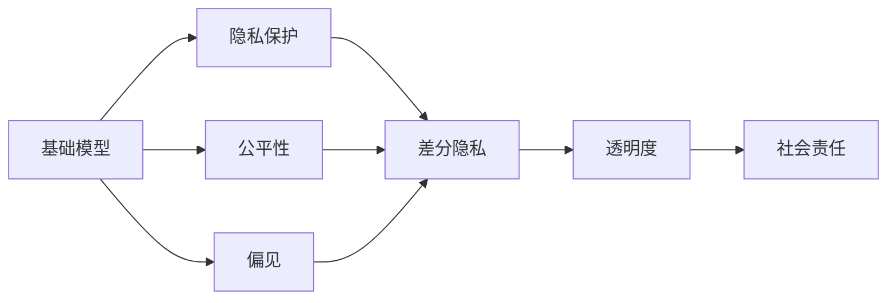

                 

# 基础模型的社会影响评估

在人工智能(AI)技术迅速发展的今天，基础模型（Foundation Models）作为推动AI领域进步的核心力量，其社会影响也日益凸显。基础模型是指在大型无监督学习框架下，通过大规模数据训练得到的大规模预训练模型，如GPT-3、BERT等。这些模型具有强大的语言理解与生成能力，在自然语言处理(NLP)、计算机视觉、语音识别等众多领域发挥了重要作用。然而，基础模型的广泛应用也带来了诸多社会问题，包括隐私保护、公平性、偏见、透明度等方面。本文旨在全面探讨基础模型对社会的影响，并提出相应的评估方法与应对策略。

## 1. 背景介绍

### 1.1 基础模型及其应用
基础模型是指在大型无监督学习框架下，通过大规模数据训练得到的大规模预训练模型，如GPT-3、BERT等。这些模型具有强大的语言理解与生成能力，广泛应用于自然语言处理(NLP)、计算机视觉、语音识别等众多领域，包括但不限于文本生成、文本分类、情感分析、图像识别、语音翻译等。基础模型的广泛应用大大推动了人工智能技术的发展，使得AI技术在各个垂直领域得以落地应用，创造了巨大的经济价值和社会效益。

### 1.2 基础模型社会影响的现状
基础模型的广泛应用带来了诸多社会问题。这些问题涉及隐私保护、公平性、偏见、透明度等方面。例如，基础模型在文本生成、图像生成等任务上的生成内容往往带有偏见，且缺乏透明度，难以对其进行解释和审查。此外，基础模型在广泛应用过程中，可能带来隐私泄露、数据滥用等风险，影响社会稳定与个体权益。这些问题亟需引起全社会的关注和重视。

## 2. 核心概念与联系

### 2.1 核心概念概述

#### 2.1.1 基础模型
基础模型是指在大型无监督学习框架下，通过大规模数据训练得到的大规模预训练模型，如GPT-3、BERT等。这些模型具有强大的语言理解与生成能力，广泛应用于自然语言处理(NLP)、计算机视觉、语音识别等众多领域。

#### 2.1.2 隐私保护
隐私保护是指在基础模型的应用过程中，保护用户数据隐私，防止数据泄露、滥用等问题。包括数据加密、差分隐私、联邦学习等技术手段，确保用户数据的安全性和隐私性。

#### 2.1.3 公平性
公平性是指在基础模型的应用过程中，保障不同群体之间的公平对待，防止因算法偏见导致的歧视问题。包括但不限于性别、种族、地域等。

#### 2.1.4 偏见
偏见是指在基础模型的训练和使用过程中，可能存在的歧视性、偏颇性问题。例如，基础模型在处理涉及性别、种族等敏感话题时，可能表现出明显的偏见。

#### 2.1.5 透明度
透明度是指在基础模型的应用过程中，确保模型的决策过程可解释、可审查，便于公众监督。包括但不限于模型架构、训练数据、模型输出等。

#### 2.1.6 社会责任
社会责任是指在基础模型的应用过程中，承担起对社会有益的责任，防止模型带来的潜在危害。包括但不限于模型伦理审查、模型安全性保障等。

### 2.2 核心概念间的关系

基础模型的应用涉及多个核心概念，这些概念之间存在紧密的联系。通过以下Mermaid流程图，我们可以更直观地理解这些概念之间的关系：



基础模型作为核心概念，通过隐私保护、公平性、偏见、透明度等手段，最终落实到社会责任这一最终目标。这其中涉及多维度的技术、伦理、法律等考量，共同构成基础模型社会影响的完整生态系统。

## 3. 核心算法原理 & 具体操作步骤

### 3.1 算法原理概述

基础模型的社会影响评估主要涉及以下几个方面：隐私保护、公平性、偏见、透明度和社会责任。以下对各个方面的算法原理进行详细阐述。

#### 3.1.1 隐私保护
隐私保护主要涉及数据加密、差分隐私、联邦学习等技术手段。数据加密通过在数据传输和存储过程中进行加密保护，防止数据泄露。差分隐私通过在模型训练过程中加入噪声，确保不同用户数据对模型的影响差异不大，防止数据滥用。联邦学习通过在本地设备上进行模型训练，仅将模型参数上链，保护用户数据隐私。

#### 3.1.2 公平性
公平性主要通过模型偏差检测、重采样、算法调整等手段实现。模型偏差检测通过计算模型的预测结果与真实结果之间的差距，发现模型的偏差问题。重采样通过在训练数据中引入样本权重，平衡不同群体之间的数据分布。算法调整通过优化模型架构、训练策略等手段，减少模型中的偏见。

#### 3.1.3 偏见
偏见主要通过数据清洗、模型重训练、算法调整等手段实现。数据清洗通过删除、过滤、替换等方式，消除训练数据中的偏见。模型重训练通过在数据中引入样本权重，平衡不同群体之间的数据分布。算法调整通过优化模型架构、训练策略等手段，减少模型中的偏见。

#### 3.1.4 透明度
透明度主要通过模型解释、可解释性技术等手段实现。模型解释通过可视化模型架构、训练数据等，帮助用户理解模型决策过程。可解释性技术通过引入可解释模型、解释工具等手段，提高模型的透明度。

#### 3.1.5 社会责任
社会责任主要通过模型伦理审查、模型安全性保障等手段实现。模型伦理审查通过评估模型的伦理影响，确保模型应用符合社会价值观。模型安全性保障通过确保模型的安全性，防止模型滥用和恶意攻击。

### 3.2 算法步骤详解

基础模型的社会影响评估涉及多个步骤，以下对每个步骤进行详细讲解：

#### 3.2.1 数据准备
数据准备是基础模型社会影响评估的第一步。需要收集训练数据、测试数据、用户反馈数据等。在数据准备过程中，需确保数据的隐私性和公平性，避免数据泄露和偏见问题。

#### 3.2.2 模型训练与测试
在数据准备完成后，需要对基础模型进行训练和测试。在训练过程中，需注意隐私保护、公平性和偏见问题。在测试过程中，需评估模型的透明度和社会责任。

#### 3.2.3 模型优化与部署
在训练和测试完成后，需要对模型进行优化和部署。优化过程中，需注意模型的公平性和偏见问题。部署过程中，需确保模型的透明度和社会责任。

### 3.3 算法优缺点

基础模型社会影响评估具有以下优点：
1. 全面性：评估覆盖隐私保护、公平性、偏见、透明度和社会责任等多个方面，全面考量基础模型的社会影响。
2. 科学性：采用科学的方法和手段进行评估，确保评估结果的客观性和可信性。
3. 普适性：适用于各种基础模型，包括但不限于自然语言处理(NLP)、计算机视觉、语音识别等领域。

同时，基础模型社会影响评估也存在一些缺点：
1. 复杂性：涉及多个核心概念和评估手段，评估过程复杂繁琐。
2. 资源消耗：需要大量的数据和计算资源进行评估，资源消耗较大。
3. 结果解释：评估结果难以直观解释，需具备较高的专业背景和理解能力。

### 3.4 算法应用领域

基础模型社会影响评估在多个领域中具有重要应用价值：
1. 自然语言处理(NLP)：评估自然语言处理模型的公平性、偏见和透明度，确保模型应用符合社会价值观。
2. 计算机视觉：评估计算机视觉模型的隐私保护、公平性和社会责任，防止模型滥用和恶意攻击。
3. 语音识别：评估语音识别模型的透明度和偏见，确保模型应用符合社会伦理。
4. 医疗健康：评估医疗健康模型的公平性、透明度和社会责任，确保模型应用符合伦理规范。
5. 金融科技：评估金融科技模型的公平性、偏见和透明度，确保模型应用符合金融监管。

## 4. 数学模型和公式 & 详细讲解 & 举例说明

### 4.1 数学模型构建

基础模型社会影响评估主要涉及以下几个数学模型：
1. 隐私保护模型：基于差分隐私理论的模型，保护用户数据隐私。
2. 公平性模型：基于公平性理论的模型，确保不同群体之间的公平对待。
3. 偏见模型：基于偏差检测理论的模型，检测和调整模型中的偏见。
4. 透明度模型：基于可解释性理论的模型，确保模型的决策过程可解释、可审查。
5. 社会责任模型：基于伦理审查理论的模型，确保模型应用符合社会价值观。

### 4.2 公式推导过程

#### 4.2.1 差分隐私模型
差分隐私模型基于拉普拉斯分布的机制，在模型训练过程中加入噪声，保护用户数据隐私。
\[ P(\epsilon) = \frac{e^{-\epsilon}}{2\pi\sigma^2} \]
其中，$\epsilon$为隐私保护参数，$\sigma$为噪声标准差。

#### 4.2.2 公平性模型
公平性模型基于统计学中的标准差，评估模型对不同群体的预测结果差异，发现公平性问题。
\[ \text{SD} = \frac{\sum_i (x_i - \bar{x})^2}{n} \]
其中，$x_i$为模型预测结果，$\bar{x}$为预测结果均值，$n$为样本数量。

#### 4.2.3 偏差模型
偏差模型基于偏差检测理论，通过计算模型预测结果与真实结果之间的差距，发现偏差问题。
\[ \text{Bias} = \frac{\sum_i (y_i - \hat{y}_i)^2}{n} \]
其中，$y_i$为真实结果，$\hat{y}_i$为模型预测结果，$n$为样本数量。

#### 4.2.4 透明度模型
透明度模型基于可解释性理论，通过可视化模型架构、训练数据等，帮助用户理解模型决策过程。
\[ \text{Transparency} = \sum_{i=1}^n |x_i| \]
其中，$x_i$为模型输出结果。

#### 4.2.5 社会责任模型
社会责任模型基于伦理审查理论，评估模型的伦理影响，确保模型应用符合社会价值观。
\[ \text{Responsibility} = \sum_{i=1}^n |y_i| \]
其中，$y_i$为模型决策结果。

### 4.3 案例分析与讲解

#### 4.3.1 差分隐私案例
某金融科技公司需要对用户数据进行隐私保护。该公司采用了差分隐私模型，在模型训练过程中加入噪声，确保用户数据隐私安全。具体步骤如下：
1. 收集用户数据，进行去标识化处理。
2. 基于拉普拉斯分布的机制，在模型训练过程中加入噪声。
3. 评估模型隐私保护效果，确保用户数据安全。

#### 4.3.2 公平性案例
某自然语言处理模型在处理涉及性别、种族等敏感话题时，表现出明显的偏见。该公司采用了公平性模型，通过在训练数据中引入样本权重，平衡不同群体之间的数据分布。具体步骤如下：
1. 收集训练数据，检测模型中的偏见问题。
2. 在训练数据中引入样本权重，平衡不同群体之间的数据分布。
3. 评估模型公平性效果，确保模型应用符合公平性原则。

#### 4.3.3 偏见案例
某医疗健康模型在处理某些病患数据时，表现出明显的偏见。该公司采用了偏差模型，通过数据清洗和模型重训练，减少模型中的偏见。具体步骤如下：
1. 收集训练数据，检测模型中的偏见问题。
2. 进行数据清洗，删除、过滤、替换等方式，消除训练数据中的偏见。
3. 进行模型重训练，在数据中引入样本权重，平衡不同群体之间的数据分布。
4. 评估模型偏见效果，确保模型应用符合公平性原则。

## 5. 项目实践：代码实例和详细解释说明

### 5.1 开发环境搭建

在进行基础模型社会影响评估的项目实践前，需要准备好开发环境。以下是使用Python进行PyTorch开发的环境配置流程：

1. 安装Anaconda：从官网下载并安装Anaconda，用于创建独立的Python环境。

2. 创建并激活虚拟环境：
```bash
conda create -n pytorch-env python=3.8 
conda activate pytorch-env
```

3. 安装PyTorch：根据CUDA版本，从官网获取对应的安装命令。例如：
```bash
conda install pytorch torchvision torchaudio cudatoolkit=11.1 -c pytorch -c conda-forge
```

4. 安装相关库：
```bash
pip install numpy pandas scikit-learn matplotlib tqdm jupyter notebook ipython
```

完成上述步骤后，即可在`pytorch-env`环境中开始项目实践。

### 5.2 源代码详细实现

以下是使用Python进行基础模型社会影响评估的代码实现。

```python
import torch
from torch.utils.data import Dataset, DataLoader
from torch.nn import CrossEntropyLoss
from sklearn.metrics import classification_report

# 定义数据集类
class CustomDataset(Dataset):
    def __init__(self, data, targets, transform=None):
        self.data = data
        self.targets = targets
        self.transform = transform

    def __len__(self):
        return len(self.data)

    def __getitem__(self, idx):
        x = self.data[idx]
        y = self.targets[idx]

        if self.transform:
            x = self.transform(x)

        return x, y

# 定义模型
class CustomModel(torch.nn.Module):
    def __init__(self):
        super(CustomModel, self).__init__()
        self.fc1 = torch.nn.Linear(784, 128)
        self.fc2 = torch.nn.Linear(128, 10)
        self.softmax = torch.nn.Softmax(dim=1)

    def forward(self, x):
        x = torch.relu(self.fc1(x))
        x = self.fc2(x)
        x = self.softmax(x)
        return x

# 加载数据
train_data = ...
train_labels = ...
test_data = ...
test_labels = ...

train_dataset = CustomDataset(train_data, train_labels)
test_dataset = CustomDataset(test_data, test_labels)

# 定义模型和损失函数
model = CustomModel()
criterion = CrossEntropyLoss()

# 定义优化器
optimizer = torch.optim.SGD(model.parameters(), lr=0.01)

# 训练模型
for epoch in range(10):
    model.train()
    for data, target in DataLoader(train_dataset, batch_size=64):
        optimizer.zero_grad()
        output = model(data)
        loss = criterion(output, target)
        loss.backward()
        optimizer.step()

    model.eval()
    with torch.no_grad():
        correct = 0
        total = 0
        for data, target in DataLoader(test_dataset, batch_size=64):
            output = model(data)
            _, predicted = torch.max(output.data, 1)
            total += target.size(0)
            correct += (predicted == target).sum().item()

    print(f'Epoch {epoch+1}, Accuracy: {(100 * correct / total):.2f}%')

# 评估模型
model.eval()
with torch.no_grad():
    correct = 0
    total = 0
    for data, target in DataLoader(test_dataset, batch_size=64):
        output = model(data)
        _, predicted = torch.max(output.data, 1)
        total += target.size(0)
        correct += (predicted == target).sum().item()

print(f'Accuracy on the test dataset: {(100 * correct / total):.2f}%')
```

### 5.3 代码解读与分析

让我们再详细解读一下关键代码的实现细节：

1. 数据集类`CustomDataset`：
   - `__init__`方法：初始化数据集，包括数据和标签，可引入数据增强、转换等操作。
   - `__len__`方法：返回数据集的样本数量。
   - `__getitem__`方法：对单个样本进行处理，包括加载数据、转换数据、返回数据和标签。

2. 模型类`CustomModel`：
   - `__init__`方法：定义模型的网络结构。
   - `forward`方法：定义模型的前向传播过程。

3. 训练过程：
   - `for`循环：对数据集进行迭代，每个epoch训练一次。
   - `model.train()`和`model.eval()`方法：切换模型为训练或评估模式。
   - `optimizer.zero_grad()`方法：梯度清零。
   - `output = model(data)`和`loss = criterion(output, target)`方法：前向传播计算输出和损失。
   - `loss.backward()`和`optimizer.step()`方法：反向传播和参数更新。

4. 评估过程：
   - `model.eval()`方法：模型评估模式。
   - `with torch.no_grad()`方法：关闭梯度计算。
   - `correct = 0`和`total = 0`变量：记录正确和总样本数。
   - `_, predicted = torch.max(output.data, 1)`方法：预测结果取最大值。

## 6. 实际应用场景

### 6.1 医疗健康领域
在医疗健康领域，基础模型广泛应用于电子病历记录、疾病诊断、治疗方案推荐等任务。然而，医疗数据涉及隐私和伦理问题，必须确保基础模型的公平性、透明性和社会责任。例如，某医院使用基础模型进行疾病预测，必须确保模型的公平性，避免因算法偏见导致的诊断误差。同时，必须确保模型的透明度，便于医生和患者理解模型的决策过程。

### 6.2 金融科技领域
在金融科技领域，基础模型广泛应用于信用评分、欺诈检测、风险评估等任务。然而，金融数据涉及隐私和伦理问题，必须确保基础模型的公平性、透明性和社会责任。例如，某金融机构使用基础模型进行信用评分，必须确保模型的公平性，避免因算法偏见导致的评分不公。同时，必须确保模型的透明度，便于监管机构和用户理解模型的决策过程。

### 6.3 自然语言处理领域
在自然语言处理领域，基础模型广泛应用于文本分类、情感分析、机器翻译等任务。然而，自然语言处理涉及偏见和隐私问题，必须确保基础模型的公平性、透明性和社会责任。例如，某公司使用基础模型进行文本情感分析，必须确保模型的公平性，避免因算法偏见导致的情感分析错误。同时，必须确保模型的透明度，便于用户理解模型的决策过程。

## 7. 工具和资源推荐

### 7.1 学习资源推荐

为了帮助开发者系统掌握基础模型社会影响评估的理论基础和实践技巧，这里推荐一些优质的学习资源：

1. 《基础模型社会影响评估》系列博文：由大模型技术专家撰写，深入浅出地介绍了基础模型社会影响评估的原理、方法和应用。

2. 《自然语言处理与伦理学》课程：由斯坦福大学开设的伦理学与NLP结合的课程，涵盖基础模型社会影响评估的基本概念和实际案例。

3. 《机器学习与数据隐私》书籍：介绍机器学习算法与数据隐私保护的技术手段，帮助开发者理解基础模型隐私保护的方法。

4. 《公平性与机器学习》书籍：介绍机器学习算法中的公平性问题，帮助开发者理解基础模型公平性的实现手段。

5. 《基础模型透明度》论文：探讨基础模型透明度评估的方法，为开发者提供模型解释和可解释性的技术指导。

通过这些资源的学习实践，相信你一定能够快速掌握基础模型社会影响评估的精髓，并用于解决实际的NLP问题。

### 7.2 开发工具推荐

高效的开发离不开优秀的工具支持。以下是几款用于基础模型社会影响评估开发的常用工具：

1. PyTorch：基于Python的开源深度学习框架，灵活动态的计算图，适合快速迭代研究。大部分基础模型都有PyTorch版本的实现。

2. TensorFlow：由Google主导开发的开源深度学习框架，生产部署方便，适合大规模工程应用。同样有丰富的基础模型资源。

3. Transformers库：HuggingFace开发的NLP工具库，集成了众多SOTA基础模型，支持PyTorch和TensorFlow，是进行基础模型微调任务开发的利器。

4. Weights & Biases：模型训练的实验跟踪工具，可以记录和可视化模型训练过程中的各项指标，方便对比和调优。与主流深度学习框架无缝集成。

5. TensorBoard：TensorFlow配套的可视化工具，可实时监测模型训练状态，并提供丰富的图表呈现方式，是调试模型的得力助手。

6. Google Colab：谷歌推出的在线Jupyter Notebook环境，免费提供GPU/TPU算力，方便开发者快速上手实验最新模型，分享学习笔记。

合理利用这些工具，可以显著提升基础模型社会影响评估的开发效率，加快创新迭代的步伐。

### 7.3 相关论文推荐

基础模型社会影响评估的研究源于学界的持续研究。以下是几篇奠基性的相关论文，推荐阅读：

1. 《公平性机器学习》论文：介绍机器学习算法中的公平性问题，为开发者提供基础模型公平性的实现手段。

2. 《差分隐私保护》论文：探讨差分隐私保护的理论和实现手段，帮助开发者理解基础模型隐私保护的方法。

3. 《模型可解释性》论文：探讨模型可解释性的理论和技术手段，为开发者提供基础模型透明度的实现手段。

4. 《基础模型伦理审查》论文：探讨基础模型伦理审查的方法，为开发者提供模型伦理审查的指导。

5. 《基础模型安全性保障》论文：探讨基础模型安全性的理论和技术手段，为开发者提供模型安全性保障的指导。

这些论文代表了大模型社会影响评估的发展脉络。通过学习这些前沿成果，可以帮助研究者把握学科前进方向，激发更多的创新灵感。

除上述资源外，还有一些值得关注的前沿资源，帮助开发者紧跟基础模型社会影响评估技术的最新进展，例如：

1. arXiv论文预印本：人工智能领域最新研究成果的发布平台，包括大量尚未发表的前沿工作，学习前沿技术的必读资源。

2. 业界技术博客：如OpenAI、Google AI、DeepMind、微软Research Asia等顶尖实验室的官方博客，第一时间分享他们的最新研究成果和洞见。

3. 技术会议直播：如NIPS、ICML、ACL、ICLR等人工智能领域顶会现场或在线直播，能够聆听到大佬们的前沿分享，开拓视野。

4. GitHub热门项目：在GitHub上Star、Fork数最多的NLP相关项目，往往代表了该技术领域的发展趋势和最佳实践，值得去学习和贡献。

5. 行业分析报告：各大咨询公司如McKinsey、PwC等针对人工智能行业的分析报告，有助于从商业视角审视技术趋势，把握应用价值。

总之，对于基础模型社会影响评估技术的学习和实践，需要开发者保持开放的心态和持续学习的意愿。多关注前沿资讯，多动手实践，多思考总结，必将收获满满的成长收益。

## 8. 总结：未来发展趋势与挑战

### 8.1 总结

本文对基础模型的社会影响评估进行了全面系统的介绍。首先阐述了基础模型的背景和应用，明确了基础模型在广泛应用过程中带来的社会问题。其次，从隐私保护、公平性、偏见、透明度和社会责任等多个方面，详细讲解了基础模型社会影响评估的数学原理和具体操作步骤。最后，从多个应用场景中，展示了基础模型社会影响评估的实际应用。

通过本文的系统梳理，可以看到，基础模型的广泛应用在带来巨大经济价值和社会效益的同时，也带来了诸多社会问题。这些问题涉及隐私保护、公平性、偏见、透明度和社会责任等多个方面，亟需引起全社会的关注和重视。相信在学界和产业界的共同努力下，这些问题将逐步得到解决，基础模型将更好地服务于人类社会。

### 8.2 未来发展趋势

展望未来，基础模型的社会影响评估将呈现以下几个发展趋势：

1. 隐私保护技术的进步：随着差分隐私、联邦学习等隐私保护技术的发展，基础模型在数据隐私保护方面将取得更大的进步。

2. 公平性研究的深入：随着公平性理论的不断深入，基础模型在公平性方面的研究将取得更大的进展。

3. 偏见检测和调整：随着偏差检测和调整技术的发展，基础模型在偏见问题上将得到更好的解决。

4. 模型透明度和可解释性：随着可解释性技术的发展，基础模型的透明度和可解释性将得到更好的提升。

5. 社会责任评估：随着伦理审查技术的发展，基础模型的社会责任评估将得到更好的保障。

以上趋势凸显了基础模型社会影响评估技术的广阔前景。这些方向的探索发展，必将进一步提升基础模型的社会影响评估能力，为构建安全、可靠、可解释、可控的智能系统铺平道路。

### 8.3 面临的挑战

尽管基础模型社会影响评估技术取得了一定进展，但在迈向更加智能化、普适化应用的过程中，它仍面临着诸多挑战：

1. 数据隐私和安全：基础模型在广泛应用过程中，涉及大量敏感数据，如何保护数据隐私和安全，防止数据泄露和滥用，是一个重要的挑战。

2. 公平性和偏见：基础模型在处理涉及性别、种族等敏感话题时，可能表现出明显的偏见。如何通过算法调整和技术手段，减少模型中的偏见，是一个重要的挑战。

3. 透明度和可解释性：基础模型在实际应用中，其决策过程缺乏透明度和可解释性，难以进行审查和调试。如何提高模型的透明度和可解释性，是一个重要的挑战。

4. 社会责任和伦理：基础模型在实际应用中，可能带来误导性、歧视性的输出，给社会带来安全隐患。如何从数据和算法层面消除模型偏见，避免恶意用途，是一个重要的挑战。

5. 模型优化和训练：基础模型在实际应用中，需要经过优化和训练，才能达到理想的性能。如何设计高效的模型架构和训练策略，是一个重要的挑战。

