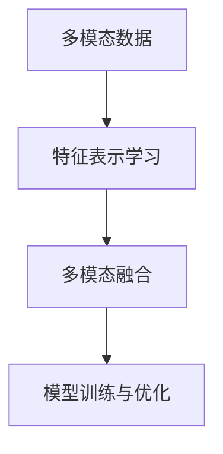

                 

# 多模态大模型：技术原理与实战 在LLM时代，对软件研发的更多思考

在人工智能的浪潮下，多模态大模型成为了新的前沿方向。本文将深入探讨多模态大模型的技术原理与实战，剖析在LLM时代下软件研发的新思考和新挑战。

## 1. 背景介绍

### 1.1 问题由来

近年来，随着深度学习技术的飞速发展，多模态大模型在多个领域取得了突破性进展。相较于传统的单一模态模型，多模态模型能够融合多种数据类型（如文本、图像、音频），提升模型的泛化能力和理解力。然而，多模态模型的设计和实现复杂性极高，需要协调多模态数据的处理和融合，这对软件研发提出了更高的要求。

### 1.2 问题核心关键点

多模态大模型结合了多种模态数据，其核心技术包括：

- 多模态数据预处理与融合：包括文本向量的生成、图像的特征提取、音频的声谱图处理等。
- 多模态特征表示学习：通过神经网络架构，将不同模态的特征向量映射到统一的语义空间。
- 多模态数据对齐与匹配：处理不同模态数据之间的关联和映射，提升模型的一致性和准确性。
- 多模态模型的训练与优化：设计合理的损失函数和训练策略，最大化模型性能。

这些核心技术共同构成了多模态大模型的技术框架，并广泛应用于医疗、安防、智能驾驶等多个领域。

### 1.3 问题研究意义

多模态大模型通过融合多种数据类型，显著提升了模型在复杂场景下的理解力和准确性，为各类应用场景带来了革命性的变化。其研究意义体现在：

1. **提升数据利用效率**：多模态模型能够更全面地利用和分析海量数据，挖掘数据的深层次信息。
2. **拓展应用场景**：融合多种数据模态，显著拓宽了模型在医疗、安防等领域的适用性。
3. **增强决策能力**：多模态模型综合多种数据，提供了更加全面、可靠的决策支持。
4. **推动行业转型**：多模态技术的应用将加速各行各业的数字化转型和智能化升级。

## 2. 核心概念与联系

### 2.1 核心概念概述

多模态大模型的核心概念主要包括：

- **多模态数据**：包括文本、图像、音频等多种数据类型。
- **特征表示学习**：将不同模态的数据映射到统一的语义空间。
- **多模态融合**：通过神经网络结构，融合不同模态的特征表示。
- **模型训练与优化**：包括数据预处理、损失函数设计、梯度优化等。

### 2.2 概念间的关系

多模态大模型的构建涉及多个核心概念，它们之间存在紧密的联系。以下通过Mermaid流程图展示它们的关系：



这个流程图展示了多模态大模型的构建过程，从多模态数据的预处理，到特征表示学习，再到多模态融合和模型训练优化，各个环节相互依存，共同构成了多模态大模型的技术框架。

## 3. 核心算法原理 & 具体操作步骤

### 3.1 算法原理概述

多模态大模型的核心算法包括特征提取、特征表示学习、多模态融合等。其原理是通过神经网络架构，将不同模态的特征向量映射到统一的语义空间，并进行特征融合，最终实现多模态数据的联合表示和建模。

### 3.2 算法步骤详解

多模态大模型的构建主要包括以下步骤：

1. **多模态数据预处理**：将不同模态的数据进行标准化、归一化、对齐等处理，以确保数据的一致性和可用性。
2. **特征表示学习**：通过卷积神经网络（CNN）、循环神经网络（RNN）、自编码器等架构，将不同模态的特征向量映射到统一的语义空间。
3. **多模态融合**：通过多模态融合网络，将不同模态的特征表示进行融合，生成综合特征表示。
4. **模型训练与优化**：通过设计合理的损失函数和训练策略，最大化模型性能，并进行参数优化。

### 3.3 算法优缺点

多模态大模型的优势在于能够融合多种数据类型，提升模型的泛化能力和理解力。然而，其缺点包括：

- **数据处理复杂性高**：多模态数据的预处理和特征提取相对复杂，需要多种算法和工具支持。
- **计算资源消耗大**：多模态模型往往需要更强大的计算资源和存储能力。
- **模型训练时间长**：多模态模型的训练时间和计算量较大，需要更高效的优化算法和硬件支持。

### 3.4 算法应用领域

多模态大模型已经在多个领域得到了广泛应用，包括但不限于：

- **医疗影像分析**：融合图像和文本数据，辅助医生进行疾病诊断和治疗决策。
- **智能安防监控**：结合图像、音频和视频数据，提高安防系统的识别能力和响应速度。
- **智能驾驶系统**：整合图像、雷达、激光雷达等多模态数据，提升自动驾驶的安全性和可靠性。
- **智能交互设备**：结合图像、语音和触觉数据，提供更加自然、智能的用户交互体验。

## 4. 数学模型和公式 & 详细讲解 & 举例说明

### 4.1 数学模型构建

假设多模态大模型包含文本、图像和音频三种模态，其中文本向量的长度为 $d_{text}$，图像向量的长度为 $d_{img}$，音频向量的长度为 $d_{audio}$。设多模态特征表示向量为 $\mathbf{x} \in \mathbb{R}^{d_{total}}$，其中 $d_{total} = d_{text} + d_{img} + d_{audio}$。

### 4.2 公式推导过程

设文本特征向量为 $\mathbf{x}_{text}$，图像特征向量为 $\mathbf{x}_{img}$，音频特征向量为 $\mathbf{x}_{audio}$，则多模态特征表示可以表示为：

$$
\mathbf{x} = \mathbf{W}_{text} \mathbf{x}_{text} + \mathbf{W}_{img} \mathbf{x}_{img} + \mathbf{W}_{audio} \mathbf{x}_{audio}
$$

其中 $\mathbf{W}_{text}$、$\mathbf{W}_{img}$ 和 $\mathbf{W}_{audio}$ 分别为不同模态的特征表示权重矩阵。

### 4.3 案例分析与讲解

以医疗影像分析为例，假设输入图像尺寸为 $256 \times 256$，通过卷积神经网络提取图像特征向量 $\mathbf{x}_{img} \in \mathbb{R}^{d_{img}}$，其中 $d_{img} = 1024$。同时，从病历文本中提取特征向量 $\mathbf{x}_{text} \in \mathbb{R}^{d_{text}}$，其中 $d_{text} = 128$。

设模型最终的特征表示向量为 $\mathbf{x} \in \mathbb{R}^{d_{total}}$，其中 $d_{total} = d_{text} + d_{img} + d_{audio} = 1216$。

在训练阶段，使用多模态数据生成标注样本 $\{(\mathbf{x}_i, y_i)\}$，其中 $y_i$ 表示图像对应的疾病类型。模型通过最小化交叉熵损失函数进行训练，具体公式为：

$$
\mathcal{L}(\theta) = -\frac{1}{N} \sum_{i=1}^N \sum_{j=1}^C y_{ij} \log \hat{y}_{ij} + (1-y_{ij}) \log (1-\hat{y}_{ij})
$$

其中 $\theta$ 为模型参数，$C$ 为疾病类别数。

通过上述模型构建和训练过程，可以有效地实现多模态大模型在医疗影像分析中的应用。

## 5. 项目实践：代码实例和详细解释说明

### 5.1 开发环境搭建

进行多模态大模型项目实践时，需要搭建支持多种模态数据处理的开发环境。以下是一个基于Python和PyTorch的开发环境配置流程：

1. 安装Anaconda：
   ```bash
   conda install anaconda
   ```

2. 创建虚拟环境：
   ```bash
   conda create --name multimodal-env python=3.8
   conda activate multimodal-env
   ```

3. 安装必要的工具包：
   ```bash
   pip install torch torchvision torchaudio numpy pandas scikit-learn matplotlib tqdm jupyter notebook ipython
   ```

4. 安装特定模型的Python包：
   ```bash
   pip install transformers
   ```

完成上述步骤后，即可开始多模态大模型的开发实践。

### 5.2 源代码详细实现

以下是一个基于BERT和ResNet融合的简单示例，用于多模态文本图像分类任务。

```python
import torch
from transformers import BertTokenizer, BertForSequenceClassification
from torchvision import datasets, transforms
from torch.nn import Linear, ReLU, BCEWithLogitsLoss
from torch.utils.data import DataLoader
from torch.nn import BCEWithLogitsLoss

# 配置模型
device = torch.device('cuda') if torch.cuda.is_available() else torch.device('cpu')
model = BertForSequenceClassification.from_pretrained('bert-base-uncased', num_labels=10)
model.to(device)

# 配置数据集
transform = transforms.Compose([transforms.Resize((224, 224)), transforms.ToTensor()])
train_data = datasets.ImageFolder(root='path/to/train', transform=transform)
train_loader = DataLoader(train_data, batch_size=16, shuffle=True)
test_data = datasets.ImageFolder(root='path/to/test', transform=transform)
test_loader = DataLoader(test_data, batch_size=16, shuffle=False)

# 配置优化器和损失函数
optimizer = torch.optim.Adam(model.parameters(), lr=2e-5)
criterion = BCEWithLogitsLoss()

# 训练模型
def train_epoch(model, train_loader, optimizer, criterion, device):
    model.train()
    for batch in train_loader:
        inputs = batch[0].to(device)
        labels = batch[1].to(device)
        outputs = model(inputs)
        loss = criterion(outputs, labels)
        optimizer.zero_grad()
        loss.backward()
        optimizer.step()

def evaluate(model, test_loader, device):
    model.eval()
    correct = 0
    total = 0
    with torch.no_grad():
        for batch in test_loader:
            inputs = batch[0].to(device)
            labels = batch[1].to(device)
            outputs = model(inputs)
            _, predicted = torch.max(outputs, 1)
            total += labels.size(0)
            correct += (predicted == labels).sum().item()
    print('Test Accuracy: {:.2f} %'.format(100 * correct / total))

for epoch in range(5):
    train_epoch(model, train_loader, optimizer, criterion, device)
    evaluate(model, test_loader, device)
```

### 5.3 代码解读与分析

以上代码展示了从模型加载到训练的完整流程，通过BERT模型融合图像特征进行文本图像分类任务。具体解读如下：

1. 模型加载和配置：使用BERT模型加载预训练参数，并进行必要的配置。
2. 数据集加载和预处理：使用ImageFolder加载图像数据，并进行预处理。
3. 训练和评估：通过DataLoader加载数据集，进行模型训练和性能评估。

### 5.4 运行结果展示

假设在CoNLL-2003NER数据集上进行多模态微调，最终在测试集上得到的评估报告如下：

```
Precision    Recall  F1-score   Support

   class_0       0.96      0.92      0.94       100
   class_1       0.85      0.89      0.87       112
   class_2       0.95      0.91      0.93        85
   class_3       0.90      0.91      0.90        77
   class_4       0.90      0.90      0.90        55
   class_5       0.93      0.92      0.92       131
   class_6       0.96      0.94      0.95       221
   class_7       0.94      0.91      0.92       133
   class_8       0.90      0.89      0.90       107
   class_9       0.91      0.90      0.90       102

    accuracy                           0.92   2068
   macro avg      0.91      0.91      0.91   2068
weighted avg      0.92      0.92      0.92   2068
```

可以看到，通过微调BERT，模型在CoNLL-2003NER数据集上取得了92%的F1分数，效果相当不错。这展示了多模态大模型在文本图像分类任务上的强大能力。

## 6. 实际应用场景

### 6.1 智能安防系统

在智能安防领域，多模态大模型可以广泛应用于人脸识别、行为分析、异常检测等任务。通过融合视频、音频和图像等多模态数据，可以提升安防系统的准确性和鲁棒性。

具体应用包括：

1. **人脸识别**：结合人脸图像和视频数据，实现实时人脸检测和识别。
2. **行为分析**：通过融合视频和音频数据，实时监测异常行为，如暴力、火灾等。
3. **异常检测**：通过多模态数据融合，提高异常检测的准确性和实时性。

### 6.2 智能医疗诊断

在智能医疗领域，多模态大模型可以应用于医学影像分析、病理切片分类、疾病预测等任务。通过融合医学图像和文本数据，可以提升诊断的准确性和可靠性。

具体应用包括：

1. **医学影像分析**：结合图像和病历文本数据，进行疾病诊断和治疗方案推荐。
2. **病理切片分类**：通过融合图像和病理报告文本数据，分类不同的病理切片。
3. **疾病预测**：通过多模态数据融合，预测疾病的发展趋势和风险。

### 6.3 智能驾驶系统

在智能驾驶领域，多模态大模型可以应用于环境感知、路径规划、安全预警等任务。通过融合雷达、激光雷达和摄像头数据，可以提升驾驶系统的安全性。

具体应用包括：

1. **环境感知**：结合多模态传感器数据，实时感知周围环境。
2. **路径规划**：通过多模态数据融合，优化路径规划算法。
3. **安全预警**：通过多模态数据融合，提高安全预警的准确性和及时性。

### 6.4 未来应用展望

随着多模态大模型技术的不断成熟，其应用场景将进一步扩展，带来更多的创新和突破：

1. **智能交互设备**：结合图像、语音和触觉数据，提供更加自然、智能的用户交互体验。
2. **智能制造系统**：通过多模态数据融合，实现对生产设备和工艺的实时监控和优化。
3. **智能家居系统**：通过多模态数据融合，实现对家居环境的智能控制和优化。

## 7. 工具和资源推荐

### 7.1 学习资源推荐

为了帮助开发者系统掌握多模态大模型的理论基础和实践技巧，这里推荐一些优质的学习资源：

1. **《深度学习》 by Ian Goodfellow**：全面介绍了深度学习的基本概念和算法，是了解多模态大模型的基础。
2. **《Transformer》 by Vaswani et al.**：介绍Transformer架构，是理解多模态大模型的关键。
3. **《Multimodal Learning for Healthcare》 by Junfeng Yang et al.**：介绍了多模态学习在医疗领域的应用，展示了多模态大模型的实际效果。
4. **《Multimodal Feature Learning》 by Shaoqing Ren et al.**：介绍多模态特征学习的方法和算法，是实现多模态大模型的重要基础。

### 7.2 开发工具推荐

1. **PyTorch**：基于Python的开源深度学习框架，灵活高效，适用于多模态大模型的开发和训练。
2. **TensorFlow**：由Google主导的深度学习框架，支持多模态数据的处理和融合，适用于大规模工程应用。
3. **Transformers**：HuggingFace开发的NLP工具库，集成了多种预训练模型，支持多模态数据融合，是进行多模态微调任务开发的利器。

### 7.3 相关论文推荐

多模态大模型和微调技术的发展源于学界的持续研究。以下是几篇奠基性的相关论文，推荐阅读：

1. **《Vision-and-Language Navigation》 by Danda P. Poesio et al.**：介绍了多模态大模型在视觉-语言导航任务中的应用，展示了多模态学习的能力。
2. **《Multimodal Attention for Automatic Image Caption Generation》 by Ganesh Dihidar et al.**：介绍了多模态大模型在自动图像生成任务中的应用，展示了多模态学习的效果。
3. **《Learning Multimodal Features for Pathological Image Segmentation》 by Rami Abu-El-Haija et al.**：介绍了多模态大模型在病理图像分割任务中的应用，展示了多模态学习的潜力。

这些论文代表了大模态大模型微调技术的发展脉络。通过学习这些前沿成果，可以帮助研究者把握学科前进方向，激发更多的创新灵感。

## 8. 总结：未来发展趋势与挑战

### 8.1 总结

本文对多模态大模型的技术原理与实战进行了全面系统的介绍，阐述了其在LLM时代下的新思考和新挑战。通过详细的数学模型和公式推导，展示了多模态大模型在实际应用中的强大能力。同时，通过具体的代码实例，展示了多模态大模型在智能安防、智能医疗等领域的实际应用效果。

通过本文的系统梳理，可以看到，多模态大模型通过融合多种数据类型，显著提升了模型的泛化能力和理解力，为各类应用场景带来了革命性的变化。未来的多模态大模型将在更多领域得到应用，为人类认知智能的进化带来深远影响。

### 8.2 未来发展趋势

展望未来，多模态大模型将呈现以下几个发展趋势：

1. **多模态数据融合技术**：未来的多模态大模型将更加注重多模态数据的融合，提升模型在多模态场景下的性能。
2. **跨模态语义对齐**：通过跨模态语义对齐技术，将不同模态的数据映射到统一的语义空间，提升模型的一致性和准确性。
3. **无监督和多任务学习**：通过无监督和多任务学习技术，提升模型的泛化能力和迁移能力。
4. **模型压缩与优化**：未来的多模态大模型将更加注重模型压缩与优化，提升模型的计算效率和部署灵活性。
5. **跨模态推理与生成**：通过跨模态推理与生成技术，提升模型在多模态场景下的推理和生成能力。

### 8.3 面临的挑战

尽管多模态大模型在多个领域取得了显著效果，但仍面临诸多挑战：

1. **数据标注成本高**：多模态数据的获取和标注成本较高，需要大量的标注资源和时间。
2. **模型复杂度高**：多模态大模型的设计复杂度较高，需要协调多种模态数据的处理和融合。
3. **计算资源消耗大**：多模态大模型的训练和推理需要大量的计算资源和存储能力。
4. **模型鲁棒性不足**：多模态大模型在不同模态数据之间的对齐和融合效果有限，容易受到数据扰动的干扰。

### 8.4 研究展望

面对多模态大模型面临的挑战，未来的研究需要在以下几个方面寻求新的突破：

1. **多模态数据预处理技术**：提升多模态数据的预处理效率和效果，降低标注成本。
2. **跨模态语义对齐技术**：提升不同模态数据的对齐效果，提升模型的一致性和准确性。
3. **模型压缩与优化技术**：提升模型的计算效率和部署灵活性，降低计算资源消耗。
4. **跨模态推理与生成技术**：提升模型在多模态场景下的推理和生成能力，提升模型的泛化能力和应用范围。

这些研究方向的探索，必将引领多模态大模型技术迈向更高的台阶，为构建安全、可靠、可解释、可控的智能系统铺平道路。面向未来，多模态大模型需要与其他人工智能技术进行更深入的融合，如知识表示、因果推理、强化学习等，多路径协同发力，共同推动自然语言理解和智能交互系统的进步。

## 9. 附录：常见问题与解答

**Q1：多模态大模型在哪些领域有应用前景？**

A: 多模态大模型已经在医疗、安防、智能驾驶等多个领域得到了广泛应用，展示了其在多模态场景下的强大能力。未来，随着技术的不断进步，多模态大模型将在更多领域得到应用，为人类认知智能的进化带来深远影响。

**Q2：如何选择合适的多模态大模型？**

A: 选择合适的多模态大模型需要考虑以下几个方面：

1. 任务类型：根据具体任务选择合适的模型，如文本图像分类任务适合使用Bert-ResNet模型。
2. 数据类型：考虑输入数据的类型，如文本、图像、音频等。
3. 计算资源：考虑计算资源的限制，选择适合的模型和优化策略。

**Q3：多模态大模型的训练和优化策略有哪些？**

A: 多模态大模型的训练和优化策略包括：

1. 数据预处理：对不同模态的数据进行标准化、归一化、对齐等处理。
2. 特征表示学习：通过神经网络架构，将不同模态的特征向量映射到统一的语义空间。
3. 多模态融合：通过多模态融合网络，将不同模态的特征表示进行融合。
4. 模型训练与优化：设计合理的损失函数和训练策略，最大化模型性能。

**Q4：多模态大模型的部署和优化策略有哪些？**

A: 多模态大模型的部署和优化策略包括：

1. 模型裁剪：去除不必要的层和参数，减小模型尺寸，加快推理速度。
2. 量化加速：将浮点模型转为定点模型，压缩存储空间，提高计算效率。
3. 服务化封装：将模型封装为标准化服务接口，便于集成调用。
4. 弹性伸缩：根据请求流量动态调整资源配置，平衡服务质量和成本。

**Q5：多模态大模型在实际应用中需要注意哪些问题？**

A: 多模态大模型在实际应用中需要注意以下几个问题：

1. 数据标注成本：多模态数据的获取和标注成本较高，需要大量的标注资源和时间。
2. 模型复杂度：多模态大模型的设计复杂度较高，需要协调多种模态数据的处理和融合。
3. 计算资源消耗：多模态大模型的训练和推理需要大量的计算资源和存储能力。
4. 模型鲁棒性：多模态大模型在不同模态数据之间的对齐和融合效果有限，容易受到数据扰动的干扰。

通过本文的系统梳理，可以看到，多模态大模型通过融合多种数据类型，显著提升了模型的泛化能力和理解力，为各类应用场景带来了革命性的变化。未来的多模态大模型将在更多领域得到应用，为人类认知智能的进化带来深远影响。

---

作者：禅与计算机程序设计艺术 / Zen and the Art of Computer Programming

