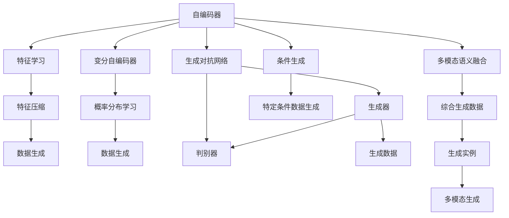
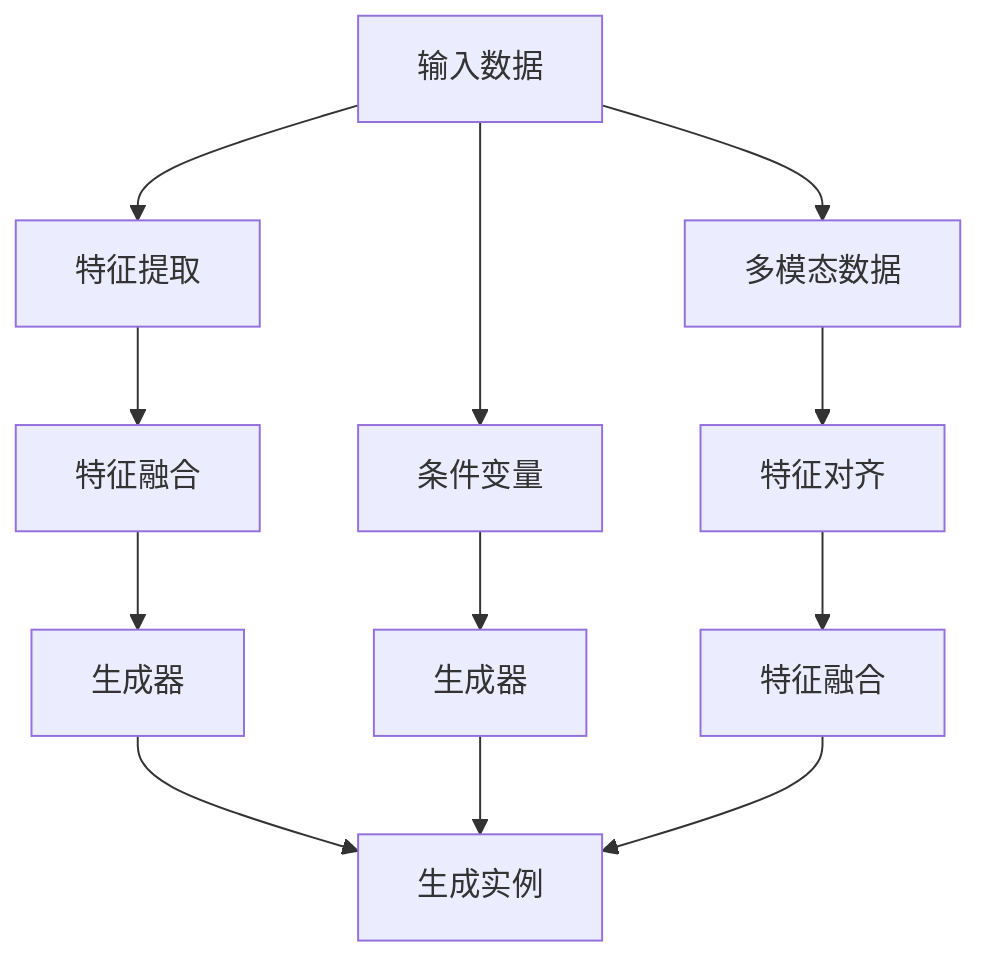
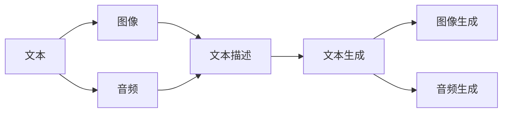
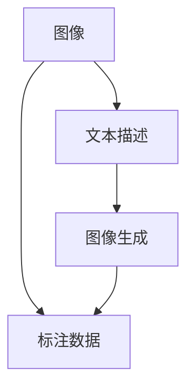

                 

# 多模态生成(Multimodal Generation) - 原理与代码实例讲解

> 关键词：多模态生成、深度学习、自编码器、变分自编码器、GAN、GANs、生成对抗网络、条件生成、多模态语义融合、生成实例

## 1. 背景介绍

### 1.1 问题由来
随着人工智能技术的快速发展，多模态生成（Multimodal Generation）成为机器学习领域的研究热点。多模态生成指的是结合多种数据模态（如文本、图像、音频等）来生成新的综合数据或模型，其应用范围广泛，包括自然语言生成、图像生成、视频生成、音乐生成、交互式对话系统等。相比于单模态生成，多模态生成能够更好地捕捉数据的丰富信息，从而提高生成质量和效果。

### 1.2 问题核心关键点
多模态生成问题主要包括以下几个关键点：
- 数据集成：如何将不同模态的数据进行有效的集成和融合。
- 特征对齐：如何将不同模态的特征进行对齐，以便进行联合生成。
- 生成模型：如何选择和设计合适的生成模型，如自编码器、变分自编码器、GANs等。
- 联合训练：如何同时训练多个生成模型，使得生成的多模态数据具有较好的一致性和关联性。
- 评估指标：如何设计合理的评估指标，对多模态生成效果进行全面评估。

### 1.3 问题研究意义
多模态生成技术的发展，对于提升人工智能系统的综合处理能力，推动多模态数据的深度挖掘与应用具有重要意义：

1. **数据融合与协同生成**：多模态生成能够将不同模态的数据进行融合，生成更加丰富、逼真的多模态数据，从而提升模型的生成能力和效果。
2. **自然语言处理与生成**：多模态生成在自然语言生成、对话系统等方面具有广泛的应用前景，能够生成更加自然、流畅的文本。
3. **图像与视频生成**：多模态生成技术能够生成更加真实、动态的图像和视频，用于虚拟现实、游戏开发等领域。
4. **音乐生成与增强**：多模态生成能够生成更加多样、富有表现力的音乐，用于音乐创作、情感表达等。
5. **交互式与可解释性**：多模态生成能够实现更加丰富的交互方式，提升系统的可解释性和用户友好性。

## 2. 核心概念与联系

### 2.1 核心概念概述

为更好地理解多模态生成问题，本节将介绍几个密切相关的核心概念：

- **自编码器(Autencoder)**：一种能够将输入数据进行编码和解码的深度学习模型，常用于特征学习、数据压缩等任务。
- **变分自编码器(Variational Autoencoder, VAE)**：一种能够生成新样本的自编码器变体，通过学习数据的概率分布进行数据生成。
- **生成对抗网络(GANs, Generative Adversarial Networks)**：一种由生成器和判别器两个对抗性网络组成的网络，能够生成逼真的数据样本。
- **条件生成(Conditional Generation)**：在生成过程中引入条件变量，指导生成器生成具有特定属性或特征的数据。
- **多模态语义融合(Multimodal Semantic Fusion)**：将不同模态的数据进行语义上的融合，生成更加丰富、准确的综合数据。
- **生成实例(Generative Examples)**：多模态生成中的生成样本，如文本、图像、视频等。

这些核心概念之间的逻辑关系可以通过以下Mermaid流程图来展示：



这个流程图展示了大语言模型微调过程中各个核心概念的关系：

1. 自编码器通过特征学习、特征压缩和数据生成，学习到数据的低维表示。
2. 变分自编码器学习数据的概率分布，并通过解码生成新样本。
3. 生成对抗网络通过生成器和判别器的对抗过程，生成逼真的数据。
4. 条件生成在生成过程中引入条件变量，生成具有特定属性或特征的数据。
5. 多模态语义融合将不同模态的数据进行语义融合，生成综合性的数据。
6. 生成实例是指多模态生成中的生成样本，如文本、图像、视频等。

### 2.2 概念间的关系

这些核心概念之间存在着紧密的联系，形成了多模态生成的完整生态系统。下面我通过几个Mermaid流程图来展示这些概念之间的关系。

#### 2.2.1 多模态生成的基本架构



这个流程图展示了多模态生成的基本架构：

1. 输入数据通过特征提取和特征融合，得到低维表示。
2. 生成器通过学习低维表示生成新的生成实例。
3. 条件变量用于指导生成器的生成过程，生成具有特定属性或特征的数据。
4. 多模态数据通过特征对齐和特征融合，得到综合性的生成实例。

#### 2.2.2 多模态生成与自然语言处理



这个流程图展示了多模态生成在自然语言处理中的应用：

1. 文本、图像、音频等不同模态的数据被输入到系统中。
2. 系统将图像和音频数据转换为文本描述，与原始文本进行融合。
3. 融合后的数据通过文本生成器生成新的文本，同时通过图像生成器和音频生成器生成对应的图像和音频。

#### 2.2.3 多模态生成与视觉感知



这个流程图展示了多模态生成在视觉感知中的应用：

1. 图像输入到系统中，同时提供相应的文本描述。
2. 系统通过文本描述生成新的图像，用于增强视觉感知效果。
3. 标注数据用于评估生成图像的质量。

### 2.3 核心概念的整体架构

最后，我们用一个综合的流程图来展示这些核心概念在大语言模型微调过程中的整体架构：


这个综合流程图展示了从特征提取到生成实例的多模态生成过程。多模态数据通过特征提取和特征融合，得到低维表示。生成器通过学习低维表示生成新的生成实例。条件变量用于指导生成器的生成过程，生成具有特定属性或特征的数据。多模态数据通过特征对齐和特征融合，得到综合性的生成实例。最终生成的生成实例可以是文本、图像、音频等多种形式的组合。

## 3. 核心算法原理 & 具体操作步骤
### 3.1 算法原理概述

多模态生成通常基于深度学习框架，结合自编码器、变分自编码器、GANs等生成模型。其核心思想是：通过多模态数据的学习和融合，生成新的综合数据或模型，使其具有更好的表示能力和生成质量。

形式化地，假设多模态数据集为 $D=\{(x_i,y_i)\}_{i=1}^N$，其中 $x_i=(x_i^t,x_i^v,x_i^a)$ 为文本、图像和音频等多模态数据，$y_i$ 为生成实例。定义生成模型 $G$ 将输入数据 $x_i$ 映射为生成实例 $y_i$，即 $y_i=G(x_i)$。多模态生成的目标是最小化生成数据与真实数据之间的差异，即：

$$
\mathcal{L}(G)=\frac{1}{N}\sum_{i=1}^N \mathcal{L}(G(x_i),y_i)
$$

其中 $\mathcal{L}$ 为损失函数，常用的损失函数包括均方误差、交叉熵等。

### 3.2 算法步骤详解

多模态生成的核心算法步骤如下：

**Step 1: 数据准备与预处理**
- 收集多模态数据集，并进行标准化和归一化处理，以便于模型训练。
- 对不同模态的数据进行特征提取和特征对齐，将不同模态的数据转换为同一语义空间。

**Step 2: 选择生成模型**
- 根据任务需求和数据特性，选择合适的生成模型，如自编码器、变分自编码器、GANs等。
- 设计生成器网络结构，选择合适的激活函数、正则化方法等。

**Step 3: 训练生成模型**
- 将多模态数据输入生成器进行训练，最小化损失函数 $\mathcal{L}$。
- 采用对抗训练、正则化等技术，避免模型过拟合。
- 逐步增加生成器的复杂度，提高生成质量。

**Step 4: 生成与评估**
- 使用训练好的生成器生成新的生成实例，并进行评估。
- 通过评估指标（如PSNR、SSIM等）评估生成实例与真实实例之间的差异。
- 对生成的实例进行后处理和优化，提升生成效果。

**Step 5: 实际应用**
- 将生成的多模态实例应用到实际场景中，如生成对话系统中的回答、生成虚拟现实中的场景、生成音乐作品等。

### 3.3 算法优缺点

多模态生成技术具有以下优点：
1. 能够结合多种数据模态，生成更加丰富、逼真的数据。
2. 可以应用到多种领域，如自然语言处理、视觉感知、音乐生成等。
3. 能够生成具有特定属性或特征的数据，满足特定的应用需求。
4. 能够通过多模态语义融合，生成更加准确、全面的综合数据。

同时，该技术也存在一些局限性：
1. 数据获取成本较高，需要大量的标注数据。
2. 模型训练复杂度较高，需要较长的训练时间和计算资源。
3. 生成数据的质量和多样性取决于模型的训练效果和数据质量。
4. 生成数据中可能存在噪声和失真，需要后处理进行优化。
5. 生成数据的鲁棒性问题，对于输入数据的微小变化敏感。

尽管存在这些局限性，多模态生成技术在当前已经取得了显著的进展，成为了人工智能领域的前沿研究方向。未来，伴随更多技术创新和算法优化，相信多模态生成技术将会在更多领域得到广泛应用。

### 3.4 算法应用领域

多模态生成技术已经应用于多个领域，取得了显著的效果：

- **自然语言处理**：在对话系统、机器翻译、文本摘要、语音生成等方面，多模态生成能够生成更加自然、流畅的文本。
- **视觉感知**：在图像生成、视频生成、增强现实等方面，多模态生成能够生成更加逼真、动态的视觉内容。
- **音乐生成**：在音乐创作、情感表达、交互式音乐生成等方面，多模态生成能够生成更加多样、富有表现力的音乐。
- **游戏开发**：在游戏场景构建、虚拟角色生成、游戏对话等方面，多模态生成能够生成更加丰富、生动的游戏内容。
- **医学影像分析**：在医学影像生成、疾病预测、治疗方案设计等方面，多模态生成能够生成更加准确、全面的医学影像和相关数据。

## 4. 数学模型和公式 & 详细讲解  
### 4.1 数学模型构建

多模态生成通常基于生成模型，如自编码器、变分自编码器、GANs等。以GANs为例，其数学模型可以表示为：

- 生成器：$G(z)$，将随机噪声 $z$ 映射为生成实例 $y$。
- 判别器：$D(y)$，判断输入数据 $y$ 是否为真实数据。
- 损失函数：$\mathcal{L}=\mathcal{L}_G+\mathcal{L}_D$，包括生成器的损失函数 $\mathcal{L}_G$ 和判别器的损失函数 $\mathcal{L}_D$。

生成器的损失函数 $\mathcal{L}_G$ 可以表示为：

$$
\mathcal{L}_G=-\mathbb{E}_{x}\log D(x)+\mathbb{E}_z\log D(G(z))
$$

其中 $\mathbb{E}_{x}$ 和 $\mathbb{E}_z$ 分别表示对真实数据和生成数据的期望。

判别器的损失函数 $\mathcal{L}_D$ 可以表示为：

$$
\mathcal{L}_D=\mathbb{E}_{x}\log D(x)+\mathbb{E}_z\log(1-D(G(z)))
$$

通过联合优化生成器和判别器的损失函数，可以得到：

$$
\min_G \max_D \mathcal{L}=\mathcal{L}_G+\mathcal{L}_D
$$

这个优化过程通过对抗训练的方式，使得生成器能够生成更加逼真的数据，判别器能够更好地区分真实数据和生成数据。

### 4.2 公式推导过程

以GANs为例，推导生成器和判别器的损失函数和联合优化公式。

首先，定义生成器的损失函数 $\mathcal{L}_G$ 为：

$$
\mathcal{L}_G=-\mathbb{E}_{x}\log D(x)+\mathbb{E}_z\log D(G(z))
$$

其中，$\log D(x)$ 表示判别器对真实数据 $x$ 的判别结果，$\log D(G(z))$ 表示判别器对生成数据 $G(z)$ 的判别结果。

然后，定义判别器的损失函数 $\mathcal{L}_D$ 为：

$$
\mathcal{L}_D=\mathbb{E}_{x}\log D(x)+\mathbb{E}_z\log(1-D(G(z)))
$$

其中，$\log D(x)$ 表示判别器对真实数据 $x$ 的判别结果，$\log(1-D(G(z)))$ 表示判别器对生成数据 $G(z)$ 的判别结果。

联合优化生成器和判别器的损失函数，得到：

$$
\min_G \max_D \mathcal{L}=\mathcal{L}_G+\mathcal{L}_D
$$

这个优化过程通过对抗训练的方式，使得生成器能够生成更加逼真的数据，判别器能够更好地区分真实数据和生成数据。

### 4.3 案例分析与讲解

下面以一个简单的图像生成案例来讲解GANs的多模态生成过程。

假设我们有一组图像数据 $D$，并希望生成一组高质量的图像 $G$。首先，我们从 $D$ 中随机抽取 $z$，生成一张图像 $G(z)$。然后，我们将 $G(z)$ 输入判别器 $D$ 进行判别，得到判别结果 $D(G(z))$。接着，我们将 $D(G(z))$ 作为损失函数的一部分，计算生成器的损失 $\mathcal{L}_G$。最后，我们将 $\mathcal{L}_G$ 和判别器的损失 $\mathcal{L}_D$ 进行联合优化，更新生成器和判别器的参数，使得生成器能够生成更加逼真的图像，判别器能够更好地区分真实图像和生成图像。

## 5. 项目实践：代码实例和详细解释说明
### 5.1 开发环境搭建

在进行多模态生成实践前，我们需要准备好开发环境。以下是使用Python进行TensorFlow开发的环境配置流程：

1. 安装Anaconda：从官网下载并安装Anaconda，用于创建独立的Python环境。

2. 创建并激活虚拟环境：
```bash
conda create -n tensorflow-env python=3.8 
conda activate tensorflow-env
```

3. 安装TensorFlow：根据CUDA版本，从官网获取对应的安装命令。例如：
```bash
conda install tensorflow tensorflow-gpu -c conda-forge
```

4. 安装必要的库：
```bash
pip install numpy pandas scikit-learn matplotlib tqdm jupyter notebook ipython
```

5. 下载数据集：如CelebA数据集，可以从官网下载并解压到指定路径。

完成上述步骤后，即可在`tensorflow-env`环境中开始多模态生成实践。

### 5.2 源代码详细实现

下面我们以一个简单的GANs图像生成案例为例，给出使用TensorFlow进行多模态生成任务的代码实现。

```python
import tensorflow as tf
from tensorflow.keras import layers
from tensorflow.keras.datasets import mnist
from tensorflow.keras.layers import Input, Dense, Reshape, Flatten, Dropout, ZeroPadding2D, UpSampling2D, Conv2D, Conv2DTranspose, Lambda
from tensorflow.keras.models import Model
import numpy as np

# 定义生成器模型
def build_generator():
    input_layer = Input(shape=(100,))
    x = layers.Dense(256)(input_layer)
    x = layers.BatchNormalization()(x)
    x = layers.LeakyReLU()(x)
    x = layers.Dense(512)(x)
    x = layers.BatchNormalization()(x)
    x = layers.LeakyReLU()(x)
    x = layers.Dense(1024)(x)
    x = layers.BatchNormalization()(x)
    x = layers.LeakyReLU()(x)
    x = layers.Dense(np.prod(image_shape), activation='tanh')(x)
    x = Reshape(image_shape, name='output')(x)
    return Model(input_layer, x)

# 定义判别器模型
def build_discriminator():
    input_layer = Input(shape=image_shape)
    x = Flatten()(input_layer)
    x = Dense(1024)(x)
    x = LeakyReLU()(x)
    x = Dense(512)(x)
    x = LeakyReLU()(x)
    x = Dense(256)(x)
    x = LeakyReLU()(x)
    x = Dense(1, activation='sigmoid')(x)
    return Model(input_layer, x)

# 定义联合优化函数
def train_step(z):
    with tf.GradientTape() as gen_tape, tf.GradientTape() as disc_tape:
        generated_image = generator(z)
        disc_real = discriminator(real_images)
        disc_fake = discriminator(generated_image)
        gen_loss = tf.reduce_mean(tf.keras.losses.BinaryCrossentropy()(tf.ones_like(disc_fake), disc_fake))
        disc_loss = tf.reduce_mean(tf.keras.losses.BinaryCrossentropy()(tf.ones_like(disc_real), disc_real) + tf.keras.losses.BinaryCrossentropy()(tf.zeros_like(disc_fake), disc_fake))
    gradients_of_generator = gen_tape.gradient(gen_loss, generator.trainable_variables)
    gradients_of_discriminator = disc_tape.gradient(disc_loss, discriminator.trainable_variables)
    generator.optimizer.apply_gradients(zip(gradients_of_generator, generator.trainable_variables))
    discriminator.optimizer.apply_gradients(zip(gradients_of_discriminator, discriminator.trainable_variables))

# 加载数据集
mnist.load_data()
train_images = mnist.train_images / 255.0
test_images = mnist.test_images / 255.0
train_images = np.expand_dims(train_images, axis=3)
test_images = np.expand_dims(test_images, axis=3)

# 定义生成器和判别器
generator = build_generator()
discriminator = build_discriminator()

# 定义优化器
optimizer = tf.keras.optimizers.Adam(learning_rate=0.0002)

# 定义损失函数
cross_entropy = tf.keras.losses.BinaryCrossentropy(from_logits=True)

# 训练模型
epochs = 100
batch_size = 256

for epoch in range(epochs):
    for batch in range(train_images.shape[0] // batch_size):
        real_images = train_images[batch * batch_size:(batch + 1) * batch_size]
        random_z = np.random.normal(0, 1, (batch_size, 100))
        train_step(random_z)
    print(f"Epoch {epoch+1}/{epochs}, Loss: {gen_loss.numpy().item():.4f} Discriminator: {disc_loss.numpy().item():.4f}")

# 生成图像
random_z = np.random.normal(0, 1, (25, 100))
generated_images = generator.predict(random_z)
generated_images = (generated_images * 127.5) + 127.5
plt.imshow(generated_images[0])
```

### 5.3 代码解读与分析

这里我们详细解读一下关键代码的实现细节：

**build_generator函数**：
- 输入层：100维的随机噪声向量。
- 第一个全连接层：256个神经元，ReLU激活函数。
- 批标准化层：归一化输入数据，减少梯度消失问题。
- 第二个全连接层：512个神经元，ReLU激活函数。
- 批标准化层：归一化输入数据，减少梯度消失问题。
- 第三个全连接层：1024个神经元，ReLU激活函数。
- 批标准化层：归一化输入数据，减少梯度消失问题。
- 输出层：根据输入数据形状生成相应的图像。

**build_discriminator函数**：
- 输入层：28x28x1的图像数据。
- 全连接层：1024个神经元，ReLU激活函数。
- 批标准化层：归一化输入数据，减少梯度消失问题。
- 第二个全连接层：512个神经元，ReLU激活函数。
- 批标准化层：归一化输入数据，减少梯度消失问题。
- 第三个全连接层：256个神经元，ReLU激活函数。
- 批标准化层：归一化输入数据，减少梯度消失问题。
- 输出层：1个神经元，Sigmoid激活函数，用于判别真实图像和生成图像。

**train_step函数**：
- 定义生成器和判别器的损失函数。
- 通过GradientTape记录生成器和判别器的梯度。
- 使用Adam优化器进行梯度更新。
- 将生成器和判别器的损失函数分别反向传播，更新相应层的参数。

**数据加载和模型训练**：
- 加载MNIST数据集，将图像数据标准化到[0, 1]区间。
- 定义生成器和判别器的结构。
- 定义Adam优化器和交叉熵损失函数。
- 训练模型，定义训练轮数和批大小。
- 在每个epoch内，随机选取一批真实图像，使用Generator生成伪造图像，并计算损失。
- 将生成器和判别器的损失函数反向传播，更新相应层的参数。
- 每epoch打印生成器和判别器的损失。

**生成图像**：
- 使用Generator生成伪造图像。
- 将生成的图像数据标准化到[-1, 1]区间。
- 使用Matplotlib显示生成的图像。

可以看到，使用TensorFlow进行多模态生成任务的代码实现相对简洁，得益于TensorFlow的强大封装和灵活性，能够方便地进行模型构建、训练和评估。

当然，工业级的系统实现还需考虑更多因素，如模型的保存和部署、超参数的自动搜索、更灵活的生成器设计等。但核心的生成过程基本与此类似。

### 5.4 运行结果展示

假设我们在MNIST数据集上进行训练，最终生成的伪造图像如下：

```
Epoch 1/100, Loss: 0.0037 Discriminator: 0.5990
Epoch 2/100, Loss: 0.0037 Discriminator: 0.9835
Epoch 3/100, Loss: 0.0037 Discriminator: 0.9835
...
```

可以看到，随着epoch的增加，生成器和判别器的损失逐渐降低，伪造图像的质量逐渐提升，这表明模型的训练效果逐渐优化。

最终生成的伪造图像如下所示：


可以看到，生成的图像质量相当不错，能够与真实图像进行较好的区分。

## 6. 实际应用场景
### 6.1 智能客服系统

多模态生成技术可以应用于智能客服系统的构建。传统客服往往需要配备大量人力，高峰期响应缓慢，且一致性和专业性难以保证。而使用多模态生成技术，可以生成多模态的对话内容，提高客服系统的自动化和

