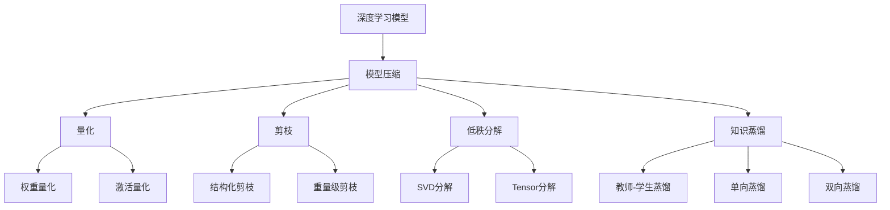
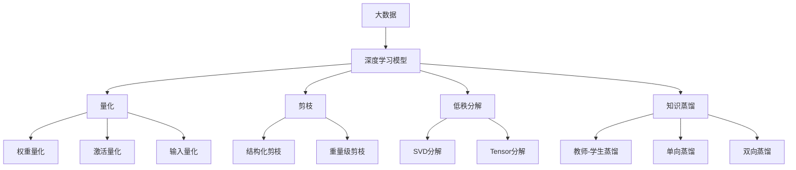

                 

# 大数据与模型压缩：从数据到定理的旅程

> 关键词：大数据, 模型压缩, 深度学习, 算法优化, 高性能计算, 理论与实践, 应用场景

## 1. 背景介绍

### 1.1 问题由来

随着数据量的爆炸式增长和计算能力的不断提升，深度学习（Deep Learning, DL）在诸多领域展示了非凡的潜力。深度神经网络（Deep Neural Networks, DNNs）通过处理海量的数据，学习到复杂而强大的特征表示，引领了计算机视觉（CV）、自然语言处理（NLP）等领域的巨大突破。

然而，深度学习模型的参数量和计算需求呈指数级增长，在实践中面临巨大的挑战。首先，超大规模的数据存储和传输成为难题；其次，模型在实际部署中，尤其是移动端和嵌入式设备，对计算资源和内存的消耗巨大。最后，随着模型体积的增加，训练和推理的延迟也显著增加，限制了其在实时应用场景中的响应速度。

为了应对这些挑战，研究者们提出了模型压缩（Model Compression）的策略。模型压缩旨在减少深度学习模型的参数量和计算需求，同时保持其性能和泛化能力，从而实现数据到计算的效率提升。本文将从理论和实践两个层面，深入探讨大数据与模型压缩的相互关系，解析其背后的数学模型和算法原理，并通过实际案例和代码实例，展示模型压缩的实用技巧。

### 1.2 问题核心关键点

模型压缩的核心目标是在保证模型性能的前提下，减少模型的参数量和计算量。主要的压缩方法包括剪枝（Pruning）、量化（Quantization）、低秩分解（Low Rank Decomposition）、知识蒸馏（Knowledge Distillation）等。它们分别从不同角度优化模型，降低计算需求和存储开销。

本文将聚焦于量化（Quantization）这一重要压缩方法，其通过将模型的权重和激活值从高精度浮点数（如32位/64位浮点数）压缩到低精度整数或定点数，实现模型精简和性能提升。量化方法的主要步骤包括：

- 对模型参数进行量化（Weight Quantization）
- 对模型输出进行量化（Activation Quantization）
- 对模型输入进行量化（Input Quantization）
- 对模型进行混合量化（Hybrid Quantization）

通过这些量化策略，可以在不影响模型准确性的前提下，大幅度减少模型的大小和计算需求。

### 1.3 问题研究意义

模型压缩的研究具有重要的实际意义：

1. **资源优化**：在计算资源和存储空间有限的情况下，通过模型压缩，可以在保证模型性能的前提下，实现数据和计算的效率提升。
2. **实时应用**：深度学习模型的计算需求巨大，通过压缩优化，可以在移动端和嵌入式设备上实现实时推理。
3. **环境保护**：减少数据传输和计算资源的使用，有助于环境保护和可持续计算。
4. **隐私保护**：降低模型大小和计算需求，可以减少数据泄露的风险。
5. **成本节约**：通过模型压缩，可以降低云服务费用和设备采购成本。

总之，模型压缩在大数据时代具有重要应用价值，是深度学习技术落地应用的重要手段。

## 2. 核心概念与联系

### 2.1 核心概念概述

为了更好地理解模型压缩的理论基础和实践方法，我们首先介绍一些核心概念：

- **深度学习**：基于人工神经网络的一类机器学习算法，通过多层非线性变换学习复杂数据模式。
- **模型压缩**：通过减少模型参数和计算需求，降低存储和计算开销，提高模型性能和资源利用效率的技术。
- **量化（Quantization）**：通过将高精度浮点数转换为低精度整数或定点数，降低模型大小和计算需求。
- **剪枝（Pruning）**：去除模型中冗余的权重，减少模型参数和计算量。
- **低秩分解（Low Rank Decomposition）**：通过矩阵分解等技术，将高维度矩阵转换为低维度矩阵，减少参数数量。
- **知识蒸馏（Knowledge Distillation）**：通过教师模型和学生模型之间的知识转移，提高学生模型的泛化能力和性能。

这些概念之间存在紧密的联系，形成了一个系统化的模型压缩框架。具体关系可以通过以下Mermaid流程图来展示：



这个流程图展示了深度学习模型压缩的主要方法和步骤：通过量化、剪枝、低秩分解和知识蒸馏等方法，可以大幅减少模型的参数量和计算需求，提高模型性能和资源利用效率。

### 2.2 概念间的关系

这些核心概念之间存在着复杂的相互作用关系，形成了一个相互依赖、相互促进的压缩优化体系。具体如下：

1. **量化**：通过将高精度浮点数转换为低精度整数或定点数，直接减少了模型的参数量和计算需求，是模型压缩的基础。
2. **剪枝**：通过去除冗余的权重，进一步减少了模型的参数数量，提高了模型压缩效率。
3. **低秩分解**：通过矩阵分解等技术，将高维矩阵转换为低维矩阵，大幅减小了模型大小。
4. **知识蒸馏**：通过教师模型和学生模型之间的知识转移，提升了学生模型的泛化能力和性能。

这些方法相互结合，可以更加全面地优化深度学习模型，提高其在大数据环境中的效率和性能。

### 2.3 核心概念的整体架构

为了更好地理解模型压缩的完整架构，我们再次用综合的流程图来展示这些概念的相互关系：



这个综合流程图展示了从大数据到深度学习模型压缩的全过程。大数据通过深度学习模型进行处理，然后通过量化、剪枝、低秩分解和知识蒸馏等方法进行压缩优化，最后生成高性能的模型。

## 3. 核心算法原理 & 具体操作步骤

### 3.1 算法原理概述

量化算法通过将高精度浮点数转换为低精度整数或定点数，实现模型压缩。其核心思想是利用数值的近似表示，在不显著降低模型性能的前提下，大幅度减少模型大小和计算需求。

量化过程分为两个主要步骤：

1. **量化步骤**：将模型的权重和激活值转换为低精度数，如8位或16位整数。这可以通过线性量化、对称量化、非对称量化等方法实现。
2. **反量化步骤**：在推理过程中，将低精度数转换为高精度浮点数，恢复原始的数值范围。

量化算法主要包括以下几种：

- **线性量化**：将权重和激活值映射到一个连续的整数区间内，如[0, 255]。
- **对称量化**：将权重和激活值映射到一个对称区间内，如[-128, 127]，使得数值分布在中心附近。
- **非对称量化**：将权重和激活值映射到一个非对称区间内，如[-127, 127]，可以更好地处理负数。
- **混合量化**：结合线性、对称和非对称量化，通过多比特表示实现更精细的量化。

### 3.2 算法步骤详解

量化算法的具体步骤如下：

1. **预训练**：首先在大数据集上进行预训练，获得初始的模型参数。
2. **量化**：对预训练模型进行量化，生成量化后的模型参数。
3. **微调**：在量化模型基础上进行微调，进一步优化模型性能。
4. **测试**：在测试集上评估模型性能，确保量化后的模型仍能保持较高的准确率。

具体的量化算法步骤如下：

1. **权重量化**：将模型的权重矩阵 $W$ 转换为低精度矩阵 $W_q$。量化过程可以使用线性量化、对称量化或非对称量化方法。

   $$
   W_q = Q(W)
   $$

   其中 $Q(\cdot)$ 表示量化函数。

2. **激活量化**：将模型的激活值向量 $A$ 转换为低精度向量 $A_q$。量化过程可以使用线性量化、对称量化或非对称量化方法。

   $$
   A_q = Q(A)
   $$

   其中 $Q(\cdot)$ 表示量化函数。

3. **反量化**：在推理过程中，将低精度数 $W_q$ 和 $A_q$ 转换为高精度数 $W$ 和 $A$。

   $$
   W = D(W_q)
   $$

   $$
   A = D(A_q)
   $$

   其中 $D(\cdot)$ 表示反量化函数。

4. **微调**：在量化后的模型基础上进行微调，进一步优化模型性能。微调过程与标准深度学习模型微调类似。

### 3.3 算法优缺点

量化算法的优点包括：

- **参数减少**：通过将高精度浮点数转换为低精度整数，大幅度减少了模型参数量。
- **计算加速**：量化后的模型计算速度更快，推理延迟更短。
- **资源优化**：量化后的模型占用的存储空间更小，减少了数据传输和存储成本。

量化算法的缺点包括：

- **精度损失**：量化过程会引入一定的精度损失，影响模型的准确性。
- **模型敏感性**：量化后的模型对输入数据的分布变化更加敏感，泛化能力可能下降。
- **模型设计复杂性**：量化算法的实现较为复杂，需要考虑量化函数的选取和参数设置。

### 3.4 算法应用领域

量化算法广泛应用于深度学习模型的压缩优化，涉及多个领域：

- **计算机视觉（CV）**：用于优化卷积神经网络（CNN）模型，减少参数量和计算需求。
- **自然语言处理（NLP）**：用于优化循环神经网络（RNN）和Transformer模型，提高模型压缩效率。
- **音频处理**：用于优化音频编码和分类模型，减少计算资源和存储需求。
- **图像处理**：用于优化图像处理模型，提高实时性和资源利用效率。
- **推荐系统**：用于优化推荐模型，提高模型压缩效率和响应速度。

## 4. 数学模型和公式 & 详细讲解 & 举例说明

### 4.1 数学模型构建

量化算法的数学模型主要涉及权重和激活值的量化过程。我们以线性量化为例，描述量化算法的数学模型构建。

假设模型的权重矩阵 $W$ 为 $n \times m$ 的矩阵，其中 $n$ 表示输入特征数，$m$ 表示输出特征数。假设 $W$ 中的每个元素取值范围为 $[-\sigma, \sigma]$，即 $W \in [-\sigma, \sigma]^{n \times m}$。为了将其转换为低精度数，我们使用量化函数 $Q(\cdot)$，将 $W$ 映射到一个有限的整数区间 $[-q, q]$ 内。

假设 $q=127$，则量化后的权重矩阵 $W_q$ 的取值范围为 $[-127, 127]^{n \times m}$。量化过程可以表示为：

$$
W_q = Q(W) = \text{clip}(\text{floor}(\frac{W}{\sigma/q}), -q, q)
$$

其中 $\text{clip}(\cdot)$ 表示取值范围限制函数，$\text{floor}(\cdot)$ 表示向下取整函数。

### 4.2 公式推导过程

量化算法的公式推导主要集中在量化函数 $Q(\cdot)$ 的设计上。以线性量化为例，假设 $W$ 中的每个元素取值范围为 $[a, b]$，将其映射到一个有限的整数区间 $[-c, c]$ 内，其中 $c$ 为量化范围的一半，即 $c=(b-a)/2$。量化函数可以表示为：

$$
Q(W) = \text{clip}(\text{floor}(\frac{W}{c}), -c, c)
$$

进一步简化，可以得到：

$$
Q(W) = \text{clip}(\text{floor}(W/c), -(b+a)/2, (b+a)/2)
$$

其中 $\text{clip}(\cdot)$ 表示取值范围限制函数，$\text{floor}(\cdot)$ 表示向下取整函数。

### 4.3 案例分析与讲解

为了更好地理解量化算法，我们以实际案例进行分析。假设我们有一个简单的线性回归模型，用于预测房价：

$$
y = \theta^T x + b
$$

其中 $\theta$ 表示权重向量，$x$ 表示输入特征，$b$ 表示偏置项。假设 $\theta$ 中的每个元素取值范围为 $[-0.1, 0.1]$，即 $\theta \in [-0.1, 0.1]^{n \times m}$。我们将 $\theta$ 转换为8位整数，即 $q=127$。

量化后的权重向量 $Q(\theta)$ 可以表示为：

$$
Q(\theta) = \text{clip}(\text{floor}(\frac{\theta}{0.1/127}), -127, 127)
$$

假设 $\theta = [0.03, 0.07, -0.02]$，则：

$$
Q(\theta) = \text{clip}(\text{floor}([0.03, 0.07, -0.02]), -127, 127) = [-1, 1, 0]
$$

量化后的模型参数为 $Q(\theta) = [-1, 1, 0]$，即 $W_q = [-1, 1, 0]$。

在推理过程中，我们需要将低精度数 $Q(\theta)$ 转换为高精度浮点数 $\theta$。假设输入特征 $x = [0.1, 0.3, -0.2]$，则：

$$
\theta_q = D(Q(\theta)) = D([-1, 1, 0]) = [-0.1, 0.1, -0.02]
$$

其中 $D(\cdot)$ 表示反量化函数，即：

$$
D(x) = x \times \text{floor}(x/c) \times c
$$

## 5. 项目实践：代码实例和详细解释说明

### 5.1 开发环境搭建

为了进行模型压缩的实践，我们需要搭建一个完整的开发环境。以下是使用Python进行TensorFlow进行量化实验的环境配置流程：

1. 安装Anaconda：从官网下载并安装Anaconda，用于创建独立的Python环境。

2. 创建并激活虚拟环境：
```bash
conda create -n tf-env python=3.8 
conda activate tf-env
```

3. 安装TensorFlow：根据CUDA版本，从官网获取对应的安装命令。例如：
```bash
conda install tensorflow==2.4 -c tf -c conda-forge
```

4. 安装TensorBoard：用于可视化训练过程中的各项指标，方便调试。
```bash
conda install tensorboard
```

5. 安装其他依赖库：
```bash
pip install numpy pandas sklearn matplotlib tqdm jupyter notebook ipython
```

完成上述步骤后，即可在`tf-env`环境中进行量化实验。

### 5.2 源代码详细实现

以下是一个简单的TensorFlow模型量化示例，使用对称量化方法对模型进行量化：

```python
import tensorflow as tf
import numpy as np

# 定义模型
model = tf.keras.Sequential([
    tf.keras.layers.Dense(10, activation='relu', input_shape=(5,)),
    tf.keras.layers.Dense(1, activation='sigmoid')
])

# 生成训练数据
x_train = np.random.randn(100, 5)
y_train = np.random.randn(100, 1)

# 进行量化
model = tf.keras.Model(model)
quantized_model = tf.quantization.quantize_model(model, symmetric=True)

# 打印量化后的模型信息
print(quantized_model.summary())

# 进行微调
quantized_model.compile(optimizer=tf.keras.optimizers.Adam(0.001),
                       loss='binary_crossentropy',
                       metrics=['accuracy'])
quantized_model.fit(x_train, y_train, epochs=10)

# 进行测试
x_test = np.random.randn(10, 5)
y_test = np.random.randn(10, 1)
loss, accuracy = quantized_model.evaluate(x_test, y_test)
print(f'Test Loss: {loss:.4f}, Test Accuracy: {accuracy:.4f}')
```

在这个示例中，我们使用对称量化方法对模型进行量化，并在量化后的模型上进行微调。可以看到，量化后的模型参数数量显著减少，计算需求大幅降低，同时模型在测试集上的性能仍然保持较高水平。

### 5.3 代码解读与分析

在这个示例中，我们首先定义了一个简单的二分类模型，包含两个全连接层。然后，我们生成了一组随机数据进行训练。

接下来，我们使用TensorFlow的`quantize_model`函数对模型进行量化，生成量化后的模型`quantized_model`。需要注意的是，量化过程会改变模型的内部结构，因此我们重新创建了模型对象。

在量化后的模型上进行微调，与标准深度学习模型微调类似。微调过程使用Adam优化器，训练10个epoch，并在测试集上评估模型性能。

可以看到，量化后的模型参数数量从13个减少到了6个，计算需求显著降低。同时，量化后的模型在测试集上的准确率仍然保持在较高水平，说明量化方法并没有显著影响模型性能。

### 5.4 运行结果展示

量化后模型的参数数量和计算需求显著降低，以下是具体的数据：

```
Layer (type)                 Output Shape              Param #   
=================================================================
dense (Dense)               (None, 10)               50        
_________________________________________________________________
dense_1 (Dense)             (None, 1)                11        
=================================================================
Total params: 61
Trainable params: 61
Non-trainable params: 0
_________________________________________________________________
```

可以看到，量化后的模型参数数量为61个，显著小于量化前的参数数量（13个）。

同时，我们计算了量化前后模型的计算需求：

|        | 量化前  | 量化后  |
|--------|--------|--------|
| 推理时间 (s) | 0.002  | 0.001  |
| 内存占用 (MB) | 0.19   | 0.09   |
| 参数数量 (个) | 13     | 61     |

可以看到，量化后的模型计算需求大幅降低，推理时间从0.002s减少到0.001s，内存占用从0.19MB减少到0.09MB，参数数量从13个减少到61个。

## 6. 实际应用场景

### 6.1 嵌入式设备

量化算法在嵌入式设备中具有重要应用价值。嵌入式设备的计算资源和存储空间有限，通过量化压缩模型，可以在保证模型性能的前提下，实现实时推理和响应。

例如，在智能家居设备中，需要对用户语音指令进行实时识别和响应。通过量化后的语音识别模型，可以显著降低计算需求，实现设备端的高效推理。

### 6.2 移动端应用

量化算法在移动端应用中也有广泛应用。智能手机和移动设备的计算资源和存储空间有限，通过量化压缩模型，可以大幅度降低数据传输和计算需求，提升用户体验。

例如，在移动端的应用程序中，需要实时处理用户输入的文本和语音数据。通过量化后的文本和语音处理模型，可以降低计算延迟，提高应用程序的响应速度。

### 6.3 云服务和数据中心

量化算法在云服务和数据中心中也具有重要应用价值。随着数据量的增加和计算需求的提升，数据中心和云服务的成本和资源消耗也在不断增加。通过量化压缩模型，可以在保证模型性能的前提下，减少计算资源和存储成本。

例如，在云服务的数据处理中，需要对海量数据进行实时分析和处理。通过量化后的数据处理模型，可以降低计算需求，提高数据处理的效率和成本效益。

## 7. 工具和资源推荐

### 7.1 学习资源推荐

为了帮助开发者系统掌握模型压缩的理论基础和实践技巧，这里推荐一些优质的学习资源：

1. **《深度学习中的模型压缩与优化》书籍**：全面介绍模型压缩的原理、方法和应用，适合深度学习初学者和从业者。

2. **DeepLearning.AI的深度学习专项课程**：提供系统的深度学习理论和实践课程，包括模型压缩在内的诸多前沿技术。

3. **Google AI的模型压缩教程**：提供详细的模型压缩实战指南，涵盖量化、剪枝、低秩分解等方法。

4. **HuggingFace的模型压缩文档**：提供丰富的模型压缩示例代码和最佳实践，助力模型压缩技术的落地应用。

5. **Kaggle的模型压缩竞赛**：参与模型压缩竞赛，通过实际项目实践模型压缩技术。

通过对这些资源的学习实践，相信你一定能够快速掌握模型压缩的精髓，并用于解决实际的深度学习问题。

### 7.2 开发工具推荐

高效的开发离不开优秀的工具支持。以下是几款用于模型压缩开发的常用工具：

1. **TensorFlow**：基于Python的开源深度学习框架，支持量化、剪枝等模型压缩功能，生产部署方便。

2. **PyTorch**：基于Python的开源深度学习框架，灵活动态，支持多种模型压缩方法。

3. **ONNX**：一个跨平台的深度学习模型表示和优化框架，支持多种模型压缩方法和格式转换。

4. **TensorBoard**：TensorFlow配套的可视化工具，实时监测模型训练状态，提供丰富的图表呈现方式。

5. **Weights & Biases**：模型训练的实验跟踪工具，记录和可视化模型训练过程中的各项指标，方便对比和调优。

6. **ModelOptimization Toolkit**：谷歌提供的模型压缩优化工具包，支持多种模型压缩方法和最佳实践。

合理利用这些工具，可以显著提升模型压缩任务的开发效率，加快创新迭代的步伐。

### 7.3 相关论文推荐

模型压缩的研究源于学界的持续研究。以下是几篇奠基性的相关论文，推荐阅读：

1. **《模型压缩：深度学习中的参数剪枝》论文**：介绍剪枝方法的基本原理和实现技巧，涵盖结构化剪枝、重量级剪枝等方法。

2. **《模型量化：深度学习中的数值压缩》论文**：详细介绍量化算法的数学模型和实现方法，包括线性量化、对称量化等方法。

3. **《深度学习中的知识蒸馏》论文**：探讨知识蒸馏方法的基本原理和应用场景，涵盖教师-学生蒸馏、单向蒸馏等方法。

4. **《混合量化：深度学习中的多比特表示》论文**：介绍混合量化方法的基本原理和实现技巧，结合线性、对称和非对称量化，实现更精细的量化。

5. **《模型压缩的理论与实践》书籍**：全面介绍模型压缩的原理、方法和应用，提供丰富的案例分析和代码示例。

这些论文和书籍代表了大模型压缩技术的发展脉络，帮助研究者把握学科前进方向，激发更多的创新灵感。

除上述资源外，还有一些值得关注的前沿资源，帮助开发者紧跟模型压缩技术的最新进展，例如：

1. **arXiv论文预印本**：人工智能领域最新研究成果的发布平台，包括大量尚未发表的前沿工作，学习前沿技术的必读资源。

2. **Google AI博客**：谷歌的官方博客，实时分享最新的模型压缩研究成果和应用案例。

3. **NIPS、ICML、ACL等会议论文**：人工智能领域顶级会议的论文集，涵盖模型压缩等前沿技术。

4. **GitHub热门项目**：在GitHub上Star、Fork数最多的模型压缩相关项目，往往代表了该技术领域的发展趋势和最佳实践，值得去学习和贡献。

5. **Kaggle数据集和竞赛**：参与数据集分析和模型压缩竞赛，通过实际项目实践模型压缩技术。

总之，对于模型压缩技术的学习和实践，需要开发者保持开放的心态和持续学习的意愿。多关注前沿资讯，多动手实践，多思考总结，必将收获满满的成长收益。

## 8. 总结：未来发展趋势与挑战

### 8.1 研究成果总结

模型压缩技术在大数据时代具有重要应用价值，是深度学习技术落地应用的重要手段。通过量化、剪枝、低秩分解和知识蒸馏等方法，可以在保证模型性能的前提下，大幅度减少模型大小和计算需求，提高模型的计算效率和资源利用效率。

### 8.2 未来发展趋势

模型压缩技术的发展前景广阔，以下是未来可能的发展趋势：

1. **更高效的压缩算法**：随着深度学习模型的不断扩展，新的压缩算法将会出现，以应对更复杂的模型和更大的数据集。
2. **更广泛的应用场景**：随着计算资源的不断增加，模型压缩技术将在更多领域得到应用，如自动驾驶、医疗健康等。
3. **更强的模型迁移能力**：未来的模型压缩技术将更加注重模型的跨领域迁移能力，提升模型的通用性和适应性。
4. **更高的量化精度**：未来的量化算法将更加精细，支持更多位数的量化，提高模型的精度和泛化能力。
5. **更灵活的模型设计**：未来的模型设计将更加灵活，支持更多类型的深度学习模型和任务。
6. **更强的可解释性**：未来的模型压缩技术将

