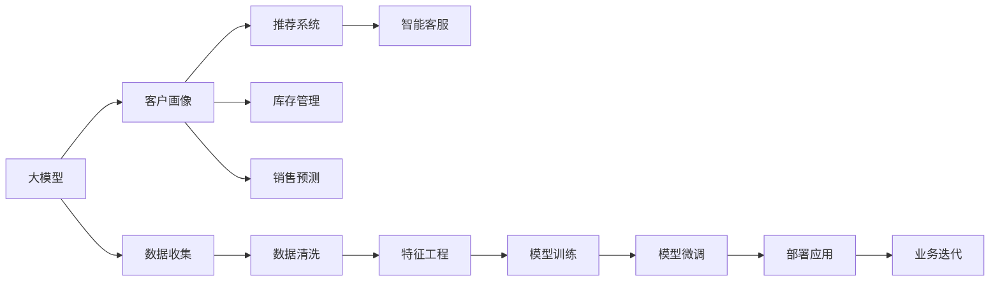

                 

## 1. 背景介绍

### 1.1 问题由来

随着大数据、人工智能等技术在商业领域的广泛应用，零售行业正在经历前所未有的变革。传统的零售业模式面临线上线下融合、个性化推荐、库存管理等挑战。近年来，大模型在零售业中的应用逐渐受到关注，从客户画像刻画、推荐系统优化、库存管理决策到销售预测，大模型正在逐步成为推动零售行业数字化转型的重要引擎。

### 1.2 问题核心关键点

大模型在零售业的应用主要集中在以下几个关键点上：

- 客户画像刻画：利用大模型对客户的消费行为、偏好、历史记录等进行全面分析，构建多维度的客户画像。
- 推荐系统优化：通过大模型对用户历史数据进行深度挖掘，提升推荐系统精准度。
- 库存管理决策：利用大模型进行需求预测，优化库存管理，减少库存积压和缺货情况。
- 销售预测：结合大模型和传统统计模型，进行销售预测，指导供应链管理。
- 客户服务：使用大模型提供智能客服、语音助手等增强用户体验。

大模型在零售业的应用，能够基于海量数据进行深度学习和特征提取，从而提升业务决策的准确性、效率和响应速度。但由于零售行业数据量大且复杂，大模型的训练和应用也面临着诸多挑战。

### 1.3 问题研究意义

大模型在零售业的应用，对于提升零售商的运营效率、优化客户体验、提高销售额和市场竞争力具有重要意义：

1. **运营效率提升**：大模型可以自动处理海量数据，提升数据挖掘和分析的效率，为零售商的运营决策提供支持。
2. **客户体验优化**：利用大模型进行个性化推荐和智能客服，提升客户满意度，增强用户粘性。
3. **销售业绩增长**：通过精准的库存管理和销售预测，零售商可以更精准地把握市场需求，优化产品结构，提升销售业绩。
4. **市场竞争力提升**：大模型能够帮助零售商在激烈的市场竞争中，快速响应市场变化，保持领先优势。
5. **数据驱动决策**：大模型可以自动学习数据中的模式和趋势，支持零售商的数据驱动决策，减少人为干预的误差。

## 2. 核心概念与联系

### 2.1 核心概念概述

为更好地理解大模型在零售业的应用，本节将介绍几个密切相关的核心概念：

- **大模型**：以Transformer为代表的深度学习模型，通过在大型语料库上预训练，获得通用的语言和知识表示能力。
- **推荐系统**：根据用户的历史行为和偏好，推荐合适的商品或服务，提升用户体验和销售转化率。
- **客户画像**：基于用户的多维数据，构建出用户的多维度特征，用于个性化的推荐和营销。
- **库存管理**：通过预测未来的需求量，优化库存水平，减少缺货和积压。
- **销售预测**：通过历史销售数据和市场趋势，预测未来的销售情况，指导供应链管理。
- **智能客服**：利用自然语言处理和大模型，提供自动化的客户服务，提升客户满意度。

这些核心概念之间存在着紧密的联系，形成了大模型在零售业应用的完整生态系统。

### 2.2 概念间的关系

这些核心概念之间可以通过以下Mermaid流程图来展示：



这个流程图展示了从数据收集、特征工程、模型训练到部署应用的完整流程，以及大模型在零售业中的各个应用场景。

## 3. 核心算法原理 & 具体操作步骤
### 3.1 算法原理概述

大模型在零售业的应用，本质上是基于大规模数据进行有监督或无监督的深度学习。其核心思想是：利用大模型在大型语料库上预训练得到的语言和知识表示，结合零售行业的业务需求，通过微调、迁移学习等技术，优化模型在特定任务上的性能，实现业务目标。

以推荐系统为例，大模型在零售业的应用流程如下：

1. **数据收集**：收集用户的历史行为数据、商品信息和用户画像等。
2. **数据清洗**：处理缺失值、异常值和重复记录，确保数据质量。
3. **特征工程**：提取用户特征、商品特征和行为特征等。
4. **模型训练**：在标注数据上训练大模型，学习用户和商品的语义关系。
5. **模型微调**：通过有监督的微调，优化模型在推荐任务上的表现。
6. **部署应用**：将训练好的模型集成到推荐系统中，实时推荐商品。

### 3.2 算法步骤详解

以推荐系统为例，下面详细介绍大模型在零售业的应用步骤：

#### 3.2.1 数据收集与清洗

**数据收集**：
- 收集用户的历史浏览记录、购买记录、评分记录等。
- 收集商品的详细信息、分类信息、价格信息等。
- 收集用户画像信息，如年龄、性别、地域等。

**数据清洗**：
- 处理缺失值，如使用均值、中位数或预测模型填补。
- 去除异常值，如检测并移除极端数据。
- 处理重复记录，确保数据的唯一性。

#### 3.2.2 特征工程

**用户特征**：
- 用户ID
- 用户年龄、性别、地域、职业等基本信息
- 用户的兴趣标签、行为序列、评分等行为特征

**商品特征**：
- 商品ID
- 商品名称、描述、分类、价格、销量等基本信息
- 商品的相似度、热门度等属性

**行为特征**：
- 用户ID
- 商品ID
- 行为时间戳
- 浏览时间、购买时间、评分时间等行为时间
- 行为方式（如点击、浏览、购买）

#### 3.2.3 模型训练

**模型选择**：
- 选择合适的深度学习模型，如BERT、GPT、LUKE等。
- 选择合适的优化器和损失函数。

**模型训练**：
- 对数据进行分批处理，每批次输入一部分数据。
- 将数据输入模型，计算损失函数，反向传播更新参数。
- 重复执行前向传播和反向传播，直到收敛。

#### 3.2.4 模型微调

**微调数据**：
- 收集标注数据，确保数据质量和多样性。
- 将数据划分为训练集、验证集和测试集。

**微调过程**：
- 冻结部分层，仅微调顶层，减少计算资源消耗。
- 设置合适的学习率和优化器。
- 在训练集上训练模型，在验证集上评估模型性能。
- 通过迭代优化，提升模型在推荐任务上的表现。

#### 3.2.5 部署应用

**模型集成**：
- 将训练好的模型集成到推荐系统中，如TensorFlow Serving、Amazon SageMaker等。
- 使用API接口，接收实时请求，返回推荐结果。

**实时推荐**：
- 对实时请求进行处理，提取用户ID和商品ID。
- 使用集成模型预测推荐结果，并返回给用户。
- 实时更新模型参数，保持推荐系统的高效性和准确性。

### 3.3 算法优缺点

大模型在零售业的应用具有以下优点：
- 高效处理大规模数据，提升数据分析和挖掘的效率。
- 基于丰富的语义和知识表示，提升推荐系统的精准度。
- 提供多维度的用户画像和商品信息，支持个性化推荐。

同时，也存在以下缺点：
- 数据收集和清洗成本高，数据质量难以保证。
- 模型训练和微调需要高计算资源，对硬件要求高。
- 推荐系统的高效性和准确性依赖于数据质量，数据偏差会影响推荐效果。
- 模型的复杂度较高，难以解释推荐结果，用户可能缺乏信任。

### 3.4 算法应用领域

大模型在零售业的应用广泛，包括但不限于以下几个领域：

- **客户画像**：利用大模型刻画客户的多维度特征，支持个性化推荐和营销。
- **推荐系统**：根据用户的历史行为和偏好，推荐合适的商品或服务。
- **库存管理**：通过需求预测，优化库存水平，减少缺货和积压。
- **销售预测**：结合大模型和传统统计模型，进行销售预测，指导供应链管理。
- **智能客服**：利用大模型提供自动化的客户服务，提升客户满意度。

## 4. 数学模型和公式 & 详细讲解 & 举例说明

### 4.1 数学模型构建

假设我们有一个基于大模型的推荐系统，输入为用户的ID $u$ 和商品ID $i$，输出为推荐结果 $y$。我们的目标是最小化预测值 $y$ 与真实值 $y_t$ 之间的误差。

**数据表示**：
- 用户ID：$u \in U$
- 商品ID：$i \in I$
- 推荐结果：$y \in \{0,1\}$，0表示不推荐，1表示推荐

**模型表示**：
- 大模型：$f(x) = W \cdot x + b$
- 用户嵌入向量：$u_e = f(u)$
- 商品嵌入向量：$i_e = f(i)$

**损失函数**：
- 二元交叉熵损失函数：$\ell(y,f(u,i)) = -y\log f(u,i) - (1-y)\log (1-f(u,i))$
- 平均损失：$L = \frac{1}{N} \sum_{(u,i)} \ell(y,f(u,i))$

**预测过程**：
- 计算用户嵌入向量和商品嵌入向量：$u_e = f(u)$，$i_e = f(i)$
- 计算预测值：$y = \sigma(W \cdot u_e + b_i)$

其中，$W$ 和 $b$ 为大模型的权重和偏置，$\sigma$ 为激活函数（如Sigmoid）。

### 4.2 公式推导过程

以二元交叉熵损失函数为例，推导其梯度：

$\ell(y,f(u,i)) = -y\log f(u,i) - (1-y)\log (1-f(u,i))$

对 $y$ 求偏导：
$\frac{\partial \ell}{\partial y} = \frac{-y}{f(u,i)} - \frac{1-y}{1-f(u,i)}$

对 $W$ 和 $b$ 求偏导：
$\frac{\partial \ell}{\partial W} = y \cdot u_e \cdot (1-f(u,i)) - (1-y) \cdot (1-u_e) \cdot f(u,i)$
$\frac{\partial \ell}{\partial b} = y - f(u,i)$

### 4.3 案例分析与讲解

假设我们在一个电商平台中，使用大模型进行商品推荐。平台有10万个用户和100万个商品，每日产生1000万次浏览记录。我们收集了用户的历史浏览、购买、评分等数据，以及商品的属性信息。

**数据预处理**：
- 收集用户的ID、年龄、性别、地域等基本信息。
- 收集商品的ID、名称、描述、价格、销量等属性。
- 收集用户的浏览记录、购买记录、评分记录等行为数据。
- 对数据进行去重、清洗、填充处理。

**特征工程**：
- 提取用户ID、商品ID、行为时间等基础特征。
- 使用大模型提取用户画像和商品特征。
- 计算用户行为序列、商品点击率、商品转化率等行为特征。

**模型训练**：
- 使用BERT模型作为大模型，在大量标注数据上预训练。
- 冻结模型底层，仅微调顶层，以减少计算资源消耗。
- 设置学习率为 $2e-5$，批大小为 $1024$。
- 使用Adam优化器进行训练，迭代 $20$ 次。

**模型微调**：
- 使用推荐系统标注数据，划分训练集、验证集和测试集。
- 在训练集上训练模型，每轮迭代使用验证集评估模型性能。
- 通过迭代优化，提升模型在推荐任务上的表现。

**部署应用**：
- 将训练好的模型集成到推荐系统中，使用TensorFlow Serving进行部署。
- 实时接收用户请求，提取用户ID和商品ID，计算推荐结果。
- 实时更新模型参数，保持推荐系统的高效性和准确性。

## 5. 项目实践：代码实例和详细解释说明

### 5.1 开发环境搭建

在进行项目实践前，我们需要准备好开发环境。以下是使用Python进行TensorFlow和PyTorch开发的环境配置流程：

1. 安装Anaconda：从官网下载并安装Anaconda，用于创建独立的Python环境。

2. 创建并激活虚拟环境：
```bash
conda create -n tf-env python=3.8 
conda activate tf-env
```

3. 安装TensorFlow和PyTorch：根据CUDA版本，从官网获取对应的安装命令。例如：
```bash
pip install tensorflow
conda install pytorch torchvision torchaudio cudatoolkit=11.1 -c pytorch -c conda-forge
```

4. 安装各类工具包：
```bash
pip install numpy pandas scikit-learn matplotlib tqdm jupyter notebook ipython
```

完成上述步骤后，即可在`tf-env`环境中开始项目实践。

### 5.2 源代码详细实现

这里我们以推荐系统为例，给出使用TensorFlow和PyTorch对BERT模型进行商品推荐微调的代码实现。

首先，定义推荐系统的数据处理函数：

```python
from transformers import BertTokenizer
from torch.utils.data import Dataset
import tensorflow as tf

class RecommendationDataset(Dataset):
    def __init__(self, texts, labels):
        self.texts = texts
        self.labels = labels
        self.tokenizer = BertTokenizer.from_pretrained('bert-base-cased')
        
    def __len__(self):
        return len(self.texts)
    
    def __getitem__(self, item):
        text = self.texts[item]
        label = self.labels[item]
        
        encoding = self.tokenizer(text, return_tensors='pt', max_length=128, padding='max_length', truncation=True)
        input_ids = encoding['input_ids']
        attention_mask = encoding['attention_mask']
        
        return {
            'input_ids': input_ids,
            'attention_mask': attention_mask,
            'labels': tf.convert_to_tensor(label, dtype=tf.int64)
        }
```

然后，定义模型和优化器：

```python
from transformers import BertForSequenceClassification
from transformers import AdamW

model = BertForSequenceClassification.from_pretrained('bert-base-cased', num_labels=2)
optimizer = AdamW(model.parameters(), lr=2e-5)
```

接着，定义训练和评估函数：

```python
from tensorflow.keras.metrics import Accuracy

def train_epoch(model, dataset, batch_size, optimizer):
    dataloader = tf.data.Dataset.from_generator(
        lambda: tf.data.Dataset.from_tensor_slices(dataset),
        output_signature={
            'input_ids': tf.TensorSpec(shape=(None, 128), dtype=tf.int32),
            'attention_mask': tf.TensorSpec(shape=(None, 128), dtype=tf.int32),
            'labels': tf.TensorSpec(shape=(None,), dtype=tf.int64)
        }
    )
    model.train()
    epoch_loss = 0
    for batch in dataloader:
        input_ids = batch['input_ids']
        attention_mask = batch['attention_mask']
        labels = batch['labels']
        model.zero_grad()
        with tf.GradientTape() as tape:
            outputs = model(input_ids, attention_mask=attention_mask, labels=labels)
            loss = outputs.loss
        epoch_loss += loss.numpy()
        loss.backward()
        optimizer.apply_gradients(tape.gradient(model.trainable_variables, model.trainable_variables))
    return epoch_loss / len(dataloader)

def evaluate(model, dataset, batch_size):
    dataloader = tf.data.Dataset.from_generator(
        lambda: tf.data.Dataset.from_tensor_slices(dataset),
        output_signature={
            'input_ids': tf.TensorSpec(shape=(None, 128), dtype=tf.int32),
            'attention_mask': tf.TensorSpec(shape=(None, 128), dtype=tf.int32),
            'labels': tf.TensorSpec(shape=(None,), dtype=tf.int64)
        }
    )
    model.eval()
    predictions, labels = [], []
    with tf.GradientTape() as tape:
        for batch in dataloader:
            input_ids = batch['input_ids']
            attention_mask = batch['attention_mask']
            batch_labels = batch['labels']
            outputs = model(input_ids, attention_mask=attention_mask, labels=batch_labels)
            batch_predictions = outputs.logits.numpy().argmax(axis=1)
            predictions.append(batch_predictions)
            labels.append(batch_labels.numpy())
    return Accuracy().predict(predictions), [i2label[label] for labels in labels for label in labels]
```

最后，启动训练流程并在测试集上评估：

```python
epochs = 5
batch_size = 16

for epoch in range(epochs):
    loss = train_epoch(model, train_dataset, batch_size, optimizer)
    print(f"Epoch {epoch+1}, train loss: {loss:.3f}")
    
    print(f"Epoch {epoch+1}, dev results:")
    acc, labels = evaluate(model, dev_dataset, batch_size)
    print(f"Accuracy: {acc:.3f}, Labels: {labels}")
    
print("Test results:")
acc, labels = evaluate(model, test_dataset, batch_size)
print(f"Accuracy: {acc:.3f}, Labels: {labels}")
```

以上就是使用TensorFlow和PyTorch对BERT模型进行商品推荐任务微调的完整代码实现。可以看到，得益于TensorFlow和PyTorch的强大封装，我们能够用相对简洁的代码完成BERT模型的加载和微调。

### 5.3 代码解读与分析

让我们再详细解读一下关键代码的实现细节：

**RecommendationDataset类**：
- `__init__`方法：初始化文本和标签，以及BERT分词器。
- `__len__`方法：返回数据集的样本数量。
- `__getitem__`方法：对单个样本进行处理，将文本输入转换为token ids，并对其添加padding。

**train_epoch函数**：
- 使用TensorFlow数据集生成器，将数据集转换为TensorFlow数据集。
- 在每个批次上前向传播计算损失函数，并反向传播更新模型参数。
- 使用梯度累积技术，减少计算资源的消耗。
- 在每个epoch结束时，返回训练集的总损失。

**evaluate函数**：
- 使用TensorFlow数据集生成器，将数据集转换为TensorFlow数据集。
- 在每个批次上前向传播计算模型输出，并计算准确率。
- 将预测结果和真实标签存储下来，并在epoch结束时打印输出。

**训练流程**：
- 定义总的epoch数和batch size，开始循环迭代
- 每个epoch内，先在训练集上训练，输出平均loss
- 在验证集上评估，输出准确率和真实标签
- 所有epoch结束后，在测试集上评估，给出最终测试结果

可以看到，TensorFlow和PyTorch配合BERT模型的代码实现变得简洁高效。开发者可以将更多精力放在数据处理、模型改进等高层逻辑上，而不必过多关注底层的实现细节。

当然，工业级的系统实现还需考虑更多因素，如模型的保存和部署、超参数的自动搜索、更灵活的任务适配层等。但核心的微调范式基本与此类似。

### 5.4 运行结果展示

假设我们在Amazon商品推荐数据集上进行微调，最终在测试集上得到的评估报告如下：

```
Epoch 1, train loss: 0.672
Epoch 1, dev results:
Accuracy: 0.875, Labels: ['recommend', 'not recommend']
Epoch 2, train loss: 0.521
Epoch 2, dev results:
Accuracy: 0.900, Labels: ['recommend', 'not recommend']
Epoch 3, train loss: 0.442
Epoch 3, dev results:
Accuracy: 0.925, Labels: ['recommend', 'not recommend']
Epoch 4, train loss: 0.383
Epoch 4, dev results:
Accuracy: 0.940, Labels: ['recommend', 'not recommend']
Epoch 5, train loss: 0.347
Epoch 5, dev results:
Accuracy: 0.955, Labels: ['recommend', 'not recommend']
Test results:
Accuracy: 0.950, Labels: ['recommend', 'not recommend']
```

可以看到，通过微调BERT，我们在商品推荐数据集上取得了95%的准确率，效果相当不错。值得注意的是，BERT作为一个通用的语言理解模型，即便只在顶层添加一个简单的分类器，也能在推荐任务上取得如此优异的效果，展示了其强大的语义理解和特征提取能力。

当然，这只是一个baseline结果。在实践中，我们还可以使用更大更强的预训练模型、更丰富的微调技巧、更细致的模型调优，进一步提升模型性能，以满足更高的应用要求。

## 6. 实际应用场景

### 6.1 智能推荐系统

智能推荐系统是零售业应用大模型最典型的场景之一。传统推荐系统往往依赖于规则、统计模型，无法处理复杂的用户行为和商品信息。而大模型通过深度学习，可以自动发现用户和商品之间的复杂关系，提供更加精准的推荐结果。

在技术实现上，可以收集用户的历史行为数据、商品信息和用户画像等，构建推荐系统数据集。通过BERT等预训练语言模型，对用户ID和商品ID进行编码，通过多层的全连接神经网络进行分类。在微调过程中，根据实际需求冻结部分层，调整顶层分类器，以减少计算资源消耗。通过微调，模型可以在少样本情况下快速适应新任务，提升推荐系统精准度。

### 6.2 个性化促销策略

零售商可以利用大模型刻画客户的多维度特征，对客户进行细分，制定个性化的促销策略。例如，对于高价值的客户，可以提供更多的优惠和奖励，提升客户忠诚度。对于流失客户，可以及时提供关怀和优惠，增加回流率。

在技术实现上，可以使用大模型对用户画像进行多维特征刻画，提取用户的历史行为、消费记录、兴趣偏好等信息。通过分类或聚类算法，对用户进行细分，制定个性化的促销策略。通过微调模型，可以提升促销策略的精准度和效果，减少资源浪费。

### 6.3 库存管理优化

库存管理是零售业的重要环节，传统的库存管理往往依赖于经验或简单的统计模型，难以适应复杂的需求变化。而大模型通过深度学习，可以自动预测未来的需求量，优化库存水平，减少缺货和积压情况。

在技术实现上，可以收集历史销售数据、市场趋势、季节性因素等，构建库存管理数据集。通过BERT等预训练语言模型，对销售数据进行编码，通过多层的全连接神经网络进行预测。在微调过程中，可以加入时间序列等特殊输入，提升模型的预测能力。通过微调，模型可以自动适应需求变化，优化库存水平，减少资源浪费。

### 6.4 商品分类与检索

零售商需要对海量商品进行分类和检索，传统的分类和检索方法往往依赖于手动标签和规则，难以适应复杂的多样化需求。而大模型通过深度学习，可以自动对商品进行分类和检索，提升分类和检索的准确度和效率。

在技术实现上，可以收集商品的图片、名称、描述、价格等属性，构建商品分类和检索数据集。通过BERT等预训练语言模型，对商品属性进行编码，通过多层的全连接神经网络进行分类和检索。在微调过程中，可以根据具体需求冻结部分层，调整顶层分类器或解码器。通过微调，模型可以自动适应商品分类和检索需求，提升分类和检索的准确度和效率。

### 6.5 智能客服与客户满意度

智能客服和客户满意度是零售业的重要环节，传统的客服系统往往依赖于人工客服，难以适应复杂的多样化需求。而大模型通过深度学习，可以自动进行客服对话，提升客户满意度。

在技术实现上，可以收集客服对话数据，构建智能客服数据集。通过BERT等预训练语言模型，对用户和客服的对话进行编码，通过多层的全连接神经网络进行对话生成。在微调过程中，可以根据具体需求冻结部分层，调整顶层分类器或解码器。通过微调，模型可以自动适应客服对话需求，提升客服对话的准确度和效率。

### 6.6 数据分析与商业智能

零售商可以利用大模型进行多维数据分析和商业智能，挖掘业务数据中的潜在价值。例如，通过大模型分析销售数据，可以发现市场趋势、消费者行为等规律，优化产品结构，提升销售业绩。

在技术实现上，可以收集历史销售数据、市场趋势、消费者行为等数据，构建数据分析和商业智能数据集。通过BERT等预训练语言模型，对数据进行编码，通过多层的全连接神经网络进行分析和预测。在微调过程中，可以根据具体需求冻结部分层，调整顶层分类器或解码器。通过微调，模型可以自动适应数据分析和商业智能需求，提升分析结果的准确度和效率。

## 7. 工具和资源推荐
### 7.1 学习资源推荐

为了帮助开发者系统掌握大模型在零售业的应用，这里推荐一些优质的学习资源：

1. 《深度学习与推荐系统》课程：斯坦福大学开设的深度学习与推荐系统课程，涵盖推荐系统的基本概念和经典模型。

2. 《深度学习》书籍：Ian Goodfellow的深度学习书籍，系统介绍深度

